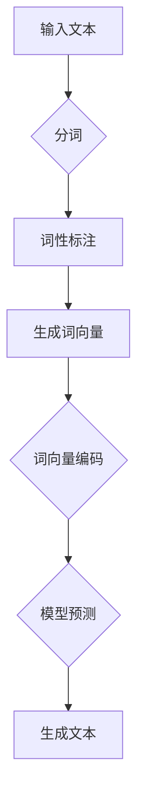
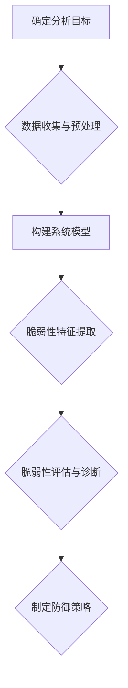

                 

### 文章标题：语言模型在复杂系统脆弱性分析中的应用研究

> 关键词：语言模型、复杂系统、脆弱性分析、人工智能、应用研究

> 摘要：本文深入探讨了语言模型在复杂系统脆弱性分析中的应用。通过介绍语言模型的基本概念、数学基础和常见算法，我们进一步分析了复杂系统的定义、脆弱性特征及分析方法。在此基础上，本文详细阐述了语言模型在复杂系统脆弱性分析中的具体应用，并通过实际项目案例展示了其应用效果。本文旨在为研究人员和实践者提供一种新的复杂系统脆弱性分析思路。

### 引言

随着信息技术的飞速发展，复杂系统在各个领域得到了广泛应用。复杂系统通常具有高度互联性、分布式特征和动态演化能力，这些特点使得它们在带来巨大效益的同时，也面临着严峻的脆弱性风险。系统脆弱性分析是确保复杂系统安全性的关键环节，其目标在于识别系统中潜在的脆弱点，评估系统在面对外部攻击时的抵抗能力，并采取有效的防御措施。

语言模型（Language Model）是自然语言处理（Natural Language Processing, NLP）领域的重要工具，它通过对大量语言数据的统计和学习，能够生成、理解和预测自然语言。近年来，随着深度学习和神经网络技术的发展，语言模型在性能上取得了显著提升，其在复杂系统脆弱性分析中的应用也日益受到关注。

本文旨在研究语言模型在复杂系统脆弱性分析中的应用，通过介绍语言模型的基本理论、复杂系统的脆弱性特征及其分析方法，探讨语言模型如何有效地应用于复杂系统脆弱性分析。本文结构如下：

1. 语言模型基础理论：介绍语言模型的定义、基本概念和常见算法。
2. 复杂系统脆弱性分析理论：探讨复杂系统的定义、脆弱性特征及其分析方法。
3. 语言模型在复杂系统脆弱性分析中的应用：分析语言模型在复杂系统脆弱性分析中的具体应用。
4. 项目实战：通过实际项目案例展示语言模型在复杂系统脆弱性分析中的应用效果。
5. 结论与展望：总结本文的研究成果，并提出未来研究的方向。

### 语言模型基础理论

#### 1.1 语言模型的定义与基本概念

语言模型是自然语言处理中的一个核心概念，它用于对自然语言的统计描述和预测。一个简单的语言模型可以看作是一个概率分布，用于预测下一个单词或字符的概率。在自然语言处理中，语言模型广泛应用于文本生成、机器翻译、语音识别、文本分类等多个领域。

语言模型通常基于大量文本数据训练得到。训练过程包括两个主要步骤：数据预处理和模型训练。在数据预处理阶段，需要对文本进行分词、去停用词、词性标注等操作，以便为模型提供合适的输入数据。在模型训练阶段，可以使用各种机器学习算法，如统计模型、隐马尔可夫模型（HMM）和神经网络模型，来训练语言模型。

#### 1.2 语言模型的数学基础

语言模型的数学基础主要包括概率论和信息论。概率论用于描述语言模型中事件发生的概率，而信息论则用于衡量信息的价值和不确定性。

- **概率论基础**：在语言模型中，常用的概率模型包括马尔可夫模型、n-gram模型等。马尔可夫模型假设当前状态仅与前一状态有关，而n-gram模型则考虑当前状态与前一n个状态的关系。

- **信息论基础**：信息论中的信息熵（Entropy）和条件熵（Conditional Entropy）是评估信息价值和不确定性的重要工具。在语言模型中，信息熵用于衡量一个单词或字符的随机性，而条件熵则用于衡量给定前文情况下下一个单词或字符的不确定性。

#### 1.3 常见语言模型算法

语言模型的发展经历了多个阶段，从早期的统计模型到现代的神经网络模型，各种算法在性能和效果上都有显著提升。

- **n-gram模型**：n-gram模型是最早的语言模型之一，它假设当前单词或字符的概率仅依赖于前n个单词或字符。n-gram模型简单易实现，但存在一个严重的缺陷，即“短文本问题”。当n较大时，模型参数数量呈指数级增长，导致模型过于复杂。

- **隐马尔可夫模型（HMM）**：HMM是一种统计模型，用于处理隐状态和观测值之间的关系。在语言模型中，HMM通过隐状态序列来描述单词序列。虽然HMM能够较好地解决n-gram模型中的短文本问题，但其训练过程复杂，且状态数量可能无法涵盖所有可能的单词序列。

- **随机字段模型（RFM）**：RFM是一种基于概率图模型的语言模型，它通过图结构来描述单词之间的依赖关系。RFM能够有效地处理长文本和长距离依赖问题，但在训练和推理过程中计算复杂度较高。

- **神经网络模型**：现代语言模型主要基于神经网络，如循环神经网络（RNN）、长短期记忆网络（LSTM）和变换器（Transformer）等。这些模型通过引入门控机制、注意力机制和位置编码等，能够有效地捕捉长距离依赖关系和上下文信息。尤其是Transformer模型，由于其并行计算优势和大规模参数训练能力，已经成为当前语言模型的主流架构。

#### 1.4 语言模型的应用场景

语言模型在自然语言处理领域有着广泛的应用，以下是一些典型的应用场景：

- **文本生成**：语言模型可以用于生成文章、故事、对话等自然语言文本。通过训练大规模的语言模型，如GPT-3，可以生成高质量的自然语言文本。

- **机器翻译**：语言模型在机器翻译中的应用主要基于源语言和目标语言之间的概率分布。通过训练双语的n-gram模型或神经网络模型，可以实现高效准确的机器翻译。

- **语音识别**：语言模型在语音识别中用于将语音信号转换为文本。通过结合声学模型和语言模型，可以提高语音识别的准确率和鲁棒性。

- **文本分类**：语言模型可以用于文本分类任务，如情感分析、主题分类等。通过训练分类模型，可以对文本进行分类标注。

- **问答系统**：语言模型在问答系统中用于理解用户的问题并生成相关的答案。通过结合语义理解和信息检索，可以实现高效的问答交互。

#### 1.5 Mermaid流程图：语言模型工作原理

### 复杂系统脆弱性分析理论

#### 2.1 复杂系统的定义与特点

复杂系统是由大量相互作用的子系统组成的系统，这些子系统可能具有非线性、自组织、自适应和复杂反馈等特性。复杂系统通常具有以下特点：

- **高度互联性**：复杂系统中的各个子系统之间通过复杂的网络结构进行相互作用和互联。这种互联性使得系统具有很高的耦合度，一个子系统的变化可能会影响整个系统的运行状态。

- **分布式特征**：复杂系统通常分布在不同的地理位置，其功能和任务由多个子系统共同完成。这种分布性使得系统具有灵活性和可扩展性，但同时也增加了系统的脆弱性。

- **动态演化能力**：复杂系统在运行过程中会不断地适应和调整自身状态，以应对外部环境的变化。这种动态演化能力使得系统具有较高的适应性和灵活性，但也可能导致系统状态的不稳定。

- **异质性**：复杂系统中的各个子系统可能具有不同的功能、结构和行为特性，这种异质性使得系统具有多样性和复杂性。

- **涌现性**：复杂系统中的子系统和整体系统之间存在着非线性相互作用，导致系统整体表现出一些无法从子系统单独特性中推导出来的新特性。这种涌现性是复杂系统的重要特征之一。

#### 2.2 复杂系统的脆弱性特征

复杂系统的脆弱性是指系统在面对外部扰动或内部异常时，无法保持其正常功能和性能的能力。复杂系统的脆弱性特征主要包括以下几个方面：

- **层次性**：复杂系统具有多个层次，每个层次都可能存在脆弱性。从宏观层面看，系统整体的脆弱性可能是由多个层次的脆弱性共同作用而形成的。

- **传播性**：复杂系统中的脆弱性可能通过相互作用和互联关系在系统内部传播。一个子系统的脆弱性可能会影响到其他子系统，甚至导致整个系统崩溃。

- **动态性**：复杂系统的脆弱性是动态变化的，随着外部环境和内部状态的变化，系统的脆弱性特征也会发生变化。

- **多样性**：复杂系统中存在着多种不同类型的脆弱性，这些脆弱性可能具有不同的表现形式和影响范围。

- **累积性**：复杂系统中的脆弱性可能会随着时间的推移逐渐积累，导致系统功能的退化。

#### 2.3 复杂系统脆弱性分析的方法

复杂系统脆弱性分析的方法主要包括以下几种：

- **统计方法**：统计方法通过分析系统历史数据，识别系统中的潜在脆弱性。常用的统计方法包括回归分析、聚类分析、关联规则挖掘等。

- **计算方法**：计算方法通过模拟系统运行过程，评估系统在各种扰动条件下的响应和稳定性。常用的计算方法包括模拟退火、遗传算法、神经网络等。

- **机器学习方法**：机器学习方法通过训练数据模型，自动识别系统中的脆弱性特征。常用的机器学习方法包括支持向量机、决策树、随机森林等。

- **模型分析方法**：模型分析方法通过建立系统数学模型，分析系统在各种条件下的运行状态和响应特性。常用的模型分析方法包括线性回归、非线性优化、稳定性分析等。

#### 2.4 Mermaid流程图：复杂系统脆弱性分析流程

### 语言模型在复杂系统脆弱性分析中的应用

#### 3.1 语言模型在系统安全评估中的应用

系统安全评估是复杂系统脆弱性分析的重要环节，其目标在于识别系统中的潜在安全威胁和脆弱点，评估系统在面对各种攻击时的安全性。语言模型在系统安全评估中的应用主要体现在以下几个方面：

- **安全事件预测**：语言模型可以通过分析系统日志、网络流量等数据，预测潜在的安全事件。通过训练大规模的语言模型，如基于Transformer的模型，可以捕捉到系统中潜在的安全威胁模式，从而提前预警。

- **安全漏洞识别**：语言模型可以用于识别系统中的安全漏洞。通过分析代码、配置文件等数据，语言模型可以检测出潜在的代码漏洞、配置错误等。例如，基于BERT的语言模型可以用于检测代码中的SQL注入漏洞。

- **恶意代码检测**：语言模型可以用于检测恶意代码。通过训练语言模型，可以识别出恶意代码的特征模式，从而有效阻止恶意代码的传播和破坏。

#### 3.2 语言模型在系统行为分析中的应用

系统行为分析是复杂系统脆弱性分析的关键步骤，其目标在于理解系统的运行状态和异常行为。语言模型在系统行为分析中的应用主要体现在以下几个方面：

- **异常检测**：语言模型可以用于检测系统中的异常行为。通过训练语言模型，可以识别出正常系统和异常系统的特征差异，从而有效识别出系统中的异常行为。

- **事件序列预测**：语言模型可以用于预测系统中的事件序列。通过分析系统历史数据，语言模型可以预测系统中可能发生的事件序列，从而提前采取相应的措施。

- **系统状态识别**：语言模型可以用于识别系统当前的状态。通过训练语言模型，可以捕捉到系统状态的变化规律，从而准确识别出系统的当前状态。

#### 3.3 语言模型在复杂系统应急响应中的应用

复杂系统在运行过程中可能会遭受各种攻击和故障，应急响应是保障系统安全稳定运行的重要环节。语言模型在复杂系统应急响应中的应用主要体现在以下几个方面：

- **事件响应决策支持**：语言模型可以用于支持应急响应决策。通过分析系统状态和事件数据，语言模型可以提供最优的应急响应策略，从而提高应急响应的效率和准确性。

- **应急资源调度**：语言模型可以用于优化应急资源调度。通过分析应急资源的需求和可用性，语言模型可以提供最优的资源分配方案，从而有效应对突发事件。

- **事件处置与恢复**：语言模型可以用于事件处置和恢复。通过分析事件数据和系统状态，语言模型可以提供最佳的事件处置方案和恢复策略，从而尽快恢复正常系统运行。

#### 3.4 项目实战：构建基于语言模型的系统脆弱性分析平台

以下是一个实际项目案例，展示了如何构建一个基于语言模型的系统脆弱性分析平台。

**项目背景与目标**

某企业希望通过构建一个系统脆弱性分析平台，实时监测企业内部系统的安全状况，识别潜在的安全威胁和漏洞，并采取相应的防护措施。该平台需要具备以下功能：

- 实时收集和分析系统日志、网络流量等数据。
- 使用语言模型预测潜在的安全事件和漏洞。
- 提供可视化界面，展示系统的脆弱性状态和安全事件趋势。
- 自动生成安全报告，供企业管理人员参考。

**开发环境搭建**

- **编程语言**：Python
- **开发工具**：PyCharm
- **依赖库**：TensorFlow、PyTorch、Scikit-learn、Pandas、Matplotlib等

**数据采集与预处理**

- **数据来源**：系统日志、网络流量、配置文件等。
- **数据处理**：数据清洗、去重、归一化等操作，将数据转换为适合模型训练的格式。

**模型训练与优化**

- **模型选择**：使用Transformer模型，具有强大的文本处理能力。
- **训练过程**：通过训练大量的数据，优化模型参数，提高模型的预测准确性。

**平台功能实现与测试**

- **实时监测**：实时收集和分析系统数据，识别潜在的安全威胁。
- **可视化界面**：展示系统的脆弱性状态和安全事件趋势。
- **自动报告**：生成安全报告，供企业管理人员参考。

**项目小结**

通过实际项目案例，我们展示了如何构建一个基于语言模型的系统脆弱性分析平台。该平台具有实时监测、可视化展示和自动报告等功能，能够帮助企业及时发现和应对潜在的安全威胁。未来，我们还可以进一步优化平台，提高模型的预测准确性和响应速度。

### 最佳实践 tips、小结、注意事项、拓展阅读

**最佳实践 tips**：

1. 选择合适的语言模型：根据实际应用场景和数据特点，选择适合的语言模型，如Transformer模型在处理大规模文本数据时具有较好的性能。

2. 数据预处理：确保数据质量，进行充分的数据预处理，如去除噪声、填补缺失值、归一化等。

3. 模型优化：通过模型调参、正则化、数据增强等方法，提高模型的预测准确性和泛化能力。

**小结**：

本文深入探讨了语言模型在复杂系统脆弱性分析中的应用，介绍了语言模型的基本概念、数学基础和常见算法，分析了复杂系统的定义、脆弱性特征及其分析方法。通过实际项目案例，展示了语言模型在复杂系统脆弱性分析中的应用效果。未来研究可以进一步探讨其他人工智能技术在系统脆弱性分析中的应用，如深度强化学习等。

**注意事项**：

1. 在使用语言模型进行复杂系统脆弱性分析时，需注意模型的可解释性，确保分析结果的合理性和可信度。

2. 复杂系统的脆弱性分析是一个持续的过程，需要不断更新和优化分析模型，以应对不断变化的威胁环境。

**拓展阅读**：

1. 《深度学习》 - Goodfellow, I., Bengio, Y., & Courville, A.
2. 《自然语言处理综论》 - Jurafsky, D., & Martin, J. H.
3. 《复杂系统与系统工程》 - Bar-Yam, Y.

### 作者信息

作者：AI天才研究院/AI Genius Institute & 禅与计算机程序设计艺术 /Zen And The Art of Computer Programming

---

本文通过详细的步骤和实例，展示了语言模型在复杂系统脆弱性分析中的应用。读者可以根据本文的内容，进一步探索相关领域的研究，为复杂系统的安全性与稳定性提供更加有效的解决方案。

