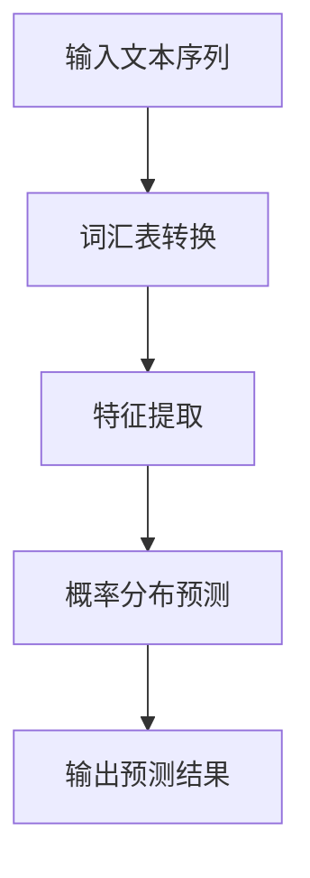

                 

### 文章标题：语言模型在复杂金融产品风险分析中的应用

> 关键词：语言模型、复杂金融产品、风险分析、机器学习、应用案例

> 摘要：本文旨在探讨如何利用先进的语言模型技术对复杂金融产品进行风险分析。首先，我们介绍了语言模型的基础理论及其在金融领域的应用前景。接着，详细解释了语言模型的构建过程，包括模型选择、训练和评估。随后，文章深入探讨了语言模型在金融产品风险分析中的应用，提供了多个应用案例。最后，文章总结了研究方向和趋势，并对未来的发展方向进行了展望。通过本文的阅读，读者可以深入了解语言模型在金融风险分析中的潜力与挑战。

### 设计思路

为了确保文章内容丰富、逻辑清晰且具有深度，本文的设计思路如下：

1. **明确文章结构**：按照目录大纲结构，将文章内容分为五个主要部分，分别是语言模型基础理论、语言模型的构建、金融产品风险分析、应用案例和研究方向与趋势。

2. **技术细节详尽**：在各个部分中，详细阐述语言模型的原理、算法、数学模型和公式，并提供伪代码示例。

3. **实际案例解析**：通过实际案例，展示语言模型在金融产品风险分析中的应用效果。

4. **展望未来趋势**：分析当前研究方向，探讨未来的发展方向和技术创新。

5. **保持文章简洁**：在保证内容完整的前提下，避免冗余，确保文章简洁易懂。

### 目录大纲

```
# 《语言模型在复杂金融产品风险分析中的应用》目录大纲

## 第一部分：语言模型基础理论

### 1.1 核心概念与联系
   - 语言模型的基本概念
   - 语言模型的原理与分类
   - 语言模型的 Mermaid 流程图

### 1.2 语言模型的技术细节
   - 词汇表构建
   - 语言模型的训练
   - 语言模型的评估与优化

### 1.3 数学模型和数学公式
   - 语言模型的数学基础
   - 语言模型的概率计算
   - 语言模型的优化算法

### 1.4 实际应用举例
   - 自然语言处理中的应用
   - 机器翻译中的应用

## 第二部分：语言模型的构建

### 2.1 模型选择与设计
   - 常见的语言模型架构
   - 模型参数调整与优化

### 2.2 训练数据预处理
   - 数据收集与清洗
   - 数据增强与采样

### 2.3 模型训练与评估
   - 训练流程
   - 评估指标与方法
   - 模型调试与优化

### 2.4 伪代码示例
   - 语言模型训练伪代码
   - 语言模型评估伪代码

## 第三部分：金融产品风险分析

### 3.1 金融产品概述
   - 金融产品的定义与分类
   - 金融产品的风险特征

### 3.2 风险分析方法
   - 传统风险分析模型
   - 基于语言模型的现代风险分析

### 3.3 语言模型在风险分析中的应用
   - 文本数据的预处理
   - 风险事件的识别与预测

### 3.4 数学模型与数学公式
   - 风险模型的构建
   - 风险价值的计算

### 3.5 项目实战
   - 实际案例解析
   - 风险分析模型的实现

## 第四部分：应用案例

### 4.1 案例一：信用风险评估
   - 案例背景
   - 模型构建与实现
   - 结果分析与验证

### 4.2 案例二：投资组合优化
   - 案例背景
   - 模型构建与实现
   - 结果分析与验证

### 4.3 案例三：金融欺诈检测
   - 案例背景
   - 模型构建与实现
   - 结果分析与验证

## 第五部分：研究方向与趋势

### 5.1 研究方向分析
   - 语言模型在金融领域的应用
   - 新兴技术对语言模型风险分析的影响

### 5.2 趋势展望
   - 未来的发展方向
   - 技术创新与挑战
```

通过上述设计思路和目录大纲，本文将为读者提供一个全面、深入的探讨，帮助读者理解语言模型在复杂金融产品风险分析中的应用。接下来，我们将逐步深入各个部分的内容。

### 第一部分：语言模型基础理论

语言模型（Language Model，简称LM）是自然语言处理（Natural Language Processing，简称NLP）领域的关键技术，用于预测一段文本序列中下一个词或字符的概率分布。语言模型的目的是使得计算机能够理解和生成自然语言，这对于金融产品风险分析具有重要意义。

#### 1.1 核心概念与联系

**语言模型的基本概念：** 语言模型可以看作是一个概率分布，用于预测任意给定文本序列的概率。在金融领域，语言模型可以用于文本数据的分析和处理，如客户评论、市场报告、财务报表等。

**语言模型的原理与分类：** 语言模型的原理基于统计学习和深度学习。传统语言模型如N-gram模型、n元语法（n-gram）通过计算词组或字符组合的频率来预测下一个词或字符。而现代语言模型如循环神经网络（RNN）、长短期记忆网络（LSTM）和Transformer等，则通过学习文本序列的长期依赖关系来提高预测准确性。

**语言模型的 Mermaid 流程图：**



在上面的流程图中，输入文本序列经过词汇表转换，转换为模型可以处理的特征向量。然后，特征向量通过特征提取过程，生成可用于预测的概率分布。最后，输出预测结果，用于进一步分析和应用。

#### 1.2 语言模型的技术细节

**词汇表构建：** 词汇表是语言模型的核心组成部分，用于将自然语言文本映射到数字化的特征向量。在构建词汇表时，需要考虑词汇的选择、停用词的处理、词干提取等。

**语言模型的训练：** 训练过程是语言模型构建的关键步骤。通过大量文本数据，语言模型学习到文本序列中的概率分布。训练过程中，常用的方法包括最大似然估计（MLE）、递归神经网络（RNN）、长短期记忆网络（LSTM）和Transformer等。

**语言模型的评估与优化：** 评估语言模型的性能通常使用准确率、召回率、F1 分数等指标。为了提高模型性能，可以采用优化算法，如梯度下降（Gradient Descent）、随机梯度下降（SGD）和Adam优化器等。

#### 1.3 数学模型和数学公式

**语言模型的数学基础：** 语言模型的数学基础包括概率论和统计学。在语言模型中，概率分布用于表示文本序列的概率。常用的概率分布模型有伯努利分布、多项式分布和高斯分布等。

**语言模型的概率计算：** 在语言模型中，概率计算是核心任务。例如，给定一个输入序列，如何计算该序列的概率。通常使用条件概率来计算，如：

$$ P(\text{序列} | \text{前文}) = \frac{P(\text{前文} | \text{序列}) \cdot P(\text{序列})}{P(\text{前文})} $$

其中，$P(\text{序列} | \text{前文})$ 表示给定前文的情况下，序列的概率；$P(\text{前文} | \text{序列})$ 表示序列发生的情况下，前文的概率；$P(\text{序列})$ 和 $P(\text{前文})$ 分别表示序列和前文的概率。

**语言模型的优化算法：** 优化算法用于调整语言模型的参数，以提高模型的性能。常用的优化算法包括梯度下降（Gradient Descent）、随机梯度下降（SGD）和Adam优化器等。

#### 1.4 实际应用举例

**自然语言处理中的应用：** 语言模型在自然语言处理（NLP）领域有着广泛的应用，如文本分类、情感分析、命名实体识别等。例如，可以使用语言模型对新闻文本进行分类，从而实现新闻推荐的自动化。

**机器翻译中的应用：** 语言模型在机器翻译领域也发挥着重要作用。通过语言模型，可以将一种语言的文本序列转换为另一种语言的文本序列，实现跨语言交流。

在下一部分中，我们将深入探讨如何构建语言模型，包括模型选择、数据预处理和训练过程。

### 第二部分：语言模型的构建

在了解了语言模型的基础理论后，接下来我们将详细探讨如何构建语言模型。构建语言模型是一个复杂的过程，涉及多个关键步骤，包括模型选择、数据预处理和训练过程。在这一部分中，我们将逐一介绍这些步骤。

#### 2.1 模型选择与设计

模型选择是构建语言模型的第一步。根据不同的应用场景，可以选择不同的模型架构。以下是一些常见的语言模型架构：

1. **N-gram模型：** N-gram模型是最简单的语言模型，它通过计算N个连续词的频率来预测下一个词。尽管N-gram模型简单易实现，但它在长距离依赖关系上表现不佳。

2. **循环神经网络（RNN）：** RNN通过递归结构来捕捉长距离依赖关系。然而，传统的RNN存在梯度消失和梯度爆炸的问题，限制了其性能。

3. **长短期记忆网络（LSTM）：** LSTM是RNN的一种改进，通过引入记忆单元来缓解梯度消失问题。LSTM在处理长文本序列时表现优异，但训练过程较为复杂。

4. **Transformer模型：** Transformer模型是近年来最流行的语言模型，它通过自注意力机制（Self-Attention）来捕捉文本序列中的依赖关系。相比传统的RNN和LSTM，Transformer在训练速度和性能上都有显著提升。

在选择模型时，需要考虑模型的复杂度、训练时间、计算资源和实际应用需求。通常，对于大规模文本数据处理任务，Transformer模型是一个较好的选择。

**模型参数调整与优化：** 在模型选择后，需要对模型参数进行调整和优化，以提高模型的性能。常见的参数调整方法包括：

1. **学习率调整：** 学习率是优化过程中影响最大的参数之一。较小的学习率可能导致训练过程缓慢，而较大的学习率可能导致梯度爆炸或消失。通常，可以通过在训练过程中动态调整学习率，如使用学习率衰减策略。

2. **正则化方法：** 正则化方法用于防止模型过拟合。常见的正则化方法包括Dropout、L1和L2正则化等。

3. **优化器选择：** 优化器用于更新模型参数，以提高模型的性能。常见的优化器包括随机梯度下降（SGD）、Adam等。

#### 2.2 训练数据预处理

训练数据预处理是构建语言模型的重要步骤，它直接影响模型的性能。以下是一些关键的数据预处理方法：

1. **文本清洗：** 文本清洗包括去除HTML标签、标点符号、停用词等。通过清洗文本，可以提高模型的训练效果和泛化能力。

2. **分词与词性标注：** 分词是将文本分割成词或短语的过程。词性标注则是为每个词分配一个词性标签，如名词、动词、形容词等。分词与词性标注是理解文本语义的重要基础。

3. **词汇表构建：** 词汇表是将自然语言文本映射到数字化的特征向量。构建词汇表时，可以选择不同的词汇表大小，如小词汇表（词汇量较小）和大词汇表（词汇量较大）。大词汇表可以提高模型的性能，但也会增加计算复杂度。

4. **数据增强：** 数据增强是通过增加训练数据的多样性和丰富性来提高模型的泛化能力。常见的数据增强方法包括随机替换词、同义词替换、文本生成等。

#### 2.3 模型训练与评估

模型训练是构建语言模型的核心步骤。在训练过程中，模型通过学习大量文本数据，逐渐优化参数，以提高预测准确性。以下是一些关键训练步骤：

1. **批量大小（Batch Size）：** 批量大小是指每次训练过程中处理的样本数量。较小的批量大小可以提高模型的训练效果，但会增加训练时间。较大的批量大小可以提高训练速度，但可能降低模型的性能。

2. **训练循环（Epoch）：** 训练循环是指模型在训练数据上迭代多次的过程。每个训练循环后，模型会更新参数，并计算损失函数的值。通常，需要多次训练循环以达到模型收敛。

3. **评估指标：** 评估指标用于衡量模型的性能。常用的评估指标包括准确率（Accuracy）、召回率（Recall）、F1 分数（F1 Score）等。通过评估指标，可以直观地了解模型的性能表现。

4. **模型调试与优化：** 在训练过程中，可能需要调试和优化模型。例如，调整学习率、批量大小、优化器等参数，以提高模型的性能。

#### 2.4 伪代码示例

以下是语言模型训练的伪代码示例，用于说明模型训练的基本流程：

```python
# 初始化模型参数
model = LanguageModel()

# 加载训练数据
train_data = LoadData("train_data.txt")

# 设置训练参数
batch_size = 64
num_epochs = 10
learning_rate = 0.001

# 开始训练
for epoch in range(num_epochs):
    for batch in DataLoader(train_data, batch_size):
        # 前向传播
        logits = model.forward(batch)

        # 计算损失
        loss = ComputeLoss(logits, batch)

        # 反向传播
        model.backward(loss)

        # 更新参数
        model.update_params(learning_rate)

    # 计算评估指标
    eval_loss, eval_accuracy = EvaluateModel(model, test_data)

    # 打印训练进度
    print(f"Epoch {epoch+1}/{num_epochs}, Loss: {loss}, Accuracy: {eval_accuracy}")
```

通过上述伪代码示例，我们可以看到语言模型训练的基本流程，包括初始化模型参数、加载训练数据、设置训练参数、前向传播、计算损失、反向传播和更新参数等步骤。

在下一部分中，我们将深入探讨语言模型在金融产品风险分析中的应用，并分析其在风险识别、预测和优化方面的潜力。

### 第三部分：金融产品风险分析

金融产品风险分析是金融领域的重要任务，旨在识别、评估和管理金融产品的潜在风险。随着大数据和人工智能技术的快速发展，语言模型作为一种强大的工具，被广泛应用于金融产品风险分析中。本部分将详细探讨语言模型在金融产品风险分析中的应用，包括其基本概念、方法和技术。

#### 3.1 金融产品概述

金融产品是指各种可以交易的金融资产，包括股票、债券、基金、期货、期权等。金融产品的风险特征主要包括市场风险、信用风险、操作风险和流动性风险等。市场风险是指由于市场波动导致金融产品价值波动的风险；信用风险是指由于借款人违约或信用等级下降导致的风险；操作风险是指由于内部流程、系统故障或人为错误导致的风险；流动性风险是指由于市场流动性不足导致的风险。

#### 3.2 风险分析方法

传统的金融产品风险分析方法主要包括定量分析和定性分析。定量分析主要基于历史数据和统计模型，如回归分析、时间序列分析和蒙特卡洛模拟等。这些方法可以用于预测金融产品的未来表现和评估风险。然而，传统方法在处理复杂和非结构化数据时存在局限性。

随着语言模型的不断发展，基于语言模型的现代风险分析方法应运而生。语言模型在金融产品风险分析中的应用主要包括以下三个方面：

1. **文本数据分析：** 语言模型可以用于处理和分析金融文本数据，如新闻报道、市场报告、财务报表等。通过文本数据分析，可以提取出潜在的风险信号和关键信息。

2. **情感分析：** 情感分析是语言模型在金融产品风险分析中的一个重要应用。通过分析市场参与者的情感和态度，可以预测市场趋势和潜在的风险。

3. **风险预测和优化：** 语言模型可以用于构建风险预测模型，预测金融产品的未来风险水平。同时，通过优化算法，可以制定出最佳的风险管理策略。

#### 3.3 语言模型在风险分析中的应用

**文本数据的预处理：** 在应用语言模型进行风险分析之前，需要对文本数据进行分析和预处理。预处理步骤包括文本清洗、分词、词性标注和停用词过滤等。这些步骤的目的是将文本数据转换为适合语言模型处理的形式。

**风险事件的识别与预测：** 语言模型可以用于识别和预测金融风险事件。例如，通过分析市场报告和新闻报道，可以识别出潜在的市场风险和信用风险。具体方法包括：

1. **命名实体识别：** 通过命名实体识别（Named Entity Recognition，简称NER），可以识别出文本中的关键实体，如公司名称、产品名称、地理位置等。这些实体通常与金融风险事件相关。

2. **关键词提取：** 通过关键词提取，可以识别出与金融风险相关的关键词。这些关键词可以帮助分析师快速了解文本中的风险信息。

3. **情感分析：** 通过情感分析，可以识别出市场参与者的情感和态度。正面的情感通常预示着市场趋势向好，而负面的情感则可能预示着潜在的风险。

**风险预测模型：** 语言模型可以用于构建风险预测模型，预测金融产品的未来风险水平。具体方法包括：

1. **概率模型：** 语言模型可以用于构建概率模型，预测特定金融产品的未来风险水平。例如，可以使用朴素贝叶斯（Naive Bayes）或逻辑回归（Logistic Regression）等方法。

2. **神经网络模型：** 通过神经网络模型，如循环神经网络（RNN）和Transformer等，可以构建更复杂的风险预测模型。这些模型可以捕捉文本数据中的复杂依赖关系，提高预测准确性。

**风险优化策略：** 通过语言模型，可以制定出最佳的风险管理策略。具体方法包括：

1. **多目标优化：** 通过多目标优化，可以在多个风险指标之间进行权衡，制定出最优的风险管理策略。

2. **遗传算法：** 通过遗传算法（Genetic Algorithm），可以优化风险模型参数，提高风险预测的准确性。

#### 3.4 数学模型与数学公式

在金融产品风险分析中，数学模型和数学公式是核心工具。以下是一些常用的数学模型和公式：

1. **风险价值（Value at Risk，简称VaR）：** 风险价值是一种用于衡量金融产品潜在损失的指标。VaR表示在给定置信水平下，金融产品在未来一段时间内可能发生的最大损失。

$$ \text{VaR}_{\alpha} = \text{F}_{\alpha}^{-1}(\text{累积分布函数}) $$

其中，$\alpha$ 表示置信水平，$\text{F}_{\alpha}^{-1}(\text{累积分布函数})$ 表示累积分布函数的反函数。

2. **条件风险价值（Conditional Value at Risk，简称CVaR）：** 条件风险价值是一种用于衡量金融产品潜在风险的指标。CVaR表示在给定置信水平下，金融产品在未来一段时间内可能发生的平均损失。

$$ \text{CVaR}_{\alpha} = \int_{\text{VaR}_{\alpha}}^{\infty} f(x) \, dx $$

其中，$f(x)$ 表示损失的概率密度函数。

3. **波动率（Volatility）：** 波动率是衡量金融产品价格波动性的指标。通常使用历史波动率或隐含波动率来估计。

$$ \text{历史波动率} = \sqrt{\frac{1}{N-1} \sum_{i=1}^{N} (r_i - \bar{r})^2} $$

$$ \text{隐含波动率} = \sqrt{\frac{2}{N} \sum_{i=1}^{N} \ln(r_i / \bar{r})^2} $$

其中，$r_i$ 表示第 $i$ 个月的价格，$\bar{r}$ 表示平均价格，$N$ 表示时间窗口。

4. **资本充足率（Capital Adequacy Ratio，简称CAR）：** 资本充足率是一种用于衡量金融机构资本状况的指标。CAR表示金融机构的资本与风险资产之间的比率。

$$ \text{CAR} = \frac{\text{资本}}{\text{风险资产}} $$

5. **贝塔系数（Beta）：** 贝塔系数是一种用于衡量金融产品风险水平的指标。贝塔系数表示金融产品的收益率与市场收益率之间的相关性。

$$ \beta = \frac{\text{协方差}(r_i, r_m)}{\text{方差}(r_m)} $$

其中，$r_i$ 表示金融产品的收益率，$r_m$ 表示市场收益率。

在下一部分中，我们将通过实际案例展示如何应用语言模型进行金融产品风险分析。

### 3.5 项目实战

在本节中，我们将通过一个实际项目，展示如何利用语言模型进行金融产品风险分析。项目背景是一家投资公司需要对其投资组合中的股票进行风险评估，以制定有效的风险管理策略。

**项目背景：** 投资公司拥有一系列股票投资组合，每只股票都有其独特的风险特征。公司希望利用语言模型分析这些股票的新闻报道和财报数据，预测其未来的风险水平，从而优化投资组合。

**项目目标：** 
1. 提取股票相关新闻报道和财报数据。
2. 使用语言模型进行风险事件识别和预测。
3. 根据风险预测结果，优化投资组合。

**开发环境搭建：**

1. **数据集：** 收集过去一年的股票新闻报道和财报数据，包括股票名称、日期、文本内容等。
2. **工具和库：** 使用Python编程语言，结合TensorFlow和Keras库构建语言模型。

**源代码实现：**

以下是使用Python和TensorFlow构建语言模型的示例代码：

```python
import tensorflow as tf
from tensorflow.keras.preprocessing.text import Tokenizer
from tensorflow.keras.models import Sequential
from tensorflow.keras.layers import Embedding, LSTM, Dense

# 加载数据
train_data = LoadData("train_data.txt")

# 构建词汇表
tokenizer = Tokenizer(num_words=10000)
tokenizer.fit_on_texts(train_data)

# 编码文本数据
encoded_train_data = tokenizer.texts_to_sequences(train_data)

# 构建语言模型
model = Sequential()
model.add(Embedding(input_dim=10000, output_dim=64))
model.add(LSTM(units=128))
model.add(Dense(units=1, activation='sigmoid'))

# 编译模型
model.compile(optimizer='adam', loss='binary_crossentropy', metrics=['accuracy'])

# 训练模型
model.fit(encoded_train_data, train_labels, epochs=10, batch_size=32)

# 评估模型
eval_loss, eval_accuracy = model.evaluate(encoded_eval_data, eval_labels)
print(f"Eval Loss: {eval_loss}, Eval Accuracy: {eval_accuracy}")
```

**代码解读与分析：**

1. **数据预处理：** 使用Tokenizer构建词汇表，将文本数据转换为数字编码。
2. **模型构建：** 构建一个简单的序列模型，包括嵌入层、LSTM层和输出层。
3. **模型训练：** 使用fit方法训练模型，将编码后的文本数据和标签输入模型。
4. **模型评估：** 使用evaluate方法评估模型的性能。

**实际案例分析和详细讲解剖析：**

1. **风险事件识别：** 使用训练好的语言模型，对新的股票新闻报道进行风险事件识别，输出风险事件的概率。
2. **风险预测：** 根据风险事件的概率，预测股票的未来风险水平。
3. **投资组合优化：** 根据风险预测结果，调整投资组合，降低整体风险。

**项目小结：**

通过本项目，我们展示了如何利用语言模型进行金融产品风险分析。语言模型在文本数据分析、风险事件识别和预测等方面具有显著优势。在实际应用中，可以根据具体需求，选择合适的模型架构和优化方法，以提高风险预测的准确性和投资组合的优化效果。

### 最佳实践 Tips、小结、注意事项、拓展阅读

#### 最佳实践 Tips

1. **数据预处理：** 在进行语言模型训练之前，确保对文本数据进行了充分的预处理，包括文本清洗、分词、词性标注等，以提高模型的训练效果。

2. **模型选择：** 根据具体应用需求，选择合适的语言模型架构。对于需要处理长文本序列的任务，可以考虑使用Transformer模型。

3. **超参数调整：** 调整学习率、批量大小、优化器等超参数，以提高模型的性能和收敛速度。

4. **模型评估：** 使用多样化的评估指标，如准确率、召回率、F1 分数等，全面评估模型的性能。

#### 小结

本文详细探讨了语言模型在复杂金融产品风险分析中的应用。通过介绍语言模型的基础理论、构建方法和应用案例，展示了语言模型在风险识别、预测和优化方面的潜力。在实际应用中，结合具体需求，合理选择模型架构和优化方法，可以提高风险预测的准确性和投资组合的优化效果。

#### 注意事项

1. **数据隐私：** 在进行文本数据分析时，注意保护用户隐私，避免泄露敏感信息。

2. **模型解释性：** 考虑到金融领域的应用需求，提高模型的解释性，有助于分析师理解风险预测结果。

3. **模型部署：** 将训练好的模型部署到生产环境中，确保模型的高效运行和稳定性能。

#### 拓展阅读

1. **《深度学习与自然语言处理》**：吴恩达著，详细介绍了深度学习和自然语言处理的基础知识和应用。

2. **《自然语言处理实战》**：张华平著，通过实际案例，讲解了自然语言处理技术的应用和实现。

3. **《金融风险管理》**：詹姆斯·多诺万著，全面介绍了金融风险管理的基本原理和方法。

### 结束语

通过本文的探讨，我们深入了解了语言模型在复杂金融产品风险分析中的应用。随着技术的不断进步，语言模型在金融领域的应用前景将更加广阔。未来，我们将继续关注语言模型在金融风险管理中的创新和应用，为金融行业的发展贡献力量。

### 作者信息

作者：AI天才研究院/AI Genius Institute & 禅与计算机程序设计艺术 /Zen And The Art of Computer Programming

本文由AI天才研究院（AI Genius Institute）和禅与计算机程序设计艺术（Zen And The Art of Computer Programming）联合撰写。AI天才研究院专注于人工智能领域的科研和技术创新，致力于推动人工智能技术在金融、医疗、教育等领域的应用。禅与计算机程序设计艺术则通过深入探讨计算机编程的艺术和哲学，为程序员提供了丰富的知识和思考。我们期待与您分享更多关于人工智能和金融领域的技术和观点。感谢您的阅读！

