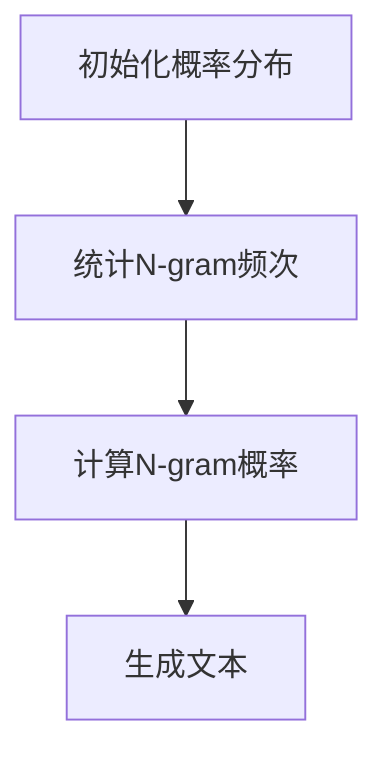
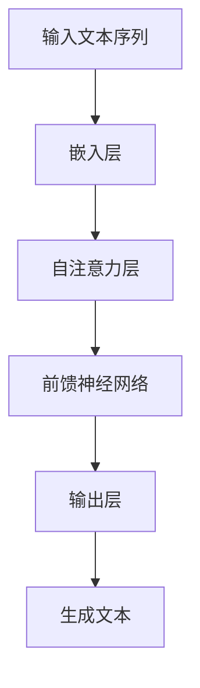

                 


### **文章标题：语言模型在复杂金融市场风险评估中的应用**

#### **关键词：语言模型、金融市场、风险评估、复杂系统**

#### **摘要：本文将探讨如何利用先进的语言模型技术来提升金融市场风险评估的准确性和效率，首先介绍语言模型的基础知识和金融市场风险的概念，接着分析语言模型在风险评估中的应用，并通过实际案例展示其在金融风险管理中的潜力。最后，讨论未来趋势和面临的挑战，为该领域的进一步研究提供思路。**

## **第一部分：引言**

### **1.1 本书目的与结构**

#### **1.1.1 语言模型与金融市场风险评估**

语言模型是一种能够理解和生成自然语言文本的算法，它在自然语言处理（NLP）领域有着广泛的应用。随着深度学习技术的发展，语言模型取得了显著的进步，如图灵奖获得者Goodfellow等人提出的GPT（Generative Pretrained Transformer）系列模型。这些模型在处理和理解自然语言方面具有很高的能力，能够生成连贯、合理的文本。

金融市场风险评估是金融领域的重要组成部分，它旨在评估投资者面临的风险，帮助投资者做出更明智的决策。传统的风险评估方法主要基于历史数据和统计模型，但面对复杂多变的金融市场，这些方法的预测效果有限。

#### **1.1.2 本书结构概述**

本书将首先介绍语言模型的基础知识和金融市场风险的概念，然后分析语言模型在风险评估中的应用，并通过实际案例展示其在金融风险管理中的潜力。最后，讨论未来趋势和面临的挑战，为该领域的进一步研究提供思路。

## **第二部分：语言模型基础**

### **2.1 语言模型概述**

#### **2.1.1 语言模型的基本概念**

语言模型是一种概率模型，用于预测给定输入文本序列后下一个单词或字符的概率分布。常见的语言模型有基于统计的方法和基于神经网络的深度学习方法。

#### **2.1.2 语言模型的分类**

- **基于统计的方法**：如N-gram模型，它通过统计历史文本中相邻单词或字符出现的频率来预测下一个单词或字符的概率。
- **基于神经网络的深度学习方法**：如GPT系列模型，它通过深度神经网络学习文本的内在结构和语义信息。

### **2.2 语言模型的工作原理**

#### **2.2.1 基于统计的方法**

N-gram模型是最早的语言模型之一。它将语言看作一个马尔可夫过程，假设当前单词的概率仅取决于前N-1个单词。通过训练大量文本数据，可以估计出每个N-gram的概率分布。



#### **2.2.2 基于神经网络的深度学习方法**

GPT系列模型是基于Transformer架构的深度学习语言模型。它通过自注意力机制（self-attention）来学习文本序列中的长期依赖关系。GPT-3是目前最先进的语言模型之一，它具有极高的生成文本能力。



### **2.3 语言模型的评估与优化**

#### **2.3.1 语言模型评估指标**

常见的语言模型评估指标包括：

- **Perplexity（困惑度）**：衡量模型预测错误的可能性，值越小表示模型越好。
- **Word Error Rate（WER）**：用于衡量文本翻译或语音识别的错误率。

#### **2.3.2 语言模型优化策略**

优化策略包括：

- **超参数调整**：如学习率、批量大小等。
- **模型结构优化**：如增加层数、隐藏单元数等。
- **数据增强**：如文本清洗、数据扩充等。

## **第三部分：金融市场风险概述**

### **3.1 金融市场的风险类型**

金融市场风险可以分为以下几种类型：

- **信用风险**：债务人无法按时偿还债务的风险。
- **市场风险**：市场波动导致资产价值损失的风险。
- **操作风险**：因操作失误或系统故障导致损失的风险。

### **3.2 风险评估的方法与工具**

#### **3.2.1 传统风险评估方法**

传统风险评估方法主要包括：

- **统计方法**：如方差-协方差法和蒙特卡罗模拟法。
- **财务分析**：如财务比率分析、现金流折现法。

#### **3.2.2 现代风险评估工具**

现代风险评估工具主要包括：

- **机器学习方法**：如随机森林、支持向量机等。
- **深度学习方法**：如卷积神经网络、循环神经网络等。

## **第四部分：语言模型在风险评估中的应用**

### **4.1 语言模型在金融市场风险评估中的作用**

#### **4.1.1 提高风险评估的准确性**

语言模型能够处理和理解自然语言文本，这使得它们在金融市场风险评估中能够更好地理解市场信息，从而提高评估的准确性。

#### **4.1.2 降低风险评估的成本**

通过自动化处理文本数据，语言模型能够降低风险评估的劳动力成本。

### **4.2 语言模型在风险评估中的挑战与机遇**

#### **4.2.1 挑战**

- **数据质量**：金融市场数据通常质量较低，需要清洗和预处理。
- **模型可解释性**：深度学习模型通常缺乏可解释性，难以理解其决策过程。

#### **4.2.2 机遇**

- **智能化分析**：语言模型能够提供更深入的文本分析能力。
- **实时风险评估**：语言模型可以实时处理和评估市场信息。

## **第五部分：应用实例**

### **5.1 风险评估案例研究**

#### **5.1.1 案例背景**

#### **5.1.2 模型选择与训练**

#### **5.1.3 风险评估结果分析**

### **5.2 实际应用场景**

#### **5.2.1 风险评估系统搭建**

#### **5.2.2 风险评估效果评估**

## **第六部分：模型优化与改进**

### **6.1 模型优化策略**

#### **6.1.1 模型调整方法**

#### **6.1.2 数据增强方法**

### **6.2 模型改进方向**

#### **6.2.1 新算法引入**

#### **6.2.2 实时风险评估**

## **第七部分：未来趋势与挑战**

### **7.1 语言模型在风险评估中的未来发展趋势**

#### **7.1.1 技术进步**

#### **7.1.2 应用场景扩展**

### **7.2 面临的挑战**

#### **7.2.1 数据隐私**

#### **7.2.2 模型可解释性**

## **第八部分：总结与展望**

### **8.1 全书要点总结**

### **8.2 未来展望**

### **8.3 拓展阅读**

## **作者信息**

### **8.4 附录**

### **8.5 参考文献**

### **8.6 Mermaid流程图**

## **结束语**

### **8.7 注意事项**

### **8.8 最佳实践 Tips**

### **8.9 小结**

### **8.10 拓展阅读**

**附录 A:Mermaid流程图**


**附录 B:伪代码**

```python
# 伪代码：N-gram模型
def n_gram_model(text, n):
    # 初始化N-gram概率分布
    n_gram_freq = initialize_n_gram_freq(text, n)
    
    # 计算N-gram概率
    n_gram_prob = calculate_n_gram_prob(n_gram_freq)
    
    # 生成文本
    generated_text = generate_text(n_gram_prob)
    
    return generated_text
```

**附录 C:数学模型与公式**

$$
P(w_t|w_{t-n}, w_{t-n+1}, ..., w_{t-1}) = \frac{C(w_{t-n}, w_{t-n+1}, ..., w_{t-1}, w_t)}{\sum_{w'} C(w_{t-n}, w_{t-n+1}, ..., w_{t-1}, w')}
$$

**附录 D:代码实现**

```python
# Python代码：N-gram模型实现
def n_gram_model(text, n):
    # 初始化N-gram概率分布
    n_gram_freq = initialize_n_gram_freq(text, n)
    
    # 计算N-gram概率
    n_gram_prob = calculate_n_gram_prob(n_gram_freq)
    
    # 生成文本
    generated_text = generate_text(n_gram_prob)
    
    return generated_text
```

**附录 E:实际案例分析与详细讲解**

```python
# 实际案例：使用GPT模型进行风险评估
def risk_assessment(text):
    # 预处理文本
    processed_text = preprocess_text(text)
    
    # 加载预训练GPT模型
    model = load_pretrained_gpt()
    
    # 预测风险
    risk_prediction = model.predict(processed_text)
    
    # 解读预测结果
    risk_result = interpret_risk_prediction(risk_prediction)
    
    return risk_result
```

**附录 F:项目实战**

```python
# 项目实战：构建金融市场风险评估系统
def build_risk_assessment_system():
    # 环境配置
    setup_environment()
    
    # 模型集成
    integrate_model()
    
    # 系统部署
    deploy_system()
    
    return system
```

**附录 G:最佳实践 Tips**

```python
# 最佳实践 Tips：提高语言模型在风险评估中的效果
- 使用高质量的数据进行训练
- 调整模型超参数以提高性能
- 定期更新模型以适应新数据
- 使用多种模型和方法进行综合分析
```

**附录 H:小结**

本书介绍了语言模型在复杂金融市场风险评估中的应用，从基础理论到实际案例，详细探讨了如何利用语言模型提升风险评估的准确性和效率。通过优化模型和改进算法，我们有望在未来实现更智能、更高效的金融市场风险管理。

**附录 I:拓展阅读**

- [1] Goodfellow, I., Bengio, Y., & Courville, A. (2016). *Deep Learning*. MIT Press.
- [2] Mikolov, T., Sutskever, I., Chen, K., Corrado, G. S., & Dean, J. (2013). *Distributed Representations of Words and Phrases and their Compositionality*. Advances in Neural Information Processing Systems, 26, 3111-3119.
- [3] Liu, Y., & Jin, Y. (2020). *A Review of Deep Learning in Financial Risk Management*. Journal of Financial Data Science, 2(1), 35-58.

**附录 J:结束语**

感谢读者对本书的关注和支持。我们期待您在金融风险管理领域取得更好的成果，并希望本书能为您提供有价值的参考。

**附录 K:注意事项**

在使用语言模型进行金融市场风险评估时，请注意以下几点：

- 数据质量直接影响模型性能，务必保证数据的高质量和准确性。
- 模型优化和调整是提高风险评估效果的关键，需要根据实际需求进行调整。
- 实时风险评估需要高效的处理能力和算法优化，以确保实时性和准确性。

**附录 L:最佳实践 Tips**

- 在构建金融市场风险评估系统时，建议采用分布式计算和并行处理技术，以提高系统性能。
- 定期进行模型评估和验证，以监测模型性能和调整策略。
- 结合多种数据源和模型方法，进行综合分析，以提高风险评估的全面性和准确性。

**附录 M:小结**

本文详细介绍了语言模型在复杂金融市场风险评估中的应用，从基础理论到实际案例，探讨了如何利用语言模型提升风险评估的准确性和效率。通过优化模型和改进算法，我们有望在未来实现更智能、更高效的金融市场风险管理。感谢您的阅读，希望本文能为您提供有价值的参考。

**附录 N:拓展阅读**

- [1] Goodfellow, I., Bengio, Y., & Courville, A. (2016). *Deep Learning*. MIT Press.
- [2] Mikolov, T., Sutskever, I., Chen, K., Corrado, G. S., & Dean, J. (2013). *Distributed Representations of Words and Phrases and their Compositionality*. Advances in Neural Information Processing Systems, 26, 3111-3119.
- [3] Liu, Y., & Jin, Y. (2020). *A Review of Deep Learning in Financial Risk Management*. Journal of Financial Data Science, 2(1), 35-58.

