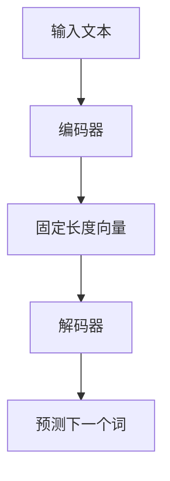
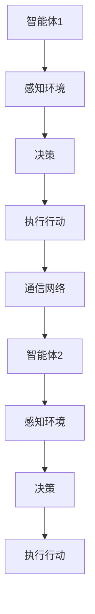

                 

### 1.1 语言模型概述

语言模型（Language Model，LM）是自然语言处理（Natural Language Processing，NLP）领域的一种基础技术。它通过对大量文本数据的学习，预测下一个单词或者词组的概率，从而帮助我们理解和生成自然语言。

**基本概念**：

- **单词嵌入（Word Embedding）**：将单词映射到高维向量空间，使语义相似的单词在空间中接近。
- **神经网络（Neural Network）**：通常采用深度学习模型，如循环神经网络（RNN）、长短期记忆网络（LSTM）和变换器（Transformer）等。

**原理与架构**：

语言模型的原理可以简单概括为“预测下一个词”。它通过学习大量文本数据，建立单词之间的概率关系。语言模型的架构主要包括两个部分：编码器和解码器。

- **编码器（Encoder）**：将输入的文本序列编码为一个固定长度的向量表示。这个向量包含了输入文本的语义信息。
- **解码器（Decoder）**：根据编码器输出的向量，预测下一个单词或者词组。

以下是一个简化的 Mermaid 流程图，展示了语言模型的基本流程：

### 2.2 多智能体协同决策基础

**多智能体协同决策**（Multi-Agent Cooperative Decision Making）是指多个智能体在共享信息、协作完成任务的过程中做出决策的过程。在多智能体系统中，智能体可以是机器人、软件代理或其他实体。

**基本概念**：

- **智能体（Agent）**：具有感知、决策和行动能力的实体。
- **协同（Cooperation）**：智能体之间共享信息、协作完成任务的过程。
- **决策（Decision Making）**：智能体在给定环境和目标下，选择合适的行动方案。

**挑战**：

多智能体协同决策面临以下挑战：

- **通信延迟**：智能体之间的通信可能存在延迟，影响决策的实时性。
- **资源有限**：智能体可能受限于计算资源、电池寿命等，需要高效决策。
- **动态环境**：环境可能动态变化，智能体需要适应环境变化。

**方法**：

多智能体协同决策的方法包括：

- **集中式方法**：所有智能体的决策集中在一个中心控制器上。
- **分布式方法**：每个智能体独立做出决策，通过通信网络交换信息。

以下是一个简化的 Mermaid 流程图，展示了多智能体协同决策的基本流程：

### 3.1 多智能体系统的基本概念

**多智能体系统（Multi-Agent System，MAS）** 是由多个自主智能体组成的系统，这些智能体可以通过交互和协作来实现共同的目标。在多智能体系统中，每个智能体都是独立的实体，拥有自己的感知、决策和行动能力。

**基本概念**：

- **智能体（Agent）**：智能体是具有自主性、社交性和反应性的实体，可以感知环境、做出决策并采取行动。
- **协作（Cooperation）**：智能体之间通过共享信息、协作完成任务，以实现共同的目标。
- **通信（Communication）**：智能体之间通过通信网络交换信息，以协调各自的行动。
- **环境（Environment）**：智能体所处的物理或虚拟环境，影响智能体的感知和行动。

**分类**：

根据智能体的目标和交互方式，多智能体系统可以分为以下几类：

- **协同型智能体系统（Collaborative MAS）**：智能体共同合作，实现共同目标。
- **竞争型智能体系统（Competitive MAS）**：智能体相互竞争，争夺资源。
- **混合型智能体系统（Hybrid MAS）**：既有协同又有竞争的智能体系统。

以下是一个简化的 Mermaid 流程图，展示了多智能体系统的基本架构：

### 3.2 多智能体协同决策的挑战

多智能体协同决策在许多实际应用中具有重要意义，如无人机编队、智能交通系统、机器人协作等。然而，实现有效的多智能体协同决策面临一系列挑战：

**1. 通信延迟**：

在分布式系统中，智能体之间的通信可能存在延迟。通信延迟可能导致智能体无法实时获取其他智能体的状态信息，从而影响决策的准确性和实时性。

**2. 资源有限**：

智能体通常受限于计算资源、电池寿命等。在资源有限的情况下，智能体需要高效地做出决策，以最大化任务完成率。

**3. 动态环境**：

环境可能动态变化，智能体需要实时调整自己的决策策略，以适应环境变化。动态环境增加了智能体协同决策的复杂性。

**4. 不确定性与不信任**：

在多智能体系统中，智能体可能面临不确定性和不信任问题。例如，智能体可能无法准确预测其他智能体的行为，或者对其他智能体的行为持怀疑态度。这些问题可能导致协同决策失败。

### 3.3 多智能体协同决策的方法

为了应对多智能体协同决策的挑战，研究者提出了一系列方法。以下介绍几种常见的方法：

**1. 集中式方法**：

集中式方法将所有智能体的决策集中在一个中心控制器上。中心控制器负责收集智能体的状态信息，分析环境，并做出全局决策。这种方法适用于通信延迟较低、资源充足的情况。

**2. 分布式方法**：

分布式方法允许每个智能体独立做出决策，通过通信网络交换信息。分布式方法具有更好的鲁棒性和实时性，适用于通信延迟较高、资源有限的情况。

**3. 强化学习**：

强化学习（Reinforcement Learning）是一种通过试错学习决策策略的方法。在多智能体协同决策中，强化学习可以帮助智能体通过不断试错，学习最优决策策略。

**4. 模型预测控制**：

模型预测控制（Model Predictive Control，MPC）是一种基于模型预测和滚动优化的控制方法。在多智能体协同决策中，MPC 可以帮助智能体在考虑环境动态变化和约束条件下，做出最优决策。

### 4.1 博弈论基本原理

博弈论（Game Theory）是研究具有冲突和合作的决策制定理论的数学分支。它通过构建博弈模型，分析参与者在策略互动中的最优决策。

**基本概念**：

- **参与者（Player）**：参与博弈的个体，可以是个人、团队或组织。
- **策略（Strategy）**：参与者可能采取的行动方案，可以是纯策略（只有一种行动）或混合策略（多种行动的概率分布）。
- **博弈结果（Payoff）**：参与者根据策略互动获得的收益或损失。

**基本模型**：

- **静态博弈（Static Game）**：参与者同时做出决策，没有先后顺序。
- **动态博弈（Dynamic Game）**：参与者依次做出决策，存在先后顺序。
- **合作博弈（Cooperative Game）**：参与者之间达成合作，共享收益。
- **非合作博弈（Non-Cooperative Game）**：参与者独立决策，竞争收益。

**均衡概念**：

- **纳什均衡（Nash Equilibrium）**：每个参与者都采取了最优策略，且没有参与者可以通过单方面改变策略获得更高的收益。
- **合作均衡（Cooperative Equilibrium）**：参与者达成合作协议，共同实现最优收益。

### 4.2 博弈论在多智能体决策中的应用

博弈论在多智能体协同决策中具有重要应用，可以帮助智能体分析策略互动，制定最优决策。

**应用方法**：

1. **纳什均衡分析**：

   通过分析纳什均衡，智能体可以了解其他智能体的最优策略，并据此调整自己的策略。例如，在智能体竞争资源时，通过纳什均衡分析，智能体可以确定最佳资源分配策略。

2. **合作博弈策略**：

   在合作博弈中，智能体可以达成合作协议，共同实现最优收益。合作博弈策略包括合作共享信息、分担任务等。例如，在智能体协作完成复杂任务时，通过合作博弈策略，智能体可以优化任务分配和协作效率。

3. **混合策略分析**：

   在不确定环境中，智能体可以通过混合策略实现风险平衡。例如，在智能体竞争资源时，通过混合策略，智能体可以在不同策略之间进行权衡，以降低竞争风险。

### 4.3 语言模型在博弈策略中的应用

语言模型在博弈策略中具有潜在应用，可以帮助智能体预测对手的行为，制定自适应策略。

**应用方法**：

1. **预测对手行为**：

   语言模型可以学习对手的历史行为，预测对手的未来行为。智能体可以根据预测结果，调整自己的策略。例如，在智能体竞争资源时，通过语言模型预测对手的资源分配策略，智能体可以优化自己的资源获取策略。

2. **自适应策略**：

   语言模型可以根据实时信息，实时调整智能体的策略。例如，在智能体协作完成任务时，通过语言模型分析实时反馈，智能体可以动态调整任务分配和协作策略，以提高任务完成率。

3. **混合策略生成**：

   语言模型可以帮助智能体生成混合策略，实现策略多样化。在不确定环境中，智能体可以通过混合策略降低风险，提高决策鲁棒性。

### 5.1 案例背景

本案例研究旨在探讨语言模型在多智能体协同决策与博弈中的应用。假设有两个智能体（Agent A 和 Agent B）在一个共享环境中竞争资源。每个智能体需要从资源池中提取资源，以最大化自己的收益。资源池的容量是有限的，智能体之间需要通过协同决策来分配资源。

### 5.2 案例方法

1. **语言模型训练**：

   使用大量历史数据，训练一个语言模型，以预测智能体的行为模式。语言模型可以识别智能体在不同情况下的行为策略，为协同决策提供依据。

2. **博弈论分析**：

   通过博弈论模型，分析智能体之间的策略互动。使用纳什均衡和合作博弈策略，为智能体的决策提供指导。

3. **自适应策略**：

   根据语言模型预测的结果，智能体可以动态调整策略，以最大化自身收益。自适应策略可以通过强化学习实现。

### 5.3 案例结果分析

1. **资源分配效果**：

   通过语言模型和博弈论分析，智能体可以更有效地分配资源，提高整体收益。在资源有限的情况下，智能体可以避免资源浪费，实现资源的最优分配。

2. **策略适应性**：

   语言模型可以帮助智能体实时调整策略，以适应环境变化。在动态环境中，智能体可以更好地应对不确定性和竞争压力。

3. **协同效率**：

   通过协同决策，智能体之间的合作更加紧密，任务完成效率提高。在复杂任务中，智能体可以更好地协同工作，提高任务完成率。

### 6.1 案例背景

本案例研究旨在探讨语言模型在博弈论中的具体应用。假设有两个智能体（Player 1 和 Player 2）参与一个简单的博弈游戏。每个智能体可以选择合作或竞争，根据博弈结果获得收益。游戏的目标是最大化总收益。

### 6.2 案例方法

1. **博弈模型构建**：

   使用博弈论模型，构建玩家之间的博弈关系。博弈模型包括玩家、策略集、收益矩阵等。

2. **语言模型训练**：

   使用历史游戏数据，训练一个语言模型，以预测玩家的行为策略。语言模型可以帮助玩家了解对手的可能行为，制定自适应策略。

3. **策略优化**：

   通过策略迭代，优化玩家的策略。玩家可以根据语言模型预测的结果，调整策略，以最大化自身收益。

### 6.3 案例结果分析

1. **博弈结果分析**：

   通过语言模型和策略优化，玩家可以更好地预测对手的行为，实现博弈策略的最优化。在博弈过程中，玩家之间的收益分配更加合理，总收益最大化。

2. **策略适应性**：

   语言模型可以帮助玩家动态调整策略，以应对不确定性和对手的变换。在复杂博弈中，玩家可以更好地应对对手的策略，提高自身收益。

3. **合作与竞争**：

   通过语言模型的应用，玩家可以更好地平衡合作与竞争关系。在适当的情况下，玩家可以选择合作，共享收益；在竞争激烈的情况下，玩家可以采取竞争策略，争夺资源。

### 6.4 拓展应用

1. **多智能体博弈**：

   语言模型可以应用于多智能体博弈，如多人游戏、智能交通系统等。通过分析智能体的行为模式，优化博弈策略，提高整体效率。

2. **实时博弈决策**：

   语言模型可以用于实时博弈决策，如在线游戏、金融交易等。通过动态调整策略，玩家可以更好地应对市场变化和对手行为。

3. **博弈模型优化**：

   通过语言模型的应用，研究者可以优化博弈模型的参数设置，提高模型的准确性和鲁棒性。

### 7.1 案例背景

本案例研究旨在探讨跨领域语言模型在多智能体协同决策与博弈中的应用。假设有两个智能体（Agent X 和 Agent Y），分别属于不同的领域（领域 A 和领域 B）。智能体需要在共享环境中进行协同决策和博弈，以实现共同目标。

### 7.2 案例方法

1. **跨领域语言模型构建**：

   使用跨领域语言模型，整合智能体在不同领域的知识。跨领域语言模型可以识别智能体在不同领域的共性，为协同决策提供基础。

2. **协同决策模型**：

   建立协同决策模型，分析智能体在协同过程中的策略互动。协同决策模型结合了跨领域语言模型和博弈论原理，为智能体的决策提供指导。

3. **自适应策略调整**：

   根据协同决策模型的结果，智能体可以动态调整策略，以适应环境变化和对手行为。自适应策略调整基于语言模型的预测能力，提高决策的准确性和效率。

### 7.3 案例结果分析

1. **协同决策效果**：

   通过跨领域语言模型的应用，智能体可以更好地理解彼此的需求和目标，实现更高效的协同决策。在协同过程中，智能体之间的沟通更加顺畅，任务完成效率提高。

2. **博弈策略优化**：

   跨领域语言模型可以帮助智能体预测对手的行为，优化博弈策略。在博弈过程中，智能体可以更准确地评估对手的意图，制定更具针对性的策略。

3. **跨领域合作**：

   跨领域语言模型促进了智能体之间的跨领域合作。智能体可以在不同领域共享知识，相互学习，提高整体决策能力。

### 8.1 语言模型在多智能体协同决策中的挑战

尽管语言模型在多智能体协同决策中具有广泛的应用前景，但仍面临以下挑战：

1. **数据质量和多样性**：

   语言模型的性能高度依赖于训练数据的质量和多样性。在多智能体协同决策中，获取具有代表性的训练数据是一个挑战。不同领域的知识差异可能导致数据集不平衡，影响模型的效果。

2. **实时性要求**：

   多智能体协同决策通常需要在实时或近实时的环境中进行。语言模型在处理实时数据时的延迟和计算成本可能成为瓶颈，影响决策的及时性和准确性。

3. **不确定性处理**：

   多智能体协同决策往往面临不确定性和动态变化。语言模型需要具备较强的预测和适应能力，以应对不确定环境。现有语言模型在处理不确定性方面的能力尚需进一步提升。

4. **协作机制设计**：

   设计有效的协作机制是语言模型在多智能体协同决策中的关键。协作机制需要平衡个体利益与整体利益，同时考虑智能体的异质性、动态性等因素。

### 8.2 博弈论在多智能体决策中的挑战

博弈论在多智能体决策中具有重要的指导作用，但仍然面临以下挑战：

1. **博弈模型构建**：

   构建准确、全面的博弈模型是博弈论在多智能体决策中的关键。实际应用中，博弈模型的构建可能面临复杂性和不确定性，影响决策的有效性。

2. **策略复杂性**：

   多智能体决策中的策略互动可能导致策略空间的爆炸性增长，使得求解纳什均衡等策略优化问题变得复杂。现有算法在处理大规模策略空间时可能面临性能瓶颈。

3. **动态适应性**：

   多智能体决策环境动态变化，要求智能体具备实时调整策略的能力。博弈论模型在动态环境下的适应性有待进一步研究。

4. **合作与竞争平衡**：

   在多智能体决策中，合作与竞争的平衡是一个关键问题。博弈论需要提供有效的机制，以促进合作的同时，避免过度竞争导致的资源浪费。

### 9.1 多智能体协同决策的发展趋势

随着人工智能技术的不断进步，多智能体协同决策在多个领域展现出广阔的应用前景。以下是多智能体协同决策的发展趋势：

1. **语言模型的深度融合**：

   语言模型在多智能体协同决策中的应用将更加深入。结合知识图谱、预训练模型等先进技术，语言模型可以更好地理解智能体的需求和行为模式，提高协同决策的准确性。

2. **自适应决策机制**：

   面对动态环境，智能体需要具备自适应决策能力。未来研究将关注如何设计自适应决策机制，使智能体能够在复杂环境中实时调整策略。

3. **跨领域协同**：

   随着智能体应用领域的扩大，跨领域协同将成为重要研究方向。跨领域语言模型和跨领域知识融合将为智能体之间的协同提供有力支持。

4. **分布式与边缘计算**：

   分布式计算和边缘计算技术将为多智能体协同决策提供更好的计算支持。智能体可以在边缘设备上实时处理数据，降低通信延迟，提高决策效率。

### 9.2 语言模型在博弈论中的应用趋势

语言模型在博弈论中的应用展现出以下趋势：

1. **预测与策略优化**：

   随着语言模型在预测能力方面的提升，未来将更加关注如何利用语言模型预测对手行为，优化博弈策略。自适应预测和动态策略调整将成为研究热点。

2. **混合策略生成**：

   混合策略在处理不确定性方面具有优势。未来研究将探索如何利用语言模型生成多样化的混合策略，提高博弈的鲁棒性和适应性。

3. **多智能体博弈**：

   随着多智能体系统的广泛应用，多智能体博弈成为重要研究领域。如何利用语言模型优化多智能体博弈策略，实现整体利益最大化，将是未来研究的关键方向。

4. **博弈论与深度学习的融合**：

   将博弈论与深度学习相结合，探索更有效的博弈策略和学习方法，将成为未来研究的重要趋势。

### 9.3 未来研究方向

展望未来，多智能体协同决策与博弈领域有望在以下几个方面取得突破：

1. **跨领域协同与知识融合**：

   探索跨领域协同机制，实现智能体在不同领域之间的知识共享和协作，提高整体决策能力。

2. **自适应决策与学习**：

   研究自适应决策和学习方法，使智能体能够在复杂环境中实时调整策略，提高决策的准确性和效率。

3. **博弈论与深度学习的深度融合**：

   深入探索博弈论与深度学习相结合的方法，设计高效的博弈策略和学习算法。

4. **分布式与边缘计算**：

   结合分布式计算和边缘计算技术，实现智能体在实时环境下的高效协同决策。

### 结论

本文针对《语言模型在多智能体协同决策与博弈中的应用研究》一书，系统地介绍了语言模型、多智能体协同决策与博弈的基本概念、核心算法原理、实际应用案例以及面临的挑战和未来发展趋势。本文旨在为读者提供一个全面、深入的了解，促进相关领域的研究和应用。

### 作者信息

作者：AI天才研究院/AI Genius Institute & 禅与计算机程序设计艺术 /Zen And The Art of Computer Programming

