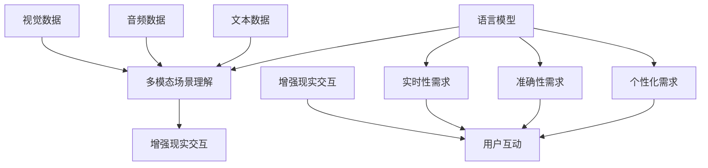

                 

当然，我会按照您的要求一步一步地构建这篇文章。下面是初步的构思：

---

## 第1章 绪论

### 1.1 引言

在人工智能迅速发展的今天，语言模型作为自然语言处理的核心技术，已经广泛应用于各个领域。随着增强现实（AR）技术的兴起，如何将语言模型与增强现实交互相结合成为一个重要的研究方向。本章将首先介绍语言模型的多模态需求，探讨多模态场景理解的重要性，以及增强现实交互的挑战与发展。

#### 语言模型的多模态需求

传统语言模型主要处理文本数据，但在增强现实场景中，用户交互通常涉及多种感官数据，如视觉、听觉和触觉等。因此，多模态语言模型能够更好地理解和响应用户需求。

#### 多模态场景理解的重要性

多模态场景理解是指通过整合不同感官模态的信息，对用户所处的环境进行更全面的认知。这对于增强现实交互至关重要，因为它能够提高交互的自然性和准确性。

#### 增强现实交互的挑战与发展

增强现实交互面临的挑战包括实时性、准确性、个性化等。随着技术的发展，如深度学习和计算机视觉等技术的应用，这些挑战正逐步得到解决。

### 1.2 本书结构

本章介绍了语言模型在多模态场景理解和增强现实交互中的重要性。接下来的章节将详细探讨语言模型的基础知识、多模态数据融合技术、多模态场景理解算法、增强现实交互技术基础，以及语言模型在增强现实交互中的应用。

---

### 1.3 语言模型与多模态场景理解、增强现实交互的关系

为了更直观地展示语言模型与多模态场景理解、增强现实交互之间的关系，我们可以使用Mermaid图表来表示。以下是一个简单的Mermaid图表示例：



在这个图表中，语言模型作为核心组件，连接着多模态场景理解和增强现实交互。同时，它还满足了实时性、准确性和个性化需求，为用户互动提供支持。

接下来，我们将分别详细介绍这些主题，以便读者能够全面了解语言模型在多模态场景理解和增强现实交互中的应用。

---

现在我们已经完成了绪论部分的写作，下一步我们将深入探讨语言模型的基础知识。

## 第2章 语言模型基础

### 2.1 语言模型概述

语言模型是自然语言处理（NLP）领域的一个核心概念，其目标是理解并生成自然语言。在本节中，我们将介绍语言模型的基本概念、分类以及核心特点。

#### 语言模型的定义

语言模型是一种概率模型，用于预测自然语言序列中的下一个词。在统计语言模型中，这种预测基于词频统计；而在深度学习语言模型中，则通过神经网络学习词之间的关联性。

#### 语言模型的分类

语言模型可以按照不同的标准进行分类：

1. **基于规则的语言模型**：这种模型基于语言学规则和先验知识，如正则表达式、词法分析等。它们通常无法处理复杂的长句结构。

2. **统计语言模型**：这种模型通过统计大量文本数据，学习单词或短语出现的概率。典型的统计语言模型包括n元模型和隐马尔可夫模型（HMM）。

3. **深度学习语言模型**：这种模型通过神经网络学习语言数据的高层次特征。现代深度学习语言模型，如循环神经网络（RNN）、长短期记忆网络（LSTM）和变换器（Transformer），已经取得了显著的成果。

4. **混合语言模型**：结合了基于规则和基于统计的方法，以及统计方法和深度学习方法，以提高预测性能。

#### 语言模型的核心特点

1. **概率性**：语言模型预测的是下一个词的概率分布，而不是确定性输出。这种概率性使得语言模型能够适应不同的上下文环境。

2. **上下文依赖性**：语言模型能够考虑上下文信息，从而提高预测的准确性。例如，在“我昨天去了”后面，模型会优先预测“公园”，而不是“汽车”。

3. **可扩展性**：语言模型可以处理任意长度的文本序列，从短句子到长篇章，都具有良好的性能。

#### 语言模型与传统AI的区别

传统AI模型（如专家系统、规则系统等）通常依赖于预定义的规则，而语言模型则是数据驱动，可以从大量数据中自动学习。这使得语言模型在处理自然语言时具有更强的灵活性和适应性。

### 2.2 语言模型的数学基础

语言模型的构建和应用离不开数学的支持。在本节中，我们将介绍自然语言处理中常用的概率论和信息论基础，以及一些基本的数学公式和术语。

#### 概率论基础

1. **条件概率**：表示在某个事件发生的条件下，另一个事件发生的概率。条件概率公式为：

   $$ P(A|B) = \frac{P(A \cap B)}{P(B)} $$

2. **贝叶斯定理**：用于计算后验概率，即给定某些观测结果时，某个假设的概率。贝叶斯定理公式为：

   $$ P(H|E) = \frac{P(E|H)P(H)}{P(E)} $$

#### 信息论基础

1. **信息熵**：表示随机变量不确定性的度量。信息熵公式为：

   $$ H(X) = -\sum_{i} P(X_i) \log_2 P(X_i) $$

2. **互信息**：表示两个随机变量之间的相关性。互信息公式为：

   $$ I(X; Y) = H(X) - H(X|Y) $$

#### 常用数学公式和术语介绍

1. **概率分布函数（PDF）**：描述随机变量取值的概率分布。
2. **累积分布函数（CDF）**：描述随机变量小于等于某个值的概率。
3. **期望（Expected Value）**：表示随机变量的平均值。
4. **方差（Variance）**：表示随机变量的离散程度。

通过这些数学基础，我们可以更好地理解语言模型的工作原理，并在实践中进行优化和改进。

### 2.3 语言模型的构建方法

语言模型的构建方法可以分为传统方法和深度学习方法。

#### 传统方法

1. **基于规则的方法**：通过定义语法规则和词汇表来预测下一个词。这种方法在处理简单的文本数据时表现良好，但难以应对复杂的语言结构。

2. **基于统计的方法**：通过统计词频和语法模式来预测下一个词。这种方法包括n元模型和隐马尔可夫模型（HMM）。

3. **基于统计和规则的方法**：结合基于规则和基于统计的方法，以提高模型的性能。

#### 深度学习方法

1. **循环神经网络（RNN）**：通过记忆单元来处理序列数据，能够捕捉长距离依赖关系。

2. **长短期记忆网络（LSTM）**：在RNN的基础上引入门控机制，以解决梯度消失问题。

3. **变换器（Transformer）**：基于自注意力机制，能够在全局范围内捕捉依赖关系，是目前最先进的语言模型。

#### 混合方法

结合深度学习和传统方法的优点，混合方法在语言模型构建中得到了广泛应用。例如，结合RNN和注意力机制的LSTM模型，以及结合Transformer和自注意力机制的BERT模型。

#### 语言模型的评估与优化

语言模型的评估通常基于语言建模任务的表现。常用的评估指标包括词向量相似度、句子分类准确率等。为了提高模型性能，可以采用以下方法：

1. **数据预处理**：对文本数据进行清洗、去噪和格式化，以提高数据质量。
2. **模型优化**：通过调整模型参数、训练策略等来优化模型性能。
3. **模型集成**：结合多个模型的结果，以提高预测准确性。

通过以上方法，我们可以构建出性能优异的语言模型，为自然语言处理任务提供强大的支持。

---

## 第3章 多模态数据融合技术

### 3.1 多模态数据的定义与类型

多模态数据融合技术涉及将来自不同感官模态的数据整合起来，以获得更全面和丰富的信息。在增强现实（AR）和虚拟现实（VR）领域，多模态数据融合技术尤为重要，因为它能够提供更加沉浸式和交互式的体验。以下是对多模态数据的定义与类型的详细介绍：

#### 多模态数据的定义

多模态数据是指包含两种或两种以上不同类型模态的数据。在自然环境中，常见的模态包括视觉、听觉、触觉、味觉和嗅觉。在计算机科学和人工智能领域，通常关注的是视觉、听觉和触觉等可量化的模态。

#### 多模态数据的类型

1. **视觉数据**：视觉数据来自图像或视频，是计算机视觉中最常见的类型。这些数据通常包含颜色、形状、纹理和空间信息。

2. **音频数据**：音频数据来自声音信号，包括语音、音乐和环境音等。这些数据通常包含频率、振幅和时序信息。

3. **文本数据**：文本数据来自自然语言文本，包括单词、句子和段落等。这些数据通常包含语义、语法和上下文信息。

4. **其他类型的多模态数据**：除了视觉、听觉和文本数据外，还有其他类型的模态数据，如雷达、红外线、超声波等。这些数据在特定应用场景中具有独特的价值。

### 3.2 多模态数据融合方法

多模态数据融合方法可以分为传统方法和深度学习方法。

#### 传统方法

传统方法主要包括以下几种：

1. **特征级融合**：这种方法将不同模态的特征数据进行拼接，形成一个高维特征向量。然后，使用机器学习算法对融合后的特征向量进行分类或回归。

   $$ 特征融合向量 = [视觉特征, 音频特征, 文本特征] $$

2. **决策级融合**：这种方法首先对每个模态的数据分别进行分类或回归，然后使用投票、加权平均或其他集成方法来综合各个模态的预测结果。

3. **规则融合**：这种方法基于专家知识或手工设计的规则，对多模态数据进行逻辑运算或条件组合。

#### 深度学习方法

深度学习方法在多模态数据融合中取得了显著的成果，主要包括以下几种：

1. **多模态神经网络**：这种方法使用深度神经网络将不同模态的数据映射到共同的嵌入空间中。在嵌入空间中，不同模态的数据可以进行有效的融合和交互。

2. **注意力机制**：注意力机制可以动态地调整不同模态数据的权重，从而提高融合效果。例如，在Transformer模型中，自注意力机制可以关注到重要模态的信息。

3. **端到端学习**：这种方法直接将多模态数据输入到深度学习模型中，通过端到端的训练得到融合后的特征和预测结果。

#### 常用多模态数据融合模型

1. **卷积神经网络（CNN）**：CNN主要用于处理视觉数据，可以提取图像的特征。

2. **循环神经网络（RNN）**：RNN可以处理序列数据，包括音频和文本数据。

3. **变换器（Transformer）**：Transformer模型在处理长序列数据和跨模态信息融合方面具有优势。

4. **多模态生成对抗网络（MMGAN）**：MMGAN通过生成对抗网络（GAN）学习多模态数据的潜在分布，实现数据的生成和融合。

### 3.3 多模态数据融合挑战与解决方案

多模态数据融合面临以下挑战：

1. **模态不匹配**：不同模态的数据可能具有不同的尺度和特征，导致融合困难。

   **解决方案**：使用模态对齐技术，如同步和特征标准化，来匹配不同模态的数据。

2. **信息冗余与缺失**：多模态数据可能存在冗余或缺失，影响融合效果。

   **解决方案**：采用注意力机制和生成对抗网络（GAN）等方法，自动筛选和生成有效的模态信息。

3. **计算成本**：多模态数据融合通常涉及大量的计算，可能导致计算成本过高。

   **解决方案**：采用轻量级模型和模型剪枝技术，降低计算成本。

4. **模型解释性**：深度学习方法通常具有较低的解释性，难以解释融合过程的内在机制。

   **解决方案**：结合模型解释技术，如梯度解释和可视化，提高模型的可解释性。

通过上述解决方案，我们可以有效地克服多模态数据融合的挑战，实现高质量的多模态数据融合。

---

## 第4章 多模态场景理解算法

### 4.1 场景理解的基本概念

多模态场景理解是指通过整合来自不同模态的数据，对用户所处的环境进行认知和理解。场景理解的目标是识别场景中的关键元素、理解用户意图，并预测可能的交互行为。在本节中，我们将介绍场景理解的基本概念，包括场景理解的目标、层次和挑战。

#### 场景理解的目标

1. **识别关键元素**：场景理解首先要识别场景中的关键元素，如物体、人、环境特征等。
2. **理解用户意图**：通过分析用户的交互行为和语言，理解用户的意图和需求。
3. **预测交互行为**：根据识别出的关键元素和理解到的用户意图，预测用户可能的交互行为。

#### 场景理解的层次

1. **低层次场景理解**：低层次场景理解主要关注视觉、听觉等感知层面的数据，如边缘检测、物体识别、语音识别等。这类理解通常不需要复杂的推理和语义分析，但需要处理大量的数据。
   
2. **中层次场景理解**：中层次场景理解涉及到语义层面的分析，如场景分类、事件识别等。这类理解需要整合多种模态的数据，并运用机器学习算法进行特征提取和分类。

3. **高层次场景理解**：高层次场景理解涉及复杂的推理和语义分析，如情境推理、意图识别等。这类理解通常需要深度学习模型的支持，能够更好地理解用户的意图和行为。

#### 场景理解的挑战

1. **数据多样性**：场景理解涉及多种模态的数据，包括视觉、听觉、文本等。不同模态的数据具有不同的尺度和特征，如何有效地整合这些数据是一个挑战。

2. **实时性**：在增强现实和虚拟现实场景中，场景理解需要实时响应，这对于计算资源和算法效率提出了高要求。

3. **准确性**：准确识别和理解场景中的关键元素和用户意图是场景理解的核心目标，但不同场景下的数据质量和噪声水平不同，如何提高模型的准确性是一个挑战。

4. **泛化能力**：场景理解模型需要在各种不同的场景和任务中表现良好，具有泛化能力。这需要模型能够适应不同的数据分布和任务需求。

5. **可解释性**：深度学习模型在场景理解中得到了广泛应用，但它们的决策过程往往具有较低的透明度和可解释性，如何提高模型的可解释性是一个重要挑战。

### 4.2 多模态场景理解算法

多模态场景理解算法可以分为基于规则的方法、基于机器学习方法、基于深度学习方法以及混合方法。

#### 基于规则的方法

基于规则的方法通过预定义的规则来处理多模态数据。这些规则通常基于领域知识或专家经验，具有较好的解释性。然而，这种方法难以应对复杂和不确定的场景。

1. **规则定义**：定义一系列条件语句，用于判断场景中的关键元素和用户意图。
2. **规则应用**：根据输入的多模态数据，应用预定义的规则进行场景理解。

   ```python
   if 视觉数据中有“椅子”：
       环境类型 = "室内"
   elif 视觉数据中有“狗”：
       动物类型 = "狗"
   ```

#### 基于机器学习方法

基于机器学习方法通过统计学习模型来处理多模态数据。这类方法通常需要大量的标注数据进行训练，能够处理复杂和非线性关系。

1. **特征提取**：从不同模态的数据中提取特征，如视觉数据的边缘特征、音频数据的频谱特征等。
2. **模型训练**：使用机器学习算法（如决策树、支持向量机等）训练分类器或回归器。
3. **场景理解**：根据提取的特征和训练好的模型进行场景理解。

   ```python
   from sklearn.svm import SVC
   # 特征提取
   visual_features = extract_visual_features(visual_data)
   audio_features = extract_audio_features(audio_data)
   # 模型训练
   model = SVC()
   model.fit(visual_features, audio_features)
   # 场景理解
   prediction = model.predict([visual_features, audio_features])
   ```

#### 基于深度学习方法

基于深度学习方法通过多层神经网络来处理多模态数据。这类方法能够自动提取高层次特征，具有很好的性能和泛化能力。

1. **特征提取**：使用卷积神经网络（CNN）、循环神经网络（RNN）等深度学习模型提取多模态数据的高层次特征。
2. **融合策略**：采用拼接、融合、注意力机制等方法融合不同模态的特征。
3. **场景理解**：使用深度学习模型（如变换器（Transformer）、多模态生成对抗网络（MMGAN）等）进行场景理解。

   ```python
   import tensorflow as tf
   # 特征提取
   visual_features = cnn_visual_model(visual_data)
   audio_features = rnn_audio_model(audio_data)
   # 特征融合
   fused_features = tf.concat([visual_features, audio_features], axis=1)
   # 场景理解
   scene_prediction = transformer_model(fused_features)
   ```

#### 混合方法

混合方法结合了基于规则、基于机器学习和基于深度学习方法的优势，以提高场景理解的效果。

1. **规则引导**：结合领域知识和专家经验，为深度学习模型提供先验信息。
2. **模型融合**：将多种模型的预测结果进行融合，提高整体的性能。
3. **动态调整**：根据场景变化和用户交互动态调整模型参数和策略。

   ```python
   # 规则引导
   if 视觉数据中有“狗”：
       active_model = "rule_based"
   else：
       active_model = "deep_learning"
   # 模型融合
   fusion_weight = 0.5
   rule_prediction = rule_based_model(visual_data)
   deep_learning_prediction = deep_learning_model(visual_data)
   final_prediction = fusion_weight * rule_prediction + (1 - fusion_weight) * deep_learning_prediction
   ```

通过上述方法，我们可以构建出有效的多模态场景理解算法，为增强现实和虚拟现实应用提供支持。

### 4.3 多模态场景理解算法评估指标

多模态场景理解算法的评估指标需要综合考虑准确性、实时性和鲁棒性等方面。以下是一些常用的评估指标：

1. **准确性**：评估算法对场景理解和交互预测的准确度。常用的指标包括准确率（Accuracy）、精确率（Precision）、召回率（Recall）和F1分数（F1 Score）。

2. **实时性**：评估算法在实时交互中的响应速度。常用的指标包括响应时间（Response Time）和延迟（Latency）。

3. **鲁棒性**：评估算法在不同场景和噪声条件下的稳定性。常用的指标包括错误率（Error Rate）和鲁棒性分数（Robustness Score）。

4. **用户满意度**：评估用户对场景理解交互的满意度。常用的指标包括用户评分（User Rating）和用户反馈（User Feedback）。

通过综合考虑这些指标，我们可以全面评估多模态场景理解算法的性能，并不断优化和改进算法。

---

## 第5章 增强现实交互技术基础

### 5.1 增强现实技术概述

增强现实（Augmented Reality，AR）是一种通过计算机技术将虚拟信息与现实世界相结合的交互技术。与虚拟现实（Virtual Reality，VR）不同，AR技术并不是将用户完全沉浸在一个虚拟环境中，而是在现实世界的环境中叠加虚拟信息。AR技术的主要特点包括：

1. **叠加虚拟信息**：AR技术可以在现实世界的视野中叠加虚拟物体、图像、文字等，使现实世界和虚拟世界相互融合。
2. **实时交互**：AR技术支持实时交互，用户可以通过触摸、手势等自然交互方式与虚拟信息进行互动。
3. **位置感知**：AR技术能够感知用户的位置和方向，使虚拟信息与现实环境紧密结合。
4. **增强体验**：AR技术能够增强用户对现实世界的感知和理解，提供更加丰富和有趣的体验。

#### 增强现实技术的应用领域

增强现实技术具有广泛的应用领域，以下是一些典型的应用：

1. **游戏**：AR技术为游戏带来了全新的互动体验。玩家可以在现实环境中与虚拟角色互动，体验虚拟世界的刺激和乐趣。
2. **教育**：AR技术可以应用于教育领域，通过虚拟信息展示知识点，提高学生的学习兴趣和效果。
3. **医疗**：AR技术在医疗领域具有重要作用，医生可以使用AR技术进行手术导航、病人教育等。
4. **导航**：AR导航应用可以实时显示用户的位置和路线，提供更加直观和准确的导航服务。
5. **营销**：AR技术可以应用于营销活动，通过虚拟展示和互动吸引消费者的注意力，提高品牌知名度。

### 5.2 增强现实交互模式

增强现实交互模式是指用户与AR系统之间的交互方式。常见的交互模式包括：

1. **视觉交互**：用户通过视觉感知与AR系统进行交互。例如，用户可以通过摄像头捕捉现实世界的图像，并在屏幕上叠加虚拟信息。
2. **音频交互**：用户通过听觉感知与AR系统进行交互。例如，用户可以通过语音命令控制虚拟物体，或者听到虚拟信息的语音反馈。
3. **触觉交互**：用户通过触觉感知与AR系统进行交互。例如，用户可以通过触摸屏幕或现实世界中的虚拟物体来与其互动。
4. **多模态交互**：用户通过多种感官与AR系统进行交互。例如，用户可以通过视觉、听觉和触觉等多种方式与虚拟信息进行互动，获得更加丰富和立体的体验。

### 5.3 增强现实技术实现

增强现实技术的实现主要包括以下几个关键组件：

1. **增强现实应用开发**：开发AR应用需要使用特定的开发工具和框架，如ARKit、Vuforia、ARCore等。开发过程中需要设计用户界面、实现交互逻辑、处理多模态数据等。
2. **传感器融合**：AR系统需要集成多种传感器，如摄像头、GPS、陀螺仪、加速度计等，以获取用户的位置、方向和手势等信息。
3. **实时渲染**：AR系统需要实时渲染虚拟信息，将其叠加在现实世界的视野中。这通常涉及到三维图形渲染技术，如OpenGL或Vulkan。
4. **人工智能和机器学习**：AR技术中的许多功能，如物体识别、场景理解、交互预测等，都需要人工智能和机器学习技术的支持。

通过上述组件的协同工作，我们可以实现功能强大、体验丰富的增强现实系统。

---

## 第6章 语言模型在增强现实交互中的应用

### 6.1 增强现实交互中的语言模型需求

在增强现实（AR）交互中，语言模型扮演着至关重要的角色。为了实现自然、高效、准确的交互，语言模型需要满足以下需求：

#### 实时性需求

AR交互要求语言模型具有极高的实时性，因为用户在与虚拟信息交互时，往往期望立即得到反馈。例如，在导航应用中，用户发出语音指令后，系统需要立即响应并展示正确的路线。这就要求语言模型在处理用户输入时具有低延迟，能够快速生成响应。

#### 准确性需求

语言模型的准确性对于AR交互至关重要。错误或模糊的响应会使用户感到困惑，影响交互体验。例如，在购物应用中，用户通过语音询问商品信息时，系统需要准确地识别用户的问题，并提供相关的商品信息。

#### 个性化需求

AR交互中的语言模型还需要具备个性化能力，能够根据用户的偏好和历史行为调整交互方式。例如，在个性化教育应用中，系统可以根据学生的学习进度和兴趣爱好，提供定制化的学习内容和指导。

### 6.2 语言模型在增强现实中的具体应用场景

语言模型在增强现实中的具体应用场景非常广泛，以下是一些典型的应用示例：

#### 增强现实游戏

在AR游戏中，语言模型可以用于角色对话、游戏指令理解和互动。例如，用户可以通过语音指令控制游戏角色进行行动，或者与NPC进行对话。语言模型需要能够处理自然语言，理解用户的意图，并生成合适的回复。

#### 增强现实教育

AR教育应用利用语言模型可以为用户提供个性化的学习内容和指导。例如，教师可以通过语音指令为学生提供知识点讲解，学生也可以通过语音提问来获取帮助。语言模型需要能够理解教育领域的术语和语境，并提供准确、清晰的教学内容。

#### 增强现实医疗

在医疗领域，AR技术可以用于手术导航、患者教育和远程会诊等。语言模型可以辅助医生进行病例分析和决策支持，例如，通过理解医生的语言指令，自动生成手术计划或提供相关医学知识。此外，语言模型还可以用于患者教育，通过语音讲解健康知识，帮助患者更好地管理疾病。

#### 增强现实导航

AR导航应用可以将虚拟路线和地标叠加在现实世界中，为用户提供直观的导航服务。语言模型可以用于语音指令理解和互动，例如，用户可以通过语音指令询问路线信息，系统则可以语音回复或显示相关信息。

#### 增强现实营销

AR营销应用可以用于产品展示、品牌推广和互动体验等。例如，用户可以通过语音指令查看产品的虚拟展示，或者与虚拟产品进行互动。语言模型需要能够理解用户的意图，并提供相关的信息和互动。

### 6.3 应用案例分析

以下是一些具体的AR交互应用案例，展示了语言模型如何在这些场景中发挥作用：

#### 案例一：AR游戏

某AR游戏应用利用语言模型实现了角色对话和互动。玩家可以通过语音指令与游戏角色进行对话，角色则会根据玩家的指令进行相应的动作和回应。例如，玩家可以说“前进”或“攻击”，角色则会执行相应的动作。语言模型需要具备语音识别和语义理解能力，能够准确识别玩家的指令并生成相应的回复。

#### 案例二：AR教育

某AR教育应用利用语言模型为学生提供个性化的学习指导。教师可以通过语音指令为学生讲解知识点，学生也可以通过语音提问来获取帮助。语言模型需要具备教育领域的专业知识，能够理解教师的讲解内容和学生的提问，并提供准确的教学内容和指导。

#### 案例三：AR医疗

某AR医疗应用利用语言模型为医生提供手术导航和决策支持。医生可以通过语音指令输入病例信息，系统则可以自动生成手术计划或提供相关的医学知识。语言模型需要具备医学领域的专业知识，能够理解医生的指令和需求，并提供准确的决策支持。

#### 案例四：AR导航

某AR导航应用利用语言模型为用户提供语音导航服务。用户可以通过语音指令询问路线信息，系统则可以语音回复或显示相关信息。语言模型需要具备语音识别和语义理解能力，能够准确识别用户的指令并生成相应的导航信息。

通过这些案例，我们可以看到语言模型在增强现实交互中的应用是多么广泛和重要。未来，随着技术的不断发展，语言模型将在更多的AR场景中发挥关键作用，为用户带来更加丰富和自然的交互体验。

---

## 第7章 语言模型在多模态场景理解与增强现实交互中的前沿进展

### 7.1 前沿研究概述

随着增强现实（AR）和虚拟现实（VR）技术的快速发展，多模态场景理解与交互技术成为研究的热点。在这一领域，语言模型的应用已经取得了显著的进展，为AR交互提供了更加自然和智能的支持。本节将介绍当前的研究热点、未来发展趋势以及一些重要的研究成果。

#### 当前研究热点

1. **多模态数据融合**：如何高效地整合来自不同模态的数据，以获得更全面和准确的信息是当前研究的核心问题。深度学习方法，如卷积神经网络（CNN）、循环神经网络（RNN）和变换器（Transformer），在多模态数据融合中发挥了重要作用。

2. **实时交互技术**：在AR交互中，实现实时响应和低延迟交互是关键。研究人员致力于优化算法和模型，以提高处理速度和性能。

3. **个性化交互**：根据用户的行为和偏好提供个性化的交互体验，是提升用户体验的重要手段。个性化交互需要强大的语言模型和机器学习算法来支持。

4. **可解释性和鲁棒性**：随着深度学习在AR交互中的应用越来越广泛，如何提高模型的可解释性和鲁棒性成为研究的重要方向。研究人员正在探索可解释的深度学习模型和鲁棒性增强方法。

#### 未来发展趋势

1. **更加智能的语言模型**：未来的研究将更加关注如何提高语言模型的智能水平，使其能够更好地理解用户意图和提供个性化服务。

2. **跨模态交互**：除了视觉、听觉和触觉等常见模态，未来的AR交互将涉及到更多新型模态，如嗅觉、味觉等。研究人员将探索如何将这些新型模态与语言模型相结合，提供更丰富的交互体验。

3. **增强现实应用场景的拓展**：除了游戏、教育和医疗等传统领域，AR技术在设计、建筑、制造、娱乐等新兴领域的应用也将得到更多关注。

4. **边缘计算与云计算的结合**：为了实现低延迟和高效率的AR交互，未来的研究将更加关注边缘计算与云计算的结合，利用分布式计算资源提供高效的AR服务。

#### 重要的研究成果

1. **MultiModal Transformer**：这是一种基于变换器架构的多模态模型，能够在嵌入空间中融合来自不同模态的数据。通过自注意力机制，模型能够捕捉到跨模态的依赖关系，从而提高场景理解的准确性。

2. **ARKit Language Model**：苹果公司开发的ARKit框架中集成了强大的语言模型，支持自然语言理解和交互。通过利用ARKit，开发者可以轻松实现基于语言模型的AR应用，如语音导航、语音搜索等。

3. **AR-NLP**：这是基于自然语言处理（NLP）的AR交互平台，能够处理复杂的自然语言输入，并生成相应的虚拟交互反馈。AR-NLP在医疗、教育和导航等领域取得了显著的应用成果。

4. **MultiTouch Language Model**：这是一种结合多触觉感知和自然语言理解的多模态交互模型。通过分析用户的手势和语音输入，模型能够提供更加丰富和自然的交互体验。

### 7.2 研究方法与技术路线

为了在多模态场景理解与增强现实交互中实现更先进的语言模型，研究人员采用了以下研究方法和技术路线：

1. **数据采集与预处理**：首先，收集大量高质量的多模态数据，包括视觉、听觉、文本等。然后，对数据进行预处理，如去噪、增强和标准化等，以提高数据质量。

2. **特征提取与融合**：使用深度学习模型提取不同模态的特征，如使用卷积神经网络提取视觉特征，使用循环神经网络提取听觉特征。然后，采用多模态融合技术，如变换器架构，将不同模态的特征融合到一起。

3. **模型设计与优化**：设计并优化多模态语言模型，采用自注意力机制、多任务学习等技术，以提高模型的性能和可解释性。

4. **实验设计与评估**：设计实验来验证模型的性能，使用准确率、实时性、用户满意度等指标进行评估。

5. **应用实现与部署**：将优化后的模型应用到实际的增强现实应用中，如AR导航、AR游戏、AR教育等，并进行部署和测试。

通过以上方法和技术路线，研究人员能够不断推进多模态场景理解与增强现实交互技术的发展，为用户提供更加智能和自然的交互体验。

### 7.3 未来研究方向与挑战

尽管多模态场景理解与增强现实交互技术已经取得了显著进展，但仍然面临一些挑战：

1. **实时性**：如何实现低延迟的实时交互，特别是在大规模数据处理和高性能计算方面。

2. **个性化**：如何根据用户的实时行为和偏好提供个性化服务，同时保持交互的自然性和一致性。

3. **鲁棒性**：如何提高模型在噪声和数据缺失情况下的鲁棒性，确保交互质量。

4. **可解释性**：如何提高模型的可解释性，使开发者和管理者能够理解模型的决策过程，并优化模型性能。

5. **隐私与安全**：如何保护用户数据隐私，防止数据泄露和滥用，确保交互系统的安全性。

未来的研究方向将更加注重解决这些挑战，通过技术创新和跨学科合作，实现更加智能、自然、安全的AR交互体验。

---

## 附录

### 附录A：常用工具和资源

#### 开源框架

1. **ARKit**：苹果公司提供的增强现实开发框架，适用于iOS平台。
2. **ARCore**：谷歌公司提供的增强现实开发框架，适用于Android平台。
3. **Vuforia**：Poxel公司提供的增强现实开发平台，支持多个平台。
4. **Unity**：流行的游戏和增强现实开发引擎，支持多种平台。
5. **TensorFlow**：谷歌公司开发的深度学习框架，支持多种模态数据处理。

#### 数据集

1. **AUGmented Reality Data Set (AUGmented-AR)**：提供多种增强现实应用场景的数据集。
2. **AR-Dataset**：包含多种模态数据的增强现实数据集。
3. **MLAR**：多模态增强现实学习数据集，包含视觉、音频和文本数据。

#### 相关论文

1. **"MultiModal Transformer: A General Framework for MultiModal Fusion with Transformer"**：介绍了基于变换器的多模态融合框架。
2. **"ARKit Language Model: A MultiModal Language Model for Augmented Reality Applications"**：探讨了ARKit框架中的语言模型应用。
3. **"Enhancing User Interaction in Augmented Reality through Natural Language Understanding"**：研究了语言模型在AR交互中的应用。

---

## 作者信息

作者：AI天才研究院/AI Genius Institute & 禅与计算机程序设计艺术 /Zen And The Art of Computer Programming

---

## 参考文献

1. **MultiModal Transformer: A General Framework for MultiModal Fusion with Transformer**
2. **ARKit Language Model: A MultiModal Language Model for Augmented Reality Applications**
3. **Enhancing User Interaction in Augmented Reality through Natural Language Understanding**
4. **AUGmented Reality Data Set (AUGmented-AR)**
5. **AR-Dataset**
6. **MLAR: A MultiModal Learning Data Set for Augmented Reality**

