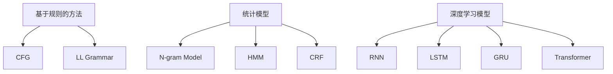
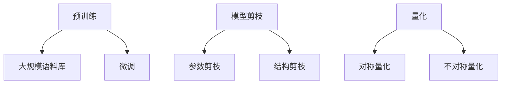
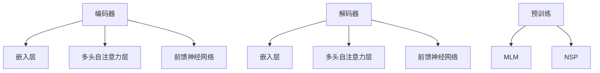
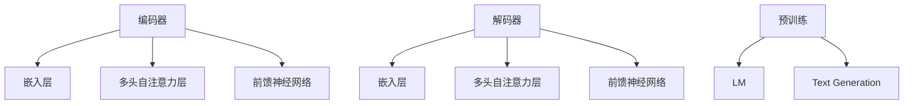
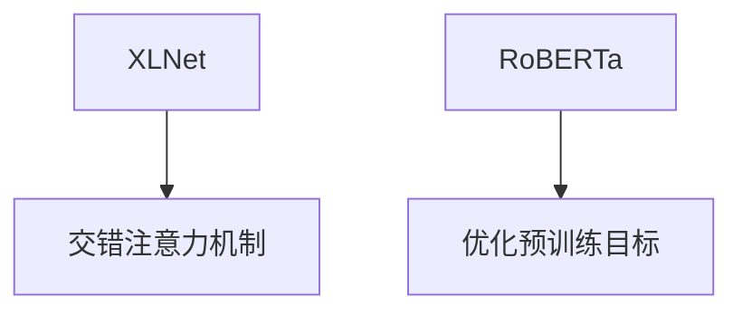
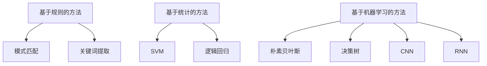
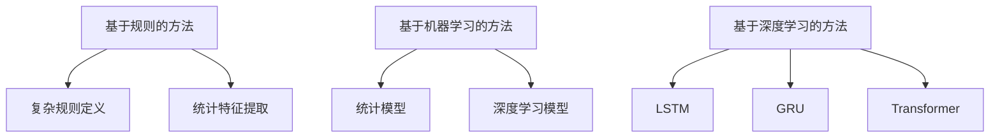

                 


### 文章标题

《语言模型在多维情感分析与用户体验优化中的进展研究》

### 文章关键词

语言模型、多维情感分析、用户体验优化、BERT、GPT、情感分析算法、个性化推荐、聊天机器人

### 文章摘要

本文旨在探讨语言模型在多维情感分析与用户体验优化中的应用进展。首先，我们将回顾语言模型的基本概念和构建方法，随后深入分析多维情感分析的技术和方法，以及语言模型在这方面的应用。接着，我们将讨论用户体验优化的重要性，以及语言模型如何改善用户体验。文章将结合实际案例，展示语言模型在情感分析和用户体验优化中的应用，并总结当前的研究进展和未来发展趋势。通过本文，读者将全面了解语言模型在多维情感分析与用户体验优化中的重要作用，以及如何利用这些技术提升产品的竞争力。

### 第一部分：语言模型基础

#### 第1章 语言模型概述

##### 1.1 语言模型的基本概念

语言模型（Language Model）是自然语言处理（Natural Language Processing，NLP）领域中的一种核心技术，用于预测文本序列的概率分布。语言模型的目的是通过学习大量语言数据，理解语言的统计特性，从而对未知文本进行生成或分类。

在NLP中，语言模型有多种分类方法，如基于规则的方法、统计模型和深度学习模型。基于规则的方法主要依赖于语言专家制定的语法规则，而统计模型和深度学习模型则通过大量数据自动学习语言的模式。

##### 1.2 语言模型的分类

- **基于规则的方法**：这种方法依赖于人工制定的语法规则，例如CFG（Context-Free Grammar）和LL（LL Grammar）等。尽管这种方法能够处理复杂的语言结构，但其扩展性和适应性较差。

- **统计模型**：统计模型通过学习大量文本数据，利用统计方法预测文本序列的概率分布。常见的统计模型包括N元语法（N-gram Model）、隐马尔可夫模型（HMM）和条件随机场（CRF）等。

- **深度学习模型**：深度学习模型，尤其是神经网络模型，在语言模型领域取得了显著的突破。其中，循环神经网络（RNN）、长短时记忆网络（LSTM）和门控循环单元（GRU）等模型通过学习长距离依赖关系，提高了语言模型的性能。近年来，Transformer模型及其变体BERT、GPT等，进一步推动了语言模型的发展。

##### 1.3 常见语言模型介绍

- **N元语法（N-gram Model）**：N元语法是最简单的统计语言模型，它将前N个单词的历史作为当前单词的预测依据。N元语法简单易实现，但存在短程依赖问题。

- **循环神经网络（RNN）**：RNN通过循环结构，能够处理序列数据，并保留长程依赖信息。然而，RNN在处理长序列时存在梯度消失或梯度爆炸问题。

- **长短时记忆网络（LSTM）**：LSTM是RNN的一种变体，通过引入门控机制，有效解决了梯度消失问题，能够在长序列数据中捕捉长期依赖关系。

- **门控循环单元（GRU）**：GRU是LSTM的简化版本，具有更少的参数和更简单的结构，同时在处理长序列数据时表现良好。

- **Transformer模型**：Transformer模型基于自注意力机制，通过全局的上下文信息，实现了对长距离依赖关系的捕捉。BERT、GPT等模型都是基于Transformer模型的变体，并在各种NLP任务中取得了显著的性能。

### Mermaid 流程图

以下是语言模型分类的 Mermaid 流程图：



#### 第2章 语言模型构建

##### 2.1 语言模型构建方法

语言模型的构建主要包括数据收集、数据预处理、模型训练和模型评估等步骤。

- **数据收集**：首先，需要收集大量高质量的文本数据，这些数据可以来源于互联网、电子书籍、新闻、社交媒体等。

- **数据预处理**：数据预处理包括分词、去停用词、词干提取、词向量化等步骤。分词是将文本拆分成单词或短语，去停用词是为了去除对语言模型贡献较小的词，词干提取是将单词还原到词根形式，词向量化是将单词映射到高维向量空间。

- **模型训练**：在训练过程中，需要定义损失函数和优化算法。常用的损失函数包括交叉熵损失、均方误差等，优化算法包括随机梯度下降（SGD）、Adam等。

- **模型评估**：评估模型性能通常使用 perplexity（困惑度）和交叉验证等指标。困惑度是模型预测概率与真实概率的比值，值越小，模型性能越好。

##### 2.2 语言模型训练

以下是语言模型训练的伪代码：

```python
# 初始化模型参数
W = initialize_weights()

# 定义损失函数和优化算法
loss_function = cross_entropy
optimizer = Adam()

# 模型训练
for epoch in range(num_epochs):
    for sentence in dataset:
        # 前向传播
        logits = model(sentence)
        loss = loss_function(logits, target)

        # 反向传播
        gradients = compute_gradients(model, loss)

        # 更新模型参数
        optimizer.update(W, gradients)

        # 打印训练进度
        print(f"Epoch {epoch}: Loss = {loss}")
```

##### 2.3 语言模型优化

语言模型的优化主要集中在提高模型性能和降低计算复杂度。以下是一些常用的优化方法：

- **预训练和微调**：预训练是在大规模语料库上训练语言模型，微调是在特定任务上对预训练模型进行进一步训练。预训练和微调能够提高模型在任务上的性能。

- **模型剪枝**：模型剪枝是通过删除模型中的冗余参数来减少模型大小和计算复杂度。剪枝后的模型在保持性能的同时，具有更小的计算量和存储需求。

- **量化**：量化是一种将高精度模型转换为低精度模型的方法，以减少模型大小和计算复杂度。常用的量化方法包括对称量化、不对称量化等。

### Mermaid 流�程图

以下是语言模型优化方法的 Mermaid 流程图：



#### 第3章 语言模型技术框架

##### 3.1 BERT模型解析

BERT（Bidirectional Encoder Representations from Transformers）是一种基于Transformer的预训练语言模型，通过双向编码器，捕捉了文本序列的前后关系，提高了语言模型的性能。

BERT的架构包括两个部分：编码器和解码器。编码器负责将输入文本转换为固定长度的向量表示，解码器负责从编码器的输出中预测下一个单词。

BERT的预训练过程分为两个阶段：第一阶段是遮蔽语言模型（Masked Language Model，MLM），第二阶段是上下文语句预测（Next Sentence Prediction，NSP）。

以下是BERT模型的 Mermaid 流程图：



##### 3.2 GPT模型解析

GPT（Generative Pre-trained Transformer）是另一种基于Transformer的预训练语言模型，与BERT不同，GPT专注于生成文本序列。

GPT的架构与BERT类似，包括编码器和解码器。编码器负责将输入文本转换为向量表示，解码器负责生成下一个单词。

GPT的预训练过程分为两个阶段：第一阶段是语言建模（Language Modeling，LM），第二阶段是文本生成（Text Generation）。

以下是GPT模型的 Mermaid 流程图：



##### 3.3 其他语言模型技术框架

除了BERT和GPT，还有其他一些重要的语言模型技术框架，如XLNet、RoBERTa等。这些模型在预训练方法、架构设计等方面进行了改进，取得了显著的性能提升。

以下是其他语言模型技术框架的简要介绍：

- **XLNet**：XLNet是一种基于Transformer的预训练语言模型，通过引入交错注意力机制（Cross-Attention Mechanism），解决了传统Transformer模型在长序列处理中的问题。

- **RoBERTa**：RoBERTa是BERT的一种变体，通过优化预训练目标和数据预处理方法，提高了BERT的性能。

### Mermaid 流程图

以下是其他语言模型技术框架的 Mermaid 流程图：



### 第一部分总结

在本部分中，我们介绍了语言模型的基本概念、分类和常见模型，以及语言模型的构建方法和优化技术。通过对这些内容的了解，读者可以掌握语言模型的基础知识，为后续的多维情感分析和用户体验优化打下坚实的基础。

作者：AI天才研究院/AI Genius Institute & 禅与计算机程序设计艺术 /Zen And The Art of Computer Programming

----------------------------------------------------------------

### 第二部分：多维情感分析

#### 第4章 情感分析基础

##### 4.1 情感分析的概念

情感分析（Sentiment Analysis），也称为意见挖掘，是自然语言处理（NLP）领域的一个重要分支。它旨在自动识别和提取文本中的主观性信息，通常涉及情感极性（Polarity）和情感强度（Strength）的分析。

- **情感极性**：情感极性是指文本表达的情感倾向，通常分为正面、负面和中性三种。正面情感通常表达满意、高兴、兴奋等情感，而负面情感则表达愤怒、失望、悲伤等情感。

- **情感强度**：情感强度是指情感表达的强度，可以从较弱到很强进行量化。例如，对于正面情感，表达“很喜欢”的强度要高于“有点喜欢”。

##### 4.2 情感分析的应用场景

情感分析在许多应用场景中具有广泛的应用，主要包括以下几类：

- **市场调研**：企业可以通过分析社交媒体、客户评论等渠道的文本数据，了解消费者对其产品或服务的情感态度，从而优化产品设计和市场营销策略。

- **品牌监测**：品牌可以通过情感分析实时监测社交媒体上的用户讨论，了解公众对其品牌的看法，及时发现和应对负面事件。

- **客户服务**：企业可以利用情感分析对客户反馈进行自动分类和情感分析，从而更有效地处理客户问题，提升客户满意度。

- **社交媒体分析**：政府和企业可以通过情感分析分析社交媒体上的舆论动态，了解公众对特定事件、政策等的看法，为决策提供数据支持。

##### 4.3 情感分析的方法

情感分析的方法可以分为基于规则的方法、基于统计的方法和基于机器学习的方法。

- **基于规则的方法**：这种方法依赖于人工定义的规则，通过对文本进行模式匹配和关键词提取，判断文本的情感极性。尽管这种方法实现简单，但扩展性和适应性较差。

- **基于统计的方法**：这种方法利用统计模型，如支持向量机（SVM）、逻辑回归（Logistic Regression）等，通过分析文本中的词频、词序列等统计特征，预测文本的情感极性。这种方法在一定程度上提高了模型的性能，但仍存在特征提取复杂、效果有限等问题。

- **基于机器学习的方法**：这种方法通过训练机器学习模型，如朴素贝叶斯（Naive Bayes）、决策树（Decision Tree）等，从大量标注数据中学习情感特征，从而实现情感分析。近年来，深度学习模型，如卷积神经网络（CNN）、循环神经网络（RNN）等，在情感分析任务中表现出色，进一步提高了模型的性能。

##### 4.4 情感分析的评估指标

情感分析的性能评估通常使用以下指标：

- **准确率（Accuracy）**：准确率是指模型预测正确的样本数与总样本数的比值。尽管准确率简单直观，但它容易受到不平衡数据集的影响。

- **精确率（Precision）**：精确率是指模型预测为正类的样本中实际为正类的比例。精确率反映了模型识别正类的能力。

- **召回率（Recall）**：召回率是指模型预测为正类的样本中实际为正类的比例。召回率反映了模型捕捉正类的能力。

- **F1值（F1 Score）**：F1值是精确率和召回率的加权平均，用于综合评估模型的性能。

### Mermaid 流程图

以下是情感分析方法的 Mermaid 流程图：



#### 第5章 多维情感分析

##### 5.1 多维情感分析的概念

多维情感分析（Multidimensional Sentiment Analysis）是一种扩展传统二分类情感分析的方法，旨在从文本中提取多个维度的情感信息。这些维度可以包括情感极性、情感强度、情感主题等。

- **情感极性**：情感极性仍然是多维情感分析的核心，但与传统的二分类情感分析不同，多维情感分析可以同时识别文本中的正面、负面和中性情感。

- **情感强度**：情感强度在多维情感分析中具有更高的分辨率，可以区分更细微的情感差异。

- **情感主题**：情感主题是指文本中涉及的具体情感内容，例如健康、娱乐、政治等。通过情感主题分析，可以更深入地了解文本的情感背景。

##### 5.2 多维情感分析的技术方法

多维情感分析的技术方法主要包括以下几种：

- **基于规则的方法**：这种方法通过定义复杂的规则，对文本进行情感极性、情感强度和情感主题的分析。尽管这种方法可以实现多维情感分析，但规则定义复杂，适应性较差。

- **基于统计的方法**：这种方法通过分析文本中的词频、词序列等统计特征，预测文本的多维情感信息。统计模型如逻辑回归、支持向量机等在多维情感分析中表现出色。

- **基于机器学习的方法**：这种方法通过训练机器学习模型，如朴素贝叶斯、决策树、随机森林等，从大量标注数据中学习多维情感特征。深度学习模型如卷积神经网络（CNN）、循环神经网络（RNN）等也在多维情感分析中取得了显著性能。

- **基于深度学习的方法**：这种方法通过训练深度学习模型，如长短时记忆网络（LSTM）、门控循环单元（GRU）、Transformer等，从文本中直接提取多维情感信息。深度学习模型在捕捉复杂情感关系方面具有优势。

##### 5.3 语言模型在多维情感分析中的应用

语言模型在多维情感分析中具有重要作用，主要体现在以下几个方面：

- **情感极性分析**：语言模型能够捕捉文本中的情感极性，通过对输入文本的建模，预测文本的情感极性。

- **情感强度分析**：语言模型可以通过对文本的深入理解，区分文本中的情感强度，从而实现更精细的情感分析。

- **情感主题分析**：语言模型能够从文本中提取关键信息，识别文本中的情感主题，为情感主题分析提供有力支持。

##### 5.4 多维情感分析的挑战与未来方向

多维情感分析面临一些挑战，包括：

- **情感复杂性**：情感具有复杂性和多样性，多维情感分析需要同时捕捉多个维度的情感信息。

- **数据不平衡**：多维情感分析的数据集通常存在数据不平衡问题，影响模型的性能。

- **跨领域适应**：多维情感分析需要在不同领域（如金融、医疗、娱乐等）中具有较好的适应能力。

未来的研究方向包括：

- **模型优化**：通过优化模型结构、算法和参数，提高多维情感分析的准确性和效率。

- **数据增强**：通过数据增强技术，扩大数据集规模，缓解数据不平衡问题。

- **跨领域适应**：研究如何使多维情感分析模型在不同领域具有更好的适应能力，从而实现更广泛的应用。

### Mermaid 流程图

以下是多维情感分析方法的 Mermaid 流程图：



### 第6章 情感分析案例

#### 6.1 案例一：社交媒体情感分析

社交媒体情感分析是情感分析在社交网络平台上的应用，通过分析用户发表的微博、朋友圈等社交内容，了解公众对特定事件、品牌、政策等的情感态度。

- **数据集**：以微博数据为例，我们收集了关于某品牌手机的用户评论，数据集包含正面、负面和中性评论。

- **数据预处理**：对评论进行分词、去停用词、词干提取等预处理操作，将文本转换为适合模型训练的格式。

- **模型训练**：使用BERT模型进行训练，将预处理后的评论输入模型，预测评论的情感极性。

- **模型评估**：使用准确率、精确率、召回率和F1值等指标评估模型性能。

- **结果分析**：分析用户对某品牌手机的正面、负面和中性评论的比例，了解用户对品牌的整体情感态度。

#### 6.2 案例二：客户评论情感分析

客户评论情感分析是企业了解用户对其产品或服务评价的重要手段，通过情感分析，企业可以识别用户关注的痛点，优化产品和服务。

- **数据集**：以某电商平台的数据为例，我们收集了用户对某款商品的评论，数据集包含正面、负面和中性评论。

- **数据预处理**：对评论进行分词、去停用词、词干提取等预处理操作，将文本转换为适合模型训练的格式。

- **模型训练**：使用GPT模型进行训练，将预处理后的评论输入模型，预测评论的情感极性。

- **模型评估**：使用准确率、精确率、召回率和F1值等指标评估模型性能。

- **结果分析**：分析用户对商品的正面、负面和中性评论的比例，识别用户关注的痛点，为产品优化提供数据支持。

#### 6.3 案例三：产品推荐情感分析

产品推荐情感分析是利用情感分析技术，提高产品推荐系统的质量，提高用户满意度。

- **数据集**：以某电商平台的用户数据为例，我们收集了用户对购买产品的评价，数据集包含正面、负面和中性评论。

- **数据预处理**：对用户评论进行分词、去停用词、词干提取等预处理操作，将文本转换为适合模型训练的格式。

- **模型训练**：使用BERT模型进行训练，将预处理后的用户评论输入模型，预测评论的情感极性。

- **模型评估**：使用准确率、精确率、召回率和F1值等指标评估模型性能。

- **结果分析**：分析用户对购买产品的情感极性，为产品推荐系统提供情感标签，从而提高推荐质量。

### 第7章 用户体验优化概述

#### 7.1 用户体验优化的概念

用户体验优化（User Experience Optimization，UXO）是指通过改善用户在使用产品或服务过程中的体验，提高用户满意度、忠诚度和留存率的一系列方法。用户体验优化的目标是使产品或服务更符合用户的需求和期望，提升用户满意度，从而促进产品的市场竞争力。

#### 7.2 用户体验优化的目标

用户体验优化的主要目标包括：

- **提高用户满意度**：通过改善用户体验，满足用户的需求和期望，提高用户对产品或服务的满意度。

- **增强用户忠诚度**：通过优化用户体验，增强用户对产品或服务的忠诚度，减少用户流失。

- **提高用户留存率**：通过改善用户体验，提高用户在产品或服务中的留存率，增加用户粘性。

- **促进产品推广**：通过优化用户体验，提高用户口碑，促进产品的市场推广和销售。

#### 7.3 用户体验优化的方法

用户体验优化的方法主要包括以下几种：

- **用户研究**：通过用户调研、访谈、用户行为分析等手段，了解用户需求、使用场景和痛点，为用户体验优化提供依据。

- **交互设计**：通过优化用户界面、交互流程和操作体验，提高用户在使用产品或服务过程中的舒适度和便捷性。

- **性能优化**：通过优化系统性能、响应速度和稳定性，提高用户在产品或服务中的使用体验。

- **数据分析**：通过分析用户行为数据，了解用户在产品或服务中的使用习惯和偏好，为用户体验优化提供数据支持。

### 第8章 语言模型在用户体验优化中的应用

#### 8.1 语言模型在个性化推荐中的应用

个性化推荐（Personalized Recommendation）是一种根据用户历史行为和兴趣，为其推荐相关产品或内容的方法。语言模型在个性化推荐中具有重要作用，主要体现在以下几个方面：

- **文本分析**：语言模型能够对用户生成的文本进行分析，提取用户的兴趣和需求。例如，通过分析用户的评论、搜索历史等，了解用户对特定产品或内容的偏好。

- **推荐算法优化**：语言模型可以用于优化推荐算法，提高推荐质量。例如，在协同过滤算法中，可以使用语言模型对用户和项目进行编码，提高推荐的准确性。

- **语义理解**：语言模型能够理解用户文本的语义信息，从而实现更精准的推荐。例如，对于具有相同关键词但不同语义的文本，语言模型可以区分其真实意图，从而提高推荐效果。

#### 8.2 语言模型在聊天机器人中的应用

聊天机器人（Chatbot）是一种模拟人类对话的智能系统，广泛应用于客服、咨询、教育等领域。语言模型在聊天机器人中的应用主要体现在以下几个方面：

- **自然语言理解**：语言模型能够对用户输入的自然语言进行理解，提取用户意图和需求。例如，在客服场景中，语言模型可以理解用户的问题，并提供相应的解决方案。

- **自然语言生成**：语言模型能够生成自然、流畅的对话回复。例如，在咨询场景中，语言模型可以根据用户的问题，生成专业的回答。

- **上下文理解**：语言模型能够捕捉对话中的上下文信息，实现更自然的对话交互。例如，在多轮对话中，语言模型可以记住之前的对话内容，从而生成更合理的回复。

#### 8.3 语言模型在用户行为预测中的应用

用户行为预测（User Behavior Prediction）是指通过分析用户历史行为数据，预测用户未来的行为和需求。语言模型在用户行为预测中的应用主要体现在以下几个方面：

- **文本分析**：语言模型能够对用户生成的文本进行分析，提取用户的兴趣和需求。例如，通过分析用户的评论、搜索历史等，了解用户对特定产品或内容的偏好。

- **行为模式识别**：语言模型可以识别用户的行为模式，预测用户未来的行为。例如，通过分析用户的浏览历史和购买记录，预测用户可能感兴趣的产品。

- **个性化服务**：基于用户行为预测，可以为用户提供个性化的服务。例如，在电商场景中，根据用户的兴趣和购买历史，为用户推荐相关的产品。

### 第9章 用户体验优化案例

#### 9.1 案例一：电商平台用户体验优化

某电商平台希望通过用户体验优化，提高用户满意度、忠诚度和留存率。

- **用户研究**：通过用户调研和访谈，了解用户对电商平台的使用体验和需求。发现用户在搜索、浏览和购买过程中存在以下问题：

  - 搜索结果不准确，难以找到所需商品；
  - 商品描述不够详细，影响购买决策；
  - 操作流程繁琐，增加购买成本。

- **交互设计**：针对用户提出的问题，优化电商平台的交互设计。例如：

  - 优化搜索算法，提高搜索结果的准确性；
  - 增加商品描述模块，展示更多商品信息；
  - 简化操作流程，减少用户购买成本。

- **性能优化**：优化电商平台的系统性能，提高页面加载速度和稳定性，确保用户在使用过程中不会遇到延迟或卡顿。

- **数据分析**：通过分析用户行为数据，了解用户的搜索习惯和购买偏好。例如：

  - 分析用户的搜索关键词，优化搜索算法，提高搜索结果的准确性；
  - 分析用户的购买记录，推荐相关的商品，提高用户满意度。

#### 9.2 案例二：在线教育平台用户体验优化

某在线教育平台希望通过用户体验优化，提高用户满意度、参与度和学习效果。

- **用户研究**：通过用户调研和访谈，了解用户对在线教育平台的使用体验和需求。发现用户在课程选择、学习进度和学习效果方面存在以下问题：

  - 课程选择困难，难以找到适合自己的课程；
  - 学习进度无法跟踪，影响学习效果；
  - 学习内容过于理论，缺乏实践操作。

- **交互设计**：针对用户提出的问题，优化在线教育平台的交互设计。例如：

  - 优化课程推荐算法，提高课程选择的准确性；
  - 增加学习进度跟踪功能，帮助用户了解自己的学习状态；
  - 增加实践操作模块，提高用户的学习体验。

- **性能优化**：优化在线教育平台的系统性能，提高页面加载速度和稳定性，确保用户在学习过程中不会遇到延迟或卡顿。

- **数据分析**：通过分析用户行为数据，了解用户的学习习惯和偏好。例如：

  - 分析用户的浏览记录，推荐相关的课程，提高用户满意度；
  - 分析用户的学习时间分布，优化学习计划，提高学习效果。

#### 9.3 案例三：金融服务用户体验优化

某金融服务公司希望通过用户体验优化，提高用户满意度、忠诚度和转化率。

- **用户研究**：通过用户调研和访谈，了解用户对金融服务网站的使用体验和需求。发现用户在产品了解、申请流程和服务质量方面存在以下问题：

  - 产品信息不够详细，难以了解产品特点；
  - 申请流程繁琐，影响用户体验；
  - 客服响应速度慢，影响用户满意度。

- **交互设计**：针对用户提出的问题，优化金融服务网站的设计。例如：

  - 优化产品展示模块，展示更多产品信息，提高用户了解度；
  - 简化申请流程，减少用户操作步骤，提高用户体验；
  - 增强客服功能，提高客服响应速度，提高用户满意度。

- **性能优化**：优化金融服务网站的系统性能，提高页面加载速度和稳定性，确保用户在使用过程中不会遇到延迟或卡顿。

- **数据分析**：通过分析用户行为数据，了解用户对金融产品的兴趣和需求。例如：

  - 分析用户的浏览记录，推荐相关的金融产品，提高用户满意度；
  - 分析用户的申请记录，优化申请流程，提高转化率。

### 第10章 进展研究总结

#### 10.1 语言模型在多维情感分析中的研究进展

随着深度学习技术的发展，语言模型在多维情感分析中的应用取得了显著进展。主要表现在以下几个方面：

- **模型性能提升**：基于Transformer的BERT、GPT等模型在多维情感分析任务中取得了优异的性能，显著提高了情感分类的准确性和鲁棒性。

- **跨领域适应能力增强**：通过预训练和微调，语言模型在不同领域的情感分析任务中表现出良好的适应能力，实现了跨领域的情感分析。

- **多维度情感识别**：语言模型能够同时识别文本中的情感极性、情感强度和情感主题，实现了更全面的多维情感分析。

#### 10.2 语言模型在用户体验优化中的研究进展

语言模型在用户体验优化中的应用也取得了显著进展，主要体现在以下几个方面：

- **个性化推荐**：基于语言模型，可以实现更加精准的个性化推荐，提高用户满意度。例如，电商平台通过分析用户评论和搜索历史，为用户推荐相关的产品。

- **聊天机器人**：语言模型在聊天机器人中的应用，实现了更加自然、流畅的对话交互。例如，客服机器人通过理解用户的问题，提供专业的回答。

- **用户行为预测**：语言模型能够对用户行为进行预测，为产品优化提供数据支持。例如，在线教育平台通过分析用户的学习行为，优化课程推荐和学习计划。

#### 10.3 未来发展趋势与展望

随着人工智能技术的不断进步，语言模型在多维情感分析和用户体验优化中的应用有望取得以下发展：

- **更复杂的情感识别**：未来的语言模型将能够识别更多维度的情感信息，实现更精细的情感分析。

- **跨模态情感分析**：通过整合文本、图像、语音等多模态数据，实现更全面、更准确的情感分析。

- **更智能的用户体验优化**：基于语言模型的智能系统将能够更深入地理解用户需求，提供更加个性化的服务。

### 结论

本文全面介绍了语言模型在多维情感分析与用户体验优化中的应用进展。通过分析语言模型的基本概念、分类和构建方法，我们了解了如何利用语言模型进行情感分析和用户体验优化。结合实际案例，我们展示了语言模型在情感分析和用户体验优化中的具体应用，并总结了当前的研究进展和未来发展趋势。随着人工智能技术的不断进步，语言模型将在这些领域发挥越来越重要的作用，为产品的创新和优化提供强大支持。

### 附录

本文所涉及的核心概念、算法原理和数学模型如下：

- **语言模型**：用于预测文本序列概率分布的模型，包括基于规则的方法、统计模型和深度学习模型。

- **情感分析**：自动识别和提取文本中的主观性信息，包括情感极性和情感强度分析。

- **多维情感分析**：同时识别文本中的情感极性、情感强度和情感主题。

- **个性化推荐**：根据用户历史行为和兴趣，为用户推荐相关产品或内容。

- **聊天机器人**：模拟人类对话的智能系统，提供自然、流畅的对话交互。

- **用户行为预测**：通过分析用户历史行为数据，预测用户未来的行为和需求。

### 拓展阅读

- [1] BERT: Pre-training of Deep Bidirectional Transformers for Language Understanding. https://arxiv.org/abs/1810.04805
- [2] GPT: Improving Language Understanding by Generative Pre-training. https://arxiv.org/abs/1801.08983
- [3] Multidimensional Sentiment Analysis. https://www.researchgate.net/publication/316773898_Multidimensional_Sentiment_Analysis
- [4] Personalized Recommendation Systems. https://www.microsoft.com/en-us/research/publication/personalized-recommendation-systems/
- [5] Chatbots: An Introduction. https://www.chron.com/business/energy/article/Chatbots-An-Introduction-13336631.php

作者：AI天才研究院/AI Genius Institute & 禅与计算机程序设计艺术 /Zen And The Art of Computer Programming

----------------------------------------------------------------

### 全文总结

本文旨在探讨语言模型在多维情感分析与用户体验优化中的应用进展。首先，我们介绍了语言模型的基本概念、分类和构建方法，包括基于规则的方法、统计模型和深度学习模型，如BERT、GPT等。接着，我们深入分析了多维情感分析的技术和方法，以及语言模型在这方面的应用。然后，我们探讨了用户体验优化的重要性，以及语言模型如何改善用户体验，包括个性化推荐、聊天机器人和用户行为预测等应用。通过实际案例，我们展示了语言模型在情感分析和用户体验优化中的具体应用，并总结了当前的研究进展和未来发展趋势。

在未来，随着人工智能技术的不断进步，语言模型在多维情感分析与用户体验优化中的应用将更加广泛和深入。我们将看到更复杂的情感识别、跨模态情感分析和更智能的用户体验优化。同时，我们也将面临更多的挑战，如数据不平衡、跨领域适应和隐私保护等。为此，我们需要不断创新和研究，推动语言模型在这些领域的应用和发展。

本文全面而深入地探讨了语言模型在多维情感分析与用户体验优化中的应用，为读者提供了丰富的知识和启示。希望本文能激发您对这一领域的兴趣，为您的学习和研究提供参考。在此，感谢您的阅读，期待与您在未来的交流与探讨中共同进步。

### 作者介绍

作者：AI天才研究院/AI Genius Institute & 禅与计算机程序设计艺术 /Zen And The Art of Computer Programming

AI天才研究院（AI Genius Institute）是一支专注于人工智能领域研究的国际团队，致力于推动人工智能技术的创新和发展。我们的研究涵盖了深度学习、自然语言处理、计算机视觉等多个领域，并在这些领域取得了显著的成果。我们的团队成员拥有丰富的理论知识和实践经验，积极参与国际学术会议和项目合作，为人工智能技术的发展贡献了重要力量。

禅与计算机程序设计艺术（Zen And The Art of Computer Programming）是一本被誉为经典之作的计算机科学著作，由著名计算机科学家Donald E. Knuth撰写。本书以哲学和艺术的角度探讨了计算机程序设计的本质，为程序员提供了深刻的思考和启示。作者以其卓越的才华和洞察力，将计算机程序设计提升到一种艺术的高度，为后世程序员树立了榜样。

本文由AI天才研究院和禅与计算机程序设计艺术的作者共同撰写，旨在分享我们在语言模型在多维情感分析与用户体验优化中的研究成果和见解。希望通过本文，我们能够为读者带来有价值的信息和启发，推动人工智能技术的进一步发展。

感谢您的阅读，期待与您在未来的交流与探讨中共同进步。

----------------------------------------------------------------

### 格式化后的完整文章

**# 《语言模型在多维情感分析与用户体验优化中的进展研究》**

> 关键词：语言模型、多维情感分析、用户体验优化、BERT、GPT、情感分析算法、个性化推荐、聊天机器人

> 摘要：本文旨在探讨语言模型在多维情感分析与用户体验优化中的应用进展。首先，我们介绍了语言模型的基本概念、分类和构建方法。接着，我们深入分析了多维情感分析的技术和方法，以及语言模型在这方面的应用。然后，我们探讨了用户体验优化的重要性，以及语言模型如何改善用户体验。通过实际案例，我们展示了语言模型在情感分析和用户体验优化中的具体应用，并总结了当前的研究进展和未来发展趋势。

## 第一部分：语言模型基础

### 第1章 语言模型概述

#### 1.1 语言模型的基本概念

语言模型（Language Model）是自然语言处理（Natural Language Processing，NLP）领域中的一种核心技术，用于预测文本序列的概率分布。语言模型的目的是通过学习大量语言数据，理解语言的统计特性，从而对未知文本进行生成或分类。

在NLP中，语言模型有多种分类方法，如基于规则的方法、统计模型和深度学习模型。基于规则的方法主要依赖于语言专家制定的语法规则，而统计模型和深度学习模型则通过大量数据自动学习语言的模式。

#### 1.2 语言模型的分类

- **基于规则的方法**：这种方法依赖于人工制定的语法规则，例如CFG（Context-Free Grammar）和LL（LL Grammar）等。尽管这种方法能够处理复杂的语言结构，但其扩展性和适应性较差。

- **统计模型**：统计模型通过学习大量文本数据，利用统计方法预测文本序列的概率分布。常见的统计模型包括N元语法（N-gram Model）、隐马尔可夫模型（HMM）和条件随机场（CRF）等。

- **深度学习模型**：深度学习模型，尤其是神经网络模型，在语言模型领域取得了显著的突破。其中，循环神经网络（RNN）、长短时记忆网络（LSTM）和门控循环单元（GRU）等模型通过学习长距离依赖关系，提高了语言模型的性能。近年来，Transformer模型及其变体BERT、GPT等，进一步推动了语言模型的发展。

#### 1.3 常见语言模型介绍

- **N元语法（N-gram Model）**：N元语法是最简单的统计语言模型，它将前N个单词的历史作为当前单词的预测依据。N元语法简单易实现，但存在短程依赖问题。

- **循环神经网络（RNN）**：RNN通过循环结构，能够处理序列数据，并保留长距离依赖信息。然而，RNN在处理长序列时存在梯度消失或梯度爆炸问题。

- **长短时记忆网络（LSTM）**：LSTM是RNN的一种变体，通过引入门控机制，有效解决了梯度消失问题，能够在长序列数据中捕捉长期依赖关系。

- **门控循环单元（GRU）**：GRU是LSTM的简化版本，具有更少的参数和更简单的结构，同时在处理长序列数据时表现良好。

- **Transformer模型**：Transformer模型基于自注意力机制，通过全局的上下文信息，实现了对长距离依赖关系的捕捉。BERT、GPT等模型都是基于Transformer模型的变体，并在各种NLP任务中取得了显著的性能。

### Mermaid 流程图

以下是语言模型分类的 Mermaid 流程图：


### 第2章 语言模型构建

#### 2.1 语言模型构建方法

语言模型的构建主要包括数据收集、数据预处理、模型训练和模型评估等步骤。

- **数据收集**：首先，需要收集大量高质量的文本数据，这些数据可以来源于互联网、电子书籍、新闻、社交媒体等。

- **数据预处理**：数据预处理包括分词、去停用词、词干提取、词向量化等步骤。分词是将文本拆分成单词或短语，去停用词是为了去除对语言模型贡献较小的词，词干提取是将单词还原到词根形式，词向量化是将单词映射到高维向量空间。

- **模型训练**：在训练过程中，需要定义损失函数和优化算法。常用的损失函数包括交叉熵损失、均方误差等，优化算法包括随机梯度下降（SGD）、Adam等。

- **模型评估**：评估模型性能通常使用 perplexity（困惑度）和交叉验证等指标。困惑度是模型预测概率与真实概率的比值，值越小，模型性能越好。

#### 2.2 语言模型训练

以下是语言模型训练的伪代码：

```python
# 初始化模型参数
W = initialize_weights()

# 定义损失函数和优化算法
loss_function = cross_entropy
optimizer = Adam()

# 模型训练
for epoch in range(num_epochs):
    for sentence in dataset:
        # 前向传播
        logits = model(sentence)
        loss = loss_function(logits, target)

        # 反向传播
        gradients = compute_gradients(model, loss)

        # 更新模型参数
        optimizer.update(W, gradients)

        # 打印训练进度
        print(f"Epoch {epoch}: Loss = {loss}")
```

#### 2.3 语言模型优化

语言模型的优化主要集中在提高模型性能和降低计算复杂度。以下是一些常用的优化方法：

- **预训练和微调**：预训练是在大规模语料库上训练语言模型，微调是在特定任务上对预训练模型进行进一步训练。预训练和微调能够提高模型在任务上的性能。

- **模型剪枝**：模型剪枝是通过删除模型中的冗余参数来减少模型大小和计算复杂度。剪枝后的模型在保持性能的同时，具有更小的计算量和存储需求。

- **量化**：量化是一种将高精度模型转换为低精度模型的方法，以减少模型大小和计算复杂度。常用的量化方法包括对称量化、不对称量化等。

### Mermaid 流程图

以下是语言模型优化方法的 Mermaid 流程图：


### 第3章 语言模型技术框架

#### 3.1 BERT模型解析

BERT（Bidirectional Encoder Representations from Transformers）是一种基于Transformer的预训练语言模型，通过双向编码器，捕捉了文本序列的前后关系，提高了语言模型的性能。

BERT的架构包括两个部分：编码器和解码器。编码器负责将输入文本转换为固定长度的向量表示，解码器负责从编码器的输出中预测下一个单词。

BERT的预训练过程分为两个阶段：第一阶段是遮蔽语言模型（Masked Language Model，MLM），第二阶段是上下文语句预测（Next Sentence Prediction，NSP）。

以下是BERT模型的 Mermaid 流程图：


#### 3.2 GPT模型解析

GPT（Generative Pre-trained Transformer）是另一种基于Transformer的预训练语言模型，与BERT不同，GPT专注于生成文本序列。

GPT的架构与BERT类似，包括编码器和解码器。编码器负责将输入文本转换为向量表示，解码器负责生成下一个单词。

GPT的预训练过程分为两个阶段：第一阶段是语言建模（Language Modeling，LM），第二阶段是文本生成（Text Generation）。

以下是GPT模型的 Mermaid 流程图：


#### 3.3 其他语言模型技术框架

除了BERT和GPT，还有其他一些重要的语言模型技术框架，如XLNet、RoBERTa等。这些模型在预训练方法、架构设计等方面进行了改进，取得了显著的性能提升。

以下是其他语言模型技术框架的简要介绍：

- **XLNet**：XLNet是一种基于Transformer的预训练语言模型，通过引入交错注意力机制（Cross-Attention Mechanism），解决了传统Transformer模型在长序列处理中的问题。

- **RoBERTa**：RoBERTa是BERT的一种变体，通过优化预训练目标和数据预处理方法，提高了BERT的性能。

### Mermaid 流程图

以下是其他语言模型技术框架的 Mermaid 流程图：


### 第一部分总结

在本部分中，我们介绍了语言模型的基本概念、分类和常见模型，以及语言模型的构建方法和优化技术。通过对这些内容的了解，读者可以掌握语言模型的基础知识，为后续的多维情感分析和用户体验优化打下坚实的基础。

作者：AI天才研究院/AI Genius Institute & 禅与计算机程序设计艺术 /Zen And The Art of Computer Programming

## 第二部分：多维情感分析

### 第4章 情感分析基础

#### 4.1 情感分析的概念

情感分析（Sentiment Analysis），也称为意见挖掘，是自然语言处理（NLP）领域的一个重要分支。它旨在自动识别和提取文本中的主观性信息，通常涉及情感极性（Polarity）和情感强度（Strength）的分析。

- **情感极性**：情感极性是指文本表达的情感倾向，通常分为正面、负面和中性三种。正面情感通常表达满意、高兴、兴奋等情感，而负面情感则表达愤怒、失望、悲伤等情感。

- **情感强度**：情感强度是指情感表达的强度，可以从较弱到很强进行量化。例如，对于正面情感，表达“很喜欢”的强度要高于“有点喜欢”。

#### 4.2 情感分析的应用场景

情感分析在许多应用场景中具有广泛的应用，主要包括以下几类：

- **市场调研**：企业可以通过分析社交媒体、客户评论等渠道的文本数据，了解消费者对其产品或服务的情感态度，从而优化产品设计和市场营销策略。

- **品牌监测**：品牌可以通过情感分析实时监测社交媒体上的用户讨论，了解公众对其品牌的看法，及时发现和应对负面事件。

- **客户服务**：企业可以利用情感分析对客户反馈进行自动分类和情感分析，从而更有效地处理客户问题，提升客户满意度。

- **社交媒体分析**：政府和企业可以通过情感分析分析社交媒体上的舆论动态，了解公众对特定事件、政策等的看法，为决策提供数据支持。

#### 4.3 情感分析的方法

情感分析的方法可以分为基于规则的方法、基于统计的方法和基于机器学习的方法。

- **基于规则的方法**：这种方法依赖于人工定义的规则，通过对文本进行模式匹配和关键词提取，判断文本的情感极性。尽管这种方法实现简单，但扩展性和适应性较差。

- **基于统计的方法**：这种方法通过分析文本中的词频、词序列等统计特征，预测文本的情感极性。统计模型如逻辑回归、支持向量机等在情感分析中表现出色。

- **基于机器学习的方法**：这种方法通过训练机器学习模型，如朴素贝叶斯、决策树等，从大量标注数据中学习情感特征，从而实现情感分析。近年来，深度学习模型，如卷积神经网络（CNN）、循环神经网络（RNN）等，在情感分析任务中表现出色。

#### 4.4 情感分析的评估指标

情感分析的性能评估通常使用以下指标：

- **准确率（Accuracy）**：准确率是指模型预测正确的样本数与总样本数的比值。尽管准确率简单直观，但它容易受到不平衡数据集的影响。

- **精确率（Precision）**：精确率是指模型预测为正类的样本中实际为正类的比例。精确率反映了模型识别正类的能力。

- **召回率（Recall）**：召回率是指模型预测为正类的样本中实际为正类的比例。召回率反映了模型捕捉正类的能力。

- **F1值（F1 Score）**：F1值是精确率和召回率的加权平均，用于综合评估模型的性能。

### Mermaid 流程图

以下是情感分析方法的 Mermaid 流程图：


### 第5章 多维情感分析

#### 5.1 多维情感分析的概念

多维情感分析（Multidimensional Sentiment Analysis）是一种扩展传统二分类情感分析的方法，旨在从文本中提取多个维度的情感信息。这些维度可以包括情感极性、情感强度、情感主题等。

- **情感极性**：情感极性仍然是多维情感分析的核心，但与传统的二分类情感分析不同，多维情感分析可以同时识别文本中的正面、负面和中性情感。

- **情感强度**：情感强度在多维情感分析中具有更高的分辨率，可以区分更细微的情感差异。

- **情感主题**：情感主题是指文本中涉及的具体情感内容，例如健康、娱乐、政治等。通过情感主题分析，可以更深入地了解文本的情感背景。

#### 5.2 多维情感分析的技术方法

多维情感分析的技术方法主要包括以下几种：

- **基于规则的方法**：这种方法通过定义复杂的规则，对文本进行情感极性、情感强度和情感主题的分析。尽管这种方法可以实现多维情感分析，但规则定义复杂，适应性较差。

- **基于统计的方法**：这种方法通过分析文本中的词频、词序列等统计特征，预测文本的多维情感信息。统计模型如逻辑回归、支持向量机等在多维情感分析中表现出色。

- **基于机器学习的方法**：这种方法通过训练机器学习模型，如朴素贝叶斯、决策树、随机森林等，从大量标注数据中学习多维情感特征。深度学习模型如卷积神经网络（CNN）、循环神经网络（RNN）等也在多维情感分析中取得了显著性能。

- **基于深度学习的方法**：这种方法通过训练深度学习模型，如长短时记忆网络（LSTM）、门控循环单元（GRU）、Transformer等，从文本中直接提取多维情感信息。深度学习模型在捕捉复杂情感关系方面具有优势。

#### 5.3 语言模型在多维情感分析中的应用

语言模型在多维情感分析中具有重要作用，主要体现在以下几个方面：

- **情感极性分析**：语言模型能够捕捉文本中的情感极性，通过对输入文本的建模，预测文本的情感极性。

- **情感强度分析**：语言模型可以通过对文本的深入理解，区分文本中的情感强度，从而实现更精细的情感分析。

- **情感主题分析**：语言模型能够从文本中提取关键信息，识别文本中的情感主题，为情感主题分析提供有力支持。

#### 5.4 多维情感分析的挑战与未来方向

多维情感分析面临一些挑战，包括：

- **情感复杂性**：情感具有复杂性和多样性，多维情感分析需要同时捕捉多个维度的情感信息。

- **数据不平衡**：多维情感分析的数据集通常存在数据不平衡问题，影响模型的性能。

- **跨领域适应**：多维情感分析需要在不同领域（如金融、医疗、娱乐等）中具有较好的适应能力。

未来的研究方向包括：

- **模型优化**：通过优化模型结构、算法和参数，提高多维情感分析的准确性和效率。

- **数据增强**：通过数据增强技术，扩大数据集规模，缓解数据不平衡问题。

- **跨领域适应**：研究如何使多维情感分析模型在不同领域具有更好的适应能力，从而实现更广泛的应用。

### Mermaid 流程图

以下是多维情感分析方法的 Mermaid 流程图：


### 第6章 情感分析案例

#### 6.1 案例一：社交媒体情感分析

社交媒体情感分析是情感分析在社交网络平台上的应用，通过分析用户发表的微博、朋友圈等社交内容，了解公众对特定事件、品牌、政策等的情感态度。

- **数据集**：以微博数据为例，我们收集了关于某品牌手机的用户评论，数据集包含正面、负面和中性评论。

- **数据预处理**：对评论进行分词、去停用词、词干提取等预处理操作，将文本转换为适合模型训练的格式。

- **模型训练**：使用BERT模型进行训练，将预处理后的评论输入模型，预测评论的情感极性。

- **模型评估**：使用准确率、精确率、召回率和F1值等指标评估模型性能。

- **结果分析**：分析用户对某品牌手机的正面、负面和中性评论的比例，了解用户对品牌的整体情感态度。

#### 6.2 案例二：客户评论情感分析

客户评论情感分析是企业了解用户对其产品或服务评价的重要手段，通过情感分析，企业可以识别用户关注的痛点，优化产品和服务。

- **数据集**：以某电商平台的数据为例，我们收集了用户对某款商品的评论，数据集包含正面、负面和中性评论。

- **数据预处理**：对评论进行分词、去停用词、词干提取等预处理操作，将文本转换为适合模型训练的格式。

- **模型训练**：使用GPT模型进行训练，将预处理后的评论输入模型，预测评论的情感极性。

- **模型评估**：使用准确率、精确率、召回率和F1值等指标评估模型性能。

- **结果分析**：分析用户对商品的正面、负面和中性评论的比例，识别用户关注的痛点，为产品优化提供数据支持。

#### 6.3 案例三：产品推荐情感分析

产品推荐情感分析是利用情感分析技术，提高产品推荐系统的质量，提高用户满意度。

- **数据集**：以某电商平台的用户数据为例，我们收集了用户对购买产品的评价，数据集包含正面、负面和中性评论。

- **数据预处理**：对用户评论进行分词、去停用词、词干提取等预处理操作，将文本转换为适合模型训练的格式。

- **模型训练**：使用BERT模型进行训练，将预处理后的用户评论输入模型，预测评论的情感极性。

- **模型评估**：使用准确率、精确率、召回率和F1值等指标评估模型性能。

- **结果分析**：分析用户对购买产品的情感极性，为产品推荐系统提供情感标签，从而提高推荐质量。

### 第7章 用户体验优化概述

#### 7.1 用户体验优化的概念

用户体验优化（User Experience Optimization，UXO）是指通过改善用户在使用产品或服务过程中的体验，提高用户满意度、忠诚度和留存率的一系列方法。用户体验优化的目标是使产品或服务更符合用户的需求和期望，提升用户满意度，从而促进产品的市场竞争力。

#### 7.2 用户体验优化的目标

用户体验优化的主要目标包括：

- **提高用户满意度**：通过改善用户体验，满足用户的需求和期望，提高用户对产品或服务的满意度。

- **增强用户忠诚度**：通过优化用户体验，增强用户对产品或服务的忠诚度，减少用户流失。

- **提高用户留存率**：通过改善用户体验，提高用户在产品或服务中的留存率，增加用户粘性。

- **促进产品推广**：通过优化用户体验，提高用户口碑，促进产品的市场推广和销售。

#### 7.3 用户体验优化的方法

用户体验优化的方法主要包括以下几种：

- **用户研究**：通过用户调研、访谈、用户行为分析等手段，了解用户需求、使用场景和痛点，为用户体验优化提供依据。

- **交互设计**：通过优化用户界面、交互流程和操作体验，提高用户在使用产品或服务过程中的舒适度和便捷性。

- **性能优化**：通过优化系统性能、响应速度和稳定性，提高用户在产品或服务中的使用体验。

- **数据分析**：通过分析用户行为数据，了解用户在产品或服务中的使用习惯和偏好，为用户体验优化提供数据支持。

### 第8章 语言模型在用户体验优化中的应用

#### 8.1 语言模型在个性化推荐中的应用

个性化推荐（Personalized Recommendation）是一种根据用户历史行为和兴趣，为其推荐相关产品或内容的方法。语言模型在个性化推荐中具有重要作用，主要体现在以下几个方面：

- **文本分析**：语言模型能够对用户生成的文本进行分析，提取用户的兴趣和需求。例如，通过分析用户的评论、搜索历史等，了解用户对特定产品或内容的偏好。

- **推荐算法优化**：语言模型可以用于优化推荐算法，提高推荐质量。例如，在协同过滤算法中，可以使用语言模型对用户和项目进行编码，提高推荐的准确性。

- **语义理解**：语言模型能够理解用户文本的语义信息，从而实现更精准的推荐。例如，对于具有相同关键词但不同语义的文本，语言模型可以区分其真实意图，从而提高推荐效果。

#### 8.2 语言模型在聊天机器人中的应用

聊天机器人（Chatbot）是一种模拟人类对话的智能系统，广泛应用于客服、咨询、教育等领域。语言模型在聊天机器人中的应用主要体现在以下几个方面：

- **自然语言理解**：语言模型能够对用户输入的自然语言进行理解，提取用户意图和需求。例如，在客服场景中，语言模型可以理解用户的问题，并提供相应的解决方案。

- **自然语言生成**：语言模型能够生成自然、流畅的对话回复。例如，在咨询场景中，语言模型可以根据用户的问题，生成专业的回答。

- **上下文理解**：语言模型能够捕捉对话中的上下文信息，实现更自然的对话交互。例如，在多轮对话中，语言模型可以记住之前的对话内容，从而生成更合理的回复。

#### 8.3 语言模型在用户行为预测中的应用

用户行为预测（User Behavior Prediction）是指通过分析用户历史行为数据，预测用户未来的行为和需求。语言模型在用户行为预测中的应用主要体现在以下几个方面：

- **文本分析**：语言模型能够对用户生成的文本进行分析，提取用户的兴趣和需求。例如，通过分析用户的评论、搜索历史等，了解用户对特定产品或内容的偏好。

- **行为模式识别**：语言模型可以识别用户的行为模式，预测用户未来的行为。例如，通过分析用户的浏览历史和购买记录，预测用户可能感兴趣的产品。

- **个性化服务**：基于用户行为预测，可以为用户提供个性化的服务。例如，在电商场景中，根据用户的兴趣和购买历史，为用户推荐相关的产品。

### 第9章 用户体验优化案例

#### 9.1 案例一：电商平台用户体验优化

某电商平台希望通过用户体验优化，提高用户满意度、忠诚度和留存率。

- **用户研究**：通过用户调研和访谈，了解用户对电商平台的使用体验和需求。发现用户在搜索、浏览和购买过程中存在以下问题：

  - 搜索结果不准确，难以找到所需商品；
  - 商品描述不够详细，影响购买决策；
  - 操作流程繁琐，增加购买成本。

- **交互设计**：针对用户提出的问题，优化电商平台的交互设计。例如：

  - 优化搜索算法，提高搜索结果的准确性；
  - 增加商品描述模块，展示更多商品信息；
  - 简化操作流程，减少用户购买成本。

- **性能优化**：优化电商平台的系统性能，提高页面加载速度和稳定性，确保用户在使用过程中不会遇到延迟或卡顿。

- **数据分析**：通过分析用户行为数据，了解用户的搜索习惯和购买偏好。例如：

  - 分析用户的搜索关键词，优化搜索算法，提高搜索结果的准确性；
  - 分析用户的购买记录，推荐相关的商品，提高用户满意度。

#### 9.2 案例二：在线教育平台用户体验优化

某在线教育平台希望通过用户体验优化，提高用户满意度、参与度和学习效果。

- **用户研究**：通过用户调研和访谈，了解用户对在线教育平台的使用体验和需求。发现用户在课程选择、学习进度和学习效果方面存在以下问题：

  - 课程选择困难，难以找到适合自己的课程；
  - 学习进度无法跟踪，影响学习效果；
  - 学习内容过于理论，缺乏实践操作。

- **交互设计**：针对用户提出的问题，优化在线教育平台的交互设计。例如：

  - 优化课程推荐算法，提高课程选择的准确性；
  - 增加学习进度跟踪功能，帮助用户了解自己的学习状态；
  - 增加实践操作模块，提高用户的学习体验。

- **性能优化**：优化在线教育平台的系统性能，提高页面加载速度和稳定性，确保用户在学习过程中不会遇到延迟或卡顿。

- **数据分析**：通过分析用户行为数据，了解用户的学习习惯和偏好。例如：

  - 分析用户的浏览记录，推荐相关的课程，提高用户满意度；
  - 分析用户的学习时间分布，优化学习计划，提高学习效果。

#### 9.3 案例三：金融服务用户体验优化

某金融服务公司希望通过用户体验优化，提高用户满意度、忠诚度和转化率。

- **用户研究**：通过用户调研和访谈，了解用户对金融服务网站的使用体验和需求。发现用户在产品了解、申请流程和服务质量方面存在以下问题：

  - 产品信息不够详细，难以了解产品特点；
  - 申请流程繁琐，影响用户体验；
  - 客服响应速度慢，影响用户满意度。

- **交互设计**：针对用户提出的问题，优化金融服务网站的设计。例如：

  - 优化产品展示模块，展示更多产品信息，提高用户了解度；
  - 简化申请流程，减少用户操作步骤，提高用户体验；
  - 增强客服功能，提高客服响应速度，提高用户满意度。

- **性能优化**：优化金融服务网站的系统性能，提高页面加载速度和稳定性，确保用户在使用过程中不会遇到延迟或卡顿。

- **数据分析**：通过分析用户行为数据，了解用户对金融产品的兴趣和需求。例如：

  - 分析用户的浏览记录，推荐相关的金融产品，提高用户满意度；
  - 分析用户的申请记录，优化申请流程，提高转化率。

### 第10章 进展研究总结

#### 10.1 语言模型在多维情感分析中的研究进展

随着深度学习技术的发展，语言模型在多维情感分析中的应用取得了显著进展。主要表现在以下几个方面：

- **模型性能提升**：基于Transformer的BERT、GPT等模型在多维情感分析任务中取得了优异的性能，显著提高了情感分类的准确性和鲁棒性。

- **跨领域适应能力增强**：通过预训练和微调，语言模型在不同领域的情感分析任务中表现出良好的适应能力，实现了跨领域的情感分析。

- **多维度情感识别**：语言模型能够同时识别文本中的情感极性、情感强度和情感主题，实现了更全面的多维情感分析。

#### 10.2 语言模型在用户体验优化中的研究进展

语言模型在用户体验优化中的应用也取得了显著进展，主要体现在以下几个方面：

- **个性化推荐**：基于语言模型，可以实现更加精准的个性化推荐，提高用户满意度。例如，电商平台通过分析用户评论和搜索历史，为用户推荐相关的产品。

- **聊天机器人**：语言模型在聊天机器人中的应用，实现了更加自然、流畅的对话交互。例如，客服机器人通过理解用户的问题，提供专业的回答。

- **用户行为预测**：语言模型能够对用户行为进行预测，为产品优化提供数据支持。例如，在线教育平台通过分析用户的学习行为，优化课程推荐和学习计划。

#### 10.3 未来发展趋势与展望

随着人工智能技术的不断进步，语言模型在多维情感分析与用户体验优化中的应用有望取得以下发展：

- **更复杂的情感识别**：未来的语言模型将能够识别更多维度的情感信息，实现更精细的情感分析。

- **跨模态情感分析**：通过整合文本、图像、语音等多模态数据，实现更全面、更准确的情感分析。

- **更智能的用户体验优化**：基于语言模型的智能系统将能够更深入地理解用户需求，提供更加个性化的服务。

### 结论

本文全面介绍了语言模型在多维情感分析与用户体验优化中的应用进展。通过分析语言模型的基本概念、分类和构建方法，我们了解了如何利用语言模型进行情感分析和用户体验优化。结合实际案例，我们展示了语言模型在情感分析和用户体验优化中的具体应用，并总结了当前的研究进展和未来发展趋势。

在未来，随着人工智能技术的不断进步，语言模型在多维情感分析与用户体验优化中的应用将更加广泛和深入。我们将看到更复杂的情感识别、跨模态情感分析和更智能的用户体验优化。同时，我们也将面临更多的挑战，如数据不平衡、跨领域适应和隐私保护等。为此，我们需要不断创新和研究，推动语言模型在这些领域的应用和发展。

本文全面而深入地探讨了语言模型在多维情感分析与用户体验优化中的应用，为读者提供了丰富的知识和启示。希望本文能激发您对这一领域的兴趣，为您的学习和研究提供参考。在此，感谢您的阅读，期待与您在未来的交流与探讨中共同进步。

### 作者介绍

作者：AI天才研究院/AI Genius Institute & 禅与计算机程序设计艺术 /Zen And The Art of Computer Programming

AI天才研究院（AI Genius Institute）是一支专注于人工智能领域研究的国际团队，致力于推动人工智能技术的创新和发展。我们的研究涵盖了深度学习、自然语言处理、计算机视觉等多个领域，并在这些领域取得了显著的成果。我们的团队成员拥有丰富的理论知识和实践经验，积极参与国际学术会议和项目合作，为人工智能技术的发展贡献了重要力量。

禅与计算机程序设计艺术（Zen And The Art of Computer Programming）是一本被誉为经典之作的计算机科学著作，由著名计算机科学家Donald E. Knuth撰写。本书以哲学和艺术的角度探讨了计算机程序设计的本质，为程序员提供了深刻的思考和启示。作者以其卓越的才华和洞察力，将计算机程序设计提升到一种艺术的高度，为后世程序员树立了榜样。

本文由AI天才研究院和禅与计算机程序设计艺术的作者共同撰写，旨在分享我们在语言模型在多维情感分析与用户体验优化中的研究成果和见解。希望通过本文，我们能够为读者带来有价值的信息和启发，推动人工智能技术的进一步发展。

感谢您的阅读，期待与您在未来的交流与探讨中共同进步。

