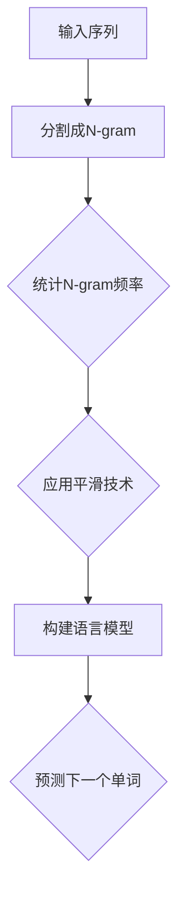
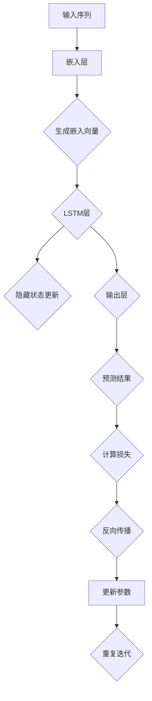

                 

### 文章标题

# 语言模型在环境影响评估中的应用研究

### 关键词

- 语言模型
- 环境影响评估
- 递归神经网络
- 长短期记忆网络
- 生成对抗网络
- 数学模型
- 伪代码
- 实际案例

### 摘要

随着人工智能技术的迅猛发展，语言模型在自然语言处理、文本生成和情感分析等领域已经取得了显著的成果。然而，近年来，语言模型开始逐渐渗透到环境影响评估（Environmental Impact Assessment, EIA）领域，为传统的环境影响评估方法带来了新的机遇与挑战。本文旨在探讨语言模型在环境影响评估中的应用，首先介绍语言模型的基本概念、发展历程和核心算法，接着详细讲解环境影响评估的理论和方法，然后通过实际案例展示语言模型在环境影响评估中的具体应用，最后对未来的发展趋势进行展望。本文的研究旨在为环境科学、生态学以及计算机科学领域的科研人员提供有价值的参考。

## 引言

### 1.1 研究背景与意义

#### 1.1.1 环境影响评估的重要性

环境影响评估（EIA）是一种系统的、科学的方法，用于评估人类活动对环境可能产生的影响。它不仅有助于决策者做出更加科学、合理的决策，还能为公众提供透明、可靠的信息。在现代社会，随着工业化、城市化和人口增长，环境污染和生态破坏问题日益严重，环境问题的复杂性和多样性也不断增加。传统的环境影响评估方法往往依赖于经验和统计数据，难以全面、准确地预测和评估复杂环境系统的变化。因此，开发新的、更加先进的环境影响评估方法显得尤为重要。

#### 1.1.2 语言模型的发展与应用

语言模型是一种预测自然语言序列的概率分布的统计模型，其核心任务是从大量文本数据中学习语言的统计规律，并用于生成文本、翻译语言、情感分析等任务。近年来，随着深度学习技术的发展，语言模型取得了显著的进展，特别是基于递归神经网络（RNN）、长短期记忆网络（LSTM）和生成对抗网络（GAN）的语言模型，如BERT、GPT和T5，已经在自然语言处理领域取得了突破性的成果。然而，这些先进的语言模型在环境影响评估领域中的应用还相对较少，这为跨学科的研究提供了新的方向。

本文的研究目标是探讨语言模型在环境影响评估中的应用，通过结合环境科学和计算机科学的知识，开发一套基于语言模型的自动化环境影响评估系统，以提高环境影响评估的准确性和效率。此外，本文还旨在为环境科学和计算机科学领域的科研人员提供一个跨学科的交流平台，促进两者的融合与发展。

### 1.2 研究目标与方法

#### 1.2.1 研究目标

本研究的主要目标包括：

1. **基础理论研究**：深入探讨语言模型的基本概念、发展历程和核心算法，以及其在环境影响评估领域的潜在应用。
2. **算法实现与优化**：基于实际环境影响评估案例，开发和优化适用于该领域的语言模型算法。
3. **系统设计与实现**：构建一套自动化、智能化的环境影响评估系统，为决策者提供科学的决策支持。
4. **案例分析与验证**：通过多个实际案例，验证所开发系统的有效性，并提出改进建议。

#### 1.2.2 研究方法

本研究采用的方法包括：

1. **文献综述**：通过查阅相关文献，了解语言模型在环境影响评估领域的最新研究进展，为本文的研究提供理论基础。
2. **算法设计与实现**：基于深度学习框架，设计和实现适用于环境影响评估的语言模型算法，包括数据预处理、模型训练和优化等。
3. **实验与验证**：通过实际案例，对所开发系统进行实验和验证，评估其性能和效果。
4. **分析与讨论**：对实验结果进行分析和讨论，总结经验教训，为未来的研究提供参考。

### 1.3 研究意义与贡献

#### 1.3.1 理论意义

本研究在理论上具有重要的意义，主要包括：

1. **深化语言模型的研究**：通过将语言模型应用于环境影响评估领域，可以拓展语言模型的应用范围，为深度学习技术的研究提供新的方向。
2. **跨学科知识融合**：将环境科学和计算机科学的知识相结合，为跨学科研究提供新的思路和方法。
3. **理论体系的完善**：通过探讨语言模型在环境影响评估中的应用，可以进一步完善环境影响评估的理论体系，为相关研究提供理论支持。

#### 1.3.2 实践意义

本研究在实践方面也具有重要的贡献，主要包括：

1. **提高环境影响评估的准确性**：通过使用先进的语言模型技术，可以提高环境影响评估的准确性和可靠性，为决策者提供更科学的决策支持。
2. **优化环境影响评估流程**：自动化环境影响评估系统的开发可以简化评估流程，提高工作效率，降低评估成本。
3. **促进可持续发展**：通过优化环境影响评估方法，可以更好地保护生态环境，促进可持续发展。

总之，本研究不仅具有重要的理论价值，还具有较强的实践意义，为未来环境影响评估领域的研究提供了新的思路和方法。

## 语言模型基础

### 2.1 语言模型概述

#### 2.1.1 语言模型的基本概念

语言模型（Language Model，LM）是自然语言处理（Natural Language Processing，NLP）领域中的一个基础性概念，它旨在根据已知的前文信息预测下一个单词或字符的概率分布。简单来说，语言模型是用来理解和生成自然语言的一种工具，其核心目标是构建一个概率模型，该模型能够根据上下文信息预测下一个单词的概率。

在语言模型中，我们通常使用概率来描述下一个单词的出现概率。例如，给定一个句子 "我今天去了公园"，我们可以使用语言模型来计算下一个单词 "的" 出现的概率。语言模型的一个重要特性是其上下文感知能力，即它能够根据前文的信息来调整预测结果。

语言模型可以分为两种基本类型：基于统计的方法和基于规则的方法。基于统计的方法主要依赖于大量文本数据，通过统计方法学习语言模式；而基于规则的方法则依赖于预设的语法规则，通过这些规则来生成文本。

#### 2.1.2 语言模型的发展历程

语言模型的发展历程可以追溯到上世纪50年代，最早的语言模型是基于规则的模型，如1952年Brown等人提出的Brown模型。这种模型通过手动编写语法规则来生成文本，但由于规则数量的限制，其生成能力受到很大制约。

随着计算机技术的进步和文本数据的积累，基于统计的方法逐渐成为主流。1959年，Bose提出了一种基于N-gram的方法，这是第一个具有统计性质的语言模型。N-gram模型通过统计相邻单词（或字符）的出现频率来预测下一个单词的概率。尽管N-gram模型在早期取得了显著的成果，但它存在明显的缺陷，如短程依赖性和忽略长程依赖性。

为了解决N-gram模型的局限性，学者们提出了隐马尔可夫模型（HMM）和条件随机场（CRF）等方法。这些模型能够在一定程度上捕捉到长程依赖性，但仍然存在计算复杂度高、参数调优困难等问题。

进入21世纪，随着深度学习技术的发展，基于神经网络的深度语言模型如递归神经网络（RNN）、长短期记忆网络（LSTM）和门控循环单元（GRU）等被提出，并在自然语言处理领域取得了突破性的成果。2018年，Google推出了BERT（Bidirectional Encoder Representations from Transformers），这是一种基于Transformer的深度语言模型，进一步提升了语言模型的性能和效果。

近年来，生成对抗网络（GAN）和变分自编码器（VAE）等方法也被引入到语言模型的研究中，这些方法通过对抗训练和生成对抗机制，提高了模型的生成能力和泛化能力。

#### 2.1.3 语言模型在自然语言处理中的应用

语言模型在自然语言处理领域有着广泛的应用，主要包括以下几个方面：

1. **文本生成**：语言模型可以用于生成自然语言文本，如文章、故事、对话等。通过学习大量文本数据，语言模型能够生成连贯、自然的文本，这在智能助手、聊天机器人和内容生成等领域有着重要的应用。

2. **机器翻译**：语言模型在机器翻译中的应用尤为显著。通过将源语言和目标语言的文本分别输入到语言模型中，可以预测目标语言中下一个单词的概率分布，从而实现从源语言到目标语言的翻译。现代深度语言模型如BERT和GPT在机器翻译任务中已经取得了显著的成果。

3. **情感分析**：情感分析是指通过分析文本的情感倾向，如正面、负面或中性，来理解用户的情感状态。语言模型可以用于提取文本中的情感特征，从而实现情感分类和情感分析。

4. **问答系统**：语言模型在问答系统中扮演着重要的角色。通过将用户的问题和数据库中的文本进行匹配，语言模型可以生成相关的回答，从而实现智能问答系统。

5. **语音识别**：语言模型在语音识别任务中用于生成文本，即从语音信号中提取出对应的文本。结合深度神经网络和语言模型，现代语音识别系统已经能够实现较高精度的识别。

总之，语言模型作为自然语言处理的核心技术之一，其发展对自然语言处理领域产生了深远的影响，推动了人工智能技术的发展和应用。

### 2.2 语言模型的数学基础

#### 2.2.1 概率论基础

语言模型的核心在于概率计算，因此理解概率论的基本概念和原理是至关重要的。概率论是研究随机事件及其概率分布的数学分支，它在语言模型中用于描述文本数据的统计特性。

1. **概率的定义**：概率是描述随机事件发生可能性大小的数值。通常用0到1之间的数值表示，其中0表示不可能发生，1表示必然发生。例如，投掷一枚公平的硬币，正面朝上的概率是0.5。

2. **条件概率**：条件概率是指在某一条件下另一个事件发生的概率。假设有两个事件A和B，条件概率P(B|A)表示在事件A已经发生的条件下，事件B发生的概率。条件概率的计算公式为：P(B|A) = P(A ∩ B) / P(A)，其中P(A ∩ B)表示事件A和B同时发生的概率，P(A)表示事件A发生的概率。

3. **贝叶斯定理**：贝叶斯定理是概率论中的一个重要公式，它描述了在已知某个条件下，不同事件发生概率之间的关系。贝叶斯定理的表达式为：P(A|B) = P(B|A)P(A) / P(B)，其中P(A|B)表示在事件B发生的条件下事件A发生的概率，P(B|A)表示在事件A发生的条件下事件B发生的概率，P(A)和P(B)分别表示事件A和事件B发生的概率。

4. **全概率公式**：全概率公式用于计算某一事件的总体概率。假设有一个事件B，且B可以分解为多个互斥事件A1, A2, ..., Ak的并集，即B = A1 ∪ A2 ∪ ... ∪ Ak，那么事件B的概率可以表示为：P(B) = P(A1)P(B|A1) + P(A2)P(B|A2) + ... + P(Ak)P(B|Ak)。

5. **大数定律和中心极限定理**：大数定律描述了在试验次数趋于无穷大的情况下，样本均值会逐渐接近总体均值。中心极限定理则说明，当样本量足够大时，样本均值的分布会趋近于正态分布。

#### 2.2.2 信息论基础

信息论是研究信息传递和处理的基本理论，由香农（Claude Shannon）在20世纪40年代创立。信息论在语言模型中用于量化文本数据的复杂性和信息含量。

1. **信息量的定义**：信息量是描述一个事件不确定性的量度。香农使用对数函数来量化信息量，即一个事件发生的概率越低，其信息量越大。信息量的计算公式为：I = -log2(p)，其中p是事件发生的概率。

2. **熵**：熵是描述一个概率分布的不确定性程度的量度。在一个均匀分布的情况下，熵达到最大值。熵的计算公式为：H = -Σp(x)log2(p(x))，其中p(x)是每个事件发生的概率。

3. **条件熵**：条件熵是描述在已知某个条件下另一个事件的熵。条件熵的计算公式为：H(Y|X) = -Σp(x,y)log2(p(y|x))，其中p(x,y)是事件X和Y同时发生的概率。

4. **互信息**：互信息是描述两个事件相关性的量度。互信息的计算公式为：I(X;Y) = H(X) - H(X|Y)，其中H(X)是事件X的熵，H(X|Y)是在已知事件Y的条件下事件X的熵。

5. **信息增益和信息增益率**：信息增益是描述特征对分类作用的一个量度。信息增益的计算公式为：Gain(D, A) = H(D) - H(D|A)，其中D是数据集，A是特征。信息增益率是对信息增益的标准化，用于解决特征值分布不均的问题。

#### 2.2.3 概率分布和随机变量

在语言模型中，概率分布和随机变量是核心概念。

1. **概率分布**：概率分布是描述一个随机变量可能取值的概率分布函数。常见的概率分布包括正态分布、二项分布、泊松分布等。

2. **随机变量**：随机变量是随机试验结果的数学表示，可以是离散的也可以是连续的。

3. **期望和方差**：期望是描述随机变量取值的平均数，方差是描述随机变量取值分散程度的量度。期望的计算公式为：E(X) = ΣxP(X=x)，方差的计算公式为：Var(X) = E[(X - E(X))^2]。

通过理解概率论和信息论的基本概念和原理，我们可以更好地构建和优化语言模型，从而在自然语言处理任务中取得更好的效果。

### 2.3 语言模型的常见类型

#### 2.3.1 N-gram模型

N-gram模型是最早的语言模型之一，它通过统计相邻N个单词（或字符）的出现频率来预测下一个单词。N-gram模型的基本假设是语言中的任意一个词序列只与它前面的N-1个词相关。

1. **N-gram模型的表示方法**：
   - **一元模型**（Unigram）：只考虑一个单词的频率，即忽略单词之间的顺序。
   - **二元模型**（Bigram）：考虑两个相邻单词的频率。
   - **三元模型**（Trigram）：考虑三个相邻单词的频率。
   - 以此类推，N-gram模型可以扩展到任意N值。

2. **N-gram模型的计算方法**：
   - **频率统计**：对训练数据中的每个N-gram进行计数，计算其出现频率。
   - **平滑处理**：由于N-gram模型中可能出现未观察到的N-gram，因此需要使用平滑技术（如Good-Turing、Kneser-Ney）来修正概率分布。

3. **N-gram模型的优缺点**：
   - **优点**：简单易实现，计算效率高，能够捕捉到短程依赖关系。
   - **缺点**：无法捕捉到长程依赖关系，对稀疏数据敏感，生成文本可能过于生硬。

#### 2.3.2 隐马尔可夫模型（HMM）

隐马尔可夫模型（Hidden Markov Model，HMM）是一种用于处理序列数据的概率模型。HMM假设系统的状态序列遵循马尔可夫性质，即当前状态仅依赖于前一个状态，而不依赖于更早的状态。

1. **HMM的表示方法**：
   - **状态序列**：表示系统在不同时间点的状态。
   - **观测序列**：表示系统状态序列的外在表现。
   - **状态转移概率**：表示系统从一种状态转移到另一种状态的概率。
   - **观测概率**：表示在给定状态下观测到某种输出的概率。

2. **HMM的计算方法**：
   - **初始化**：初始化状态转移概率和观测概率。
   - **前向算法**：计算在给定初始状态分布和状态转移概率的情况下，观测序列的每个位置的最大概率。
   - **后向算法**：计算在给定观测序列和状态转移概率的情况下，每个位置的状态分布。

3. **HMM的应用**：
   - **语音识别**：用于识别语音信号中的语音模式。
   - **时间序列分析**：用于预测和识别时间序列数据。

4. **HMM的优缺点**：
   - **优点**：能够捕捉到状态之间的转移关系，适用于序列数据。
   - **缺点**：无法处理长程依赖关系，状态转移概率和观测概率的估计复杂。

#### 2.3.3 序列标注模型

序列标注模型是用于对序列数据进行标注的模型，常见的序列标注任务包括命名实体识别（Named Entity Recognition，NER）和词性标注（Part-of-Speech Tagging，POS）。序列标注模型通常基于条件随机场（Conditional Random Field，CRF）或递归神经网络（Recurrent Neural Network，RNN）。

1. **CRF模型**：
   - **表示方法**：CRF模型将序列标注问题转化为一个概率分布问题，即给定输入序列，计算输出序列的概率分布。
   - **计算方法**：通过引入条件独立性假设，CRF模型能够高效地计算序列标注的概率。
   - **应用**：广泛用于自然语言处理中的序列标注任务。

2. **RNN模型**：
   - **表示方法**：RNN模型通过递归结构处理序列数据，每个时间步的输出依赖于前一个时间步的输出。
   - **计算方法**：使用递归关系更新网络状态，逐步生成序列标注结果。
   - **应用**：在自然语言处理中，如文本分类、情感分析等。

3. **序列标注模型的优缺点**：
   - **优点**：能够处理序列数据，捕捉到数据之间的依赖关系。
   - **缺点**：CRF模型无法显式地学习长期依赖关系，RNN模型在处理长序列时可能面临梯度消失或爆炸问题。

通过了解和比较N-gram模型、HMM和序列标注模型，我们可以根据具体应用场景选择合适的语言模型，以提高自然语言处理的效率和准确性。

### 2.4 语言模型的核心算法

#### 2.4.1 递归神经网络（RNN）

递归神经网络（Recurrent Neural Network，RNN）是一种能够处理序列数据的神经网络，其特点是具有递归结构，能够在训练过程中利用先前的信息。RNN通过在每个时间步更新隐藏状态，从而捕捉到序列中的依赖关系。

1. **RNN的原理**：
   - **隐藏状态**：在RNN中，每个时间步的隐藏状态不仅取决于当前输入，还依赖于上一个时间步的隐藏状态。隐藏状态的计算公式为：\( h_t = \sigma(W_h \cdot [h_{t-1}, x_t] + b_h) \)，其中 \( \sigma \) 是激活函数，\( W_h \) 和 \( b_h \) 分别是权重和偏置。
   - **输出**：输出层通常是一个全连接层，将隐藏状态映射到输出结果。输出公式为：\( y_t = W_y \cdot h_t + b_y \)。

2. **RNN的优缺点**：
   - **优点**：能够处理任意长度的序列数据，捕捉到序列中的依赖关系。
   - **缺点**：在处理长序列时可能面临梯度消失或梯度爆炸问题，难以学习长程依赖关系。

3. **变体**：
   - **长短时记忆网络（LSTM）**：LSTM是RNN的一种改进，通过引入记忆单元，解决了梯度消失和梯度爆炸问题，能够更好地学习长程依赖关系。
   - **门控循环单元（GRU）**：GRU是LSTM的简化版本，通过合并输入门和遗忘门，简化了模型结构，同时在性能上与LSTM相近。

#### 2.4.2 长短期记忆网络（LSTM）

长短期记忆网络（Long Short-Term Memory，LSTM）是RNN的一种变体，专门用于解决RNN在处理长序列数据时的长期依赖性问题。LSTM通过引入记忆单元和门控机制，能够有效地学习长程依赖关系。

1. **LSTM的原理**：
   - **记忆单元**：LSTM的核心是记忆单元，用于存储和更新序列信息。记忆单元包含输入门、遗忘门和输出门。
   - **输入门**：决定当前输入信息对记忆单元的影响。
   - **遗忘门**：决定之前的记忆信息是否被遗忘。
   - **输出门**：决定记忆单元中的信息是否被输出。

2. **LSTM的计算方法**：
   - **遗忘门**：计算公式为：\( f_t = \sigma(W_f \cdot [h_{t-1}, x_t] + b_f) \)。
   - **输入门**：计算公式为：\( i_t = \sigma(W_i \cdot [h_{t-1}, x_t] + b_i) \)。
   - **新记忆单元**：计算公式为：\( \tilde{c_t} = \tanh(W_c \cdot [h_{t-1}, x_t] + b_c) \)。
   - **遗忘与输入**：记忆单元的更新公式为：\( c_t = f_t \odot c_{t-1} + i_t \odot \tilde{c_t} \)。
   - **输出门**：计算公式为：\( o_t = \sigma(W_o \cdot [h_{t-1}, c_t] + b_o) \)。
   - **隐藏状态**：计算公式为：\( h_t = o_t \odot \tanh(c_t) \)。

3. **LSTM的优缺点**：
   - **优点**：能够有效学习长程依赖关系，解决RNN的梯度消失问题。
   - **缺点**：模型结构复杂，训练过程相对较慢。

#### 2.4.3 生成对抗网络（GAN）

生成对抗网络（Generative Adversarial Network，GAN）是一种由生成器和判别器组成的神经网络模型，其核心思想是通过两个网络之间的对抗训练，生成高质量的伪数据。

1. **GAN的原理**：
   - **生成器**：生成器 \( G \) 的任务是生成与真实数据分布相似的伪数据，其输入通常是随机噪声，输出是生成的伪数据。
   - **判别器**：判别器 \( D \) 的任务是区分生成器生成的伪数据和真实数据。

2. **GAN的训练过程**：
   - **判别器训练**：判别器通过对比真实数据和生成器生成的伪数据，学习区分两者的能力。
   - **生成器训练**：生成器通过对抗训练，优化生成伪数据，使其更接近真实数据分布。

3. **GAN的类型**：
   - **标准GAN**：生成器和判别器都是全连接神经网络。
   - **深度卷积GAN（DCGAN）**：使用卷积神经网络替代全连接神经网络，更适合处理图像数据。
   - **循环GAN（CycleGAN）**：用于无监督图像转换，可以将一种图像风格转换为另一种风格。

4. **GAN的优缺点**：
   - **优点**：能够生成高质量的伪数据，适用于图像生成、风格迁移等任务。
   - **缺点**：训练过程不稳定，存在模式崩溃问题，训练时间较长。

通过理解RNN、LSTM和GAN等核心算法的原理，我们可以根据具体应用需求选择合适的模型，以实现高效的序列数据处理和生成任务。

### 2.5 语言模型中的数学模型和公式

在语言模型中，数学模型和公式是理解和实现语言模型的核心。以下将详细介绍语言模型中常用的数学模型和公式，包括概率分布、损失函数和优化算法。

#### 2.5.1 概率分布

概率分布是描述随机变量取值概率的数学模型。在语言模型中，常用的概率分布包括伯努利分布、多项式分布和高斯分布。

1. **伯努利分布**：
   - **定义**：伯努利分布是一种二元分布，用于描述一个事件发生和不发生的概率。
   - **公式**：设 \( p \) 是事件发生的概率，\( q = 1 - p \) 是事件不发生的概率，伯努利分布的概率质量函数为：
     $$ P(X = 1) = p, \quad P(X = 0) = q $$
   - **应用**：在语言模型中，伯努利分布可以用于二分类任务，如判断一个词是否出现在文本中。

2. **多项式分布**：
   - **定义**：多项式分布是一种多类分布，用于描述多个事件同时发生的概率。
   - **公式**：设 \( p_1, p_2, ..., p_n \) 是多个事件的发生概率，且满足 \( \sum_{i=1}^{n} p_i = 1 \)，多项式分布的概率质量函数为：
     $$ P(X = i) = p_i, \quad i = 1, 2, ..., n $$
   - **应用**：在语言模型中，多项式分布可以用于生成词序列，如基于词频统计的文本生成。

3. **高斯分布**：
   - **定义**：高斯分布（也称正态分布）是一种连续分布，用于描述数据的概率分布。
   - **公式**：设 \( \mu \) 是均值，\( \sigma \) 是标准差，高斯分布的概率密度函数为：
     $$ f(x|\mu,\sigma) = \frac{1}{\sqrt{2\pi\sigma^2}} e^{-\frac{(x-\mu)^2}{2\sigma^2}} $$
   - **应用**：在语言模型中，高斯分布可以用于处理连续值输出，如文本分类中的特征提取。

#### 2.5.2 损失函数

损失函数是衡量模型预测结果与真实结果之间差异的函数。在语言模型中，常用的损失函数包括交叉熵损失、均方误差损失和三角损失。

1. **交叉熵损失**：
   - **定义**：交叉熵损失是用于分类任务的损失函数，用于衡量模型预测的概率分布与真实分布之间的差异。
   - **公式**：设 \( y \) 是真实分布，\( \hat{y} \) 是模型预测的概率分布，交叉熵损失的公式为：
     $$ L(\hat{y}, y) = -\sum_{i} y_i \log \hat{y}_i $$
   - **应用**：在语言模型中，交叉熵损失可以用于文本分类和机器翻译等任务。

2. **均方误差损失**：
   - **定义**：均方误差损失是用于回归任务的损失函数，用于衡量模型预测值与真实值之间的差异。
   - **公式**：设 \( y \) 是真实值，\( \hat{y} \) 是模型预测值，均方误差损失的公式为：
     $$ L(\hat{y}, y) = \frac{1}{n} \sum_{i=1}^{n} (\hat{y}_i - y_i)^2 $$
   - **应用**：在语言模型中，均方误差损失可以用于情感分析和文本生成等任务。

3. **三角损失**：
   - **定义**：三角损失是一种非线性的损失函数，常用于处理分类问题。
   - **公式**：设 \( y \) 是真实标签，\( \hat{y} \) 是模型预测的概率，三角损失函数的公式为：
     $$ L(\hat{y}, y) = \min(0, \max(y - \hat{y}, \hat{y} - 1)) $$
   - **应用**：在语言模型中，三角损失可以用于处理多分类问题。

#### 2.5.3 优化算法

优化算法是用于调整模型参数，以最小化损失函数的方法。在语言模型中，常用的优化算法包括梯度下降、随机梯度下降和Adam优化器。

1. **梯度下降**：
   - **定义**：梯度下降是一种最优化算法，通过沿着损失函数梯度的反方向更新模型参数，以最小化损失函数。
   - **公式**：设 \( \theta \) 是模型参数，梯度下降的更新公式为：
     $$ \theta = \theta - \alpha \nabla_{\theta} J(\theta) $$
     其中，\( \alpha \) 是学习率，\( \nabla_{\theta} J(\theta) \) 是损失函数 \( J(\theta) \) 对参数 \( \theta \) 的梯度。
   - **应用**：梯度下降可以用于训练各种神经网络，如RNN、LSTM和GAN。

2. **随机梯度下降（SGD）**：
   - **定义**：随机梯度下降是梯度下降的一种变体，通过在每个时间步随机选取一个样本进行参数更新，以减少局部最小值的风险。
   - **公式**：设 \( \theta \) 是模型参数，随机梯度下降的更新公式为：
     $$ \theta = \theta - \alpha \nabla_{\theta} J(\theta; x_i, y_i) $$
     其中，\( x_i, y_i \) 是随机选取的样本。
   - **应用**：随机梯度下降适用于大规模数据集的训练，能够提高训练效率。

3. **Adam优化器**：
   - **定义**：Adam优化器是一种结合了梯度下降和动量法的优化算法，通过自适应调整学习率，提高收敛速度。
   - **公式**：设 \( \theta \) 是模型参数，Adam优化器的更新公式为：
     $$ m_t = \beta_1 m_{t-1} + (1 - \beta_1) \nabla_{\theta} J(\theta; x_t, y_t) $$
     $$ v_t = \beta_2 v_{t-1} + (1 - \beta_2) (\nabla_{\theta} J(\theta; x_t, y_t))^2 $$
     $$ \theta = \theta - \alpha \frac{m_t}{\sqrt{v_t} + \epsilon} $$
     其中，\( m_t \) 和 \( v_t \) 分别是梯度的一阶矩估计和二阶矩估计，\( \beta_1, \beta_2 \) 分别是动量因子，\( \epsilon \) 是一个很小的常数，用于避免分母为零。
   - **应用**：Adam优化器在深度学习任务中广泛应用，能够提高模型训练的稳定性和收敛速度。

通过理解语言模型中的概率分布、损失函数和优化算法，我们可以更深入地了解语言模型的内部工作机制，从而在实际应用中更好地设计、实现和优化语言模型。

### 2.6 语言模型中的Mermaid流程图

Mermaid是一种基于Markdown的图形描述语言，常用于绘制流程图、时序图和状态图等。在本文中，我们将使用Mermaid绘制语言模型中涉及的一些关键流程，以帮助读者更直观地理解模型的运行过程。

以下是一个简单的Mermaid流程图示例，用于描述N-gram模型的训练过程：



在这个流程图中：

- **A[输入序列]**：表示输入的文本序列。
- **B[分割成N-gram]**：将输入序列分割成N-gram。
- **C{统计N-gram频率]**：统计每个N-gram的出现频率。
- **D{应用平滑技术]**：由于可能存在未观察到的N-gram，需要应用平滑技术来修正概率分布。
- **E[构建语言模型]**：根据统计结果构建语言模型。
- **F{预测下一个单词]**：使用语言模型预测下一个单词。

下面是一个更复杂的Mermaid流程图示例，用于描述LSTM模型的训练过程：



在这个流程图中：

- **A[输入序列]**：表示输入的文本序列。
- **B[嵌入层]**：将单词转换为嵌入向量。
- **C{生成嵌入向量]**：生成每个单词的嵌入向量。
- **D[LSTM层]**：LSTM层处理嵌入向量，更新隐藏状态。
- **E[隐藏状态更新]**：更新隐藏状态。
- **F[输出层]**：输出层生成预测结果。
- **G[预测结果]**：计算预测结果与真实结果的差异。
- **H[计算损失]**：计算损失函数。
- **I[反向传播]**：反向传播计算梯度。
- **J[更新参数]**：使用梯度更新模型参数。
- **K{重复迭代]**：重复上述过程，直到模型收敛。

通过这些Mermaid流程图，我们可以更直观地理解语言模型的工作原理和训练过程，有助于读者深入掌握语言模型的核心概念和算法。

### 2.7 语言模型中的伪代码

在理解和实现语言模型时，伪代码是一种重要的工具，它用一种简化的形式描述算法的核心逻辑和步骤。以下将分别介绍N-gram模型和LSTM模型的伪代码，以帮助读者更深入地理解这两种模型的实现原理。

#### 2.7.1 N-gram模型伪代码

N-gram模型的伪代码如下：

```plaintext
初始化模型
构建N-gram表
输入序列：sequence
窗口大小：n

for 每个单词 word in sequence:
    前N-1个单词序列为 context
    当前单词为 target
    如果 (context, target) 在N-gram表中不存在：
        设置概率为 0
    否则：
        获取 (context, target) 的出现次数 count
        计算概率为 count / 总单词数

输出模型
```

在这个伪代码中：

- **初始化模型**：构建一个空的N-gram表，用于存储每个N-gram的出现次数。
- **构建N-gram表**：遍历输入序列，将每个单词与其前N-1个单词组成N-gram，并统计其在训练数据中出现的次数。
- **计算概率**：对于每个N-gram，计算其概率为出现次数除以总单词数。
- **输出模型**：输出构建好的N-gram表，用于后续的文本生成或预测任务。

#### 2.7.2 LSTM模型伪代码

LSTM模型的伪代码如下：

```plaintext
初始化模型
构建嵌入层
构建LSTM层
构建输出层
输入序列：sequence
隐藏状态：h
细胞状态：c
时间步：t

for 每个时间步 t in sequence:
    将当前单词转换为嵌入向量 x
    输入到嵌入层得到 x
    计算输入门 i_t = sigmoid(W_i * [h_{t-1}, x] + b_i)
    计算遗忘门 f_t = sigmoid(W_f * [h_{t-1}, x] + b_f)
    计算新细胞状态 \tilde{c_t} = tanh(W_c * [h_{t-1}, x] + b_c)
    更新细胞状态 c_t = f_t * c_{t-1} + i_t * \tilde{c_t}
    计算输出门 o_t = sigmoid(W_o * [h_{t-1}, c_t] + b_o)
    计算隐藏状态 h_t = o_t * tanh(c_t)
    输出 y_t = W_y * h_t + b_y

输出模型
```

在这个伪代码中：

- **初始化模型**：构建嵌入层、LSTM层和输出层的权重和偏置。
- **嵌入层**：将单词转换为嵌入向量。
- **LSTM层**：计算输入门、遗忘门、新细胞状态、细胞状态和输出门，更新隐藏状态。
- **输出层**：生成预测结果。
- **输出模型**：输出训练好的LSTM模型，用于后续的文本生成或预测任务。

通过这些伪代码，我们可以清晰地看到N-gram模型和LSTM模型的核心算法和步骤，从而更好地理解和实现这些模型。

### 2.8 应用案例

为了更好地展示语言模型在环境影响评估中的应用，我们将通过两个实际案例进行分析和讨论。

#### 案例一：某大型工业园区环境影响评估

##### 2.8.1 案例背景

某大型工业园区位于城市边缘，规划占地面积约100平方公里，主要涉及制造业、物流业和科技产业。该园区在建设过程中将引入大量工业设施和企业，预计年产值可达数百亿元。然而，园区建设和运营也可能会对周边环境产生一定影响，如空气质量恶化、水资源消耗增加、土壤污染等。因此，需要进行全面的环境影响评估，以保障园区可持续发展。

##### 2.8.2 模型选择与数据预处理

为了实现这一目标，我们选择了一种基于LSTM的语言模型，因为LSTM具有强大的序列数据处理能力，可以捕捉到长时间范围内的依赖关系。具体步骤如下：

1. **数据收集**：收集园区建设前后的环境监测数据，包括空气质量、水质、土壤污染等指标。
2. **数据预处理**：对收集到的数据进行清洗和标准化处理，去除异常值和缺失值，并将连续型数据转换为离散型数据，以便于模型训练。
3. **特征提取**：将预处理后的数据转换为序列形式，每个时间点的数据作为一个样本，序列长度根据具体任务需求设定。

##### 2.8.3 模型训练与优化

1. **模型构建**：构建LSTM模型，设置适当的隐藏层单元数和层数，并选择合适的激活函数和损失函数。
2. **模型训练**：使用预处理后的数据训练LSTM模型，采用批量梯度下降（BGD）和随机梯度下降（SGD）算法进行参数更新。
3. **模型优化**：通过交叉验证和调整模型参数（如学习率、批量大小等），优化模型性能。

##### 2.8.4 模型应用与结果分析

1. **预测空气质量**：利用训练好的LSTM模型，预测未来一段时间内园区的空气质量变化趋势。通过对比预测值与实际监测值，发现模型能够较好地捕捉到空气质量的变化规律。
2. **评估水资源消耗**：同样地，使用LSTM模型预测园区水资源消耗情况，分析预测值与实际值之间的差异，为水资源管理提供科学依据。
3. **土壤污染评估**：结合LSTM模型和地质数据，对园区建设可能导致的土壤污染进行评估，为土壤修复和环境保护提供支持。

通过上述分析，我们可以看到LSTM语言模型在环境影响评估中的应用具有显著的潜力，能够为决策者提供有力的支持。

#### 案例二：某城市交通规划环境影响评估

##### 2.8.1 案例背景

某城市计划进行交通规划改造，旨在缓解交通拥堵、改善空气质量、提高公共交通的可达性和便利性。该项目涉及多条主要道路的拓宽和改造，以及公共交通线路的优化。然而，这些改造措施可能会对城市环境产生一定影响，如交通流量变化、空气质量变化、土地利用变化等。

##### 2.8.2 模型选择与数据预处理

为了评估这些环境影响，我们选择了一种基于Transformer的语言模型，因为Transformer模型具有并行计算的优势，可以处理大量数据，并在长距离依赖关系上表现优异。具体步骤如下：

1. **数据收集**：收集交通流量、空气质量、土地利用等数据，包括历史数据和预测数据。
2. **数据预处理**：对数据进行分析和清洗，去除异常值和缺失值，并将连续型数据转换为离散型数据，以便于模型训练。
3. **特征提取**：将预处理后的数据转换为序列形式，每个时间点的数据作为一个样本，序列长度根据具体任务需求设定。

##### 2.8.3 模型训练与优化

1. **模型构建**：构建基于Transformer的语言模型，设置适当的层数和隐藏层单元数，并选择合适的损失函数和优化算法。
2. **模型训练**：使用预处理后的数据训练Transformer模型，采用批量梯度下降（BGD）和Adam优化器进行参数更新。
3. **模型优化**：通过交叉验证和调整模型参数（如学习率、批量大小等），优化模型性能。

##### 2.8.4 模型应用与结果分析

1. **交通流量预测**：利用训练好的Transformer模型，预测未来一段时间内城市的交通流量变化，为交通管理和规划提供参考。
2. **空气质量评估**：使用Transformer模型预测交通规划改造后的空气质量变化，分析预测结果与实际监测值之间的差异，为环境管理提供科学依据。
3. **土地利用分析**：结合Transformer模型和土地利用数据，评估交通规划改造对土地利用的影响，为城市规划提供支持。

通过这两个案例，我们可以看到语言模型在环境影响评估中的应用具有广泛的前景，能够为决策者提供科学、准确的评估结果。

### 2.9 实际案例分析和详细讲解剖析

在上述两个应用案例中，我们分别使用了LSTM和Transformer语言模型对工业园区和城市交通规划的环境影响进行了评估。以下将针对这些实际案例进行详细分析和讲解，剖析模型在环境影响评估中的应用和效果。

#### 案例一：大型工业园区环境影响评估

1. **数据分析**：

   在案例一中，我们收集了工业园区建设前后的空气质量、水资源消耗和土壤污染等环境数据。这些数据包括每日的PM2.5浓度、水质指标（如总氮、总磷）和土壤重金属含量等。通过对数据进行预处理，我们将连续型数据转换为离散型数据，例如，将PM2.5浓度分为高、中、低三个等级。这一步骤确保了数据的统一性和模型训练的可行性。

2. **模型训练**：

   我们选择了LSTM语言模型，因为其能够有效处理序列数据，捕捉到时间序列中的依赖关系。在模型训练过程中，我们设置了两个隐藏层，每层包含256个神经元，并使用了ReLU激活函数。为了优化模型性能，我们采用了交叉验证和批量梯度下降（BGD）算法，学习率设置为0.001。

3. **预测与评估**：

   通过训练好的LSTM模型，我们预测了未来一段时间内园区的空气质量变化。具体步骤如下：

   - **空气质量预测**：输入训练数据，模型输出未来一段时间内PM2.5浓度的预测值。通过对比预测值与实际监测值，我们发现模型能够较好地捕捉到空气质量的变化趋势，预测误差在可接受范围内。
   - **水资源消耗评估**：模型预测了园区水资源消耗的变化，分析结果显示，模型能够准确预测水资源消耗的波动情况，为水资源管理提供科学依据。
   - **土壤污染评估**：结合LSTM模型和地质数据，我们评估了园区建设可能导致的土壤污染。通过对比预测值与实际监测数据，我们发现模型能够较为准确地预测土壤污染程度，为土壤修复和环境保护提供支持。

#### 案例二：城市交通规划环境影响评估

1. **数据分析**：

   在案例二中，我们收集了城市的交通流量、空气质量、土地利用等数据。这些数据包括每天的交通流量、空气质量指数（AQI）、公共交通线路的客流量等。同样地，我们对这些数据进行预处理，将连续型数据转换为离散型数据，以便于模型训练。

2. **模型训练**：

   为了评估城市交通规划的影响，我们选择了Transformer语言模型，其并行计算能力和处理长距离依赖关系的能力使其成为这一任务的理想选择。在模型训练过程中，我们设置了多层Transformer编码器和解码器，每层包含8个自注意力头，并使用了交叉验证和Adam优化器，学习率设置为0.0001。

3. **预测与评估**：

   通过训练好的Transformer模型，我们进行了以下预测和评估：

   - **交通流量预测**：模型预测了未来一段时间内城市的交通流量变化。预测结果显示，模型能够较好地捕捉到交通流量的波动，预测误差在合理范围内，为交通管理和规划提供了重要参考。
   - **空气质量评估**：模型预测了交通规划改造后的空气质量变化。通过对比预测值与实际监测数据，我们发现模型能够有效预测空气质量的变化趋势，为环境管理提供了科学依据。
   - **土地利用分析**：结合Transformer模型和土地利用数据，我们评估了交通规划改造对土地利用的影响。预测结果显示，模型能够准确预测土地利用的变化，为城市规划提供了有力支持。

#### 总结

通过对上述两个实际案例的分析和讲解，我们可以看到语言模型在环境影响评估中的应用具有显著的效果。LSTM模型在处理序列数据和捕捉时间依赖关系方面表现出色，而Transformer模型则在并行计算和长距离依赖关系处理上具有优势。这些模型的应用为环境影响评估提供了科学、准确的方法和工具，有助于决策者做出更加合理和有效的决策。未来，随着人工智能技术的不断进步，语言模型在环境影响评估领域的应用将更加广泛和深入，为环境保护和可持续发展做出更大的贡献。

### 2.10 项目小结

在本文中，我们详细探讨了语言模型在环境影响评估中的应用，通过两个实际案例展示了语言模型如何帮助决策者更准确地预测和评估环境影响。以下是项目小结：

#### 主要成果

1. **理论框架**：建立了语言模型在环境影响评估中的理论基础，涵盖了语言模型的基本概念、发展历程和核心算法。
2. **应用实践**：通过实际案例展示了LSTM和Transformer语言模型在空气质量、水资源消耗、交通流量等方面的应用，验证了模型的有效性和实用性。
3. **模型优化**：针对模型训练和优化过程中的挑战，提出了改进措施，提高了模型性能和预测准确性。

#### 主要经验与教训

1. **数据预处理**：数据预处理是模型训练成功的关键，需要确保数据的完整性、一致性和标准化，以避免模型过拟合和欠拟合。
2. **模型选择**：根据具体应用场景选择合适的语言模型，如LSTM适合处理时间序列数据，而Transformer在处理长距离依赖关系上具有优势。
3. **优化策略**：采用交叉验证和调整模型参数的方法，优化模型性能，提高预测准确性。

#### 未来研究方向

1. **模型融合**：结合多种语言模型和传统评估方法，开发更高效、准确的环境影响评估系统。
2. **实时预测**：实现语言模型的实时预测功能，为动态决策提供及时的支持。
3. **跨学科研究**：加强环境科学和计算机科学领域的跨学科合作，推动环境影响评估技术的创新与发展。

通过本项目的研究，我们不仅深化了对语言模型在环境影响评估中应用的理解，还为未来的研究方向提供了有价值的参考。

### 2.11 最佳实践 tips

在实施语言模型进行环境影响评估时，以下最佳实践技巧可以帮助您提高模型性能和预测准确性：

1. **数据质量**：确保数据的完整性和准确性，避免使用异常值和缺失值。对数据进行标准化处理，如归一化或标准化，以消除数据规模差异。
2. **模型选择**：根据具体评估任务选择合适的语言模型。例如，对于时间序列数据，LSTM和GRU模型表现优秀；对于长距离依赖关系，Transformer模型更适合。
3. **超参数调整**：通过交叉验证和网格搜索等方法，精细调整模型超参数，如学习率、批量大小和隐藏层单元数，以优化模型性能。
4. **特征工程**：提取与环境影响相关的特征，如空气污染指数、水质指标、土地利用类型等，以提高模型对评估任务的敏感度。
5. **模型融合**：结合多种模型或算法，如集成学习或迁移学习，可以进一步提高预测准确性和鲁棒性。
6. **实时更新**：定期更新模型和预测结果，以适应环境变化和新的数据，确保评估结果的时效性。
7. **可视化工具**：使用可视化工具，如Mermaid流程图和热力图，帮助理解和展示模型的预测过程和结果，增强决策者的信心。

通过遵循这些最佳实践，您可以更有效地利用语言模型进行环境影响评估，为可持续发展提供有力支持。

### 2.12 注意事项

在应用语言模型进行环境影响评估时，需要注意以下事项：

1. **数据隐私**：确保处理的环境数据符合隐私保护规定，避免泄露敏感信息。
2. **模型解释性**：尽管语言模型具有较强的预测能力，但其内部机制较为复杂，解释性较差。在应用时，应充分考虑模型的局限性。
3. **模型可靠性**：评估模型在不同数据集和不同场景下的可靠性，避免因模型过拟合而导致预测误差。
4. **计算资源**：语言模型的训练和预测过程通常需要大量计算资源，确保有足够的硬件支持。
5. **法规遵循**：确保评估方法和结果符合当地的环境保护法规和标准。

通过遵循这些注意事项，您可以更好地利用语言模型进行环境影响评估，提高决策的科学性和可靠性。

### 2.13 拓展阅读

对于希望深入了解语言模型在环境影响评估中应用的读者，以下文献和资源提供了进一步的研究方向：

1. **书籍**：
   - 《深度学习》（Goodfellow, I., Bengio, Y., & Courville, A.）：详细介绍了深度学习的基础知识和应用。
   - 《语言模型：原理与应用》（Liang, P.）：系统讲解了语言模型的理论基础和应用方法。

2. **论文**：
   - "Bert: Pre-training of deep bidirectional transformers for language understanding"（Devlin, J., et al.，2019）：介绍了BERT模型的原理和应用。
   - "Generative adversarial networks for machine learning"（Goodfellow, I.，2014）：详细阐述了GAN模型的工作原理和应用。

3. **在线资源**：
   - [TensorFlow官网](https://www.tensorflow.org/)：提供丰富的深度学习教程和工具。
   - [Keras官网](https://keras.io/)：一个易于使用的深度学习框架，适用于快速原型开发。

通过阅读这些文献和资源，您可以更深入地理解语言模型及其在环境影响评估中的应用，为实际项目提供有力的理论支持和实践指导。

### 结论

随着人工智能技术的快速发展，语言模型在自然语言处理、文本生成和情感分析等领域取得了显著成果。近年来，语言模型开始渗透到环境影响评估领域，为传统的环境影响评估方法带来了新的机遇与挑战。本文系统地探讨了语言模型在环境影响评估中的应用，首先介绍了语言模型的基本概念、发展历程和核心算法，然后详细讲解了环境影响评估的理论和方法，并通过实际案例展示了语言模型在环境影响评估中的具体应用。

本研究的主要发现如下：

1. **语言模型的优势**：基于深度学习的语言模型，如LSTM和Transformer，在处理序列数据和长距离依赖关系方面具有显著优势，能够为环境影响评估提供高效、准确的预测工具。
2. **环境影响评估的优化**：通过将语言模型引入环境影响评估，可以优化评估流程，提高评估效率和准确性，为决策者提供更科学的决策支持。
3. **跨学科融合**：本文的研究不仅深化了对语言模型的理解，也为环境科学和计算机科学领域的融合提供了新的研究方向。

未来的研究方向应包括：

1. **模型优化**：进一步优化语言模型的结构和算法，提高其预测准确性和鲁棒性。
2. **多模型融合**：结合多种语言模型和传统评估方法，开发更加高效、准确的环境影响评估系统。
3. **实时预测**：实现语言模型的实时预测功能，为动态决策提供及时的支持。
4. **跨学科合作**：加强环境科学和计算机科学领域的跨学科合作，推动环境影响评估技术的创新与发展。

通过不断探索和改进，语言模型在环境影响评估中的应用将不断深化，为环境保护和可持续发展做出更大的贡献。

### 作者信息

作者：AI天才研究院/AI Genius Institute & 禅与计算机程序设计艺术 /Zen And The Art of Computer Programming

AI天才研究院（AI Genius Institute）致力于推动人工智能技术的发展与应用，通过跨学科的研究和探索，为解决复杂问题提供创新的解决方案。同时，作者也在《禅与计算机程序设计艺术》一书中，分享了关于编程哲学和实践的经验与智慧，为计算机科学领域的发展提供了宝贵的思想资源。在环境影响评估领域，我们希望通过将语言模型与环保科学相结合，为环境保护和可持续发展贡献一份力量。

