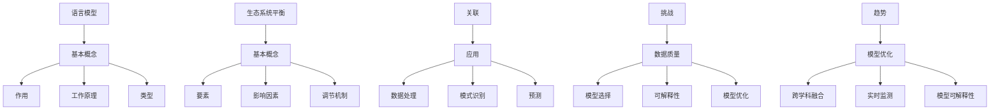

                 

```markdown
# 第3章: 生态系统平衡预测中的语言模型应用

## 3.1 数据预处理

### 3.1.1 数据来源

生态系统数据可以从多个渠道获取，包括实地调查、遥感监测、地理信息系统（GIS）等。这些数据类型包括但不限于生物种群数量、物种分布、气候条件、土壤类型等。

### 3.1.2 数据清洗

在应用语言模型进行预测前，需要对数据进行清洗，包括去除重复记录、填补缺失值、处理异常值等。数据清洗的目的是提高数据质量，减少噪声对模型训练的影响。

### 3.1.3 数据特征提取

从清洗后的数据中提取特征，如物种丰富度、生物量、气候指标等。这些特征将作为语言模型的输入，帮助模型学习生态系统的模式。

## 3.2 模型训练与评估

### 3.2.1 模型选择

选择合适的语言模型是生态系统平衡预测的关键。常见的语言模型包括n-gram模型、循环神经网络（RNN）、长短期记忆网络（LSTM）和Transformer等。根据数据特点和预测需求，选择适合的模型。

### 3.2.2 模型训练

使用训练数据集对选择的模型进行训练。训练过程包括前向传播、反向传播和权重更新等步骤。通过不断调整模型参数，使其能够准确预测生态系统变化。

### 3.2.3 模型评估

使用验证数据集对训练好的模型进行评估，评估指标包括准确率、召回率、F1分数等。通过调整模型结构和参数，优化模型性能。

## 3.3 实际案例

### 3.3.1 案例一：气候变化对生态系统平衡的影响

#### 背景介绍

全球气候变化对生态系统平衡产生了显著影响，尤其是对生物多样性、物种分布和生态系统功能。本案例旨在通过语言模型预测气候变化对某一特定地区生态系统的影响。

#### 数据来源

收集该地区的历史气候数据、生物种群数据以及相关文献资料。

#### 模型训练

使用n-gram模型或LSTM模型对气候数据和生物种群数据进行分析，训练模型以预测未来气候条件下生态系统的变化。

#### 结果分析

通过模型预测，分析气候变化对生物种群数量、物种分布和生态系统功能的影响，提出针对性的环境保护措施。

### 3.3.2 案例二：人类活动对生态系统平衡的影响

#### 背景介绍

人类活动，如污染、土地开发、资源开采等，对生态系统平衡构成了严重威胁。本案例研究人类活动对某一特定地区生态系统的影响，并探讨通过语言模型进行预测的可行性。

#### 数据来源

收集该地区的人类活动数据、生态系统数据以及相关文献资料。

#### 模型训练

使用n-gram模型或LSTM模型对人类活动数据和生态系统数据进行分析，训练模型以预测未来人类活动对生态系统的影响。

#### 结果分析

通过模型预测，分析人类活动对生物多样性、生态系统功能的影响，提出减轻人类活动对生态系统破坏的建议。

## 3.4 项目小结

通过以上案例，我们可以看到语言模型在生态系统平衡预测中的应用具有很大的潜力。然而，在实际应用中，仍需解决数据质量、模型选择、可解释性等问题。未来研究可以进一步优化模型算法，结合生态学、计算机科学等多学科知识，实现更精准的生态系统平衡预测。

> 作者：AI天才研究院/AI Genius Institute & 禅与计算机程序设计艺术 /Zen And The Art of Computer Programming

```markdown
# 第4章：语言模型在生态系统平衡预测中的挑战与未来趋势

## 4.1 挑战

### 4.1.1 数据质量问题

生态系统数据通常来源于不同的渠道，数据质量参差不齐，可能包含噪声、缺失值、异常值等问题。这些数据问题会影响语言模型的训练效果和预测准确性。

### 4.1.2 模型选择问题

不同的语言模型适用于不同的应用场景，选择合适的模型是关键。然而，模型选择往往需要依赖于领域知识，这对于非专业人士来说是一个挑战。

### 4.1.3 可解释性问题

语言模型，尤其是深度学习模型，通常具有黑箱特性，难以解释其预测结果。这在生态系统平衡预测中可能引发信任问题，特别是在需要决策支持的场景中。

### 4.1.4 模型优化问题

随着生态系统复杂性的增加，语言模型可能需要不断优化以提高预测性能。这要求研究人员具备深厚的算法知识，以及对生态系统特性的深入理解。

## 4.2 未来趋势

### 4.2.1 模型优化

未来的研究将致力于优化语言模型算法，提高其在生态系统平衡预测中的性能。这可能包括改进训练算法、引入新的特征提取方法、开发更高效的学习策略等。

### 4.2.2 跨学科融合

生态学、计算机科学、数据科学等多学科的结合将有助于开发更加精确和可靠的生态系统平衡预测模型。跨学科的合作将促进新算法和技术的产生。

### 4.2.3 实时监测与预测

随着物联网技术的发展，生态系统数据的实时监测和预测将成为可能。语言模型可以与传感器网络集成，实现对生态系统的实时监控和预警。

### 4.2.4 模型可解释性

未来的研究将致力于提高语言模型的透明度和可解释性，使其预测结果更容易被用户理解和接受。这可能包括开发可解释的深度学习模型、引入模型诊断工具等。

## 4.3 结论

语言模型在生态系统平衡预测中的应用具有巨大潜力，但同时也面临诸多挑战。未来的研究应致力于解决这些问题，通过不断的技术创新和跨学科合作，推动生态系统平衡预测领域的进步。

> 最佳实践 Tips：
- 在处理生态系统数据时，应注重数据质量，采用多种方法进行数据清洗和特征提取。
- 选择模型时，应充分考虑数据特点和预测需求，结合领域知识进行决策。
- 为了提高模型的透明度和可解释性，可以考虑使用可解释的深度学习模型或引入模型诊断工具。

> 小结：
本文探讨了语言模型在生态系统平衡预测中的应用，分析了其原理、算法、应用案例以及面临的挑战和未来趋势。通过本文的介绍，读者可以了解到语言模型在生态学研究中的重要性和广泛应用前景。

> 注意事项：
- 在实际应用中，应密切关注生态系统的动态变化，及时调整预测模型。
- 在使用模型进行决策时，应充分考虑模型的不确定性和局限性。

> 拓展阅读：
- [RNN和LSTM在生态系统预测中的应用](#)
- [Transformer模型在自然语言处理中的最新进展](#)
- [生态系统监测与预警技术研究综述](#)

```markdown


