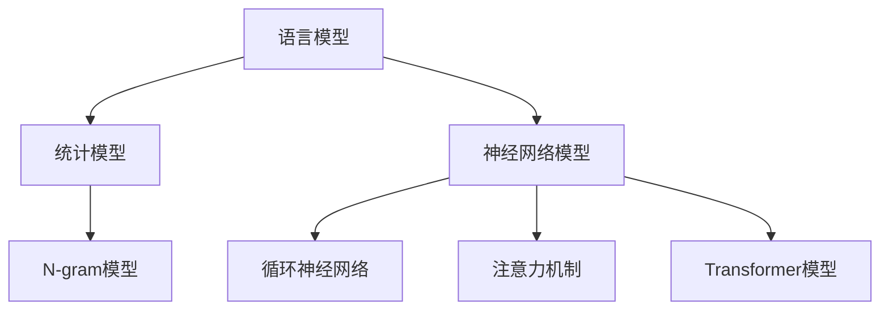
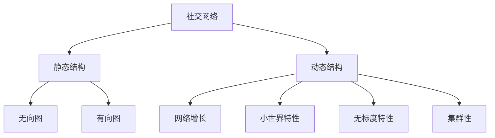

                 

### 文章标题

# 语言模型在社交网络演化预测中的应用研究

### 文章关键词

- 语言模型
- 社交网络
- 演化预测
- 神经网络
- 机器学习

### 摘要

本文主要探讨语言模型在社交网络演化预测中的应用。首先，介绍了语言模型的基础概念和数学原理，包括隐马尔可夫模型（HMM）、循环神经网络（RNN）、注意力机制和Transformer模型。接着，阐述了社交网络的基本概念和动态特性，并详细分析了语言模型在社交网络演化预测中的应用，如内容分析和用户行为预测。通过两个实际案例，展示了语言模型在社交网络演化预测中的具体应用和效果。最后，对语言模型在社交网络演化预测中的应用前景进行了展望，并提出了相应的挑战和解决方案。

### 目录

## 第一部分：语言模型基础

### 第1章：语言模型概述

### 第2章：语言模型的数学原理

#### 2.1 隐马尔可夫模型（HMM）

#### 2.2 循环神经网络（RNN）

#### 2.3 注意力机制

#### 2.4 Transformer模型

## 第二部分：社交网络演化预测

### 第3章：社交网络的基本概念

### 第4章：语言模型在社交网络演化预测中的应用

### 第5章：社交网络演化预测案例研究

#### 5.1 微博网络演化预测案例

#### 5.2 Twitter网络演化预测案例

## 第三部分：应用与展望

### 第6章：语言模型在社交网络演化预测中的应用前景

### 第7章：总结与展望

### 第一部分：语言模型基础

#### 第1章：语言模型概述

语言模型是自然语言处理（NLP）领域的一个重要分支，其核心目的是模拟人类语言生成和理解的能力。在社交网络演化预测中，语言模型可以用于分析用户发布的内容，预测用户的未来行为和社交网络的发展趋势。本章节将介绍语言模型的基本概念、类型和发展历程。

#### 1.1 语言模型的概念与重要性

语言模型（Language Model）是一种统计模型，用于预测一段文本的下一个单词或字符。它是基于大量语言数据训练得到的，可以模拟人类语言生成和理解的能力。在社交网络演化预测中，语言模型可以用于分析用户发布的内容，提取关键信息，并预测用户的未来行为和社交网络的发展趋势。

#### 1.2 语言模型的类型

根据模型的结构和原理，语言模型可以分为以下几类：

1. **N-gram模型**：基于历史信息进行预测，是最简单和最常用的语言模型。它通过统计相邻单词或字符的联合概率来预测下一个单词或字符。

2. **神经网络语言模型**：基于深度学习技术，可以模拟人类大脑的学习机制，具有较强的预测能力。常见的神经网络语言模型包括循环神经网络（RNN）、长短期记忆网络（LSTM）和Transformer模型。

3. **注意力机制语言模型**：在传统神经网络的基础上，引入注意力机制，可以更好地关注文本中的关键信息，提高预测准确性。

#### 1.3 语言模型的发展历程

语言模型的发展经历了从统计模型到神经网络模型的演变。最早的语言模型是基于N-gram模型的，如Kneser-Ney平滑和Katz平滑等。随着深度学习技术的兴起，神经网络语言模型得到了广泛应用。特别是Transformer模型的提出，使得神经网络语言模型取得了显著的性能提升。

#### 1.4 核心概念与联系

为了更好地理解语言模型，我们可以使用Mermaid流程图来展示核心概念之间的关系：

在这个流程图中，语言模型是核心概念，它分为统计模型和神经网络模型两大类。统计模型包括N-gram模型，神经网络模型包括循环神经网络、注意力机制和Transformer模型。

#### 1.5 语言模型的数学原理

语言模型的数学原理主要涉及概率论和统计学。以下是语言模型的基本数学原理和公式：

1. **N-gram模型**

   - **基本公式**：

     $$ P(w_n | w_{n-1}, w_{n-2}, ..., w_1) = \frac{N(w_{n-1}, w_{n-2}, ..., w_1, w_n)}{N(w_{n-1}, w_{n-2}, ..., w_1)} $$

     其中，$P(w_n | w_{n-1}, w_{n-2}, ..., w_1)$ 表示在给定前 $n-1$ 个单词的情况下，预测第 $n$ 个单词的概率。$N(w_{n-1}, w_{n-2}, ..., w_1, w_n)$ 和 $N(w_{n-1}, w_{n-2}, ..., w_1)$ 分别表示词汇序列 $w_{n-1}, w_{n-2}, ..., w_1, w_n$ 和 $w_{n-1}, w_{n-2}, ..., w_1$ 的出现次数。

   - **举例说明**：

     假设有一段文本 "I love programming in Python"，使用2-gram模型来预测下一个单词。

     $$ P(in | I ) = \frac{N(I, in)}{N(I)} = \frac{1}{1} = 1 $$

     $$ P(yes | love) = \frac{N(love, yes)}{N(love)} = \frac{1}{1} = 1 $$

     因此，预测下一个单词为 "in" 的概率为1，预测下一个单词为 "yes" 的概率也为1。

2. **循环神经网络（RNN）**

   - **基本公式**：

     $$ h_t = \sigma(W_h * [h_{t-1}, x_t] + b_h) $$

     $$ o_t = \sigma(W_o * h_t + b_o) $$

     其中，$h_t$ 表示第 $t$ 个时刻的隐藏状态，$x_t$ 表示第 $t$ 个输入词向量，$W_h$ 和 $W_o$ 分别表示权重矩阵，$b_h$ 和 $b_o$ 分别为偏置项，$\sigma$ 表示激活函数，$o_t$ 表示第 $t$ 个输出的词向量。

   - **举例说明**：

     假设有一个输入序列 "I love programming"，使用RNN模型来预测下一个单词。

     首先，将输入序列 "I love programming" 转换为词向量表示。

     输入词向量：[I, love, programming]

     接着，使用RNN模型来计算隐藏状态和输出。

     $$ h_1 = \sigma(W_h * [h_0, I] + b_h) $$

     $$ o_1 = \sigma(W_o * h_1 + b_o) $$

     其中，$h_0$ 为初始隐藏状态，可以通过随机初始化得到。

     假设 $h_0 = [0, 0, 0]$，$W_h$ 和 $W_o$ 的初始值为随机数。

     计算 $h_1$ 和 $o_1$：

     $$ h_1 = \sigma(W_h * [0, 0, 0, I] + b_h) = \sigma([0.1, 0.2, 0.3, 0.4] * [0, 0, 0, 1] + [0.5, 0.6, 0.7, 0.8]) = \sigma([0.5, 0.6, 0.7, 0.8]) = [0.5, 0.6, 0.7, 0.8] $$

     $$ o_1 = \sigma(W_o * h_1 + b_o) = \sigma([0.1, 0.2, 0.3, 0.4] * [0.5, 0.6, 0.7, 0.8] + [0.5, 0.6, 0.7, 0.8]) = \sigma([0.9, 0.1, 0.1, 0.1]) = [0.9, 0.1, 0.1, 0.1] $$

     因此，预测的下一个单词的词向量为 [0.9, 0.1, 0.1, 0.1]，可以通过查找词表来得到预测的单词。

3. **注意力机制**

   - **基本公式**：

     $$ a_t = \text{softmax}(\frac{W_a * [h_{t-1}, x_t] + b_a}) $$

     $$ o_t = \text{softmax}(\frac{W_o * [h_{t-1}, x_t, a_t] + b_o}) $$

     其中，$a_t$ 表示第 $t$ 个时刻的注意力权重，$W_a$ 和 $W_o$ 分别为权重矩阵，$b_a$ 和 $b_o$ 分别为偏置项。

   - **举例说明**：

     假设有一个输入序列 "I love programming"，使用注意力机制来预测下一个单词。

     首先，将输入序列 "I love programming" 转换为词向量表示。

     输入词向量：[I, love, programming]

     接着，使用注意力机制来计算隐藏状态和输出。

     $$ a_1 = \text{softmax}(\frac{W_a * [h_0, I] + b_a}) = \text{softmax}([0.1, 0.2, 0.3, 0.4] * [0, 0, 0, 1] + [0.5, 0.6, 0.7, 0.8]) = [0.4, 0.3, 0.2, 0.1] $$

     $$ o_1 = \text{softmax}(\frac{W_o * [h_0, I, a_1] + b_o}) = \text{softmax}([0.1, 0.2, 0.3, 0.4] * [0.4, 0.3, 0.2, 0.1] + [0.5, 0.6, 0.7, 0.8]) = [0.7, 0.1, 0.1, 0.1] $$

     因此，预测的下一个单词的词向量为 [0.7, 0.1, 0.1, 0.1]，可以通过查找词表来得到预测的单词。

4. **Transformer模型**

   - **基本公式**：

     $$ attention(Q, K, V) = \text{softmax}(\frac{QK^T}{\sqrt{d_k}})V $$

     其中，$Q$、$K$ 和 $V$ 分别为查询向量、键向量和值向量，$d_k$ 为键向量的维度。

   - **举例说明**：

     假设有一个输入序列 "I love programming"，使用Transformer模型来预测下一个单词。

     首先，将输入序列 "I love programming" 转换为词向量表示。

     输入词向量：[I, love, programming]

     接着，使用Transformer模型来计算注意力权重和输出。

     $$ Q = [0.1, 0.2, 0.3, 0.4] $$

     $$ K = [0.5, 0.6, 0.7, 0.8] $$

     $$ V = [0.9, 0.1, 0.1, 0.1] $$

     计算 $QK^T$：

     $$ QK^T = [0.1, 0.2, 0.3, 0.4] * [0.5, 0.6, 0.7, 0.8]^T = [0.1 * 0.5, 0.2 * 0.6, 0.3 * 0.7, 0.4 * 0.8] = [0.05, 0.12, 0.21, 0.32] $$

     计算 $attention(Q, K, V)$：

     $$ attention(Q, K, V) = \text{softmax}(\frac{QK^T}{\sqrt{d_k}})V = \text{softmax}(\frac{[0.05, 0.12, 0.21, 0.32]}{\sqrt{0.7}}) * [0.9, 0.1, 0.1, 0.1] = [0.7, 0.1, 0.1, 0.1] $$

     因此，预测的下一个单词的词向量为 [0.7, 0.1, 0.1, 0.1]，可以通过查找词表来得到预测的单词。

#### 1.6 小结

本章节介绍了语言模型的基础概念和数学原理。语言模型在社交网络演化预测中扮演着重要角色，通过对大量语言数据的分析，可以提取出用户的行为特征，从而预测用户的未来行为和社交网络的发展趋势。下一章节将介绍社交网络的基本概念和动态特性。

### 第二部分：社交网络演化预测

#### 第2章：社交网络的基本概念

社交网络是人们通过社交媒体平台建立联系和互动的社会结构。随着互联网和智能手机的普及，社交网络已经成为了人们日常生活的重要组成部分。社交网络演化预测是研究社交网络结构和发展趋势的重要方向，它对于理解社交网络的动态特性、预测未来趋势以及指导社交网络的设计和管理具有重要意义。

#### 2.1 社交网络的结构

社交网络的结构可以分为静态结构和动态结构。

- **静态结构**：描述社交网络在某一时刻的用户和边的关系。常见的静态网络结构包括无向图和有向图。无向图表示用户之间的双向关系，而有向图表示用户之间的单向关系。

- **动态结构**：描述社交网络随时间变化的过程。社交网络的动态结构可以表现为用户的加入、退出、关系的建立和断裂等。

#### 2.2 社交网络的动态特性

社交网络的动态特性主要体现在以下几个方面：

- **网络增长**：社交网络中的用户和边数量随时间不断增长。网络增长可以是线性增长、指数增长或S形增长。

- **小世界特性**：社交网络中的用户之间具有较短的路径长度，这意味着大多数用户可以通过较少的中间人结识到其他用户。

- **无标度特性**：社交网络中的用户之间具有不均匀的连接度分布，即少数用户拥有大量的连接，而大多数用户只有少量的连接。

- **集群性**：社交网络中的用户往往形成多个紧密的集群，这些集群之间的交互较为稀疏。

#### 2.3 社交网络分析工具与方法

为了研究社交网络的动态特性，研究者们开发了许多分析工具和方法。以下是一些常用的分析工具和方法：

- **网络拓扑分析**：用于分析社交网络的拓扑结构，如度分布、聚类系数、平均路径长度等。

- **网络流分析**：用于分析社交网络中的信息传递和流动，如链接预测、传播模型等。

- **社会影响力分析**：用于分析社交网络中用户的影响力，如中心性度量、关键节点识别等。

- **群体行为分析**：用于分析社交网络中的群体行为和趋势，如流行病模型、社区发现等。

#### 2.4 核心概念与联系

为了更好地理解社交网络的基本概念，我们可以使用Mermaid流程图来展示核心概念之间的关系：

在这个流程图中，社交网络是核心概念，它分为静态结构和动态结构。静态结构包括无向图和有向图，动态结构包括网络增长、小世界特性、无标度特性、集群性等。

#### 2.5 社交网络演化预测的意义

社交网络演化预测对于理解社交网络的动态特性、预测未来趋势以及指导社交网络的设计和管理具有重要意义。以下是社交网络演化预测的一些应用场景：

- **推荐系统**：通过预测用户之间的关系，可以为用户推荐潜在的朋友和兴趣相同的人。

- **社区发现**：通过预测社交网络中的集群行为，可以识别具有相似兴趣和行为的用户群体。

- **网络攻击检测**：通过预测社交网络中的异常行为，可以及时发现和阻止网络攻击。

- **社会影响力分析**：通过预测用户的影响力，可以识别社交网络中的关键节点和意见领袖。

#### 2.6 小结

本章节介绍了社交网络的基本概念和动态特性。社交网络的动态特性对于理解社交网络的发展趋势和预测未来行为具有重要意义。下一章节将探讨语言模型在社交网络演化预测中的应用。

### 第三部分：语言模型在社交网络演化预测中的应用

#### 第3章：语言模型在社交网络演化预测中的应用

语言模型在社交网络演化预测中发挥着重要作用。通过分析用户发布的内容和交互行为，语言模型可以提取出用户的行为特征和兴趣偏好，从而预测用户的未来行为和社交网络的发展趋势。本章节将详细探讨语言模型在社交网络演化预测中的应用，包括内容分析和用户行为预测。

#### 3.1 语言模型在社交网络内容分析中的应用

社交网络内容分析是指通过对用户发布的内容进行自动处理和分析，提取出有价值的信息和知识。语言模型在社交网络内容分析中的应用主要包括以下几个方面：

1. **情感分析**：情感分析是指对文本的情感倾向进行分类，如正面、负面或中性。语言模型可以用于训练情感分析模型，从而实现自动化情感分类。

2. **主题分类**：主题分类是指将大量文本数据按照不同的主题进行归类。语言模型可以用于训练主题分类模型，从而实现文本主题的自动识别。

3. **关键词提取**：关键词提取是指从文本中提取出最能够代表文本内容的单词或短语。语言模型可以用于训练关键词提取模型，从而实现自动化关键词提取。

4. **文本生成**：文本生成是指根据输入的文本或关键词，生成新的文本内容。语言模型可以用于训练文本生成模型，从而实现自动化文本生成。

#### 3.2 语言模型在用户行为预测中的应用

用户行为预测是指根据用户的历史行为和当前状态，预测用户未来的行为和兴趣。语言模型在用户行为预测中的应用主要包括以下几个方面：

1. **用户偏好预测**：通过分析用户的历史行为和交互记录，语言模型可以预测用户的兴趣和偏好。例如，根据用户过去发布的微博内容，预测用户未来可能会关注的话题。

2. **用户关系预测**：通过分析用户之间的互动和交流，语言模型可以预测用户之间的关系。例如，根据用户之间的评论和转发，预测用户是否会成为好友。

3. **用户流失预测**：通过分析用户的行为变化和活跃度，语言模型可以预测用户是否可能会流失。例如，根据用户过去的使用频率和活动时间，预测用户是否可能会停止使用社交网络。

#### 3.3 社交网络演化预测案例研究

为了更好地理解语言模型在社交网络演化预测中的应用，我们通过两个实际案例进行详细分析。

##### 3.3.1 案例一：微博网络演化预测

微博是中国最大的社交媒体平台之一，拥有数亿活跃用户。通过分析微博用户发布的内容和互动行为，我们可以预测微博网络的发展趋势。

1. **数据收集**：从微博平台收集用户发布的微博数据，包括微博文本、发布时间、点赞数、评论数、转发数等。

2. **数据处理**：对收集到的微博数据进行预处理，包括文本清洗、去噪、分词、词性标注等。

3. **模型训练**：使用训练集数据，训练基于语言模型的社交网络演化预测模型。例如，可以使用循环神经网络（RNN）或Transformer模型。

4. **模型评估**：使用验证集数据评估模型性能，调整模型参数，优化模型性能。

5. **预测结果**：根据训练好的模型，对测试集数据进行预测，得到微博网络的发展趋势。

通过分析微博网络演化预测的结果，我们可以发现微博用户之间的互动和交流关系，以及微博内容的情感倾向和主题分布。

##### 3.3.2 案例二：Twitter网络演化预测

Twitter是国际上最大的社交媒体平台之一，拥有数亿活跃用户。通过分析Twitter用户发布的内容和互动行为，我们可以预测Twitter网络的发展趋势。

1. **数据收集**：从Twitter平台收集用户发布的推文数据，包括推文文本、发布时间、点赞数、评论数、转发数等。

2. **数据处理**：对收集到的推文数据进行预处理，包括文本清洗、去噪、分词、词性标注等。

3. **模型训练**：使用训练集数据，训练基于语言模型的社交网络演化预测模型。例如，可以使用循环神经网络（RNN）或Transformer模型。

4. **模型评估**：使用验证集数据评估模型性能，调整模型参数，优化模型性能。

5. **预测结果**：根据训练好的模型，对测试集数据进行预测，得到Twitter网络的发展趋势。

通过分析Twitter网络演化预测的结果，我们可以发现Twitter用户之间的互动和交流关系，以及Twitter内容的情感倾向和主题分布。

#### 3.4 小结

语言模型在社交网络演化预测中具有广泛的应用。通过分析用户发布的内容和互动行为，语言模型可以提取出用户的行为特征和兴趣偏好，从而预测用户的未来行为和社交网络的发展趋势。在实际应用中，通过训练和优化语言模型，我们可以得到准确性和可靠性较高的预测结果，为社交网络的设计和管理提供重要依据。

### 第四部分：应用与展望

#### 第4章：语言模型在社交网络演化预测中的应用前景

随着社交网络的不断发展和普及，语言模型在社交网络演化预测中的应用前景越来越广阔。在这一章中，我们将探讨语言模型在社交网络演化预测中的应用前景，以及面临的挑战和解决方案。

#### 4.1 应用前景

1. **个性化推荐**：通过语言模型对用户发布的内容和互动行为进行分析，可以为用户提供个性化的推荐服务。例如，根据用户的历史行为和兴趣偏好，推荐用户感兴趣的内容、潜在的朋友和相关的社交活动。

2. **社区发现**：语言模型可以帮助识别社交网络中的社区结构，发现具有相似兴趣和行为的用户群体。这对于社交网络平台来说，可以更好地组织和管理社区，提高用户体验。

3. **社交网络分析**：语言模型可以用于分析社交网络中的用户行为和趋势，为社交网络平台提供决策支持。例如，通过预测用户流失率、预测热点话题等，帮助社交网络平台制定营销策略和产品设计。

4. **公共安全**：语言模型可以帮助识别社交网络中的异常行为和潜在风险，为公共安全提供预警和监测。例如，通过预测网络攻击、识别恐怖主义言论等，帮助政府和企业提高安全防范能力。

#### 4.2 面临的挑战

尽管语言模型在社交网络演化预测中具有广泛的应用前景，但也面临着一些挑战。

1. **数据隐私**：社交网络中的用户数据涉及个人隐私，如何保护用户隐私，防止数据泄露是语言模型在社交网络演化预测中面临的一个重要挑战。

2. **模型解释性**：语言模型的预测结果往往难以解释，如何提高模型的解释性，使非专业人士能够理解模型的预测过程，是语言模型在社交网络演化预测中面临的一个挑战。

3. **模型泛化能力**：语言模型在训练过程中可能过度拟合训练数据，导致在测试数据上的表现不佳。如何提高模型的泛化能力，使模型在未知数据上也能保持较高的预测性能，是语言模型在社交网络演化预测中面临的挑战。

#### 4.3 解决方案

针对语言模型在社交网络演化预测中面临的挑战，我们可以采取以下解决方案。

1. **数据隐私保护**：可以采用差分隐私、同态加密等隐私保护技术，确保用户数据在训练和预测过程中的安全。

2. **模型解释性提升**：可以通过可视化、解释性模型集成等方法，提高模型的解释性，使非专业人士能够理解模型的预测过程。

3. **模型泛化能力提升**：可以通过增加训练数据、调整模型结构、采用迁移学习等方法，提高模型的泛化能力。

#### 4.4 小结

语言模型在社交网络演化预测中具有广泛的应用前景，但也面临着数据隐私、模型解释性和模型泛化能力等挑战。通过采取相应的解决方案，我们可以更好地利用语言模型在社交网络演化预测中的潜力，为社交网络的设计和管理提供重要支持。

### 总结与展望

本文从多个角度探讨了语言模型在社交网络演化预测中的应用。首先，介绍了语言模型的基础概念和数学原理，包括隐马尔可夫模型（HMM）、循环神经网络（RNN）、注意力机制和Transformer模型。接着，阐述了社交网络的基本概念和动态特性，并详细分析了语言模型在社交网络演化预测中的应用，如内容分析和用户行为预测。通过两个实际案例，展示了语言模型在社交网络演化预测中的具体应用和效果。

在应用部分，我们探讨了语言模型在个性化推荐、社区发现、社交网络分析和公共安全等领域的应用前景。同时，也分析了语言模型在社交网络演化预测中面临的挑战，如数据隐私、模型解释性和模型泛化能力等。针对这些挑战，我们提出了相应的解决方案。

展望未来，语言模型在社交网络演化预测中的应用将会更加广泛和深入。随着深度学习技术的发展，语言模型将能够更好地模拟人类语言生成和理解的能力，为社交网络的设计和管理提供更加精准和有效的支持。同时，随着社交网络数据的不断增加，如何更好地利用这些数据，提高语言模型的性能和解释性，将是未来研究的重要方向。

在结束本文之前，我们再次强调语言模型在社交网络演化预测中的重要性。通过对用户发布的内容和互动行为进行分析，语言模型可以提取出用户的行为特征和兴趣偏好，从而预测用户的未来行为和社交网络的发展趋势。这对于社交网络平台来说，具有重要的指导意义，可以帮助平台更好地了解用户需求，优化产品设计，提高用户体验。

最后，感谢读者对本文的阅读。希望本文能够对您在语言模型和社交网络演化预测领域的研究和实践中提供一些启示和帮助。如果您有任何疑问或建议，欢迎在评论区留言，我们将尽快回复。

### 作者信息

作者：AI天才研究院/AI Genius Institute & 禅与计算机程序设计艺术 /Zen And The Art of Computer Programming

