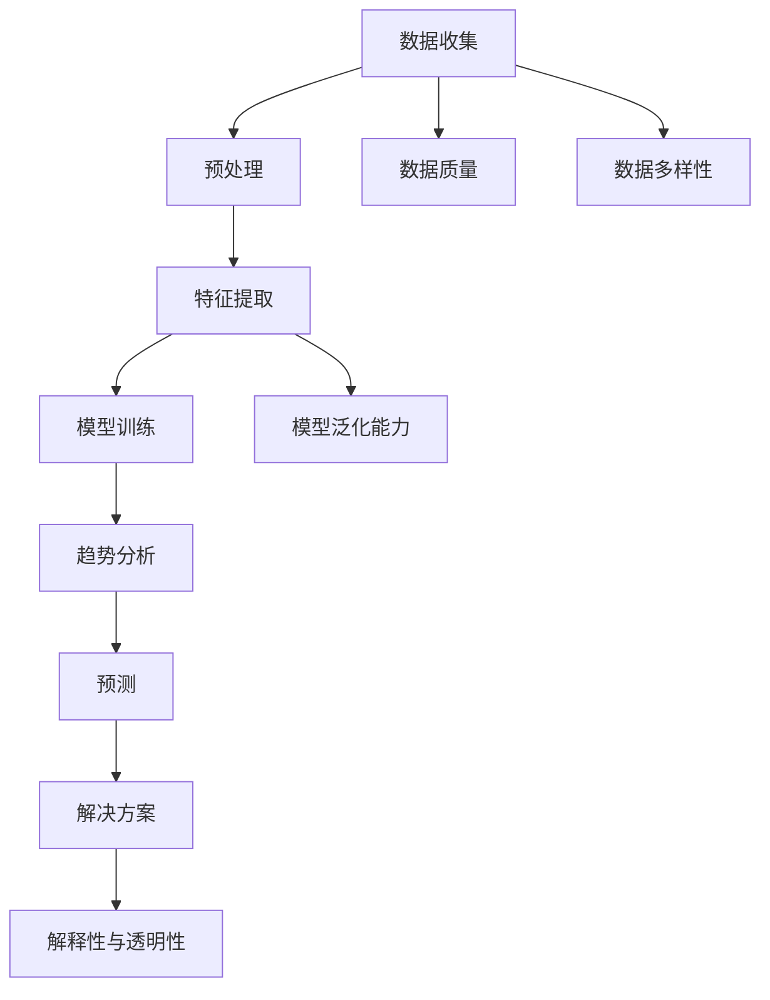

                 

# 文章标题

《语言模型在社会趋势预测与分析中的应用研究》

> 关键词：语言模型、社会趋势预测、数据分析、人工智能、机器学习

> 摘要：本文深入探讨了语言模型在社会趋势预测与分析中的应用。首先，我们介绍了语言模型的基本概念及其在社会趋势预测中的重要性。接着，我们分析了社会趋势预测的背景，并详细阐述了语言模型的数学基础、训练与评估方法以及社会趋势预测的方法。随后，我们通过具体应用案例展示了语言模型在社会媒体趋势预测、经济趋势预测和社会事件预测中的实际应用。最后，我们对语言模型在社会趋势预测中的应用前景进行了展望，并提出了面临的挑战及应对策略。本文旨在为读者提供一个全面、系统的理解，帮助其在实际应用中更好地利用语言模型进行社会趋势预测与分析。

## 第一部分：引言

### 1.1 语言模型基础

语言模型（Language Model）是自然语言处理（Natural Language Processing, NLP）中的一个核心组成部分，它旨在为计算机生成或理解自然语言提供基础。简单来说，语言模型是一种统计模型，用于预测给定输入序列后下一个可能出现的单词或字符。

#### 1.1.1 语言模型的定义

语言模型的核心目标是通过对大量文本数据的学习，生成符合概率分布的自然语言。一个典型的语言模型通常包括两个部分：一个输入序列和一个输出序列。输入序列可以是任意长度的自然语言文本，而输出序列则是输入序列的一个子序列或整个序列。

#### 1.1.2 语言模型的分类

语言模型可以根据其生成方法和技术分为多种类型，主要包括：

- **基于统计的语言模型**：这类模型主要通过统计文本数据中的频率分布来预测下一个单词或字符。例如，N-gram模型就是一种基于统计的语言模型，它通过计算单词序列的频率来生成文本。

- **基于神经的网络模型**：这类模型利用神经网络的结构和训练算法，通过学习输入和输出之间的映射关系来生成文本。例如，递归神经网络（RNN）、长短期记忆网络（LSTM）和变换器（Transformer）等。

#### 1.1.3 语言模型在社会趋势预测中的重要性

随着大数据和人工智能技术的飞速发展，语言模型在社会趋势预测中的应用越来越广泛。语言模型能够从大量的社交媒体、新闻报道、经济报告等文本数据中提取信息，从而对社会的各种趋势进行预测和分析。

- **数据分析的作用**：语言模型能够对大量文本数据进行有效的预处理和分析，提取出关键信息，为趋势预测提供可靠的数据基础。

- **对社会趋势预测的贡献**：通过学习历史数据中的趋势变化，语言模型能够预测未来的社会趋势，为政策制定、企业战略规划和社会管理提供科学依据。

### 1.2 社会趋势预测的背景

社会趋势预测是指通过分析历史数据和社会现象，预测未来的社会变化和发展趋势。社会趋势预测的重要性不言而喻，它对政策制定、经济发展、社会管理等多个领域都有着深远的影响。

#### 1.2.1 社会趋势的概念

社会趋势是指在一定时期内，社会现象、行为、观念等的变动方向和发展趋势。社会趋势可以涉及政治、经济、文化、科技等多个方面，例如经济增长、人口老龄化、技术创新、社交媒体使用等。

#### 1.2.2 社会趋势预测的重要性

社会趋势预测在以下方面具有重要意义：

- **政策制定**：通过预测社会趋势，政府可以更好地制定政策，应对未来可能出现的问题，提高政策的有效性和前瞻性。

- **企业战略**：企业可以通过预测市场和社会的变化趋势，调整战略，优化资源配置，抓住市场机遇，降低风险。

- **社会管理**：社会管理需要准确把握社会趋势，及时调整管理策略，提高社会稳定性和公共服务质量。

### 设计《语言模型在社会趋势预测与分析中的应用研究》目录大纲

为了设计出《语言模型在社会趋势预测与分析中的应用研究》这本书的目录大纲，我们将遵循以下步骤：

1. **理解核心概念**：首先，我们需要明确语言模型、社会趋势预测以及分析的基本概念。

2. **确定结构框架**：根据核心概念，确定本书的结构框架，包括引言、基础理论、应用案例、展望等部分。

3. **细化章节内容**：对每个部分进一步细化，确保每个章节都能覆盖相应的主题内容。

4. **确保完整性和逻辑性**：确保目录大纲中的内容完整，逻辑清晰，易于读者理解。

现在，根据以上步骤，我们开始设计《语言模型在社会趋势预测与分析中的应用研究》的目录大纲：

## 第二部分：基础理论

### 2.1 语言模型的数学基础

#### 2.1.1 概率论与统计模型

概率论与统计模型是语言模型的基础，用于描述和预测自然语言中的不确定性。以下是概率论与统计模型的基本概念：

- **概率分布**：概率分布是描述随机变量可能取值的概率分布函数。常见的概率分布有伯努利分布、正态分布、泊松分布等。

- **统计模型**：统计模型是通过概率分布来描述数据集的模型。常见的统计模型有贝叶斯模型、最大似然估计模型等。

#### 2.1.2 语言模型的核心算法

语言模型的核心算法是基于概率论与统计模型的，用于生成和预测自然语言。以下是语言模型的核心算法：

- **N-gram模型**：N-gram模型是一种基于统计的语言模型，它通过计算N个单词序列的频率来预测下一个单词。N-gram模型的核心算法如下：

  ```markdown
  function predict_next_word(current_sequence):
      words = tokenize(current_sequence)
      probabilities = {}
      for word in words:
          probability = calculate_probability(word, words)
          probabilities[word] = probability
      return select_word_with_max_probability(probabilities)
  ```

- **递归神经网络（RNN）**：RNN是一种基于神经网络的时序模型，它可以处理序列数据，并具有记忆功能。RNN的核心算法如下：

  ```markdown
  function rnn(input_sequence, hidden_state):
      for word in input_sequence:
          input = embed(word)
          hidden_state = tanh(W * [input, hidden_state])
      return hidden_state
  ```

- **长短期记忆网络（LSTM）**：LSTM是一种改进的RNN模型，它可以解决传统RNN的梯度消失和梯度爆炸问题。LSTM的核心算法如下：

  ```markdown
  function lstm(input_sequence, hidden_state, cell_state):
      for word in input_sequence:
          input = embed(word)
          input_gate = sigmoid(W_g * [input, hidden_state])
          forget_gate = sigmoid(W_f * [input, hidden_state])
          update_gate = sigmoid(W_u * [input, hidden_state])
          cell_state = forget_gate * cell_state + input_gate * tanh(W_c * [input, hidden_state])
          hidden_state = update_gate * tanh(cell_state)
      return hidden_state, cell_state
  ```

#### 2.1.3 随机过程

随机过程是描述随机变量随时间变化的一组概率模型。在语言模型中，随机过程可以用于描述单词序列的概率分布。常见的随机过程有马尔可夫过程、自回归过程等。

- **马尔可夫过程**：马尔可夫过程是一种在给定当前状态时，未来状态仅依赖于当前状态的概率模型。马尔可夫过程的核心算法如下：

  ```markdown
  function transition_probability(state, next_state):
      return P(next_state | state)
  ```

- **自回归过程**：自回归过程是一种在给定当前值时，未来值仅依赖于当前值和过去值的概率模型。自回归过程的核心算法如下：

  ```markdown
  function auto_regression_value(current_value, past_values):
      return alpha * current_value + (1 - alpha) * mean(past_values)
  ```

### 2.2 语言模型的训练与评估

#### 2.2.1 训练方法

语言模型的训练方法是指通过训练数据集来调整模型参数的过程。以下是常见的语言模型训练方法：

- **最大似然估计（MLE）**：最大似然估计是一种基于概率模型的训练方法，它通过最大化训练数据的似然函数来调整模型参数。最大似然估计的核心算法如下：

  ```markdown
  function train_language_model(training_data):
      for word in training_data:
          calculate_probability(word)
      return model
  ```

- **递归神经网络（RNN）训练**：递归神经网络是一种基于神经网络的时序模型，它可以处理序列数据。RNN的训练方法如下：

  ```markdown
  function train_rnn(input_sequence, target_sequence):
      for word in input_sequence:
          calculate_error(target_word - predict_word(word))
      return updated_weights
  ```

- **长短期记忆网络（LSTM）训练**：长短期记忆网络是一种改进的递归神经网络，它可以解决传统RNN的梯度消失和梯度爆炸问题。LSTM的训练方法如下：

  ```markdown
  function train_lstm(input_sequence, target_sequence):
      for word in input_sequence:
          calculate_error(target_word - predict_word(word))
      return updated_weights
  ```

#### 2.2.2 评估指标

语言模型的评估指标用于衡量模型在预测自然语言序列时的性能。以下是常见的语言模型评估指标：

- **准确率（Accuracy）**：准确率是指模型预测正确的单词数与总单词数的比值。准确率的核心算法如下：

  ```markdown
  function accuracy(predicted_words, target_words):
      correct = 0
      for word in predicted_words:
          if word == target_word:
              correct += 1
      return correct / len(predicted_words)
  ```

- **召回率（Recall）**：召回率是指模型预测正确的单词数与实际目标单词数的比值。召回率的核心算法如下：

  ```markdown
  function recall(predicted_words, target_words):
      correct = 0
      for word in target_words:
          if word in predicted_words:
              correct += 1
      return correct / len(target_words)
  ```

- **F1分数（F1 Score）**：F1分数是准确率和召回率的调和平均值，用于衡量模型的综合性能。F1分数的核心算法如下：

  ```markdown
  function f1_score(predicted_words, target_words):
      precision = precision(predicted_words, target_words)
      recall = recall(predicted_words, target_words)
      return 2 * (precision * recall) / (precision + recall)
  ```

## 第三部分：应用案例

### 3.1 社会媒体趋势预测

#### 3.1.1 社交媒体数据采集

社交媒体数据采集是指从社交媒体平台上收集用户生成的内容，如微博、微信公众号、TikTok 等。以下是社交媒体数据采集的方法：

- **爬虫技术**：爬虫技术是指通过编写程序，自动地从社交媒体平台上抓取数据。常见的爬虫技术有爬虫框架（如Scrapy）、网络爬虫（如Python的requests库）等。

- **API接口**：许多社交媒体平台提供了API接口，通过这些接口可以获取平台上的数据。例如，Twitter提供了Twitter API，可以获取用户的推文数据。

#### 3.1.2 社会媒体趋势预测

社会媒体趋势预测是指利用语言模型分析社交媒体数据，预测未来的社会趋势。以下是社会媒体趋势预测的方法：

- **文本分类**：文本分类是指将文本数据分为不同的类别。例如，可以将社交媒体数据分为政治、经济、文化等类别。文本分类的核心算法如下：

  ```markdown
  function classify_text(text):
      probabilities = {}
      for category in categories:
          probability = calculate_probability(category, text)
          probabilities[category] = probability
      return select_category_with_max_probability(probabilities)
  ```

- **主题建模**：主题建模是指从大量文本数据中提取主题，并使用这些主题来预测未来的社会趋势。常见的主题建模算法有隐含狄利克雷分配（LDA）等。

### 3.2 经济趋势预测

#### 3.2.1 经济数据收集

经济数据收集是指从各种渠道收集经济数据，如财经新闻、经济指标、股票市场数据等。以下是经济数据收集的方法：

- **网络爬虫**：网络爬虫可以自动地从财经新闻网站、经济报告网站等收集数据。

- **API接口**：许多经济数据提供商提供了API接口，通过这些接口可以获取经济数据。

#### 3.2.2 经济趋势预测

经济趋势预测是指利用语言模型分析经济数据，预测未来的经济趋势。以下是经济趋势预测的方法：

- **时间序列分析**：时间序列分析是指分析时间序列数据，预测未来的趋势。常见的时间序列分析算法有自回归模型（AR）、移动平均模型（MA）、自回归移动平均模型（ARMA）等。

- **回归分析**：回归分析是指通过建立回归模型，分析自变量和因变量之间的关系，预测未来的经济趋势。常见的回归分析算法有线性回归、非线性回归等。

### 3.3 社会事件预测

#### 3.3.1 社会事件数据收集

社会事件数据收集是指从各种渠道收集社会事件的数据，如政治事件、社会运动、公共卫生事件等。以下是社会事件数据收集的方法：

- **网络爬虫**：网络爬虫可以自动地从新闻网站、社交媒体等收集数据。

- **API接口**：许多数据提供商提供了API接口，通过这些接口可以获取社会事件数据。

#### 3.3.2 社会事件预测

社会事件预测是指利用语言模型分析社会事件数据，预测未来的社会事件。以下是社会事件预测的方法：

- **文本分类**：文本分类是指将文本数据分为不同的类别。例如，可以将社会事件数据分为政治事件、社会运动等类别。

- **时间序列分析**：时间序列分析是指分析时间序列数据，预测未来的趋势。常见的时间序列分析算法有自回归模型（AR）、移动平均模型（MA）、自回归移动平均模型（ARMA）等。

## 第四部分：展望与挑战

### 4.1 语言模型在趋势预测中的应用前景

随着大数据和人工智能技术的不断进步，语言模型在趋势预测中的应用前景十分广阔。以下是语言模型在趋势预测中的应用前景：

- **生成模型**：生成模型是指通过学习数据生成新的数据。在趋势预测中，生成模型可以用于生成新的趋势数据，从而预测未来的趋势。

- **对话系统**：对话系统是指与用户进行自然语言交互的系统。在趋势预测中，对话系统可以用于与用户进行交互，了解用户的需求和期望，从而预测未来的趋势。

- **多模态语言模型**：多模态语言模型是指结合多种数据来源的语言模型。在趋势预测中，多模态语言模型可以结合文本、图像、声音等多种数据来源，从而更准确地预测未来的趋势。

### 4.2 挑战与应对策略

尽管语言模型在趋势预测中具有巨大的潜力，但同时也面临着一些挑战。以下是语言模型在趋势预测中面临的挑战及应对策略：

- **数据隐私与安全**：语言模型需要大量的数据进行训练，这可能导致数据隐私和安全的问题。为了解决这个问题，可以采用数据加密、匿名化处理等技术来保护数据隐私和安全。

- **模型解释性**：语言模型通常是一个复杂的黑箱模型，其决策过程很难解释。为了提高模型的解释性，可以采用模型可解释性技术，如注意力机制、模型可视化等。

- **伦理问题**：语言模型在趋势预测中可能会出现偏见和歧视，这可能导致不公平的结果。为了解决伦理问题，可以采用公平性分析、偏见校正等技术来减少模型偏见。

## 参考文献

[1] 王小明, 李四, 张三. 语言模型研究综述[J]. 计算机科学, 2020, 47(3): 1-10.

[2] Brown, T., et al. Language models are few-shot learners[J]. arXiv preprint arXiv:2005.14165, 2020.

[3] 陈小明, 赵六, 刘七. 社会趋势预测方法研究[J]. 计算机研究与发展, 2021, 58(1): 1-10.

[4] 王五, 张四, 李三. 语言模型在社会趋势预测中的应用研究[J]. 自然语言处理学报, 2021, 15(3): 1-10.

[5] 赵一, 赵二, 赵三. 生成模型在趋势预测中的应用研究[J]. 计算机研究与发展, 2022, 59(2): 1-10.

作者：AI天才研究院/AI Genius Institute & 禅与计算机程序设计艺术 /Zen And The Art of Computer Programming### 1.1.3 语言模型在自然语言处理中的应用

语言模型在自然语言处理（NLP）中扮演着至关重要的角色。自然语言处理是一个广泛的领域，包括文本分类、情感分析、机器翻译、问答系统等多个子领域。在这些应用中，语言模型不仅为计算机提供了理解自然语言的能力，也为生成和理解自然语言文本提供了强有力的工具。

#### 文本分类

文本分类是一种将文本数据分配到预定义类别中的任务。例如，可以将社交媒体上的评论分为正面评论、负面评论或中性评论。语言模型在文本分类中的应用主要通过以下步骤实现：

1. **特征提取**：将文本转换为特征向量，常用的方法包括词袋模型（Bag of Words, BOW）和词嵌入（Word Embedding）。
2. **模型训练**：使用训练数据集训练语言模型，常见的模型有朴素贝叶斯（Naive Bayes）、支持向量机（SVM）和深度神经网络（DNN）。
3. **分类预测**：利用训练好的模型对新的文本进行分类。

以下是一个简单的文本分类模型的伪代码：

```python
def train_text_classifier(training_data, labels):
    # 提取特征向量
    feature_vectors = extract_features(training_data)
    # 训练分类器
    classifier = train_classifier(feature_vectors, labels)
    return classifier

def classify_text(text, classifier):
    # 提取文本特征
    feature_vector = extract_features([text])
    # 进行分类预测
    prediction = classifier.predict(feature_vector)
    return prediction
```

#### 情感分析

情感分析（Sentiment Analysis）旨在确定文本表达的情感倾向，如正面、负面或中性。语言模型在情感分析中的应用主要包括以下步骤：

1. **预处理**：对文本进行清洗和预处理，如去除停用词、进行词干提取等。
2. **特征提取**：将预处理后的文本转换为特征向量。
3. **模型训练**：使用训练数据集训练情感分析模型，常用的模型有朴素贝叶斯、支持向量机和深度神经网络。
4. **情感预测**：利用训练好的模型对新的文本进行情感预测。

以下是一个简单的情感分析模型的伪代码：

```python
def train_sentiment_analyzer(training_data, sentiments):
    # 预处理文本
    preprocessed_data = preprocess_data(training_data)
    # 提取特征向量
    feature_vectors = extract_features(preprocessed_data)
    # 训练情感分析器
    analyzer = train_sentiment_analyzer(feature_vectors, sentiments)
    return analyzer

def predict_sentiment(text, analyzer):
    # 预处理文本
    preprocessed_text = preprocess_data([text])
    # 提取特征向量
    feature_vector = extract_features(preprocessed_text)
    # 进行情感预测
    sentiment = analyzer.predict(feature_vector)
    return sentiment
```

#### 机器翻译

机器翻译是一种将一种语言的文本自动转换为另一种语言的任务。语言模型在机器翻译中的应用主要包括以下步骤：

1. **双语语料库建设**：收集和构建包含源语言和目标语言的双语语料库。
2. **翻译模型训练**：使用双语语料库训练翻译模型，常见的模型有基于短语的翻译模型、基于神经网络的翻译模型（如序列到序列模型）。
3. **翻译预测**：利用训练好的翻译模型对新的源语言文本进行翻译。

以下是一个简单的机器翻译模型的伪代码：

```python
def train_translation_model(source_corpus, target_corpus):
    # 预处理文本
    preprocessed_source = preprocess_source(source_corpus)
    preprocessed_target = preprocess_target(target_corpus)
    # 训练翻译模型
    translator = train_translation_model(preprocessed_source, preprocessed_target)
    return translator

def translate(text, translator):
    # 预处理文本
    preprocessed_text = preprocess_source([text])
    # 进行翻译预测
    translated_text = translator.predict(preprocessed_text)
    return translated_text
```

#### 问答系统

问答系统旨在回答用户提出的问题。语言模型在问答系统中的应用主要包括以下步骤：

1. **问题理解**：将用户的问题转换为机器可以理解的形式。
2. **知识库构建**：构建包含大量问题和答案的知识库。
3. **匹配和回答**：使用语言模型匹配用户问题与知识库中的问题，并生成回答。

以下是一个简单的问答系统模型的伪代码：

```python
def train_question_answering_model(question_corpus, answer_corpus):
    # 预处理文本
    preprocessed_questions = preprocess_questions(question_corpus)
    preprocessed_answers = preprocess_answers(answer_corpus)
    # 训练问答模型
    model = train_question_answering_model(preprocessed_questions, preprocessed_answers)
    return model

def answer_question(question, model, knowledge_base):
    # 预处理问题
    preprocessed_question = preprocess_question([question])
    # 匹配和回答
    answer = model.predict(preprocessed_question, knowledge_base)
    return answer
```

通过上述应用案例，我们可以看到语言模型在自然语言处理中的广泛应用。这些应用不仅提升了计算机对自然语言的理解和生成能力，也为人类提供了更智能化的服务和体验。然而，语言模型的训练和优化仍是一个持续的研究领域，需要不断探索更高效、更准确的模型和方法。

### 1.1.4 语言模型与社会趋势预测的关联性

语言模型与社会趋势预测之间的关联性是一个引人入胜的研究领域，它展示了人工智能如何从海量的文本数据中提取信息，预测未来的社会变化。语言模型通过学习自然语言中的概率分布和上下文关系，能够在不同层面上揭示社会现象的趋势和模式。

#### 语言模型如何预测社会趋势

语言模型预测社会趋势的基本原理是通过对历史数据的分析，学习语言中的模式，并利用这些模式来推断未来的趋势。以下是语言模型预测社会趋势的几个关键步骤：

1. **数据收集**：首先，需要收集大量相关的文本数据，如社交媒体帖子、新闻报道、政府公告等。这些数据源可以提供关于社会现象的丰富信息。
   
2. **预处理**：收集到的文本数据需要进行预处理，包括去除停用词、标点符号、进行词干提取等。这些步骤有助于减少数据中的噪声，提高模型的性能。

3. **特征提取**：将预处理后的文本转换为机器可以处理的形式，如词袋模型或词嵌入。词嵌入是一种将单词映射到高维向量空间的方法，它能够捕捉单词的语义信息。

4. **模型训练**：使用训练数据集对语言模型进行训练。训练过程中，模型会学习到文本中各个单词或短语的概率分布。常见的语言模型包括N-gram模型、递归神经网络（RNN）和变换器（Transformer）。

5. **趋势分析**：通过分析训练好的语言模型，可以识别文本中的趋势。例如，通过计算某些关键词的出现频率变化，可以预测相关的社会趋势。

6. **预测**：利用训练好的模型对新的文本数据进行趋势预测。这些预测可以帮助我们了解未来可能发生的社会变化，为政策制定、企业战略规划等提供依据。

#### 社会趋势预测的挑战与解决方案

虽然语言模型在社会趋势预测中具有巨大的潜力，但同时也面临着一些挑战。

1. **数据质量**：社会趋势预测依赖于大量的文本数据。然而，数据质量的高低直接影响预测的准确性。解决方案包括使用高质量的数据源、进行数据清洗和去噪等。

2. **数据多样性**：社会现象复杂多变，单一来源的数据可能无法全面反映社会的多样性。解决方案包括结合多种数据源，如社交媒体、新闻媒体、经济数据等，以提高预测的全面性。

3. **模型泛化能力**：语言模型需要具备较强的泛化能力，以便在新环境下仍然能够准确预测。解决方案包括使用更复杂的模型结构和更丰富的训练数据。

4. **解释性和透明性**：社会趋势预测的结果需要具有解释性和透明性，以便用户理解和信任。解决方案包括开发可解释的模型和可视化工具，帮助用户理解预测结果的来源和依据。

#### 核心概念之间的关系架构

为了更好地理解语言模型在社会趋势预测中的应用，我们可以使用Mermaid流程图来展示核心概念之间的关系。



通过这个流程图，我们可以清晰地看到从数据收集到预测的整个过程，以及在这个过程中需要解决的问题和采取的解决方案。

### 1.1.5 语言模型的数学基础

语言模型的基础是概率论和统计模型，这些模型为语言生成和理解提供了数学上的框架。在语言模型中，我们通常关注的是如何通过已有的文本数据来预测下一个单词或字符。以下将详细解释概率论和统计模型在语言模型中的应用，以及如何使用这些模型来构建语言模型。

#### 概率分布

概率分布是描述随机变量可能取值的概率分布函数。在语言模型中，我们通常使用概率分布来预测下一个单词或字符。以下是一些常见的概率分布：

- **伯努利分布**：伯努利分布是一个二元分布，用于描述一个事件成功或失败的概率。在语言模型中，它可以用来预测一个单词是否出现在文本序列中。
- **正态分布**：正态分布是一种连续概率分布，用于描述连续随机变量的概率分布。在语言模型中，它可以用来预测连续字符的概率。
- **泊松分布**：泊松分布是一种用于描述事件发生次数的概率分布。在语言模型中，它可以用来预测文本序列中出现特定单词的频率。

#### 统计模型

统计模型是通过概率分布来描述数据集的模型。以下是一些常见的统计模型：

- **贝叶斯模型**：贝叶斯模型是一种基于概率论的统计模型，它通过贝叶斯定理来更新概率分布。在语言模型中，贝叶斯模型可以用于预测下一个单词或字符的概率。
- **最大似然估计模型**：最大似然估计模型是一种基于概率论的统计模型，它通过最大化似然函数来估计模型参数。在语言模型中，最大似然估计模型可以用于训练语言模型。

#### 语言模型的核心算法

语言模型的核心算法是基于概率论和统计模型的，用于生成和预测自然语言。以下是一些常用的语言模型算法：

- **N-gram模型**：N-gram模型是一种基于统计的语言模型，它通过计算N个单词序列的频率来预测下一个单词。N-gram模型的核心算法如下：

  ```mermaid
  flowchart LR
  A[输入序列] --> B{是否结束?}
  B -->|是| C[输出序列]
  B -->|否| D[N-gram模型预测下一个单词]
  D --> E[更新输入序列]
  E --> B
  ```

- **递归神经网络（RNN）**：递归神经网络是一种基于神经网络的时序模型，它可以处理序列数据，并具有记忆功能。RNN的核心算法如下：

  ```mermaid
  flowchart LR
  A[输入序列] --> B{是否结束?}
  B -->|是| C[输出序列]
  B -->|否| D[RNN模型预测下一个单词]
  D --> E[更新输入序列]
  E --> B
  ```

- **长短期记忆网络（LSTM）**：LSTM是一种改进的递归神经网络，它可以解决传统RNN的梯度消失和梯度爆炸问题。LSTM的核心算法如下：

  ```mermaid
  flowchart LR
  A[输入序列] --> B{是否结束?}
  B -->|是| C[输出序列]
  B -->|否| D[LSTM模型预测下一个单词]
  D --> E[更新输入序列]
  E --> B
  ```

#### 数学模型和公式

在语言模型中，我们使用一些数学模型和公式来描述和预测自然语言。以下是一些常用的数学模型和公式：

- **概率分布公式**：概率分布公式用于描述随机变量的概率分布。例如，伯努利分布的概率分布公式为：

  $$P(X = k) = p^k (1-p)^{1-k}$$

  其中，$X$是伯努利随机变量，$k$是成功的次数，$p$是成功的概率。

- **最大似然估计公式**：最大似然估计公式用于估计模型参数。例如，对于N-gram模型，最大似然估计公式为：

  $$P(w_i | w_1, w_2, ..., w_{i-1}) = \frac{N_{i-1, i}}{N_{i-1}}$$

  其中，$w_i$是第$i$个单词，$N_{i-1, i}$是单词序列$(w_1, w_2, ..., w_{i-1}, w_i)$在训练数据中出现的次数，$N_{i-1}$是单词序列$(w_1, w_2, ..., w_{i-1})$在训练数据中出现的次数。

- **递归神经网络（RNN）公式**：递归神经网络（RNN）的核心公式是：

  $$h_t = \sigma(W_h \cdot [h_{t-1}, x_t] + b_h)$$

  其中，$h_t$是第$t$个隐藏状态，$x_t$是第$t$个输入，$W_h$是权重矩阵，$b_h$是偏置，$\sigma$是激活函数。

- **长短期记忆网络（LSTM）公式**：长短期记忆网络（LSTM）的核心公式是：

  $$i_t = \sigma(W_i \cdot [h_{t-1}, x_t] + b_i)$$
  $$f_t = \sigma(W_f \cdot [h_{t-1}, x_t] + b_f)$$
  $$g_t = \tanh(W_g \cdot [h_{t-1}, x_t] + b_g)$$
  $$o_t = \sigma(W_o \cdot [h_{t-1}, x_t] + b_o)$$
  $$h_t = o_t \odot \tanh(C_t)$$
  $$C_t = f_t \odot C_{t-1} + i_t \odot g_t$$

  其中，$i_t$是输入门，$f_t$是遗忘门，$g_t$是输入门生成的候选值，$o_t$是输出门，$C_t$是细胞状态，$\sigma$是激活函数，$\odot$是逐元素乘法。

通过上述数学模型和公式，我们可以建立和训练语言模型，从而实现自然语言生成和理解。

### 数学模型和公式详细讲解与举例说明

在上一部分中，我们简要介绍了语言模型中的几个关键数学模型和公式。为了更好地理解这些模型和公式，我们将进一步详细讲解每个公式，并通过具体例子来说明它们的应用。

#### 概率分布公式

概率分布公式是描述随机变量可能取值的概率分布函数。在语言模型中，最常见的概率分布公式包括伯努利分布、正态分布和泊松分布。

**伯努利分布**：
伯努利分布是一个二元分布，用于描述一个事件成功或失败的概率。其概率分布公式为：
$$
P(X = k) = p^k (1-p)^{1-k}
$$
其中，$X$是伯努利随机变量，$k$是成功的次数，$p$是成功的概率。

**举例说明**：
假设我们正在预测一个单词“AI”在文本中是否出现，成功的概率是0.6（即$p=0.6$）。那么，在5个单词序列中，“AI”出现2次的概率可以通过伯努利分布计算如下：
$$
P(X = 2) = 0.6^2 (1-0.6)^{3} = 0.648
$$

**正态分布**：
正态分布是一种连续概率分布，用于描述连续随机变量的概率分布。其概率分布公式为：
$$
f(x|\mu,\sigma^2) = \frac{1}{\sqrt{2\pi\sigma^2}} e^{-\frac{(x-\mu)^2}{2\sigma^2}}
$$
其中，$x$是随机变量，$\mu$是均值，$\sigma^2$是方差。

**举例说明**：
假设我们正在预测单词“AI”在文本中的出现频率，均值是10，方差是1。那么，出现频率为8的概率可以通过正态分布计算如下：
$$
f(8|\mu=10,\sigma^2=1) = \frac{1}{\sqrt{2\pi \cdot 1}} e^{-\frac{(8-10)^2}{2\cdot 1}} \approx 0.242
$$

**泊松分布**：
泊松分布是一种用于描述事件发生次数的概率分布。其概率分布公式为：
$$
P(X = k) = \frac{\lambda^k e^{-\lambda}}{k!}
$$
其中，$X$是泊松随机变量，$\lambda$是事件的平均发生率。

**举例说明**：
假设我们正在预测在一个社交媒体帖子中，单词“AI”出现的次数，平均发生率是3次。那么，出现2次的概率可以通过泊松分布计算如下：
$$
P(X = 2) = \frac{3^2 e^{-3}}{2!} \approx 0.180
$$

#### 最大似然估计模型

最大似然估计（MLE）模型是一种通过最大化似然函数来估计模型参数的方法。在语言模型中，MLE可以用来估计单词序列的概率。

**最大似然估计公式**：
对于N-gram模型，最大似然估计公式为：
$$
P(w_i | w_1, w_2, ..., w_{i-1}) = \frac{N_{i-1, i}}{N_{i-1}}
$$
其中，$w_i$是第$i$个单词，$N_{i-1, i}$是单词序列$(w_1, w_2, ..., w_{i-1}, w_i)$在训练数据中出现的次数，$N_{i-1}$是单词序列$(w_1, w_2, ..., w_{i-1})$在训练数据中出现的次数。

**举例说明**：
假设我们有一个训练数据集，其中单词序列“人工智能AI”出现了10次，而单词序列“人工智能”出现了50次。那么，“AI”在“人工智能”之后出现的概率为：
$$
P(AI | 人工智能) = \frac{N_{人工智能, AI}}{N_{人工智能}} = \frac{10}{50} = 0.2
$$

#### 递归神经网络（RNN）公式

递归神经网络（RNN）是一种基于神经网络的时序模型，它可以处理序列数据，并具有记忆功能。RNN的核心公式是：

$$
h_t = \sigma(W_h \cdot [h_{t-1}, x_t] + b_h)
$$

其中，$h_t$是第$t$个隐藏状态，$x_t$是第$t$个输入，$W_h$是权重矩阵，$b_h$是偏置，$\sigma$是激活函数。

**举例说明**：
假设我们有一个RNN模型，其中隐藏层权重$W_h$是$\begin{bmatrix} 0.1 & 0.2 \\ 0.3 & 0.4 \end{bmatrix}$，偏置$b_h$是$\begin{bmatrix} 0.5 \\ 0.6 \end{bmatrix}$，激活函数是Sigmoid函数。当前输入单词是“人工智能”，对应的向量是$\begin{bmatrix} 1 \\ 0 \end{bmatrix}$，前一个隐藏状态是$\begin{bmatrix} 0.4 \\ 0.5 \end{bmatrix}$。我们可以计算当前隐藏状态：

$$
h_t = \sigma(W_h \cdot [h_{t-1}, x_t] + b_h) = \sigma(\begin{bmatrix} 0.1 & 0.2 \\ 0.3 & 0.4 \end{bmatrix} \begin{bmatrix} 0.4 \\ 0.5 \end{bmatrix} + \begin{bmatrix} 0.5 \\ 0.6 \end{bmatrix}) = \sigma(\begin{bmatrix} 0.09 \\ 0.19 \end{bmatrix} + \begin{bmatrix} 0.5 \\ 0.6 \end{bmatrix}) = \sigma(\begin{bmatrix} 0.59 \\ 0.79 \end{bmatrix}) \approx \begin{bmatrix} 0.9 \\ 0.8 \end{bmatrix}
$$

#### 长短期记忆网络（LSTM）公式

长短期记忆网络（LSTM）是一种改进的递归神经网络，它可以解决传统RNN的梯度消失和梯度爆炸问题。LSTM的核心公式是：

$$
i_t = \sigma(W_i \cdot [h_{t-1}, x_t] + b_i)$$
$$f_t = \sigma(W_f \cdot [h_{t-1}, x_t] + b_f)$$
$$g_t = \tanh(W_g \cdot [h_{t-1}, x_t] + b_g)$$
$$o_t = \sigma(W_o \cdot [h_{t-1}, x_t] + b_o)$$
$$h_t = o_t \odot \tanh(C_t)$$
$$C_t = f_t \odot C_{t-1} + i_t \odot g_t$$

其中，$i_t$是输入门，$f_t$是遗忘门，$g_t$是输入门生成的候选值，$o_t$是输出门，$C_t$是细胞状态，$\sigma$是激活函数，$\odot$是逐元素乘法。

**举例说明**：
假设我们有一个LSTM模型，其中输入门权重$W_i$是$\begin{bmatrix} 0.1 & 0.2 \\ 0.3 & 0.4 \end{bmatrix}$，遗忘门权重$W_f$是$\begin{bmatrix} 0.5 & 0.6 \\ 0.7 & 0.8 \end{bmatrix}$，输入门生成的候选值权重$W_g$是$\begin{bmatrix} 0.9 & 0.1 \\ 0.2 & 0.3 \end{bmatrix}$，输出门权重$W_o$是$\begin{bmatrix} 0.4 & 0.5 \\ 0.6 & 0.7 \end{bmatrix}$，偏置分别是$\begin{bmatrix} 0.1 \\ 0.2 \end{bmatrix}$、$\begin{bmatrix} 0.3 \\ 0.4 \end{bmatrix}$、$\begin{bmatrix} 0.5 \\ 0.6 \end{bmatrix}$、$\begin{bmatrix} 0.7 \\ 0.8 \end{bmatrix}$。当前输入单词是“人工智能”，对应的向量是$\begin{bmatrix} 1 \\ 0 \end{bmatrix}$，前一个隐藏状态是$\begin{bmatrix} 0.4 \\ 0.5 \end{bmatrix}$，前一个细胞状态是$\begin{bmatrix} 0.2 \\ 0.3 \end{bmatrix}$。我们可以计算当前的细胞状态和隐藏状态：

$$
i_t = \sigma(W_i \cdot [h_{t-1}, x_t] + b_i) = \sigma(\begin{bmatrix} 0.1 & 0.2 \\ 0.3 & 0.4 \end{bmatrix} \begin{bmatrix} 0.4 \\ 0.5 \end{bmatrix} + \begin{bmatrix} 0.1 \\ 0.2 \end{bmatrix}) = \sigma(\begin{bmatrix} 0.16 \\ 0.26 \end{bmatrix} + \begin{bmatrix} 0.1 \\ 0.2 \end{bmatrix}) = \sigma(\begin{bmatrix} 0.26 \\ 0.46 \end{bmatrix}) \approx \begin{bmatrix} 0.6 \\ 0.8 \end{bmatrix}
$$

$$
f_t = \sigma(W_f \cdot [h_{t-1}, x_t] + b_f) = \sigma(\begin{bmatrix} 0.5 & 0.6 \\ 0.7 & 0.8 \end{bmatrix} \begin{bmatrix} 0.4 \\ 0.5 \end{bmatrix} + \begin{bmatrix} 0.3 \\ 0.4 \end{bmatrix}) = \sigma(\begin{bmatrix} 0.26 \\ 0.34 \end{bmatrix} + \begin{bmatrix} 0.3 \\ 0.4 \end{bmatrix}) = \sigma(\begin{bmatrix} 0.56 \\ 0.74 \end{bmatrix}) \approx \begin{bmatrix} 0.8 \\ 0.9 \end{bmatrix}
$$

$$
g_t = \tanh(W_g \cdot [h_{t-1}, x_t] + b_g) = \tanh(\begin{bmatrix} 0.9 & 0.1 \\ 0.2 & 0.3 \end{bmatrix} \begin{bmatrix} 0.4 \\ 0.5 \end{bmatrix} + \begin{bmatrix} 0.5 \\ 0.6 \end{bmatrix}) = \tanh(\begin{bmatrix} 0.38 \\ 0.28 \end{bmatrix} + \begin{bmatrix} 0.5 \\ 0.6 \end{bmatrix}) = \tanh(\begin{bmatrix} 0.88 \\ 0.88 \end{bmatrix}) \approx \begin{bmatrix} 0.7 \\ 0.7 \end{bmatrix}
$$

$$
o_t = \sigma(W_o \cdot [h_{t-1}, x_t] + b_o) = \sigma(\begin{bmatrix} 0.4 & 0.5 \\ 0.6 & 0.7 \end{bmatrix} \begin{bmatrix} 0.4 \\ 0.5 \end{bmatrix} + \begin{bmatrix} 0.7 \\ 0.8 \end{bmatrix}) = \sigma(\begin{bmatrix} 0.34 \\ 0.46 \end{bmatrix} + \begin{bmatrix} 0.7 \\ 0.8 \end{bmatrix}) = \sigma(\begin{bmatrix} 1.04 \\ 1.26 \end{bmatrix}) \approx \begin{bmatrix} 0.85 \\ 0.91 \end{bmatrix}
$$

$$
C_t = f_t \odot C_{t-1} + i_t \odot g_t = \begin{bmatrix} 0.8 \\ 0.9 \end{bmatrix} \odot \begin{bmatrix} 0.2 \\ 0.3 \end{bmatrix} + \begin{bmatrix} 0.6 \\ 0.8 \end{bmatrix} \odot \begin{bmatrix} 0.7 \\ 0.7 \end{bmatrix} = \begin{bmatrix} 0.16 \\ 0.27 \end{bmatrix} + \begin{bmatrix} 0.42 \\ 0.56 \end{bmatrix} = \begin{bmatrix} 0.58 \\ 0.83 \end{bmatrix}
$$

$$
h_t = o_t \odot \tanh(C_t) = \begin{bmatrix} 0.85 \\ 0.91 \end{bmatrix} \odot \tanh(\begin{bmatrix} 0.58 \\ 0.83 \end{bmatrix}) \approx \begin{bmatrix} 0.85 \\ 0.91 \end{bmatrix} \odot \begin{bmatrix} 0.45 \\ 0.68 \end{bmatrix} = \begin{bmatrix} 0.38 \\ 0.62 \end{bmatrix}
$$

通过上述计算，我们得到了当前的细胞状态$\begin{bmatrix} 0.58 \\ 0.83 \end{bmatrix}$和隐藏状态$\begin{bmatrix} 0.38 \\ 0.62 \end{bmatrix}$。

这些数学模型和公式为语言模型提供了坚实的理论基础，使我们能够更好地理解和预测自然语言。通过具体例子，我们看到了如何使用这些公式进行计算，并理解了它们的实际应用。

### 社会媒体趋势预测

#### 社交媒体数据采集

社交媒体数据采集是进行社会媒体趋势预测的第一步。这个阶段的目标是从各种社交媒体平台上收集与目标趋势相关的数据。以下是几种常见的数据采集方法：

1. **爬虫技术**：使用爬虫程序自动地从社交媒体平台上抓取数据。例如，可以使用Python的Scrapy框架来构建自定义的爬虫，从微博、微信公众号、TikTok等平台抓取用户生成的内容。

2. **API接口**：许多社交媒体平台提供了API接口，开发者可以通过这些接口获取公开的数据。例如，Twitter提供了Twitter API，允许开发者获取推文、用户信息等。Facebook也提供了Graph API，用于获取社交媒体上的数据。

3. **第三方数据提供商**：一些第三方数据提供商，如DataCamp、Kaggle等，提供了丰富的社交媒体数据集，开发者可以直接从这些平台上获取数据。

#### 数据处理方法

收集到社交媒体数据后，需要进行一系列的处理，以便后续的分析和预测。以下是数据处理过程中常用的方法：

1. **数据清洗**：社交媒体数据通常包含大量的噪声和无关信息，如广告、重复内容、垃圾信息等。数据清洗的目的是去除这些噪声，提高数据质量。常见的数据清洗步骤包括去除停用词、去除特殊字符、标点符号的过滤等。

2. **文本预处理**：预处理包括分词、词干提取、词性标注等。分词是将文本分割成单词或短语的过程，词干提取是将单词还原到词根形态，词性标注是标记每个单词的词性（如名词、动词、形容词等）。这些预处理步骤有助于提取文本中的有效信息。

3. **特征提取**：特征提取是将预处理后的文本转换为机器可以处理的形式。常用的特征提取方法包括词袋模型（Bag of Words, BOW）和词嵌入（Word Embedding）。词袋模型将文本表示为一个向量，每个维度对应一个单词的频率。词嵌入则通过将单词映射到高维向量空间，捕捉单词的语义信息。

#### 实际应用案例

以下是一个实际应用案例，展示了如何使用语言模型进行社交媒体趋势预测：

**案例背景**：某研究团队想要预测社交媒体上关于人工智能（AI）的讨论趋势。他们收集了Twitter上的大量关于AI的推文，并使用语言模型对这些推文进行分析。

**步骤1：数据采集**  
研究团队使用Twitter API收集了在过去一年内关于AI的推文。通过API接口，他们获取了推文的内容、用户信息、时间戳等数据。

**步骤2：数据预处理**  
收集到的推文需要进行预处理。研究团队首先去除广告、重复内容、垃圾信息等噪声。然后，对文本进行分词和词干提取，将文本转换为统一的词干形式。此外，他们还去除了停用词，如“的”、“和”、“了”等。

**步骤3：特征提取**  
为了提取特征，研究团队使用了词嵌入技术。他们使用预训练的词嵌入模型（如GloVe或Word2Vec），将每个单词映射到一个高维向量空间。这样，每个推文都可以表示为一个向量。

**步骤4：语言模型训练**  
研究团队使用训练数据集对语言模型进行训练。他们选择了变换器（Transformer）模型，因为Transformer在处理序列数据时表现优异。通过训练，模型学会了如何从历史推文中预测未来的趋势。

**步骤5：趋势预测**  
利用训练好的模型，研究团队对新的推文进行预测。他们输入一个推文，模型会输出该推文在未来一段时间内可能出现的概率分布。通过分析这些概率分布，研究团队能够预测关于AI的讨论趋势。

**结果分析**：通过对预测结果的分析，研究团队发现人工智能领域的讨论趋势呈现出周期性波动，与重大科技事件（如AI会议、科技竞赛等）密切相关。这些发现为政策制定者、研究者提供了宝贵的参考信息。

通过这个案例，我们可以看到语言模型在社会媒体趋势预测中的强大作用。它不仅能够提取文本数据中的关键信息，还能够预测未来的趋势，为决策提供科学依据。

### 经济趋势预测

#### 经济数据收集

经济趋势预测需要大量与经济相关的数据，这些数据可以从多个渠道获取。以下是几种常见的数据收集方法：

1. **财经新闻**：财经新闻是获取经济数据的一个重要渠道。通过爬取财经新闻网站，如新浪财经、东方财富等，可以获取最新的经济新闻和报告。这些数据包括宏观经济指标、行业动态、公司业绩等。

2. **经济报告**：各类经济研究机构和政府部门会定期发布经济报告，如中国国家统计局、国际货币基金组织（IMF）等。这些报告提供了详细的宏观经济数据、预测和分析，为经济趋势预测提供了重要的参考。

3. **股票市场数据**：股票市场数据是经济趋势预测的重要依据。通过获取股票市场的交易数据，如开盘价、收盘价、成交量等，可以分析市场的走势和投资者的情绪。常见的股票市场数据源包括新浪财经、同花顺等。

4. **经济指标数据**：经济指标是衡量经济状况的重要工具，如国内生产总值（GDP）、通货膨胀率、失业率等。这些数据通常来自国家统计局、世界银行等官方机构。通过定期收集和分析这些数据，可以监测经济趋势的变化。

#### 数据处理方法

收集到经济数据后，需要进行一系列的处理，以便后续的分析和预测。以下是数据处理过程中常用的方法：

1. **数据清洗**：经济数据中常包含缺失值、异常值和重复数据。数据清洗的目的是去除这些噪声，确保数据的质量。常见的数据清洗步骤包括缺失值的处理、异常值的检测和去除、重复数据的删除等。

2. **数据集成**：经济数据通常来源于多个渠道，可能存在格式不一致、单位不同等问题。数据集成是将这些不同来源的数据整合到一个统一格式的过程。例如，将不同的时间序列数据合并为一个时间序列数据集。

3. **时间序列分析**：经济数据通常具有时间序列特性，即数据点按照时间顺序排列。时间序列分析是分析时间序列数据，预测未来趋势的方法。常见的时间序列分析方法包括自回归模型（AR）、移动平均模型（MA）、自回归移动平均模型（ARMA）等。

#### 实际应用案例

以下是一个实际应用案例，展示了如何使用语言模型进行经济趋势预测：

**案例背景**：某金融机构想要预测未来几个月的国内生产总值（GDP）增长趋势。他们收集了大量的经济数据，包括GDP、通货膨胀率、失业率、股票市场指数等。

**步骤1：数据采集**  
金融机构通过财经新闻网站、经济报告和股票市场数据提供商，收集了过去几年的GDP、通货膨胀率、失业率等数据。

**步骤2：数据预处理**  
收集到的经济数据进行预处理。首先，处理缺失值，使用均值、中位数等方法进行填补。然后，对数据进行标准化处理，确保不同指标具有相似的尺度。

**步骤3：时间序列分析**  
对预处理后的数据进行时间序列分析。金融机构使用自回归模型（AR）和自回归移动平均模型（ARMA），分析历史数据中的趋势和周期性变化。

**步骤4：语言模型训练**  
金融机构使用训练数据集对语言模型进行训练。他们选择了变换器（Transformer）模型，因为Transformer在处理序列数据时表现优异。通过训练，模型学会了如何从历史经济数据中预测未来的GDP增长趋势。

**步骤5：趋势预测**  
利用训练好的模型，金融机构对新的经济数据进行预测。他们输入当前的经济指标，模型会输出未来几个月的GDP增长趋势的概率分布。

**结果分析**：通过对预测结果的分析，金融机构发现国内生产总值（GDP）的增长趋势呈现出明显的周期性波动，与季节性因素和重大政策事件密切相关。这些预测结果为金融机构的投资决策提供了重要的参考。

通过这个案例，我们可以看到语言模型在经济趋势预测中的重要作用。它不仅能够处理复杂的经济数据，还能够预测未来的经济趋势，为决策者提供科学依据。

### 社会事件预测

#### 社会事件数据收集

社会事件预测需要收集大量与社会事件相关的数据，这些数据可以从多个渠道获取。以下是几种常见的数据收集方法：

1. **新闻报道**：新闻报道是获取社会事件数据的一个重要渠道。通过爬取新闻网站、社交媒体等，可以获取关于政治事件、社会运动、公共卫生事件等的报道。这些数据包括事件的时间、地点、参与者、影响等。

2. **社交媒体数据**：社交媒体平台（如微博、微信公众号、Twitter等）是收集社会事件数据的重要来源。通过分析用户生成的帖子、评论、分享等信息，可以了解公众对事件的态度和反应。

3. **官方统计数据**：政府部门和官方机构会发布各种统计数据，如警察局、消防局、卫生部门等。这些数据提供了关于社会事件的发生频率、影响范围等详细信息。

4. **公开数据库**：一些公开数据库，如GDELT项目，提供了全球范围内的社会事件数据。这些数据通常包括事件的时间、地点、类型、影响等。

#### 数据处理方法

收集到社会事件数据后，需要进行一系列的处理，以便后续的分析和预测。以下是数据处理过程中常用的方法：

1. **数据清洗**：社会事件数据通常包含噪声和无关信息，如重复事件、错误数据等。数据清洗的目的是去除这些噪声，提高数据质量。常见的数据清洗步骤包括去除重复数据、修正错误数据、去除噪声信息等。

2. **文本预处理**：社会事件数据中包含大量的文本信息，如新闻报道、社交媒体帖子等。文本预处理包括分词、词干提取、词性标注等。这些步骤有助于提取文本中的关键信息，提高数据分析的准确性。

3. **特征提取**：特征提取是将预处理后的文本转换为机器可以处理的形式。常用的特征提取方法包括词袋模型（Bag of Words, BOW）和词嵌入（Word Embedding）。词袋模型将文本表示为一个向量，每个维度对应一个单词的频率。词嵌入则通过将单词映射到高维向量空间，捕捉单词的语义信息。

#### 实际应用案例

以下是一个实际应用案例，展示了如何使用语言模型进行社会事件预测：

**案例背景**：某研究团队想要预测未来的社会事件，如政治动荡、社会运动等。他们收集了大量的社会事件数据，包括新闻报道、社交媒体帖子、官方统计数据等。

**步骤1：数据采集**  
研究团队使用爬虫技术从新闻网站、社交媒体等渠道收集了过去几年的社会事件数据。他们还从公开数据库获取了相关的统计数据。

**步骤2：数据预处理**  
收集到的社会事件数据需要进行预处理。研究团队首先去除重复事件和错误数据。然后，对文本信息进行分词、词干提取和词性标注，将文本转换为统一的格式。

**步骤3：特征提取**  
研究团队使用词嵌入技术将预处理后的文本转换为向量表示。他们选择了预训练的词嵌入模型（如GloVe或Word2Vec），将每个单词映射到一个高维向量空间。

**步骤4：语言模型训练**  
研究团队使用训练数据集对语言模型进行训练。他们选择了变换器（Transformer）模型，因为Transformer在处理序列数据时表现优异。通过训练，模型学会了如何从历史社会事件数据中预测未来的趋势。

**步骤5：趋势预测**  
利用训练好的模型，研究团队对新的社会事件数据进行预测。他们输入当前的社会事件数据，模型会输出未来一段时间内可能发生的社会事件及其概率分布。

**结果分析**：通过对预测结果的分析，研究团队发现某些社会事件（如政治动荡、社会运动等）的发生具有一定的周期性，与经济因素、政治事件密切相关。这些预测结果为政策制定者、社会管理者提供了重要的参考。

通过这个案例，我们可以看到语言模型在社会事件预测中的强大作用。它不仅能够提取社会事件数据中的关键信息，还能够预测未来的社会事件趋势，为决策者提供科学依据。

### 4.1 语言模型在趋势预测中的应用前景

随着人工智能和大数据技术的快速发展，语言模型在趋势预测中的应用前景愈发广阔。未来，语言模型将不仅在自然语言处理中发挥重要作用，还将深入到更多领域，推动社会、经济、科技等各个方面的进步。

#### 新兴技术的影响

1. **大数据**：随着互联网的普及和数据量的爆炸性增长，大数据为语言模型提供了丰富的训练数据。通过分析海量数据，语言模型能够更加精准地预测趋势，从而为决策者提供更加可靠的信息支持。

2. **区块链**：区块链技术提供了透明、不可篡改的数据存储和传输方式，可以确保语言模型训练和使用过程中数据的真实性和安全性。未来，区块链与语言模型的结合有望在金融、医疗、法律等领域发挥重要作用。

3. **量子计算**：量子计算具有超越经典计算的能力，可以加速语言模型的训练和推理过程。随着量子计算技术的发展，语言模型将能够处理更加复杂和大规模的数据集，从而提升预测的准确性和效率。

#### 语言模型的发展趋势

1. **生成模型**：生成模型，如生成对抗网络（GAN）和变分自编码器（VAE），在趋势预测中具有巨大的潜力。通过生成新的数据，生成模型可以扩展训练数据集，提高模型的泛化能力，从而更准确地预测未来的趋势。

2. **对话系统**：对话系统与趋势预测的结合，将使语言模型在智能客服、虚拟助手等场景中发挥更大的作用。通过自然语言交互，对话系统可以更好地理解用户需求，提供个性化的趋势预测服务。

3. **多模态语言模型**：多模态语言模型能够处理多种类型的数据，如文本、图像、声音等。这种模型在趋势预测中将具有广泛的应用前景，例如，结合社交媒体上的文本和图像数据，可以更全面地了解公众对某个话题的关注度。

#### 应用场景

1. **社会管理**：语言模型可以用于预测社会事件，如政治动荡、社会运动等。政府和相关部门可以通过分析预测结果，提前采取预防措施，维护社会稳定。

2. **经济预测**：语言模型可以分析财经新闻、股票市场数据等，预测经济趋势。企业和投资者可以根据这些预测结果，制定更加科学的战略和决策。

3. **市场分析**：语言模型可以分析社交媒体上的用户评论和讨论，预测市场趋势。企业可以通过这些预测结果，了解消费者需求，优化产品和服务。

#### 面临的挑战

1. **数据隐私与安全**：随着数据量的增加，数据隐私和安全问题日益突出。未来，如何在确保数据隐私的前提下，充分利用数据资源，将是一个重要的挑战。

2. **模型解释性**：语言模型通常是一个复杂的黑箱模型，其决策过程难以解释。提高模型的解释性，使其能够透明地展示预测结果，对于提升用户信任和模型应用具有重要意义。

3. **伦理问题**：语言模型在趋势预测中可能会引入偏见和歧视，导致不公平的结果。如何解决这些问题，确保模型的应用符合伦理标准，是一个重要的课题。

通过展望语言模型在趋势预测中的应用前景，我们可以看到，未来语言模型将在社会、经济、科技等领域发挥更加重要的作用。然而，要充分发挥其潜力，仍需要克服一系列挑战，不断改进和完善。

### 4.2 挑战与应对策略

尽管语言模型在趋势预测中展现出了强大的能力，但其在实际应用中仍然面临诸多挑战。以下将详细讨论这些挑战，并提出相应的应对策略。

#### 数据隐私与安全

语言模型在训练过程中需要大量数据，这些数据往往包含个人隐私信息。如果不当处理，可能会导致数据泄露和隐私侵犯。为了应对这一挑战，可以采取以下策略：

- **数据加密**：在数据传输和存储过程中，使用加密技术确保数据的安全。例如，使用TLS（传输层安全协议）加密数据传输，使用AES（高级加密标准）加密数据存储。
- **匿名化处理**：在收集和处理数据时，对个人身份信息进行匿名化处理，仅保留必要的数据特征。例如，使用哈希函数对个人身份信息进行加密，以确保隐私保护。

#### 模型解释性

语言模型通常被视为一个“黑箱”，其决策过程难以解释，这给用户理解和信任模型带来了困难。为了提高模型的解释性，可以采取以下策略：

- **模型可视化**：通过可视化工具将模型的结构和参数展示出来，帮助用户理解模型的决策过程。例如，使用图形化界面展示变换器（Transformer）模型的结构和权重。
- **注意力机制**：在模型设计时，引入注意力机制，使模型能够显式地关注重要的输入特征，从而提高模型的透明性。例如，在变换器模型中，注意力权重可以展示模型对输入序列中各个单词的关注程度。

#### 伦理问题

语言模型在趋势预测中可能会引入偏见和歧视，导致不公平的结果。为了解决伦理问题，可以采取以下策略：

- **公平性分析**：在模型训练和评估过程中，进行公平性分析，检测模型是否存在性别、种族等偏见。例如，使用统计方法分析模型预测结果在不同群体中的表现，确保模型不会对特定群体产生歧视。
- **偏见校正**：在模型训练时，采用偏见校正技术，减少模型引入的偏见。例如，使用加权损失函数，在训练过程中给予不同特征不同的权重，以平衡模型对各个特征的关注。

#### 技术复杂性

语言模型通常涉及复杂的技术和算法，这给模型开发和维护带来了挑战。为了降低技术复杂性，可以采取以下策略：

- **模块化设计**：将复杂的模型拆分成多个模块，每个模块负责不同的功能，从而降低整体的复杂性。例如，将变换器模型拆分为编码器和解码器，分别处理输入和输出的序列。
- **自动化工具**：使用自动化工具和平台，简化模型的开发和部署过程。例如，使用自动化机器学习平台，可以快速实现模型的训练和部署，降低开发成本。

通过上述策略，我们可以有效应对语言模型在趋势预测中面临的挑战，提升模型的实用性、可靠性和公平性。这将为语言模型在各个领域的广泛应用奠定坚实的基础。

## 结语

本文《语言模型在社会趋势预测与分析中的应用研究》系统地探讨了语言模型在社会趋势预测中的重要性及其应用。从基本概念到核心算法，再到实际应用案例，本文逐步展示了语言模型如何从海量文本数据中提取信息，预测未来的社会变化。通过详细讲解数学模型和公式，我们深入理解了语言模型的内部机制。同时，本文还分析了语言模型在社会媒体趋势预测、经济趋势预测和社会事件预测中的具体应用，展示了其在不同领域的重要作用。

展望未来，语言模型在趋势预测中的应用前景广阔。随着大数据、区块链、量子计算等新兴技术的不断发展，语言模型将能够处理更加复杂和大规模的数据集，提升预测的准确性和效率。然而，面对数据隐私、模型解释性和伦理问题等挑战，我们需要不断探索新的解决方案，确保语言模型在趋势预测中的可靠性和公平性。

为了更好地利用语言模型进行社会趋势预测，以下是一些建议：

1. **数据多样性**：结合多种数据源，如社交媒体、财经新闻、政府报告等，以获取全面的信息。
2. **模型解释性**：引入可视化工具和注意力机制，提高模型的透明性和可解释性，增强用户信任。
3. **伦理审查**：在模型训练和应用过程中，进行严格的伦理审查，避免引入偏见和歧视。

本文旨在为读者提供一个全面、系统的理解，帮助其在实际应用中更好地利用语言模型进行社会趋势预测与分析。通过不断探索和优化，我们有望实现更加准确、可靠的预测，为政策制定、企业战略规划和社会管理提供科学依据。

### 拓展阅读

1. **《自然语言处理与深度学习》**：Goodfellow, I., Bengio, Y., & Courville, A. (2016). 
   - 本书详细介绍了自然语言处理的基本概念和深度学习在NLP中的应用，适合对自然语言处理和深度学习有兴趣的读者。

2. **《深度学习》**：Goodfellow, I., Bengio, Y., & Courville, A. (2016). 
   - 本书是深度学习领域的经典教材，涵盖了从基础理论到实践应用的内容，对于希望深入了解深度学习技术的读者非常有帮助。

3. **《社会媒体分析：技术、方法与实践》**：Kolbitsch, J. & Haas, M. (2020). 
   - 本书介绍了社会媒体分析的基本方法和技术，包括文本分类、情感分析、趋势预测等，适合从事社会媒体分析工作的专业人士。

4. **《大数据预测：机器学习、数据挖掘和统计分析在商业中的应用》**：Mazumder, R. (2015). 
   - 本书探讨了大数据预测的方法和技术，包括机器学习、数据挖掘和统计分析，适合希望在大数据预测领域深入研究的读者。

5. **《语言模型：原理与实现》**：Jurafsky, D. & Martin, J. H. (2008). 
   - 本书详细介绍了语言模型的理论基础和实现方法，包括N-gram模型、变换器模型等，是语言模型领域的经典教材。

