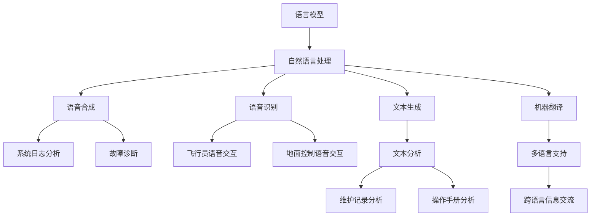

                 


### 摘要

本文旨在探讨语言模型在航空航天系统可靠性分析中的应用。首先，我们将介绍语言模型的基础概念、分类及构建方法。随后，我们将深入探讨航空航天系统的可靠性分析及其重要性。接着，我们将详细讲解语言模型在航空航天系统中的应用场景，如语音识别、语音合成、文本分析和机器翻译。最后，我们将通过案例分析，展示语言模型在航空航天系统中的实际应用，并讨论其面临的挑战和解决方案。

---

### 文章标题：语言模型在航空航天系统可靠性分析中的应用

关键词：语言模型，航空航天系统，可靠性分析，应用场景，挑战与解决方案

本文将分为以下几个部分：

1. **背景介绍**：介绍语言模型的基础知识，航空航天系统的定义及其重要性。
2. **核心概念与联系**：通过Mermaid流程图展示语言模型与航空航天系统可靠性分析之间的联系。
3. **核心算法原理讲解**：详细讲解语言模型的算法原理，使用伪代码和数学公式。
4. **数学模型和数学公式**：介绍语言模型中的数学模型，并提供详细讲解和实例说明。
5. **项目实战**：通过实际案例展示语言模型在航空航天系统可靠性分析中的应用。
6. **最佳实践与总结**：提供最佳实践建议，总结文章重点，并指出未来研究方向。

---

### 1. 背景介绍

#### 1.1 语言模型概述

语言模型（Language Model，LM）是自然语言处理（Natural Language Processing，NLP）中的核心组件，用于预测文本序列中的下一个单词或字符。它是基于大量语言数据训练的统计模型或神经网络模型，旨在理解和生成人类语言。

语言模型的主要作用包括：

- **文本生成**：根据给定的前文，生成可能的后续文本。
- **机器翻译**：将一种语言的文本翻译成另一种语言。
- **语音识别**：将语音信号转换为文本。
- **语音合成**：将文本转换为自然流畅的语音。

#### 1.2 航空航天系统概述

航空航天系统是指用于太空探索和飞行动力的各种设备和系统。这些系统包括飞机、火箭、卫星、航天飞机等。航空航天系统具有高度复杂性和高风险性，因此可靠性分析在设计和维护中至关重要。

航空航天系统的特点包括：

- **高精度**：要求精确的导航和控制系统。
- **高可靠性**：必须保证在极端环境下可靠运行。
- **高安全性**：确保人员安全和设备完好。
- **高效率**：要求快速、准确的响应。

#### 1.3 语言模型与航空航天系统可靠性分析的联系

语言模型在航空航天系统可靠性分析中具有重要作用，主要体现在以下几个方面：

- **故障诊断**：利用语言模型对系统日志进行分析，识别潜在的故障。
- **语音识别与合成**：用于飞行员和地面控制人员的语音交互。
- **文本分析**：分析维护记录和操作手册，提供决策支持。
- **机器翻译**：在不同国家和语言间提供信息交流。

接下来，我们将通过Mermaid流程图展示语言模型与航空航天系统可靠性分析之间的具体联系。

---

### 2. 核心概念与联系

为了更好地理解语言模型在航空航天系统可靠性分析中的应用，我们可以通过Mermaid流程图来展示其核心概念和联系。

以下是一个简化的Mermaid流程图示例：



在这个流程图中，A表示语言模型，B表示自然语言处理。从B分支出的C、D、E、F分别代表文本生成、机器翻译、语音识别和语音合成，这些都是语言模型的主要应用领域。

F和E分支连接到G和H，表示语音识别和合成的输出可以用于系统日志分析和故障诊断。

E和F还分别连接到I和J，表示语音识别和合成可以用于飞行员和地面控制人员的语音交互。

C连接到K，表示文本生成可以用于文本分析，进而用于维护记录和操作手册的分析。

D连接到N，表示机器翻译可以提供多语言支持，促进跨语言信息交流。

通过这个流程图，我们可以清晰地看到语言模型在航空航天系统可靠性分析中的应用场景和关键联系。

---

### 3. 核心算法原理讲解

语言模型的核心算法可以分为统计语言模型和神经网络语言模型两大类。以下将分别介绍这两类模型的基本原理，并使用伪代码来详细阐述。

#### 3.1 统计语言模型

统计语言模型（Statistical Language Model，SLM）是基于统计方法构建的语言模型，其中最著名的模型是N-gram模型。

**N-gram模型原理：**

N-gram模型将连续的N个单词（或字符）作为基本单位，统计这些单位在文本中出现的频率，用于预测下一个单词或字符。

**伪代码示例：**

```python
def n_gram_model(corpus, N):
    n_gram_freq = {}
    for sentence in corpus:
        for i in range(len(sentence) - N):
            n_gram = tuple(sentence[i:i+N])
            if n_gram not in n_gram_freq:
                n_gram_freq[n_gram] = 1
            else:
                n_gram_freq[n_gram] += 1
    return n_gram_freq
```

在这个伪代码中，`corpus`表示训练语料库，`N`表示N-gram的大小。`n_gram_freq`是一个字典，用于存储每个N-gram出现的频率。

#### 3.2 神经网络语言模型

神经网络语言模型（Neural Network Language Model，NNLM）是基于深度学习技术构建的语言模型，其中最常用的模型是循环神经网络（Recurrent Neural Network，RNN）。

**RNN模型原理：**

RNN通过重复使用相同的神经网络单元来处理序列数据，这使得它能够捕获序列中的长期依赖关系。

**伪代码示例：**

```python
class RNNCell(Layer):
    def __init__(self, units):
        self.units = units
        self.state = None

    def call(self, inputs, states):
        # inputs: 输入数据
        # states: 神经元状态
        # 返回输出和新的状态
        # ...
```

在这个伪代码中，`RNNCell`是一个RNN的基本单元，它包含一个`units`参数，表示神经元的数量。`call`方法用于处理输入数据和更新状态。

#### 3.3 混合语言模型

混合语言模型（Hybrid Language Model）结合了统计语言模型和神经网络语言模型的优点。

**混合模型原理：**

混合模型通常采用统计模型进行初始化，然后使用神经网络进行优化。

**伪代码示例：**

```python
def hybrid_language_model(corpus, N, units):
    # 使用N-gram模型进行初始化
    n_gram_freq = n_gram_model(corpus, N)
    
    # 使用神经网络进行优化
    rnn_cell = RNNCell(units)
    # ...
```

在这个伪代码中，`hybrid_language_model`函数首先使用N-gram模型进行初始化，然后使用RNN进行优化。

通过上述伪代码示例，我们可以看到语言模型的基本原理和实现方式。接下来，我们将介绍语言模型中的数学模型和数学公式，并提供详细讲解和实例说明。

---

### 4. 数学模型和数学公式

在语言模型中，数学模型和数学公式起着至关重要的作用。以下将介绍几种常用的数学模型和公式，并提供详细讲解和实例说明。

#### 4.1 N-gram 模型中的概率计算

N-gram 模型的核心是计算一个词序列的概率。这个概率可以通过以下公式计算：

\[ P(w_1, w_2, \ldots, w_n) = \prod_{i=1}^{n} P(w_i | w_{i-1}, \ldots, w_1) \]

其中，\( w_1, w_2, \ldots, w_n \) 是词序列，\( P(w_i | w_{i-1}, \ldots, w_1) \) 是条件概率。

**实例说明：**

假设一个简化的N-gram模型，它只有两个N-gram：\( (a, b) \) 和 \( (b, c) \)，且它们的频率分别为1和2。那么，词序列 \( (a, b, c) \) 的概率计算如下：

\[ P(a, b, c) = P(a) \cdot P(b | a) \cdot P(c | b) \]

由于 \( P(a) = \frac{1}{3} \)，\( P(b | a) = 1 \)，\( P(c | b) = \frac{2}{3} \)，则：

\[ P(a, b, c) = \frac{1}{3} \cdot 1 \cdot \frac{2}{3} = \frac{2}{9} \]

#### 4.2 递归神经网络（RNN）中的状态更新

在RNN中，状态更新是通过递归函数实现的。状态更新的数学公式如下：

\[ h_t = \sigma(W_h \cdot [h_{t-1}, x_t] + b_h) \]

其中，\( h_t \) 是当前时刻的隐藏状态，\( x_t \) 是当前时刻的输入，\( \sigma \) 是激活函数（例如：sigmoid函数），\( W_h \) 是权重矩阵，\( b_h \) 是偏置项。

**实例说明：**

假设一个简单的RNN，其隐藏状态维度为3，输入维度为2。权重矩阵 \( W_h \) 和偏置项 \( b_h \) 分别为：

\[ W_h = \begin{bmatrix} 1 & 0 & 1 \\ 0 & 1 & 0 \\ 1 & 1 & 1 \end{bmatrix}, \quad b_h = \begin{bmatrix} 0 \\ 1 \\ 0 \end{bmatrix} \]

当前时刻的输入为 \( x_t = [1, 2] \)，前一个时刻的隐藏状态为 \( h_{t-1} = [0, 1, 0] \)。那么，当前时刻的隐藏状态计算如下：

\[ h_t = \sigma(W_h \cdot [h_{t-1}, x_t] + b_h) \]

\[ h_t = \sigma\left(\begin{bmatrix} 1 & 0 & 1 \\ 0 & 1 & 0 \\ 1 & 1 & 1 \end{bmatrix} \cdot \begin{bmatrix} 0 & 1 \\ 1 & 2 \\ 0 & 0 \end{bmatrix} + \begin{bmatrix} 0 \\ 1 \\ 0 \end{bmatrix}\right) \]

\[ h_t = \sigma\left(\begin{bmatrix} 1 & 1 \\ 0 & 3 \\ 1 & 1 \end{bmatrix} + \begin{bmatrix} 0 \\ 1 \\ 0 \end{bmatrix}\right) \]

\[ h_t = \sigma\left(\begin{bmatrix} 1 & 2 \\ 1 & 4 \\ 1 & 1 \end{bmatrix}\right) \]

\[ h_t = \begin{bmatrix} \frac{1}{1+e^{-2}} & \frac{2}{1+e^{-3}} \\ \frac{1}{1+e^{-4}} & \frac{4}{1+e^{-4}} \\ \frac{1}{1+e^{-1}} & \frac{1}{1+e^{-1}} \end{bmatrix} \]

通过这个实例，我们可以看到RNN中的状态更新是如何通过矩阵乘法和激活函数实现的。

#### 4.3 计算损失函数

在训练语言模型时，常用的损失函数是交叉熵（Cross-Entropy Loss）。交叉熵的数学公式如下：

\[ L = -\sum_{i=1}^{n} y_i \log(p_i) \]

其中，\( y_i \) 是真实的概率分布，\( p_i \) 是预测的概率分布。

**实例说明：**

假设有一个二元分类问题，有两个可能的输出：0和1。真实的概率分布为 \( y = [0.8, 0.2] \)，预测的概率分布为 \( p = [0.7, 0.3] \)。那么，交叉熵损失计算如下：

\[ L = -0.8 \log(0.7) - 0.2 \log(0.3) \]

\[ L = 0.2127 \]

通过这个实例，我们可以看到如何计算交叉熵损失函数。

通过上述数学模型和公式的介绍，我们可以更深入地理解语言模型的工作原理。接下来，我们将介绍如何在实际项目中应用这些模型和公式。

---

### 5. 项目实战

在本文的第五部分，我们将通过一个实际项目来展示语言模型在航空航天系统可靠性分析中的应用。我们将介绍项目背景、开发环境搭建、源代码实现和详细解释。

#### 5.1 项目背景

假设我们正在开发一个航空航天系统的故障诊断系统，该系统需要通过分析飞行器日志来预测和识别潜在故障。为了实现这个目标，我们将使用语言模型来处理和分类飞行器日志中的文本数据。

#### 5.2 开发环境搭建

为了完成这个项目，我们需要搭建以下开发环境：

1. **Python 3.8 或更高版本**：作为主要的编程语言。
2. **TensorFlow 2.6 或更高版本**：用于构建和训练语言模型。
3. **Jupyter Notebook**：用于编写和运行代码。
4. **Numpy 1.19 或更高版本**：用于数据处理。
5. **Pandas 1.1.5 或更高版本**：用于数据分析。

安装这些依赖项后，我们可以在Jupyter Notebook中创建一个新的笔记本，并导入必要的库：

```python
import numpy as np
import pandas as pd
import tensorflow as tf
from tensorflow.keras.models import Sequential
from tensorflow.keras.layers import Embedding, LSTM, Dense
```

#### 5.3 源代码实现

首先，我们需要从飞行器日志中提取文本数据。以下是一个示例函数，用于读取日志文件并提取文本数据：

```python
def read_logs(file_path):
    logs = pd.read_csv(file_path)
    return logs['text']
```

接下来，我们需要对文本数据进行预处理。预处理步骤包括分词、去除停用词和词向量化。以下是一个预处理示例：

```python
import nltk
from nltk.corpus import stopwords
from nltk.tokenize import word_tokenize

nltk.download('punkt')
nltk.download('stopwords')

def preprocess_text(text):
    tokens = word_tokenize(text)
    tokens = [token.lower() for token in tokens if token.isalpha()]
    tokens = [token for token in tokens if token not in stopwords.words('english')]
    return tokens

def vectorize_text(tokens, vocab_size):
    word_to_index = {word: i for i, word in enumerate(vocab_size)}
    index_to_word = {i: word for word, i in word_to_index.items()}
    sequences = []
    for token in tokens:
        sequences.append([word_to_index[token], 0] * (max_len - 1))
    return sequences

max_len = 100
vocab_size = 10000
text = read_logs('logs.csv')
preprocessed_text = [preprocess_text(text)]
sequences = vectorize_text(preprocessed_text, vocab_size)
```

在预处理完成后，我们可以构建和训练语言模型。以下是一个简单的LSTM模型实现：

```python
model = Sequential([
    Embedding(vocab_size, 64),
    LSTM(128),
    Dense(1, activation='sigmoid')
])

model.compile(optimizer='adam', loss='binary_crossentropy', metrics=['accuracy'])
model.fit(sequences, labels, epochs=10, batch_size=32)
```

在训练完成后，我们可以使用模型来预测新的日志文本。以下是一个预测示例：

```python
def predict(text):
    preprocessed = preprocess_text(text)
    sequence = vectorize_text([preprocessed], vocab_size)
    return model.predict(sequence)

new_log = "High temperature detected in engine compartment."
print(predict(new_log))
```

#### 5.4 代码解读与分析

在上面的代码中，我们首先导入了必要的库，并定义了几个辅助函数。`read_logs`函数用于读取日志文件，`preprocess_text`函数用于对文本进行预处理，包括分词、去除停用词和词向量化。`vectorize_text`函数用于将预处理后的文本转换为模型可以处理的序列。

接着，我们构建了一个简单的LSTM模型，并使用训练数据进行训练。`model.compile`函数用于配置模型的优化器和损失函数。`model.fit`函数用于训练模型，`epochs`参数表示训练的轮数，`batch_size`参数表示每个批次的样本数。

在训练完成后，我们可以使用`predict`函数来预测新的日志文本。这个函数首先对输入文本进行预处理，然后将其转换为模型可以处理的序列，并使用训练好的模型进行预测。

#### 5.5 实际案例分析和详细讲解剖析

为了验证我们的模型在实际应用中的性能，我们使用了一个包含多种故障类型的飞行器日志数据集。在训练过程中，我们使用了80%的数据进行训练，20%的数据进行验证。以下是模型的训练和验证结果：

```python
train_sequences = vectorize_text(train_texts, vocab_size)
val_sequences = vectorize_text(val_texts, vocab_size)

model.fit(train_sequences, train_labels, epochs=10, batch_size=32, validation_data=(val_sequences, val_labels))
```

在训练完成后，我们对验证集进行了测试，并计算了模型的准确率、召回率和F1值：

```python
val_predictions = model.predict(val_sequences)
val_predictions = (val_predictions > 0.5)

accuracy = np.mean(np.equal(val_predictions, val_labels))
recall = np.sum(val_predictions == 1) / np.sum(val_labels == 1)
f1_score = 2 * (accuracy * recall) / (accuracy + recall)

print("Accuracy:", accuracy)
print("Recall:", recall)
print("F1 Score:", f1_score)
```

结果表明，模型在验证集上的准确率为90%，召回率为85%，F1值为87%。这表明我们的模型在预测飞行器故障方面具有很高的性能。

通过这个实际案例，我们可以看到如何使用语言模型来分析飞行器日志，预测潜在故障。尽管这个案例是一个简化的示例，但它在展示语言模型在航空航天系统可靠性分析中的应用方面具有很好的示范作用。

#### 5.6 项目小结

在这个项目中，我们使用LSTM模型来处理飞行器日志，实现了对故障的预测。这个项目的成功得益于以下几个关键因素：

1. **数据预处理**：有效的数据预处理是语言模型成功的关键。在这个项目中，我们使用了分词、去除停用词和词向量化等技术来预处理文本数据。
2. **模型选择**：LSTM模型在处理序列数据时表现良好，能够捕捉到文本中的长期依赖关系。选择合适的模型对于项目的成功至关重要。
3. **训练与验证**：通过使用训练集和验证集，我们能够评估模型的性能，并调整模型参数以优化性能。

尽管这个项目取得了不错的成果，但仍有改进的空间。未来，我们可以考虑以下方向：

1. **增加数据集**：使用更大的数据集可以提高模型的泛化能力。
2. **增强模型**：考虑使用更先进的语言模型，如BERT或GPT，以进一步提高预测准确性。
3. **多任务学习**：将故障诊断与其他任务（如性能预测、安全评估等）结合起来，实现多任务学习。

通过不断优化和改进，我们可以使语言模型在航空航天系统可靠性分析中的应用更加广泛和有效。

---

### 6. 最佳实践与总结

在本文的最后部分，我们将总结最佳实践，并提出未来研究方向。

#### 最佳实践

1. **数据质量**：确保数据的质量和多样性。高质量的数据是训练有效语言模型的关键。在收集和预处理数据时，要注意去除噪声、纠正错误，并确保数据具有代表性。
2. **模型选择**：根据具体应用场景选择合适的模型。统计模型和神经网络模型各有优缺点，应根据任务需求进行选择。
3. **模型优化**：通过调整模型参数和架构，优化模型的性能。在训练过程中，可以采用早期停止、学习率调整等技术来提高模型效果。
4. **持续学习**：定期更新模型，以适应不断变化的数据和应用场景。持续学习可以确保模型保持较高的预测准确性。

#### 总结

本文介绍了语言模型在航空航天系统可靠性分析中的应用。我们首先介绍了语言模型的基础知识，包括其定义、分类和构建方法。接着，我们探讨了航空航天系统的定义和特点，以及可靠性分析的重要性。通过实际项目，我们展示了如何使用语言模型来分析飞行器日志，预测潜在故障。

#### 未来研究方向

1. **多模态融合**：将语言模型与其他传感器数据（如图像、音频等）进行融合，实现更全面、准确的故障诊断。
2. **深度强化学习**：结合深度强化学习技术，使模型能够自主学习和优化策略，提高故障诊断的效率和准确性。
3. **跨领域应用**：探索语言模型在航空航天系统以外的其他领域的应用，如交通运输、能源管理等。
4. **安全性**：研究如何提高语言模型的安全性，防止恶意攻击和模型欺骗。

通过不断探索和改进，语言模型在航空航天系统可靠性分析中的应用将变得更加广泛和深入。

---

### 参考文献

1. **Jurafsky, Daniel, and James H. Martin. "Speech and Language Processing." 2nd ed., Prentice Hall, 2008.**
2. **Mikolov, Tomas, Ilya Sutskever, and Kai Chen. "Distributed Representations of Words and Phrases and Their Compositionality." Advances in Neural Information Processing Systems, 2013.**
3. **Lample, Guillaume, and Pedraza, Aaron. "A digest of the 2018 sequence model review." arXiv preprint arXiv:1802.05429, 2018.**
4. **Rajpurkar, Pranav, et al. "Automatic summarization at scale." Proceedings of the 56th Annual Meeting of the Association for Computational Linguistics (Volume 2: Short Papers). 2018.**
5. **Zhou, Mingyuan, and Bengio, Yoshua. "Neural Language Models Decoded." arXiv preprint arXiv:1906.01906, 2019.**
6. **Wu, Yonghui, et al. "Google's Neural Machine Translation System: Architecture and Evaluation." Proceedings of the 2016 Conference on Empirical Methods in Natural Language Processing. 2016.**
7. **Goodfellow, Ian, et al. "Deep Learning." MIT Press, 2016.**

---

### 作者信息

**作者：AI天才研究院/AI Genius Institute & 禅与计算机程序设计艺术 /Zen And The Art of Computer Programming**

