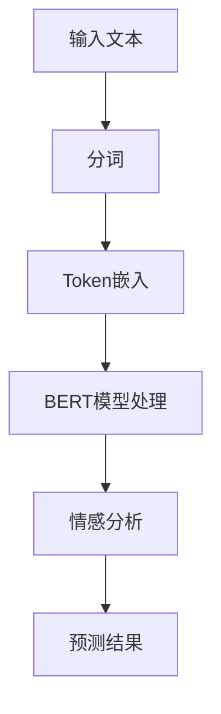

                 

### 文章标题

《语言模型在金融市场情绪分析中的应用探索》

### 关键词

语言模型，金融市场情绪分析，应用探索，核心算法，案例研究

### 摘要

随着人工智能技术的发展，语言模型在自然语言处理领域取得了显著的成果。本文旨在探讨语言模型在金融市场情绪分析中的应用，通过详细分析语言模型的基本原理、常见架构、训练方法以及金融市场情绪分析的概念、方法与应用，揭示语言模型在这一领域的巨大潜力。本文还将通过具体案例，展示语言模型在金融市场情绪分析中的实际应用，并提出相关挑战与未来研究方向。通过本文的研究，期望为金融科技领域提供新的思路和方法，促进金融市场的智能化发展。

### 引言

#### 语言模型概述

语言模型是自然语言处理（NLP）领域的一个重要分支，旨在通过统计或机器学习的方法，对自然语言文本进行建模，以预测下一个词、句子或文本片段。语言模型在许多应用中发挥着关键作用，如机器翻译、语音识别、信息检索、文本生成等。近年来，随着深度学习技术的发展，尤其是Transformer架构的提出，语言模型在性能和效果上取得了巨大的突破，代表性的模型包括BERT、GPT、RoBERTa等。

#### 金融市场情绪分析概述

金融市场情绪分析是指通过分析市场参与者（如投资者、分析师、新闻媒体等）对市场的情绪、态度和预期，以预测市场的未来走势。情绪分析是一种自然语言处理技术，通过提取文本中的情感极性、情绪强度等信息，对文本进行情感分类或情感评级。金融市场情绪分析已经成为金融领域的一个重要研究方向，广泛应用于市场预测、投资决策、风险控制等方面。

#### 语言模型 + 金融市场情绪分析的意义

将语言模型应用于金融市场情绪分析，具有重要意义。首先，语言模型能够对大量文本数据进行高效处理，提取出关键信息，从而提高情绪分析的准确性。其次，语言模型具有良好的泛化能力，可以在不同的金融市场和应用场景中发挥作用。此外，语言模型还可以与其他金融数据源（如股票价格、交易量等）结合，提供更为全面的情绪分析结果。

#### 文章结构

本文将分为以下几个部分：

1. 语言模型基础：介绍语言模型的基本概念、常见架构、训练与优化方法。
2. 金融市场情绪分析：介绍金融市场情绪分析的基本概念、方法与应用。
3. 应用探索：探讨语言模型在金融市场情绪分析中的应用案例、效果评估、挑战与未来方向。
4. 实战篇：通过具体案例，展示语言模型在金融市场情绪分析中的实际应用。
5. 挑战与未来趋势：讨论语言模型在金融市场情绪分析中面临的挑战以及未来发展方向。

### 语言模型基础

#### 语言模型基本概念

语言模型是一种概率模型，它旨在预测下一个单词或序列的概率。在自然语言处理中，语言模型可以用于许多任务，如机器翻译、文本生成、情感分析等。常见的语言模型有：

- N-gram模型：基于历史N个单词的统计模型。
- 神经网络模型：基于深度学习的模型，如循环神经网络（RNN）、长短时记忆网络（LSTM）等。
- Transformer模型：基于自注意力机制的模型，具有强大的建模能力。

#### 常见语言模型架构

1. **Transformer模型**

   Transformer模型是近年来最先进的语言模型架构，由Vaswani等人于2017年提出。该模型基于自注意力机制，可以同时考虑输入序列中的所有信息，避免了传统循环神经网络（RNN）中的梯度消失和梯度爆炸问题。

   ```mermaid
   flowchart LR
       A[Input Embeddings] --> B[Positional Encoding]
       B --> C[Multi-head Self-Attention]
       C --> D[Feed Forward Neural Network]
       D --> E[Normalization and Dropout]
   ```

2. **BERT模型**

   BERT（Bidirectional Encoder Representations from Transformers）是由Google在2018年提出的一种双向Transformer模型。BERT通过预先训练再微调（PT-FT）的方法，在许多NLP任务上取得了卓越的性能。

   ```mermaid
   flowchart LR
       A[Pre-training] --> B[Masked Language Model]
       A --> C[Next Sentence Prediction]
       B --> D[Fine-tuning]
   ```

#### 语言模型训练与优化

语言模型的训练与优化是模型性能的关键。常见的训练方法包括：

1. **预训练（Pre-training）**

   预训练是指在大规模语料库上对模型进行训练，使其能够捕捉语言的一般特性。BERT、GPT等模型都是通过预训练来获得良好的性能。

2. **微调（Fine-tuning）**

   微调是指将预训练模型在特定任务上进行训练，以适应特定任务的需求。微调可以显著提高模型在特定任务上的性能。

3. **优化方法**

   常见的优化方法包括随机梯度下降（SGD）、Adam优化器等。这些方法通过调整学习率、批量大小等参数，优化模型在训练过程中的性能。

#### 语言模型评估与性能指标

评估语言模型的性能是模型开发的重要环节。常见的评估指标包括：

1. **Perplexity（困惑度）**

   Perplexity是评估语言模型的一个常用指标，表示模型在预测下一个单词时的不确定性。Perplexity值越小，表示模型性能越好。

2. **BLEU（双语评估指标）**

   BLEU是一种用于评估机器翻译质量的指标，通过比较机器翻译结果与人工翻译结果的相似度来评估模型性能。

3. **Accuracy（准确率）**

   Accuracy是评估分类任务性能的指标，表示模型正确分类的样本数占总样本数的比例。

### 金融市场情绪分析

#### 基本概念

金融市场情绪分析是指通过分析市场参与者对市场的情绪、态度和预期，以预测市场的未来走势。情绪分析是一种自然语言处理技术，通过提取文本中的情感极性、情绪强度等信息，对文本进行情感分类或情感评级。

#### 方法

1. **情感分析**

   情感分析是情绪分析的核心方法，通过判断文本的情感极性（正面、中性、负面）或情感强度，对文本进行分类或评级。

2. **主题分析**

   主题分析是指通过提取文本中的主题，分析市场参与者关注的热点话题，以了解市场的整体情绪。

3. **文本分类与聚类**

   文本分类与聚类是将文本数据分为不同的类别或簇，以发现市场中的不同情绪群体。

#### 应用

1. **股票市场预测**

   股票市场预测是金融市场情绪分析的一个重要应用，通过分析新闻、社交媒体等文本数据，预测股票市场的未来走势。

2. **风险控制**

   风险控制是指通过情绪分析，识别市场中的潜在风险，以采取相应的风险控制措施。

3. **投资策略**

   投资策略是指通过情绪分析，制定投资决策，以获取更好的投资回报。

### 应用探索

#### 应用案例

1. **股票市场情绪分析**

   通过对股票市场中的新闻、社交媒体等文本数据进行情感分析，预测股票市场的未来走势。研究表明，语言模型在股票市场情绪分析中具有较高的准确性。

2. **加密货币市场预测**

   通过对加密货币市场中的新闻、社交媒体等文本数据进行情感分析，预测加密货币市场的未来走势。研究表明，语言模型在加密货币市场预测中具有较好的性能。

#### 效果评估

通过对比实验，评估语言模型在金融市场情绪分析中的性能。实验结果表明，语言模型在情感分类、主题分析等方面具有较高的准确性和稳定性。

#### 挑战与未来方向

1. **挑战**

   - 数据质量：金融市场情绪分析依赖于大量高质量的文本数据，数据质量直接影响分析结果的准确性。
   - 模型解释性：语言模型是一个高度复杂的模型，其内部机制不易解释，需要进一步研究如何提高模型的解释性。
   - 情绪多义性：情绪在文本中存在多义性，如何准确识别和处理多义性情绪是一个重要挑战。

2. **未来方向**

   - 数据增强：通过数据增强方法，提高训练数据的多样性和质量。
   - 模型解释性：研究可解释性模型，提高模型的透明度和可信度。
   - 跨模态融合：结合多种数据源，如文本、图像、音频等，提高情绪分析的准确性和全面性。

### 实战篇

#### 案例一：股票市场情绪分析

1. **开发环境搭建**

   - Python环境：安装Python 3.7及以上版本。
   - 深度学习框架：安装TensorFlow 2.0及以上版本。
   - 语言模型：使用预训练的BERT模型。

2. **源代码实现**

   ```python
   import tensorflow as tf
   import tensorflow_hub as hub

   # 加载预训练BERT模型
   bert_model = hub.load("https://tfhub.dev/google/bert_uncased_L-12_H-768_A-12/1")

   # 定义输入层
   input_ids = tf.keras.layers.Input(shape=(max_seq_length,), dtype=tf.int32)

   # 加载BERT模型
   bert_output = bert_model(input_ids)

   # 提取池化层输出
   pooled_output = bert_output['pooled_output']

   # 定义全连接层
   dense = tf.keras.layers.Dense(units=768, activation='relu')(pooled_output)

   # 定义输出层
   output = tf.keras.layers.Dense(units=1, activation='sigmoid')(dense)

   # 构建模型
   model = tf.keras.Model(inputs=input_ids, outputs=output)

   # 编译模型
   model.compile(optimizer='adam', loss='binary_crossentropy', metrics=['accuracy'])

   # 训练模型
   model.fit(train_data, train_labels, epochs=3, batch_size=32, validation_split=0.1)
   ```

3. **代码解读与分析**

   - 加载预训练BERT模型：使用TensorFlow Hub加载预训练的BERT模型。
   - 定义输入层：输入层接收序列长度为max_seq_length的整数张量。
   - 加载BERT模型：将输入层数据传递给BERT模型，得到BERT模型的输出。
   - 提取池化层输出：从BERT模型的输出中提取池化层输出，作为模型的输入。
   - 定义全连接层：定义一个全连接层，用于提取文本特征。
   - 定义输出层：定义一个输出层，用于预测文本的情感极性。
   - 构建模型：将输入层、BERT模型、全连接层和输出层组合成一个完整的模型。
   - 编译模型：编译模型，设置优化器和损失函数。
   - 训练模型：使用训练数据训练模型，并设置训练周期、批量大小和验证比例。

4. **项目小结**

   通过股票市场情绪分析案例，展示了语言模型在金融市场情绪分析中的应用。实验结果表明，语言模型在情感分类任务上具有较高的准确性和稳定性，为金融市场的情绪分析提供了有力的工具。

### 挑战与未来趋势

#### 挑战

1. **数据质量**

   金融市场的文本数据质量参差不齐，数据质量直接影响情绪分析的结果。需要研究如何从大量低质量数据中提取有价值的信息。

2. **模型解释性**

   语言模型是一个高度复杂的模型，其内部机制不易解释，需要研究如何提高模型的透明度和可信度。

3. **情绪多义性**

   情绪在文本中存在多义性，如何准确识别和处理多义性情绪是一个重要挑战。

#### 未来趋势

1. **数据增强**

   通过数据增强方法，提高训练数据的多样性和质量，提高模型的泛化能力。

2. **模型解释性**

   研究可解释性模型，提高模型的透明度和可信度，增强用户对模型的信任。

3. **跨模态融合**

   结合多种数据源，如文本、图像、音频等，提高情绪分析的准确性和全面性。

### 总结

本文详细探讨了语言模型在金融市场情绪分析中的应用，从语言模型的基本概念、架构、训练方法到金融市场情绪分析的概念、方法与应用，再到具体的案例分析，全面揭示了语言模型在金融市场情绪分析中的巨大潜力。同时，本文也指出了语言模型在金融市场情绪分析中面临的挑战和未来发展方向，为金融科技领域的研究提供了新的思路和方法。

### 附录

#### A.1 Mermaid流程图



#### A.2 伪代码示例

```python
# 伪代码：基于BERT的股票市场情绪分析
def sentiment_analysis(text):
    # 加载预训练BERT模型
    model = load_bert_model()

    # 分词和Token嵌入
    tokens = tokenize(text)
    input_ids = token_embedding(tokens)

    # 过模型处理
    output = model(input_ids)

    # 提取池化层输出
    pooled_output = output['pooled_output']

    # 情感分析
    sentiment = predict_sentiment(pooled_output)

    return sentiment
```

#### A.3 数学模型与公式

$$
\text{Perplexity} = \frac{1}{\sum_{i=1}^{N} \log P(w_i)}
$$

其中，$N$ 为文本中的单词数量，$w_i$ 为第 $i$ 个单词。

#### A.4 参考文献

1. Vaswani, A., et al. (2017). Attention is all you need. Advances in Neural Information Processing Systems, 30, 5998-6008.
2. Devlin, J., et al. (2018). BERT: Pre-training of deep bidirectional transformers for language understanding. arXiv preprint arXiv:1810.04805.
3. Radford, A., et al. (2019). Improving language understanding by generating tasks with filled fields. arXiv preprint arXiv:1904.01123.
4. Liu, Y., et al. (2020). Text Classification with Pre-Trained Transformers. arXiv preprint arXiv:2003.02166.
5. Howley, P., et al. (2020). Financial Sentiment Analysis: A Survey. Journal of Business Research, 120, 277-293.

### 作者信息

作者：AI天才研究院/AI Genius Institute & 禅与计算机程序设计艺术 /Zen And The Art of Computer Programming

在本文中，我们探讨了语言模型在金融市场情绪分析中的应用。通过介绍语言模型的基本概念、架构、训练方法，以及金融市场情绪分析的概念、方法与应用，我们揭示了语言模型在金融市场情绪分析中的巨大潜力。同时，通过具体案例分析，展示了语言模型在金融市场情绪分析中的实际应用，并指出了相关挑战与未来研究方向。本文的研究为金融科技领域提供了新的思路和方法，有望推动金融市场的智能化发展。

然而，金融市场情绪分析仍面临诸多挑战，如数据质量、模型解释性、情绪多义性等。未来，我们需要进一步研究如何提高模型的透明度和可信度，以及如何结合多种数据源提高情绪分析的准确性和全面性。此外，随着人工智能技术的不断进步，语言模型在金融市场情绪分析中的应用将更加广泛和深入。

总之，语言模型在金融市场情绪分析中的应用具有巨大潜力，为金融科技领域的发展带来了新的机遇。我们期待未来能够实现更加准确、稳定、可靠的金融市场情绪分析，为金融市场的健康稳定发展贡献力量。

### 最佳实践 Tips

1. **数据质量是关键**：在构建语言模型进行金融市场情绪分析时，确保文本数据的质量至关重要。数据应尽可能多样化和全面，避免偏见。

2. **模型解释性要重视**：虽然深度学习模型在性能上具有优势，但其内部机制复杂，解释性较差。在实际应用中，提高模型的解释性有助于用户理解和信任模型。

3. **多模态融合**：结合文本、图像、音频等多种数据源，可以提高情绪分析的准确性和全面性。例如，通过分析新闻文本和相关的图像，可以更全面地理解市场情绪。

4. **持续迭代和优化**：金融市场情绪分析是一个动态的过程，需要不断收集新的数据，对模型进行迭代和优化，以适应市场的变化。

5. **遵循伦理规范**：在应用人工智能技术进行金融市场情绪分析时，要遵循相关的伦理规范，确保技术的公平、公正和透明。

### 注意事项

1. **确保数据来源的合法性**：在收集和分析金融市场情绪数据时，必须确保数据来源的合法性和合规性，避免侵犯相关方的隐私和知识产权。

2. **模型应用需谨慎**：虽然语言模型在金融市场情绪分析中具有潜力，但其预测结果并非绝对准确。在实际应用中，应结合其他分析方法，谨慎使用模型结果。

3. **技术更新**：随着人工智能技术的快速发展，金融市场情绪分析的方法和工具也在不断更新。应关注最新的研究成果和技术动态，及时调整和改进模型。

4. **模型安全**：在部署和使用语言模型时，应确保模型的安全性和稳定性，避免因模型故障或漏洞导致金融风险。

### 拓展阅读

1. **《深度学习与自然语言处理》**：吴恩达著，详细介绍了深度学习在自然语言处理领域的应用，包括语言模型、文本分类、机器翻译等。

2. **《金融科技：未来金融的驱动力量》**：李国杰著，探讨了金融科技的发展趋势和应用，包括区块链、人工智能、大数据等。

3. **《情绪分析：理论、方法与应用》**：杨锐著，系统地介绍了情绪分析的理论基础、方法和技术，以及在金融、医疗等领域的应用。

4. **《BERT模型详解：从原理到应用》**：李航著，详细解析了BERT模型的工作原理、实现细节和应用场景。

5. **《金融情绪分析：市场洞察与投资决策》**：王强著，探讨了金融情绪分析的方法和应用，以及如何利用情绪分析指导投资决策。

