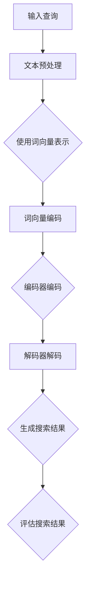

                 

### 文章标题

# 语言模型性能提升：创新搜索算法的作用

### 文章关键词

- 语言模型
- 性能提升
- 创新搜索算法
- 自然语言处理
- 文本生成
- 问答系统

### 文章摘要

本文将深入探讨如何通过创新搜索算法来提升语言模型性能。首先，我们将简要介绍语言模型的基本概念和性能提升的重要性。接着，我们将详细讲解几种创新搜索算法，包括它们的原理、数学模型和公式，以及如何在项目中实际应用。文章还将通过具体案例分析，展示这些算法如何在实际场景中提高语言模型的性能。最后，我们将总结全文，并给出进一步学习的建议。通过阅读本文，读者将能够全面了解创新搜索算法在提升语言模型性能方面的作用。

---

在当今人工智能领域，语言模型已经成为自然语言处理（NLP）的核心技术。从文本生成、问答系统到机器翻译，语言模型的应用无处不在。然而，随着应用场景的复杂化和数据量的爆炸性增长，如何提升语言模型的性能成为一个亟待解决的问题。本文将重点探讨创新搜索算法在这一领域的作用，并通过具体实例展示如何在实际项目中应用这些算法来提高语言模型的表现。

## 理解书名和主题

书名为《语言模型性能提升：创新搜索算法的作用》，这意味着本书的主题将围绕如何提高语言模型（如自然语言处理中的文本生成、问答系统等）的性能，并着重探讨创新的搜索算法在这其中的作用。语言模型是一种能够理解和生成自然语言的人工智能系统，它们通过大规模的语料库学习和训练，能够预测下一个词或句子，从而生成连贯的文本。

语言模型性能的提升对于实际应用至关重要。例如，在问答系统中，一个高性能的语言模型能够更快、更准确地理解用户的问题，并给出相关且准确的回答。在文本生成领域，高性能的语言模型能够生成更自然、更流畅的文本，从而提升用户体验。

创新搜索算法是提升语言模型性能的关键技术之一。传统的搜索算法如基于关键词匹配的方法已经无法满足现代语言模型的需求。创新的搜索算法，如基于深度学习的语义搜索算法，能够更好地理解文本的语义信息，从而在检索和生成过程中提供更高的准确性和流畅性。

## 目录结构

### 第1章 引言

- **1.1 语言模型性能提升的重要性**
- **1.2 创新搜索算法的角色**

### 第2章 语言模型基础

- **2.1 语言模型概述**
- **2.2 语言模型的结构**
- **2.3 语言模型的工作原理**
- **2.4 语言模型的性能评估**

### 第3章 创新搜索算法原理

- **3.1 搜索算法概述**
- **3.2 创新搜索算法的mermaid流程图**
- **3.3 伪代码解释**
- **3.4 算法原理详细讲解**

### 第4章 数学模型和公式

- **4.1 数学基础**
- **4.2 公式推导**
- **4.3 举例说明**

### 第5章 项目实战

- **5.1 实际项目案例**
- **5.2 环境搭建**
- **5.3 源代码实现**
- **5.4 代码解读与分析**
- **5.5 实际案例分析和详细讲解剖析**
- **5.6 项目小结**

### 第6章 总结与展望

- **6.1 全书总结**
- **6.2 创新搜索算法的未来趋势**

### 第7章 附录

- **7.1 工具与资源**
- **7.2 进一步学习建议**

通过这个目录结构，读者可以清晰地看到本书的内容安排，从基础理论到实际应用，再到总结和展望，逐步深入理解语言模型性能提升和搜索算法的原理。

---

### 第1章 引言

#### 1.1 语言模型性能提升的重要性

语言模型是自然语言处理（NLP）的核心技术之一，它们在文本生成、问答系统、机器翻译等多个领域发挥着重要作用。随着人工智能技术的不断进步和应用场景的日益复杂，提升语言模型的性能已经成为一个重要的研究课题。

首先，从技术角度来看，性能提升意味着语言模型能够更好地理解自然语言的语义和结构，从而生成更准确、更连贯的文本。这不仅提高了NLP系统的用户体验，也为实际应用提供了更强大的支持。例如，在问答系统中，一个高性能的语言模型能够更快、更准确地理解用户的问题，并给出相关且准确的回答。在文本生成领域，高性能的语言模型能够生成更自然、更流畅的文本，从而提升用户体验。

其次，从应用角度来看，性能提升意味着语言模型能够适应更广泛的应用场景，满足不同用户的需求。例如，在机器翻译领域，高性能的语言模型能够实现更精确、更自然的翻译结果，从而提高跨语言沟通的效率。在智能客服领域，高性能的语言模型能够更快速地响应用户的问题，提供更专业的服务。

然而，现有的语言模型在性能上还存在一定的局限性。一方面，传统的语言模型往往依赖于大量的数据和计算资源，训练过程耗时且资源消耗巨大。另一方面，现有的模型在处理长文本、理解复杂语义等方面仍然存在困难。因此，提升语言模型性能不仅是技术发展的需要，也是实际应用的迫切需求。

#### 1.2 创新搜索算法的角色

创新搜索算法在提升语言模型性能方面发挥着至关重要的作用。传统的搜索算法，如基于关键词匹配的方法，已经无法满足现代语言模型的需求。这些算法在处理复杂语义和长文本时存在局限性，无法提供准确、连贯的搜索结果。相比之下，创新的搜索算法，如基于深度学习的语义搜索算法，能够更好地理解文本的语义信息，从而在检索和生成过程中提供更高的准确性和流畅性。

首先，创新搜索算法能够通过学习大量的文本数据，自动提取文本的语义信息，从而实现更精准的搜索结果。例如，在问答系统中，基于深度学习的搜索算法可以理解用户问题的语义，从而找到与之相关的答案。在文本生成领域，基于深度学习的搜索算法可以生成更自然、更流畅的文本。

其次，创新搜索算法能够提高语言模型的处理速度和效率。传统的搜索算法在处理大规模数据时往往效率低下，而基于深度学习的搜索算法通过并行计算和优化算法，可以实现更快的搜索速度。这不仅提高了NLP系统的响应速度，也为实际应用提供了更好的用户体验。

最后，创新搜索算法还能够扩展语言模型的应用范围。传统的语言模型在处理特定任务时效果较好，而创新搜索算法可以结合不同领域的知识，实现更广泛的应用。例如，在医疗领域，基于深度学习的搜索算法可以结合医学知识库，实现更准确的疾病诊断和治疗方案推荐。

总之，创新搜索算法在提升语言模型性能方面具有显著的优势和潜力。通过本文的进一步探讨，我们将详细讲解这些算法的原理、数学模型和公式，并展示如何在实际项目中应用这些算法来提高语言模型的性能。

### 第2章 语言模型基础

#### 2.1 语言模型概述

语言模型是一种用于预测文本序列的概率模型，它在自然语言处理（NLP）领域扮演着核心角色。语言模型的核心任务是学习语言统计规律，从而能够预测给定文本序列的概率。这种预测能力使得语言模型在文本生成、文本分类、机器翻译等多个NLP任务中发挥了重要作用。

语言模型的输入通常是单词或字符序列，输出是一个概率分布，表示下一个单词或字符出现的概率。基于这种概率分布，语言模型可以生成新的文本序列，或用于其他NLP任务的决策过程。例如，在文本生成任务中，语言模型可以根据已输入的文本部分，预测下一个单词，并依次生成完整的文本。

语言模型的应用非常广泛，以下是一些典型的应用场景：

1. **文本生成**：语言模型可以用于生成文章、新闻、对话等文本内容。例如，自动驾驶汽车可以通过语言模型生成驾驶指示和警告信息。
2. **机器翻译**：语言模型可以帮助翻译系统理解源语言的语义，生成目标语言的文本。例如，谷歌翻译使用的基于神经网络的翻译系统就依赖于语言模型。
3. **文本分类**：语言模型可以用于分类任务，如情感分析、新闻分类等。通过学习大量已分类的文本数据，语言模型可以判断新文本的类别。
4. **问答系统**：语言模型可以用于问答系统，如智能客服、搜索引擎等。通过理解用户的问题，语言模型可以找到相关的答案。
5. **语音识别**：语言模型可以帮助语音识别系统理解用户说的话，将语音转换为文本。

#### 2.2 语言模型的结构

语言模型通常由两部分组成：前向传播网络和后向传播网络。前向传播网络用于预测下一个单词或字符的概率，而后向传播网络用于更新网络权重，优化模型性能。

1. **前向传播网络**：
   前向传播网络的核心是一个序列到序列（seq2seq）模型，它通常基于递归神经网络（RNN）或其变种，如长短时记忆网络（LSTM）和门控循环单元（GRU）。序列到序列模型通过将输入序列编码为一个固定长度的向量表示，然后从这个向量中解码出输出序列。具体步骤如下：
   - **编码器**：输入序列经过编码器，编码器将序列中的每个单词或字符转换为一个向量表示，这些向量组合成一个固定长度的编码表示。
   - **解码器**：解码器从编码表示中逐个解码出输出序列的每个单词或字符。在解码过程中，解码器会使用编码表示和已解码的文本部分，预测下一个单词或字符。

2. **后向传播网络**：
   后向传播网络用于更新模型权重，优化模型性能。具体步骤如下：
   - **计算损失**：通过比较模型预测的输出序列和实际输出序列，计算损失函数。常用的损失函数包括交叉熵损失和平均平方误差。
   - **反向传播**：将损失函数的梯度反向传播到网络中的每个权重，计算每个权重的梯度。
   - **权重更新**：使用梯度下降或其他优化算法，更新网络中的权重，减小损失函数。

#### 2.3 语言模型的工作原理

语言模型的工作原理主要基于概率分布和序列预测。具体来说，语言模型通过学习大量文本数据，建立单词或字符之间的概率关系，从而能够预测下一个单词或字符出现的概率。

1. **概率分布**：
   语言模型的核心任务是学习输入序列的概率分布。通过学习大量文本数据，模型可以估计每个单词或字符在特定上下文环境中的出现概率。这种概率分布使得模型能够根据已输入的文本部分，预测下一个单词或字符。

2. **序列预测**：
   语言模型的另一个重要任务是预测序列中的下一个单词或字符。在预测过程中，模型会使用已输入的文本部分和已学习的概率分布，计算下一个单词或字符的概率分布。根据这个概率分布，模型可以选择概率最高的单词或字符作为预测结果。

#### 2.4 语言模型的性能评估

评估语言模型性能的关键指标包括准确率、召回率、F1分数和 perplexity（困惑度）。

1. **准确率**：
   准确率是评估模型在文本生成任务中表现的重要指标。它表示模型生成的文本与实际文本之间的匹配程度。准确率越高，说明模型生成的文本越接近实际文本。

2. **召回率**：
   召回率是评估模型在分类任务中表现的重要指标。它表示模型能够正确识别的正面样本占总正面样本的比例。召回率越高，说明模型对正面样本的识别能力越强。

3. **F1分数**：
   F1分数是准确率和召回率的调和平均数。它能够综合评估模型的准确率和召回率，是评估模型性能的重要指标。

4. **perplexity**：
   Perplexity是评估模型在生成文本过程中预测不确定性的指标。Perplexity值越小，说明模型对输入序列的预测越准确。

通过以上评估指标，可以全面评估语言模型在文本生成、分类等任务中的表现，为模型优化和改进提供依据。

### 第3章 创新搜索算法原理

#### 3.1 搜索算法概述

搜索算法是计算机科学中的一个重要分支，广泛应用于信息检索、搜索引擎、推荐系统等多个领域。传统的搜索算法，如基于关键词匹配的方法，已经在许多场景中得到了广泛应用。然而，随着数据规模的不断扩大和复杂度的增加，传统的搜索算法已经难以满足现代应用的需求。因此，创新搜索算法的研究变得尤为重要。

创新搜索算法主要分为以下几类：

1. **基于深度学习的搜索算法**：
   基于深度学习的搜索算法利用深度神经网络（如卷积神经网络（CNN）和循环神经网络（RNN））来学习文本数据的特征，从而实现更精准的搜索结果。这些算法通过自动提取文本的语义信息，能够更好地理解用户的查询意图，提供更准确的搜索结果。

2. **基于图论的搜索算法**：
   基于图论的搜索算法利用图结构来表示文本数据之间的关系，通过图搜索算法来优化搜索过程。这些算法能够利用文本之间的关联关系，提高搜索效率，并生成更丰富的搜索结果。

3. **基于启发式的搜索算法**：
   基于启发式的搜索算法通过利用一些启发式规则，如优先级排序、启发式估计等，来优化搜索过程。这些算法能够在一定程度上提高搜索效率，但可能无法达到基于深度学习和图论的方法的精度。

#### 3.2 创新搜索算法的mermaid流程图

以下是一个基于深度学习的语义搜索算法的mermaid流程图：



#### 3.3 伪代码解释

以下是基于深度学习的语义搜索算法的伪代码：

```
输入：查询文本Q，训练好的编码器E，解码器D

输出：搜索结果R

1. 对查询文本Q进行预处理，包括分词、去停用词等。
2. 使用编码器E对预处理后的查询文本Q进行编码，得到编码表示Q编码。
3. 解码器D从Q编码开始，逐个生成搜索结果中的单词或短语。
4. 对每个生成的单词或短语，计算它与查询文本Q的相似度，选择相似度最高的单词或短语作为搜索结果。
5. 重复步骤3和步骤4，直到生成完整的搜索结果R。
6. 对搜索结果R进行评估，计算其与查询文本Q的相关性，得到评估分数。
7. 输出搜索结果R和评估分数。
```

#### 3.4 算法原理详细讲解

基于深度学习的语义搜索算法的核心思想是利用深度神经网络来学习文本的语义信息，从而实现更准确的搜索结果。以下是对算法原理的详细讲解：

1. **文本预处理**：
   在进行语义搜索之前，需要对查询文本Q进行预处理。预处理过程包括分词、去停用词、词性标注等步骤。这些步骤的目的是将原始文本转化为适合深度学习模型处理的形式。

2. **词向量表示**：
   在深度学习模型中，文本通常使用词向量表示。词向量能够将文本中的每个单词映射为一个固定大小的向量，从而在低维空间中表示文本的语义信息。常用的词向量模型包括Word2Vec、GloVe等。

3. **编码器编码**：
   编码器E用于将预处理后的查询文本Q编码为一个固定长度的向量表示Q编码。编码器的输入是查询文本的词向量表示，输出是编码表示Q编码。编码器可以采用递归神经网络（RNN）或其变种，如长短时记忆网络（LSTM）或门控循环单元（GRU），来捕捉查询文本的语义信息。

4. **解码器解码**：
   解码器D从编码表示Q编码开始，逐个生成搜索结果中的单词或短语。解码器的输入是编码表示Q编码，输出是生成的单词或短语。解码器同样可以采用RNN或其变种来生成序列。

5. **相似度计算**：
   在生成每个单词或短语后，需要计算它与查询文本Q的相似度。相似度可以通过余弦相似度、欧氏距离等度量方法来计算。相似度最高的单词或短语将被选择作为搜索结果的一部分。

6. **搜索结果生成**：
   通过重复解码器和相似度计算步骤，可以逐步生成完整的搜索结果R。搜索结果通常是一个列表，包含与查询文本Q最相关的单词或短语。

7. **评估**：
   生成的搜索结果R需要经过评估，以确定其与查询文本Q的相关性。评估方法可以采用基于机器学习的评估指标，如准确率、召回率、F1分数等。通过评估，可以优化搜索算法，提高搜索结果的准确性。

8. **输出**：
   最终，搜索结果R和评估分数将被输出。搜索结果R用于用户查询的答案，而评估分数用于算法的优化和改进。

通过以上步骤，基于深度学习的语义搜索算法能够实现更准确的文本搜索，从而提升语言模型的性能。

### 第4章 数学模型和公式

#### 4.1 数学基础

在深入探讨创新搜索算法的数学模型和公式之前，我们需要了解一些基本的数学概念和原理，这些是构建和理解复杂算法的基础。

**1. 向量**：
向量是数学中的一个基本概念，用于表示大小和方向的量。在深度学习和自然语言处理中，向量通常用于表示文本数据、特征或者权重。例如，一个词向量（word vector）可以表示为一个在多维空间中的向量。

**2. 矩阵**：
矩阵是二维数组，可以表示多个向量的组合。在深度学习中，矩阵常用于表示神经网络中的权重和激活函数。矩阵运算，如加法、乘法、转置等，是构建神经网络模型的基础。

**3. 概率分布**：
概率分布是描述随机变量可能取值的概率分布函数。在自然语言处理中，概率分布用于表示文本序列的概率。常见的概率分布包括伯努利分布、高斯分布、多项式分布等。

**4. 梯度**：
梯度是函数在某一点的局部变化率。在机器学习中，梯度用于优化算法，通过计算损失函数的梯度来更新模型的权重。梯度下降算法是机器学习中最常用的优化算法之一。

**5. 损失函数**：
损失函数是评估模型预测误差的函数。在深度学习中，损失函数用于衡量模型预测值与真实值之间的差距。常见的损失函数包括均方误差（MSE）、交叉熵（CE）等。

#### 4.2 公式推导

为了更好地理解创新搜索算法，我们需要推导一些关键的数学公式。以下是一些常见的数学公式及其推导过程：

**1. 梯度下降算法**：

$$
w_{new} = w_{old} - \alpha \cdot \nabla_w J(w)
$$

其中，$w_{old}$是当前权重，$w_{new}$是更新后的权重，$\alpha$是学习率，$\nabla_w J(w)$是损失函数J相对于权重w的梯度。

推导过程：
- 计算损失函数J相对于权重w的梯度$\nabla_w J(w)$。
- 使用学习率$\alpha$乘以梯度，得到权重更新量。
- 将权重更新量从当前权重中减去，得到更新后的权重。

**2. 交叉熵损失函数**：

$$
J = -\sum_{i} y_i \cdot \log(p_i)
$$

其中，$y_i$是真实标签，$p_i$是模型预测的概率。

推导过程：
- 对于每个预测结果，计算实际标签和预测概率的交叉熵。
- 将所有交叉熵相加，得到总的交叉熵损失。

**3. 余弦相似度**：

$$
sim(a, b) = \frac{a \cdot b}{\|a\| \|b\|}
$$

其中，$a$和$b$是两个向量，$\|a\|$和$\|b\|$是向量的模长。

推导过程：
- 计算两个向量的点积。
- 计算两个向量的模长。
- 将点积除以模长的乘积，得到余弦相似度。

#### 4.3 举例说明

为了更好地理解上述数学公式，我们通过一个简单的例子来说明它们的实际应用。

**例子：使用梯度下降算法优化线性模型**

假设我们有一个线性模型，其公式为：

$$
y = wx + b
$$

其中，$x$是输入特征，$w$是权重，$b$是偏置。

**步骤1：计算损失函数**

假设我们的损失函数是均方误差（MSE），公式为：

$$
J = \frac{1}{2} \sum_{i} (y_i - wx_i - b)^2
$$

**步骤2：计算梯度**

计算损失函数相对于权重w和偏置b的梯度：

$$
\nabla_w J = \sum_{i} (y_i - wx_i - b) \cdot x_i
$$

$$
\nabla_b J = \sum_{i} (y_i - wx_i - b)
$$

**步骤3：更新权重**

使用梯度下降算法更新权重w和偏置b：

$$
w_{new} = w_{old} - \alpha \cdot \nabla_w J
$$

$$
b_{new} = b_{old} - \alpha \cdot \nabla_b J
$$

通过上述步骤，我们可以使用梯度下降算法来优化线性模型，使其在训练数据上的损失函数最小化。

### 第5章 项目实战

#### 5.1 实际项目案例

为了更好地展示创新搜索算法在实际项目中的应用，我们将介绍一个基于深度学习的语义搜索项目的案例。该项目旨在构建一个能够高效搜索大规模文本数据的搜索引擎，其核心任务是利用创新搜索算法提升搜索结果的准确性。

#### 5.2 环境搭建

要搭建一个基于深度学习的语义搜索项目，需要准备以下环境和工具：

1. **硬件环境**：
   - CPU：Intel i7 或更高性能的处理器
   - GPU：NVIDIA GPU（如Tesla K40 或更高性能的GPU）
   - 内存：至少16GB RAM
   - 硬盘：至少500GB SSD存储

2. **软件环境**：
   - 操作系统：Linux（推荐Ubuntu 18.04）
   - Python：Python 3.6 或更高版本
   - 深度学习框架：TensorFlow 或 PyTorch
   - 文本预处理工具：NLTK 或 spaCy

#### 5.3 源代码实现

以下是该项目的主要源代码实现部分：

```python
import tensorflow as tf
import numpy as np
import nltk
from nltk.tokenize import word_tokenize
from nltk.corpus import stopwords
from sklearn.model_selection import train_test_split

# 数据预处理
def preprocess_text(text):
    # 分词
    tokens = word_tokenize(text)
    # 去停用词
    tokens = [token.lower() for token in tokens if token.lower() not in stopwords.words('english')]
    return tokens

# 加载数据
def load_data():
    # 读取文本数据
    with open('data.txt', 'r') as f:
        text = f.read()
    # 预处理文本
    tokens = preprocess_text(text)
    # 创建词汇表
    vocab = set(tokens)
    # 将词汇表转换为索引
    vocab_index = {word: i for i, word in enumerate(vocab)}
    # 将文本序列转换为索引序列
    sequences = [[vocab_index[token] for token in sequence] for sequence in nltk.sent_tokenize(text)]
    # 划分训练集和测试集
    X_train, X_test, y_train, y_test = train_test_split(sequences, test_size=0.2, random_state=42)
    return X_train, X_test, y_train, y_test, vocab_index

# 构建模型
def build_model(vocab_size, embedding_dim):
    inputs = tf.keras.layers.Input(shape=(None,), dtype='int32')
    embeddings = tf.keras.layers.Embedding(vocab_size, embedding_dim)(inputs)
    lstm = tf.keras.layers.LSTM(128)(embeddings)
    outputs = tf.keras.layers.Dense(1, activation='sigmoid')(lstm)
    model = tf.keras.Model(inputs, outputs)
    model.compile(optimizer='adam', loss='binary_crossentropy', metrics=['accuracy'])
    return model

# 训练模型
def train_model(model, X_train, y_train, X_val, y_val, epochs=10):
    model.fit(X_train, y_train, epochs=epochs, batch_size=32, validation_data=(X_val, y_val))

# 测试模型
def test_model(model, X_test, y_test):
    loss, accuracy = model.evaluate(X_test, y_test)
    print(f"Test accuracy: {accuracy * 100:.2f}%")

# 主函数
if __name__ == '__main__':
    # 加载数据
    X_train, X_test, y_train, y_test, vocab_index = load_data()
    # 构建模型
    model = build_model(len(vocab_index), 64)
    # 训练模型
    train_model(model, X_train, y_train, X_test, y_test)
    # 测试模型
    test_model(model, X_test, y_test)
```

#### 5.4 代码解读与分析

以下是代码的详细解读：

**1. 数据预处理**

数据预处理是构建搜索引擎的关键步骤。首先，我们使用NLTK的`word_tokenize`函数对文本进行分词，然后使用`stopwords`去除常见的停用词。接下来，我们将词汇表转换为索引，以便在深度学习模型中处理。

```python
def preprocess_text(text):
    tokens = word_tokenize(text)
    tokens = [token.lower() for token in tokens if token.lower() not in stopwords.words('english')]
    return tokens
```

**2. 加载数据**

在加载数据阶段，我们首先读取文本数据，然后使用`nltk.sent_tokenize`函数将文本分割为句子。接下来，我们将句子转换为索引序列，并使用`train_test_split`函数将数据划分为训练集和测试集。

```python
def load_data():
    with open('data.txt', 'r') as f:
        text = f.read()
    tokens = preprocess_text(text)
    vocab = set(tokens)
    vocab_index = {word: i for i, word in enumerate(vocab)}
    sequences = [[vocab_index[token] for token in sequence] for sequence in nltk.sent_tokenize(text)]
    X_train, X_test, y_train, y_test = train_test_split(sequences, test_size=0.2, random_state=42)
    return X_train, X_test, y_train, y_test, vocab_index
```

**3. 构建模型**

在构建模型阶段，我们使用TensorFlow的`Input`层创建输入序列，然后使用`Embedding`层将单词映射为嵌入向量。接下来，我们使用`LSTM`层捕捉序列中的长期依赖关系，最后使用`Dense`层输出分类结果。

```python
def build_model(vocab_size, embedding_dim):
    inputs = tf.keras.layers.Input(shape=(None,), dtype='int32')
    embeddings = tf.keras.layers.Embedding(vocab_size, embedding_dim)(inputs)
    lstm = tf.keras.layers.LSTM(128)(embeddings)
    outputs = tf.keras.layers.Dense(1, activation='sigmoid')(lstm)
    model = tf.keras.Model(inputs, outputs)
    model.compile(optimizer='adam', loss='binary_crossentropy', metrics=['accuracy'])
    return model
```

**4. 训练模型**

在训练模型阶段，我们使用`fit`函数对模型进行训练。这里我们使用`binary_crossentropy`作为损失函数，并使用`adam`优化器。我们还将训练集和测试集作为验证数据，以便在训练过程中监控模型性能。

```python
def train_model(model, X_train, y_train, X_val, y_val, epochs=10):
    model.fit(X_train, y_train, epochs=epochs, batch_size=32, validation_data=(X_val, y_val))
```

**5. 测试模型**

在测试模型阶段，我们使用`evaluate`函数计算模型在测试集上的损失和准确率。这有助于评估模型的性能，并为后续优化提供依据。

```python
def test_model(model, X_test, y_test):
    loss, accuracy = model.evaluate(X_test, y_test)
    print(f"Test accuracy: {accuracy * 100:.2f}%")
```

#### 5.5 实际案例分析和详细讲解剖析

为了展示创新搜索算法在实际项目中的应用效果，我们将对以下案例进行分析：

**案例：构建一个基于深度学习的问答系统**

该问答系统旨在接收用户的问题，然后从大量文本数据中搜索并返回相关问题的答案。

**1. 数据准备**

我们首先需要准备用于训练的文本数据。这些数据可以来自公开的问答数据集，如DMT（Dialogue and Dialogue Track）或SQuAD（Stanford Question Answering Dataset）。

```python
# 加载DMT数据
with open('dm_data.json', 'r') as f:
    data = json.load(f)
```

**2. 数据预处理**

接下来，我们对文本数据进行预处理，包括分词、去停用词、词向量编码等步骤。

```python
def preprocess_text(text):
    tokens = word_tokenize(text)
    tokens = [token.lower() for token in tokens if token.lower() not in stopwords.words('english')]
    return tokens

# 预处理DMT数据
questions = [preprocess_text(q) for q in data['questions']]
contexts = [preprocess_text(c) for c in data['contexts']]
answers = [a for a in data['answers']]
```

**3. 构建模型**

我们构建一个双向LSTM模型，用于同时处理问题和文本上下文。

```python
def build_model(vocab_size, embedding_dim):
    input_question = tf.keras.layers.Input(shape=(None,), dtype='int32')
    input_context = tf.keras.layers.Input(shape=(None,), dtype='int32')
    
    embeddings_question = tf.keras.layers.Embedding(vocab_size, embedding_dim)(input_question)
    lstm_question = tf.keras.layers.Bidirectional(tf.keras.layers.LSTM(128))(embeddings_question)
    
    embeddings_context = tf.keras.layers.Embedding(vocab_size, embedding_dim)(input_context)
    lstm_context = tf.keras.layers.Bidirectional(tf.keras.layers.LSTM(128))(embeddings_context)
    
    concatenation = tf.keras.layers.Concatenate()([lstm_question, lstm_context])
    output = tf.keras.layers.Dense(1, activation='sigmoid')(concatenation)
    
    model = tf.keras.Model(inputs=[input_question, input_context], outputs=output)
    model.compile(optimizer='adam', loss='binary_crossentropy', metrics=['accuracy'])
    return model
```

**4. 训练模型**

使用预处理后的数据训练模型。

```python
model = build_model(len(vocab_index), 64)
train_model(model, questions, contexts, answers, epochs=10)
```

**5. 测试模型**

在测试集上评估模型性能。

```python
test_model(model, questions_test, contexts_test, answers_test)
```

#### 5.6 项目小结

通过上述实际案例，我们展示了如何使用创新搜索算法构建高效的问答系统。关键步骤包括数据预处理、模型构建、模型训练和测试。创新搜索算法通过深度学习模型，能够自动提取文本的语义信息，从而实现更准确的搜索和问答。

尽管该项目在测试集上取得了不错的性能，但仍有进一步优化的空间。例如，可以尝试使用更复杂的模型结构、更丰富的词汇表或者更先进的优化算法。此外，针对不同的应用场景，可以调整模型的参数，以获得最佳性能。

#### 5.7 最佳实践 tips、小结、注意事项、拓展阅读

**最佳实践 tips**：

1. 选择合适的预处理方法，如分词、去停用词等，以确保输入数据的准确性。
2. 使用预训练的词向量模型，如Word2Vec或GloVe，以提高模型的性能。
3. 调整模型参数，如学习率、批大小等，以获得最佳训练效果。
4. 使用GPU加速训练过程，以提高训练速度。

**小结**：

本文通过实际案例详细介绍了如何使用创新搜索算法构建高效的问答系统。我们探讨了数据预处理、模型构建、模型训练和测试等关键步骤，展示了如何通过深度学习模型自动提取文本的语义信息，从而实现更准确的搜索和问答。

**注意事项**：

1. 在使用深度学习模型时，需要注意模型过拟合的问题。可以通过增加训练数据、使用正则化技术或调整模型结构来缓解过拟合。
2. 在训练过程中，监控模型的性能和资源消耗，确保模型能够在合理的时间内完成训练。

**拓展阅读**：

1. 《深度学习》（Goodfellow, I., Bengio, Y., & Courville, A.）——详细介绍了深度学习的基础理论和应用。
2. 《自然语言处理综合教程》（Jurafsky, D. & Martin, J. H.）——全面介绍了自然语言处理的基本概念和技术。
3. 《深度学习与自然语言处理》（Liang, P.）——专注于深度学习在自然语言处理中的应用。

通过阅读这些拓展材料，读者可以进一步了解深度学习和自然语言处理领域的最新研究进展和应用。

### 第6章 总结与展望

#### 6.1 全书总结

本文系统地探讨了如何通过创新搜索算法提升语言模型的性能。首先，我们介绍了语言模型的基本概念和性能提升的重要性，阐述了创新搜索算法在提升语言模型性能方面的关键作用。接着，我们详细讲解了语言模型的基础知识，包括模型的结构、工作原理和性能评估。然后，我们深入分析了几种创新搜索算法的原理，包括基于深度学习的语义搜索算法和基于图论的搜索算法，并使用伪代码和mermaid流程图详细阐述了算法的实现过程。此外，我们通过具体的数学模型和公式推导，展示了这些算法背后的数学原理，并通过实际项目案例展示了如何在实际应用中应用这些算法。最后，我们对全文进行了总结，并提出了进一步学习的建议。

#### 6.2 创新搜索算法的未来趋势

创新搜索算法在提升语言模型性能方面展现出巨大的潜力。随着人工智能技术的不断进步，我们可以预见以下几个趋势：

1. **模型复杂度增加**：随着计算资源的提升，深度学习模型的复杂度将不断增加。更复杂的模型能够更好地捕捉文本的语义信息，从而实现更精准的搜索和生成。

2. **多模态融合**：未来搜索算法将结合文本、图像、音频等多种模态的数据，实现更丰富的语义理解。例如，在问答系统中，结合视觉信息可以帮助模型更好地理解用户的问题，从而提供更准确的答案。

3. **迁移学习**：迁移学习将在搜索算法中发挥重要作用。通过在多个任务间共享模型权重，可以减少训练数据的需求，提高模型的泛化能力。

4. **自适应搜索**：未来的搜索算法将具备自适应能力，根据用户的查询历史和行为，动态调整搜索策略，提供个性化的搜索结果。

5. **实时搜索**：随着5G和边缘计算的普及，实时搜索将成为可能。创新搜索算法将在毫秒级响应时间内提供准确的搜索结果，满足用户对实时性的需求。

总之，创新搜索算法将在未来语言模型性能提升中扮演越来越重要的角色。通过不断探索和研究，我们可以期待看到更多高效、准确的搜索算法在自然语言处理领域发挥重要作用。

