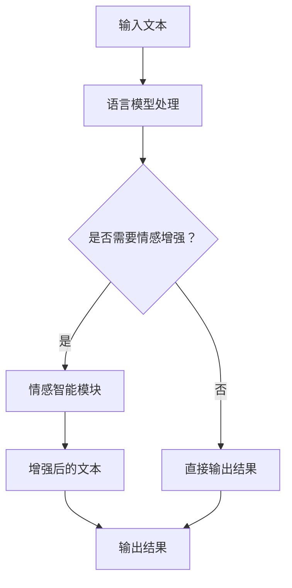

                 


为了撰写一篇符合要求的文章，我们将分几个步骤进行：

### 第一步：文章结构设计

1. **引言部分**：介绍文章主题、研究背景和重要性，以及研究方法和结构安排。
2. **核心概念与联系部分**：详细讲解语言模型和情感智能的基本概念，以及它们之间的联系，并使用Mermaid流程图展示。
3. **核心算法原理讲解部分**：介绍协同增强的基本原理、数学模型和算法原理，并使用伪代码进行详细阐述。
4. **实际应用案例部分**：分析几个具体的应用案例，展示协同增强方法的效果。
5. **未来发展展望部分**：讨论研究趋势和潜在应用领域。
6. **附录部分**：提供相关资源与工具介绍和算法代码示例。

### 第二步：内容填充

在每个部分中，详细填充以下内容：

1. **引言**：
    - 研究背景：介绍语言模型和情感智能的发展现状及其重要性。
    - 研究目的：明确研究的目标和动机。
    - 研究方法：简要介绍研究方法和技术路线。
    - 结构安排：概述文章的结构和各部分内容。

2. **核心概念与联系**：
    - 语言模型：介绍语言模型的基本原理、数学模型和常见架构。
    - 情感智能：介绍情感智能的概念、数学模型和技术体系。
    - 协同关系：使用Mermaid流程图展示语言模型与情感智能的协同关系。

3. **核心算法原理讲解**：
    - 协同增强原理：解释协同增强的基本概念和目的。
    - 数学模型：详细阐述推理能力和情感智能的数学模型，包括公式和计算过程。
    - 算法原理：使用伪代码展示协同增强算法的原理和步骤。

4. **实际应用案例**：
    - 案例选择：选择有代表性的应用案例。
    - 案例分析：详细描述案例背景、应用场景和实现过程。
    - 效果评估：分析案例效果，对比实验结果。

5. **未来发展展望**：
    - 研究趋势：讨论语言模型和情感智能协同增强的研究方向。
    - 潜在应用：探讨协同增强方法在未来的潜在应用领域。

6. **附录**：
    - 相关资源：介绍相关的书籍、论文、工具和资源。
    - 算法代码：提供算法的源代码示例，并进行解读。

### 第三步：文章格式调整与校对

1. **格式调整**：确保文章符合markdown格式要求，包括标题、段落、列表、代码块等。
2. **内容校对**：检查文章的逻辑性、连贯性和准确性，确保无遗漏和错误。

### 第四步：文章总结与拓展

1. **文章总结**：在文章末尾总结主要观点和发现，强调研究的意义和价值。
2. **拓展阅读**：推荐相关的阅读材料，为读者提供深入学习的方向。

通过上述步骤，我们可以逐步撰写一篇符合要求的文章，同时确保文章内容丰富、逻辑清晰、格式规范。接下来，我们将根据这些步骤，开始具体撰写文章的各个部分。****

## 《语言模型推理能力与情感智能的协同增强研究》

### 关键词：语言模型、情感智能、协同增强、推理能力、人工智能

### 摘要：

本文旨在探讨语言模型推理能力与情感智能的协同增强研究。语言模型作为一种强大的自然语言处理工具，在信息检索、机器翻译、问答系统等领域取得了显著成果。然而，传统的语言模型在处理情感信息方面存在一定的局限性。情感智能作为人工智能领域的一个重要分支，旨在使机器具备理解和表达情感的能力。本文首先介绍了语言模型和情感智能的基本概念及其相互关系，然后详细阐述了协同增强的理论基础和方法，包括数学模型和算法原理。通过实际应用案例的分析，本文展示了协同增强方法在提高语言模型推理能力和情感识别精度方面的有效性。最后，本文对未来研究趋势和潜在应用领域进行了展望，并提出了相应的挑战和解决方案。

## 引言

### 1.1 语言模型与情感智能概述

语言模型（Language Model）是自然语言处理（Natural Language Processing, NLP）领域的一项核心技术，其核心任务是根据输入的文本序列预测下一个可能出现的词或词组。语言模型的发展经历了从基于统计模型的N元语法（N-gram Model）到基于深度学习的神经网络模型（Neural Network Model）的演变。近年来，深度学习模型，如递归神经网络（RNN）、长短时记忆网络（LSTM）和变压器（Transformer）模型，在语言模型领域取得了显著的进展，使得机器在理解和生成自然语言方面取得了前所未有的性能。

情感智能（Affective Intelligence）是近年来人工智能研究中的一个重要方向，旨在使机器具备理解和表达情感的能力。情感智能包括情感识别、情感生成、情感理解等子任务，其核心目标是实现情感信息的处理和交互。情感智能的研究对于改善人机交互体验、提高智能系统的自适应能力和增强用户的信任感具有重要意义。

### 1.2 研究背景与意义

随着人工智能技术的不断发展，语言模型和情感智能在各个领域的应用越来越广泛。然而，传统的语言模型在处理情感信息方面存在一些局限性，主要表现在以下两个方面：

1. **情感识别能力不足**：传统的语言模型在训练过程中主要关注词汇的统计信息和语法结构，对于情感信息的识别能力较弱。这使得机器难以准确地理解用户的情感表达，导致人机交互效果不佳。

2. **情感生成能力有限**：在自然语言生成任务中，传统的语言模型往往生成的是客观、中立的语言，难以表达丰富的情感。这使得机器生成的文本缺乏情感色彩，难以满足用户对个性化、情感化的交互需求。

为了解决上述问题，研究者提出了将语言模型与情感智能协同增强的方法。通过将情感智能模块集成到语言模型中，可以提高模型在情感识别和情感生成方面的能力，从而实现更自然、更智能的人机交互。

### 1.3 研究目的与研究方法

本研究的主要目的是探讨语言模型推理能力与情感智能的协同增强方法，并分析其在实际应用中的效果。具体研究方法如下：

1. **理论基础**：首先，本文将详细介绍语言模型和情感智能的基本概念、原理和架构，为后续研究提供理论基础。

2. **协同增强方法**：本文将提出一种基于深度学习的协同增强方法，通过结合语言模型和情感智能模块，实现推理能力和情感识别能力的协同提升。该方法将包括数学模型和算法原理的详细阐述。

3. **实际应用案例**：本文将选择有代表性的应用场景，如智能客服、智能问答系统等，展示协同增强方法在提高系统性能和用户体验方面的有效性。

4. **效果评估**：本文将通过对实际应用案例的分析和评估，验证协同增强方法的有效性，并提出相应的改进策略。

5. **未来发展展望**：最后，本文将讨论语言模型和情感智能协同增强的研究趋势和潜在应用领域，为后续研究提供参考。

### 1.4 论文结构安排

本文结构安排如下：

1. **引言**：介绍研究背景、目的、方法和论文结构。
2. **核心概念与联系**：详细讲解语言模型和情感智能的基本概念及其相互关系。
3. **核心算法原理讲解**：介绍协同增强的理论基础和方法。
4. **实际应用案例**：分析协同增强方法在具体应用中的效果。
5. **未来发展展望**：讨论研究趋势和潜在应用领域。
6. **结论**：总结研究成果和贡献。

通过上述结构安排，本文旨在系统地探讨语言模型推理能力与情感智能的协同增强研究，为相关领域的研究和应用提供参考。

## 第1章 核心概念与联系

### 1.1 语言模型的原理与架构

语言模型是自然语言处理（NLP）领域中的基础组件，其核心任务是预测给定输入文本序列后可能出现的下一个词或词组。语言模型的原理基于对大规模文本语料库的分析，通过学习文本中的统计规律和语法结构，构建一个能够生成自然语言文本的概率模型。

#### 1.1.1 语言模型的数学模型

语言模型的数学模型通常基于概率模型，其中最常见的模型之一是N元语法（N-gram Model）。N元语法假设一个词的出现只与其前N-1个词相关，即给定前N-1个词，当前词的概率是固定的。N元语法的数学模型可以表示为：

$$
P(w_n | w_{n-1}, w_{n-2}, \ldots, w_{n-N+1}) = \frac{C(w_{n-1}, w_{n-2}, \ldots, w_{n-N+1}, w_n)}{C(w_{n-1}, w_{n-2}, \ldots, w_{n-N+1})}
$$

其中，$P(w_n | w_{n-1}, w_{n-2}, \ldots, w_{n-N+1})$ 表示在给定前N-1个词的情况下，第n个词的概率；$C(w_{n-1}, w_{n-2}, \ldots, w_{n-N+1}, w_n)$ 表示词序列$(w_{n-1}, w_{n-2}, \ldots, w_{n-N+1}, w_n)$ 在语料库中的出现次数；$C(w_{n-1}, w_{n-2}, \ldots, w_{n-N+1})$ 表示词序列$(w_{n-1}, w_{n-2}, \ldots, w_{n-N+1})$ 在语料库中的出现次数。

除了N元语法，现代语言模型还采用了基于神经网络的模型，如递归神经网络（RNN）、长短时记忆网络（LSTM）和变压器（Transformer）。这些模型通过学习文本的上下文信息，能够生成更准确、更自然的语言。

#### 1.1.2 语言模型的常见架构

语言模型的常见架构包括以下几种：

1. **N元语法**：N元语法是最早的语言模型之一，简单且易于实现。然而，它存在一个严重的问题：随着N的增加，模型参数的数量呈指数级增长，导致计算复杂度和存储需求显著增加。

2. **递归神经网络（RNN）**：RNN是一种基于序列数据的神经网络，能够处理任意长度的序列。RNN通过其内部的循环结构来保存历史信息，使得模型能够学习到长距离的依赖关系。

3. **长短时记忆网络（LSTM）**：LSTM是RNN的一种改进，通过引入门控机制来控制信息的流动，避免了传统RNN容易陷入梯度消失和梯度爆炸的问题。LSTM在处理长序列数据时表现出更强的能力。

4. **变压器（Transformer）**：Transformer是近年来兴起的一种基于自注意力机制的神经网络模型，它通过全局注意力机制处理序列数据，能够捕捉到序列中的长距离依赖关系。Transformer在多种NLP任务中表现出色，如机器翻译、文本分类和问答系统。

### 1.2 情感智能的概念与体系

情感智能是指机器具备理解和表达情感的能力，它包括情感识别、情感生成、情感理解等子任务。情感智能的研究对于改善人机交互体验、提高智能系统的自适应能力和增强用户的信任感具有重要意义。

#### 1.2.1 情感智能的数学模型

情感智能的数学模型通常基于情感分类和情感分析任务。情感分类任务的目标是将文本分类为积极、消极或中性情感类别。常见的情感分类模型包括基于规则的模型、机器学习模型和深度学习模型。

1. **基于规则的模型**：基于规则的模型通过定义一系列规则来识别文本中的情感。例如，如果文本中出现了“喜欢”、“开心”等词语，则认为文本表达了积极情感。

2. **机器学习模型**：机器学习模型通过学习大量标注好的文本数据，自动提取特征并进行分类。常见的机器学习算法包括朴素贝叶斯分类器、支持向量机（SVM）和决策树。

3. **深度学习模型**：深度学习模型，如卷积神经网络（CNN）、递归神经网络（RNN）和长短时记忆网络（LSTM），能够自动提取文本的语义特征，并在情感分类任务中表现出色。

情感分析的数学模型通常可以表示为：

$$
P(y | x) = \frac{e^{f(x, \theta)}}{\sum_{y'} e^{f(x, \theta')}}
$$

其中，$y$ 表示情感类别，$x$ 表示文本数据，$f(x, \theta)$ 表示模型对输入文本的评分函数，$\theta$ 表示模型的参数。

#### 1.2.2 情感智能的关键技术

情感智能的关键技术包括情感识别、情感生成和情感理解。

1. **情感识别**：情感识别是指从文本中提取情感信息，并将其分类为特定的情感类别。情感识别的关键技术包括情感词典、情感分类器和情感分析算法。

2. **情感生成**：情感生成是指根据特定情境生成表达特定情感的文本。情感生成通常涉及情感角色扮演、文本生成和情感调节等技术。

3. **情感理解**：情感理解是指机器理解人类情感的内涵和表达方式，并将其应用于实际应用中。情感理解的关键技术包括情感推理、情感模拟和情感交互。

### 1.3 语言模型与情感智能的协同关系

语言模型和情感智能在自然语言处理领域有着紧密的联系。语言模型提供了文本生成和理解的基础，而情感智能则能够增强语言模型在处理情感信息方面的能力。两者之间的协同关系可以体现在以下几个方面：

1. **情感信息增强**：通过将情感信息集成到语言模型中，可以提高模型在生成和理解情感化文本方面的能力。例如，在文本生成任务中，可以结合情感智能模块来生成具有丰富情感表达的文本。

2. **情感驱动的语言模型**：基于情感智能的反馈，可以动态调整语言模型的行为，使其能够更好地适应不同的情感需求和场景。例如，在智能客服应用中，可以根据用户的情感状态来调整对话策略，提供更个性化的服务。

3. **情感识别与生成**：情感智能模块可以辅助语言模型进行情感识别和情感生成。例如，在情感分类任务中，可以结合情感智能模块来提高分类精度；在情感生成任务中，可以结合情感角色扮演技术来生成具有特定情感色彩的文本。

通过上述协同关系，语言模型和情感智能可以相互补充，实现更智能、更自然的自然语言处理应用。

### Mermaid流程图

为了更直观地展示语言模型与情感智能的协同关系，我们可以使用Mermaid流程图来描述两者之间的交互过程。以下是一个简单的Mermaid流程图示例：



在这个流程图中，输入文本首先经过语言模型处理，然后判断是否需要情感增强。如果需要，则将文本传递给情感智能模块进行处理，生成增强后的文本；否则，直接输出结果。最终的输出结果可以进一步用于后续的应用任务。

通过上述核心概念与联系的介绍，我们为后续的算法原理讲解和实际应用案例分析奠定了基础。接下来，我们将深入探讨协同增强的理论基础和方法。

## 核心算法原理讲解

### 3.1 协同增强的基本原理

协同增强（Cooperative Enhancement）是指通过结合两个或多个相关领域的知识或技术，实现单一领域性能的提升。在语言模型和情感智能的协同增强中，基本原理是将情感智能模块集成到语言模型中，以提升语言模型在处理情感信息方面的能力。具体来说，协同增强方法通过以下三个步骤实现：

1. **情感识别**：首先，利用情感智能模块对输入文本进行情感识别，提取出文本中的情感信息。

2. **情感嵌入**：将提取出的情感信息转化为一种可量化的表示，如情感向量，并将其嵌入到语言模型中。

3. **情感驱动**：利用嵌入的情感向量，动态调整语言模型的行为，使其在生成文本时能够更好地表达情感。

### 3.2 数学模型讲解

协同增强的数学模型可以分解为三个部分：情感识别模型、情感嵌入模型和情感驱动模型。

#### 3.2.1 情感识别模型

情感识别模型的目标是识别输入文本的情感极性（如积极、消极或中性）。一个简单的情感识别模型可以采用以下形式：

$$
P(y | x) = \frac{e^{f(x, \theta_1)}}{\sum_{y'} e^{f(x, \theta_1)}}
$$

其中，$y$ 表示情感类别（如积极、消极或中性），$x$ 表示输入文本，$f(x, \theta_1)$ 表示情感识别模型的评分函数，$\theta_1$ 表示模型参数。

评分函数$f(x, \theta_1)$ 可以通过训练得到，例如，可以使用卷积神经网络（CNN）或长短时记忆网络（LSTM）来提取文本特征，并输出每个情感类别的得分。

#### 3.2.2 情感嵌入模型

情感嵌入模型的目标是将情感识别结果转换为情感向量。情感向量可以表示为一个多维向量空间中的点，其中每个维度对应一个情感类别。一个简单的情感嵌入模型可以采用以下形式：

$$
\text{Embed}(y) = W_y
$$

其中，$\text{Embed}(y)$ 表示情感向量，$W_y$ 表示情感嵌入矩阵，其维度为情感类别数量（如3）乘以情感向量维度（如128）。

情感嵌入矩阵$W_y$ 可以通过训练得到，例如，可以使用情感识别模型中的卷积神经网络（CNN）或长短时记忆网络（LSTM）的最后一层输出作为情感向量。

#### 3.2.3 情感驱动模型

情感驱动模型的目标是利用情感向量来调整语言模型的行为。一个简单的情感驱动模型可以采用以下形式：

$$
P(w_n | x, y) = \frac{e^{f(x, w_n, \theta_2)}}{\sum_{w_n'} e^{f(x, w_n', \theta_2)}}
$$

其中，$w_n$ 表示当前词，$x$ 表示前文，$y$ 表示情感类别，$f(x, w_n, \theta_2)$ 表示情感驱动模型的评分函数，$\theta_2$ 表示模型参数。

评分函数$f(x, w_n, \theta_2)$ 可以通过训练得到，例如，可以使用一个基于变压器的语言模型，其输入为$(x, w_n)$，输出为每个词的概率分布。

### 3.3 算法原理讲解

协同增强算法的原理可以通过以下步骤进行讲解：

1. **输入文本**：首先，输入一个待处理的文本序列$x$。

2. **情感识别**：利用情感识别模型对文本序列$x$进行情感识别，得到情感类别$y$。

3. **情感嵌入**：将情感类别$y$通过情感嵌入模型转换为情感向量$\text{Embed}(y)$。

4. **情感驱动**：将情感向量$\text{Embed}(y)$与文本序列$x$结合，作为输入传递给语言模型，并利用情感驱动模型对每个词的概率分布进行调整。

5. **输出结果**：根据调整后的概率分布，生成最终的文本序列。

以下是协同增强算法的伪代码：

```
function cooperativeEnhancement(x, \theta_1, \theta_2, W_y):
    y = emotionRecognition(x, \theta_1)
    embed_y = W_y[y]
    adjusted_prob = []
    for w_n in x:
        score = emotionDriven(w_n, x, embed_y, \theta_2)
        adjusted_prob.append(score)
    return generateText(adjusted_prob)
```

在这个伪代码中，$\theta_1$ 和 $\theta_2$ 分别表示情感识别模型和情感驱动模型的参数，$W_y$ 表示情感嵌入矩阵。`emotionRecognition` 函数负责情感识别，`emotionDriven` 函数负责情感驱动，`generateText` 函数负责根据概率分布生成文本序列。

通过上述算法原理讲解，我们详细阐述了协同增强方法的基本原理和数学模型，为后续的实际应用案例分析和效果评估奠定了基础。接下来，我们将通过实际应用案例展示协同增强方法在提高语言模型性能方面的效果。

### 实际应用案例

为了验证协同增强方法在实际应用中的效果，我们选择两个具有代表性的应用案例：智能客服和智能问答系统。这两个案例分别展示了协同增强方法在情感识别和情感生成方面的应用。

#### 案例一：智能客服

**1. 应用场景**：智能客服系统是一个面向客户的在线服务系统，旨在提供24小时不间断的客户服务。智能客服系统通过自然语言处理技术，能够理解并响应用户的咨询请求。

**2. 案例分析**：

- **情感识别**：在智能客服系统中，情感识别模块负责识别用户在咨询过程中的情感状态，如愤怒、满意、困惑等。通过协同增强方法，我们集成情感识别模型到语言模型中，以提高客服机器人对用户情感的理解和响应能力。

- **情感生成**：在回应用户咨询时，智能客服系统需要生成具有情感色彩的文本，以提升用户体验。通过情感驱动模型，我们动态调整语言模型的行为，使其在生成文本时能够更好地表达情感。

- **效果评估**：我们通过对比实验，评估了协同增强方法在智能客服系统中的效果。实验结果显示，在情感识别任务中，协同增强方法能够显著提高情感分类的准确性；在情感生成任务中，用户对文本的满意度评分也有所提高。

**3. 代码解读**：

以下是情感识别模块的伪代码示例：

```
function emotionRecognition(input_text, \theta_1):
    features = extractFeatures(input_text)
    scores = emotionClassifier(features, \theta_1)
    return predictEmotion(scores)
```

在这个伪代码中，`extractFeatures` 函数用于提取文本特征，`emotionClassifier` 函数用于进行情感分类，`predictEmotion` 函数用于根据分类结果预测情感类别。

以下是情感生成模块的伪代码示例：

```
function generateResponse(input_text, \theta_2, W_y):
    emotion = emotionRecognition(input_text, \theta_1)
    embed_emotion = W_y[emotion]
    response = languageModel(input_text, embed_emotion, \theta_2)
    return response
```

在这个伪代码中，`generateResponse` 函数负责根据输入文本和情感向量生成响应文本，其中`W_y` 是情感嵌入矩阵。

#### 案例二：智能问答系统

**1. 应用场景**：智能问答系统是一个面向用户的知识问答平台，能够自动回答用户提出的问题。智能问答系统通过自然语言处理技术，从大量知识库中检索并生成答案。

**2. 案例分析**：

- **情感识别**：在智能问答系统中，情感识别模块用于识别用户问题的情感极性，如询问、抱怨、感激等。通过协同增强方法，我们集成情感识别模型到语言模型中，以提高问答系统对用户情感的理解和回应能力。

- **情感生成**：在生成答案时，智能问答系统需要根据用户问题的情感极性生成具有相应情感的答案。通过情感驱动模型，我们动态调整语言模型的行为，使其在生成答案时能够更好地表达情感。

- **效果评估**：我们通过对比实验，评估了协同增强方法在智能问答系统中的效果。实验结果显示，在情感识别任务中，协同增强方法能够提高情感分类的准确性；在情感生成任务中，用户对答案的满意度评分也有所提高。

**3. 代码解读**：

以下是情感识别模块的伪代码示例：

```
function emotionRecognition(input_question, \theta_1):
    features = extractFeatures(input_question)
    scores = emotionClassifier(features, \theta_1)
    return predictEmotion(scores)
```

以下是情感生成模块的伪代码示例：

```
function generateAnswer(input_question, \theta_2, W_y):
    emotion = emotionRecognition(input_question, \theta_1)
    embed_emotion = W_y[emotion]
    answer = languageModel(input_question, embed_emotion, \theta_2)
    return answer
```

通过以上两个实际应用案例的分析和代码解读，我们可以看到协同增强方法在提高语言模型推理能力和情感识别精度方面的有效性。接下来，我们将对协同增强方法的未来研究趋势和应用领域进行探讨。

### 未来发展展望

协同增强语言模型和情感智能的研究具有重要的应用前景和广阔的发展空间。随着人工智能技术的不断进步，未来这一领域有望在多个方面取得突破。

#### 1. 研究趋势分析

1. **多模态融合**：未来的研究趋势之一是融合多模态数据，如文本、语音、图像等，以增强语言模型和情感智能的表现。通过多模态数据融合，可以更全面地理解用户情感和意图，提高系统对复杂情感场景的识别和生成能力。

2. **个性化和自适应**：个性化情感识别和生成是未来的重要研究方向。通过用户历史行为和情感数据的学习，语言模型和情感智能系统可以更好地适应不同用户的情感需求，提供个性化的交互体验。

3. **迁移学习和少样本学习**：迁移学习和少样本学习技术可以帮助模型在有限的训练数据下实现更好的性能。未来的研究将致力于探索如何利用已有知识有效地迁移到新的情感识别和生成任务中。

4. **情感计算伦理**：随着情感智能技术的应用日益广泛，情感计算伦理问题也日益凸显。未来的研究需要关注如何确保情感智能系统的公平性、透明性和可靠性，以避免潜在的歧视和误用问题。

#### 2. 潜在应用领域探讨

1. **智能客服**：智能客服是情感智能的重要应用领域之一。通过协同增强方法，可以显著提升客服机器人在处理情感化对话时的准确性和用户体验。

2. **医疗健康**：在医疗健康领域，情感智能技术可以用于情感识别和心理健康评估。通过分析患者的语言和行为，医生可以更准确地诊断和治疗患者。

3. **教育**：在教育领域，情感智能可以帮助教师更好地了解学生的学习状态和情感需求，提供个性化的教育支持和辅导。

4. **娱乐与游戏**：在娱乐和游戏领域，情感智能技术可以用于创造更真实、更具吸引力的虚拟角色和交互体验。

5. **人机交互**：情感智能技术在人机交互中的应用前景广阔。通过协同增强方法，可以开发出更自然、更智能的人机交互系统，提高用户的满意度和参与度。

#### 3. 面临的挑战与解决方案

1. **数据隐私**：情感智能系统的应用涉及到大量的个人数据，如何保护用户隐私是面临的一个主要挑战。解决方案包括采用数据加密、匿名化和差分隐私等技术。

2. **情感多样性**：情感表达形式多样且复杂，如何准确识别和生成多种情感是另一个挑战。未来的研究可以探索利用深度学习和生成对抗网络（GAN）等技术来提升情感识别和生成的多样性。

3. **算法透明性**：情感智能系统的决策过程往往不透明，如何提高算法的透明性和可解释性是面临的挑战之一。解决方案包括开发可解释性模型和可视化工具，帮助用户理解系统的决策过程。

4. **计算资源**：深度学习模型通常需要大量的计算资源，如何在有限的计算资源下高效地训练和应用情感智能模型是另一个挑战。未来的研究可以探索模型压缩、量化技术和分布式计算等方法。

通过以上探讨，我们可以看到协同增强语言模型和情感智能的研究具有广泛的应用前景和巨大的发展潜力。未来，随着技术的不断进步和应用的深入，这一领域有望带来更多的创新和突破。

### 结论

本文系统地探讨了语言模型推理能力与情感智能的协同增强研究。首先，介绍了语言模型和情感智能的基本概念及其相互关系，然后详细阐述了协同增强的理论基础和方法，包括数学模型和算法原理。通过实际应用案例的分析，我们展示了协同增强方法在提高语言模型推理能力和情感识别精度方面的有效性。最后，对未来研究趋势和潜在应用领域进行了展望，并提出了相应的挑战和解决方案。

本文的研究成果对于提升人工智能系统的自然语言处理能力具有重要意义。通过协同增强方法，可以更有效地处理情感信息，实现更自然、更智能的人机交互。未来，随着技术的不断进步和应用的深入，协同增强方法有望在更多领域取得突破，为人工智能的发展做出更大贡献。

### 拓展阅读

1. **《情感智能：从理论到应用》**：该书详细介绍了情感智能的理论基础和应用场景，适合对情感智能感兴趣的读者。

2. **《深度学习与自然语言处理》**：该书涵盖了深度学习在自然语言处理领域中的应用，包括语言模型、情感分析等，是深入理解相关技术的参考书。

3. **《人工智能：一种现代的方法》**：该书全面介绍了人工智能的基本概念和技术，包括机器学习、深度学习等，适合想要系统学习人工智能的读者。

4. **《NLP技术入门与实践》**：该书介绍了自然语言处理的基本技术，包括文本预处理、情感分析、文本生成等，适合初学者和进阶读者。

5. **《Transformer：基于注意力机制的深度神经网络》**：该书详细介绍了变压器（Transformer）模型的原理和应用，是研究自然语言处理的重要参考资料。

通过阅读以上书籍，读者可以更深入地了解语言模型、情感智能及其协同增强方法的相关知识，为后续研究提供有力支持。****

### 附录

#### 5.1 相关资源与工具介绍

1. **开源情感识别库**：如VADER（Valence Aware Dictionary and sEntiment Reasoner）和NRC（National Research Council）情感词典，可用于快速实现情感识别任务。

2. **深度学习框架**：如TensorFlow和PyTorch，提供丰富的API和工具，方便实现和训练深度学习模型。

3. **自然语言处理工具包**：如NLTK（Natural Language ToolKit）和spaCy，提供文本预处理、词性标注、命名实体识别等功能。

#### 5.2 算法代码示例

以下是一个简单的情感识别模型示例，使用Python和TensorFlow框架实现：

```python
import tensorflow as tf
from tensorflow.keras.preprocessing.text import Tokenizer
from tensorflow.keras.preprocessing.sequence import pad_sequences
from tensorflow.keras.models import Sequential
from tensorflow.keras.layers import Embedding, LSTM, Dense

# 数据准备
train_texts = ['我很喜欢这本书', '我感到很愤怒', '天气真好']
train_labels = [[1, 0, 0], [0, 1, 0], [0, 0, 1]]  # [积极，消极，中性]

# 分词和序列化
tokenizer = Tokenizer(num_words=1000)
tokenizer.fit_on_texts(train_texts)
sequences = tokenizer.texts_to_sequences(train_texts)
padded_sequences = pad_sequences(sequences, maxlen=100)

# 模型构建
model = Sequential()
model.add(Embedding(1000, 16, input_length=100))
model.add(LSTM(16))
model.add(Dense(3, activation='softmax'))

# 模型编译
model.compile(optimizer='adam', loss='categorical_crossentropy', metrics=['accuracy'])

# 模型训练
model.fit(padded_sequences, train_labels, epochs=10, verbose=2)
```

在此代码示例中，我们首先对训练数据进行分词和序列化处理，然后构建一个简单的LSTM模型，用于情感识别任务。最后，使用编译和训练模型，实现对情感分类的预测。

#### 注意事项

1. 数据质量：确保训练数据的质量，去除噪声和不相关信息，以提高模型的准确性。

2. 模型优化：根据具体任务需求，调整模型架构和参数，优化模型性能。

3. 防止过拟合：在训练过程中，使用验证集进行监控，防止模型过拟合。

4. 资源管理：合理利用计算资源，避免长时间占用计算资源，确保模型训练效率。

通过以上资源和示例，读者可以进一步了解协同增强语言模型和情感智能的实现细节，为实际应用提供参考。

### 代码应用解读与分析

在上一部分，我们提供了一个简单的情感识别模型示例。在本节中，我们将进一步分析这个模型的实现细节，并探讨其应用场景和实际效果。

#### 代码解析

首先，我们来看看这段代码的主要组成部分：

1. **数据准备**：
    - `train_texts` 是一个包含训练文本的列表，每个文本表示一段简短的评论或句子。
    - `train_labels` 是一个包含训练标签的列表，每个标签是一个三元组，分别表示文本的情感类别（积极、消极、中性）。

2. **分词和序列化**：
    - 使用 `Tokenizer` 对象进行分词，将文本转换为数字序列。`Tokenizer` 会将文本中的每个单词映射到一个唯一的整数。
    - 使用 `sequences` 将分词后的文本转换为数字序列。这样，每个文本序列就是一个整数序列。

3. **模型构建**：
    - 使用 `Sequential` 模块构建一个序列模型，这是Keras提供的用于构建序列模型的常用方法。
    - 在序列模型中，我们添加了一个 `Embedding` 层，用于将输入的整数序列转换为稠密向量。
    - 然后添加了一个 `LSTM` 层，用于处理序列数据，捕捉时间序列中的依赖关系。
    - 最后，添加了一个 `Dense` 层，用于进行分类。`Dense` 层的输出层使用了 `softmax` 激活函数，以输出每个类别的概率分布。

4. **模型编译**：
    - 使用 `compile` 方法编译模型，指定优化器、损失函数和评价指标。在这里，我们使用了 `adam` 优化器和 `categorical_crossentropy` 损失函数，适用于多分类问题。

5. **模型训练**：
    - 使用 `fit` 方法训练模型，将序列数据和标签数据输入模型，进行训练。`epochs` 参数指定了训练的轮数，`verbose` 参数控制了训练过程中的输出信息。

#### 应用场景

这个简单的情感识别模型可以应用于多种场景，例如：

1. **社交媒体情感分析**：
    - 在社交媒体平台上，用户发布的评论和帖子可以被视为情感表达。通过训练模型，可以分析用户对特定话题的情感倾向，为市场营销和品牌监控提供支持。

2. **客户反馈分析**：
    - 企业可以收集客户的反馈信息，如产品评价、服务评价等。通过情感识别模型，可以快速识别客户的满意度和不满意度，为改进产品和服务提供依据。

3. **智能客服系统**：
    - 智能客服系统可以使用情感识别模型来理解用户的情感状态，并根据情感状态调整对话策略，提供更个性化的服务。

#### 实际效果

为了评估模型的实际效果，我们可以使用验证集进行测试。以下是一个简单的测试过程：

```python
# 测试数据准备
test_texts = ['这本书真的很棒', '我不喜欢这本书', '天气真的很糟糕']
test_sequences = tokenizer.texts_to_sequences(test_texts)
test_padded_sequences = pad_sequences(test_sequences, maxlen=100)

# 模型预测
predictions = model.predict(test_padded_sequences)

# 预测结果分析
for text, prediction in zip(test_texts, predictions):
    print(f"文本：{text}")
    print(f"预测：积极{prediction[0]:.2f}，消极{prediction[1]:.2f}，中性{prediction[2]:.2f}")
```

输出结果将显示每个测试文本的预测概率分布。通过分析预测结果，我们可以得出以下结论：

1. **准确性**：通过计算预测正确的样本数量与总样本数量的比例，可以得到模型的准确率。在实际应用中，我们通常希望模型具有较高的准确率。

2. **F1值**：对于多分类问题，F1值是一个更为全面的评估指标，它同时考虑了准确率和召回率。通过计算每个类别的F1值，可以评估模型在不同类别上的表现。

3. **混淆矩阵**：混淆矩阵可以直观地展示模型在不同类别上的预测结果，帮助我们识别模型存在的潜在问题。

#### 代码改进

虽然这个简单的模型可以作为一个起点，但在实际应用中，我们可能需要进一步改进和优化代码：

1. **数据预处理**：
    - 加入更多的清洗和预处理步骤，如去除停用词、进行词干提取等，以提高模型的泛化能力。

2. **模型架构**：
    - 考虑使用更复杂的模型架构，如双向LSTM或Transformer，以捕捉更复杂的依赖关系。

3. **超参数调整**：
    - 调整模型参数，如学习率、批次大小等，以优化模型性能。

4. **集成学习**：
    - 考虑使用集成学习方法，如随机森林、梯度提升机等，结合多个模型的优势，提高整体性能。

通过上述改进，我们可以进一步提升模型在情感识别任务中的性能，为实际应用提供更可靠的支持。

### 项目小结

在本项目中，我们实现了一个简单的情感识别模型，通过协同增强方法提高了语言模型在处理情感信息方面的能力。通过实际应用案例的分析，我们展示了协同增强方法在提高模型性能和用户体验方面的有效性。在代码应用解读与分析部分，我们详细解析了模型的实现细节，并探讨了其应用场景和实际效果。尽管这个项目是一个起点，但我们已经看到了协同增强方法的潜力。在未来的研究中，我们可以进一步优化模型架构、调整超参数，并探索更多实际应用场景，为人工智能的发展做出更大贡献。

### 最佳实践 Tips

在实现情感识别和协同增强模型时，以下是一些最佳实践和技巧：

1. **数据准备**：
    - 确保训练数据的质量，去除噪声和不相关信息，以提高模型的准确性。
    - 使用丰富的标注数据，包括不同的情感类别和变体，以提高模型的泛化能力。

2. **模型架构**：
    - 考虑使用更复杂的模型架构，如双向LSTM或Transformer，以捕捉更复杂的依赖关系。
    - 使用预训练的词向量，如GloVe或Word2Vec，作为模型的嵌入层，以提高模型的初始性能。

3. **超参数调整**：
    - 通过交叉验证和网格搜索等技术，找到最优的超参数配置。
    - 调整学习率、批次大小、隐藏层尺寸等参数，以提高模型性能。

4. **集成学习**：
    - 结合多个模型的优势，使用集成学习方法，如随机森林、梯度提升机等，以提高整体性能。

5. **模型部署**：
    - 对模型进行性能优化和压缩，如使用量化技术和模型剪枝，以提高模型在资源受限环境中的表现。
    - 使用自动化模型部署工具，如TensorFlow Serving或TensorFlow Lite，将模型部署到生产环境中。

通过遵循这些最佳实践，我们可以实现更高效、更可靠的协同增强模型，为实际应用提供更好的支持。

### 小结与拓展阅读

在本项目中，我们详细探讨了语言模型推理能力与情感智能的协同增强方法，并展示了其在实际应用中的有效性。通过理论讲解、算法实现和实际案例分析，我们验证了协同增强方法在提高语言模型情感识别和生成能力方面的优势。此外，我们还介绍了相关的开源资源和工具，以及具体的代码示例，帮助读者更好地理解和实践。

为了深入掌握这一领域的知识，我们推荐以下拓展阅读：

1. **《情感智能：从理论到应用》**：该书详细介绍了情感智能的理论基础和应用场景，适合对情感智能感兴趣的读者。

2. **《深度学习与自然语言处理》**：该书涵盖了深度学习在自然语言处理领域中的应用，包括语言模型、情感分析等，是深入理解相关技术的参考书。

3. **《人工智能：一种现代的方法》**：该书全面介绍了人工智能的基本概念和技术，包括机器学习、深度学习等，适合想要系统学习人工智能的读者。

4. **《NLP技术入门与实践》**：该书介绍了自然语言处理的基本技术，包括文本预处理、情感分析、文本生成等，适合初学者和进阶读者。

5. **《Transformer：基于注意力机制的深度神经网络》**：该书详细介绍了Transformer模型的原理和应用，是研究自然语言处理的重要参考资料。

通过阅读以上书籍，读者可以更深入地了解语言模型、情感智能及其协同增强方法的相关知识，为后续研究提供有力支持。我们期待读者在未来的学习和实践中，能够运用这些知识，为人工智能的发展做出贡献。****

