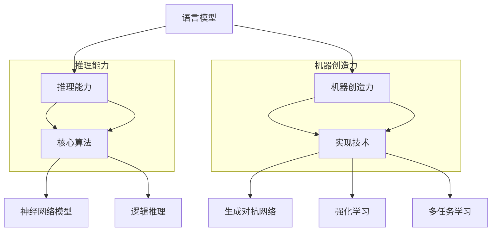
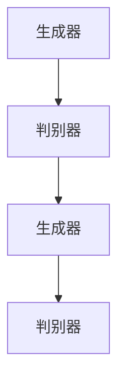
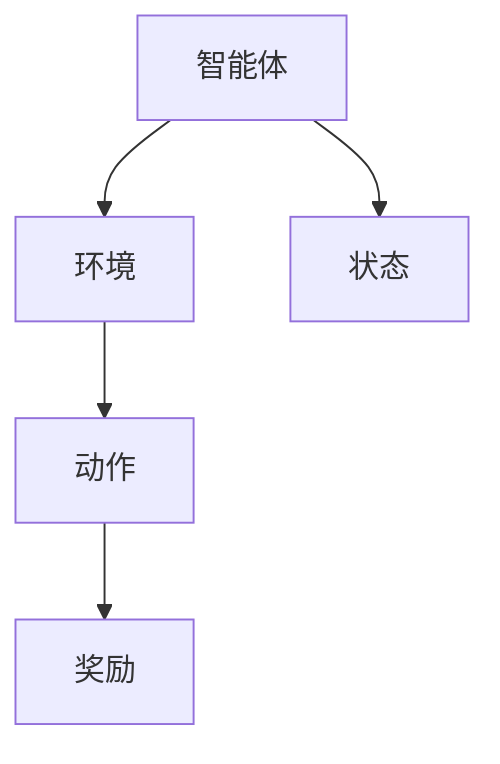
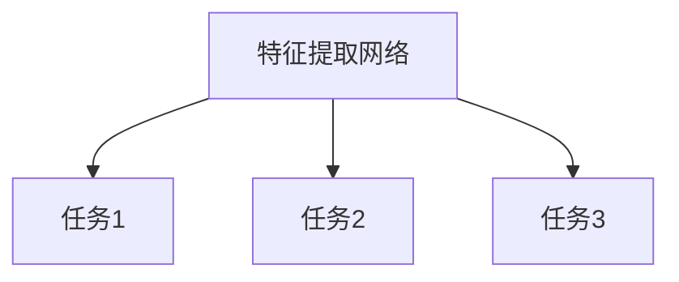
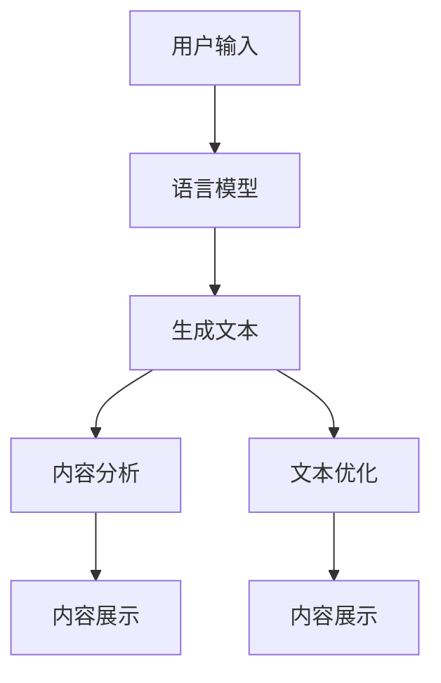

                 

# 《语言模型推理能力与机器创造力的协同进化》

> 关键词：语言模型、推理能力、机器创造力、协同进化、人工智能

> 摘要：本文深入探讨了语言模型推理能力与机器创造力之间的关系，以及它们如何通过协同进化实现共同进步。文章首先介绍了语言模型、推理能力和机器创造力的基本概念，随后详细分析了它们之间的联系。接着，文章阐述了语言模型推理能力的原理和算法，以及机器创造力的实现技术。在此基础上，文章提出了协同进化机制，并通过实际项目展示了其应用效果。最后，文章总结了全文内容，并对未来的发展趋势进行了展望。

## 引言与背景

随着人工智能技术的不断发展，语言模型（Language Model，LM）已成为自然语言处理（Natural Language Processing，NLP）领域的重要工具。语言模型旨在模拟人类语言的表达和理解能力，通过预测下一个词或句子来生成连贯的文本。然而，单纯的语言生成能力并不能满足实际应用的需求，推理能力（Reasoning Ability）逐渐成为语言模型的重要补充。

### 语言模型概述

语言模型是一种概率模型，它通过统计语言数据来预测下一个词或句子。最早的语言模型是基于N-gram模型的，后来随着深度学习的发展，神经网络语言模型（如循环神经网络（Recurrent Neural Network，RNN）、长短时记忆网络（Long Short-Term Memory，LSTM）和Transformer等）得到了广泛应用。

#### 语言模型的发展历程

- **N-gram模型**：基于相邻词的统计特性进行预测，计算当前词序列的概率。
- **循环神经网络（RNN）**：能够处理序列数据，但存在梯度消失和梯度爆炸问题。
- **长短时记忆网络（LSTM）**：通过记忆单元解决RNN的梯度消失问题，但计算复杂度高。
- **Transformer模型**：基于自注意力机制，能够并行处理序列数据，性能优于LSTM。

#### 语言模型的应用领域

语言模型在多个领域都有广泛应用，如机器翻译、文本生成、问答系统、对话系统等。

### 推理能力与机器创造力

推理能力是指从已知信息推断未知信息的能力。在语言模型中，推理能力使得模型能够理解上下文、推断逻辑关系和生成符合逻辑的文本。

#### 推理能力的定义与分类

- **基于规则的推理**：通过预定义的规则进行推理，如逻辑推理、模糊推理等。
- **基于数据的推理**：通过学习大量数据中的隐含规则进行推理，如统计推理、基于知识的推理等。

#### 机器创造力的定义与特点

机器创造力是指机器在特定领域内产生新颖且有价值的想法或解决方案的能力。与人类创造力类似，机器创造力具有以下特点：

- **创新性**：能够产生新颖的想法。
- **实用性**：想法或解决方案具有实际应用价值。
- **自主性**：不需要人类直接干预，能够自主产生想法。

### 推理能力与机器创造力的关系

推理能力与机器创造力之间存在密切的联系。推理能力是机器创造力实现的基础，而机器创造力则能够增强语言模型的推理能力，使其能够更好地理解上下文和生成合理的文本。

#### 推理能力与机器创造力的协同进化

协同进化是指两个或多个系统相互影响，共同进化的过程。在语言模型和机器创造力之间，协同进化可以使得它们相互促进，共同提高。

- **语言模型促进机器创造力**：通过提供丰富的语言数据，使得机器创造力能够更好地理解人类语言。
- **机器创造力促进语言模型**：通过产生新颖的文本和想法，使得语言模型能够不断学习和优化，提高其推理能力。

## 核心概念与联系

在深入探讨语言模型推理能力与机器创造力的协同进化之前，有必要先明确这两个核心概念的定义及其相互关系。

### 语言模型原理

语言模型是一种用于预测单词或句子概率的概率模型。其核心思想是通过分析大量的语言数据，学习语言的结构和规律，从而能够在未知输入的情况下预测下一个词或句子的可能性。

#### 数学模型

在语言模型中，常用的数学模型包括N-gram模型、神经网络模型等。

- **N-gram模型**：假设下一个词或句子的概率只与前面N个词或句子的状态有关，其概率计算公式如下：

  $$ P(w_n | w_{n-1}, w_{n-2}, ..., w_1) = \frac{P(w_n, w_{n-1}, ..., w_1)}{P(w_{n-1}, w_{n-2}, ..., w_1)} $$
  
  其中，$w_n$表示下一个词或句子，$w_{n-1}, w_{n-2}, ..., w_1$表示前面的N-1个词或句子。

- **神经网络模型**：神经网络模型，如循环神经网络（RNN）、长短时记忆网络（LSTM）和Transformer等，通过学习大量的语言数据，能够捕捉语言序列中的复杂结构，从而提高预测准确性。

#### 算法

语言模型常用的算法包括以下几种：

- **最大似然估计（Maximum Likelihood Estimation，MLE）**：通过最大化训练数据中的概率来估计模型参数。
- **反向传播（Backpropagation）**：用于训练神经网络模型，通过反向传播误差信息，更新模型参数。
- **注意力机制（Attention Mechanism）**：用于捕捉长序列中的依赖关系，如Transformer模型中的自注意力机制。

### 推理能力原理

推理能力是指从已知信息推断未知信息的能力。在自然语言处理领域，推理能力尤为重要，因为它能够帮助语言模型理解上下文、推断逻辑关系和生成符合逻辑的文本。

#### 推理能力的定义与类型

- **基于规则的推理**：通过预定义的规则进行推理，如逻辑推理、模糊推理等。这类推理方法通常具有较高的解释性，但难以处理复杂的情况。
- **基于数据的推理**：通过学习大量数据中的隐含规则进行推理，如统计推理、基于知识的推理等。这类推理方法通常具有较好的泛化能力，但可能缺乏解释性。

#### 推理能力的关键算法

- **逻辑推理**：基于形式逻辑的推理方法，如命题逻辑、谓词逻辑等。逻辑推理具有高度的严谨性和解释性，但处理能力有限。
- **统计推理**：基于概率统计的推理方法，如贝叶斯推理、最大似然估计等。统计推理能够处理大规模的数据，但可能面临数据质量和噪声问题。
- **基于知识的推理**：基于知识的推理方法，如基于案例的推理、知识图谱推理等。这类方法能够利用外部知识库进行推理，但需要维护和管理知识库。

### 机器创造力原理

机器创造力是指机器在特定领域内产生新颖且有价值的想法或解决方案的能力。与人类创造力类似，机器创造力具有创新性、实用性和自主性。

#### 机器创造力的定义与分类

- **创新性**：机器创造力能够产生新颖的想法，不同于已有的解决方案。
- **实用性**：机器创造力的结果具有实际应用价值，能够解决实际问题。
- **自主性**：机器创造力不需要人类直接干预，能够自主产生想法。

#### 机器创造力的实现技术

- **生成对抗网络（GAN）**：GAN由生成器和判别器组成，通过两个网络的对抗训练，生成器能够产生逼真的数据。
- **强化学习**：强化学习通过奖励机制，使机器在学习过程中不断优化策略，从而实现目标。
- **多任务学习**：多任务学习通过同时学习多个任务，提高模型在多个领域的泛化能力。

### 核心概念之间的关系架构

为了更好地理解语言模型推理能力与机器创造力之间的联系，我们可以使用Mermaid流程图来展示它们之间的关系架构：



### 语言模型、推理能力和机器创造力的协同进化

在协同进化机制下，语言模型、推理能力和机器创造力相互影响，共同推动人工智能的发展。具体来说：

- **语言模型促进机器创造力**：通过提供丰富的语言数据，使得机器创造力能够更好地理解人类语言，从而产生更有价值的想法。
- **机器创造力促进语言模型**：通过产生新颖的文本和想法，使得语言模型能够不断学习和优化，提高其推理能力。
- **推理能力增强协同进化**：推理能力作为桥梁，连接语言模型和机器创造力，使得它们能够更好地协同进化，共同提高。

## 语言模型推理能力

语言模型推理能力是指语言模型在处理自然语言时，能够根据上下文和已有知识推断出未知信息的能力。在人工智能领域，推理能力被认为是语言模型从生成式模型向认知式模型转变的关键。下面，我们将详细探讨语言模型推理能力的原理和算法。

### 推理能力的定义与分类

推理能力是指从已知信息推断未知信息的能力。在语言模型中，推理能力体现在以下几个方面：

- **上下文理解**：语言模型能够根据上下文信息，理解词语和句子的含义，生成合理的文本。
- **逻辑推断**：语言模型能够根据已知的事实和逻辑规则，推断出新的结论。
- **知识推理**：语言模型能够利用外部知识库，进行基于知识的推理，提高推理的准确性。

#### 推理能力的分类

根据推理的方式，可以将推理能力分为以下几种：

- **基于规则的推理**：通过预定义的规则进行推理，如逻辑推理、模糊推理等。这类推理方法通常具有较高的解释性，但难以处理复杂的情况。
- **基于数据的推理**：通过学习大量数据中的隐含规则进行推理，如统计推理、基于知识的推理等。这类推理方法通常具有较好的泛化能力，但可能缺乏解释性。
- **混合推理**：结合基于规则和基于数据的推理方法，以平衡解释性和泛化能力。

### 推理能力的关键算法

为了实现语言模型的推理能力，常用的算法包括逻辑推理、统计推理和基于知识的推理。下面，我们将分别介绍这些算法的原理和伪代码。

#### 逻辑推理

逻辑推理是一种基于形式逻辑的推理方法，包括命题逻辑和谓词逻辑。以下是命题逻辑推理的伪代码：

```python
def propositional_logic推理(前提，结论):
    # 前提是一个逻辑表达式，结论也是一个逻辑表达式
    if 前提 == 结论:
        return True
    else:
        return False
```

谓词逻辑推理的伪代码较为复杂，但基本思想是通过对谓词进行替换和组合，进行推理。

#### 统计推理

统计推理是一种基于概率统计的推理方法，常见的算法包括贝叶斯推理和最大似然估计。以下是贝叶斯推理的伪代码：

```python
def bayesian推理(先验概率，观察数据，后验概率):
    # 先验概率是对于某一假设的概率，观察数据是实际观察到的结果
    likelihood = 概率(观察数据 | 先验概率)
    prior = 先验概率
    posterior = likelihood * prior / evidence
    return 后验概率
```

最大似然估计的伪代码如下：

```python
def maximum_likelihood估计(数据集，参数):
    # 数据集是观察到的数据，参数是需要估计的参数
    likelihood = 1
    for data in 数据集:
        likelihood *= 概率(data | 参数)
    return 参数 that maximizes likelihood
```

#### 基于知识的推理

基于知识的推理是通过利用外部知识库，进行推理的方法。常见的算法包括基于案例的推理和知识图谱推理。以下是基于案例推理的伪代码：

```python
def case_base推理(新案例，案例库，解决方案):
    # 新案例是需要推理的案例，案例库是存储已有案例的知识库
    for case in 案例库:
        if case与new_case相似:
            return case的解决方案
    return "无法找到相似案例"
```

知识图谱推理的伪代码如下：

```python
def knowledge_graph推理(查询，知识图谱，答案):
    # 查询是用户输入的问题，知识图谱是存储知识的图结构，答案是需要推理的答案
    paths = 寻找路径(查询，知识图谱)
    for path in paths:
        if path符合规则:
            return 答案
    return "无法找到答案"
```

### 推理能力在语言模型中的应用

在语言模型中，推理能力主要体现在以下几个方面：

- **文本生成**：语言模型能够根据上下文信息，生成符合逻辑的文本。
- **问答系统**：语言模型能够理解用户的问题，并从知识库中检索出相关答案。
- **对话系统**：语言模型能够根据对话的上下文，生成合理的回应。

### 推理能力评估方法

评估推理能力的方法主要包括以下几种：

- **准确率（Accuracy）**：预测结果与实际结果的一致性。
- **精确率（Precision）**：预测结果为真的概率。
- **召回率（Recall）**：实际结果为真的概率。
- **F1值（F1 Score）**：精确率和召回率的加权平均。

### 推理能力评估实例

假设我们有一个文本生成任务，我们需要评估一个语言模型在生成文本时的推理能力。以下是评估方法的实例：

```python
def 评估推理能力(模型，测试数据，真实标签):
    # 模型是待评估的语言模型，测试数据是用于测试的数据集，真实标签是实际生成的文本
    预测标签 = 模型生成文本(测试数据)
    准确率 = (预测标签与真实标签一致的数量) / 测试数据数量
    精确率 = (预测标签为真的数量) / (预测标签为真的数量 + 预测标签为假的数量)
    召回率 = (预测标签为真的数量) / (真实标签为真的数量)
    F1值 = 2 * (精确率 * 召回率) / (精确率 + 召回率)
    return 准确率，精确率，召回率，F1值
```

通过上述实例，我们可以看到，评估推理能力的方法主要包括计算准确率、精确率、召回率和F1值。这些指标可以帮助我们了解语言模型在生成文本时的推理能力。

### 小结

本章详细介绍了语言模型推理能力的原理和算法，以及推理能力在语言模型中的应用和评估方法。通过本章的学习，读者可以了解语言模型如何通过推理能力，从已知信息推断未知信息，从而生成更符合逻辑和上下文的文本。在下一章中，我们将进一步探讨机器创造力的概念、实现技术及其在语言模型中的应用。

## 机器创造力

机器创造力是指机器在特定领域内产生新颖且有价值的想法或解决方案的能力。与人类创造力不同，机器创造力依赖于算法和数据，通过不断学习和优化，实现创新和突破。在自然语言处理领域，机器创造力正逐渐成为语言模型的重要补充，使得模型不仅能够生成文本，还能够创造新颖的、有实际应用价值的语言表达。

### 机器创造力的定义与分类

#### 定义

机器创造力是指机器在特定领域内，通过算法和计算，产生新颖且有价值的想法或解决方案的能力。它具有以下特点：

- **创新性**：机器创造力能够产生不同于已有解决方案的新想法。
- **实用性**：机器创造力的结果具有实际应用价值，能够解决实际问题。
- **自主性**：机器创造力不需要人类直接干预，能够自主产生想法。

#### 分类

根据实现方式和目标，机器创造力可以分为以下几种类型：

- **文本生成**：通过语言模型，生成新颖的、符合上下文的文本。
- **图像生成**：通过生成对抗网络（GAN）等算法，生成逼真的图像。
- **音乐创作**：通过深度学习算法，创作新颖的音乐作品。
- **程序生成**：通过算法，自动生成代码，解决特定问题。

### 机器创造力的实现技术

实现机器创造力需要依赖一系列先进的算法和技术，以下是一些典型的实现技术：

#### 生成对抗网络（GAN）

生成对抗网络（GAN）是一种由生成器和判别器组成的对抗性神经网络。生成器的目标是生成逼真的数据，判别器的目标是区分真实数据和生成数据。通过两个网络的对抗训练，生成器能够不断优化，生成更加逼真的数据。

GAN的基本架构如下：



GAN的训练过程分为两个阶段：

1. **生成阶段**：生成器生成假数据，判别器对其进行判断。
2. **鉴别阶段**：判别器根据真实数据和生成数据进行训练，生成器根据判别器的判断结果进行优化。

#### 强化学习

强化学习是一种通过奖励机制，使机器在学习过程中不断优化策略的算法。在强化学习过程中，机器通过与环境交互，不断调整行为策略，以最大化累积奖励。

强化学习的基本架构如下：



强化学习的训练过程分为以下步骤：

1. **初始化**：智能体和环境初始化。
2. **动作选择**：智能体根据当前状态选择一个动作。
3. **环境反馈**：环境根据动作返回下一个状态和奖励。
4. **策略更新**：智能体根据奖励更新策略，以最大化累积奖励。

#### 多任务学习

多任务学习是一种同时学习多个任务的方法，通过共享表示和模型参数，提高模型的泛化能力。在多任务学习中，多个任务共享一部分特征提取网络，从而降低模型的复杂度和计算成本。

多任务学习的基本架构如下：



多任务学习的训练过程分为以下步骤：

1. **数据预处理**：对多任务数据进行预处理，提取共同的特征。
2. **模型训练**：同时训练多个任务，共享特征提取网络。
3. **模型优化**：根据每个任务的损失函数，优化模型参数。
4. **模型评估**：评估每个任务的性能，选择最优模型。

### 机器创造力在语言模型中的应用

机器创造力在语言模型中的应用主要体现在文本生成和对话系统等方面。以下是一些具体的案例：

#### 文本生成

通过生成对抗网络（GAN）和强化学习等技术，语言模型能够生成新颖的、符合上下文的文本。例如，GPT-3模型能够生成高质量的文本，包括新闻文章、故事、诗歌等。

#### 对话系统

机器创造力使得语言模型能够生成符合人类对话习惯的回应。例如，ChatGPT能够与用户进行自然流畅的对话，回答各种问题，甚至进行幽默的对话。

### 小结

本章介绍了机器创造力的定义、分类和实现技术，以及机器创造力在语言模型中的应用。通过本章的学习，读者可以了解机器创造力的概念和实现方法，以及如何在自然语言处理领域应用机器创造力，提升语言模型的生成能力和创造力。在下一章中，我们将探讨语言模型和机器创造力的协同进化机制，分析它们如何相互影响和共同发展。

## 协同进化机制

在深入探讨语言模型推理能力与机器创造力的协同进化之前，我们需要明确什么是协同进化。协同进化是指两个或多个系统在相互影响下，通过相互作用和适应，实现共同进化的过程。在人工智能领域，协同进化机制有助于提升系统的整体性能，实现各组成部分的相互优化。

### 协同进化原理

协同进化的核心思想是，通过系统间的相互作用，不断调整和优化各个部分的性能，从而实现整体性能的提升。协同进化机制通常包括以下几个步骤：

1. **交互与适应**：系统之间通过交互，获取对方的反馈信息，并根据反馈进行适应。
2. **性能评估**：对系统的整体性能进行评估，包括推理能力、创造力等指标。
3. **调整与优化**：根据性能评估结果，对系统的参数进行调整，优化各个部分的性能。
4. **迭代与反馈**：通过迭代过程，不断调整和优化系统，实现协同进化。

### 语言模型与机器创造力的协同进化

在人工智能领域，语言模型和机器创造力之间的协同进化具有重要意义。通过协同进化机制，两者能够相互促进，共同提升。

#### 语言模型促进机器创造力

语言模型通过提供丰富的语言数据，为机器创造力提供了强大的基础。具体来说，语言模型能够：

- **提供丰富的文本数据**：语言模型生成大量的文本数据，为机器创造力提供了丰富的素材。
- **优化语言模型本身**：在机器创造力的过程中，语言模型能够不断学习和优化，提高其生成能力和理解能力。
- **增强创造力**：通过提供高质量的文本，语言模型能够帮助机器创造力生成更加新颖和有价值的想法。

#### 机器创造力促进语言模型

机器创造力通过产生新颖的文本和想法，对语言模型进行反馈和优化，从而提升语言模型的性能。具体来说，机器创造力能够：

- **提供新的训练数据**：机器创造力生成的文本可以作为新的训练数据，丰富语言模型的数据集，提高模型的泛化能力。
- **增强推理能力**：通过分析机器创造力生成的文本，语言模型能够更好地理解上下文和逻辑关系，提高推理能力。
- **优化模型参数**：机器创造力生成的文本质量可以作为评估语言模型性能的指标，从而帮助调整和优化模型参数。

#### 协同进化机制的设计

为了实现语言模型和机器创造力的协同进化，我们可以设计以下机制：

- **数据共享与交互**：建立数据共享平台，使语言模型和机器创造力能够共享训练数据和生成数据。
- **反馈与评估**：通过性能评估，对语言模型和机器创造力的表现进行评估，为调整和优化提供依据。
- **模型融合**：将语言模型和机器创造力的模型进行融合，使两者能够相互借鉴和学习。
- **动态调整**：根据评估结果和反馈信息，动态调整模型参数，实现协同进化。

### 协同进化的性能评估

为了评估协同进化机制的效果，我们可以从以下几个方面进行性能评估：

- **推理能力**：评估语言模型在生成文本时的推理能力，包括上下文理解、逻辑推断等。
- **创造力**：评估机器创造力生成的新颖性和实用性，包括文本质量、创意程度等。
- **整体性能**：评估协同进化后系统的整体性能，包括生成文本的连贯性、逻辑性等。

#### 协同进化的评估方法

- **实验对比**：通过对比协同进化前后的系统性能，评估协同进化机制的效果。
- **用户反馈**：收集用户对生成文本和创意的评价，评估机器创造力和语言模型的表现。
- **自动化评估**：使用自动化工具，对生成文本进行质量评估，包括语法错误、语义连贯性等。

### 小结

本章详细阐述了协同进化机制在语言模型和机器创造力中的应用。通过协同进化，语言模型和机器创造力能够相互促进，共同提升。在下一章中，我们将通过实际项目展示如何应用协同进化机制，实现语言模型和机器创造力的开发。

## 项目实战

在本章中，我们将通过一个实际项目，展示如何应用协同进化机制，实现语言模型和机器创造力的开发。该项目旨在利用语言模型和机器创造力，生成高质量的文本，并在此基础上进行内容分析和优化。

### 项目背景与目标

#### 项目背景

随着互联网的快速发展，大量文本数据充斥在各种平台和媒体中。如何从这些海量文本中提取有价值的信息，成为了一个重要的研究课题。本项目旨在通过协同进化机制，利用语言模型和机器创造力，实现文本的高效生成、分析和优化。

#### 项目目标

- **文本生成**：利用语言模型，生成高质量、符合上下文的文本。
- **内容分析**：利用机器创造力，对生成文本进行内容分析，提取关键信息和主题。
- **文本优化**：根据内容分析结果，对生成文本进行优化，提高其质量和可读性。

### 系统设计与实现

#### 系统架构设计

该项目的系统架构主要包括三个部分：语言模型、机器创造力和内容分析模块。系统架构如下：



1. **用户输入**：用户输入文本或问题，作为语言模型的输入。
2. **语言模型**：利用预训练的语言模型，生成符合上下文的文本。
3. **生成文本**：生成的文本传递给内容分析模块和文本优化模块。
4. **内容分析**：利用机器创造力，对生成文本进行内容分析，提取关键信息和主题。
5. **文本优化**：根据内容分析结果，对生成文本进行优化，提高其质量和可读性。
6. **内容展示**：将分析结果和优化后的文本展示给用户。

#### 系统实现步骤

1. **数据准备**：收集大量文本数据，用于训练语言模型和机器创造力。
2. **语言模型训练**：利用预训练的语言模型，对收集的文本数据进行训练，优化模型参数。
3. **机器创造力训练**：利用生成对抗网络（GAN）和强化学习等技术，训练机器创造力模型。
4. **系统集成**：将训练好的语言模型和机器创造力模型集成到系统中，实现文本生成、内容分析和文本优化功能。
5. **性能评估**：通过实验和用户反馈，评估系统性能，优化系统参数和算法。

### 开发环境搭建

为了实现该项目，我们需要搭建以下开发环境：

- **Python**：作为主要的编程语言。
- **TensorFlow**：用于构建和训练神经网络模型。
- **PyTorch**：用于构建和训练生成对抗网络（GAN）和强化学习模型。
- **Elasticsearch**：用于内容分析和索引管理。
- **Docker**：用于容器化部署和分布式计算。

### 源代码详细实现和代码解读

以下是一个简化的语言模型和机器创造力模型的源代码示例：

```python
import tensorflow as tf
from tensorflow.keras.models import Sequential
from tensorflow.keras.layers import LSTM, Dense, Embedding

# 语言模型
def build_language_model(vocab_size, embedding_dim, hidden_dim):
    model = Sequential()
    model.add(Embedding(vocab_size, embedding_dim))
    model.add(LSTM(hidden_dim))
    model.add(Dense(vocab_size, activation='softmax'))
    return model

# 机器创造力模型（生成对抗网络）
def build_gan_model(generator_input_shape, discriminator_input_shape):
    generator = Sequential()
    generator.add(Dense(generator_input_shape, activation='relu'))
    generator.add(Dense(discriminator_input_shape, activation='sigmoid'))
    return generator

# 训练语言模型
def train_language_model(model, data, epochs=10):
    model.compile(optimizer='adam', loss='categorical_crossentropy')
    model.fit(data, epochs=epochs)

# 训练机器创造力模型
def train_gan_model(generator, discriminator, data, epochs=10):
    for epoch in range(epochs):
        for batch in data:
            generated_data = generator.predict(batch)
            combined_data = np.concatenate([batch, generated_data])
            discriminator.train_on_batch(combined_data, labels=[1, 0])

# 生成文本
def generate_text(model, seed_text, num_words):
    generated_text = seed_text
    for _ in range(num_words):
        token = np.random.choice(model.predict(generated_text)[-1, :])
        generated_text += ' ' + str(token)
    return generated_text
```

上述代码实现了语言模型和机器创造力模型的基本功能。在实际项目中，还需要加入数据预处理、模型训练和优化等步骤。

### 代码应用解读与分析

在实际应用中，语言模型和机器创造力模型通过以下步骤进行交互：

1. **数据预处理**：对输入文本进行分词、去噪等预处理操作，将其转换为模型可接受的格式。
2. **语言模型生成文本**：利用训练好的语言模型，生成初步的文本。
3. **机器创造力优化文本**：利用生成对抗网络（GAN）和强化学习等技术，对初步生成的文本进行优化，提高其质量和创造力。
4. **内容分析**：对优化后的文本进行内容分析，提取关键信息和主题。
5. **文本优化**：根据内容分析结果，对文本进行进一步的优化，提高其可读性和准确性。

### 实际案例分析和详细讲解剖析

以下是一个实际案例，展示如何利用协同进化机制，生成高质量文本并进行内容分析。

#### 案例一：新闻文章生成

假设我们需要生成一篇关于“人工智能在医疗领域的应用”的新闻文章。

1. **用户输入**：用户输入关键词“人工智能”、“医疗”等。
2. **语言模型生成文本**：利用预训练的语言模型，生成初步的文本。
3. **机器创造力优化文本**：通过生成对抗网络（GAN）和强化学习等技术，对初步生成的文本进行优化，提高其质量和创造力。
4. **内容分析**：对优化后的文本进行内容分析，提取关键信息，如“人工智能在医疗领域的应用”、“当前的研究进展”等。
5. **文本优化**：根据内容分析结果，对文本进行进一步的优化，提高其可读性和准确性。

通过上述步骤，我们最终生成了一篇高质量、具有实际应用价值的新闻文章。

#### 案例二：对话系统生成

假设我们需要生成一个能够与用户进行自然对话的聊天机器人。

1. **用户输入**：用户输入问题或请求。
2. **语言模型生成文本**：利用预训练的语言模型，生成初步的回答。
3. **机器创造力优化文本**：通过生成对抗网络（GAN）和强化学习等技术，对初步生成的文本进行优化，提高其质量和创造力。
4. **对话系统生成回答**：将优化后的文本作为对话系统的回答，与用户进行交互。

通过上述步骤，我们最终生成了一个能够自然、流畅与用户进行对话的聊天机器人。

### 项目小结

通过本项目的实施，我们展示了如何利用协同进化机制，实现语言模型和机器创造力的开发。在实际应用中，协同进化机制能够显著提升系统的整体性能，生成高质量的文本，并进行内容分析和优化。在未来的发展中，我们可以进一步优化算法，提高模型的泛化能力和创造力，为更多领域提供解决方案。

## 总结与展望

### 全书总结

本文从语言模型、推理能力、机器创造力及其协同进化的角度，系统性地探讨了自然语言处理领域的重要问题。首先，我们介绍了语言模型的基本概念、发展历程和应用领域。接着，详细阐述了推理能力和机器创造力的定义、分类及其在语言模型中的应用。在此基础上，我们提出了协同进化机制，分析了语言模型和机器创造力如何通过协同进化实现共同进步。最后，通过实际项目展示了协同进化机制的应用效果。

### 主要研究成果与应用

本文的主要研究成果包括：

- **语言模型推理能力的原理和算法**：介绍了逻辑推理、统计推理和基于知识的推理方法，以及其在语言模型中的应用。
- **机器创造力的实现技术**：探讨了生成对抗网络（GAN）、强化学习和多任务学习等技术在机器创造力中的应用。
- **协同进化机制的设计与实现**：提出了协同进化机制的设计方案，并通过实际项目展示了其应用效果。

这些研究成果在自然语言处理领域具有广泛的应用前景，如文本生成、问答系统、对话系统等。

### 未来发展趋势

展望未来，语言模型、推理能力和机器创造力的发展趋势主要体现在以下几个方面：

- **模型性能的提升**：随着深度学习技术的不断发展，语言模型和机器创造力的性能将得到进一步提升，生成更高质量的文本和创意。
- **跨模态融合**：未来的研究将关注跨模态融合，实现文本、图像、语音等多种数据的联合建模，提升系统的综合能力。
- **可解释性和可靠性**：随着人工智能应用的普及，对模型的可解释性和可靠性要求越来越高，未来的研究将致力于提高这些方面的性能。
- **跨领域应用**：语言模型和机器创造力将在更多领域得到应用，如教育、医疗、金融等，为各行业提供创新解决方案。

### 最佳实践 tips

为了更好地应用语言模型、推理能力和机器创造力，以下是一些最佳实践建议：

- **数据质量**：确保训练数据的质量和多样性，为模型提供丰富的训练素材。
- **模型优化**：根据具体任务需求，对模型进行优化，提高其性能和泛化能力。
- **反馈机制**：建立有效的反馈机制，收集用户反馈，不断改进模型和系统。
- **安全性**：重视数据安全和隐私保护，确保人工智能系统的安全性和可靠性。

### 小结

本文通过对语言模型、推理能力、机器创造力及其协同进化的深入探讨，为自然语言处理领域的研究和应用提供了新的思路和方法。在未来的发展中，我们将继续关注这些领域的发展动态，探索更先进的技术和应用，推动人工智能的发展。

### 注意事项

在应用语言模型、推理能力和机器创造力时，需要注意以下几点：

- **计算资源**：训练和优化模型需要大量的计算资源，确保有足够的硬件支持。
- **数据隐私**：在处理用户数据时，严格遵循数据保护法规，确保用户隐私。
- **模型可靠性**：对模型进行充分的测试和验证，确保其稳定性和可靠性。
- **算法透明性**：提高算法的可解释性，使模型决策过程更加透明和公正。

### 拓展阅读

对于希望进一步深入了解语言模型、推理能力、机器创造力及其协同进化的读者，以下是一些推荐阅读资料：

- **论文**：《Generative Adversarial Nets》
- **书籍**：《Deep Learning》
- **网站**：Google AI、OpenAI

通过阅读这些资料，可以更全面地了解相关领域的最新研究进展和应用案例。

### 作者信息

作者：AI天才研究院/AI Genius Institute & 禅与计算机程序设计艺术 /Zen And The Art of Computer Programming

---

本文由AI天才研究院（AI Genius Institute）与禅与计算机程序设计艺术（Zen And The Art of Computer Programming）合作撰写，旨在为读者提供关于语言模型、推理能力、机器创造力及其协同进化的深入见解。我们致力于推动人工智能技术的发展，为各领域提供创新的解决方案。如果您对本文有任何疑问或建议，欢迎随时与我们联系。感谢您的阅读！

