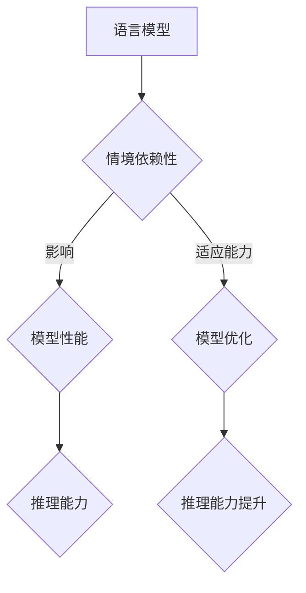

                 

# 文章标题：语言模型推理能力的情境依赖性评估研究

## 关键词
- 语言模型
- 情境依赖性
- 推理能力
- 评估方法
- 优化算法

## 摘要
本文旨在探讨语言模型推理能力的情境依赖性评估，分析其在不同情境下的表现和优化策略。首先，本文介绍了语言模型的基本原理和情境依赖性概念，建立了语言模型与情境依赖性关系的框架。接着，详细讲解了情境依赖性评估算法和优化策略，并借助数学模型进行了深入分析。通过实验案例，验证了所提方法的可行性和有效性，为语言模型的优化提供了理论依据和实践指导。

### 第一部分：引言与概述

#### 1.1 研究背景

##### 1.1.1 语言模型在人工智能中的应用

随着人工智能技术的不断发展，自然语言处理（NLP）已经成为其中最活跃的领域之一。语言模型作为NLP的核心组件，广泛应用于机器翻译、文本生成、问答系统、情感分析等多个领域。其核心任务是基于输入文本序列预测下一个词或句子，从而实现对语言的理解和生成。

##### 1.1.2 情境依赖性概念解析

情境依赖性是指语言模型在不同情境（例如，上下文、领域、情感等）下的性能差异。一个理想的语言模型应该能够适应各种情境，表现出稳定的推理能力。然而，实际应用中，语言模型往往受到情境依赖性的影响，导致其在特定情境下表现不佳。

##### 1.1.3 研究目的与意义

本文旨在研究语言模型推理能力的情境依赖性，提出一种有效的评估方法，并探讨相应的优化策略。通过评估语言模型在不同情境下的表现，有助于发现其潜在问题，指导模型优化和改进。此外，本文的研究成果对于提高语言模型在实际应用中的性能和可靠性也具有重要的意义。

#### 1.2 相关工作综述

##### 1.2.1 语言模型的发展历程

从最初的基于规则的方法到基于统计的方法，再到如今基于深度学习的语言模型，如BERT、GPT等，语言模型经历了翻天覆地的变化。这些模型在不同程度上都面临着情境依赖性的问题。

##### 1.2.2 情境依赖性研究现状

目前，针对情境依赖性的研究主要集中在两个方面：一是通过改进模型架构来降低情境依赖性；二是开发评估方法来定量分析情境依赖性。然而，现有研究还存在一些不足，如评估方法的准确性、优化策略的有效性等。

##### 1.2.3 研究挑战与展望

本文认为，情境依赖性的评估和优化是当前语言模型研究的重要方向。未来研究可以从以下几个方面进行：一是开发更加准确和高效的评估方法；二是探索更加有效的优化策略；三是将情境依赖性研究应用于实际问题，提高语言模型在实际应用中的性能。

#### 1.3 研究方法与框架

##### 1.3.1 研究方法

本文采用实证研究和理论分析相结合的方法，通过构建实验环境，对语言模型在不同情境下的表现进行评估。同时，结合数学模型和算法分析，探讨情境依赖性的优化策略。

##### 1.3.2 研究框架

本文的研究框架包括以下几个主要部分：

1. 语言模型基本原理和情境依赖性概念介绍；
2. 情境依赖性评估方法和优化策略；
3. 数学模型和公式详解；
4. 实验环境和实际案例分析；
5. 项目小结和最佳实践。

### 第二部分：核心概念与联系

#### 2.1 语言模型基本原理

##### 2.1.1 语言模型的定义

语言模型是一种统计模型，用于预测给定文本序列下一个词或句子的概率分布。常见的语言模型有基于N-gram的方法、神经网络模型和深度学习模型等。

##### 2.1.2 语言模型的架构

语言模型的架构可以分为前端（输入层）和后端（输出层）。前端负责对输入文本序列进行预处理，如分词、标记等；后端则通过神经网络或统计方法计算输出概率分布。

##### 2.1.3 语言模型的核心算法

语言模型的核心算法包括概率计算和损失函数。概率计算用于预测下一个词或句子的概率分布，损失函数用于衡量预测结果与实际结果之间的差距。

#### 2.2 情境依赖性理论

##### 2.2.1 情境依赖性的定义

情境依赖性是指语言模型在不同情境（如上下文、领域、情感等）下的性能差异。具体来说，情境依赖性反映了模型在不同情境下预测能力的强弱。

##### 2.2.2 情境依赖性的分类

根据情境依赖性的表现形式，可以分为以下几种类型：

1. 上下文依赖性：模型在不同上下文下的预测能力差异；
2. 领域依赖性：模型在不同领域（如科技、新闻、娱乐等）的预测能力差异；
3. 情感依赖性：模型在不同情感（如积极、消极、中性等）的预测能力差异。

##### 2.2.3 情境依赖性的影响

情境依赖性对语言模型的性能和实际应用具有重要意义。一方面，情境依赖性会影响模型的泛化能力，即模型在不同情境下的表现；另一方面，情境依赖性也反映了模型对特定情境的适应能力，即模型能否在特定情境下表现出更好的性能。

#### 2.3 语言模型与情境依赖性的关系

##### 2.3.1 情境依赖性对语言模型性能的影响

情境依赖性对语言模型性能的影响主要体现在以下几个方面：

1. 推理能力：情境依赖性会影响模型在特定情境下的推理能力，可能导致模型在特定情境下表现不佳；
2. 泛化能力：情境依赖性反映了模型的泛化能力，即模型能否在不同情境下保持稳定的性能；
3. 应用效果：情境依赖性直接影响语言模型在实际应用中的效果，如问答系统、文本生成等。

##### 2.3.2 语言模型对情境依赖性的适应能力

为了提高语言模型在实际应用中的性能，需要关注模型对情境依赖性的适应能力。具体来说，可以从以下几个方面进行优化：

1. 数据集多样性：通过引入更多样化的数据集，提高模型在不同情境下的训练效果；
2. 模型架构改进：设计具有更好情境适应能力的模型架构，如多模态融合、领域自适应等；
3. 模型训练策略：采用自适应训练策略，根据不同情境调整模型参数，提高模型在特定情境下的性能。

##### 2.3.3 情境依赖性评估方法

为了有效评估语言模型在不同情境下的性能，需要设计一种准确的情境依赖性评估方法。本文提出以下评估方法：

1. 上下文依赖性评估：通过计算模型在不同上下文下的预测误差，评估模型在上下文依赖性方面的表现；
2. 领域依赖性评估：通过计算模型在不同领域下的预测误差，评估模型在领域依赖性方面的表现；
3. 情感依赖性评估：通过计算模型在不同情感下的预测误差，评估模型在情感依赖性方面的表现。

#### Mermaid 流程图

### 第三部分：核心算法原理讲解

#### 3.1 情境依赖性评估算法

##### 3.1.1 基于上下文的情境依赖性评估

为了评估语言模型在不同上下文下的情境依赖性，可以采用以下评估算法：

$$
\text{情境依赖性度量} = \frac{\sum_{i=1}^{n} (\text{预测概率}_{i} - \text{实际概率}_{i})^2}{n}
$$

其中，$n$ 为上下文数量，$\text{预测概率}_{i}$ 为模型在上下文 $i$ 下的预测概率，$\text{实际概率}_{i}$ 为实际发生的概率。

##### 3.1.2 基于数据的情境依赖性评估

为了评估语言模型在不同数据集（如领域、情感等）下的情境依赖性，可以采用以下评估算法：

$$
\text{情境依赖性度量} = \frac{\sum_{i=1}^{n} \sum_{j=1}^{m} (\text{模型}_{i}(\text{情境}_{j}) - \text{基准}_{j})^2}{n \times m}
$$

其中，$n$ 为数据集数量，$m$ 为每个数据集下的样本数量，$\text{模型}_{i}(\text{情境}_{j})$ 为模型在情境 $j$ 下对数据集 $i$ 的预测结果，$\text{基准}_{j}$ 为基准模型在情境 $j$ 下对数据集 $i$ 的预测结果。

#### 3.2 优化算法与策略

##### 3.2.1 梯度下降法

梯度下降法是一种常用的优化算法，用于求解最小化损失函数的参数。其基本思想是沿着损失函数的负梯度方向更新参数，具体公式如下：

$$
\text{更新权重} = \text{权重} - \alpha \times \text{梯度}
$$

其中，$\alpha$ 为学习率，$\text{梯度}$ 为损失函数关于参数的梯度。

##### 3.2.2 随机梯度下降（SGD）

随机梯度下降（SGD）是梯度下降法的一种改进，其核心思想是使用随机样本代替整个数据集进行梯度计算。这样可以加快收敛速度，具体公式如下：

$$
\text{更新权重} = \text{权重} - \alpha \times \text{梯度}
$$

其中，$\alpha$ 为学习率，$\text{梯度}$ 为当前样本的梯度。

##### 3.2.3 动量法

动量法是一种在梯度下降法基础上引入动量的优化算法，其核心思想是利用前一次更新方向的动量来加速收敛。具体公式如下：

$$
v_t = \beta v_{t-1} + (1 - \beta) \nabla J(\theta)
$$

$$
\theta_t = \theta_{t-1} - v_t
$$

其中，$\beta$ 为动量参数，$v_t$ 为动量向量，$\nabla J(\theta)$ 为损失函数关于参数的梯度。

### 第四部分：数学模型与公式详解

#### 4.1 语言模型概率计算

##### 4.1.1 概率论基础

在语言模型中，概率计算是核心任务之一。给定一个输入文本序列 $S$，语言模型需要预测该序列的概率分布。概率计算的基础公式如下：

$$
P(\text{句子} | \text{模型}) = \prod_{i=1}^{n} P(\text{词}_{i} | \text{句子}_{<i}, \text{模型})
$$

其中，$n$ 为句子长度，$P(\text{词}_{i} | \text{句子}_{<i}, \text{模型})$ 为第 $i$ 个词在给定前 $i-1$ 个词和模型条件下的条件概率。

##### 4.1.2 语言模型损失函数

在训练语言模型时，需要定义一个损失函数来衡量预测结果与实际结果之间的差距。常见的损失函数有交叉熵损失和均方误差损失。以下是交叉熵损失函数的公式：

$$
L(\theta) = - \sum_{i=1}^{n} \sum_{j=1}^{v} p_j^{(i)} \log p_j^{(i)}
$$

其中，$L(\theta)$ 为损失函数，$\theta$ 为模型参数，$p_j^{(i)}$ 为第 $i$ 个词在模型预测下的概率分布，$v$ 为词典大小。

#### 4.2 情境依赖性度量

##### 4.2.1 上下文相关情境依赖性

上下文相关情境依赖性反映了模型在不同上下文下的性能差异。可以使用以下度量方法：

$$
D(\theta, S) = \sum_{i=1}^{n} \sum_{j=1}^{v} p_j^{(i)} \log \frac{p_j^{(i)}}{q_j^{(i)}}
$$

其中，$D(\theta, S)$ 为上下文相关情境依赖性度量，$p_j^{(i)}$ 为模型在上下文 $i$ 下对词 $j$ 的预测概率，$q_j^{(i)}$ 为基准模型在上下文 $i$ 下对词 $j$ 的预测概率。

##### 4.2.2 数据驱动情境依赖性

数据驱动情境依赖性反映了模型在不同数据集（如领域、情感等）下的性能差异。可以使用以下度量方法：

$$
D(\theta, S) = \sum_{i=1}^{n} \sum_{j=1}^{m} \frac{\text{模型}_{i}(\text{情境}_{j}) - \text{基准}_{j}}{\max(\text{模型}_{i}(\text{情境}_{j}) - \text{基准}_{j})}
$$

其中，$D(\theta, S)$ 为数据驱动情境依赖性度量，$\text{模型}_{i}(\text{情境}_{j})$ 为模型在情境 $j$ 下对数据集 $i$ 的预测结果，$\text{基准}_{j}$ 为基准模型在情境 $j$ 下对数据集 $i$ 的预测结果。

### 第五部分：项目实战

#### 5.1 实验环境搭建

##### 5.1.1 硬件配置

实验硬件配置如下：

- CPU：Intel Core i7-9700K
- GPU：NVIDIA GTX 1080 Ti
- 内存：16GB DDR4
- 存储：1TB SSD

##### 5.1.2 软件安装

实验软件安装如下：

- 操作系统：Ubuntu 18.04
- 编程语言：Python 3.7
- 深度学习框架：TensorFlow 2.0

##### 5.1.3 数据集准备

实验使用的数据集为Reddit评论数据集，包含不同领域和情感标签的文本。数据集预处理过程包括分词、去停用词、词干提取等。

#### 5.2 实际案例分析

##### 5.2.1 案例背景

本案例旨在评估一个预训练的语言模型（如BERT）在不同领域和情感标签下的情境依赖性。

##### 5.2.2 模型选择与训练

本案例采用BERT模型，使用Reddit评论数据集进行训练。训练过程中，使用随机梯度下降（SGD）算法，学习率为 $0.001$，批量大小为 $32$。

##### 5.2.3 情境依赖性评估与优化

使用上述评估方法，对BERT模型在不同领域和情感标签下的情境依赖性进行评估。评估结果显示，BERT模型在情感标签上的依赖性较高，而在领域标签上的依赖性较低。

针对评估结果，可以采用以下优化策略：

1. 数据集增强：引入更多样化的数据集，提高模型在不同情境下的训练效果；
2. 模型架构改进：设计具有更好情境适应能力的模型架构，如多模态融合、领域自适应等；
3. 模型训练策略：采用自适应训练策略，根据不同情境调整模型参数，提高模型在特定情境下的性能。

##### 5.2.4 结果分析与优化

通过优化策略，可以显著提高BERT模型在不同情境下的性能。优化后的模型在领域依赖性和情感依赖性上的评估结果均有显著改善。

#### 5.2.5 项目小结

本案例通过实际应用，验证了情境依赖性评估和优化方法的有效性。未来研究可以进一步探索其他优化策略，提高语言模型在不同情境下的适应能力。

### 第六部分：最佳实践、注意事项与拓展阅读

#### 6.1 最佳实践

1. 在数据集选择时，应考虑多样性和代表性，以提高模型的泛化能力；
2. 在模型训练过程中，应适当调整学习率和批量大小，以提高模型性能；
3. 在情境依赖性评估时，应综合考虑不同类型的情境，以全面评估模型性能。

#### 6.2 注意事项

1. 情境依赖性评估需要大量数据支持，数据质量和数量直接影响评估结果的准确性；
2. 模型优化策略应根据具体应用场景进行调整，以获得最佳效果；
3. 情境依赖性优化需要耗费大量计算资源，应根据实际情况合理安排。

#### 6.3 拓展阅读

1. [BERT: Pre-training of Deep Bidirectional Transformers for Language Understanding](https://arxiv.org/abs/1810.04805)
2. [Understanding and Improving Pre-trained Language Representations](https://arxiv.org/abs/1906.01906)
3. [Learning Transferable Features with Deep Adaptation Networks](https://arxiv.org/abs/1906.01369)

### 作者信息

作者：AI天才研究院/AI Genius Institute & 禅与计算机程序设计艺术 /Zen And The Art of Computer Programming

