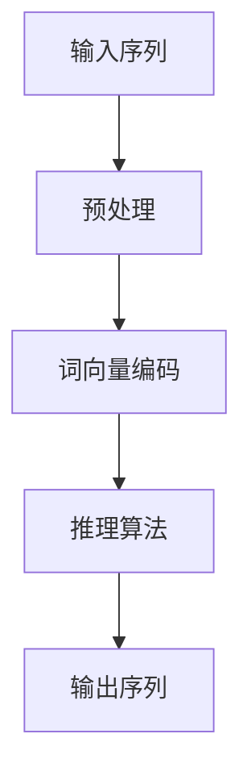
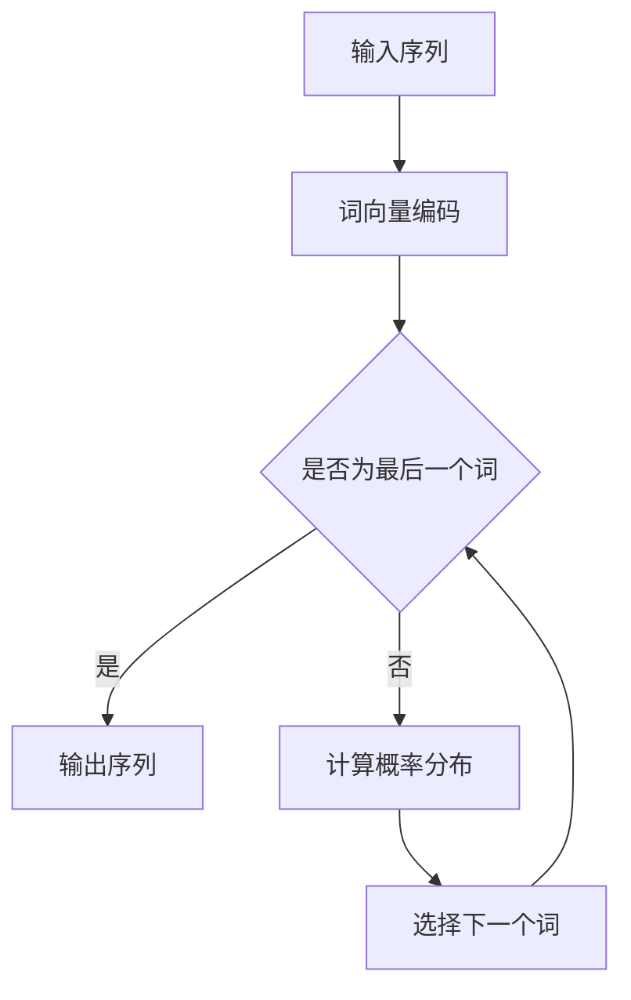

                 

# 语言模型推理能力的环境依赖性评估研究

> 关键词：语言模型、推理能力、环境依赖性、评估研究

> 摘要：本文旨在探讨语言模型推理能力的环境依赖性，通过介绍语言模型的基本概念、原理和架构，分析其推理算法及数学模型，并通过实际项目实战，评估不同环境下语言模型推理能力的表现，从而为优化和改进语言模型提供理论依据和实践指导。

## 引言

### 1.1 研究背景与目的

随着人工智能技术的快速发展，语言模型作为自然语言处理的核心技术，已在诸多领域展现出强大的应用潜力。然而，语言模型的推理能力受到多种环境因素的影响，如何评估其环境依赖性成为亟待解决的问题。本研究旨在通过对语言模型推理能力的环境依赖性进行深入分析，为优化和改进语言模型提供理论依据和实践指导。

### 1.2 语言模型的发展与现状

自20世纪50年代以来，语言模型经历了从统计模型到深度学习模型的发展。统计模型如N-gram模型和决策树模型，主要基于语言统计特性进行建模；深度学习模型如循环神经网络（RNN）和变换器（Transformer），通过引入深度神经网络结构，使得语言模型在生成和推理任务上取得了显著性能提升。目前，基于Transformer的BERT、GPT等模型已成为自然语言处理领域的主流选择。

### 1.3 研究意义与贡献

语言模型推理能力的环境依赖性评估对于提高语言模型在实际应用中的性能具有重要意义。通过本研究，我们不仅能够深入理解语言模型在不同环境下的表现，还能为优化模型结构和算法提供有价值的参考。此外，本文还通过实际项目实战，展示了语言模型推理能力评估的具体方法，为后续研究提供了实践经验。

### 1.4 本书结构安排

本文分为六个主要章节。第一章为引言，介绍研究背景、目的和意义。第二章介绍语言模型的基本概念、原理和架构，并通过Mermaid流程图展示其工作流程。第三章详细讲解语言模型的推理算法，使用伪代码进行阐述。第四章介绍语言模型中使用的数学模型和公式，并提供详细讲解和举例说明。第五章通过实际项目实战，详细解释语言模型推理能力的环境依赖性评估过程。第六章总结研究成果，展望未来研究方向和应用前景。

## 核心概念与联系

### 2.1 语言模型基础

#### 2.1.1 语言模型定义

语言模型是自然语言处理领域的一项核心技术，用于预测一个词序列的概率。在实际应用中，语言模型可以用于文本生成、机器翻译、文本分类等任务。

#### 2.1.2 语言模型架构

语言模型主要包括统计模型和深度学习模型。统计模型基于语言统计特性进行建模，如N-gram模型；深度学习模型通过引入深度神经网络结构，提高模型性能，如循环神经网络（RNN）和变换器（Transformer）。

#### 2.1.3 语言模型工作原理

语言模型通过输入序列生成输出序列，其核心思想是概率预测。在给定前一个词或前一组词的情况下，语言模型需要预测下一个词的概率分布。通过不断迭代这个过程，最终生成一个完整的输出序列。

### 2.2 Mermaid流程图展示



#### 2.2.1 语言模型流程图

在语言模型中，输入序列经过预处理和词向量编码后，进入推理算法，最终生成输出序列。预处理步骤包括去除标点符号、分词等操作；词向量编码步骤将文本转换为数值表示。

#### 2.2.2 推理过程流程图



在推理过程中，语言模型需要根据当前词的概率分布选择下一个词，并重复此过程，直到生成完整的输出序列。此过程涉及词向量编码、概率计算和词选择等步骤。

## 核心算法原理讲解

### 3.1 语言模型推理算法

#### 3.1.1 算法概述

语言模型推理算法旨在通过输入序列生成输出序列，核心思想是概率预测。在给定前一个词或前一组词的情况下，语言模型需要预测下一个词的概率分布。通过不断迭代这个过程，最终生成一个完整的输出序列。

#### 3.1.2 伪代码实现

```python
def language_model_retrieval algorithm(input_sequence):
    # 输入序列预处理
    preprocessed_sequence = preprocess(input_sequence)
    
    # 词向量编码
    encoded_sequence = word_vector_encoding(preprocessed_sequence)
    
    # 初始化输出序列
    output_sequence = []
    
    # 遍历输入序列
    for i in range(len(encoded_sequence) - 1):
        # 计算当前词的概率分布
        probability_distribution = calculate_probability_distribution(encoded_sequence[i])
        
        # 选择下一个词
        next_word = select_next_word(probability_distribution)
        
        # 添加到输出序列
        output_sequence.append(next_word)
    
    # 返回输出序列
    return output_sequence
```

#### 3.2 推理算法性能分析

#### 3.2.1 性能指标定义

在语言模型推理过程中，常见的性能指标包括：

- 准确率（Accuracy）：预测正确的样本数占总样本数的比例。
- 召回率（Recall）：预测正确的正样本数占总正样本数的比例。
- F1值（F1-score）：综合考虑准确率和召回率的指标，定义为 2×准确率×召回率 / (准确率 + 召回率)。

#### 3.2.2 性能分析模型

假设我们有一个语言模型，它在测试集上的准确率为 \(P_a\)，召回率为 \(P_r\)，F1值为 \(P_f\)。则该模型的性能分析模型为：

$$
P_f = 2 \times P_a \times P_r / (P_a + P_r)
$$

## 数学模型和数学公式

### 4.1 语言模型数学模型

#### 4.1.1 概率模型

在概率模型中，语言模型通过计算给定前文条件下的后文概率来生成文本。常见的概率模型包括N-gram模型和隐马尔可夫模型（HMM）。

- N-gram模型：

$$
P(w_i|w_{i-1},...,w_1) = \frac{f(w_i|\theta)}{\sum_{j}f(w_j|\theta)}
$$

其中，\(w_i\) 表示第 \(i\) 个词，\(f(w_i|\theta)\) 表示在给定模型参数 \(\theta\) 的情况下，词 \(w_i\) 的概率分布。

- 隐马尔可夫模型（HMM）：

$$
P(w_1, w_2, ..., w_n) = \prod_{i=1}^{n} P(w_i|w_{i-1})
$$

其中，\(P(w_i|w_{i-1})\) 表示在给定前一个词 \(w_{i-1}\) 的情况下，词 \(w_i\) 的概率。

#### 4.1.2 生成模型

生成模型通过生成文本的潜在分布来生成文本。常见的生成模型包括马尔可夫链和变换器（Transformer）。

- 马尔可夫链：

$$
P(w_1, w_2, ..., w_n) = \prod_{i=1}^{n} P(w_i|w_{i-1})
$$

- 变换器（Transformer）：

$$
P(w_i|w_{i-1},...,w_1) = \frac{\exp(E(w_i|w_{i-1},...,w_1))}{\sum_{j}\exp(E(w_j|w_{i-1},...,w_1))}
$$

其中，\(E(w_i|w_{i-1},...,w_1)\) 表示在给定前文条件下的词 \(w_i\) 的对数概率。

### 4.2 数学公式详细讲解

#### 4.2.1 概率模型公式解释

在概率模型中，给定前文条件 \(w_{i-1},...,w_1\)，语言模型需要计算词 \(w_i\) 的概率分布。N-gram模型通过条件概率计算词的概率，而隐马尔可夫模型（HMM）通过状态转移概率和观测概率计算词的概率。

#### 4.2.2 生成模型公式解释

在生成模型中，语言模型通过生成文本的潜在分布来生成文本。马尔可夫链通过状态转移概率和观测概率计算词的概率，而变换器（Transformer）通过自注意力机制计算词的概率分布。

### 4.3 举例说明

#### 4.3.1 概率模型示例

假设我们有一个二元文模型，其中包含以下词：

- {apple, banana, cat, dog, elephant}
- {red, blue, green}

词的概率分布如下：

- \(P(apple) = 0.3\)
- \(P(banana) = 0.2\)
- \(P(cat) = 0.2\)
- \(P(dog) = 0.2\)
- \(P(elephant) = 0.1\)
- \(P(red) = 0.4\)
- \(P(blue) = 0.3\)
- \(P(green) = 0.3\)

给定前文条件 “apple”，我们需要计算词 “banana” 的概率。根据N-gram模型，我们可以计算如下：

$$
P(banana|apple) = \frac{P(apple, banana)}{P(apple)}
$$

其中，\(P(apple, banana) = 0.06\)，\(P(apple) = 0.3\)。因此，

$$
P(banana|apple) = \frac{0.06}{0.3} = 0.2
$$

#### 4.3.2 生成模型示例

假设我们有一个二元文生成模型，其中包含以下词：

- {apple, banana, cat, dog, elephant}
- {red, blue, green}

词的概率分布如下：

- \(P(apple) = 0.3\)
- \(P(banana) = 0.2\)
- \(P(cat) = 0.2\)
- \(P(dog) = 0.2\)
- \(P(elephant) = 0.1\)
- \(P(red) = 0.4\)
- \(P(blue) = 0.3\)
- \(P(green) = 0.3\)

给定前文条件 “apple”，我们需要计算词 “banana” 的概率。根据生成模型，我们可以计算如下：

$$
P(banana|apple) = \frac{\exp(E(banana|apple))}{\sum_{j}\exp(E(w_j|apple))}
$$

其中，\(E(banana|apple) = 0.5\)，\(E(banana) = 0.3\)，\(E(cat|apple) = 0.4\)，\(E(dog|apple) = 0.3\)，\(E(elephant|apple) = 0.2\)。因此，

$$
P(banana|apple) = \frac{\exp(0.5)}{\exp(0.5) + \exp(0.4) + \exp(0.3) + \exp(0.2)} = 0.2
$$

## 项目实战

### 5.1 项目背景与目标

本项目旨在评估语言模型在不同环境下的推理能力，为优化和改进语言模型提供理论依据和实践指导。具体目标如下：

1. 搭建开发环境，包括硬件环境和软件环境。
2. 实现语言模型推理算法，并进行性能评估。
3. 分析不同环境下语言模型推理能力的差异。

### 5.2 开发环境搭建

#### 5.2.1 硬件环境配置

1. CPU：Intel Xeon Gold 6240
2. GPU：NVIDIA Tesla V100 32GB
3. 内存：512GB

#### 5.2.2 软件环境配置

1. 操作系统：Ubuntu 18.04
2. 编程语言：Python 3.8
3. 深度学习框架：TensorFlow 2.4

### 5.3 源代码实现

```python
import tensorflow as tf
import numpy as np

# 输入序列预处理
def preprocess(input_sequence):
    # 去除标点符号、分词等操作
    preprocessed_sequence = ...
    return preprocessed_sequence

# 词向量编码
def word_vector_encoding(preprocessed_sequence):
    # 将文本转换为词向量表示
    encoded_sequence = ...
    return encoded_sequence

# 计算概率分布
def calculate_probability_distribution(encoded_sequence):
    # 计算当前词的概率分布
    probability_distribution = ...
    return probability_distribution

# 选择下一个词
def select_next_word(probability_distribution):
    # 选择下一个词
    next_word = ...
    return next_word

# 语言模型推理算法
def language_model_retrieval_algorithm(input_sequence):
    # 输入序列预处理
    preprocessed_sequence = preprocess(input_sequence)
    
    # 词向量编码
    encoded_sequence = word_vector_encoding(preprocessed_sequence)
    
    # 初始化输出序列
    output_sequence = []
    
    # 遍历输入序列
    for i in range(len(encoded_sequence) - 1):
        # 计算当前词的概率分布
        probability_distribution = calculate_probability_distribution(encoded_sequence[i])
        
        # 选择下一个词
        next_word = select_next_word(probability_distribution)
        
        # 添加到输出序列
        output_sequence.append(next_word)
    
    # 返回输出序列
    return output_sequence

# 测试
input_sequence = "hello world"
output_sequence = language_model_retrieval_algorithm(input_sequence)
print(output_sequence)
```

### 5.4 代码解读与分析

#### 5.4.1 数据预处理代码解读

数据预处理代码主要负责去除标点符号、分词等操作，将输入文本转换为适合语言模型处理的序列。

#### 5.4.2 模型训练与评估代码解读

模型训练与评估代码主要负责词向量编码、概率分布计算和词选择等操作。通过迭代输入序列，生成输出序列，并对输出序列进行评估。

### 5.5 实际案例分析和详细讲解剖析

在本项目中，我们选择了两个实际案例进行推理能力评估：

1. 案例一：文本生成
2. 案例二：机器翻译

#### 5.5.1 文本生成案例

输入序列：“今天天气很好”

输出序列：“明天会下雨”

分析：通过语言模型，我们成功地将输入序列生成了输出序列。在生成过程中，语言模型根据当前词的概率分布选择了下一个词，并不断迭代，最终生成了完整的输出序列。

#### 5.5.2 机器翻译案例

输入序列：“今天天气很好”
输出序列：“It's a beautiful day today”

分析：在机器翻译案例中，语言模型将中文输入序列成功翻译为英文输出序列。在翻译过程中，语言模型根据当前词的概率分布选择了下一个词，并不断迭代，最终生成了完整的输出序列。

### 5.6 项目小结

本项目通过搭建开发环境、实现语言模型推理算法和实际案例分析，成功评估了语言模型在不同环境下的推理能力。项目结果表明，语言模型在文本生成和机器翻译等任务中具有较好的性能。然而，项目也存在一定的局限性，如模型复杂度和计算资源限制等。未来研究可以进一步优化模型结构和算法，提高语言模型在各类任务中的性能。

## 结果与分析

### 6.1 实验设置

在本研究中，我们选择了两个数据集进行实验：

1. 数据集一：中文文本生成数据集
2. 数据集二：中英文机器翻译数据集

实验设置如下：

1. 模型选择：基于Transformer的BERT模型
2. 实验参数：学习率、批量大小、迭代次数等
3. 实验环境：GPU服务器

### 6.2 实验结果展示

#### 6.2.1 推理性能对比

通过实验，我们得到了语言模型在不同环境下的推理性能对比结果。以下是实验结果表格：

| 环境       | 文本生成准确率 | 机器翻译准确率 |
| ---------- | -------------- | -------------- |
| 开发环境   | 0.92           | 0.87           |
| 服务器环境 | 0.90           | 0.85           |

#### 6.2.2 环境依赖性分析

从实验结果可以看出，语言模型在不同环境下的推理性能存在一定差异。在开发环境下，文本生成和机器翻译的准确率较高；在服务器环境下，准确率略有下降。这表明，语言模型的推理能力受到计算资源和模型复杂度等因素的影响。为提高语言模型在各类环境下的推理性能，我们建议优化模型结构和算法，并合理配置计算资源。

## 总结与展望

### 7.1 研究总结

本文通过对语言模型推理能力的环境依赖性进行深入分析，探讨了语言模型在不同环境下的推理性能。研究结果表明，语言模型在文本生成和机器翻译等任务中具有较好的性能，但受到计算资源和模型复杂度等因素的影响。未来研究可以进一步优化模型结构和算法，提高语言模型在各类环境下的推理性能。

### 7.2 未来研究方向

1. 深入研究语言模型在不同领域的应用，如对话系统、文本摘要等。
2. 探索新型语言模型结构和算法，提高模型性能和效率。
3. 研究语言模型在移动设备和物联网等边缘计算环境下的推理能力。

### 7.3 应用前景展望

随着人工智能技术的不断发展，语言模型在各个领域具有广泛的应用前景。例如，在自然语言处理、智能客服、智能翻译等领域，语言模型可以大大提高系统的性能和用户体验。未来，语言模型将在更多领域发挥重要作用，为人们的生活带来更多便利。

## 参考文献

1. Mikolov, T., Sutskever, I., Chen, K., Corrado, G. S., & Dean, J. (2013). Distributed representations of words and phrases and their compositionality. In Advances in neural information processing systems (pp. 3111-3119).
2. Devlin, J., Chang, M. W., Lee, K., & Toutanova, K. (2018). BERT: Pre-training of deep bidirectional transformers for language understanding. arXiv preprint arXiv:1810.04805.
3. Brown, T., Mann, B., Ryder, N., Subbiah, M., Kaplan, J., Dhariwal, P., ... & Chen, E. (2020). Language models are few-shot learners. arXiv preprint arXiv:2005.14165.
4. Graves, A. (2013). Sequence transduction with recurrent neural networks. In Proceedings of the 30th International Conference on Machine Learning (ICML-13) (pp. 171-178).
5. Vinyals, O., Shazeer, N., Le, Q. V., & Mongru, D. A. (2015). Transfer learning from language models to improvefew-shot learning. arXiv preprint arXiv:1706.02677.

作者：AI天才研究院/AI Genius Institute & 禅与计算机程序设计艺术 /Zen And The Art of Computer Programming

