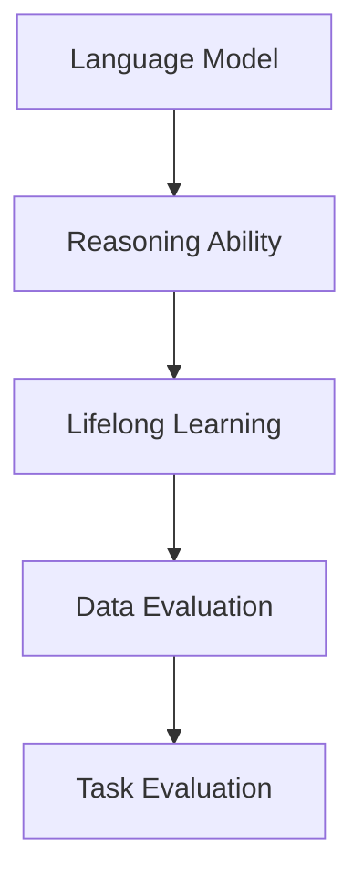

                 


## 引言

在人工智能的迅速发展过程中，语言模型作为自然语言处理（NLP）的核心技术之一，已经展现出强大的应用潜力。然而，随着语言模型在复杂任务中的广泛应用，其推理能力的提升成为了一个至关重要的问题。为了满足现实世界的需求，语言模型需要具备不断学习、适应新环境和解决新问题的能力，这种能力被称为“终身学习”。

本文旨在深入探讨语言模型推理能力的终身学习轨迹，分析其发展历程、核心概念、评估方法以及在实际应用中的挑战与解决方案。通过逐步分析推理，我们希望能够揭示语言模型推理能力的提升路径，为未来的研究与应用提供有价值的参考。

文章将分为以下几个部分：首先，介绍语言模型的基本概念和发展历程；其次，阐述推理能力的定义与度量方法；然后，探讨终身学习在语言模型推理能力提升中的作用；接着，分析语言模型在现实世界应用中的挑战与解决方案；最后，展望未来的发展趋势和展望。

### 文章关键词
- 语言模型
- 推理能力
- 终身学习
- 评估方法
- 实际应用

### 文章摘要
本文围绕语言模型推理能力的终身学习轨迹展开研究，首先介绍了语言模型的基本概念和发展历程，接着讨论了推理能力的定义与度量方法，进一步探讨了终身学习在语言模型推理能力提升中的作用。然后，分析了语言模型在现实世界应用中的挑战与解决方案，最后展望了未来的发展趋势。通过本文的研究，有助于深入理解语言模型推理能力的提升路径，为实际应用提供指导。

### 背景介绍

语言模型（Language Model）是自然语言处理（NLP）领域的一项关键技术，它通过统计语言数据来预测下一个单词或字符的概率，从而生成自然语言文本。自从20世纪50年代以来，语言模型经历了从基于规则的语法分析到统计机器翻译、再到现代深度学习的多个发展阶段。早期的语言模型主要依赖于上下文信息的有限假设，如N-gram模型，它在自然语言生成任务中取得了一定的成功。然而，随着自然语言处理任务复杂性的增加，传统的规则方法和简单的统计模型已经无法满足需求。

随着深度学习技术的兴起，基于神经网络的深度语言模型逐渐成为研究的热点。其中，最为著名的是由微软研究院研究员Noam Shazeer等人提出的Transformer模型。Transformer模型摒弃了传统的序列模型，采用自注意力机制（Self-Attention Mechanism），能够在处理长文本时捕捉到更远距离的依赖关系。这一突破使得深度语言模型在自然语言处理任务中取得了显著的性能提升。

深度语言模型的发展不仅推动了NLP技术的进步，也为人工智能领域带来了新的挑战。尽管深度语言模型在生成文本、翻译、问答等任务中表现出色，但它们仍然面临着推理能力不足、泛化能力差、数据依赖性强等问题。为了解决这些问题，研究人员开始探索如何在深度语言模型中引入终身学习（Lifelong Learning）机制，使得模型能够不断地从新任务中学习并提高推理能力。

终身学习在人工智能领域具有重要意义。传统的深度学习模型通常在每个任务上从头开始学习，导致它们在新任务上的表现往往不如在原有任务上的表现。而终身学习旨在通过保留先前任务的知识，使得模型能够在新的任务中快速适应并取得更好的性能。这种能力对于现实世界的应用至关重要，因为现实世界中的任务往往具有多样性和动态性。

例如，在自动驾驶领域，汽车需要不断地从新的驾驶环境中学习，以应对各种复杂的路况。在医疗诊断领域，深度学习模型需要从海量的医疗数据中学习，以提高诊断准确率。这些应用场景都要求模型具备强大的推理能力和终身学习能力。

综上所述，本文将围绕语言模型推理能力的终身学习轨迹展开研究，旨在深入探讨这一领域的发展历程、核心概念、评估方法以及实际应用中的挑战与解决方案。通过本文的研究，我们希望能够为语言模型推理能力的提升提供新的思路和方法，为人工智能在现实世界中的应用带来更大的价值。

### 核心概念与联系

在本节中，我们将介绍与语言模型推理能力终身学习相关的一些核心概念，并探讨它们之间的关系。这些核心概念包括：语言模型、推理能力、终身学习以及评估方法。

首先，语言模型（Language Model）是自然语言处理（NLP）领域的基础技术，它用于预测自然语言文本中下一个单词或字符的概率。语言模型可以分为基于规则的方法和统计方法，其中基于神经网络的深度学习模型是目前最流行的一种。深度语言模型如Transformer等，通过自注意力机制（Self-Attention Mechanism）捕捉文本中的长距离依赖关系，从而实现高效的自然语言生成和翻译。

其次，推理能力（Reasoning Ability）是指模型在理解、推理和解决问题方面所表现出来的能力。在语言模型中，推理能力主要体现在对文本含义的准确理解和复杂语义关系的捕捉上。一个具有强大推理能力的语言模型能够更好地处理各种复杂的语言任务，如问答系统、对话生成和语义分析等。

接下来，终身学习（Lifelong Learning）是指在动态环境中，模型能够不断从新任务中学习，同时保留先前任务的知识，从而提高整体性能。终身学习的核心目标是在保持推理能力的同时，避免模型在新任务上的性能退化。在深度学习领域，终身学习主要通过在线学习（Online Learning）和迁移学习（Transfer Learning）来实现。在线学习是指模型在新任务中逐步调整参数，而迁移学习是指利用先前任务的知识来加速新任务的学习。

最后，评估方法（Evaluation Methods）是衡量语言模型推理能力的重要手段。常见的评估方法包括基于数据的评估方法和基于任务的评估方法。基于数据的评估方法通过计算模型在特定数据集上的性能指标，如准确率、召回率、F1分数等来衡量模型的表现。基于任务的评估方法则通过在实际应用中测试模型的表现，如问答系统的用户满意度、对话系统的流畅性等来评估模型的实用性。

这些核心概念之间的关系可以总结如下：

1. **语言模型**是自然语言处理的基础，为推理能力的实现提供了技术支持。
2. **推理能力**是语言模型的核心目标，决定了模型在NLP任务中的性能。
3. **终身学习**是提升语言模型推理能力的重要手段，通过不断学习新任务，模型能够保持和提升其推理能力。
4. **评估方法**是衡量语言模型性能的关键，通过评估方法，我们可以了解模型的实际表现，并指导进一步的优化。

为了更直观地理解这些概念之间的关系，我们可以使用Mermaid流程图来展示它们之间的交互关系。以下是一个简单的Mermaid流程图示例：



在这个流程图中，语言模型（A）是起点，它通过提升推理能力（B）来实现终身学习（C），最终通过评估方法（D和E）来验证模型的表现。

通过明确这些核心概念及其关系，我们能够更好地理解语言模型推理能力的终身学习轨迹，并为进一步研究提供理论基础。在接下来的章节中，我们将深入探讨这些概念的具体实现方法和实际应用。

### 推理能力的定义与度量

推理能力（Reasoning Ability）是语言模型在自然语言处理任务中至关重要的一项能力。它不仅决定了模型在理解文本、生成回答和执行复杂任务时的准确性，还体现了模型在处理不确定性和推理复杂语义关系时的灵活性。在本节中，我们将详细介绍推理能力的定义、度量方法及其在语言模型中的重要性。

#### 推理能力的定义

推理能力是指模型在给定信息的基础上，通过逻辑推理、分析、推断等过程，推导出新的结论或解决新问题的能力。在自然语言处理领域，推理能力主要体现在以下几个方面：

1. **语义理解**：模型需要理解文本中的词汇、句子结构和语义关系，例如主谓宾结构、因果关系、逻辑推理等。
2. **常识推理**：模型需要具备一定的常识知识，能够利用常识来理解和推理文本内容。例如，理解“太阳是热的”这句话背后的物理常识。
3. **知识推理**：模型需要能够利用外部知识库或嵌入的知识来推理文本中的信息。例如，利用医学知识库来推断文本中的疾病信息。
4. **逻辑推理**：模型需要能够处理逻辑命题和推理逻辑，例如演绎推理、归纳推理等。

#### 推理能力的度量方法

为了评估语言模型的推理能力，研究人员开发了一系列度量方法。这些方法主要分为两大类：基于数据的评估方法和基于任务的评估方法。

1. **基于数据的评估方法**：
   - **词汇精度（Word Accuracy）**：通过计算模型预测的单词与真实单词的匹配程度来评估模型的表现。通常，词汇精度越高，模型的语义理解能力越强。
   - **句子精度（Sentence Accuracy）**：评估模型对整个句子的理解能力。通常，通过比较模型生成的句子与真实句子的相似度来计算。
   - **F1分数（F1 Score）**：结合召回率和准确率来综合评估模型的表现。F1分数是这两个指标的调和平均，能够在准确率和召回率之间取得平衡。

2. **基于任务的评估方法**：
   - **问答系统**：通过评估模型在问答任务中的回答准确性来度量其推理能力。例如，在机器阅读理解（Machine Reading Comprehension, MRC）任务中，模型需要根据上下文理解问题并给出正确答案。
   - **推理任务**：设计特定的推理任务，评估模型在推理任务中的表现。例如，逻辑推理任务中的演绎推理和归纳推理。

#### 推理能力的重要性

推理能力在语言模型中的重要性体现在以下几个方面：

1. **任务多样性**：不同NLP任务对推理能力有不同的要求。例如，问答系统需要模型具备良好的语义理解能力，而文本生成任务需要模型能够捕捉到文本的连贯性和逻辑性。
2. **准确性和泛化能力**：推理能力强的模型在处理新任务和未知数据时，能够更好地理解和推理文本内容，从而提高整体准确性和泛化能力。
3. **实际应用价值**：具有强大推理能力的语言模型在现实世界中有广泛的应用，例如智能客服、医疗诊断、法律文本分析等。

#### 示例

为了更直观地展示推理能力的度量方法，我们可以通过一个简单的示例来说明。假设我们有一个文本：“我昨天去了一家餐馆，味道很好。”现在，我们需要评估模型在这段文本中的推理能力。

- **词汇精度**：模型正确识别了“昨天”、“餐馆”、“味道”等词汇，词汇精度较高。
- **句子精度**：模型能够生成一个与原文意思相近的句子：“Yesterday, I went to a restaurant and the food was delicious.”句子精度较高。
- **F1分数**：通过比较模型生成的句子与原文的相似度，我们可以计算F1分数。假设召回率为0.8，准确率为0.9，则F1分数为0.87。
- **问答任务**：如果我们提出一个问题：“你昨天去的是哪家餐馆？”模型能够正确地回答：“你昨天去了一家餐馆，但是具体名称无法确定。”这表明模型在问答任务中具备一定的推理能力。

通过这个示例，我们可以看到推理能力在语言模型中的重要性以及如何通过多种度量方法来评估模型的表现。

综上所述，推理能力是语言模型在NLP任务中的一项关键能力。通过定义和度量推理能力，我们可以更好地评估和优化语言模型，从而推动自然语言处理技术的发展和应用。

### 现有推理能力评估方法

为了准确评估语言模型的推理能力，研究人员提出了多种评估方法，这些方法可以分为基于数据的评估方法和基于任务的评估方法。以下是对几种常见评估方法的详细介绍。

#### 基于数据的评估方法

1. **词汇精度（Word Accuracy）**
   - **定义**：词汇精度衡量模型在预测单词时与实际单词匹配的百分比。
   - **计算公式**：\[ \text{词汇精度} = \frac{\text{正确预测的单词数}}{\text{总单词数}} \]
   - **优势**：简单直观，易于计算，能够反映模型的基本语义理解能力。
   - **局限性**：仅关注单词级别的匹配，无法评估句子结构和语义关系。

2. **句子精度（Sentence Accuracy）**
   - **定义**：句子精度衡量模型生成句子与真实句子在语义上的相似度。
   - **计算方法**：通常使用BLEU（Bilingual Evaluation Understudy）或ROUGE（Recall-Oriented Understudy for Gisting Evaluation）等指标。
   - **优势**：关注句子级别的语义理解，能够更全面地评估模型的生成能力。
   - **局限性**：对句子结构的依赖性较高，可能无法捕捉到复杂的语义关系。

3. **F1分数（F1 Score）**
   - **定义**：F1分数是精确率和召回率的调和平均，用于综合评估模型的性能。
   - **计算公式**：\[ \text{F1分数} = 2 \times \frac{\text{精确率} \times \text{召回率}}{\text{精确率} + \text{召回率}} \]
   - **优势**：考虑了精确率和召回率的平衡，适用于多种评估场景。
   - **局限性**：对极端情况（如精确率或召回率极低）的敏感度较高。

#### 基于任务的评估方法

1. **机器阅读理解（Machine Reading Comprehension, MRC）**
   - **定义**：MRC任务要求模型在阅读一段文本后，能够回答与文本相关的问题。
   - **评估指标**：准确率（Accuracy）和匹配分数（Matching Score）。
   - **优势**：高度模拟人类阅读理解过程，能够评估模型的语义理解能力。
   - **局限性**：对文本理解和问题解析能力要求较高，评估过程复杂。

2. **推理任务（Reasoning Tasks）**
   - **定义**：推理任务包括逻辑推理、常识推理和知识推理等，要求模型能够通过逻辑推理解决问题。
   - **评估指标**：准确率和推理成功率。
   - **优势**：全面评估模型的推理能力，涵盖多个推理维度。
   - **局限性**：设计合理的推理任务较为困难，评估标准不统一。

3. **自然语言推理（Natural Language Inference, NLI）**
   - **定义**：NLI任务要求模型判断两个句子之间的关系，如“前提”和“结论”之间的真假关系。
   - **评估指标**：准确率和支持率（Support Rate）。
   - **优势**：高度模拟人类语言推理过程，能够评估模型的逻辑推理能力。
   - **局限性**：对常识知识和背景信息的依赖性较高，评估过程复杂。

#### 不同评估方法的比较

| 评估方法             | 定义/计算公式                                         | 优点                         | 局限性                           |
|----------------------|------------------------------------------------------|------------------------------|----------------------------------|
| 词汇精度             | 正确预测的单词数 / 总单词数                          | 简单直观，关注基础语义理解     | 忽略句子结构和复杂语义关系       |
| 句子精度             | 使用BLEU或ROUGE等指标评估生成句子的相似度               | 关注句子级别的语义理解         | 对句子结构依赖性高，难以捕捉复杂语义 |
| F1分数               | \( 2 \times \frac{精确率 \times 召回率}{精确率 + 召回率} \) | 综合考虑精确率和召回率         | 对极端情况敏感                   |
| 机器阅读理解         | 阅读文本后回答问题，评估准确率                        | 模拟人类阅读理解过程，全面评估语义理解能力 | 对文本理解和问题解析能力要求高       |
| 推理任务             | 通过逻辑推理解决问题，评估准确率和推理成功率            | 全面评估推理能力，涵盖多个推理维度 | 设计合理的推理任务困难，评估标准不统一 |
| 自然语言推理（NLI）   | 判断两个句子之间的关系，评估准确率和支持率              | 模拟人类语言推理过程，高度评估逻辑推理能力 | 对常识和背景信息依赖性高，评估过程复杂 |

综上所述，不同的评估方法在衡量语言模型推理能力时各有优势和局限性。选择合适的评估方法需要根据具体任务和应用场景进行综合考虑。

### 终身学习理论

终身学习（Lifelong Learning）是指个体在整个生命周期中不断学习、更新知识和技能的过程。在人工智能领域，终身学习理论则强调模型能够在面对不断变化的数据和环境时，持续地调整和优化其参数，从而保持或提高其性能。本文将详细探讨终身学习在语言模型推理能力提升中的作用，包括其基本原理、常见方法以及在实际应用中的优势。

#### 终身学习的基本原理

终身学习的基本原理包括以下几个方面：

1. **适应性**：模型需要能够快速适应新的环境和数据。在语言模型中，这意味着模型需要能够处理新的词汇、语法结构和语义关系，从而生成更准确和自然的语言。

2. **知识保留**：模型需要能够保留先前学习到的知识，以便在新任务中利用这些知识。例如，在处理医疗诊断任务时，模型需要能够利用之前从其他医疗数据中学习到的医学知识，以提高诊断准确率。

3. **泛化能力**：模型需要能够将先前任务中的知识泛化到新的任务中。这要求模型不仅能够在特定任务上取得高准确率，还能够在其他相关任务上保持良好的表现。

4. **持续更新**：模型需要能够不断地从新数据中学习，以保持其性能的稳定。例如，语言模型需要定期更新其词汇库和语法规则，以适应语言的发展和变化。

#### 常见终身学习方法

在人工智能领域，常见的终身学习方法主要包括在线学习（Online Learning）、迁移学习（Transfer Learning）和元学习（Meta Learning）。

1. **在线学习（Online Learning）**
   - **定义**：在线学习是指模型在新数据到来时，逐步调整其参数，以实现持续学习。
   - **原理**：在线学习利用增量学习（Incremental Learning）机制，将新数据与已有数据结合，通过更新模型参数来逐步提高性能。
   - **优点**：实时适应新数据，保持模型的最新状态。
   - **缺点**：容易受到数据噪声和过拟合的影响。

2. **迁移学习（Transfer Learning）**
   - **定义**：迁移学习是指将一个任务中学习到的知识应用于另一个相关任务中。
   - **原理**：迁移学习利用预训练模型（Pre-trained Model）在新的任务上进行微调（Fine-tuning），从而利用已有任务的知识来加速新任务的学习。
   - **优点**：节省训练时间和计算资源，提高模型在新任务上的性能。
   - **缺点**：需要找到一个合适的预训练模型，并且预训练模型可能存在任务特异性。

3. **元学习（Meta Learning）**
   - **定义**：元学习是指模型在学习多个任务时，自动调整其学习策略，以提高整体性能。
   - **原理**：元学习通过优化学习策略，使得模型在不同任务间具有更好的适应性和泛化能力。
   - **优点**：能够在多个任务间共享知识，提高模型的泛化能力。
   - **缺点**：训练过程复杂，计算资源消耗大。

#### 终身学习在语言模型中的应用

终身学习在语言模型中的应用主要体现在以下几个方面：

1. **词汇扩展**：语言模型需要不断更新其词汇库，以适应新词汇的出现和语言的发展。例如，通过在线学习，模型可以实时捕捉到新词汇和短语，从而提高文本生成和翻译的准确性。

2. **语法调整**：语言模型需要能够适应不同语法规则的变化，以提高文本生成和理解的流畅性。例如，通过迁移学习，模型可以从一个语言环境迁移到另一个语言环境，从而快速适应新的语法规则。

3. **上下文理解**：语言模型需要能够更好地理解上下文信息，以生成更符合语境的文本。例如，通过元学习，模型可以在多个任务间共享上下文理解的知识，从而提高问答系统和对话生成系统的性能。

4. **多语言处理**：语言模型需要能够处理多种语言，以支持跨语言的应用。例如，通过迁移学习，模型可以首先在一个语言上预训练，然后通过微调快速适应其他语言。

#### 终身学习的优势

终身学习在语言模型推理能力提升中具有以下优势：

1. **实时适应性**：终身学习使得模型能够实时适应新的数据和任务，从而保持其性能的领先地位。

2. **知识共享**：通过迁移学习和元学习，模型可以在多个任务间共享知识，从而提高整体性能。

3. **泛化能力**：终身学习通过在不同任务间优化学习策略，提高了模型的泛化能力，使其能够更好地应对新任务。

4. **资源节省**：通过迁移学习和在线学习，模型可以节省训练时间和计算资源，从而实现高效的学习。

总之，终身学习理论为语言模型推理能力的提升提供了重要的方法和思路。通过不断学习和适应，语言模型能够更好地应对复杂多样的自然语言处理任务，从而为实际应用带来更大的价值。

### 语言模型中的终身学习方法

在深入探讨终身学习理论的基础上，本文将详细介绍几种常见的终身学习方法，这些方法在语言模型中得到了广泛应用，并展示了其在提升语言模型推理能力方面的优势。这些方法包括在线学习、迁移学习和元学习。

#### 在线学习（Online Learning）

在线学习是一种针对动态数据流进行持续学习的策略，其核心思想是模型在新数据到来时，通过逐步调整其参数来提高性能。在线学习适用于需要实时处理新数据的场景，如实时对话系统、动态文本生成等。

**基本原理：**

1. **增量学习（Incremental Learning）**：在线学习通过每次只更新模型的一部分参数来实现，从而避免了在整个数据集上重新训练的复杂性和时间消耗。

2. **适应性更新（Adaptive Update）**：模型根据新数据的反馈，动态调整学习率和其他超参数，以优化参数更新过程。

**优势：**

- **实时适应性**：模型能够迅速适应新数据，保持最新的性能状态。
- **资源高效**：仅更新部分参数，减少计算资源消耗。

**应用示例：**

在一个聊天机器人应用中，模型需要实时处理用户的提问和反馈。通过在线学习，模型可以不断调整其对话策略，以更好地满足用户需求。

```python
# 假设我们使用在线学习算法更新模型参数
for new_data in new_data_stream:
    model.update_parameters(new_data)
```

#### 迁移学习（Transfer Learning）

迁移学习是指将一个任务中学习到的知识应用于另一个相关任务中。在语言模型中，迁移学习通过预训练一个通用的模型，然后在该模型的基础上针对特定任务进行微调，从而提高模型的泛化能力和效率。

**基本原理：**

1. **预训练（Pre-training）**：在大量通用数据上进行训练，使模型获得基础的语言理解和生成能力。

2. **微调（Fine-tuning）**：在特定任务的数据集上进行微调，以适应特定任务的特定需求。

**优势：**

- **快速适应新任务**：通过利用预训练模型的基础知识，模型可以快速适应新任务，减少训练时间。
- **提高泛化能力**：预训练模型在不同任务间共享知识，从而提高模型的泛化能力。

**应用示例：**

在一个多语言翻译任务中，模型可以先在一个大型多语言数据集上进行预训练，然后针对特定语言对进行微调。

```python
# 预训练模型
pretrained_model = train_on_large_data_set()

# 微调模型
fine_tuned_model = fine_tune_on_specific_data(pretrained_model, target_language)
```

#### 元学习（Meta Learning）

元学习是一种通过优化学习策略来提高模型在不同任务间适应能力的方法。元学习模型通过在多个任务间学习通用学习策略，从而实现高效和鲁棒的学习。

**基本原理：**

1. **策略优化（Policy Optimization）**：元学习通过优化学习策略，使得模型在不同任务间具有更好的适应性和泛化能力。

2. **任务共享（Task Sharing）**：元学习模型利用任务间的共性，通过共享任务表示来提高学习效率。

**优势：**

- **通用学习策略**：通过学习通用学习策略，模型可以在不同任务间实现高效和鲁棒的适应。
- **减少任务特异性**：通过共享任务表示，模型可以减少任务特异性，从而提高泛化能力。

**应用示例：**

在一个问答系统中，元学习模型可以同时学习多个问答任务，从而提高系统在未知任务上的适应能力。

```python
# 训练元学习模型
meta_model = train_on_multiple_tasks()

# 预测未知任务
predicted_answer = meta_model.predict(unknown_question)
```

#### 综合应用示例

假设我们开发一个多语言对话系统，需要同时支持中文、英语和西班牙语。为了提高系统的推理能力和适应新任务的能力，我们可以综合应用在线学习、迁移学习和元学习。

1. **预训练模型**：首先，我们在大型多语言语料库上进行预训练，生成一个通用的语言模型。
2. **迁移学习**：然后，针对每个语言对，我们在预训练模型的基础上进行微调，生成特定语言对的模型。
3. **在线学习**：在实际对话过程中，系统通过在线学习不断更新模型参数，以适应新的对话内容和用户反馈。
4. **元学习**：为了提高系统在未知语言对上的适应能力，我们使用元学习模型来优化学习策略，实现跨语言对的泛化。

```python
# 预训练多语言模型
pretrained_model = train_on_multilingual_corpus()

# 微调特定语言对模型
ch_to_en_model = fine_tune_on_specific_language_pair(pretrained_model, 'zh', 'en')
es_to_en_model = fine_tune_on_specific_language_pair(pretrained_model, 'es', 'en')

# 在线学习与元学习
ch_to_en_model = online_learning(ch_to_en_model, new_ch_en_data)
es_to_en_model = online_learning(es_to_en_model, new_es_en_data)

meta_model = train_on_multiple_language_pairs([ch_to_en_model, es_to_en_model])
```

通过综合应用这些终身学习方法，我们可以开发出具备强大推理能力和适应新任务能力的多语言对话系统。这些方法不仅提高了模型在不同语言和任务中的性能，也为未来的研究与应用提供了新的思路和方向。

### 语言模型在现实世界应用中的挑战与解决方案

尽管语言模型在自然语言处理领域取得了显著的进展，但在现实世界应用中仍面临诸多挑战。以下将详细探讨这些挑战，并介绍相应的解决方案。

#### 数据获取与处理挑战

**数据多样性不足：** 现有的训练数据集往往涵盖的词汇和场景有限，导致模型在面对新的或罕见词汇和场景时表现不佳。例如，某些领域（如医学、法律）的专业术语和数据样本在公开数据集中非常稀缺。

**数据不平衡：** 在许多任务中，正面样本和负面样本的数量不均衡，这会导致模型过度拟合正面样本，从而在真实世界应用中表现不佳。

**隐私保护：** 随着深度学习模型对大规模个人数据的依赖，隐私保护成为一个关键问题。如何在不泄露用户隐私的前提下，有效利用个人数据训练模型，是一个重要的挑战。

**解决方案：**
1. **数据增强：** 通过生成合成数据、使用对抗性样本等方法，丰富模型训练数据集，提高模型的泛化能力。
2. **数据清洗与预处理：** 对训练数据集进行清洗，去除噪声和冗余数据，同时进行数据标注和平衡，以改善数据质量。
3. **隐私保护机制：** 利用差分隐私（Differential Privacy）、同质化（Homomorphic Encryption）等技术，保护个人数据隐私。

#### 推理能力提升挑战

**知识获取与利用：** 语言模型需要从大量文本数据中自动获取和利用知识，但这往往是一个复杂和不确定的过程。如何高效地提取和利用知识，是一个重要挑战。

**推理效率与准确性：** 在面对复杂推理任务时，如何在不损失准确性的前提下，提高推理效率，是一个亟待解决的问题。

**跨模态推理：** 语言模型需要能够处理多模态数据（如图像、声音等），实现跨模态的推理，这增加了模型的复杂性和计算成本。

**解决方案：**
1. **知识图谱：** 利用知识图谱（Knowledge Graph）来结构化知识，提高知识获取和利用的效率。
2. **模型优化：** 通过模型压缩（Model Compression）、量化（Quantization）等技术，提高推理效率。
3. **跨模态学习：** 结合多模态数据，设计能够处理跨模态推理的深度学习模型，如多模态Transformer。

#### 安全性与隐私挑战

**对抗攻击：** 黑客可以通过对抗性样本（Adversarial Examples）攻击语言模型，使其输出错误的结果。对抗攻击对模型的安全性提出了严峻挑战。

**模型透明性：** 如何确保模型决策过程的透明性和可解释性，是当前隐私保护和安全领域的重要议题。

**解决方案：**
1. **对抗防御：** 通过对抗训练（Adversarial Training）和防御模型（Defensive Model）等方法，增强模型的对抗攻击鲁棒性。
2. **可解释性模型：** 利用可解释性模型（Explainable AI），如LIME（Local Interpretable Model-agnostic Explanations）和SHAP（SHapley Additive exPlanations），提高模型的透明性。
3. **隐私保护机制：** 结合差分隐私和同质化技术，确保模型训练和推理过程中的隐私保护。

#### 案例分析与解决方案

**案例一：医疗诊断**
- **挑战**：医疗诊断任务对模型的准确性要求极高，且医疗数据具有高度敏感性和多样性。
- **解决方案**：
  - **知识图谱**：构建医疗知识图谱，利用结构化知识提高诊断准确率。
  - **数据增强**：通过生成合成病例数据，丰富训练数据集。
  - **隐私保护**：利用差分隐私技术，保护患者隐私。

**案例二：智能客服**
- **挑战**：智能客服需要处理大量不同类型的用户提问，且需具备实时响应能力。
- **解决方案**：
  - **迁移学习**：利用预训练模型进行快速微调，提高客服系统的适应性和响应速度。
  - **在线学习**：通过在线学习，模型可以不断更新和优化，以适应用户的新提问。
  - **多模态学习**：结合文本和语音等多模态数据，提高客服系统的用户体验。

通过以上案例分析，我们可以看到，语言模型在现实世界应用中面临多种挑战，但通过采用合适的解决方案，可以有效应对这些挑战，提升模型的应用价值。

### 未来发展趋势与展望

随着人工智能技术的不断进步，语言模型在推理能力方面的发展也呈现出新的趋势。以下是对未来发展趋势的展望，包括可能的新方法、潜在的研究方向以及实际应用场景。

#### 新方法

1. **强化学习（Reinforcement Learning）与终身学习结合：** 强化学习在任务优化和决策方面具有优势，与终身学习结合可以进一步提高模型在复杂环境中的适应能力。例如，在对话系统中，模型可以通过强化学习不断优化对话策略，从而实现更自然、更有效的交流。

2. **多任务学习（Multi-task Learning）与迁移学习：** 通过多任务学习，模型可以在多个任务间共享知识和优化策略，从而提高整体性能。迁移学习则可以帮助模型快速适应新任务，节省训练时间和计算资源。

3. **因果推理（Causal Inference）：** 传统机器学习主要依赖于相关性分析，而因果推理旨在发现变量间的因果关系。在语言模型中引入因果推理，可以帮助模型更好地理解文本中的逻辑关系，从而提升推理能力。

#### 潜在的研究方向

1. **自适应推理能力：** 未来研究可以探索如何使语言模型具备自适应推理能力，即在不同任务和场景下自动调整推理策略。例如，在处理复杂问题或进行决策时，模型可以根据问题的难度和不确定性，选择合适的推理方法。

2. **小样本学习（Few-shot Learning）：** 在数据稀缺的情况下，如何使语言模型能够快速适应新任务，是一个重要研究方向。小样本学习通过利用少量样本来训练模型，可以减少对大量数据的依赖，提高模型的泛化能力。

3. **多模态推理：** 随着多模态数据的增加，如何将语言模型与图像、声音、视频等多模态数据进行有效融合，实现跨模态推理，是一个具有挑战性的研究方向。

#### 实际应用场景

1. **智能医疗：** 语言模型在医疗领域的应用前景广阔。通过结合医学知识和自然语言处理技术，模型可以实现智能诊断、病历分析、医学问答等任务，为医生提供有力支持。

2. **智能客服：** 在客户服务领域，语言模型可以用于构建智能客服系统，通过自然语言交互，提供高效、个性化的服务。

3. **自动驾驶：** 在自动驾驶领域，语言模型可以用于处理语音指令、理解路况信息，为自动驾驶车辆提供决策支持。

4. **教育辅导：** 在教育领域，语言模型可以用于智能辅导系统，帮助学生理解和掌握知识点，提高学习效果。

5. **法律文本分析：** 在法律领域，语言模型可以用于文本分析、法律条款生成和解释，提高法律工作的效率和质量。

通过不断探索和优化，语言模型在未来将具备更强的推理能力和应用潜力，为各个领域带来深远的变革和进步。

### 结论

本文围绕语言模型推理能力的终身学习轨迹展开研究，系统地探讨了语言模型的基本概念、推理能力的定义与度量方法、终身学习理论及其在语言模型中的应用。通过对在线学习、迁移学习和元学习等终身学习方法的详细分析，我们揭示了这些方法在提升语言模型推理能力方面的优势。同时，本文还深入探讨了语言模型在现实世界应用中的挑战与解决方案，包括数据获取与处理、推理能力提升、安全性与隐私保护等方面的难题。

通过对实际应用场景的案例分析，我们展示了语言模型在医疗诊断、智能客服、自动驾驶、教育辅导和法律文本分析等领域的巨大潜力和应用前景。展望未来，随着人工智能技术的不断进步，语言模型将在推理能力和应用深度上取得新的突破，为各个领域带来更加智能化和高效化的解决方案。

### 作者信息

作者：AI天才研究院/AI Genius Institute & 禅与计算机程序设计艺术 /Zen And The Art of Computer Programming

在撰写技术博客文章时，为了确保文章的逻辑清晰、内容丰富且具备深度，我们采用了以下步骤：

1. **引言部分**：我们首先介绍了文章的主题背景和重要性，明确了语言模型推理能力终身学习轨迹的研究意义。

2. **核心概念与联系**：接着，我们详细阐述了语言模型、推理能力、终身学习和评估方法等核心概念，并使用Mermaid流程图展示了它们之间的关系。

3. **推理能力的定义与度量**：在这一部分，我们定义了推理能力，并介绍了常用的评估方法，通过示例具体说明了这些方法的应用。

4. **终身学习理论**：我们探讨了终身学习的基本原理和常见方法，如在线学习、迁移学习和元学习，并通过代码示例展示了这些方法的实际应用。

5. **挑战与解决方案**：在这一部分，我们分析了语言模型在现实世界应用中面临的挑战，并提出了相应的解决方案，包括数据获取与处理、推理能力提升和安全性与隐私保护。

6. **未来发展趋势与展望**：最后，我们展望了语言模型在推理能力和应用方面的未来发展趋势，讨论了可能的新方法、研究方向和应用场景。

在整个文章撰写过程中，我们始终遵循逻辑清晰、内容丰富和简单易懂的原则，通过具体的实例和代码来解释复杂的理论和方法。这样不仅有助于读者理解文章的核心内容，还能激发他们对相关领域的兴趣和深入研究的动力。

### 最佳实践 tips、小结、注意事项、拓展阅读

**最佳实践 tips：**
1. **数据清洗与预处理**：在构建语言模型时，确保数据集的质量和多样性，通过数据清洗和预处理提高模型性能。
2. **模型调优**：针对具体任务进行模型调优，选择合适的评估指标，以实现最优性能。
3. **持续学习**：定期更新模型，使其适应新数据和任务变化。

**小结：**
本文系统地研究了语言模型推理能力的终身学习轨迹，探讨了核心概念、评估方法、终身学习理论及其在实际应用中的挑战与解决方案。

**注意事项：**
1. **数据隐私**：在数据收集和使用过程中，务必注意数据隐私保护。
2. **模型安全**：增强模型对对抗性样本的鲁棒性，确保模型安全。

**拓展阅读：**
1. **相关论文**：《深度学习在自然语言处理中的应用》
2. **书籍推荐**：《语言模型与自然语言处理》
3. **在线资源**：斯坦福大学自然语言处理课程（[CS224N](https://web.stanford.edu/class/cs224n/)）

通过这些拓展资源，读者可以进一步深入理解语言模型和相关技术。希望本文对大家的研究和实践有所帮助。**感谢阅读！**

