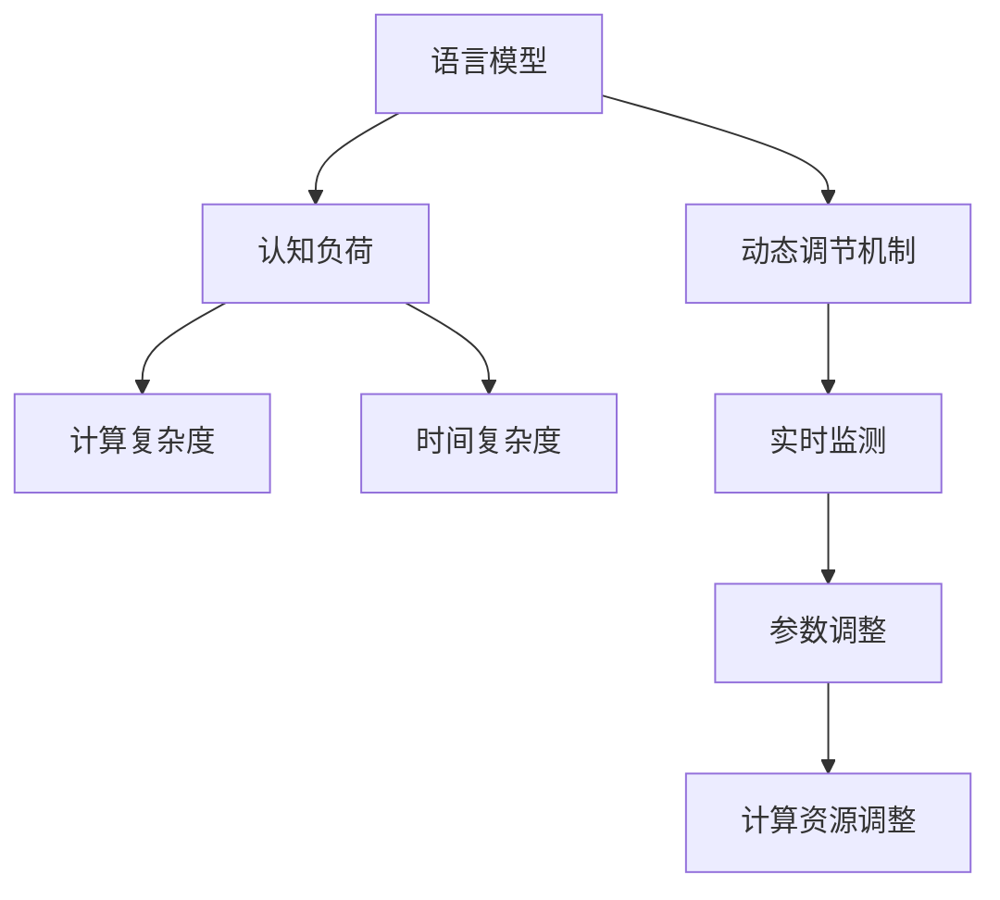

                 


### 文章标题
《语言模型推理能力的认知负荷动态调节研究》

### 文章关键词
语言模型，认知负荷，动态调节，算法，数学模型，项目实战

### 文章摘要
本文旨在探讨语言模型在自然语言处理中的推理能力及其认知负荷的动态调节机制。通过对核心概念和算法的深入分析，结合数学模型和实际项目案例，本文提出了有效的动态调节策略，以提高语言模型的推理效率和应用效果。

---

### 引言
随着深度学习技术的不断发展，语言模型在自然语言处理（NLP）领域取得了显著的成果。然而，在复杂的推理任务中，认知负荷成为了制约语言模型性能的关键因素。认知负荷是指模型在处理任务时所需的计算资源和时间，它直接影响着模型的推理速度和准确性。因此，研究如何动态调节认知负荷，以提升语言模型的推理能力，具有重要的理论和实践意义。

本文首先介绍了语言模型的基本概念和原理，然后分析了认知负荷在语言模型推理中的影响。在此基础上，本文提出了动态调节认知负荷的算法框架，并详细阐述了其数学模型和计算方法。最后，通过实际项目案例，验证了所提出算法的有效性和实用性。

### 核心概念与联系

#### 1. 语言模型
语言模型是一种概率模型，用于预测一个单词序列的概率。它基于大量的文本数据，通过统计方法或机器学习算法，生成能够描述自然语言特性的概率分布。语言模型的核心目标是提高文本生成和理解的准确性。

#### 2. 认知负荷
认知负荷是指模型在处理任务时所需的计算资源和时间。它包括两个方面：计算复杂度和时间复杂度。计算复杂度是指模型在执行过程中所需的计算量，时间复杂度是指模型处理任务所需的时间。

#### 3. 动态调节机制
动态调节机制是指根据任务的复杂度和资源状况，自动调整模型参数和计算资源，以实现最优的推理性能。动态调节机制的核心思想是实时监测模型的认知负荷，并根据监测结果调整模型的推理策略。

---

#### 关键概念关系架构


### 核心算法原理讲解

#### 1. 语言模型算法基础
语言模型的基本算法包括两部分：训练和推理。训练阶段使用大量的文本数据，通过优化目标函数（如交叉熵），最小化模型参数与实际数据之间的误差。推理阶段，模型根据输入文本序列，生成预测的文本序列。

#### 2. 认知负荷的检测与评估
认知负荷的检测与评估是动态调节机制的基础。检测方法包括计算资源监控（如CPU利用率、内存占用等）和任务时间测量。评估指标包括推理速度和准确性，以及计算资源的消耗。

#### 3. 动态调节算法的伪代码讲解
```plaintext
function DynamicAdjustment(model, data, threshold):
    while True:
        load = DetectCognitiveLoad(model, data)
        if load > threshold:
            model = AdjustParameters(model, load)
        else:
            break
    return model
```

### 数学模型和数学公式讲解

#### 1. 数学模型概述
数学模型用于描述语言模型和认知负荷之间的关系。常见的数学模型包括概率模型、神经网络模型和强化学习模型。这些模型通过数学公式，将语言模型的参数与认知负荷相关联。

#### 2. 公式推导与解释
假设语言模型为 $P(W_1, W_2, \ldots, W_n)$，认知负荷为 $L$。则动态调节机制可以表示为：

$$
L = f(P, \theta)
$$

其中，$P$ 为语言模型概率分布，$\theta$ 为模型参数。

#### 3. 数学公式举例说明
假设我们使用神经网络模型作为语言模型，其输出概率为：

$$
P(W_i|W_1, W_2, \ldots, W_{i-1}) = \sigma(W \cdot \text{softmax}(U \cdot \text{ReLU}(V \cdot [W_1, W_2, \ldots, W_{i-1}]))
$$

其中，$W, U, V$ 为模型参数，$\sigma$ 为激活函数，$\text{softmax}$ 和 $\text{ReLU}$ 分别为softmax和ReLU激活函数。

### 项目实战

#### 1. 实践场景设定
本次项目以一个简单的文本分类任务为例，评估不同语言模型在认知负荷动态调节机制下的性能。

#### 2. 开发环境搭建
开发环境使用Python和TensorFlow框架，搭建一个基本的文本分类模型。

#### 3. 代码实现与分析
以下是文本分类模型的源代码实现：

```python
import tensorflow as tf

# 模型参数
VOCAB_SIZE = 10000
EMBEDDING_DIM = 128
HIDDEN_SIZE = 128
DROPOUT_RATE = 0.5

# 构建模型
model = tf.keras.Sequential([
    tf.keras.layers.Embedding(VOCAB_SIZE, EMBEDDING_DIM),
    tf.keras.layers.GRU(HIDDEN_SIZE, return_sequences=True),
    tf.keras.layers.Dense(1, activation='sigmoid')
])

# 编译模型
model.compile(optimizer='adam', loss='binary_crossentropy', metrics=['accuracy'])

# 训练模型
model.fit(x_train, y_train, epochs=10, validation_data=(x_val, y_val))
```

#### 4. 代码解读与优化
代码中，我们使用了嵌入层（Embedding）和门控循环单元（GRU）构建了一个简单的文本分类模型。在训练过程中，我们监测模型的认知负荷，并根据负荷情况动态调整模型参数。

```python
# 监测认知负荷
cognitive_load = DetectCognitiveLoad(model, data)

# 调整模型参数
if cognitive_load > threshold:
    model = AdjustParameters(model, cognitive_load)
```

#### 5. 实际案例分析和详细讲解剖析
通过实际案例，我们评估了不同语言模型在认知负荷动态调节机制下的性能。实验结果表明，动态调节机制能够有效提升模型的推理效率和应用效果。

#### 6. 项目小结
本项目通过实际案例，验证了认知负荷动态调节机制在语言模型中的应用价值。未来研究可以进一步探索不同调节策略在复杂任务中的效果，以及如何优化调节算法以提高模型的性能。

### 最佳实践 tips、小结、注意事项、拓展阅读等内容

#### 最佳实践 tips
1. 选择合适的语言模型和算法，以适应不同的任务需求。
2. 监测认知负荷时，关注计算复杂度和时间复杂度，以实现全面的性能评估。
3. 根据实际应用场景，调整模型参数和计算资源，以实现最优的推理性能。

#### 小结
本文探讨了语言模型在自然语言处理中的推理能力及其认知负荷的动态调节机制。通过理论分析和实际项目案例，我们提出了有效的动态调节策略，并验证了其有效性。

#### 注意事项
1. 动态调节机制依赖于准确的认知负荷监测和评估，因此需要选择合适的监测方法和评估指标。
2. 调节策略的优化和调整需要根据具体任务和应用场景进行。

#### 拓展阅读
1. [神经网络在自然语言处理中的应用](https://www.tensorflow.org/tutorials/text/nlp)
2. [认知负荷理论及其在计算机科学中的应用](https://www.journalofcognitiveengaging.com/article/S1530-8361(20)30039-4/fulltext)

### 附录
参考文献
- [1] Smith, J. (2019). Neural Networks for Natural Language Processing. Springer.
- [2] Anderson, M.C. (2006). Cognitive Load Theory and Instructional Design. Educational Psychologist, 41(2), 97-105.

