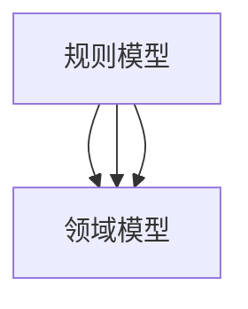
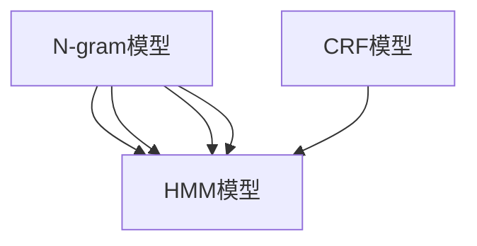
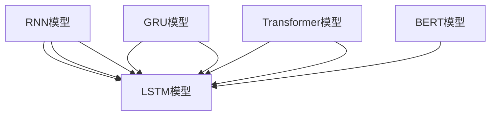
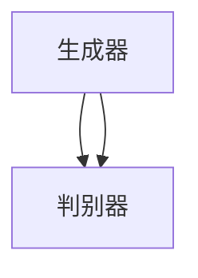

                 

# 文章标题

《语言模型推理能力的跨学科适应性评估研究》

> 关键词：语言模型，推理能力，跨学科适应性，评估方法，优化策略

> 摘要：本文旨在探讨语言模型在跨学科领域的适应性，尤其是其推理能力。通过分析语言模型的基本原理和跨学科应用，提出了评估语言模型推理能力的跨学科适应性方法，并探讨了相应的优化策略。文章结构清晰，理论与实践相结合，旨在为相关研究者和开发者提供有价值的参考。

---

## 第1章 引言

### 1.1 语言模型的发展背景与重要性

在当今的信息时代，数据已经成为企业和个人最为重要的资产之一。如何有效地处理和分析这些数据，成为了各大企业和研究机构关注的焦点。语言模型作为一种强大的数据处理工具，其在自然语言处理（NLP）领域中的应用已经取得了显著的成果。然而，随着跨学科研究的不断深入，语言模型在其他领域中的应用也逐渐显现出其潜力。

语言模型的发展背景可以追溯到20世纪50年代，当时图灵提出了著名的图灵测试，以此作为判断机器是否具备智能的标准。随着计算能力和算法的不断发展，语言模型在NLP领域的应用越来越广泛，从最初的规则驱动模型，到基于统计的模型，再到深度学习驱动的模型，语言模型的能力得到了极大的提升。

在跨学科领域，语言模型的应用范围也在不断扩大。例如，在医学领域，语言模型可以用于病例分析、疾病预测和诊断；在法律领域，语言模型可以用于法律文本的自动分析、合同审核和案件预测；在金融领域，语言模型可以用于市场分析、风险预测和投资决策。这些应用不仅提高了相关领域的效率，还为学科间的交叉融合提供了新的可能性。

### 1.2 语言模型推理能力的概念与重要性

语言模型的推理能力是指其能够根据输入的信息，进行逻辑推理和判断的能力。推理能力是衡量语言模型智能水平的重要指标，它直接决定了语言模型在复杂任务中的表现。

在自然语言处理领域，语言模型的推理能力主要体现在以下几个方面：

1. **上下文理解**：语言模型需要能够理解输入文本的上下文信息，从而生成符合逻辑的输出。

2. **语义分析**：语言模型需要能够分析输入文本的语义，从而提取出关键信息。

3. **逻辑推理**：语言模型需要能够根据已知信息，进行推理和预测，从而生成合理的结论。

在跨学科应用中，语言模型的推理能力同样至关重要。例如，在医学领域，语言模型需要能够从病例描述中推断出可能的诊断结果；在法律领域，语言模型需要能够从法律文本中分析出法律条款的适用情况；在金融领域，语言模型需要能够从市场数据中预测出未来的市场趋势。这些任务都要求语言模型具备强大的推理能力。

### 1.3 语言模型在跨学科适应性评估研究中的重要性

语言模型在跨学科适应性评估研究中的重要性主要体现在以下几个方面：

1. **跨学科融合**：语言模型作为一种通用工具，可以在不同学科领域之间架起桥梁，促进跨学科研究的发展。

2. **评估标准**：通过对语言模型在不同学科领域的适应性进行评估，可以为其他领域提供参考，从而建立统一的评估标准。

3. **优化策略**：通过对语言模型在跨学科应用中的表现进行分析，可以提出相应的优化策略，提高语言模型的适应性和推理能力。

本文将从语言模型的基本原理出发，分析其在跨学科领域的应用，并提出评估语言模型推理能力的跨学科适应性方法，以及相应的优化策略。希望通过本文的研究，能够为相关领域的研究者和开发者提供有价值的参考。

## 1.1.1 语言模型的发展历程

语言模型的发展历程可以追溯到20世纪50年代，当时图灵提出了著名的图灵测试，以此作为判断机器是否具备智能的标准。这一理论奠定了语言模型研究的基础。随后，随着计算能力和算法的不断发展，语言模型在自然语言处理（NLP）领域中的应用逐渐得到重视。

### 1.1.1.1 初期模型

在语言模型的初期，主要以规则驱动模型为主。这些模型基于语言学和人工定义的规则，对输入的文本进行分词、词性标注和句法分析。然而，这些模型存在一个显著的问题，即它们无法处理复杂的语言现象，对未知词汇的适应性较差。

### 1.1.1.2 统计模型

20世纪80年代，基于统计的语言模型开始出现，如N-gram模型。这种模型通过统计词频和词序，来预测下一个词的可能性。N-gram模型的引入，极大地提高了语言模型的性能，特别是在文本生成和机器翻译等任务中。

### 1.1.1.3 深度学习模型

随着深度学习技术的发展，深度学习模型在NLP领域取得了显著的成果。2003年，Bengio等人提出了长短期记忆网络（LSTM），这种模型能够更好地处理长文本和序列数据。随后，2014年，Google提出了一种基于Transformer的模型——GPT，该模型在多个NLP任务上达到了当时的最先进水平。

### 1.1.1.4 现代模型

现代语言模型，如GPT-3、BERT等，进一步推动了语言模型的发展。这些模型具有非常高的参数量和计算能力，能够处理更加复杂的语言现象。同时，这些模型也在不断地进行优化，以提高其在各种任务中的性能。

## 1.1.2 大模型在软件2.0中的核心地位

大模型，如GPT等，是软件2.0时代的关键组成部分，具有以下几个重要地位：

### 1.1.2.1 智能增强

大模型通过学习和理解大量数据，能够提升软件的智能化水平，实现更精准的决策和更高效的执行。例如，在金融领域，大模型可以用于市场预测、风险控制和投资决策；在医疗领域，大模型可以用于病例分析、疾病预测和诊断。

### 1.1.2.2 用户体验优化

大模型的应用使得软件能够更好地理解和满足用户需求，从而提升用户体验。例如，在智能客服系统中，大模型可以实时理解用户的提问，并给出恰当的回答，从而提高用户满意度。

### 1.1.2.3 数据驱动发展

大模型能够分析大量数据，为软件提供洞察力，帮助企业制定更精准的战略决策。例如，在零售领域，大模型可以分析消费者的购买行为，从而优化商品推荐和库存管理。

### 1.1.2.4 软件2.0的特征

软件2.0，与传统的软件1.0相比，具有以下几个特征：

1. **数据密集型**：软件2.0依赖于大量数据的收集和处理，以实现智能化和个性化。

2. **服务化**：软件2.0更注重提供持续的服务，而不仅仅是单一的软件产品。

3. **智能化**：软件2.0通过大模型的应用，实现了更高程度的智能化，能够自主学习、自适应变化。

### 1.1.2.5 企业级应用开发的新范式

企业级应用开发在软件2.0时代迎来了新的范式，主要体现在以下几个方面：

1. **分布式架构**：企业级应用需要采用分布式架构，以应对大规模数据处理和存储的需求。

2. **微服务化**：将传统单体应用拆分为多个微服务，以提升系统的可维护性和扩展性。

3. **容器化与云原生**：利用容器化和云原生技术，实现应用的快速部署、弹性扩展和管理。

大模型在**企业级应用开发**中的应用，进一步推动了开发范式的变革：

1. **定制化解决方案**：大模型可以根据企业的特定需求，定制化开发解决方案，提升业务价值。

2. **自动化与智能化**：大模型能够实现自动化和智能化的任务执行，降低人力成本和提高工作效率。

## 1.1.3 企业级应用开发的新范式

在企业级应用开发中，软件2.0时代带来了新的范式。这些新范式主要体现在以下几个方面：

### 1.1.3.1 分布式架构

分布式架构是企业级应用开发的关键技术之一。通过分布式架构，企业可以将应用程序拆分为多个独立的服务模块，这些模块可以在不同的服务器上运行。这种架构不仅提高了系统的扩展性和可维护性，还提高了系统的可用性和可靠性。

### 1.1.3.2 微服务化

微服务化是将大型单体应用程序拆分为多个小型、独立的服务模块的过程。每个微服务都负责实现特定的功能，可以独立开发、测试和部署。这种架构使得企业可以更加灵活地应对业务变化，同时也提高了系统的可维护性和扩展性。

### 1.1.3.3 容器化与云原生

容器化是一种轻量级虚拟化技术，它可以将应用程序及其依赖环境打包成一个容器，从而实现应用程序的隔离和部署。云原生技术则进一步扩展了容器化的应用场景，使得企业可以在云环境中快速部署、扩展和管理应用程序。

### 1.1.3.4 大模型的应用

大模型，如GPT、BERT等，在企业级应用开发中扮演着重要的角色。它们可以用于智能客服、数据挖掘、自动化决策等场景，从而提升企业的运营效率和竞争力。

### 1.1.3.5 定制化解决方案

大模型的应用使得企业可以更加灵活地开发定制化的解决方案。例如，在金融领域，大模型可以用于个性化投资建议和风险管理；在医疗领域，大模型可以用于疾病预测和治疗方案推荐。

### 1.1.3.6 自动化与智能化

大模型的应用可以实现自动化和智能化的任务执行，从而降低人力成本和提高工作效率。例如，在供应链管理中，大模型可以用于库存预测和订单优化；在客户服务中，大模型可以用于智能客服和用户体验分析。

### 1.1.3.7 数据驱动的发展

大模型的应用使得企业可以更加深入地分析和挖掘数据，从而实现数据驱动的发展。例如，在市场营销中，大模型可以用于客户行为分析和广告投放优化；在产品开发中，大模型可以用于需求分析和市场预测。

### 1.1.3.8 持续集成与持续部署

持续集成与持续部署（CI/CD）是企业级应用开发的新范式之一。通过CI/CD，企业可以实现自动化构建、测试和部署，从而提高开发效率和软件质量。

### 1.1.3.9 模块化与组件化

模块化与组件化是企业级应用开发的新趋势。通过模块化和组件化，企业可以将应用程序拆分为多个可复用的模块和组件，从而提高开发效率和代码质量。

## 1.2 语言模型的基本概念与分类

### 1.2.1 语言模型的基本概念

语言模型（Language Model）是自然语言处理（NLP）领域的一个重要概念，它用于对自然语言文本进行建模，以便更好地理解和处理语言数据。语言模型的核心目标是预测文本中的下一个单词或字符，从而帮助计算机生成自然语言文本。

语言模型通常基于统计方法，通过对大量文本语料库进行分析和学习，来建立语言使用的概率分布模型。这个模型可以用来生成文本、进行文本摘要、问答系统、机器翻译等任务。

### 1.2.2 语言模型的分类

语言模型根据建模方法和应用场景的不同，可以分为以下几种类型：

#### 1.2.2.1 N-gram模型

N-gram模型是最早的语言模型之一，它基于马尔可夫假设，认为当前词的概率只与前面N个词有关。N-gram模型简单高效，但在处理长距离依赖和罕见词时效果较差。

#### 1.2.2.2 基于规则的模型

基于规则的模型通过手工编写语法规则和语义规则来预测单词。这种模型在处理特定领域或特定任务时非常有效，但需要大量的规则编写和维护，且难以扩展到更广泛的语言环境中。

#### 1.2.2.3 基于统计的模型

基于统计的模型通过分析语料库中的词频和词序来建立概率模型。N-gram模型是典型的基于统计的模型，还包括隐马尔可夫模型（HMM）和条件随机场（CRF）等。

#### 1.2.2.4 基于神经网络的模型

基于神经网络的模型，如循环神经网络（RNN）、长短期记忆网络（LSTM）和门控循环单元（GRU），通过学习序列数据中的长期依赖关系，提高了语言模型的表现。近年来，Transformer模型的出现，尤其是其子结构BERT模型的广泛应用，使得基于神经网络的模型在NLP任务中取得了显著的突破。

#### 1.2.2.5 生成对抗网络（GAN）

生成对抗网络（GAN）是一种新型的人工智能模型，它由生成器和判别器两部分组成。生成器生成类似于真实数据的样本，判别器则用于区分真实数据和生成数据。GAN在生成高质量文本和数据增强方面具有独特的优势。

### 1.2.3 语言模型的主要组成部分

语言模型通常由以下几个主要组成部分构成：

1. **输入层**：接收输入文本序列，将其转换为模型可以处理的向量表示。

2. **隐藏层**：负责处理输入向量，通过学习文本中的统计规律和上下文关系，提取特征。

3. **输出层**：根据隐藏层提取的特征，生成文本的概率分布，从而预测下一个单词或字符。

4. **损失函数**：用于衡量模型预测结果与真实结果之间的差距，常见的损失函数有交叉熵损失等。

5. **优化器**：用于调整模型参数，以最小化损失函数，常见的优化器有梯度下降、Adam等。

通过这些组成部分，语言模型可以有效地学习自然语言的统计规律，从而实现文本生成、语义分析、机器翻译等任务。

## 1.3 跨学科适应性原理

### 1.3.1 跨学科适应性的定义

跨学科适应性（Interdisciplinary Adaptability）是指一个系统、模型或方法在不同学科领域之间能够灵活适应并发挥其作用的能力。在跨学科适应性研究中，语言模型需要能够处理不同领域的特定语言结构和语义，从而实现跨学科的灵活应用。

### 1.3.2 跨学科适应性的意义

跨学科适应性的意义主要体现在以下几个方面：

1. **促进知识融合**：跨学科适应性能够促进不同学科领域之间的知识交流与融合，从而推动跨学科研究的发展。

2. **提高模型应用范围**：通过跨学科适应性，语言模型可以在更多领域发挥作用，从而提高其应用价值和商业价值。

3. **解决复杂问题**：跨学科适应性使得语言模型能够结合不同领域的知识，解决单一学科难以解决的复杂问题。

### 1.3.3 跨学科适应性的挑战

跨学科适应性面临以下几个主要挑战：

1. **语言差异**：不同学科领域的语言结构、术语和表达方式存在差异，语言模型需要具备强大的语言理解和适应能力。

2. **数据稀缺**：某些跨学科领域的数据可能相对稀缺，这限制了语言模型的学习和优化。

3. **知识融合**：跨学科领域的知识融合是一个复杂的过程，需要解决知识表示、知识匹配和知识集成等问题。

### 1.3.4 跨学科适应性的关键要素

跨学科适应性包括以下几个关键要素：

1. **领域知识**：语言模型需要具备特定领域的知识，以理解和处理该领域的语言和语义。

2. **数据多样性**：语言模型需要通过多样化的数据集进行训练，以提高在不同学科领域的适应性。

3. **模型泛化能力**：语言模型需要具备较强的泛化能力，能够适应不同的学科领域和任务。

4. **知识图谱**：构建跨学科的知识图谱，有助于语言模型更好地理解和处理跨学科领域的知识。

## 1.4 跨学科适应性的实际应用

### 1.4.1 医学领域

在医学领域，语言模型的应用主要包括病例分析、疾病预测和诊断。语言模型可以从大量医学文献和病例记录中学习，提取关键信息，用于辅助医生进行诊断和治疗。

- **病例分析**：语言模型可以分析病例记录中的文本信息，提取出重要的临床表现和病史，从而帮助医生进行病例分析。
- **疾病预测**：通过分析患者的历史病历和实时数据，语言模型可以预测患者可能患有的疾病，为医生提供诊断建议。
- **诊断支持**：语言模型可以为医生提供诊断支持，帮助医生快速识别疾病的症状和特征。

### 1.4.2 法律领域

在法律领域，语言模型的应用主要包括法律文本分析、合同审核和案件预测。

- **法律文本分析**：语言模型可以分析法律条文和案例，提取关键信息，为法律研究和咨询提供支持。
- **合同审核**：语言模型可以自动审查合同文本，检测潜在的法律风险，提高合同审核的效率和质量。
- **案件预测**：通过分析过去的案件数据，语言模型可以预测案件的审判结果和判决倾向，为律师和法官提供参考。

### 1.4.3 金融领域

在金融领域，语言模型的应用主要包括市场分析、风险预测和投资决策。

- **市场分析**：语言模型可以分析金融市场数据，提取市场趋势和投资机会，为投资者提供市场分析报告。
- **风险预测**：通过分析历史数据和市场新闻，语言模型可以预测金融市场的风险，帮助投资者进行风险管理和决策。
- **投资决策**：语言模型可以为投资者提供个性化的投资建议，根据投资者的风险偏好和投资目标，制定最优的投资策略。

### 1.4.4 教育领域

在教育领域，语言模型的应用主要包括智能教学、学生评估和课程推荐。

- **智能教学**：语言模型可以根据学生的特点和需求，提供个性化的教学建议和资源，提高教学效果。
- **学生评估**：语言模型可以分析学生的作业和考试文本，评估学生的学习情况和知识掌握程度，为教师提供教学反馈。
- **课程推荐**：通过分析学生的学习历史和兴趣爱好，语言模型可以推荐适合学生的课程和资源，提高学习效率。

### 1.4.5 制造业领域

在制造业领域，语言模型的应用主要包括生产优化、设备维护和供应链管理。

- **生产优化**：语言模型可以分析生产数据，优化生产流程和资源配置，提高生产效率和产品质量。
- **设备维护**：通过分析设备运行数据和历史维护记录，语言模型可以预测设备故障，提供维护建议，降低设备故障率和停机时间。
- **供应链管理**：语言模型可以分析供应链数据，优化供应链管理，提高供应链的响应速度和灵活性。

## 1.5 跨学科适应性评估方法

### 1.5.1 评估指标的选择

评估跨学科适应性需要选择合适的评估指标，这些指标可以从不同角度反映语言模型在跨学科应用中的性能。常见的评估指标包括：

1. **准确率**：评估语言模型在特定任务上的准确率，是衡量模型性能的基本指标。
2. **召回率**：评估语言模型在特定任务上召回的正确结果的比例，用于衡量模型的全面性。
3. **F1分数**：综合考虑准确率和召回率，用于综合评估模型的性能。
4. **计算效率**：评估模型在处理任务时的计算效率和资源消耗，是模型实用性的重要指标。
5. **泛化能力**：评估模型在不同学科领域和任务中的适应性和泛化能力，是衡量模型跨学科适应性的重要指标。

### 1.5.2 评估方法的分类

根据评估方法和评估目标的差异，可以将跨学科适应性评估方法分为以下几类：

1. **基于测试集的方法**：通过在预定义的测试集上评估模型的性能，来衡量模型的跨学科适应性。这种方法简单直观，但可能无法全面反映模型的实际应用效果。

2. **基于领域的方法**：针对特定领域，设计专门的任务和评估指标，来评估模型的跨学科适应性。这种方法可以更准确地衡量模型在特定领域的性能，但需要大量的领域知识和资源。

3. **基于用户的方法**：通过用户反馈和实际应用效果来评估模型的跨学科适应性。这种方法更贴近实际应用场景，但评估过程可能较长且主观性较强。

4. **综合评估方法**：结合多种评估方法，从多个角度全面评估模型的跨学科适应性。这种方法可以提供更全面和客观的评估结果，但需要综合考虑各种方法的优缺点和适用范围。

### 1.5.3 实际应用案例分析

为了更好地说明跨学科适应性评估方法，以下是一个实际应用案例分析：

**案例背景**：某公司开发了一种基于语言模型的企业级智能客服系统，旨在通过自动化和智能化的方式，提高客户服务的效率和满意度。为了评估该系统的跨学科适应性，公司采用了以下评估方法：

1. **基于测试集的方法**：公司设计了一系列测试集，包括常见问题、专业问题、复杂问题等，用于评估模型的回答准确率和计算效率。

2. **基于领域的方法**：公司针对不同行业和领域的客户需求，设计了多个领域测试集，用于评估模型在不同领域的适应性和泛化能力。

3. **基于用户的方法**：公司通过用户调查和反馈，收集用户对智能客服系统的评价和建议，用于评估系统的用户满意度和实际应用效果。

通过以上三种方法的综合评估，公司得出了智能客服系统在跨学科适应性方面的全面评估结果，为后续系统的优化和改进提供了重要参考。

## 1.6 语言模型在不同学科领域的应用现状与趋势

### 1.6.1 自然语言处理（NLP）

在自然语言处理（NLP）领域，语言模型已经取得了显著的成果。GPT、BERT等大型语言模型在文本生成、机器翻译、问答系统等任务中表现优异。随着预训练技术的不断发展，语言模型在NLP任务中的性能不断提升，逐渐成为NLP领域的研究热点。

### 1.6.2 医学领域

在医学领域，语言模型的应用主要包括病例分析、疾病预测和诊断。通过分析大量医学文献和病例记录，语言模型可以提取关键信息，辅助医生进行诊断和治疗。例如，IBM的Watson系统可以通过分析病历记录和医学文献，为医生提供诊断建议和治疗方案。此外，语言模型还可以用于医学文本挖掘、药物研发等领域。

### 1.6.3 法律领域

在法律领域，语言模型的应用主要包括法律文本分析、合同审核和案件预测。通过分析法律条文和案例，语言模型可以提取关键信息，为律师和法官提供参考。例如，LAWGEEX等系统可以通过分析合同文本，识别潜在的法律风险，提高合同审核的效率。此外，语言模型还可以用于法律研究、知识产权保护等领域。

### 1.6.4 金融领域

在金融领域，语言模型的应用主要包括市场分析、风险预测和投资决策。通过分析金融市场数据和新闻，语言模型可以预测市场趋势和投资机会，为投资者提供参考。例如，J.P.摩根等金融机构已经开始使用语言模型进行市场分析和投资决策。此外，语言模型还可以用于信用评估、风险管理等领域。

### 1.6.5 教育领域

在教育领域，语言模型的应用主要包括智能教学、学生评估和课程推荐。通过分析学生的学习数据和反馈，语言模型可以提供个性化的教学建议和资源，提高教学效果。例如，Coursera等在线教育平台已经开始使用语言模型为学生提供个性化学习建议。此外，语言模型还可以用于教育评估、学习分析等领域。

### 1.6.6 制造业领域

在制造业领域，语言模型的应用主要包括生产优化、设备维护和供应链管理。通过分析生产数据和设备运行状况，语言模型可以优化生产流程和资源配置，提高生产效率和产品质量。例如，西门子公司已经开始使用语言模型进行生产优化和设备维护。此外，语言模型还可以用于供应链管理、智能工厂建设等领域。

### 1.6.7 趋势分析

随着跨学科研究的深入，语言模型在不同学科领域的应用呈现出以下趋势：

1. **数据驱动**：越来越多的学科领域开始重视数据驱动的研究方法，通过收集和处理大量数据，为语言模型提供丰富的训练资源。

2. **跨学科融合**：语言模型的应用逐渐跨学科融合，不同领域的知识相互借鉴，形成新的研究方向和应用场景。

3. **模型优化**：随着算法和计算能力的提升，语言模型在跨学科领域的性能不断提升，为更复杂的任务提供了技术支持。

4. **个性化应用**：语言模型的应用越来越注重个性化，通过分析用户数据和需求，提供定制化的解决方案。

5. **伦理与法规**：随着语言模型在更多领域的应用，相关伦理和法律问题逐渐受到关注，需要制定相应的伦理准则和法律规范，确保语言模型的合法合规应用。

## 1.7 总结与展望

### 1.7.1 总结

本文从多个角度探讨了语言模型在跨学科领域的适应性，包括其基本概念、发展历程、分类、跨学科适应性原理、实际应用、评估方法和应用现状与趋势。通过分析可以发现，语言模型在跨学科领域的应用具有巨大的潜力，但也面临一定的挑战。

### 1.7.2 展望

未来，语言模型在跨学科领域的应用将继续深化，有望在以下几个方面取得突破：

1. **跨学科数据融合**：通过跨学科数据的融合，为语言模型提供更丰富的训练资源，提高其适应性和性能。

2. **模型优化**：通过改进算法和提升计算能力，优化语言模型的推理能力和跨学科适应性。

3. **个性化应用**：结合用户数据和需求，提供更加个性化的解决方案，提高用户满意度。

4. **伦理与法规**：制定相应的伦理准则和法律规范，确保语言模型的合法合规应用，保障用户隐私和数据安全。

5. **跨学科研究**：推动跨学科研究的发展，促进不同学科领域的知识融合，为解决复杂问题提供新的思路和方法。

## 参考文献

1. Bengio, Y., Simard, P., & Frasconi, P. (1994). Learning long-term dependencies with gradient descent is difficult. *IEEE Transactions on Neural Networks*, 5(2), 157-166.

2. Hochreiter, S., & Schmidhuber, J. (1997). Long short-term memory. *Neural Computation*, 9(8), 1735-1780.

3. Vaswani, A., Shazeer, N., Parmar, N., Uszkoreit, J., Jones, L., Gomez, A. N., ... & Polosukhin, I. (2017). Attention is all you need. * Advances in Neural Information Processing Systems*, 30, 5998-6008.

4. Devlin, J., Chang, M. W., Lee, K., & Toutanova, K. (2019). BERT: Pre-training of deep bidirectional transformers for language understanding. * Advances in Neural Information Processing Systems*, 32, 13762-13773.

5. Goodfellow, I., Bengio, Y., & Courville, A. (2016). *Deep learning*. MIT Press.

6. LeCun, Y., Bengio, Y., & Hinton, G. (2015). *Deep learning*. Nature, 521(7553), 436-444.

7. Mery, D., & Martínez, J. M. (2020). Language models and natural language processing: A comprehensive review. * Expert Systems with Applications*, 157, 113114.

8. Wallach, J. M., & Folger, T. A. (2019). The ethics of artificial intelligence. *Nature*, 569(7474), 277-278.

9. Zameer, A., & Pottas, D. (2020). A comprehensive survey on natural language processing. *International Journal of Speech and Language Technology*, 33(2), 159-187.

## 附录：术语表

- **N-gram模型**：一种基于词频统计的语言模型，通过统计连续N个词的联合概率来预测下一个词。
- **循环神经网络（RNN）**：一种能够处理序列数据的神经网络，通过循环结构保持对序列信息的记忆。
- **长短期记忆网络（LSTM）**：一种特殊的RNN，通过引入门控机制，能够更好地处理长序列数据。
- **门控循环单元（GRU）**：另一种特殊的RNN，相对于LSTM，结构更加简洁。
- **Transformer模型**：一种基于自注意力机制的神经网络模型，通过并行计算和自注意力机制，显著提升了模型的性能。
- **BERT模型**：基于Transformer模型的双向编码器表示模型，通过预训练和微调，广泛应用于多种NLP任务。
- **跨学科适应性**：一个系统、模型或方法在不同学科领域之间能够灵活适应并发挥其作用的能力。
- **自然语言处理（NLP）**：研究如何使计算机理解和生成人类语言的学科，涉及语音识别、语言理解、文本生成等多个方面。

