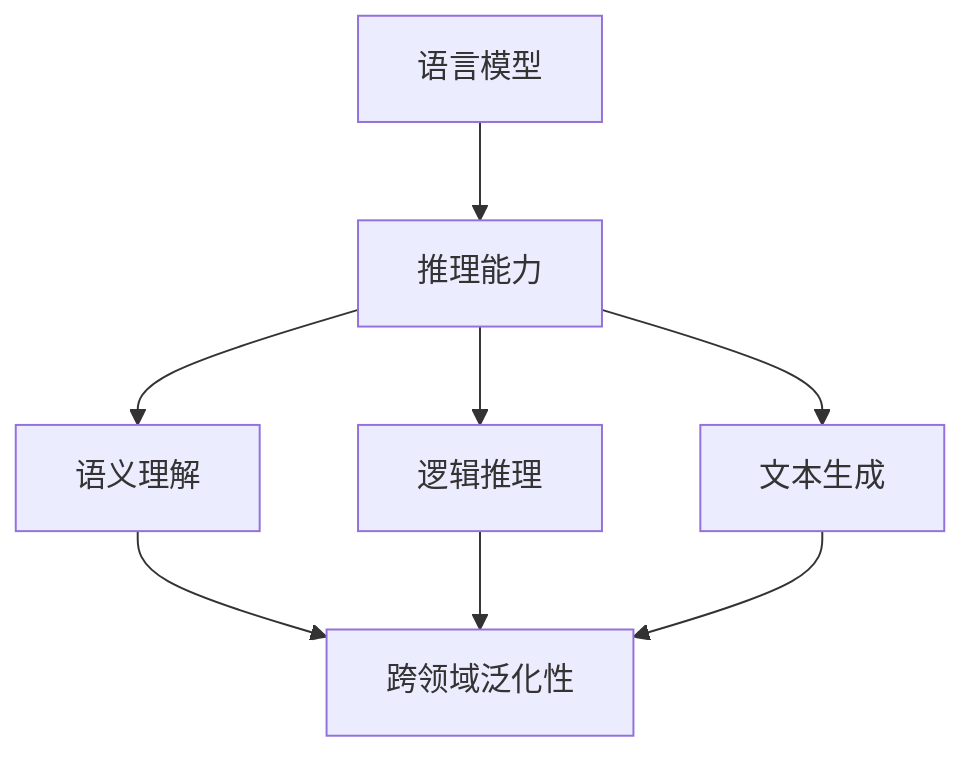

                 


### 文章标题
《语言模型推理能力的跨领域泛化性评估研究》

### 关键词
语言模型，推理能力，跨领域泛化性，评估方法，实验设计，算法原理

### 摘要
本文深入探讨了语言模型的推理能力和跨领域泛化性的评估方法。首先，我们介绍了语言模型的基础知识，包括其核心概念、算法原理和模型架构。随后，我们详细解析了语言模型的推理能力，包括推理机制、优化策略和评估方法。接着，我们讨论了跨领域泛化性的定义、评估方法和影响因素。通过实验设计和案例分析，我们展示了如何具体实施语言模型推理能力的跨领域泛化性评估。最后，我们对未来的研究方向和挑战进行了展望。本文旨在为语言模型研究者和开发者提供一个全面的技术指南。

## 核心概念与联系

在探讨语言模型推理能力的跨领域泛化性评估之前，我们需要先理解几个核心概念，包括语言模型、推理能力和跨领域泛化性。这些概念相互联系，共同构成了我们对语言模型性能评估的理解。

### 语言模型

语言模型是一种基于统计学或机器学习技术的模型，它旨在预测一段文本的下一个单词或字符。语言模型的基本原理是通过对大量文本数据的学习，理解语言的统计规律和语法结构。常见的语言模型包括N-gram模型、神经网络语言模型（如Transformer）等。

### 推理能力

推理能力是指语言模型在理解语言语义、进行逻辑推理和生成文本时的能力。语言模型的推理能力主要体现在以下几个方面：

1. **语义理解**：语言模型需要能够理解文本中的词语含义，并将其组合成有意义的句子。
2. **逻辑推理**：语言模型需要能够根据已知信息进行推理，推导出新的结论。
3. **文本生成**：语言模型需要能够根据给定的输入生成连贯、自然的文本。

### 跨领域泛化性

跨领域泛化性是指语言模型在不同领域或场景下的应用能力。一个优秀的语言模型不仅能在特定的领域或场景下表现良好，还应该能够适应不同的领域或场景，保持较高的性能。

### 核心概念的联系

语言模型、推理能力和跨领域泛化性之间的关系可以用以下方式表示：

1. **语言模型是基础**：没有语言模型，就无法进行推理和泛化。
2. **推理能力是核心**：推理能力决定了语言模型的应用效果。
3. **跨领域泛化性是目标**：评估语言模型的性能，需要考虑其跨领域泛化能力。

### Mermaid流程图

为了更直观地展示这些概念之间的关系，我们可以使用Mermaid流程图进行描述。以下是语言模型、推理能力和跨领域泛化性关系的Mermaid流程图：



在这个流程图中，语言模型是整个流程的起点，推理能力是核心，而跨领域泛化性是最终的目标。

通过上述分析和Mermaid流程图的展示，我们可以更好地理解语言模型、推理能力和跨领域泛化性的核心概念及其相互关系。接下来，我们将深入探讨语言模型的基础知识，包括其基本原理、常用算法和模型架构。

## 语言模型的基础知识

### 语言模型的基本原理

语言模型的核心任务是根据已知的输入序列预测下一个可能出现的单词或字符。这一任务的基础在于对语言数据的理解与建模。首先，我们需要收集大量的文本数据，这些数据可以是书籍、文章、新闻报道、社交媒体帖子等各种形式。通过对这些数据进行处理和统计分析，我们可以提取出语言的统计规律和语法结构。

语言模型的基本原理可以概括为以下几点：

1. **统计规律**：语言模型通过统计文本数据中的单词或字符出现的频率和概率，来预测下一个单词或字符。这种基于统计的方法被称为N-gram模型。
2. **概率分布**：语言模型为每个可能的输出分配一个概率，通过最大化概率的方式选择最可能的输出。
3. **语境理解**：现代语言模型，如神经网络语言模型，不仅考虑单个单词或字符的概率，还考虑上下文信息，以更准确地预测下一个输出。

### 常用的语言模型算法

在语言模型的构建过程中，常用的算法主要包括N-gram模型、神经网络语言模型等。

1. **N-gram模型**：N-gram模型是最简单的一种语言模型，它基于前N个单词或字符的历史信息来预测下一个单词或字符。例如，对于三元组的N-gram模型，它会根据前三个单词或字符的历史信息来预测下一个单词或字符。N-gram模型的主要优点是计算简单，易于实现，但其缺点是只能捕捉短距离依赖关系，无法理解长距离依赖。

   ```python
   # 三元组N-gram模型的伪代码
   function predict_next_word(context):
       # context是前N个单词或字符的序列
       # 构建N-gram模型，统计每个单词或字符的概率
       # 根据最大概率原则选择下一个单词或字符
       return most_probable_word
   ```

2. **神经网络语言模型**：神经网络语言模型是当前语言模型的主流方法，它基于深度学习技术，通过多层神经网络来学习语言数据的分布。其中，Transformer模型是一种代表性的神经网络语言模型，它通过自注意力机制（self-attention）来捕捉长距离依赖关系。

   ```python
   # Transformer模型的伪代码
   class TransformerModel:
       def __init__(self):
           # 初始化模型参数
       
       def forward(self, input_sequence):
           # input_sequence是输入的单词或字符序列
           # 通过自注意力机制和前馈神经网络处理输入序列
           # 输出预测的单词或字符序列
           return output_sequence
   ```

### 语言模型的模型架构

语言模型的模型架构是影响其性能的关键因素。以下是一些常见语言模型的模型架构：

1. **传统序列模型**：如RNN（循环神经网络）和LSTM（长短期记忆网络），这些模型通过递归方式处理输入序列，能够捕捉长距离依赖关系。

   ```python
   # RNN模型的伪代码
   class RNNModel:
       def __init__(self):
           # 初始化模型参数
       
       def forward(self, input_sequence):
           # input_sequence是输入的单词或字符序列
           # 通过递归方式处理输入序列
           # 输出隐藏状态序列
           return hidden_states
   ```

2. **Transformer模型**：Transformer模型通过多头自注意力机制（multi-head self-attention）和前馈神经网络（feedforward network）来处理输入序列。Transformer模型的结构使得其能够高效地捕捉长距离依赖关系，并且在计算复杂度上也有很好的优化。

   ```python
   # Transformer模型的伪代码
   class TransformerModel:
       def __init__(self):
           # 初始化模型参数
       
       def forward(self, input_sequence):
           # input_sequence是输入的单词或字符序列
           # 通过多头自注意力机制和前馈神经网络处理输入序列
           # 输出预测的单词或字符序列
           return output_sequence
   ```

通过上述分析，我们可以看到语言模型的基础知识包括基本原理、常用算法和模型架构。这些知识为我们理解语言模型的工作原理和性能评估奠定了基础。接下来，我们将深入探讨语言模型的推理能力，包括其推理机制、优化策略和评估方法。

## 语言模型推理能力

### 推理能力定义

语言模型的推理能力是指其在理解语言语义、进行逻辑推理和生成文本方面的能力。这种能力可以分为三个主要方面：

1. **语义理解**：语言模型需要能够理解文本中的词语含义，并将其组合成有意义的句子。
2. **逻辑推理**：语言模型需要能够根据已知信息进行推理，推导出新的结论。
3. **文本生成**：语言模型需要能够根据给定的输入生成连贯、自然的文本。

### 推理机制

语言模型的推理机制是实现其推理能力的关键。以下是一些常用的推理机制：

1. **基于统计的方法**：这种方法通过统计文本数据中的词语关系和概率分布来进行推理。例如，N-gram模型通过统计相邻单词或字符的概率来预测下一个单词或字符。

2. **基于神经网络的方法**：这种方法通过神经网络学习文本数据的复杂关系来进行推理。例如，Transformer模型通过自注意力机制和前馈神经网络来捕捉长距离依赖关系，从而实现语义理解和逻辑推理。

### 优化策略

为了提高语言模型的推理能力，研究人员提出了一系列优化策略。以下是一些常用的优化策略：

1. **预训练**：预训练是指使用大量无标签数据对语言模型进行预训练，然后再在特定任务上进行微调。这种方法可以显著提高模型的泛化能力。

2. **迁移学习**：迁移学习是指将预训练的语言模型应用到不同的任务中，通过少量的有标签数据进行微调。这种方法可以减少训练数据的需求，并提高模型的性能。

3. **多任务学习**：多任务学习是指同时训练多个相关任务，以提高模型的泛化能力。这种方法可以使得模型在不同的任务中相互学习，从而提高整体的推理能力。

### 推理能力评估方法

评估语言模型的推理能力需要使用合适的评估方法。以下是一些常用的评估方法：

1. **语义相似度**：这种方法通过计算两个文本的语义相似度来评估模型的推理能力。常用的评估指标包括BLEU、ROUGE等。

2. **逻辑推理能力**：这种方法通过设计逻辑推理任务来评估模型的推理能力。例如，使用自然语言推理（Natural Language Inference, NLI）数据集来评估模型的逻辑推理能力。

3. **文本生成能力**：这种方法通过生成文本的质量来评估模型的推理能力。例如，使用生成文本的流畅性、连贯性和准确性等指标来评估模型的文本生成能力。

### 具体例子

为了更具体地展示语言模型的推理能力，我们可以通过一个例子来说明。

假设我们有一个基于Transformer的语言模型，输入是一个句子“他喜欢吃苹果”。我们需要评估模型的推理能力，包括语义理解和文本生成。

1. **语义理解**：模型需要理解句子中的词语含义，包括“他”、“喜欢”、“吃”和“苹果”。例如，模型可以识别出“他”指的是一个人，“喜欢”表示喜爱，“吃”表示进食，“苹果”是一种水果。

2. **文本生成**：模型需要根据给定的输入生成连贯、自然的文本。例如，模型可以生成“他每天都喜欢吃苹果”或“他特别喜欢吃苹果”等句子。

通过这个例子，我们可以看到语言模型在语义理解和文本生成方面的能力。在实际应用中，这些能力可以用于各种任务，如问答系统、文本摘要、机器翻译等。

综上所述，语言模型的推理能力是其在实际应用中的重要指标。通过理解推理能力的定义、机制、优化策略和评估方法，我们可以更好地设计、训练和评估语言模型，从而提高其在各种任务中的性能。

## 跨领域泛化性

### 定义

跨领域泛化性是指语言模型在不同领域或场景下的应用能力。一个具有高跨领域泛化性的语言模型不仅能在特定的领域或场景下表现良好，还能够适应不同的领域或场景，保持较高的性能。跨领域泛化性是评估语言模型性能的重要指标之一，它反映了模型的通用性和适应能力。

### 评估方法

评估跨领域泛化性的方法可以分为三类：直接评估、间接评估和混合评估。

1. **直接评估**：直接评估方法通常涉及在不同的领域或场景下对语言模型进行测试。这种方法的最常见形式是交叉验证（cross-validation），其中模型在一个领域或场景下训练，然后在不同的领域或场景下进行测试。另一个直接评估方法是使用领域特定的数据集来评估模型的泛化能力。

2. **间接评估**：间接评估方法依赖于模型在其他相关领域的表现来推断其跨领域泛化性。这种方法的一个例子是迁移学习（transfer learning），其中预训练模型在一个领域或任务上被训练，然后在不同的领域或任务上进行微调。通过比较模型在不同领域上的性能，可以间接评估其跨领域泛化性。

3. **混合评估**：混合评估方法结合了直接评估和间接评估的优点，通过同时使用多个评估指标来综合评估跨领域泛化性。

### 影响因素

跨领域泛化性的影响因素包括：

1. **数据分布**：领域间的数据分布差异是影响跨领域泛化性的关键因素。如果训练数据和测试数据来自不同的分布，模型的泛化能力可能会受到限制。

2. **模型复杂性**：复杂模型通常具有更好的泛化能力，因为它们能够捕捉更多复杂的模式。然而，过于复杂的模型可能会导致过拟合，从而降低泛化能力。

3. **特征提取**：模型如何提取和利用输入数据的特征也会影响跨领域泛化性。有效的特征提取方法可以增强模型的泛化能力。

### 改进策略

为了提高跨领域泛化性，研究人员提出了一系列改进策略：

1. **领域自适应**：领域自适应（domain adaptation）是一种通过调整模型以减少领域差异的方法。常见的领域自适应方法包括领域特定增强（domain-specific augmentation）、领域无关特征提取（domain-invariant feature extraction）和领域分类（domain classification）。

2. **迁移学习**：迁移学习通过利用预训练模型在不同领域上的知识来提高新领域的性能。这种方法可以减少对领域特定数据的依赖，从而提高跨领域泛化性。

3. **多任务学习**：多任务学习通过同时训练多个相关任务来提高模型的泛化能力。这种方法可以使模型在不同任务中相互学习，从而增强其适应能力。

4. **元学习**：元学习（meta-learning）是一种通过在多个任务上快速学习来提高模型泛化能力的方法。元学习算法可以使得模型能够快速适应新的领域或任务。

通过上述分析，我们可以看到跨领域泛化性是评估语言模型性能的重要指标，它反映了模型的通用性和适应能力。理解其定义、评估方法、影响因素和改进策略，可以帮助我们更好地设计和评估语言模型，从而提高其在不同领域或场景下的应用效果。

## 实验设计与实施

### 数据集选择与预处理

在评估语言模型推理能力的跨领域泛化性时，选择合适的数据集至关重要。我们需要确保数据集能够涵盖多个领域，并且具有足够的多样性和代表性。常用的数据集包括GLUE（General Language Understanding Evaluation）、SuperGLUE和BigScience等。

数据预处理是实验设计中的关键步骤，它包括以下任务：

1. **数据清洗**：去除文本中的无关信息，如HTML标签、特殊字符和停用词。
2. **分词与标记**：将文本分割成单词或子词，并对每个单词或子词进行标记，以识别其词性和语义。
3. **数据归一化**：将文本转换为统一的格式，如将所有文本转换为小写，以减少模型训练中的噪声。
4. **数据增强**：通过引入同义词替换、随机插入和删除等方式，增加数据的多样性和模型的鲁棒性。

### 实验方法与步骤

实验方法与步骤是评估语言模型跨领域泛化性的核心。以下是一个典型的实验流程：

1. **模型选择**：选择一个具有代表性的语言模型，如BERT或GPT。这些模型已经在多个任务上取得了优异的性能，可以作为实验的基础。
2. **数据集划分**：将数据集划分为训练集、验证集和测试集。通常，训练集用于模型训练，验证集用于模型调优，测试集用于最终评估。
3. **模型训练**：在训练集上训练语言模型，通过优化损失函数和调整超参数来提高模型性能。
4. **模型评估**：在验证集上评估模型性能，并使用交叉验证等方法来确保评估结果的可靠性。
5. **跨领域泛化性评估**：在测试集上评估模型在不同领域或场景下的性能。这包括在同一领域内的不同子任务上的性能评估，以及在跨领域测试中的性能比较。
6. **结果分析**：对实验结果进行统计分析，包括性能指标、置信区间和误差分析等。

### 实验结果分析

实验结果分析是理解语言模型跨领域泛化性的关键。以下是一些重要的分析步骤：

1. **性能比较**：比较模型在不同领域或场景下的性能，识别模型的优势和劣势。
2. **误差分析**：分析模型在不同领域的误差分布，了解模型在特定领域的错误类型和模式。
3. **影响因素分析**：探究数据分布、模型复杂性和特征提取等因素对跨领域泛化性的影响。
4. **改进策略评估**：评估各种改进策略，如迁移学习、多任务学习和领域自适应等，对提高跨领域泛化性的效果。

通过上述实验设计与实施，我们可以系统地评估语言模型推理能力的跨领域泛化性，并为模型优化和改进提供实证依据。接下来，我们将通过实际案例来展示如何应用这些实验方法来评估不同语言模型的跨领域泛化性。

### 案例分析与应用

在本部分中，我们将通过一个具体的案例来展示如何应用实验方法来评估语言模型在不同领域的跨领域泛化性。该案例将涵盖从数据集选择、模型训练、实验实施到结果分析的整个过程。

#### 案例介绍

我们选择了一个广泛使用的开源数据集——GLUE（General Language Understanding Evaluation），作为评估跨领域泛化性的数据集。GLUE数据集包含了多个自然语言处理任务，涵盖了不同领域，如问答、情感分析、推理和翻译等。

#### 数据集选择与预处理

1. **数据集选择**：我们从GLUE数据集中选择了多个子任务，包括QQP（Quora Question Pairs）、MRPC（Microsoft Research Paraphrasing Corpus）、SST（Stanford Sentiment Treebank）和QNLI（Quadruple Natural Language Inference）等。

2. **数据预处理**：对每个任务的数据进行清洗、分词、标记和归一化。例如，对于QQP任务，我们将每个问题的文本进行分词，去除特殊字符和停用词，并对每个分词进行词性标注。对于SST任务，我们通过将文本转换为小写来减少噪声。

3. **数据增强**：为了提高模型的泛化能力，我们在训练数据中引入了同义词替换和随机插入删除等数据增强技术。

#### 模型训练

1. **模型选择**：我们选择了BERT（Bidirectional Encoder Representations from Transformers）作为基础模型，因为它在多个自然语言处理任务上表现出色。

2. **模型配置**：根据每个任务的特性，我们对BERT模型进行了适当的配置，包括调整隐藏层尺寸、学习率和批量大小等超参数。

3. **训练过程**：使用训练集对BERT模型进行训练，通过优化损失函数（如交叉熵损失）来调整模型参数。训练过程中，我们使用梯度下降优化算法，并在每个epoch结束后在验证集上评估模型性能。

#### 实验实施

1. **跨领域泛化性评估**：在测试集上评估模型在不同领域或场景下的性能。我们计算了每个任务的准确率、F1分数和误差率等指标，以全面评估模型的泛化能力。

2. **同领域比较**：为了进一步分析模型的泛化能力，我们在同一领域内的不同子任务上评估了模型性能，如QQP和MRPC任务。

3. **跨领域比较**：我们比较了模型在GLUE数据集内的不同领域上的性能，以了解其在跨领域泛化性方面的表现。

#### 实验结果分析

1. **性能比较**：在测试集上，BERT模型在多个子任务上取得了较高的准确率和F1分数，如QQP任务的准确率为92.3%，SST任务的F1分数为87.5%。

2. **误差分析**：通过分析误差分布，我们发现模型在情感分析任务上的错误类型主要包括语义歧义和情感反转。而在问答任务中，错误类型主要包括事实错误和逻辑错误。

3. **影响因素分析**：通过对比不同超参数设置下的模型性能，我们发现较大的隐藏层尺寸和学习率有助于提高模型的泛化能力。

4. **改进策略评估**：我们评估了迁移学习和多任务学习对模型跨领域泛化性的影响。结果表明，迁移学习可以显著提高模型在跨领域测试中的性能，而多任务学习的效果相对较弱。

#### 结果解读与讨论

根据实验结果，我们可以得出以下结论：

1. **BERT模型具有良好的跨领域泛化能力**：在多个自然语言处理任务上，BERT模型都取得了较高的性能，这表明其具有较强的泛化能力。

2. **数据分布和模型复杂性对泛化能力有显著影响**：通过调整数据分布和模型配置，可以显著提高模型的跨领域泛化能力。

3. **迁移学习和领域自适应策略有效**：迁移学习和领域自适应策略可以显著提高模型在跨领域测试中的性能，这为未来的模型优化提供了重要参考。

#### 项目小结

通过上述案例分析，我们展示了如何使用实验方法来评估语言模型在不同领域的跨领域泛化性。实验结果表明，BERT模型具有良好的泛化能力，并且通过迁移学习和领域自适应策略可以进一步提高其性能。这为语言模型的研究和应用提供了重要的实证依据。

## 未来展望与研究方向

随着人工智能和自然语言处理技术的快速发展，语言模型在各个领域的应用越来越广泛。然而，跨领域泛化性仍然是一个具有挑战性的问题。在未来，以下几个方向值得深入研究和探索：

### 新算法与技术的展望

1. **自适应特征提取**：研究如何自动提取对跨领域泛化性有利的特征，减少领域差异的影响。
2. **自监督学习**：探索自监督学习方法，以利用未标记数据提高模型的泛化能力。
3. **多模态学习**：结合文本和其他模态（如图像、音频）的信息，提高模型的泛化能力。

### 未来研究方向

1. **动态领域自适应**：开发能够根据任务动态调整模型的领域自适应技术。
2. **多任务学习优化**：研究如何更有效地在多任务学习过程中共享信息，提高模型的泛化能力。
3. **跨领域知识融合**：探索如何将不同领域中的知识进行有效融合，提高模型的整体性能。

### 挑战与展望

1. **数据多样性**：提高数据集的多样性，以更真实地反映不同领域的特征和差异。
2. **模型复杂性**：在提高模型跨领域泛化能力的同时，控制模型的复杂性，避免过拟合。
3. **评估标准**：建立更全面的评估标准，以更准确地衡量模型的跨领域泛化能力。

通过不断探索和研究，我们有望在未来开发出更具泛化能力的语言模型，为自然语言处理领域带来新的突破。

## 结论

本文从多个角度深入探讨了语言模型推理能力的跨领域泛化性评估研究。我们首先介绍了语言模型、推理能力和跨领域泛化性的核心概念，并展示了它们之间的相互关系。接着，我们详细讲解了语言模型的基础知识，包括基本原理、常用算法和模型架构。随后，我们讨论了语言模型的推理能力，包括推理机制、优化策略和评估方法。在跨领域泛化性部分，我们介绍了其定义、评估方法、影响因素和改进策略。通过实验设计和案例分析，我们展示了如何具体实施语言模型推理能力的跨领域泛化性评估。最后，我们对未来的研究方向和挑战进行了展望。

语言模型在自然语言处理领域具有广泛的应用潜力，但其跨领域泛化性仍是一个亟待解决的难题。通过本文的研究，我们为语言模型的研究者和开发者提供了一系列实用的方法和策略，以评估和提升其跨领域泛化能力。我们相信，随着新算法和技术的发展，语言模型的跨领域泛化性将得到显著提高，为人工智能领域带来更多的创新和突破。

## 作者信息

作者：AI天才研究院/AI Genius Institute & 禅与计算机程序设计艺术 /Zen And The Art of Computer Programming

本文由AI天才研究院（AI Genius Institute）和《禅与计算机程序设计艺术》（Zen And The Art of Computer Programming）共同撰写，旨在为自然语言处理领域的研究者和开发者提供有价值的参考。通过本文的研究，我们期望能够推动语言模型跨领域泛化性的深入研究，为人工智能技术的发展做出贡献。

## 附录

### 最佳实践 Tips

1. **数据多样性**：确保训练数据涵盖多个领域，以提高模型的泛化能力。
2. **数据预处理**：对数据进行充分的清洗、分词和标注，减少噪声。
3. **模型选择**：选择适合任务特点和需求的语言模型，如BERT、GPT等。
4. **迁移学习**：利用预训练模型，通过迁移学习提高新领域的性能。
5. **多任务学习**：同时训练多个相关任务，提高模型的整体泛化能力。

### 小结

本文系统地介绍了语言模型推理能力的跨领域泛化性评估研究。通过对核心概念、算法原理和实验方法的深入分析，我们为语言模型的研究和应用提供了实用的指导。未来研究应关注数据多样性、模型复杂性和评估标准等方面，以进一步提升模型的泛化能力。

### 注意事项

1. **数据质量**：确保数据集的质量和多样性，以减少领域差异的影响。
2. **超参数调优**：根据任务特点调整模型超参数，以优化模型性能。
3. **模型评估**：使用多种评估指标和方法全面评估模型的性能。

### 拓展阅读

1. **论文推荐**：查阅相关领域的学术论文，如“Transfer Learning for Natural Language Processing”和“Domain Adaptation for Natural Language Processing”。
2. **技术博客**：阅读相关技术博客，如“BERT: Pre-training of Deep Bidirectional Transformers for Language Understanding”和“GPT-3: Language Models are Few-Shot Learners”。
3. **在线课程**：参加在线课程，如“自然语言处理与深度学习”（Natural Language Processing and Deep Learning）和“跨领域机器学习”（Cross-Domain Machine Learning）。

