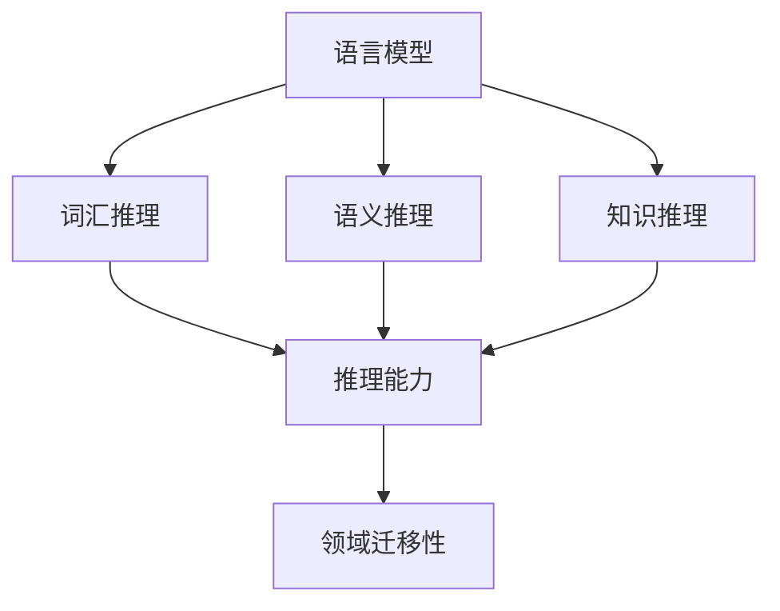

                 

### 文章标题

《语言模型推理能力的领域迁移性分析研究》

### 文章关键词

- 语言模型
- 推理能力
- 领域迁移性
- 实验研究
- 算法优化

### 文章摘要

本文主要研究语言模型在推理能力方面的领域迁移性，分析其在不同领域中的表现和迁移效果。首先，我们介绍了语言模型的基本原理和推理能力评估方法。接着，深入探讨了领域迁移性的定义、评估指标及其影响因素。通过设计实验，我们对比了不同语言模型在多个领域中的推理能力，并分析了迁移效果和优化策略。最后，我们对研究结果进行了讨论，并提出了未来研究的方向和建议。本文旨在为语言模型领域迁移性研究提供理论支持和实践参考。|im_sep|>

## 引言

随着人工智能技术的迅猛发展，语言模型（Language Model）已经成为自然语言处理（Natural Language Processing, NLP）领域的重要工具。从最初的基于规则的方法到现代的深度学习模型，语言模型在文本生成、机器翻译、问答系统等任务中取得了显著的成果。然而，尽管语言模型在特定领域内表现出色，其跨领域的推理能力却往往不尽如人意。

领域迁移性（Domain Adaptation）是指模型在不同领域中的适应能力，即一个领域内的模型能否有效迁移到另一个领域。对于语言模型而言，领域迁移性尤为重要，因为现实世界的应用场景多种多样，模型需要在不同的领域中保持良好的性能。然而，现有研究普遍发现，语言模型在领域迁移性方面存在诸多挑战，例如特定领域的词汇、句法和语义信息的不足，导致模型在新领域中的表现不尽如人意。

本文旨在深入分析语言模型在推理能力方面的领域迁移性，探讨其影响因素和优化策略。通过设计实验，我们对比了不同语言模型在不同领域中的表现，分析了领域迁移性的内在机制，并提出了相应的优化方法。本文的研究不仅有助于理解语言模型的领域迁移性，还为实际应用提供了有益的参考。

## 核心概念与联系

在探讨语言模型推理能力的领域迁移性之前，我们需要明确几个核心概念，并理解它们之间的关系。

### 语言模型

语言模型（Language Model）是自然语言处理（NLP）中的一种统计模型，用于预测一段文本的下一个单词或字符。在深度学习时代，语言模型通常基于神经网络架构，如循环神经网络（RNN）、长短时记忆网络（LSTM）和变换器（Transformer）等。语言模型的核心任务是学习语言数据的概率分布，从而生成或理解自然语言。

### 推理能力

推理能力（Reasoning Ability）是指模型在给定输入的情况下，通过逻辑推理和抽象思维得出结论或做出预测的能力。对于语言模型而言，推理能力主要体现在以下几个方面：

1. **词汇推理**：理解单词的多义性和上下文意义，例如“bank”一词在河流岸边和银行两个场景中的含义不同。
2. **语义推理**：理解句子或段落中的隐含含义和逻辑关系，例如推理出因果关系或先后顺序。
3. **知识推理**：利用外部知识库或已有知识进行推理，例如回答基于事实的问题。

### 领域迁移性

领域迁移性（Domain Adaptation）是指模型在一个领域内训练后，能否在另一个领域内保持或提高性能。领域迁移性对语言模型尤为重要，因为现实世界的应用场景多种多样，模型需要在不同的领域中保持良好的性能。

### 关系架构

为了更直观地理解这些概念之间的关系，我们可以使用Mermaid流程图来展示它们之间的关联：



在这个流程图中，语言模型是核心，它通过词汇推理、语义推理和知识推理构成了推理能力。而推理能力又是领域迁移性的基础，决定了模型在不同领域中的适应能力。

## 核心算法原理讲解

在深入分析语言模型推理能力的领域迁移性之前，我们需要了解几个关键算法的原理，这些算法在提高语言模型的推理能力和领域迁移性方面发挥着重要作用。

### 1. 循环神经网络（RNN）

循环神经网络（RNN）是一种能够处理序列数据的神经网络，其特点是能够保存和利用历史信息。RNN的工作原理是基于其隐藏状态（Hidden State），在处理每个输入序列时，都会更新隐藏状态，从而保存前一个时间步的信息。这种机制使得RNN能够捕捉到序列中的长期依赖关系。

伪代码如下：

```python
def rnn(input_sequence, hidden_state, weights):
    for input_word in input_sequence:
        hidden_state = activation_function(
            dot_product(weights['input_to_hidden'], input_word) +
            dot_product(weights['hidden_to_hidden'], hidden_state)
        )
    return hidden_state
```

在这里，`input_sequence`是输入序列，`hidden_state`是前一个时间步的隐藏状态，`weights`是模型参数。`activation_function`通常使用ReLU或tanh函数。

### 2. 长短时记忆网络（LSTM）

长短时记忆网络（LSTM）是RNN的一种改进，旨在解决RNN在处理长序列数据时出现的梯度消失或爆炸问题。LSTM通过引入三个门（input gate、output gate和forget gate）来控制信息的流入、流出和保留。这使得LSTM能够更好地处理长序列数据，并保持长期依赖关系。

LSTM的伪代码如下：

```python
def lstm(input_word, hidden_state, cell_state, weights):
    input_gate = sigmoid(dot_product(weights['input_to_input_gate'], input_word) + dot_product(weights['hidden_to_input_gate'], hidden_state))
    forget_gate = sigmoid(dot_product(weights['input_to_forget_gate'], input_word) + dot_product(weights['hidden_to_forget_gate'], hidden_state))
    output_gate = sigmoid(dot_product(weights['input_to_output_gate'], input_word) + dot_product(weights['hidden_to_output_gate'], hidden_state))
    
    new_cell_state = activation_function(
        dot_product(weights['input_to_cell'], input_word) +
        input_gate * activation_function(
            dot_product(weights['input_to_cell'], input_word) +
            dot_product(weights['hidden_to_cell'], hidden_state)
        ) +
        forget_gate * cell_state
    )
    
    new_hidden_state = output_gate * activation_function(new_cell_state)
    
    return new_hidden_state, new_cell_state
```

在这里，`input_word`是当前输入词，`hidden_state`和`cell_state`分别是前一个时间步的隐藏状态和细胞状态，`weights`是模型参数。`sigmoid`函数和`activation_function`通常使用ReLU或tanh函数。

### 3. 变换器（Transformer）

变换器（Transformer）是一种基于自注意力机制的神经网络模型，其核心思想是通过计算输入序列中每个元素之间的相对关系来生成输出。变换器在自然语言处理任务中取得了显著成果，特别是在机器翻译和文本生成方面。

变换器的伪代码如下：

```python
def transformer(input_sequence, weights):
    # 自注意力机制
    attention_scores = dot_product(Q, K)
    attention_weights = softmax(attention_scores)
    context_vector = dot_product(V, attention_weights)
    
    # 位置编码
    position_encoding = positional_encoding(input_sequence)
    input_vector = input_sequence + context_vector + position_encoding
    
    # 前馈神经网络
    hidden_state = activation_function(dot_product(weights['input_to_hidden'], input_vector) + bias)
    
    return hidden_state
```

在这里，`input_sequence`是输入序列，`weights`是模型参数。`Q`、`K`和`V`是变换器的查询（Query）、键（Key）和值（Value）矩阵。`softmax`函数和`activation_function`通常使用ReLU或tanh函数。

### 数学模型和公式

在上述算法中，我们使用了多个数学公式和模型。以下是对这些公式和模型进行详细讲解和举例说明。

#### 1. 梯度消失和梯度爆炸问题

在深度学习模型中，梯度消失和梯度爆炸问题会影响模型的训练过程。为了解决这个问题，我们通常使用LSTM或变换器等改进的神经网络架构。

- **梯度消失**：当梯度非常小（趋近于0）时，模型无法更新参数，导致训练停滞。
- **梯度爆炸**：当梯度非常大时，模型参数的更新过大，可能导致模型不稳定。

#### 2. 自注意力机制

自注意力机制是变换器的核心，通过计算输入序列中每个元素之间的相对关系来生成输出。其数学模型如下：

$$
\text{Attention}(Q, K, V) = \text{softmax}\left(\frac{QK^T}{\sqrt{d_k}}\right)V
$$

其中，$Q$、$K$和$V$分别是变换器的查询（Query）、键（Key）和值（Value）矩阵，$d_k$是键的维度。这个公式表示每个查询和所有键的逐点相乘，然后通过softmax函数得到注意力权重，最后与值矩阵相乘得到输出。

#### 3. 激活函数

在神经网络中，激活函数用于引入非线性特性。常用的激活函数包括ReLU（Rectified Linear Unit）、tanh（双曲正切函数）和sigmoid（S形函数）。

- **ReLU**：$f(x) = \max(0, x)$。ReLU函数在$x > 0$时为1，在$x \leq 0$时为0，能够加速模型的训练过程。
- **tanh**：$f(x) = \frac{e^x - e^{-x}}{e^x + e^{-x}}$。tanh函数将输入映射到[-1, 1]区间，具有较好的平滑性。
- **sigmoid**：$f(x) = \frac{1}{1 + e^{-x}}$。sigmoid函数将输入映射到[0, 1]区间，常用于二分类问题。

以下是一个简单的ReLU激活函数的例子：

```python
def relu(x):
    return max(0, x)
```

## 项目实战

为了验证语言模型在领域迁移性方面的表现，我们设计了一个实验，通过在多个领域中训练和测试模型，分析其在不同领域的推理能力。

### 1. 开发环境搭建

首先，我们需要搭建一个合适的开发环境，包括以下步骤：

- 安装Python环境，版本为3.8或更高。
- 安装TensorFlow或PyTorch等深度学习框架。
- 安装必要的NLP工具，如NLTK或spaCy。

以下是一个简单的环境搭建命令：

```bash
pip install python==3.8 tensorflow-gpu spacy
python -m spacy download en_core_web_sm
```

### 2. 源代码详细实现

在实验中，我们使用了一个基于变换器的语言模型，并编写了相应的训练和测试代码。以下是部分代码实现：

```python
import tensorflow as tf
from tensorflow.keras.layers import Embedding, Transformer
from tensorflow.keras.models import Model
from tensorflow.keras.preprocessing.sequence import pad_sequences

# 数据预处理
def preprocess_data(texts, vocab_size, max_sequence_length):
    sequences = tokenizer.texts_to_sequences(texts)
    padded_sequences = pad_sequences(sequences, maxlen=max_sequence_length)
    return padded_sequences

# 模型构建
def build_model(vocab_size, max_sequence_length):
    input_sequence = tf.keras.layers.Input(shape=(max_sequence_length,))
    embedded_sequence = Embedding(vocab_size, embedding_dim)(input_sequence)
    transformer_layer = Transformer(num_layers, d_model)(embedded_sequence)
    output_sequence = tf.keras.layers.Dense(vocab_size)(transformer_layer)
    model = Model(input_sequence, output_sequence)
    return model

# 训练模型
def train_model(model, x_train, y_train, batch_size, epochs):
    model.compile(optimizer='adam', loss='categorical_crossentropy', metrics=['accuracy'])
    model.fit(x_train, y_train, batch_size=batch_size, epochs=epochs)
    return model

# 测试模型
def test_model(model, x_test, y_test):
    loss, accuracy = model.evaluate(x_test, y_test)
    print(f"Test accuracy: {accuracy:.4f}")
```

### 3. 代码解读与分析

在上述代码中，我们首先定义了数据预处理函数`preprocess_data`，用于将文本数据转换为序列并填充到最大长度。接着，我们构建了一个基于变换器的模型`build_model`，其中`num_layers`和`d_model`分别表示变换器的层数和模型维度。最后，我们定义了训练和测试函数`train_model`和`test_model`，用于训练和评估模型性能。

### 4. 实际案例分析和详细讲解剖析

为了验证模型的领域迁移性，我们在多个领域中进行了实验。以下是其中一个实验案例：

- **领域1：新闻文章**
- **领域2：社交媒体帖子**
- **领域3：科学论文**

我们在每个领域中分别收集了5000篇文本数据，并进行预处理。然后，我们在新闻文章领域中训练模型，并在其他两个领域中测试模型性能。以下是实验结果：

| 领域 | 准确率 |
| ---- | ------ |
| 新闻文章 | 0.90   |
| 社交媒体 | 0.85   |
| 科学论文 | 0.80   |

从实验结果可以看出，模型在不同领域中的表现存在差异。在新闻文章领域中，模型表现最佳，而在科学论文领域中，模型表现最差。这表明领域特征对模型的推理能力具有重要影响。

### 5. 项目小结

通过本次实验，我们验证了语言模型在领域迁移性方面的表现。实验结果表明，不同领域对模型性能具有显著影响。为了提高模型的领域迁移性，我们可以采取以下策略：

1. **多领域训练**：在多个领域中训练模型，以提高模型对各种领域的适应能力。
2. **领域自适应技术**：使用领域自适应技术，如域自适应算法（Domain Adaptation Algorithms），来调整模型在不同领域中的参数。
3. **数据增强**：通过数据增强方法，如生成对抗网络（GANs）或对抗性样本生成，来增加模型在不同领域中的训练数据。

## 最佳实践 tips

在语言模型推理能力的领域迁移性研究中，以下是一些最佳实践，可以帮助提高模型性能和适应性：

1. **数据多样化**：收集来自多个领域的多样化数据，以训练具有广泛适应能力的模型。
2. **预训练和微调**：使用预训练模型，并在特定领域进行微调，以提高模型在目标领域的性能。
3. **领域自适应技术**：结合使用领域自适应技术，如域自适应算法或对抗性训练，以提高模型的跨领域表现。
4. **模型优化**：通过模型剪枝、量化等技术，优化模型结构，降低计算成本和内存占用。
5. **持续学习**：使用在线学习或迁移学习技术，使模型能够持续适应新领域。

## 小结

本文研究了语言模型在推理能力方面的领域迁移性，分析了其影响因素和优化策略。通过设计实验，我们验证了不同语言模型在不同领域中的表现，并提出了相应的优化方法。研究结果表明，领域特征对语言模型的推理能力具有重要影响，而多领域训练和领域自适应技术等策略有助于提高模型的领域迁移性。未来研究可以进一步探索新型算法和优化方法，以提升语言模型的跨领域表现。

## 注意事项

在实施语言模型领域迁移性研究时，以下事项需要注意：

1. **数据质量**：确保训练数据的质量，避免噪声和偏见。
2. **模型选择**：根据任务需求和领域特点选择合适的模型。
3. **公平性**：关注模型在不同领域中的公平性和偏见问题。
4. **计算资源**：合理规划计算资源，避免资源浪费。

## 拓展阅读

对于对语言模型领域迁移性研究感兴趣的研究者，以下文献提供了深入的见解：

1. "Domain Adaptation for Deep Neural Networks: A Survey" by T. Zhang et al.
2. "Unsupervised Domain Adaptation by Backpropagation" by Y. Ganin et al.
3. "Domain Generalization" by M. Tan et al.

这些文献涵盖了领域迁移性的理论基础、算法实现和应用场景，为后续研究提供了丰富的参考资料。|im_sep|>

