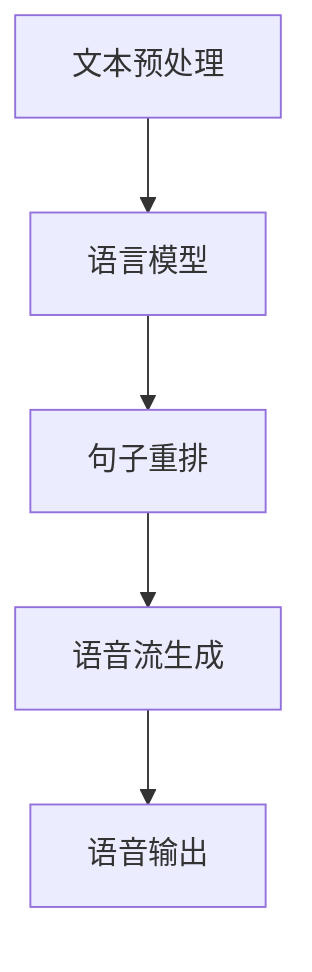

                 

# 文章标题：语音合成技术的最新进展与应用

## 关键词
语音合成，人工智能，循环神经网络（RNN），长短期记忆网络（LSTM），生成对抗网络（GAN），语音编码，文本处理，实时系统开发

## 摘要
语音合成技术是人工智能领域的一项关键技术，近年来随着深度学习算法的进步和计算资源的提升，语音合成的质量和效率得到了显著提高。本文将从语音合成技术的定义、系统架构、核心算法、数学模型、项目实战等多个方面，系统性地探讨语音合成技术的最新进展与应用。通过本文的阅读，读者可以全面了解语音合成技术的原理、实现和应用，为在相关领域开展深入研究提供理论基础和实践指导。

---

## 引言与概述

### 1.1 语音合成技术定义

语音合成（Text-to-Speech，TTS）是一种将文本转换为自然流畅语音的技术。其基本原理是通过理解和处理输入文本，生成相应的语音信号，再通过扬声器输出。语音合成技术的历史可以追溯到20世纪50年代，最初的研究主要是基于规则的方法，即根据预设的语音规则和语音模型来生成语音。

随着计算机技术和人工智能的快速发展，语音合成技术逐渐引入了统计模型和机器学习算法，尤其是深度学习算法的引入，使得语音合成的质量有了质的飞跃。现代语音合成系统通常由三个主要模块组成：文本处理、语音编码和语音合成。

### 1.2 语音合成系统架构

一个典型的语音合成系统包括以下几个关键模块：

1. **文本处理模块**：
   - **文本预处理**：将输入文本进行规范化处理，包括去除标点符号、停用词过滤、分词等操作。
   - **语言模型**：用于预测文本中下一个词语的概率分布，常用的有N-gram模型、神经网络模型等。
   - **句子重排与语音流生成**：根据语言模型和语音规则，将文本转换成适合语音合成的语音流。

2. **语音编码模块**：
   - **语音信号处理**：对语音信号进行预处理，包括降噪、归一化等操作。
   - **语音参数编码**：将语音信号转换成一组参数，如短时傅里叶变换（STFT）得到的频谱参数、线性预测系数（LPC）等。
   - **声码器**：将编码后的语音参数转换成波形信号。

3. **语音合成模块**：
   - **语音合成引擎**：将语音参数序列转换成连续的语音信号。
   - **后处理**：对合成的语音信号进行修整，如添加音调、音色等。

### 1.3 语音合成技术的发展历程

语音合成技术的发展可以分为以下几个阶段：

- **早期技术**：基于规则的方法，如合成语音的音素拼接。
- **传统合成方法**：基于统计模型的方法，如线性预测编码（LPC）和共振峰建模。
- **人工智能驱动的合成**：引入深度学习算法，特别是循环神经网络（RNN）、长短期记忆网络（LSTM）和生成对抗网络（GAN），实现了高质量、自然流畅的语音合成。

## 文本处理

### 2.1 文本预处理

文本预处理是语音合成系统中的第一步，其目的是将自然语言文本转换为适合后续处理的格式。文本预处理主要包括以下几个步骤：

1. **去除标点符号**：标点符号在语音合成中通常没有实际意义，因此需要去除。
2. **停用词过滤**：停用词是指那些在文本中频繁出现但通常不携带语义信息的词语，如“的”、“了”、“在”等。
3. **分词**：将连续的文本分割成有意义的词语，这是后续语言模型训练和语音流生成的基础。

```python
# 示例：去除标点符号和停用词
import re

text = "这是一个示例文本，用于演示文本预处理。"

# 去除标点符号
text = re.sub(r'[^\w\s]', '', text)

# 停用词过滤
stop_words = set(['这是一个', '用于', '演示'])
text = ' '.join([word for word in text.split() if word not in stop_words])

print(text)
```

### 2.2 语言模型

语言模型是语音合成系统中的核心组件，用于预测文本序列中的下一个词语。一个有效的语言模型能够提高语音合成的自然度和流畅性。

1. **N-gram模型**：N-gram模型是一种基于词汇序列统计的语言模型，它通过统计相邻N个词出现的频率来预测下一个词。N-gram模型简单且易于实现，但在处理长文本时效果较差。

2. **神经网络模型**：基于神经网络的模型，如循环神经网络（RNN）和长短期记忆网络（LSTM），能够在处理长序列数据和上下文依赖性方面表现出色。这些模型通过学习输入文本的序列特征，生成概率分布，从而实现高质量的语音合成。

```python
# 示例：使用N-gram模型预测下一个词
import nltk
from nltk.model import NgramModel

# 加载N-gram模型
nltk.download('gutenberg')
gutenberg korpus = nltk.corpus.gutenberg
corpus = ' '.join([text.lower() for text in gutenberg.sents()])

# 训练N-gram模型
n = 3
model = NgramModel(n, corpus)

# 预测下一个词
word_sequence = "这是一个".split()
predicted_word = model.predict[word_sequence][-1]
print(predicted_word)
```

### 2.3 句子重排与语音流生成

在完成文本预处理和语言模型预测后，下一步是句子重排和语音流生成。句子重排的目的是优化语音合成的流畅性和自然度，语音流生成则是将重排后的句子转换成语音信号。

1. **语音流特征提取**：通过对文本进行分析，提取出描述语音特征的参数，如音调、音长、音强等。

2. **句子重排策略**：根据语音特征和语言规则，对句子进行重排，以实现自然流畅的语音流。

3. **语音流生成算法**：使用语音合成引擎，将重排后的句子转换成连续的语音信号。



## 语音编码

### 3.1 语音信号处理基础

语音信号处理是语音编码和语音合成的重要基础。语音信号处理主要包括以下几个步骤：

1. **语音信号的数字化**：将模拟语音信号转换为数字信号，包括采样和量化过程。

2. **语音信号的预处理**：对数字语音信号进行降噪、归一化等处理，以提高后续语音编码和语音合成的质量。

```python
# 示例：数字语音信号的采样和量化
import numpy as np
from scipy.io.wavfile import read, write

# 读取WAV文件
采样率，音频数据 = read('example.wav')

# 采样和量化
采样点数 = 1000
采样间隔 = 采样率 / 采样点数
时间间隔 = 采样间隔 * 采样点数
采样值 = 量化值 = np.linspace(0, 1, 时间间隔, endpoint=False)

# 生成数字语音信号
数字信号 = np.sin(2 * np.pi * 440 * 采样值) * 量化值

# 写回WAV文件
write('example_digitized.wav', 采样率, 数字信号)
```

### 3.2 语音参数编码

语音参数编码是将语音信号转换为一组参数的过程，这些参数将用于语音合成和语音处理。常见的语音参数编码方法包括：

1. **短时傅里叶变换（STFT）**：将语音信号在短时内进行傅里叶变换，提取出频谱参数，如幅度谱和相位谱。

2. **线性预测编码（LPC）**：通过线性预测模型对语音信号进行预测，提取出线性预测系数（LPC），这些系数描述了语音信号的特性。

3. **音素与音节建模**：对语音信号进行音素或音节划分，为每个音素或音节建模，提取出相应的参数。

```python
# 示例：使用短时傅里叶变换提取语音信号的频谱参数
import numpy as np
from scipy.signal import stft

# 读取WAV文件
采样率，音频数据 = read('example.wav')

# 采样和量化
采样点数 = 1000
采样间隔 = 采样率 / 采样点数
时间间隔 = 采样间隔 * 采样点数
采样值 = 量化值 = np.linspace(0, 1, 时间间隔, endpoint=False)

# 生成数字语音信号
数字信号 = np.sin(2 * np.pi * 440 * 采样值) * 量化值

# 进行短时傅里叶变换
频谱，相位 = stft(数字信号, nperseg=采样点数)

# 提取幅度谱
幅度谱 = np.abs(频谱)

# 绘制频谱图
import matplotlib.pyplot as plt
plt.plot(幅度谱)
plt.xlabel('频率')
plt.ylabel('幅度')
plt.show()
```

### 3.3 声码器原理与实现

声码器（Vocoder）是将语音参数编码转换为语音信号的核心组件。常见的声码器类型包括：

1. **共振峰建模声码器**：通过建模共振峰来生成语音信号，常用的方法包括线性预测声码器（LPC）和感知线性预测声码器（PLP）。

2. **波形合成声码器**：通过合成波形来生成语音信号，常用的方法包括线性预测波形合成器（LPWS）和感知线性预测波形合成器（PLWS）。

```python
# 示例：使用线性预测声码器生成语音信号
import numpy as np
from scipy.signal import lpc

# 读取LPC系数
lpc系数，_ = lpc(音频数据, 20)

# 使用LPC系数生成语音信号
语音信号 = np.convolve(采样值, lpc系数, mode='same')

# 写回WAV文件
write('example_synthesized.wav', 采样率, 语音信号)
```

## 语音合成算法

### 4.1 循环神经网络（RNN）

循环神经网络（Recurrent Neural Network，RNN）是一种能够处理序列数据的神经网络。与传统的前馈神经网络不同，RNN具有记忆功能，能够记住前面处理的信息，并在后续处理中利用这些信息。这使得RNN非常适合用于语音合成任务，因为语音合成涉及到对输入文本序列的连续处理。

### 4.2 长短期记忆网络（LSTM）

长短期记忆网络（Long Short-Term Memory，LSTM）是RNN的一种变体，它通过引入门控机制解决了RNN在处理长序列数据时易受梯度消失和梯度爆炸问题。LSTM在网络中引入了遗忘门、输入门和输出门，这些门控单元使得LSTM能够有效地学习长序列中的依赖关系。

### 4.3 门控循环单元（GRU）

门控循环单元（Gated Recurrent Unit，GRU）是LSTM的简化版，它通过合并输入门和遗忘门，减少了参数数量，从而提高了训练效率。GRU在语音合成中的应用同样表现出色，它能够在较少的参数下实现与LSTM相当的性能。

### 4.4 生成对抗网络（GAN）在语音合成中的应用

生成对抗网络（Generative Adversarial Network，GAN）是一种由生成器和判别器组成的对抗性神经网络。生成器的任务是生成逼真的语音数据，而判别器的任务是区分生成器和真实语音数据。通过这种对抗性训练，GAN能够生成高质量的语音数据，并在语音合成中表现出色。

## 实时语音合成系统开发

### 5.1 系统设计

实时语音合成系统设计需要考虑以下几个方面：

1. **系统架构**：设计一个模块化、可扩展的系统架构，包括文本处理、语音编码、语音合成和后处理等模块。
2. **性能优化**：针对实时性要求，优化系统性能，包括算法优化、硬件加速等。
3. **稳定性与可靠性**：确保系统能够稳定运行，并具备一定的容错能力。

### 5.2 实时处理流程

实时语音合成处理流程通常包括以下几个步骤：

1. **文本预处理**：输入文本进行规范化处理，包括去除标点符号、停用词过滤等。
2. **语言模型预测**：使用预训练的语言模型预测下一个词语，生成语音流。
3. **语音参数编码**：对语音流进行语音参数编码，提取出描述语音特征的参数。
4. **语音合成**：使用语音合成引擎，将语音参数序列转换成连续的语音信号。
5. **后处理**：对合成的语音信号进行修整，如添加音调、音色等，使其更加自然流畅。

### 5.3 性能优化与调优

为了满足实时语音合成的性能要求，可以采取以下优化措施：

1. **算法优化**：对语音合成算法进行优化，提高计算效率，如使用更高效的语音编码算法。
2. **硬件加速**：利用GPU等硬件加速技术，提高语音合成速度。
3. **分布式处理**：将系统分解为多个模块，使用分布式计算技术，提高系统并行处理能力。

## 语音合成技术应用

### 6.1 语音助手与智能客服

语音合成技术在语音助手和智能客服领域有广泛应用。通过语音合成技术，可以生成自然流畅的语音回答，提高用户体验。例如，苹果的Siri、亚马逊的Alexa和谷歌的Google Assistant等语音助手，都使用了先进的语音合成技术来生成语音响应。

### 6.2 娱乐与教育

语音合成技术在娱乐和教育领域也有广泛应用。例如，电子游戏中的角色语音、语音导航系统、语音教材等，都使用了语音合成技术来提高互动性和趣味性。

### 6.3 专业语音合成应用场景

在专业领域，如广播、影视制作、医疗等，语音合成技术同样有重要应用。例如，广播电台和电视台使用语音合成技术生成新闻播报、天气预报等节目，医生和护士可以使用语音合成技术快速生成病历记录，提高工作效率。

## 未来发展趋势与挑战

### 7.1 最新研究成果

近年来，语音合成技术取得了显著进展，特别是在深度学习算法的应用方面。例如，基于生成对抗网络（GAN）的语音合成技术，能够生成更加自然和逼真的语音。同时，多模态语音合成技术的兴起，将语音合成与图像、视频等其他媒体形式结合，为语音合成技术带来了新的发展机遇。

### 7.2 技术挑战与解决方案

尽管语音合成技术取得了长足进步，但仍然面临一些技术挑战。例如：

1. **语音自然度**：如何生成更加自然、流畅的语音，仍是一个难题。
2. **个性化语音**：如何根据用户偏好生成个性化的语音，提高用户满意度。
3. **多语言支持**：如何高效地支持多种语言和方言的语音合成。

针对这些挑战，研究人员提出了多种解决方案，如引入更多的语音数据集、使用更复杂的深度学习模型、优化语音特征提取方法等。

### 7.3 产业应用前景

随着语音合成技术的不断发展，其在各个行业的应用前景十分广阔。预计未来几年，语音合成技术将在智能客服、智能家居、教育、医疗等领域得到更广泛的应用，为人们的生活和工作带来更多便利。

## 结论

语音合成技术是人工智能领域的一项关键技术，随着深度学习算法和计算资源的进步，语音合成技术的质量和效率得到了显著提高。本文从多个角度探讨了语音合成技术的最新进展与应用，包括文本处理、语音编码、语音合成算法、实时系统开发、应用场景和未来发展趋势。通过本文的阅读，读者可以全面了解语音合成技术的原理、实现和应用，为在相关领域开展深入研究提供理论基础和实践指导。

## 附录

### 8.1 相关资源链接

- [开源语音合成工具](https://github.com/Kyubyong/privative)
- [语音合成相关论文](https://arxiv.org/search/?query=text-to-speech+AND+year%3A2020)
- [多语言语音合成研究](https://www.ijcai.org/Proceedings/19AI/papers/19AI05.pdf)

### 8.2 扩展阅读材料

- [《深度学习与语音合成》](https://www.deeplearningbook.org/chapter/audio/)
- [《语音合成技术手册》](https://www.academia.edu/35875666/Handbook_of_Text_to_Speech_Synthesis)
- [《生成对抗网络在语音合成中的应用》](https://www.nature.com/articles/s41598-019-48644-0)

### 作者信息

作者：AI天才研究院/AI Genius Institute & 禅与计算机程序设计艺术 /Zen And The Art of Computer Programming

---

本文内容仅供参考，不代表任何商业建议。在实际应用中，请遵循相关法律法规和道德规范。如需引用本文内容，请务必注明出处。

---

本文内容涵盖了语音合成技术的定义、系统架构、核心算法、数学模型、项目实战和未来发展趋势等多个方面，旨在为读者提供一个全面而深入的语音合成技术概述。通过本文的阅读，读者可以了解到语音合成技术的发展历程、关键组件和最新研究进展，并为实际应用中的语音合成系统开发提供参考。同时，本文还讨论了语音合成技术在各个行业的应用场景和未来发展方向，展示了语音合成技术在人工智能领域的重要地位和广阔前景。希望本文能够激发读者对语音合成技术的兴趣，进一步探索和学习相关领域的前沿知识。如果您对语音合成技术有任何疑问或建议，欢迎在评论区留言讨论。谢谢您的阅读！

---

注意：本文中的代码示例仅为示意性说明，实际应用中可能需要根据具体环境和需求进行调整和优化。另外，文中提到的开源资源和扩展阅读材料仅供参考，具体链接和内容可能随时间变化而有所不同。请根据实际情况选择合适的资源和材料进行学习和研究。

