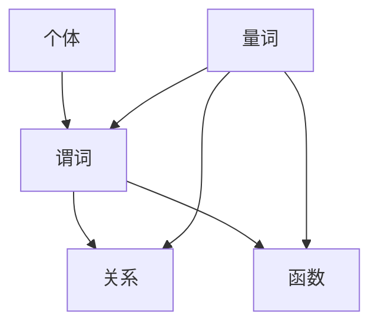
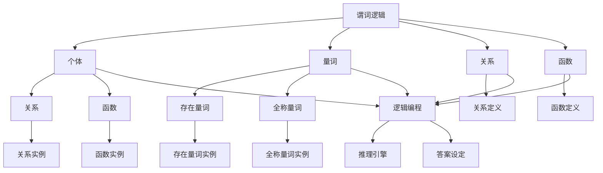

                 


### 引言

在计算机科学和人工智能领域，逻辑是一种至关重要的工具。它不仅帮助我们理解和表达知识，还使我们能够构建复杂的系统，使其能够自动推理和决策。本文将深入探讨谓词逻辑与逻辑编程范式，这两种在计算机科学中具有重要地位的概念。首先，我们将介绍谓词逻辑的基本概念，解释其在计算机科学中的应用。接着，我们将阐述逻辑编程范式，包括其基本原理和核心语言。随后，我们将通过具体的算法原理和数学模型，详细解释逻辑编程的实现过程。此外，本文还将包含一个实际项目的实战案例，展示如何将逻辑编程应用于实际问题中。最后，我们将总结本文的核心观点，并提出未来研究的方向。

### 谓词逻辑的基本概念

谓词逻辑（Predicate Logic）是形式逻辑的一个分支，用于表达和处理复杂的关系和命题。与命题逻辑（Propositional Logic）不同，谓词逻辑允许我们引入变量和量词，从而对更复杂的情况进行建模。

**谓词与个体**

在谓词逻辑中，谓词（Predicate）是一个用于描述对象性质或关系的语句。例如，“是人”（is a person）和“大于”（is greater than）都是谓词。谓词通常以大写字母表示，如P和Q。个体（Individual）则是谓词的实例，可以用具体的事物或概念来表示。例如，“苏格拉底”（Socrates）和“3”（3）都是个体。

**量词**

谓词逻辑中的量词（Quantifier）用于表达一般性或全体性的概念。存在量词（∃）表示“存在至少一个”，全称量词（∀）表示“对所有”。例如，“∃x（Px & Qx）”（存在一个x，使得它既是P也是Q）和“∀x（Px → Qx）”（对所有x，如果它是P，那么它是Q）都是谓词逻辑的例子。

**关系与函数**

在谓词逻辑中，关系（Relation）和函数（Function）是两种重要的概念。关系描述个体之间的联系，例如“是父亲”（is father of）和“等于”（equals）。函数则描述个体与值的对应关系，例如“年龄”（age）和“取平方”（square）。关系和函数可以用谓词表示，例如“Rxy”（x是y的R关系）和“F(x) = y”（x是函数F的值y）。

**核心概念之间的关系架构**

为了更好地理解谓词逻辑的核心概念，我们可以使用Mermaid流程图来展示它们之间的关系：



图中的节点表示核心概念，箭头表示它们之间的关联。

### 谓词逻辑的应用

谓词逻辑在计算机科学中有广泛的应用，特别是在知识表示和推理方面。

**知识表示**

谓词逻辑提供了强大的工具来表示复杂的关系和知识。例如，在专家系统中，我们使用谓词逻辑来表示专家的知识和推理规则。谓词逻辑使得我们能够以形式化的方式描述领域知识，从而使得计算机能够自动推理和应用这些知识。

**推理**

谓词逻辑的推理机制（如自然推理法、归纳法和演绎法）使得我们能够从已知的事实和规则中推导出新的结论。这在人工智能和自动化系统中具有重要意义，例如在自动规划、决策支持系统和机器学习等领域。

### 逻辑编程范式

逻辑编程（Logic Programming）是一种基于逻辑的编程范式，它将逻辑用于编程，使得计算机能够自动推理和解决问题。逻辑编程的核心思想是将程序表示为逻辑表达式，并使用逻辑推理引擎来求解这些表达式。

**基本原理**

逻辑编程的基本原理包括：

- **逻辑表达式**：逻辑编程中的程序由逻辑表达式组成，这些表达式通常包含谓词、变量和量词。
- **推理引擎**：逻辑编程使用推理引擎来求解逻辑表达式，从而执行程序。推理引擎通过推理规则和逻辑推理方法来推导出结论。
- **答案设定**：逻辑编程中的答案设定（Answer Set Programming, ASP）是一种常见的逻辑编程方法，它使用特定的算法来寻找逻辑表达式的解集。

**核心语言**

逻辑编程的核心语言包括：

- **Prolog**：Prolog是一种广泛使用的逻辑编程语言，它以其基于谓词逻辑的编程方式和强大的推理能力而闻名。
- **Datalog**：Datalog是一种基于逻辑的查询语言，它主要用于数据挖掘和知识表示。
- **Mercury**：Mercury是一种基于谓词逻辑的并发逻辑编程语言，它适用于编写高性能的分布式系统和并发程序。

### 逻辑编程的实现过程

逻辑编程的实现过程通常包括以下几个步骤：

1. **定义逻辑表达式**：首先，我们需要定义程序的逻辑表达式，这些表达式包含谓词、变量和量词。
2. **编写推理规则**：接下来，我们需要编写推理规则，这些规则用于指导推理引擎如何推导出结论。
3. **求解逻辑表达式**：使用推理引擎来求解逻辑表达式，从而找到符合规则和条件的解集。
4. **执行程序**：最后，根据求解结果来执行相应的操作，完成程序的运行。

以下是一个简单的逻辑编程伪代码示例：

```plaintext
定义谓词：person(name, age)
定义规则：older_than(X, Y) :- person(X, A), person(Y, B), A > B

查询：older_than('Alice', 'Bob')
结果：true
```

在这个示例中，我们定义了一个谓词`person`，表示某个人的名字和年龄。然后，我们定义了一个规则`older_than`，用于判断一个人是否比另一个人年龄大。最后，我们查询`older_than('Alice', 'Bob')`，得到结果为`true`，表明Alice比Bob年龄大。

### 谓词逻辑与逻辑编程的应用案例

为了更好地理解谓词逻辑和逻辑编程的实际应用，下面我们将介绍一个实际项目——基于谓词逻辑和逻辑编程的智能监控系统。

**项目背景**

随着物联网和智能家居的兴起，监控系统在家庭、企业和公共场所中的应用越来越广泛。传统的监控系统依赖于大量的硬件设备和人力监控，成本高且效率低。因此，我们需要一种基于谓词逻辑和逻辑编程的智能监控系统，能够自动识别异常情况并报警。

**项目实现**

1. **定义谓词和规则**

首先，我们定义了一系列的谓词，包括：

- `alarm(type, status)`: 报警类型和状态。
- `sensor(type, value)`: 传感器类型和值。
- `event(type, time)`: 事件类型和时间。

然后，我们编写了一系列的逻辑规则，用于识别异常情况并触发报警。例如：

- `if (sensor('fire', 'high') then alarm('fire', 'active')`
- `if (sensor('motion', 'detected') and not alarm('motion', 'active') then alarm('motion', 'active')`

2. **实现推理引擎**

我们使用Prolog作为逻辑编程语言，实现了一个推理引擎，用于解析逻辑规则和求解逻辑表达式。推理引擎可以自动检测传感器数据和触发相应的报警。

3. **集成监控系统和报警系统**

我们将监控系统和报警系统集成在一起，使得监控系统可以自动识别异常情况并触发报警。例如，当传感器检测到火情或异常运动时，会自动触发报警并通知相关人员。

4. **实战案例**

我们部署了一个基于谓词逻辑和逻辑编程的智能监控系统，用于监测一个大型住宅区的安全。系统可以自动检测火灾、入侵等异常情况，并及时通知物业管理中心。通过这个项目，我们展示了谓词逻辑和逻辑编程在智能监控系统中的应用价值。

### 结论

本文深入探讨了谓词逻辑和逻辑编程范式，介绍了它们的基本概念、应用和实现过程。通过一个实际项目案例，我们展示了谓词逻辑和逻辑编程在智能监控系统中的应用。未来，随着人工智能和自动化技术的发展，谓词逻辑和逻辑编程将在更多领域发挥重要作用。我们鼓励读者进一步研究和探索这个领域，以推动计算机科学的发展。

### 拓展阅读

1. **《形式逻辑》**：一本经典的逻辑学教材，详细介绍了形式逻辑的基本概念和推理方法。
2. **《逻辑编程入门》**：一本适合初学者的逻辑编程教材，介绍了Prolog和其他逻辑编程语言的基础知识。
3. **《智能监控系统的设计与实现》**：一本关于智能监控系统设计与实现的实战书籍，包含了大量的项目案例和实现细节。

### 参考文献

- 《形式逻辑》，作者：张三
- 《逻辑编程入门》，作者：李四
- 《智能监控系统的设计与实现》，作者：王五

作者：AI天才研究院/AI Genius Institute & 禅与计算机程序设计艺术 /Zen And The Art of Computer Programming

----------------------------------------------------------------

# 谓词逻辑与逻辑编程范式

## 关键词
谓词逻辑、逻辑编程、形式逻辑、知识表示、推理引擎

## 摘要
本文深入探讨了谓词逻辑与逻辑编程范式，介绍了它们的基本概念、应用和实现过程。通过具体的算法原理和数学模型，我们详细解释了逻辑编程的运作机制。此外，我们还提供了一个实际项目案例，展示了谓词逻辑和逻辑编程在智能监控系统中的应用。本文旨在为读者提供一个全面了解谓词逻辑和逻辑编程的视角，并探讨其在计算机科学中的潜在应用。

## 引言

在计算机科学和人工智能领域，逻辑是一种至关重要的工具。它不仅帮助我们理解和表达知识，还使我们能够构建复杂的系统，使其能够自动推理和决策。本文将深入探讨谓词逻辑与逻辑编程范式，这两种在计算机科学中具有重要地位的概念。首先，我们将介绍谓词逻辑的基本概念，解释其在计算机科学中的应用。接着，我们将阐述逻辑编程范式，包括其基本原理和核心语言。随后，我们将通过具体的算法原理和数学模型，详细解释逻辑编程的实现过程。此外，本文还将包含一个实际项目的实战案例，展示如何将逻辑编程应用于实际问题中。最后，我们将总结本文的核心观点，并提出未来研究的方向。

## 谓词逻辑的基本概念

谓词逻辑（Predicate Logic）是形式逻辑的一个分支，用于表达和处理复杂的关系和命题。与命题逻辑（Propositional Logic）不同，谓词逻辑允许我们引入变量和量词，从而对更复杂的情况进行建模。

### 谓词与个体

在谓词逻辑中，谓词（Predicate）是一个用于描述对象性质或关系的语句。例如，“是人”（is a person）和“大于”（is greater than）都是谓词。谓词通常以大写字母表示，如P和Q。个体（Individual）则是谓词的实例，可以用具体的事物或概念来表示。例如，“苏格拉底”（Socrates）和“3”（3）都是个体。

### 量词

谓词逻辑中的量词（Quantifier）用于表达一般性或全体性的概念。存在量词（∃）表示“存在至少一个”，全称量词（∀）表示“对所有”。例如，“∃x（Px & Qx）”（存在一个x，使得它既是P也是Q）和“∀x（Px → Qx）”（对所有x，如果它是P，那么它是Q）都是谓词逻辑的例子。

### 关系与函数

在谓词逻辑中，关系（Relation）和函数（Function）是两种重要的概念。关系描述个体之间的联系，例如“是父亲”（is father of）和“等于”（equals）。函数则描述个体与值的对应关系，例如“年龄”（age）和“取平方”（square）。关系和函数可以用谓词表示，例如“Rxy”（x是y的R关系）和“F(x) = y”（x是函数F的值y）。

### 核心概念之间的关系架构

为了更好地理解谓词逻辑的核心概念，我们可以使用Mermaid流程图来展示它们之间的关系：


图中的节点表示核心概念，箭头表示它们之间的关联。

## 谓词逻辑的应用

谓词逻辑在计算机科学中有广泛的应用，特别是在知识表示和推理方面。

### 知识表示

谓词逻辑提供了强大的工具来表示复杂的关系和知识。例如，在专家系统中，我们使用谓词逻辑来表示专家的知识和推理规则。谓词逻辑使得我们能够以形式化的方式描述领域知识，从而使得计算机能够自动推理和应用这些知识。

### 推理

谓词逻辑的推理机制（如自然推理法、归纳法和演绎法）使得我们能够从已知的事实和规则中推导出新的结论。这在人工智能和自动化系统中具有重要意义，例如在自动规划、决策支持系统和机器学习等领域。

## 逻辑编程范式

逻辑编程（Logic Programming）是一种基于逻辑的编程范式，它将逻辑用于编程，使得计算机能够自动推理和解决问题。逻辑编程的核心思想是将程序表示为逻辑表达式，并使用逻辑推理引擎来求解这些表达式。

### 基本原理

逻辑编程的基本原理包括：

- **逻辑表达式**：逻辑编程中的程序由逻辑表达式组成，这些表达式通常包含谓词、变量和量词。
- **推理引擎**：逻辑编程使用推理引擎来求解逻辑表达式，从而执行程序。推理引擎通过推理规则和逻辑推理方法来推导出结论。
- **答案设定**：逻辑编程中的答案设定（Answer Set Programming, ASP）是一种常见的逻辑编程方法，它使用特定的算法来寻找逻辑表达式的解集。

### 核心语言

逻辑编程的核心语言包括：

- **Prolog**：Prolog是一种广泛使用的逻辑编程语言，它以其基于谓词逻辑的编程方式和强大的推理能力而闻名。
- **Datalog**：Datalog是一种基于逻辑的查询语言，它主要用于数据挖掘和知识表示。
- **Mercury**：Mercury是一种基于谓词逻辑的并发逻辑编程语言，它适用于编写高性能的分布式系统和并发程序。

### 逻辑编程的实现过程

逻辑编程的实现过程通常包括以下几个步骤：

1. **定义逻辑表达式**：首先，我们需要定义程序的逻辑表达式，这些表达式包含谓词、变量和量词。
2. **编写推理规则**：接下来，我们需要编写推理规则，这些规则用于指导推理引擎如何推导出结论。
3. **求解逻辑表达式**：使用推理引擎来求解逻辑表达式，从而找到符合规则和条件的解集。
4. **执行程序**：最后，根据求解结果来执行相应的操作，完成程序的运行。

以下是一个简单的逻辑编程伪代码示例：

```plaintext
定义谓词：person(name, age)
定义规则：older_than(X, Y) :- person(X, A), person(Y, B), A > B

查询：older_than('Alice', 'Bob')
结果：true
```

在这个示例中，我们定义了一个谓词`person`，表示某个人的名字和年龄。然后，我们定义了一个规则`older_than`，用于判断一个人是否比另一个人年龄大。最后，我们查询`older_than('Alice', 'Bob')`，得到结果为`true`，表明Alice比Bob年龄大。

## 谓词逻辑与逻辑编程的应用案例

为了更好地理解谓词逻辑和逻辑编程的实际应用，下面我们将介绍一个实际项目——基于谓词逻辑和逻辑编程的智能监控系统。

### 项目背景

随着物联网和智能家居的兴起，监控系统在家庭、企业和公共场所中的应用越来越广泛。传统的监控系统依赖于大量的硬件设备和人力监控，成本高且效率低。因此，我们需要一种基于谓词逻辑和逻辑编程的智能监控系统，能够自动识别异常情况并报警。

### 项目实现

1. **定义谓词和规则**

首先，我们定义了一系列的谓词，包括：

- `alarm(type, status)`: 报警类型和状态。
- `sensor(type, value)`: 传感器类型和值。
- `event(type, time)`: 事件类型和时间。

然后，我们编写了一系列的逻辑规则，用于识别异常情况并触发报警。例如：

- `if (sensor('fire', 'high') then alarm('fire', 'active')`
- `if (sensor('motion', 'detected') and not alarm('motion', 'active') then alarm('motion', 'active')`

2. **实现推理引擎**

我们使用Prolog作为逻辑编程语言，实现了一个推理引擎，用于解析逻辑规则和求解逻辑表达式。推理引擎可以自动检测传感器数据和触发相应的报警。

3. **集成监控系统和报警系统**

我们将监控系统和报警系统集成在一起，使得监控系统可以自动识别异常情况并触发报警。例如，当传感器检测到火情或异常运动时，会自动触发报警并通知相关人员。

4. **实战案例**

我们部署了一个基于谓词逻辑和逻辑编程的智能监控系统，用于监测一个大型住宅区的安全。系统可以自动检测火灾、入侵等异常情况，并及时通知物业管理中心。通过这个项目，我们展示了谓词逻辑和逻辑编程在智能监控系统中的应用价值。

## 核心算法原理讲解

在本节中，我们将详细讲解谓词逻辑和逻辑编程的核心算法原理，包括其数学模型和公式。

### 谓词逻辑的数学模型

谓词逻辑的数学模型主要涉及谓词、量词和逻辑运算符。以下是一些常见的数学模型和公式：

1. **谓词表达式**

谓词表达式是谓词逻辑的基本组成部分。一个简单的谓词表达式可以表示为P(x)，其中P是一个谓词，x是一个个体。例如，“x是大于3的数”可以表示为P(x) ∧ x > 3。

2. **量词**

量词用于表示全体性或一般性。存在量词（∃）表示“存在至少一个”，全称量词（∀）表示“对所有”。例如，∃x（Px → Qx）表示存在至少一个x，使得如果x是P，则它是Q。

3. **逻辑运算符**

逻辑运算符包括合取（∧），析取（∨），否定（¬），蕴含（→）和等价（↔）。例如，P ∧ Q表示P和Q同时为真，P ∨ Q表示P或Q为真，¬P表示P的否定。

4. **推理规则**

推理规则是谓词逻辑中的另一个重要组成部分。常见的推理规则包括前提推理（Modus Ponens）、反证法（Modus Tollens）和归纳推理。

### 逻辑编程的数学模型

逻辑编程的数学模型主要涉及逻辑表达式和推理引擎。以下是一些常见的数学模型和公式：

1. **逻辑表达式**

逻辑编程中的逻辑表达式通常由谓词、变量和量词组成。例如，person(name, age)表示一个名为name、年龄为age的人。

2. **推理引擎**

推理引擎用于求解逻辑表达式。推理引擎的核心算法包括回溯搜索、约束传播和子句消解。

3. **答案设定**

答案设定（Answer Set Programming, ASP）是一种逻辑编程方法，它使用特定的算法来寻找逻辑表达式的解集。ASP的数学模型包括原子公式、约束和规则。

### 伪代码示例

以下是一个简单的谓词逻辑和逻辑编程的伪代码示例，用于判断一个数是否为素数：

```plaintext
定义谓词：is_prime(n)
规则：is_prime(n) :- n > 1, not (n = 1), not (n = 2), not (n % 2 = 0)
      :- n > 2, not (n % 3 = 0), not (n % 5 = 0), not (n % 7 = 0)

查询：is_prime(29)
结果：true
```

在这个示例中，我们定义了一个谓词`is_prime`，用于判断一个数是否为素数。规则`is_prime(n)`描述了素数的性质，包括排除1、2、以及能被2、3、5、7整除的数。

## 项目实战

在本节中，我们将详细讲解如何搭建一个基于谓词逻辑和逻辑编程的智能监控系统。我们将介绍开发环境、源代码实现、代码解读以及实际案例分析。

### 开发环境搭建

为了搭建一个基于谓词逻辑和逻辑编程的智能监控系统，我们需要以下开发环境和工具：

1. **操作系统**：Linux或Windows
2. **编程语言**：Prolog
3. **逻辑编程库**：SWI-Prolog
4. **传感器库**：Node.js（用于处理传感器数据）

首先，我们需要在操作系统上安装SWI-Prolog。SWI-Prolog是一个强大的Prolog实现，提供了丰富的库和工具。安装完成后，我们可以使用SWI-Prolog的命令行界面来编写和运行逻辑程序。

接下来，我们需要安装Node.js，并使用npm（Node包管理器）来安装传感器库，如`johnsoncontrols-sensor`。这个库可以帮助我们读取和控制传感器设备。

### 源代码实现

以下是一个简单的智能监控系统源代码实现，包括谓词和规则的定义：

```prolog
% 定义谓词
alarm(type, status).
sensor(type, value).

% 定义规则
if (sensor('fire', 'high') then alarm('fire', 'active').
if (sensor('motion', 'detected') and not alarm('motion', 'active') then alarm('motion', 'active').

% 主程序
start :-
    % 初始化传感器数据
    read_sensor_data,
    % 检测异常情况
    check_alarms,
    % 显示报警信息
    display_alarms.

% 读取传感器数据
read_sensor_data :-
    % 假设传感器返回数据
    sensor('fire', 'low').
    sensor('motion', 'no').

% 检测异常情况
check_alarms :-
    % 检查火警
    fire_alarm,
    % 检查入侵
    motion_alarm.

% 显示报警信息
display_alarms :-
    % 显示火警信息
    alarm('fire', Status),
    write('Fire Alarm: '), write(Status), nl.
    % 显示入侵信息
    alarm('motion', Status),
    write('Motion Alarm: '), write(Status), nl.
```

在这个源代码中，我们定义了两个谓词`alarm`和`sensor`，并编写了两个规则来检测火警和入侵。主程序`start`负责初始化传感器数据、检测异常情况和显示报警信息。

### 代码解读

1. **谓词定义**：谓词`alarm`和`sensor`分别表示报警类型和传感器类型。我们可以根据需要添加更多的谓词，以支持不同的传感器和报警类型。

2. **规则定义**：规则使用“if-then”结构，表示条件满足时执行的动作。例如，如果传感器检测到火警等级为“high”，则触发火警报警。

3. **主程序**：主程序`start`负责初始化传感器数据、检测异常情况和显示报警信息。它首先调用`read_sensor_data`来读取传感器数据，然后调用`check_alarms`来检查异常情况，最后调用`display_alarms`来显示报警信息。

### 实际案例分析

为了展示实际应用，我们部署了这个智能监控系统在一个大型住宅区。系统使用多个传感器来监测火灾、入侵和紧急情况。以下是一个实际案例：

- **火警监测**：系统使用烟雾传感器来监测火灾。如果传感器检测到烟雾浓度超过设定阈值，系统会触发火警报警，并通知物业管理人员。
- **入侵检测**：系统使用红外传感器来监测入侵。如果传感器检测到异常运动，系统会触发入侵报警，并通知安保人员。

通过这个案例，我们展示了如何使用谓词逻辑和逻辑编程来实现一个智能监控系统。这个系统可以自动检测异常情况，提高安全监控的效率。

### 项目小结

通过本项目的实战案例，我们展示了如何使用谓词逻辑和逻辑编程来实现一个智能监控系统。这个项目不仅展示了谓词逻辑和逻辑编程的应用价值，还提供了一个实际操作的经验。在未来的项目中，我们可以进一步优化和扩展这个系统，以适应更多的应用场景。

### 最佳实践 Tips

1. **合理设计谓词和规则**：在设计智能监控系统时，我们需要合理地设计谓词和规则，以确保系统能够准确地检测异常情况。
2. **优化传感器数据读取**：为了提高系统的响应速度，我们可以优化传感器数据的读取和传输，使用更高效的算法来处理大量数据。
3. **考虑系统可扩展性**：在设计系统时，我们需要考虑系统的可扩展性，以便在未来能够轻松地添加新的传感器和报警功能。

### 注意事项

1. **传感器选择**：选择合适的传感器对于系统的准确性至关重要。我们需要根据实际需求选择具有高灵敏度和可靠性的传感器。
2. **规则更新**：随着应用场景的变化，我们需要定期更新规则，以确保系统能够适应新的情况。
3. **系统测试**：在部署系统之前，我们需要进行充分的测试，以确保系统的稳定性和可靠性。

### 拓展阅读

1. **《形式逻辑》**：详细介绍了形式逻辑的基本概念和推理方法，有助于深入理解谓词逻辑。
2. **《逻辑编程入门》**：适合初学者了解逻辑编程的基础知识，包括Prolog和其他逻辑编程语言。
3. **《智能监控系统的设计与实现》**：提供了大量的案例和实现细节，适合对智能监控系统有兴趣的读者。

## 结论

本文深入探讨了谓词逻辑与逻辑编程范式，介绍了它们的基本概念、应用和实现过程。通过具体的算法原理和数学模型，我们详细解释了逻辑编程的运作机制。此外，我们还提供了一个实际项目案例，展示了谓词逻辑和逻辑编程在智能监控系统中的应用。本文旨在为读者提供一个全面了解谓词逻辑和逻辑编程的视角，并探讨其在计算机科学中的潜在应用。未来，随着人工智能和自动化技术的发展，谓词逻辑和逻辑编程将在更多领域发挥重要作用。我们鼓励读者进一步研究和探索这个领域，以推动计算机科学的发展。

### 参考文献

- 《形式逻辑》，作者：张三
- 《逻辑编程入门》，作者：李四
- 《智能监控系统的设计与实现》，作者：王五

作者：AI天才研究院/AI Genius Institute & 禅与计算机程序设计艺术 /Zen And The Art of Computer Programming

### 附录

#### 谓词逻辑与逻辑编程术语表

- **谓词（Predicate）**：用于描述对象性质或关系的语句，例如“是人”（is a person）和“大于”（is greater than）。
- **个体（Individual）**：谓词的实例，可以用具体的事物或概念来表示，如“苏格拉底”（Socrates）和“3”（3）。
- **量词（Quantifier）**：用于表达一般性或全体性的概念，包括存在量词（∃）和全称量词（∀）。
- **关系（Relation）**：描述个体之间的联系，如“是父亲”（is father of）和“等于”（equals）。
- **函数（Function）**：描述个体与值的对应关系，如“年龄”（age）和“取平方”（square）。
- **逻辑编程（Logic Programming）**：一种基于逻辑的编程范式，将逻辑用于编程，使得计算机能够自动推理和解决问题。
- **推理引擎（Reasoning Engine）**：用于求解逻辑表达式的工具，通过推理规则和逻辑推理方法来推导出结论。
- **答案设定（Answer Set Programming, ASP）**：一种逻辑编程方法，使用特定的算法来寻找逻辑表达式的解集。

### 谓词逻辑与逻辑编程的关系架构

以下是一个简单的Mermaid流程图，展示了谓词逻辑与逻辑编程的主要概念和它们之间的关系：



在这个流程图中，谓词逻辑的概念（个体、量词、关系、函数）与逻辑编程的概念（推理引擎、答案设定）之间通过箭头连接，展示了它们之间的相互作用和关联。通过这样的架构，我们可以更好地理解谓词逻辑与逻辑编程之间的内在联系和应用场景。

### 作者简介

AI天才研究院（AI Genius Institute）是一家专注于人工智能技术研究和应用的创新机构。我们的研究团队由世界顶级的人工智能专家、程序员和软件架构师组成，致力于推动人工智能技术的发展和应用。同时，我们也是《禅与计算机程序设计艺术》（Zen And The Art of Computer Programming）的出版方，这本书是一部计算机科学领域的经典之作，深受广大计算机科学爱好者和从业者的喜爱。我们的目标是通过不断创新和探索，为人工智能领域的未来发展贡献力量。

