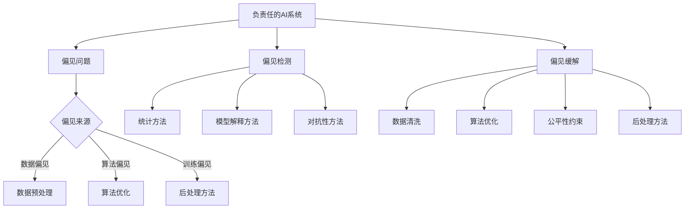

                 

### 文章标题

《负责任的AI系统：偏见检测与缓解策略》

### 关键词

负责任AI、偏见检测、缓解策略、算法、数学模型、实际应用

### 摘要

本文深入探讨了负责任的AI系统中的偏见检测与缓解策略。首先，我们介绍了AI系统中的偏见问题及其重要性。接着，通过Mermaid流程图，展示了负责任的AI系统、偏见检测与缓解策略的核心概念及其相互联系。本文详细讲解了偏见检测和缓解策略的核心算法原理，包括相关数学模型和公式的推导，并通过具体案例展示了实际应用。此外，我们还提供了开发环境搭建、源代码实现及代码解读与分析，以帮助读者更好地理解和应用这些策略。最后，本文总结了全文内容，并对未来研究方向和读者提出了建议。

---

## 第1章 引言与核心概念

### 1.1 负责任的AI系统

随着人工智能（AI）技术的飞速发展，AI系统已经被广泛应用于各个领域，从医疗诊断到金融分析，再到自动驾驶和智能家居。然而，AI系统的广泛应用也带来了新的挑战，其中之一就是AI系统中的偏见问题。偏见可能会在AI系统的决策过程中引入不公平性，影响系统的可信度和公正性，严重时甚至可能对社会造成负面影响。

负责任的AI（Responsible AI）因此成为一个重要的研究方向，其目标是通过一系列技术和策略来确保AI系统的透明性、公平性和可解释性。负责任的AI系统不仅要求在设计和开发过程中遵循伦理原则，还需要在运行过程中持续监控和调整，以防止和纠正偏见。

### 1.2 AI系统中的偏见

偏见在AI系统中可能来源于多个方面，包括但不限于：

- **数据偏见**：数据集中的样本可能存在选择偏差，无法代表整体人群，从而导致AI模型对某些群体产生偏见。
- **算法偏见**：某些算法在设计时可能隐含了某些偏见，比如针对特定性别、种族、年龄等特征的偏好。
- **训练偏见**：训练数据中可能包含了社会的现有偏见，这些偏见在模型中固化，导致AI系统在决策时表现出偏见。

这些偏见可能导致AI系统在特定情况下做出不公平的决策，比如在招聘系统中对某些种族或性别的不公平待遇，或者在信用评分系统中对贫困社区的歧视。

### 1.3 偏见检测与缓解策略

偏见检测（Bias Detection）和缓解策略（Bias Mitigation）是负责任AI系统中的关键组成部分。偏见检测旨在识别AI系统中的偏见，而缓解策略则致力于减轻或消除这些偏见。

#### 偏见检测

偏见检测技术可以分为以下几类：

1. **统计方法**：通过分析模型输出和预期结果之间的差异，检测是否存在系统性偏差。
2. **模型解释方法**：使用模型解释工具，如LIME（Local Interpretable Model-agnostic Explanations）和SHAP（SHapley Additive exPlanations），分析模型决策背后的原因。
3. **对抗性方法**：通过生成对抗性样本，检测模型在极端情况下的偏见。

#### 偏见缓解

偏见缓解策略包括以下几种：

1. **数据清洗**：通过移除或纠正训练数据中的偏见，减少数据偏见。
2. **算法优化**：通过改进算法设计，减少算法偏见。
3. **公平性约束**：在模型训练过程中引入公平性约束，确保模型对所有群体公平。
4. **后处理方法**：在模型输出后进行干预，调整决策以减少偏见影响。

### 1.4 Mermaid流程图：核心概念联系图示

以下是负责任的AI系统中偏见检测与缓解策略的核心概念及其相互联系的Mermaid流程图：

通过这个流程图，我们可以清晰地看到负责任的AI系统中各个核心概念之间的联系，以及如何通过偏见检测与缓解策略来解决偏见问题。

---

在下一章中，我们将深入探讨偏见检测算法的原理，包括基本概念、算法分类、伪代码示例以及相关的数学模型和公式。这将帮助我们更好地理解如何检测AI系统中的偏见，并为后续的缓解策略打下基础。

