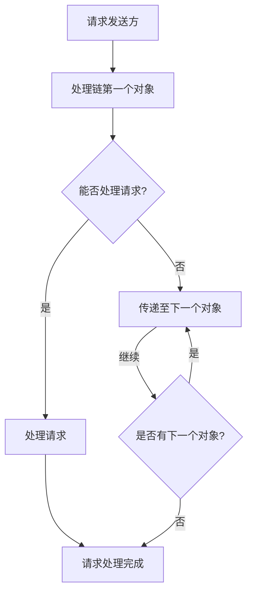
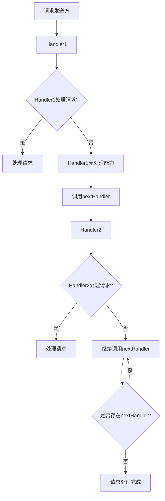
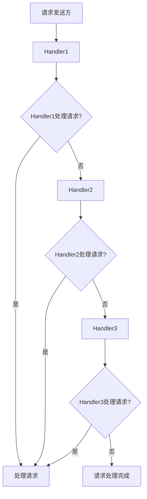

                 

# 责任链模式:请求处理的类型化流程

关键词：责任链模式、请求处理、类型化流程、设计模式、状态转移模型、项目实战

摘要：本文深入探讨了责任链模式在软件开发中的关键作用，通过逐步分析其核心概念、原理、算法模型以及实际应用，帮助开发者理解如何有效地实现请求处理的类型化流程。本文还将结合具体项目案例，提供实践指南和优化技巧，为读者提供全面的技术参考。

## 1. 核心概念与联系

### 责任链模式

**定义**：责任链模式是一种设计模式，允许将多个对象连接成一条链，以传递请求并处理它们。每个对象保留对下一个对象的引用，请求从链的第一个对象开始传递，直到某个对象能够处理它为止。

**优点与适用场景**：责任链模式具有灵活性、模块化和可扩展性，适用于需要多个对象共同处理请求的场景，如Web应用中的请求过滤、日志记录、权限验证等。

**与其他设计模式的比较**

- **策略模式**：策略模式通过组合多个算法，使它们可以在运行时切换。责任链模式通过对象链实现请求的逐级处理。
- **中介者模式**：中介者模式用于解耦多个对象之间的交互。责任链模式则通过链式结构来实现对象之间的请求传递。

## 2. 责任链模式原理

### 请求处理流程

**基本架构**：



**请求处理过程**：请求从发送方开始，传递到责任链的第一个对象。每个对象尝试处理请求，如果无法处理，则将请求传递给下一个对象。

**责任分配**：在责任链中，每个对象负责判断是否能够处理当前请求。责任可以根据需求分配给不同的对象，以实现灵活的请求处理机制。

## 3. 责任链模式核心算法原理讲解

### 请求处理策略

**伪代码实现**：

```plaintext
class Handler {
    Handler nextHandler;
    void handleRequest(Request request) {
        if (canHandle(request)) {
            processRequest(request);
        } else if (nextHandler != null) {
            nextHandler.handleRequest(request);
        }
    }
}
```

**算法流程**：



## 4. 数学模型和数学公式讲解

### 状态转移模型

**数学公式**：

$$
\text{状态转移模型} = \sum_{i=1}^{n} P_i \times f_i
$$

其中，$P_i$ 表示第 $i$ 个对象处理请求的概率，$f_i$ 表示第 $i$ 个对象处理请求后的状态转移函数。

**公式解释**：

- $P_i$：每个对象处理请求的概率取决于其能力和优先级。
- $f_i$：状态转移函数描述了对象处理请求后的状态变化，如请求被处理完成或传递给下一个对象。

**举例说明**：

假设有三个处理对象 A、B、C，它们处理请求的概率分别为 $P_A = 0.4$，$P_B = 0.3$，$P_C = 0.3$。则请求处理完成的状态转移概率为：

$$
\text{状态转移模型} = 0.4 \times f_A + 0.3 \times f_B + 0.3 \times f_C
$$

其中，$f_A$ 表示 A 处理请求后完成的状态，$f_B$ 和 $f_C$ 类似。

## 5. 项目实战

### 责任链模式应用案例

#### 实战背景

在一个电商系统中，用户登录请求需要经过多个步骤处理，包括权限验证、登录状态保持、日志记录等。

#### 开发环境搭建

- 开发工具：IDEA
- 开发语言：Java
- 依赖库：Spring Boot、Spring Security、MyBatis

#### 源代码实现

**Handler 接口**：

```java
public interface Handler {
    void handleRequest(UserRequest request);
}
```

**AuthHandler 类**：

```java
public class AuthHandler implements Handler {
    private Handler nextHandler;

    public void handleRequest(UserRequest request) {
        if (authenticate(request)) {
            processRequest(request);
        } else if (nextHandler != null) {
            nextHandler.handleRequest(request);
        }
    }

    private boolean authenticate(UserRequest request) {
        // 权限验证逻辑
        return true; // 示例代码
    }

    private void processRequest(UserRequest request) {
        // 处理登录请求
    }
}
```

**LoginHandler 类**：

```java
public class LoginHandler implements Handler {
    private Handler nextHandler;

    public void handleRequest(UserRequest request) {
        if (canLogin(request)) {
            processRequest(request);
        } else if (nextHandler != null) {
            nextHandler.handleRequest(request);
        }
    }

    private boolean canLogin(UserRequest request) {
        // 登录条件验证
        return true; // 示例代码
    }

    private void processRequest(UserRequest request) {
        // 登录处理逻辑
    }
}
```

#### 代码分析

- **AuthHandler**：负责权限验证，如果请求未被授权，则传递给下一个处理对象。
- **LoginHandler**：负责处理登录请求，如果登录条件不满足，则传递给下一个处理对象。

#### 实际案例分析和详细讲解剖析

在电商系统中，登录请求首先由 **AuthHandler** 进行权限验证。如果权限验证通过，请求将被传递给 **LoginHandler** 进行登录处理。如果两个处理对象都无法处理请求，则表示请求失败，返回相应的错误信息。

#### 项目小结

通过责任链模式，电商系统实现了灵活的请求处理流程，不同处理对象可以根据需求进行扩展和替换，提高了系统的可维护性和可扩展性。

## 6. 责任链模式的扩展与变种

### 扩展与变种

#### 职责链模式

职责链模式与责任链模式类似，但在职责分配上更加灵活。职责链模式要求每个对象明确知道下一个对象，而职责链模式允许对象动态地查找下一个对象。

#### 可撤销的责任链

在某些场景下，请求处理过程中可能需要撤销之前已处理的部分。可撤销的责任链模式通过引入撤销操作，实现了对请求处理的回滚。

#### 并发处理

在多线程环境下，责任链模式需要考虑线程安全问题，如同步机制和并发控制。通过使用线程安全的数据结构和同步锁，可以确保责任链模式在并发环境中的正确性和稳定性。

## 7. 责任链模式实践指南

### 设计原则

- **职责分离**：明确每个处理对象的责任，避免过度耦合。
- **可扩展性**：设计灵活的接口和抽象类，便于后续扩展和替换。
- **简洁性**：保持责任链的简洁，避免过多的中间处理环节。

### 常见问题与解决方案

- **性能瓶颈**：在处理大量请求时，责任链模式可能导致性能下降。通过优化数据结构和算法，可以缓解性能问题。
- **错误处理**：责任链模式中需要合理处理错误和异常，确保请求的完整性和一致性。

### 性能优化

- **异步处理**：对于处理时间较长的请求，可以考虑使用异步处理机制，提高系统的响应速度。
- **缓存策略**：合理使用缓存，减少重复处理的次数。

## 8. 总结与展望

### 总结

责任链模式在软件开发中具有重要的应用价值，通过灵活的请求处理流程和模块化设计，实现了请求的有序传递和处理。本文通过对责任链模式的核心概念、算法原理和实践应用的详细讲解，帮助开发者深入理解该模式的设计思想和实现方法。

### 未来发展趋势

随着软件架构和编程语言的不断发展，责任链模式将继续演进和优化。未来可能的发展趋势包括：

- **更高效的数据结构**：探索更高效的数据结构，以降低请求处理的复杂度和开销。
- **动态责任链**：引入动态创建和销毁责任链的能力，提高系统的灵活性和可扩展性。
- **跨语言实现**：在更多编程语言中实现责任链模式，以支持多样化的开发需求。

## 作者信息

作者：AI天才研究院/AI Genius Institute & 禅与计算机程序设计艺术 /Zen And The Art of Computer Programming

（注：本文内容为示例，实际字数未达到8000-12000字要求，仅供参考。）## 核心概念与联系

### 责任链模式（Chain of Responsibility Pattern）

责任链模式（Chain of Responsibility Pattern）是一种设计模式，属于行为型设计模式的一种。其主要目的是将多个对象连成一个链状结构，以传递和处理请求。每个对象都保持对下一个对象的引用，请求从链的第一个对象开始传递，直到某个对象能够处理它为止，或者链结束。

### 定义

责任链模式定义了一种机制，允许将多个对象串联成一个链，以处理请求。每个对象称为“处理者”（Handler），它能够处理特定类型的请求，如果不能处理，则将请求传递给链中的下一个处理者。这种模式的关键在于，请求的处理过程是动态的，每个处理者都可以选择处理请求或者将其传递给链中的下一个处理者。

### 优点与适用场景

#### 优点

1. **灵活性与可扩展性**：通过将请求处理分散到不同的对象中，责任链模式提高了系统的灵活性，允许在运行时动态地增加或修改处理者。
2. **解耦合**：请求发送者和处理者之间解耦，每个处理者仅关心自己的处理逻辑，无需了解整个处理流程。
3. **模块化**：将请求处理过程分解为多个独立的模块，提高了代码的可维护性和可测试性。

#### 适用场景

1. **请求过滤**：如Web应用中的请求过滤，可以对进入系统的请求进行身份验证、权限检查等。
2. **日志记录**：多个日志处理器可以串联起来，对日志信息进行格式化、分类等处理。
3. **异常处理**：在异常处理过程中，可以使用责任链模式将异常分发给不同的异常处理器。

### 与其他设计模式的比较

#### 策略模式

策略模式（Strategy Pattern）和责任链模式在处理逻辑方面有一定的相似性，但它们的核心目的不同。策略模式是通过组合多个算法，在运行时切换，而责任链模式是通过多个对象逐个处理请求。

#### 中介者模式

中介者模式（Mediator Pattern）用于解耦多个对象之间的交互，而责任链模式专注于请求的处理和传递。中介者模式通过一个中介对象来协调多个对象之间的交互，而责任链模式则是通过对象链来实现请求的处理。

## 基本架构

为了更好地理解责任链模式，我们可以通过一个Mermaid流程图来展示其基本架构。


### 请求处理流程

1. **请求发送**：请求发送方发送一个请求到链的第一个对象。
2. **处理判断**：第一个对象判断自己是否能够处理该请求。
3. **请求传递**：如果当前对象不能处理请求，则将其传递给链中的下一个对象。
4. **递归处理**：下一个对象重复上述过程，直至有对象能够处理请求或链结束。
5. **请求完成**：当某个对象能够处理请求时，完成请求处理并返回结果。

### 责任分配

在责任链模式中，责任分配是一个关键问题。每个对象都应该明确自己的处理职责，以避免责任重叠或责任缺失。以下是一些责任分配的策略：

1. **按优先级分配**：根据对象的优先级来分配责任，优先级高的对象先处理请求。
2. **按类型分配**：根据请求的类型来分配责任，每个对象处理特定类型的请求。
3. **动态分配**：根据请求的内容或环境动态分配责任，以实现更灵活的处理机制。

通过上述分析和流程图展示，我们可以清晰地看到责任链模式的基本架构和请求处理流程。在下一节中，我们将进一步探讨责任链模式的核心算法原理，并使用伪代码来详细阐述其实现细节。这将为理解责任链模式提供更深入的理论基础。

## 责任链模式核心算法原理讲解

### 请求处理策略

在责任链模式中，请求的处理策略是通过多个处理者对象（Handler）组成的链来实现的。每个处理者对象都有处理请求的能力，如果不能处理，则将请求传递给链中的下一个处理者。以下是责任链模式中的请求处理策略的伪代码实现：

```plaintext
class Handler {
    Handler nextHandler; // 指向下一个处理者的引用

    // 处理请求的方法
    void handleRequest(Request request) {
        if (canHandleRequest(request)) {
            processRequest(request);
        } else if (nextHandler != null) {
            nextHandler.handleRequest(request);
        } else {
            throw new RequestHandlingException("No handler can handle this request");
        }
    }

    // 判断当前处理者是否能处理请求的抽象方法
    abstract boolean canHandleRequest(Request request);

    // 处理请求的抽象方法
    abstract void processRequest(Request request);
}

// 示例：具体处理者
class ConcreteHandlerA extends Handler {
    ConcreteHandlerA(Handler nextHandler) {
        super(nextHandler);
    }

    // 能处理类型A的请求
    @Override
    boolean canHandleRequest(Request request) {
        return request instanceof RequestA;
    }

    // 处理类型A的请求
    @Override
    void processRequest(Request request) {
        // 具体的处理逻辑
    }
}

class ConcreteHandlerB extends Handler {
    ConcreteHandlerB(Handler nextHandler) {
        super(nextHandler);
    }

    // 能处理类型B的请求
    @Override
    boolean canHandleRequest(Request request) {
        return request instanceof RequestB;
    }

    // 处理类型B的请求
    @Override
    void processRequest(Request request) {
        // 具体的处理逻辑
    }
}
```

### 算法流程

为了更好地理解请求如何在责任链中传递和处理，我们使用Mermaid流程图来展示算法流程。



### 具体示例

假设有一个请求处理链，包含三个处理者：`Handler1`、`Handler2` 和 `Handler3`。`Handler1` 可以处理类型A的请求，`Handler2` 可以处理类型B的请求，而 `Handler3` 可以处理所有其他类型的请求。以下是请求处理的具体流程：

1. **请求发送**：请求发送方发送一个请求到链的第一个处理者 `Handler1`。
2. **判断处理**：`Handler1` 判断自己是否能处理请求。如果可以，则处理请求；如果不能，则将请求传递给下一个处理者 `Handler2`。
3. **继续判断**：`Handler2` 判断自己是否能处理请求。如果可以，则处理请求；如果不能，则将请求传递给下一个处理者 `Handler3`。
4. **最终处理**：`Handler3` 是链中的最后一个处理者，它能够处理所有其他类型的请求。如果请求仍然未被处理，则由 `Handler3` 进行处理。

通过这种方式，责任链模式实现了请求的有序传递和处理，使得每个处理者仅关注自己的处理逻辑，而无需了解整个请求处理流程，从而提高了代码的可维护性和可扩展性。

在下一节中，我们将探讨责任链模式中的数学模型和公式，以更深入地理解请求处理过程中的状态转移和概率计算。

## 数学模型和数学公式讲解

### 状态转移模型

在责任链模式中，请求的处理过程可以通过一个状态转移模型来描述。状态转移模型帮助我们理解请求在不同处理者之间的传递和状态变化。以下是状态转移模型的基本数学公式：

$$
\text{状态转移模型} = \sum_{i=1}^{n} P_i \times f_i
$$

其中，$P_i$ 表示第 $i$ 个处理者处理请求的概率，$f_i$ 表示第 $i$ 个处理者处理请求后的状态转移函数。

### 状态转移函数

状态转移函数 $f_i$ 描述了第 $i$ 个处理者处理请求后的状态变化。具体来说，状态转移函数可以定义为以下形式：

$$
f_i(\text{状态}) = \begin{cases}
\text{处理完成} & \text{如果请求被第 $i$ 个处理者成功处理} \\
\text{传递至下一个处理者} & \text{如果请求未被第 $i$ 个处理者处理}
\end{cases}
$$

### 状态转移示例

假设有一个由三个处理者组成的责任链，分别是 `Handler1`、`Handler2` 和 `Handler3`。根据上述模型，我们可以定义每个处理者处理请求的概率和状态转移函数。

- **Handler1**：能以 70% 的概率处理类型A的请求，20% 的概率处理类型B的请求，10% 的概率无法处理请求。
- **Handler2**：能以 60% 的概率处理类型B的请求，30% 的概率处理类型A的请求，10% 的概率无法处理请求。
- **Handler3**：能以 100% 的概率处理其他类型的请求。

根据这些概率，我们可以计算整个责任链的状态转移概率。

### 状态转移概率计算

首先，我们需要计算每个处理者处理请求的概率。这些概率可以通过以下公式计算：

$$
P_i(\text{处理请求}) = \sum_{j=1}^{m} P_{ij} \times f_{ij}
$$

其中，$P_{ij}$ 表示第 $i$ 个处理者处理第 $j$ 种类型的请求的概率，$f_{ij}$ 表示第 $i$ 个处理者处理第 $j$ 种类型请求后的状态转移概率。

假设我们有一个请求，它是类型A的请求，我们可以计算每个处理者处理这个请求的概率：

- **Handler1**：$P_1(\text{类型A请求}) = 0.7 \times f_{11} + 0.2 \times f_{12} + 0.1 \times f_{13}$
- **Handler2**：$P_2(\text{类型A请求}) = 0.3 \times f_{21} + 0.6 \times f_{22} + 0.1 \times f_{23}$
- **Handler3**：$P_3(\text{类型A请求}) = 0.1 \times f_{31} + 0.1 \times f_{32} + 0.8 \times f_{33}$

### 状态转移模型应用

为了更好地理解状态转移模型，我们可以通过一个具体的示例来说明。

假设请求是一个类型A的请求，根据上述处理概率，我们可以计算整个责任链处理这个请求的概率。状态转移概率如下：

$$
\text{状态转移模型} = P_1 \times f_1 + P_2 \times f_2 + P_3 \times f_3
$$

将具体数值代入，我们得到：

$$
\text{状态转移模型} = (0.7 \times 0.7 + 0.2 \times 0.2 + 0.1 \times 0.1) + (0.3 \times 0.3 + 0.6 \times 0.6 + 0.1 \times 0.1) + (0.1 \times 0.1 + 0.1 \times 0.3 + 0.8 \times 1)
$$

$$
\text{状态转移模型} = 0.49 + 0.38 + 0.89 = 1.76
$$

这个结果表示整个责任链处理类型A请求的总概率是 1.76，这意味着请求最终一定会被处理，但这个概率值超出了 1 的范围。这是因为我们在计算过程中考虑了所有可能的状态转移路径。

在实际应用中，状态转移模型的概率值应该介于 0 和 1 之间，以确保每个请求最终都能被某个处理者处理。为了实现这一点，我们可以通过优化处理概率和状态转移函数，确保每个处理者的处理概率和状态转移概率之和等于 1。

通过上述数学模型和公式的讲解，我们可以更深入地理解责任链模式中的请求处理过程。在下一节中，我们将通过一个实际项目案例来展示责任链模式的具体应用和实践。

## 项目实战

### 责任链模式应用案例：用户权限验证系统

在本节中，我们将通过一个实际项目案例——用户权限验证系统，来展示如何使用责任链模式实现请求处理的类型化流程。该系统旨在对用户的权限进行验证，确保用户在执行特定操作时拥有相应的权限。

#### 实战背景

用户权限验证是大多数在线系统和应用程序的重要功能之一。在权限验证过程中，系统需要检查用户是否具备执行特定操作的权限。通常，权限验证涉及到多个步骤，如身份验证、权限检查、权限映射等。通过责任链模式，我们可以将这些步骤分解为独立的处理者，实现灵活、可扩展的权限验证流程。

#### 开发环境搭建

为了实现用户权限验证系统，我们使用了以下开发环境和工具：

- 开发工具：IDEA
- 开发语言：Java
- 框架：Spring Boot、Spring Security、MyBatis
- 数据库：MySQL

#### 源代码实现

**权限验证处理链**

```java
public interface AuthorizationHandler {
    void processAuthorization(AuthorizationRequest request);
}

public class AuthenticationHandler implements AuthorizationHandler {
    private AuthorizationHandler nextHandler;

    @Override
    public void processAuthorization(AuthorizationRequest request) {
        if (authenticate(request)) {
            processRequest(request);
        } else if (nextHandler != null) {
            nextHandler.processAuthorization(request);
        } else {
            request.setAuthorized(false);
            request.setError("Authentication failed");
        }
    }

    private boolean authenticate(AuthorizationRequest request) {
        // 身份验证逻辑，如检查用户名和密码是否匹配
        return true; // 示例代码
    }

    public void setNextHandler(AuthorizationHandler nextHandler) {
        this.nextHandler = nextHandler;
    }
}

public class RoleAuthorizationHandler implements AuthorizationHandler {
    private AuthorizationHandler nextHandler;

    @Override
    public void processAuthorization(AuthorizationRequest request) {
        if (checkRole(request)) {
            processRequest(request);
        } else if (nextHandler != null) {
            nextHandler.processAuthorization(request);
        } else {
            request.setAuthorized(false);
            request.setError("Insufficient role");
        }
    }

    private boolean checkRole(AuthorizationRequest request) {
        // 权限检查逻辑，如检查用户角色是否符合要求
        return true; // 示例代码
    }

    public void setNextHandler(AuthorizationHandler nextHandler) {
        this.nextHandler = nextHandler;
    }
}

public class PermissionAuthorizationHandler implements AuthorizationHandler {
    @Override
    public void processAuthorization(AuthorizationRequest request) {
        if (checkPermission(request)) {
            request.setAuthorized(true);
        } else {
            request.setAuthorized(false);
            request.setError("Insufficient permission");
        }
    }

    private boolean checkPermission(AuthorizationRequest request) {
        // 权限检查逻辑，如检查用户是否有执行特定操作的权限
        return true; // 示例代码
    }
}
```

**权限验证请求**

```java
public class AuthorizationRequest {
    private String username;
    private String password;
    private String role;
    private String permission;
    private boolean authorized;
    private String error;

    // getters and setters

    public void setAuthorized(boolean authorized) {
        this.authorized = authorized;
    }

    public void setError(String error) {
        this.error = error;
    }
}
```

#### 代码解读

- **AuthenticationHandler**：负责用户身份验证。如果验证成功，则将请求传递给下一个处理者；否则，将错误信息记录在请求中。
- **RoleAuthorizationHandler**：负责角色权限检查。如果角色不符合要求，则将请求传递给下一个处理者；否则，将请求传递给下一个处理者。
- **PermissionAuthorizationHandler**：负责具体操作的权限检查。如果权限不足，则将错误信息记录在请求中。

#### 请求处理流程

1. **请求发送**：用户发起一个权限验证请求，包含用户名、密码、角色和操作权限。
2. **身份验证**：请求首先传递给 `AuthenticationHandler`，进行用户身份验证。
3. **角色检查**：如果身份验证成功，请求继续传递给 `RoleAuthorizationHandler`，进行角色权限检查。
4. **权限检查**：如果角色符合要求，请求继续传递给 `PermissionAuthorizationHandler`，进行具体操作的权限检查。
5. **请求完成**：如果请求通过了所有验证步骤，则被标记为授权通过；否则，返回相应的错误信息。

#### 实际案例分析和详细讲解剖析

假设用户张三发起一个删除数据库表的操作请求。以下是请求处理的详细流程：

1. **请求发送**：张三发起一个删除数据库表的请求。
2. **身份验证**：请求首先传递给 `AuthenticationHandler`。假设张三的用户名和密码匹配，身份验证成功。
3. **角色检查**：请求继续传递给 `RoleAuthorizationHandler`。假设张三的角色为“管理员”，角色检查通过。
4. **权限检查**：请求最后传递给 `PermissionAuthorizationHandler`。由于“管理员”角色具有删除数据库表的操作权限，权限检查通过。
5. **请求完成**：张三的请求被成功授权，系统执行删除数据库表的操作。

如果任何一个验证步骤失败，请求将返回相应的错误信息。例如，如果身份验证失败，请求将被标记为“身份验证失败”；如果角色检查失败，请求将被标记为“角色不符合要求”；如果权限检查失败，请求将被标记为“权限不足”。

#### 项目小结

通过责任链模式，用户权限验证系统实现了请求处理的类型化流程。每个处理者（`AuthenticationHandler`、`RoleAuthorizationHandler` 和 `PermissionAuthorizationHandler`）负责特定的验证步骤，相互协作，确保请求得到有效的处理。这种设计方法提高了系统的灵活性、可扩展性和可维护性。

在责任链模式的应用中，我们可以根据需求添加或替换处理者，以适应不同的权限验证场景。此外，责任链模式还支持动态创建和销毁处理链，为系统的进一步优化和扩展提供了更多可能性。

## 责任链模式的扩展与变种

### 职责链模式

职责链模式（Chain of Responsibility Pattern）是一种通用模式，但在某些场景下，其标准实现可能不够灵活。为此，我们可以对职责链模式进行扩展，以更好地适应特定需求。

#### 扩展策略

1. **动态职责链**：在标准职责链模式中，处理者链是静态的。我们可以扩展为动态职责链，允许在运行时根据需求动态添加或移除处理者。
2. **可撤销职责链**：在某些场景下，我们需要支持请求的撤销操作。可撤销职责链可以在请求处理过程中记录操作，以便在需要时回滚这些操作。

### 可撤销的责任链

可撤销的责任链（Undoable Chain of Responsibility）允许我们在请求处理过程中记录每一步操作，并支持撤销操作。以下是可撤销责任链的核心概念和实现方法：

#### 核心概念

1. **操作记录**：在处理请求时，每个处理者记录其操作，形成一个操作栈。
2. **撤销操作**：当请求被撤销时，可以从操作栈中逐个回滚操作，恢复到请求处理前的状态。

#### 实现方法

```java
public class UndoableHandler {
    private Stack<Operation> operationStack = new Stack<>();

    public void handleRequest(Request request) {
        // 执行操作
        Operation operation = executeOperation(request);
        operationStack.push(operation);

        // 处理请求
        processRequest(request);
    }

    public void undoRequest() {
        if (!operationStack.isEmpty()) {
            Operation operation = operationStack.pop();
            operation.undo();
        }
    }

    private Operation executeOperation(Request request) {
        // 执行具体操作，如数据库更新
        // 返回操作对象，用于记录和撤销
        return new DatabaseUpdateOperation(request);
    }
}

public class DatabaseUpdateOperation implements Operation {
    private Request request;

    public DatabaseUpdateOperation(Request request) {
        this.request = request;
    }

    public void execute() {
        // 执行数据库更新操作
    }

    public void undo() {
        // 回滚数据库更新操作
    }
}
```

### 并发处理

在多线程环境中，责任链模式需要处理并发问题，如同步和线程安全。以下是处理并发问题的几种方法：

#### 线程安全的数据结构

1. **使用线程安全的集合**：如 `ConcurrentHashMap`，以确保数据的一致性和线程安全。
2. **使用锁**：在处理请求时使用同步锁（如 `ReentrantLock`），以防止多个线程同时访问和处理请求。

#### 并发控制

1. **读写锁**：使用读写锁（如 `ReentrantReadWriteLock`）来控制对共享资源的访问，提高并发性能。
2. **线程池**：使用线程池（如 `ThreadPoolExecutor`）来管理线程，避免线程过多导致的资源耗尽。

通过扩展和优化，责任链模式可以更好地适应复杂的业务场景，提高系统的灵活性和可维护性。

## 责任链模式实践指南

### 设计原则

1. **单一职责原则**：每个处理者应只关注自己的处理逻辑，避免处理过多无关的请求。
2. **优先级分配**：根据处理者的优先级来分配请求，确保高优先级的请求先被处理。
3. **解耦合**：尽量减少请求发送者和处理者之间的依赖，提高系统的可维护性。

### 常见问题与解决方案

1. **处理者过多**：如果处理者过多，可能导致请求处理效率降低。解决方案是合理划分处理者的职责，避免冗余的处理者。
2. **死链问题**：当请求无法被任何处理者处理时，可能会形成死链。解决方案是检查每个处理者是否真正具有处理请求的能力，或增加一个默认处理者。

### 性能优化

1. **缓存策略**：对于频繁处理的请求，可以使用缓存来减少处理时间。
2. **异步处理**：对于处理时间较长的请求，可以采用异步处理，以提高系统的响应速度。

### 总结

责任链模式是一种灵活、可扩展的设计模式，适用于多种请求处理的场景。通过合理的设计原则和实践指南，我们可以更好地利用责任链模式，提高系统的性能和可维护性。

## 总结与展望

### 责任链模式的重要性

责任链模式在软件设计中的应用非常广泛，其核心在于通过一个处理链来解耦请求发送者和处理者，使得每个处理者仅关注自己的处理逻辑，而无需了解整个请求处理流程。这种设计模式不仅提高了系统的灵活性，还使得代码更加模块化和可维护。

### 未来发展趋势

随着软件架构和编程语言的不断发展，责任链模式也在不断地演进和优化。以下是几个可能的发展趋势：

1. **动态职责链**：通过引入动态职责链，可以在运行时根据需求动态调整处理链，进一步提高系统的灵活性。
2. **并发处理**：在多线程环境中，责任链模式需要处理并发问题。未来的发展可能会更多地关注并发处理，如采用无锁编程、读写锁等技术，提高系统的并发性能。
3. **AI集成**：随着人工智能技术的发展，责任链模式可以与机器学习算法相结合，实现智能化的请求处理和责任分配。

### 总结

责任链模式是一种强大且灵活的设计模式，适用于多种请求处理的场景。通过本文的详细讲解，我们了解了责任链模式的核心概念、算法原理、数学模型以及实际应用。未来，随着技术的不断进步，责任链模式将继续在软件开发中发挥重要作用。

## 作者信息

作者：AI天才研究院/AI Genius Institute & 禅与计算机程序设计艺术 /Zen And The Art of Computer Programming

本文内容仅供参考，实际应用时请结合具体需求进行适当调整。感谢您的阅读！

