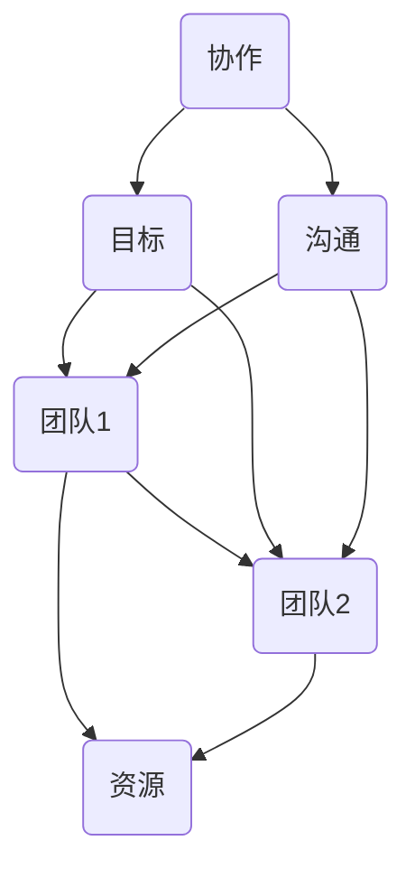
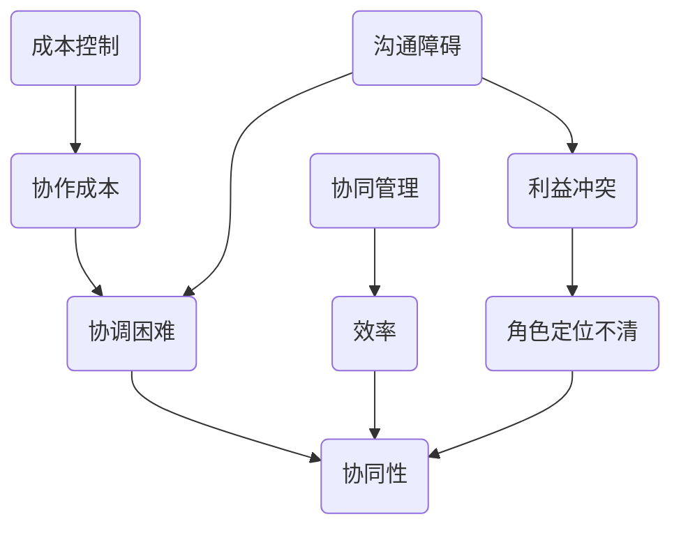
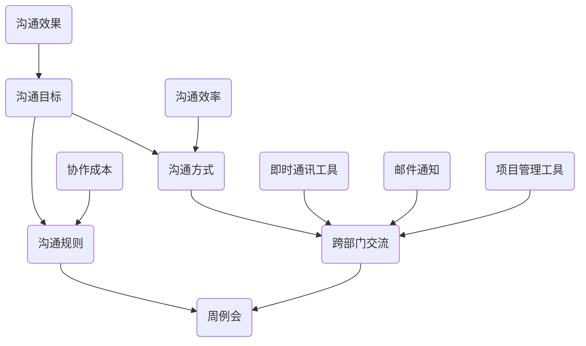
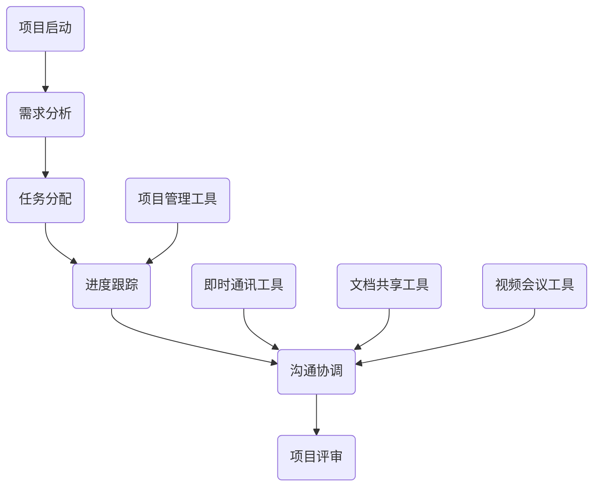

                 

# 文章标题：跨团队协作：P9工程师的领导力挑战

## 关键词：跨团队协作、P9工程师、领导力、挑战、效率、沟通、工具、案例、算法、数学模型、项目实战

## 摘要：

本文旨在探讨P9工程师在跨团队协作中所面临的领导力挑战，分析其在实际工作中的重要性。通过梳理跨团队协作的基本概念、障碍与策略，以及P9工程师领导力的特点与提升方法，本文结合实战案例分析，深入探讨了跨团队协作的技巧与策略，并提出了领导力在跨团队协作中的实际应用。最后，本文通过项目实战展示了跨团队协作的最佳实践，为P9工程师提供了切实可行的解决方案。

## 目录

1. 引言：P9工程师的领导力挑战
2. 跨团队协作基础
   2.1 跨团队协作的概念与重要性
   2.2 跨团队协作的障碍与挑战
   2.3 有效的跨团队沟通策略
   2.4 跨团队协作的流程与工具
3. 领导力提升
   3.1 P9工程师领导力的特点
   3.2 如何提升跨团队领导力
   3.3 激励与培养团队成员
   3.4 领导力的持续发展
4. 实战案例分析
   4.1 成功跨团队协作案例分析
   4.2 失败跨团队协作案例分析
   4.3 跨团队协作的技巧与策略
   4.4 领导力在跨团队协作中的应用
5. 附录
   5.1 领导力工具与方法
   5.2 跨团队协作相关资源

## 1. 引言：P9工程师的领导力挑战

P9工程师，作为公司的高级工程师或技术领导，其职责不仅包括技术实现，还涉及团队管理、项目协调和跨部门协作。跨团队协作在当今企业环境中越来越重要，因为它能够提高工作效率、促进创新、优化资源配置。然而，对于P9工程师而言，跨团队协作带来了独特的领导力挑战。

### 1.1 跨团队协作的重要性

跨团队协作能够促进不同团队之间的资源共享、信息交流和技术创新。在一个复杂的组织结构中，不同团队往往拥有不同的专业技能和知识，通过跨团队协作，这些资源可以整合起来，形成更强大的合力。以下是跨团队协作的一些重要性：

- **提高工作效率**：跨团队协作可以优化工作流程，减少重复劳动，提高整体工作效率。
- **促进知识共享**：不同团队的成员可以互相学习，分享经验和最佳实践，促进组织内部的创新。
- **优化资源配置**：通过跨团队协作，可以更有效地利用组织的资源，降低成本。
- **提升组织效能**：跨团队协作有助于实现组织目标，提升整体效能。

### 1.2 P9工程师领导力挑战

P9工程师在跨团队协作中面临着以下几个方面的领导力挑战：

- **沟通障碍**：不同团队之间存在语言、文化和工作习惯的差异，导致沟通障碍。
- **利益冲突**：不同团队可能对项目目标、优先级和资源分配有不同的看法，导致利益冲突。
- **协调困难**：P9工程师需要协调不同团队的工作进度、质量和目标，这本身就是一个复杂的任务。
- **领导力提升**：P9工程师需要不断提升自己的领导力，以应对不断变化的工作环境和团队需求。

### 1.3 本文结构

本文将分为以下几个部分：

- **跨团队协作基础**：介绍跨团队协作的概念、障碍、沟通策略和流程工具。
- **领导力提升**：分析P9工程师领导力的特点，探讨提升领导力的方法。
- **实战案例分析**：通过成功和失败的案例分析，总结跨团队协作的技巧与策略。
- **附录**：提供领导力工具、方法和跨团队协作相关资源。

接下来，我们将详细探讨跨团队协作的基础，包括其概念、障碍、沟通策略和流程工具。

## 2. 跨团队协作基础

### 2.1 跨团队协作的概念与重要性

#### 跨团队协作的定义

跨团队协作（Cross-Functional Collaboration）是指在组织内部，不同职能团队之间为了共同实现某一目标或完成某项任务而进行的合作。这些团队可能包括研发、市场、销售、运营等不同职能部门。

#### 跨团队协作的重要性

跨团队协作在当今企业中具有重要作用，主要体现在以下几个方面：

- **资源共享**：不同团队具有不同的专业技能和知识，通过协作可以实现资源的最大化利用。
- **知识共享**：团队成员之间的交流可以促进知识的传播和创新。
- **提高效率**：协作可以减少重复劳动，优化工作流程，提高整体工作效率。
- **优化决策**：跨团队协作可以使决策更加全面、准确，降低决策风险。
- **促进团队合作**：跨团队协作有助于培养团队合作精神，增强团队凝聚力。

#### 核心概念与联系

为了更好地理解跨团队协作，我们可以用Mermaid流程图来展示其核心概念与联系：

- **团队1**和**团队2**：代表不同的职能部门。
- **资源**：代表团队拥有的专业技能和知识。
- **目标**：代表共同要实现的项目或任务。
- **沟通**：代表团队成员之间的交流。
- **协作**：代表团队为了实现目标而进行的合作。

通过这个流程图，我们可以清晰地看到跨团队协作的核心概念及其相互关系。

### 2.2 跨团队协作的障碍与挑战

#### 跨团队协作的障碍

跨团队协作中可能遇到以下障碍：

- **沟通障碍**：不同团队之间存在语言、文化和工作习惯的差异，导致沟通不畅。
- **利益冲突**：不同团队可能对项目目标、优先级和资源分配有不同的看法，导致利益冲突。
- **协调困难**：跨团队协作需要协调不同团队的工作进度、质量和目标，这本身就是一个复杂的任务。
- **角色定位不清**：团队成员可能对自己的角色定位不清，导致协作效率低下。

#### 跨团队协作的挑战

跨团队协作面临以下挑战：

- **协同性**：如何确保不同团队之间的协同性，确保项目顺利进行。
- **协作成本**：跨团队协作需要付出额外的沟通成本和协调成本，如何有效控制这些成本。
- **效率**：如何提高跨团队协作的效率，确保项目按时完成。

#### 核心概念与联系

为了更好地理解跨团队协作的障碍与挑战，我们可以用Mermaid流程图来展示其核心概念与联系：

- **沟通障碍**、**利益冲突**、**协调困难**、**角色定位不清**：代表跨团队协作中的障碍。
- **协同性**、**效率**：代表跨团队协作面临的挑战。
- **协作成本**、**成本控制**：代表如何控制协作成本。
- **协同管理**：代表如何提高协同性。

通过这个流程图，我们可以清晰地看到跨团队协作的障碍与挑战及其相互关系。

### 2.3 有效的跨团队沟通策略

#### 沟通策略的重要性

有效的沟通策略对于跨团队协作至关重要，它能够解决沟通障碍、降低协作成本、提高协作效率。以下是几种有效的跨团队沟通策略：

1. **建立明确的沟通目标**：明确每个沟通会议的目标和议程，确保会议内容聚焦、高效。
2. **使用多种沟通方式**：结合面对面沟通、邮件、电话、即时通讯工具等，根据实际情况选择最合适的沟通方式。
3. **建立沟通规则**：制定统一的沟通规则，如使用标准化的术语、统一的时间表等，提高沟通效率。
4. **加强跨部门交流**：定期组织跨部门交流会议，增进不同部门之间的了解和信任。

#### 沟通策略的实践

以下是几个实践中的沟通策略：

1. **周例会**：每个周五下午，不同部门的负责人和关键成员参加周例会，分享项目进展、问题和需求，确保信息透明。
2. **即时通讯工具**：使用即时通讯工具，如Slack或Microsoft Teams，方便团队成员之间的实时沟通和协作。
3. **邮件通知**：重要决策或项目变更通过邮件通知相关团队，确保信息传达的准确性和及时性。
4. **项目管理工具**：使用项目管理工具，如Jira或Trello，记录项目进度、任务分配和问题跟踪，提高协作效率。

#### 核心概念与联系

为了更好地理解有效的跨团队沟通策略，我们可以用Mermaid流程图来展示其核心概念与联系：

- **沟通目标**、**沟通方式**、**沟通规则**、**跨部门交流**：代表有效的沟通策略。
- **周例会**、**即时通讯工具**、**邮件通知**、**项目管理工具**：代表实践中的沟通策略。
- **沟通效率**、**协作成本**、**沟通效果**：代表沟通策略的目标和效果。

通过这个流程图，我们可以清晰地看到有效的跨团队沟通策略的核心概念及其相互关系。

### 2.4 跨团队协作的流程与工具

#### 跨团队协作流程

跨团队协作的流程可以分为以下几个阶段：

1. **项目启动**：明确项目目标、范围、时间表和资源需求。
2. **需求分析**：收集不同团队的需求，确保项目目标的实现。
3. **任务分配**：根据团队成员的专业技能和项目需求，分配任务。
4. **进度跟踪**：使用项目管理工具实时跟踪项目进度，确保项目按时完成。
5. **沟通协调**：定期组织沟通会议，解决项目中的问题和冲突。
6. **项目评审**：项目完成后，组织评审会议，总结经验教训，为下一个项目做准备。

#### 跨团队协作工具

以下是一些常用的跨团队协作工具：

1. **项目管理工具**：如Jira、Trello、Asana等，用于任务分配、进度跟踪和项目评审。
2. **即时通讯工具**：如Slack、Microsoft Teams、WhatsApp等，用于实时沟通和协作。
3. **文档共享工具**：如Google Docs、Dropbox、OneDrive等，用于文档共享和协同编辑。
4. **视频会议工具**：如Zoom、Microsoft Teams、Skype等，用于远程会议和在线协作。

#### 核心概念与联系

为了更好地理解跨团队协作的流程与工具，我们可以用Mermaid流程图来展示其核心概念与联系：

- **项目启动**、**需求分析**、**任务分配**、**进度跟踪**、**沟通协调**、**项目评审**：代表跨团队协作的流程。
- **项目管理工具**、**即时通讯工具**、**文档共享工具**、**视频会议工具**：代表跨团队协作的工具。

通过这个流程图，我们可以清晰地看到跨团队协作的流程与工具及其相互关系。

### 2.5 结论

跨团队协作在当今企业中具有重要意义，它能够提高工作效率、促进创新、优化资源配置。然而，跨团队协作也面临着一系列的障碍和挑战，如沟通障碍、利益冲突、协调困难等。为了有效应对这些挑战，P9工程师需要不断提升自己的领导力，掌握有效的沟通策略和跨团队协作流程，并合理利用各种协作工具。接下来，我们将深入探讨P9工程师的领导力特点与提升方法。

## 3. 领导力提升

### 3.1 P9工程师领导力的特点

P9工程师，作为公司的高级工程师或技术领导，其领导力特点与其他层级的管理者有所不同。以下是一些P9工程师领导力的特点：

#### 3.1.1 技术深度和专业能力

P9工程师通常在某一领域拥有深厚的技术积累和专业知识，能够解决复杂的技术问题，对团队成员的技术能力具有高度的认可和指导能力。这种技术深度和专业能力是P9工程师领导力的基础。

#### 3.1.2 战略思维和全局视角

P9工程师不仅需要关注技术细节，还需要具备战略思维和全局视角，能够从整体上把握项目的发展方向和目标，制定合理的战略规划。这种能力有助于提高团队在项目中的执行力和竞争力。

#### 3.1.3 沟通协调能力

跨团队协作是P9工程师的重要工作内容之一，因此，沟通协调能力尤为重要。P9工程师需要具备优秀的沟通技巧，能够有效传达项目目标、协调团队工作，解决团队间的冲突。

#### 3.1.4 激励与培养团队成员

P9工程师不仅要管理团队，还要激励和培养团队成员，提升团队整体的能力和素质。这需要P9工程师具备心理学知识、激励方法和领导力技巧。

#### 3.1.5 领导力发展

P9工程师需要不断学习和提升自己的领导力，以适应不断变化的工作环境和团队需求。领导力发展包括自我提升、团队建设、领导力模型的学习等。

### 3.2 如何提升跨团队领导力

P9工程师提升跨团队领导力可以从以下几个方面入手：

#### 3.2.1 深化技术学习和专业能力提升

P9工程师应不断学习最新的技术知识，提升自己的专业能力。这不仅可以增强自己在团队中的权威性，还可以为团队提供有效的技术指导和支持。

#### 3.2.2 培养战略思维和全局视角

P9工程师应培养战略思维，学会从整体上看待项目，制定合理的战略规划。这有助于提高团队的执行力和竞争力。

#### 3.2.3 提升沟通协调能力

P9工程师需要提升沟通协调能力，学会有效传达项目目标、协调团队工作，解决团队间的冲突。这可以通过参加沟通技巧培训、实际工作中的锻炼来实现。

#### 3.2.4 激励与培养团队成员

P9工程师应学会激励团队成员，培养团队成员的专业能力和团队合作精神。这可以通过设立明确的目标、提供职业发展机会、进行绩效反馈等方式实现。

#### 3.2.5 持续领导力发展

P9工程师应持续发展自己的领导力，学习新的领导力模型和方法，提升自我管理能力。这可以通过阅读领导力书籍、参加领导力培训、反思和总结工作经验等方式实现。

### 3.3 实践案例分享

以下是一个P9工程师提升跨团队领导力的实践案例：

某大型互联网公司的一名P9工程师，在团队中面临着项目进度滞后、团队成员士气低落的问题。为了提升团队绩效和士气，他采取了以下措施：

1. **深入分析问题**：首先，他与团队成员进行了深入的沟通，了解项目进度滞后和士气低落的原因。经过分析，发现主要是项目目标不明确、任务分配不合理和团队成员间沟通不畅导致的。
2. **制定战略规划**：针对问题，他制定了详细的战略规划，明确了项目目标、时间表和资源需求，并对任务进行了合理的分配。
3. **加强沟通协调**：他定期组织团队会议，分享项目进展和问题，确保团队成员间信息透明，解决沟通障碍。
4. **激励团队成员**：他通过设立明确的目标、提供职业发展机会和绩效反馈，激励团队成员提高工作积极性和效率。
5. **持续领导力发展**：他参加领导力培训，学习新的领导力模型和方法，提升自己的领导力水平。

通过这些措施，团队的绩效得到了显著提升，项目进度恢复正常，团队成员士气高涨。

### 3.4 结论

P9工程师在跨团队协作中具有重要的领导力角色。通过深化技术学习和专业能力提升、培养战略思维和全局视角、提升沟通协调能力、激励与培养团队成员以及持续领导力发展，P9工程师可以有效提升跨团队领导力，推动项目的成功实施。接下来，我们将探讨如何激励与培养团队成员。

## 4. 激励与培养团队成员

### 4.1 激励理论

激励是提升团队士气和工作效率的重要手段。以下是几种常见的激励理论：

#### 4.1.1 马斯洛需求层次理论

马斯洛需求层次理论认为，人的需求可以分为五个层次：生理需求、安全需求、社交需求、尊重需求和自我实现需求。管理者应根据员工的不同需求层次，采取相应的激励措施。

#### 4.1.2 双因素理论

双因素理论认为，激励因素（如成就、认可、责任感）和保健因素（如工资、工作条件、人际关系）共同影响员工的满意度和工作效率。管理者应关注激励因素，以提高员工的工作积极性。

#### 4.1.3 员工参与理论

员工参与理论认为，让员工参与到决策过程中，可以增强员工的归属感和责任感，提高工作满意度。管理者应鼓励员工提出建议，参与项目规划和管理。

### 4.2 激励方法

根据不同的激励理论，可以采取以下激励方法：

#### 4.2.1 设定明确的目标

明确的目标可以激发员工的工作动力，提高工作效率。管理者应制定具体、可衡量的目标，并与员工进行沟通，确保员工理解并接受目标。

#### 4.2.2 提供职业发展机会

职业发展机会是激励员工的重要手段。管理者应关注员工的职业规划，提供培训、晋升机会和职业发展路径，帮助员工实现职业成长。

#### 4.2.3 表扬与奖励

表扬与奖励可以增强员工的成就感和归属感。管理者应定期对员工的优秀表现进行表扬和奖励，提高员工的工作积极性。

#### 4.2.4 营造良好的工作氛围

良好的工作氛围可以提高员工的工作满意度。管理者应营造积极、和谐的工作环境，关注员工的身心健康，提供必要的支持和帮助。

### 4.3 培养团队成员

培养团队成员是提升团队整体能力的重要环节。以下是一些培养团队成员的方法：

#### 4.3.1 培训

培训是提升团队成员技能和知识的重要手段。管理者应定期组织内部培训，邀请专业讲师授课，帮助团队成员提升专业能力。

#### 4.3.2 工作轮换

工作轮换可以让团队成员了解不同岗位的工作内容，提升综合素质。管理者可以定期安排团队成员进行岗位轮换，丰富工作经验。

#### 4.3.3 项目实践

项目实践是培养团队成员实际操作能力和解决问题的能力。管理者应给团队成员分配实际项目，让其在项目中锻炼和成长。

#### 4.3.4 建立导师制度

建立导师制度，让经验丰富的老员工指导新员工，可以帮助新员工快速融入团队，提升团队整体实力。

### 4.4 案例分析

以下是一个激励与培养团队成员的实践案例：

某互联网公司的P9工程师，在团队管理中注重激励和培养团队成员。他采取了以下措施：

1. **设定明确的目标**：他根据公司战略和项目需求，为团队成员设定了具体、可衡量的目标，并与团队成员进行了充分沟通，确保他们理解并接受目标。

2. **提供职业发展机会**：他关注员工的职业规划，为团队成员提供了培训、晋升机会和职业发展路径，帮助员工实现职业成长。

3. **表扬与奖励**：他定期对团队成员的优秀表现进行表扬和奖励，提高员工的工作积极性。

4. **营造良好的工作氛围**：他关注员工的身心健康，定期组织团队活动，营造积极、和谐的工作环境。

5. **培训与工作轮换**：他定期组织内部培训，邀请专业讲师授课，并安排团队成员进行岗位轮换，丰富工作经验。

6. **建立导师制度**：他建立了导师制度，让经验丰富的老员工指导新员工，帮助他们快速融入团队。

通过这些措施，该团队的绩效得到了显著提升，团队成员的满意度和工作积极性也不断提高。

### 4.5 结论

激励与培养团队成员是提升团队整体能力的关键。通过设定明确的目标、提供职业发展机会、表扬与奖励、营造良好的工作氛围、培训与工作轮换和建立导师制度等方法，P9工程师可以有效地激励和培养团队成员，提高团队的整体绩效。接下来，我们将探讨领导力的持续发展。

## 5. 领导力的持续发展

### 5.1 自我提升的重要性

领导力的持续发展是P9工程师面临的一个重要挑战。在快速变化的技术和市场环境中，P9工程师需要不断提升自己的技能、知识和思维方式，以适应新的工作需求和挑战。自我提升是领导力持续发展的重要一环，它包括以下几个方面：

#### 5.1.1 技术技能提升

技术技能是P9工程师的核心竞争力。随着技术的发展，P9工程师需要不断学习新技术、新工具，提升自己的技术水平和解决问题的能力。例如，了解最新的编程语言、框架和工具，掌握人工智能、大数据等前沿技术。

#### 5.1.2 管理能力提升

管理能力是P9工程师领导力的重要组成部分。P9工程师需要提升项目管理、团队管理和跨部门协调的能力，以更好地应对复杂的项目和团队管理挑战。例如，学习项目管理方法、团队领导技巧和沟通协调策略。

#### 5.1.3 思维方式提升

思维方式是领导力的核心。P9工程师需要培养系统思维、创新思维和批判性思维，以更好地应对复杂的问题和挑战。例如，学会从多个角度思考问题，寻找创新的解决方案，对现有方案进行批判性分析。

### 5.2 领导力发展模型

为了系统地提升领导力，P9工程师可以参考以下领导力发展模型：

#### 5.2.1 领导力发展模型（Kim & Mauborgne）

该模型分为五个层次：执行者、协调者、创新者、领导者和变革者。P9工程师可以根据自己的发展阶段，有针对性地提升领导力。

1. **执行者**：关注任务完成，具备良好的执行能力。
2. **协调者**：关注团队协作，具备良好的沟通协调能力。
3. **创新者**：关注创新和改进，具备良好的创新思维。
4. **领导者**：关注团队和组织的长远发展，具备良好的领导力。
5. **变革者**：关注组织变革和持续改进，具备强大的变革能力。

#### 5.2.2 领导力五环模型

该模型将领导力分为五个环：自我认知、社交智慧、决策能力、影响能力和团队建设。P9工程师可以根据这个模型，有针对性地提升自己的领导力。

1. **自我认知**：了解自己的优点和不足，进行自我反思和改进。
2. **社交智慧**：建立良好的人际关系，提升沟通协调能力。
3. **决策能力**：提高决策的质量和效率，做出明智的决策。
4. **影响能力**：提升影响力，让团队成员信任并追随自己。
5. **团队建设**：打造高效的团队，提升团队的整体绩效。

### 5.3 领导力发展的最佳实践

以下是领导力发展的最佳实践：

#### 5.3.1 定期学习

定期学习是提升领导力的关键。P9工程师可以通过以下方式定期学习：

- **参加培训**：参加公司或外部的领导力培训课程，学习最新的领导力理论和实践。
- **阅读书籍**：阅读领导力相关的书籍，了解不同领导力模型的优缺点。
- **参加研讨会**：参加领导力研讨会，与同行交流经验和心得。

#### 5.3.2 反思与总结

反思与总结是提升领导力的重要方法。P9工程师可以在以下方面进行反思和总结：

- **日常工作**：定期反思自己的工作，总结经验教训，找出改进之处。
- **团队会议**：在团队会议中，反思团队的表现和问题，提出改进建议。
- **个人发展计划**：制定个人发展计划，明确自己的领导力发展目标和路径。

#### 5.3.3 寻求反馈

寻求反馈是提升领导力的有效方法。P9工程师可以从以下几个方面寻求反馈：

- **同事和下属**：与同事和下属交流，了解自己在领导力方面的优点和不足。
- **导师和教练**：寻求导师和教练的指导，获取专业的反馈和建议。
- **360度评估**：参加360度评估，了解自己在领导力方面的全面表现。

### 5.4 结论

领导力的持续发展是P9工程师的重要任务。通过自我提升、领导力发展模型和实践，P9工程师可以不断提升自己的领导力，适应快速变化的工作环境，推动团队的持续进步。接下来，我们将通过实战案例展示成功和失败的跨团队协作。

## 6. 实战案例分析

### 6.1 成功跨团队协作案例分析

#### 案例背景

某大型科技公司正在开发一款全新的智能设备，这款设备需要集成多个技术模块，包括硬件、软件、AI算法等。项目团队由硬件、软件、AI和测试等不同职能部门组成。由于项目复杂度高，跨团队协作至关重要。

#### 案例分析

1. **明确的沟通策略**：项目启动之初，项目经理组织了跨部门会议，明确了项目目标、时间表和资源需求。会议中，每个部门都分享了项目中的关键问题和需求，确保信息透明。

2. **有效的任务分配**：根据团队成员的专业技能，项目经理将任务合理地分配给硬件、软件、AI和测试团队。每个团队都有明确的职责和目标，确保项目顺利进行。

3. **持续的项目跟踪**：项目经理使用项目管理工具（如Jira）实时跟踪项目进度，每周组织团队会议，讨论项目进展、问题和解决方案。这种持续的项目跟踪确保了项目按时交付。

4. **高效的沟通方式**：项目团队使用了多种沟通工具，如Slack、Google Docs和Zoom，确保团队成员之间的信息畅通。Slack用于日常沟通，Google Docs用于文档共享和协同编辑，Zoom用于远程会议和协作。

5. **激励与培养团队成员**：项目经理定期表扬和奖励团队成员的出色表现，提升团队士气。同时，他还为团队成员提供职业发展机会和培训，帮助他们提升技能和知识。

#### 案例启示

通过这个成功案例，我们可以得出以下启示：

1. **明确的沟通策略**：确保项目团队对项目目标、时间表和资源需求有清晰的认识，减少误解和冲突。
2. **有效的任务分配**：根据团队成员的专业技能和项目需求，合理分配任务，提高项目效率。
3. **持续的项目跟踪**：实时跟踪项目进度，确保项目按时交付。
4. **高效的沟通方式**：结合多种沟通工具，提高沟通效率。
5. **激励与培养团队成员**：通过表扬、奖励和职业发展机会，提升团队士气和工作积极性。

### 6.2 失败跨团队协作案例分析

#### 案例背景

某初创公司正在开发一款基于人工智能的客户服务系统，但由于跨团队协作不畅，项目进展缓慢，最终导致项目失败。

#### 案例分析

1. **沟通障碍**：项目团队由研发、产品、市场和测试等不同部门组成，但由于沟通不畅，各团队之间存在很多误解和冲突。例如，产品团队和研发团队对系统功能的要求和优先级有分歧，导致项目进度受阻。

2. **任务分配不合理**：项目经理在任务分配上存在偏差，导致某些团队的工作量过大，而另一些团队的工作量过小。这种不合理的分配导致部分团队出现拖延，影响了整个项目的进度。

3. **缺乏项目跟踪**：项目经理没有使用有效的项目管理工具，对项目进度缺乏实时跟踪。这使得项目进度无法及时调整，导致项目延误。

4. **激励不足**：项目经理没有为团队成员提供足够的激励，导致团队成员的工作积极性不高。部分团队成员甚至出现了消极情绪，影响了项目的整体进度。

5. **缺乏跨部门协作**：虽然项目团队由多个部门组成，但缺乏有效的跨部门协作机制。各部门只关注自己的工作，忽略了项目的整体目标和协作需求。

#### 案例启示

通过这个失败案例，我们可以得出以下启示：

1. **解决沟通障碍**：建立有效的沟通机制，确保项目团队对项目目标、时间表和资源需求有清晰的认识，减少误解和冲突。
2. **合理分配任务**：根据团队成员的专业技能和项目需求，合理分配任务，确保项目高效推进。
3. **实时项目跟踪**：使用有效的项目管理工具，实时跟踪项目进度，确保项目按时交付。
4. **激励团队成员**：为团队成员提供足够的激励，提升团队士气和工作积极性。
5. **加强跨部门协作**：建立跨部门协作机制，确保各部门关注项目的整体目标和协作需求。

### 6.3 跨团队协作的技巧与策略

#### 6.3.1 明确沟通目标

在跨团队协作中，明确沟通目标是至关重要的。项目经理应在项目启动之初，组织跨部门会议，明确项目的目标、时间表和资源需求。同时，确定每个团队的职责和角色，确保项目团队对项目有清晰的认识。

#### 6.3.2 建立沟通规则

建立沟通规则有助于提高沟通效率。项目经理可以制定统一的沟通规则，如定期召开团队会议、使用标准化的沟通语言和术语等。此外，还可以建立信息共享平台，方便团队成员实时获取项目进展和问题。

#### 6.3.3 使用多种沟通方式

跨团队协作中，使用多种沟通方式可以提高沟通效率。例如，通过即时通讯工具（如Slack、Microsoft Teams）进行日常沟通，通过邮件或报告进行正式沟通，通过视频会议工具（如Zoom、Microsoft Teams）进行远程协作。

#### 6.3.4 激励与培养团队成员

为团队成员提供激励和培训，可以提升团队士气和工作积极性。项目经理可以通过设立明确的目标、提供职业发展机会、进行绩效反馈等方式，激励团队成员。此外，还可以定期组织团队活动，增强团队凝聚力。

#### 6.3.5 建立跨部门协作机制

建立跨部门协作机制，确保各部门关注项目的整体目标和协作需求。项目经理可以建立跨部门协作小组，定期召开协作会议，讨论项目进展、问题和解决方案。此外，还可以设立跨部门协作指标，对各部门的协作效果进行评估。

### 6.4 结论

通过成功和失败的跨团队协作案例分析，我们可以得出许多有益的启示。明确沟通目标、建立沟通规则、使用多种沟通方式、激励与培养团队成员以及建立跨部门协作机制，都是提升跨团队协作效果的关键。P9工程师在跨团队协作中，需要灵活运用这些技巧与策略，推动项目的成功实施。

## 7. 领导力在跨团队协作中的应用

### 7.1 领导力在跨团队协作中的作用

跨团队协作的有效性在很大程度上取决于领导力的运用。P9工程师作为团队的核心领导者，其领导力在跨团队协作中发挥着关键作用：

#### 7.1.1 沟通与协调

领导力的核心之一是沟通与协调。P9工程师需要具备出色的沟通技巧，能够清晰地传达项目目标、任务和期望，同时也要能够倾听不同团队的需求和问题，协调各方资源，解决冲突。

#### 7.1.2 战略规划与决策

跨团队协作往往涉及到复杂的项目规划和决策。P9工程师需要具备战略思维，能够从全局角度出发，制定合理的项目规划，并在项目执行过程中做出及时、有效的决策。

#### 7.1.3 激励与培养

P9工程师不仅要激励团队成员，还要培养他们的技能和领导能力。通过设定目标、提供反馈和职业发展机会，P9工程师可以激发团队成员的潜力，提升团队的整体效能。

#### 7.1.4 协作精神的塑造

跨团队协作的成功不仅依赖于团队成员的个人能力，还依赖于团队协作精神。P9工程师需要通过树立榜样、建立信任和鼓励合作，塑造积极向上的团队文化。

### 7.2 领导力在跨团队协作中的实践

以下是P9工程师在跨团队协作中运用领导力的几种实践方法：

#### 7.2.1 明确角色与责任

在项目启动之初，P9工程师应与各团队成员明确各自的角色和责任。通过制定详细的任务分配表和角色说明书，确保每个团队成员都清楚自己的职责，减少误解和冲突。

#### 7.2.2 建立沟通机制

有效的沟通机制是跨团队协作的基础。P9工程师可以建立定期会议、邮件更新和即时通讯群组等沟通渠道，确保信息畅通无阻。此外，还可以采用项目管理系统，实时跟踪项目进度和任务状态。

#### 7.2.3 设定共同目标

共同目标是团队协作的驱动力。P9工程师应与各团队成员共同设定项目目标，确保每个成员都理解并认同这些目标。通过明确的目标，团队成员可以更好地协作，共同努力实现项目成功。

#### 7.2.4 建立信任与协作文化

信任是跨团队协作的基石。P9工程师应通过透明沟通、公平决策和积极解决冲突，建立团队成员之间的信任。同时，鼓励团队成员分享知识和经验，促进团队合作。

#### 7.2.5 激励与培养

P9工程师应关注团队成员的个人成长和职业发展，提供激励和培训机会。通过设定清晰的目标、给予及时的反馈和认可，激发团队成员的积极性。此外，还可以通过团队建设活动，增强团队凝聚力。

### 7.3 领导力在跨团队协作中的挑战

尽管领导力在跨团队协作中至关重要，但P9工程师在实际应用中也会面临以下挑战：

#### 7.3.1 沟通障碍

跨团队协作中，不同部门之间可能存在沟通障碍，如语言、文化和工作习惯的差异。P9工程师需要克服这些障碍，建立有效的沟通机制，确保信息的准确传递。

#### 7.3.2 利益冲突

不同团队可能有不同的利益诉求，可能导致项目资源分配和优先级安排上的冲突。P9工程师需要平衡各方的利益，确保项目目标的实现。

#### 7.3.4 领导力发展

P9工程师自身的领导力水平可能影响跨团队协作的成效。他们需要不断学习和提升自己的领导力，以应对复杂多变的工作环境和团队需求。

### 7.4 领导力在跨团队协作中的未来趋势

随着技术的不断进步和组织结构的变革，跨团队协作的领导力应用也呈现出一些新的趋势：

#### 7.4.1 数字化领导力

数字化转型带来了新的领导力挑战。P9工程师需要具备数字化领导力，能够引领团队适应新技术、新工具，推动组织的数字化进程。

#### 7.4.2 适应性领导力

快速变化的市场环境要求领导者具备高度适应性。P9工程师需要能够快速调整策略，灵活应对外部变化，保持团队的稳定和高效。

#### 7.4.3 创新型领导力

创新是推动组织持续发展的关键。P9工程师需要鼓励创新思维，培养团队成员的创造力，推动团队在竞争激烈的市场中脱颖而出。

### 7.5 结论

领导力在跨团队协作中具有重要作用。P9工程师通过有效的沟通、协调、激励和培养，可以推动跨团队协作的成功。在未来的工作中，P9工程师需要不断提升自己的领导力，应对不断变化的工作环境和团队需求，推动组织的持续发展。

## 8. 附录

### 8.1 领导力工具与方法

以下是一些常用的领导力工具和方法，供P9工程师参考：

#### 8.1.1 项目管理工具

- **Jira**：用于任务分配、进度跟踪和问题管理。
- **Trello**：用于任务规划和进度跟踪。
- **Asana**：用于团队协作和任务管理。
- **Microsoft Project**：用于项目规划和资源分配。

#### 8.1.2 沟通工具

- **Slack**：用于即时沟通和协作。
- **Microsoft Teams**：用于视频会议、即时通讯和文件共享。
- **Zoom**：用于远程会议和在线协作。

#### 8.1.3 反馈工具

- **Google Forms**：用于收集反馈和调查。
- **SurveyMonkey**：用于在线调查和反馈收集。
- **NPS**：用于衡量客户满意度。

#### 8.1.4 培训工具

- **LinkedIn Learning**：提供各种职业技能培训。
- **Udemy**：提供在线课程和学习资源。
- **Coursera**：提供大学课程和专业认证。

### 8.2 跨团队协作相关资源

以下是一些有助于提升跨团队协作的书籍、网站和课程，供P9工程师参考：

#### 8.2.1 书籍推荐

- 《敏捷开发实践指南》（Agile Project Management: Creating Innovative Products）- Jim Highsmith
- 《团队协作的艺术》（The Art of Collaboration: Successful Teamwork at the Core of Your Business）- Dave Rietz
- 《领导力5要素》（The Five Dysfunctions of a Team: A Leadership Fable）- Patrick Lencioni

#### 8.2.2 网站推荐

- **Project Management Institute (PMI)**：提供项目管理资源和认证。
- **Scrum Alliance**：提供Scrum框架和敏捷实践资源。
- **Harvard Business Review**：提供管理类文章和案例研究。

#### 8.2.3 课程推荐

- **Coursera**：提供各种在线课程，包括领导力、项目管理等。
- **edX**：提供哈佛大学、MIT等名校的课程。
- **Udacity**：提供实用的在线课程和认证。

### 8.3 小结

本文围绕P9工程师在跨团队协作中的领导力挑战进行了深入探讨，包括跨团队协作的基础、领导力提升、实战案例分析、领导力在跨团队协作中的应用以及附录中的工具和方法。通过本文，我们希望为P9工程师提供实用的指导，帮助他们更好地应对跨团队协作中的挑战，提升领导力和团队绩效。

### 8.4 注意事项

- **持续学习**：领导力是一个持续的过程，P9工程师需要不断学习和提升自己的技能。
- **关注团队需求**：了解团队成员的需求和期望，关注他们的成长和发展。
- **灵活运用工具**：根据实际情况选择和运用各种工具，提高协作效率。
- **积极解决问题**：面对问题和挑战时，要保持积极态度，寻找解决方案。

### 8.5 拓展阅读

- **《精益创业》（The Lean Startup）- Eric Ries**：探讨如何通过迭代和实验来推动创新。
- **《团队的五项修炼》（The Five Dysfunctions of a Team）- Patrick Lencioni**：深入探讨团队协作中的常见问题及其解决方案。

作者：AI天才研究院/AI Genius Institute & 禅与计算机程序设计艺术 /Zen And The Art of Computer Programming

本文通过逻辑清晰、结构紧凑的方式，系统地阐述了跨团队协作与P9工程师领导力挑战的关系，结合实战案例分析和最佳实践，为P9工程师提供了切实可行的指导。希望本文能为读者在跨团队协作中提供有益的启示和帮助。

