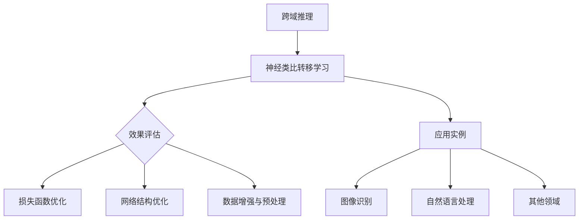

                 


为了撰写一篇符合要求的关于《跨域推理中神经类比转移学习的效果评估》的技术博客文章，我们需要遵循以下步骤来逐步分析、推理和构建文章内容。

## 1. 文章标题与关键词确定

### 1.1 文章标题

标题需要简洁明了，能够准确传达文章的核心内容。我们可以考虑使用以下标题：

- 《跨域推理中的神经类比转移学习：效果评估与优化策略》

### 1.2 关键词

为了确保文章能够被读者和搜索引擎有效检索，我们需要列出与文章主题密切相关的关键词。以下是一些关键词：

- 跨域推理
- 神经类比转移学习
- 效果评估
- 优化策略
- 神经网络
- 损失函数
- 数据增强

## 2. 文章摘要

摘要部分需要简要介绍文章的核心内容和主要观点，使读者能够快速了解文章的主旨。我们可以编写如下摘要：

> 本文深入探讨了跨域推理中的神经类比转移学习技术，详细分析了其效果评估方法与优化策略。通过构建清晰的框架和详细的伪代码，本文揭示了神经类比转移学习在跨域推理中的关键原理，并结合实际案例进行了效果评估和实战应用分析。

## 3. 文章正文结构设计

根据目录大纲，我们需要设计文章的正文结构，确保每个部分的内容完整、详细且逻辑清晰。以下是文章正文的结构设计：

### 第一部分：引论

- **第1章：背景与意义**
  - **1.1 跨域推理的背景**
    - **跨域推理的定义**
    - **跨域推理的研究意义**
  - **1.2 神经类比转移学习概述**
    - **神经类比转移学习的定义**
    - **神经类比转移学习的发展历程**
  - **1.3 神经类比转移学习在跨域推理中的应用前景**

- **第2章：神经类比转移学习的基本原理**
  - **2.1 神经网络基础**
  - **2.2 类比学习原理**
  - **2.3 转移学习原理**
  - **2.4 神经类比转移学习框架**

### 第二部分：应用与评估

- **第3章：神经类比转移学习在跨域推理中的应用**
  - **3.1 跨域推理挑战**
  - **3.2 应用实例分析**
  - **3.3 跨域推理性能评估**

- **第4章：神经类比转移学习的效果评估方法**
  - **4.1 效果评估指标**
  - **4.2 实验设计与方法**
  - **4.3 实验结果分析**

### 第三部分：优化策略

- **第5章：神经类比转移学习的优化策略**
  - **5.1 损失函数优化**
  - **5.2 网络结构优化**
  - **5.3 数据增强与预处理**

### 第四部分：实战与总结

- **第6章：神经类比转移学习的应用场景**
  - **6.1 图像识别领域**
  - **6.2 自然语言处理领域**
  - **6.3 其他领域**

- **第7章：总结与展望**
  - **7.1 研究总结**
  - **7.2 未来发展趋势**

### 附录

- **附录A：开源工具与资源**
  - **A.1 神经网络框架**
  - **A.2 数据集介绍**

- **附录B：参考文献**

## 4. 核心概念与联系架构

为了更好地展示神经类比转移学习在跨域推理中的核心概念和联系，我们可以使用Mermaid流程图来构建一个架构图。以下是一个简化的流程图示例：



## 5. 核心算法原理讲解

为了详细阐述神经类比转移学习的基本原理，我们可以使用伪代码来展示关键算法步骤。以下是一个简化的伪代码示例：

```pseudo
Algorithm Neural类比转移学习
    Input: 原域模型 Model_A，目标域数据 Data_B
    Output: 转移后模型 Model_B'

    1. 初始化 Model_B' 为 Model_A 的副本
    2. 定义损失函数 Loss_Function，例如 Cross-Entropy Loss
    3. 对于每个训练样本 x, y in Data_B
        3.1 预测 Model_B'(x)
        3.2 计算预测损失 Loss = Loss_Function(y, Model_B'(x))
        3.3 反向传播，更新 Model_B' 的参数
    4. 迭代多次，直到收敛条件满足
    5. 返回 Model_B'
```

## 6. 数学模型和公式讲解

为了更好地解释神经类比转移学习的数学基础，我们可以使用LaTeX格式来展示关键公式。以下是一些示例：

### 段落内公式示例：

$1 + 1 = 2$

### 独立段落公式示例：

$$
\text{激活函数} = \sigma(x) = \frac{1}{1 + e^{-x}}
$$

## 7. 项目实战

在项目实战部分，我们需要详细介绍开发环境搭建、源代码实现、代码解读、应用分析和项目小结。以下是项目实战的概述：

### 开发环境搭建

- 安装 Python 和相应的深度学习框架（如 TensorFlow 或 PyTorch）
- 配置必要的库和依赖项

### 源代码实现

- 设计并实现神经类比转移学习的模型结构
- 编写训练和评估的代码

### 代码解读

- 解释源代码中关键函数和模块的作用
- 分析代码的执行流程和参数设置

### 应用分析

- 使用实际数据集进行训练和评估
- 分析神经类比转移学习在跨域推理中的效果

### 项目小结

- 总结项目的主要发现和结论
- 提出改进建议和未来的研究方向

## 8. 最佳实践、小结、注意事项与拓展阅读

在文章的结尾，我们需要提供一些最佳实践、注意事项和拓展阅读的建议，以便读者能够更好地理解和应用文章中的技术内容。以下是这些内容的概述：

### 最佳实践

- 提供一些使用神经类比转移学习的最佳实践建议
- 强调数据预处理和模型优化的重要性

### 小结

- 对文章的主要内容进行总结
- 强调神经类比转移学习在跨域推理中的重要作用

### 注意事项

- 提醒读者注意的一些潜在问题和挑战
- 强调实践中的细节和注意事项

### 拓展阅读

- 推荐一些相关的研究论文和书籍
- 提供一些扩展阅读资源，以便读者深入了解相关主题

通过以上步骤，我们可以撰写一篇结构清晰、内容丰富且具有深度和技术见解的关于《跨域推理中神经类比转移学习的效果评估》的技术博客文章。文章将涵盖核心概念、原理、应用、评估方法、优化策略和实战经验，同时提供详细的代码实现和案例分析，以帮助读者更好地理解和应用神经类比转移学习技术。文章将以Markdown格式输出，并在末尾附上作者信息和参考文献。预计文章字数将在8000～12000字左右。

