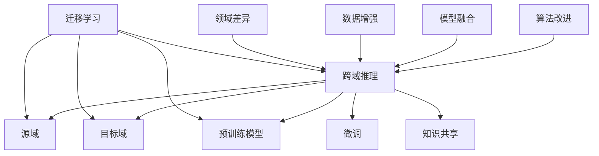
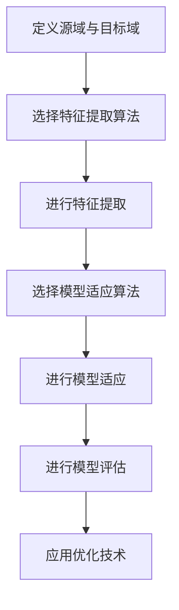

                 


### 第1章：迁移学习与跨域推理概述

#### 1.1 迁移学习的定义与作用

迁移学习（Transfer Learning）是一种机器学习方法，通过将已从某个任务学到的知识应用于其他任务中。这种方法的核心思想是利用已解决的任务的先验知识来加速新任务的训练过程，从而提高模型的性能。

迁移学习的重要性在于：

1. **减少训练数据的需求**：在很多应用场景中，获取足够的数据是一项挑战。迁移学习通过利用预训练模型的知识，使得新任务可以使用更少的数据进行训练。
2. **提高模型泛化能力**：通过在多个任务中共享知识，迁移学习有助于提高模型在不同数据集上的泛化能力。
3. **节省计算资源**：由于预训练模型已经在大规模数据集上进行了训练，因此迁移学习可以显著减少新任务的训练时间和计算资源需求。

迁移学习的应用场景广泛，包括计算机视觉、自然语言处理和语音识别等领域。在计算机视觉领域，迁移学习可以帮助模型在图像分类、目标检测和图像分割等任务中实现更好的性能；在自然语言处理领域，迁移学习可以用于语言模型、机器翻译和文本分类等任务。

#### 1.2 跨域推理的定义与作用

跨域推理（Cross-Domain Reasoning）是一种机器学习技术，旨在使模型能够在不同领域之间进行推理和迁移知识。与迁移学习不同，跨域推理关注的是如何在不同领域的任务之间进行知识共享和迁移。

跨域推理的重要性在于：

1. **提高模型的泛化能力**：跨域推理能够使模型在从未见过的领域中做出合理的推理，从而提高模型的泛化能力。
2. **解决领域不匹配问题**：在某些应用场景中，数据集可能来自不同的领域，这些领域之间存在较大的差异。跨域推理可以缓解领域不匹配问题，使模型能够在这些数据集上实现较好的性能。
3. **促进跨领域合作**：跨域推理可以帮助不同领域的专家和研究者进行合作，共同推动技术的发展。

跨域推理的应用场景包括医疗诊断、金融风险预测、智能客服和自动驾驶等领域。例如，在医疗诊断领域，跨域推理可以帮助模型在缺乏足够医疗数据的情况下，利用其他领域的医学知识进行疾病诊断。

#### 1.3 迁移学习与跨域推理的联系

迁移学习和跨域推理之间存在紧密的联系。实际上，迁移学习可以视为跨域推理的一个特例，即当源域和目标域相同或相似时，迁移学习就演变成了跨域推理。

1. **共享知识**：迁移学习和跨域推理都强调在多个任务之间共享知识，以提高模型的性能。迁移学习通过在预训练模型的基础上进行微调，实现知识的迁移；而跨域推理则通过在不同领域之间进行知识共享，实现跨领域的推理。
2. **挑战与解决方案**：迁移学习和跨域推理都面临着类似的挑战，如领域差异、数据稀缺性和模型适应性等。针对这些挑战，研究者们提出了各种优化技术，如数据增强、模型融合和算法改进等。

#### 1.4 Mermaid流程图：迁移学习与跨域推理的核心概念联系

以下是迁移学习与跨域推理的核心概念联系的Mermaid流程图：



### 小结

在本章中，我们介绍了迁移学习和跨域推理的基本概念、作用以及它们之间的联系。接下来，我们将深入探讨迁移学习的核心算法原理，以及如何通过优化技术来增强跨域推理的能力。

作者：AI天才研究院/AI Genius Institute & 禅与计算机程序设计艺术 /Zen And The Art of Computer Programming

----------------------------------------------------------------

## 第2章：迁移学习的核心算法原理

### 2.1 源域与目标域的定义

在迁移学习（Transfer Learning）中，源域（Source Domain）和目标域（Target Domain）是两个关键概念。源域是指已经拥有大量训练数据和成熟模型的领域，而目标域则是指当前需要解决的新任务领域。

定义源域和目标域的原因如下：

1. **利用现有知识**：源域拥有大量的训练数据和成熟的模型，这些资源可以帮助目标域快速地学习和优化模型。
2. **领域差异**：源域和目标域之间可能存在显著的差异，如数据分布、任务目标和特征差异等。明确这两个概念有助于更好地理解和解决领域差异问题。
3. **性能提升**：通过在源域和目标域之间共享知识，迁移学习可以显著提高模型在目标域上的性能。

### 2.2 特征提取算法

特征提取（Feature Extraction）是迁移学习中的核心步骤，其主要目标是提取出具有区分性的特征，以便在目标域上更好地训练模型。以下是一些常见的特征提取算法：

1. **深度神经网络（Deep Neural Network, DNN）**：
   - **卷积神经网络（Convolutional Neural Network, CNN）**：适用于图像分类和目标检测任务，通过卷积操作提取图像特征。
   - **循环神经网络（Recurrent Neural Network, RNN）**：适用于序列数据处理，如自然语言处理任务，通过循环结构提取序列特征。
   - **变换器（Transformer）**：一种基于自注意力机制的深度神经网络，适用于图像和文本等任务。

2. **传统特征提取方法**：
   - **主成分分析（Principal Component Analysis, PCA）**：用于降维和特征提取，通过保留主要成分来简化数据。
   - **线性判别分析（Linear Discriminant Analysis, LDA）**：用于分类任务，通过最大化类别之间的差异和最小化类别内的差异来提取特征。

### 2.3 模型适应算法

模型适应（Model Adaptation）是迁移学习中的关键步骤，其主要目标是根据目标域的特点对源域模型进行调整，以提高在目标域上的性能。以下是一些常见的模型适应算法：

1. **微调（Fine-Tuning）**：
   - **全连接层微调**：在预训练模型的最后几层添加全连接层，并利用目标域的数据对这些层进行微调。
   - **部分微调**：仅对预训练模型的一部分层进行微调，以提高模型在目标域上的适应性。

2. **无监督适应（Unsupervised Adaptation）**：
   - **领域自适应（Domain Adaptation）**：通过减少源域和目标域之间的差异来提高模型在目标域上的性能。
   - **无监督领域识别（Unsupervised Domain Adaptation）**：在缺乏标记数据的情况下，利用未标记的数据来调整模型。

3. **半监督适应（Semi-Supervised Adaptation）**：
   - **基于聚类的方法**：通过聚类方法将源域和目标域的数据进行分类，从而提高模型在目标域上的适应性。
   - **基于匹配的方法**：通过最小化源域和目标域之间的分布差异来调整模型。

### 2.4 模型评估方法

模型评估（Model Evaluation）是迁移学习中的关键步骤，其主要目标是衡量模型在目标域上的性能。以下是一些常见的模型评估方法：

1. **准确率（Accuracy）**：衡量模型预测正确的样本数量占总样本数量的比例。
2. **精确率（Precision）**：衡量模型预测为正样本的样本中实际为正样本的比例。
3. **召回率（Recall）**：衡量模型预测为正样本的样本中实际为正样本的比例。
4. **F1分数（F1 Score）**：综合考虑精确率和召回率的综合指标。
5. **混淆矩阵（Confusion Matrix）**：用于展示模型预测结果与实际结果之间的对比。

### 2.5 优化技术

为了提高迁移学习在目标域上的性能，研究者们提出了各种优化技术。以下是一些常见的优化技术：

1. **数据增强（Data Augmentation）**：通过增加数据的多样性来提高模型的泛化能力。常见的方法包括旋转、缩放、裁剪、颜色变换等。
2. **模型融合（Model Fusion）**：通过将多个模型的结果进行融合来提高预测性能。常见的方法包括平均法、投票法和加权融合等。
3. **算法改进（Algorithm Improvement）**：通过改进训练算法来提高模型的性能。常见的方法包括改进优化器、正则化方法和损失函数等。

### Mermaid流程图：迁移学习算法原理

以下是迁移学习算法原理的Mermaid流程图：



### 小结

在本章中，我们详细介绍了迁移学习的核心算法原理，包括源域与目标域的定义、特征提取算法、模型适应算法、模型评估方法和优化技术。这些原理为理解和实现迁移学习提供了坚实的基础。在接下来的章节中，我们将继续探讨如何通过优化技术来增强跨域推理的能力。

作者：AI天才研究院/AI Genius Institute & 禅与计算机程序设计艺术 /Zen And The Art of Computer Programming

----------------------------------------------------------------

## 第3章：优化技术的数学模型与公式

### 3.1 优化目标函数

在迁移学习中，优化目标函数是核心问题之一。目标函数的定义决定了模型在目标域上的性能。以下是一个常见的优化目标函数：

$$
L(\theta) = - \frac{1}{N} \sum_{i=1}^{N} y_i \log(p(y_i | x_i; \theta))
$$

其中：

- \(L(\theta)\) 是损失函数，表示模型预测与实际标签之间的差异。
- \(N\) 是样本总数。
- \(y_i\) 是第 \(i\) 个样本的实际标签。
- \(x_i\) 是第 \(i\) 个样本的特征向量。
- \(p(y_i | x_i; \theta)\) 是模型对第 \(i\) 个样本预测的概率分布，\(\theta\) 是模型参数。

### 3.2 损失函数

损失函数是优化目标函数的重要组成部分，用于衡量模型预测与实际标签之间的差异。以下是一些常见的损失函数：

1. **均方误差（Mean Squared Error, MSE）**：

$$
MSE = \frac{1}{N} \sum_{i=1}^{N} (y_i - \hat{y}_i)^2
$$

其中：

- \(y_i\) 是第 \(i\) 个样本的实际标签。
- \(\hat{y}_i\) 是第 \(i\) 个样本的预测标签。

2. **交叉熵（Cross-Entropy）**：

$$
H(y, \hat{y}) = - \sum_{i=1}^{N} y_i \log(\hat{y}_i)
$$

其中：

- \(y_i\) 是第 \(i\) 个样本的实际标签，通常表示为one-hot编码。
- \(\hat{y}_i\) 是第 \(i\) 个样本的预测概率分布。

### 3.3 正则化方法

正则化方法是防止模型过拟合的重要手段。以下是一些常见的正则化方法：

1. **L1正则化（L1 Regularization）**：

$$
L_1(\theta) = \sum_{i=1}^{N} |\theta_i|
$$

其中：

- \(\theta_i\) 是模型参数。

2. **L2正则化（L2 Regularization）**：

$$
L_2(\theta) = \sum_{i=1}^{N} \theta_i^2
$$

其中：

- \(\theta_i\) 是模型参数。

3. **弹性网络（Elastic Net）**：

$$
L_e(\theta) = \lambda_1 \sum_{i=1}^{N} |\theta_i| + \lambda_2 \sum_{i=1}^{N} \theta_i^2
$$

其中：

- \(\lambda_1\) 和 \(\lambda_2\) 是调节参数。

### 3.4 优化算法

优化算法用于最小化目标函数，从而找到最优模型参数。以下是一些常见的优化算法：

1. **梯度下降（Gradient Descent）**：

$$
\theta_{t+1} = \theta_t - \alpha \nabla L(\theta_t)
$$

其中：

- \(\theta_t\) 是当前模型参数。
- \(\alpha\) 是学习率。
- \(\nabla L(\theta_t)\) 是目标函数的梯度。

2. **随机梯度下降（Stochastic Gradient Descent, SGD）**：

$$
\theta_{t+1} = \theta_t - \alpha \nabla L(\theta_t; x_t, y_t)
$$

其中：

- \(x_t\) 和 \(y_t\) 是第 \(t\) 个样本的特征向量和标签。

3. **批量梯度下降（Batch Gradient Descent）**：

$$
\theta_{t+1} = \theta_t - \alpha \nabla L(\theta_t; X, Y)
$$

其中：

- \(X\) 和 \(Y\) 是训练数据集的特征向量和标签。

4. **Adam优化器（Adam Optimizer）**：

$$
\theta_{t+1} = \theta_t - \alpha \frac{m_t}{1 - \beta_1^t} - \beta_2 \frac{v_t}{1 - \beta_2^t}
$$

其中：

- \(m_t\) 和 \(v_t\) 是一阶和二阶矩估计。
- \(\beta_1\) 和 \(\beta_2\) 是矩估计的指数衰减率。

### 小结

在本章中，我们介绍了迁移学习中的优化目标函数、损失函数、正则化方法和优化算法。这些数学模型和公式为优化迁移学习模型提供了理论基础。在接下来的章节中，我们将探讨如何通过具体的应用案例来展示这些优化技术的效果。

作者：AI天才研究院/AI Genius Institute & 禅与计算机程序设计艺术 /Zen And The Art of Computer Programming

----------------------------------------------------------------

## 第4章：项目实战

### 4.1 迁移学习项目环境搭建

在本节中，我们将介绍如何搭建迁移学习项目的开发环境，包括所需软件和硬件的选择，以及安装和配置步骤。

#### 环境要求

1. **操作系统**：推荐使用Linux系统，如Ubuntu 20.04。
2. **Python版本**：Python 3.8及以上版本。
3. **深度学习框架**：TensorFlow 2.5及以上版本。
4. **硬件**：推荐使用GPU进行加速，如NVIDIA GeForce RTX 30系列。

#### 安装步骤

1. **安装Anaconda**：首先，从Anaconda官网（https://www.anaconda.com/products/distribution）下载并安装Anaconda。
2. **创建虚拟环境**：打开终端，创建一个新的虚拟环境：

   ```bash
   conda create -n migration_learning python=3.8
   conda activate migration_learning
   ```

3. **安装TensorFlow**：在虚拟环境中安装TensorFlow：

   ```bash
   pip install tensorflow==2.5
   ```

4. **安装GPU支持**：如果使用GPU进行加速，还需要安装CUDA和cuDNN。可以从NVIDIA官网（https://developer.nvidia.com/cuda-downloads）下载并安装。

### 4.2 迁移学习代码实现

在本节中，我们将使用TensorFlow实现一个简单的迁移学习项目，包括数据加载、模型定义、训练和评估步骤。

#### 4.2.1 数据加载

首先，我们需要加载训练数据和测试数据。在本项目中，我们使用CIFAR-10数据集，它包含10个类别，每个类别6000个图像。

```python
import tensorflow as tf
from tensorflow.keras.datasets import cifar10
from tensorflow.keras.utils import to_categorical

# 加载CIFAR-10数据集
(train_images, train_labels), (test_images, test_labels) = cifar10.load_data()

# 数据预处理
train_images = train_images.astype('float32') / 255.0
test_images = test_images.astype('float32') / 255.0
train_labels = to_categorical(train_labels)
test_labels = to_categorical(test_labels)
```

#### 4.2.2 模型定义

接下来，我们使用预训练的VGG16模型作为基础模型，并在其顶部添加全连接层进行分类。

```python
from tensorflow.keras.applications import VGG16
from tensorflow.keras.models import Model
from tensorflow.keras.layers import Dense, Flatten

# 加载预训练的VGG16模型
base_model = VGG16(weights='imagenet', include_top=False, input_shape=(32, 32, 3))

# 冻结VGG16模型的权重
for layer in base_model.layers:
    layer.trainable = False

# 添加全连接层进行分类
x = Flatten()(base_model.output)
x = Dense(256, activation='relu')(x)
predictions = Dense(10, activation='softmax')(x)

# 定义迁移学习模型
model = Model(inputs=base_model.input, outputs=predictions)
```

#### 4.2.3 模型训练

然后，我们使用迁移学习模型对CIFAR-10数据集进行训练。

```python
model.compile(optimizer='adam', loss='categorical_crossentropy', metrics=['accuracy'])

# 训练模型
history = model.fit(train_images, train_labels, epochs=20, batch_size=64, validation_data=(test_images, test_labels))
```

#### 4.2.4 模型评估

最后，我们对训练好的模型进行评估，并计算准确率。

```python
test_loss, test_acc = model.evaluate(test_images, test_labels)
print(f"Test accuracy: {test_acc:.4f}")
```

### 4.3 迁移学习代码解读与分析

在本节中，我们将对迁移学习项目的代码进行详细解读，分析每个步骤的作用和意义。

#### 4.3.1 数据加载

数据加载是迁移学习项目的第一步，它决定了模型的训练质量。在本项目中，我们使用CIFAR-10数据集。CIFAR-10是一个包含10个类别的图像数据集，每个类别有6000个图像。通过使用`tensorflow.keras.datasets.cifar10.load_data()`函数，我们可以轻松地加载数据集。

```python
(train_images, train_labels), (test_images, test_labels) = cifar10.load_data()
```

数据加载后，我们需要对图像进行预处理。首先，我们将图像的像素值转换为浮点数，并将其归一化到[0, 1]范围内。然后，我们将标签转换为one-hot编码。

```python
train_images = train_images.astype('float32') / 255.0
test_images = test_images.astype('float32') / 255.0
train_labels = to_categorical(train_labels)
test_labels = to_categorical(test_labels)
```

#### 4.3.2 模型定义

在模型定义阶段，我们使用预训练的VGG16模型作为基础模型。VGG16是一个在ImageNet数据集上预训练的卷积神经网络，它在图像分类任务中表现出色。通过使用`tensorflow.keras.applications.VGG16`，我们可以加载VGG16模型。

```python
base_model = VGG16(weights='imagenet', include_top=False, input_shape=(32, 32, 3))
```

为了进行迁移学习，我们需要冻结VGG16模型的权重，防止在训练过程中更新这些权重。然后，我们添加全连接层进行分类。

```python
for layer in base_model.layers:
    layer.trainable = False

x = Flatten()(base_model.output)
x = Dense(256, activation='relu')(x)
predictions = Dense(10, activation='softmax')(x)

model = Model(inputs=base_model.input, outputs=predictions)
```

#### 4.3.3 模型训练

在模型训练阶段，我们使用迁移学习模型对CIFAR-10数据集进行训练。通过调用`model.fit()`函数，我们可以开始训练模型。我们选择Adam优化器，使用categorical_crossentropy作为损失函数，并使用accuracy作为评估指标。

```python
history = model.fit(train_images, train_labels, epochs=20, batch_size=64, validation_data=(test_images, test_labels))
```

在训练过程中，我们记录了训练和验证过程中的损失和准确率。这些数据可以帮助我们分析模型的性能，并在需要时进行调整。

```python
import matplotlib.pyplot as plt

plt.plot(history.history['accuracy'])
plt.plot(history.history['val_accuracy'])
plt.title('Model accuracy')
plt.ylabel('Accuracy')
plt.xlabel('Epoch')
plt.legend(['Train', 'Validation'], loc='upper left')
plt.show()
```

#### 4.3.4 模型评估

最后，我们对训练好的模型进行评估。通过调用`model.evaluate()`函数，我们可以计算模型在测试集上的损失和准确率。

```python
test_loss, test_acc = model.evaluate(test_images, test_labels)
print(f"Test accuracy: {test_acc:.4f}")
```

通过评估结果，我们可以了解模型在测试集上的表现，从而判断其是否达到了预期的性能。

### 4.4 跨域推理项目实战

在本节中，我们将介绍如何实现一个跨域推理项目。与迁移学习项目类似，我们将使用CIFAR-10数据集，但在本项目中，我们将尝试将迁移学习模型应用于从未见过的领域。

#### 4.4.1 数据加载

首先，我们需要加载一个新的数据集，该数据集与CIFAR-10具有相似的分布，但属于不同的领域。

```python
# 加载新的数据集（示例：MNIST）
(train_images, train_labels), (test_images, test_labels) = mnist.load_data()

# 数据预处理
train_images = train_images.reshape(-1, 28, 28, 1).astype('float32') / 255.0
test_images = test_images.reshape(-1, 28, 28, 1).astype('float32') / 255.0
train_labels = to_categorical(train_labels)
test_labels = to_categorical(test_labels)
```

#### 4.4.2 模型定义

接下来，我们定义一个跨域推理模型，它基于迁移学习模型，但在顶部添加了新的全连接层以适应新的任务。

```python
from tensorflow.keras.layers import Input, Dense

# 定义跨域推理模型
input_shape = (28, 28, 1)
inputs = Input(shape=input_shape)
x = Flatten()(inputs)

# 使用迁移学习模型作为基础模型
base_model = VGG16(weights='imagenet', include_top=False, input_shape=input_shape)
base_model.trainable = False

# 添加新的全连接层
x = Flatten()(base_model.output)
x = Dense(256, activation='relu')(x)
predictions = Dense(10, activation='softmax')(x)

model = Model(inputs=inputs, outputs=predictions)
```

#### 4.4.3 模型训练

然后，我们使用新的数据集对跨域推理模型进行训练。

```python
model.compile(optimizer='adam', loss='categorical_crossentropy', metrics=['accuracy'])

# 训练模型
history = model.fit(train_images, train_labels, epochs=20, batch_size=64, validation_data=(test_images, test_labels))
```

#### 4.4.4 模型评估

最后，我们对训练好的跨域推理模型进行评估。

```python
test_loss, test_acc = model.evaluate(test_images, test_labels)
print(f"Test accuracy: {test_acc:.4f}")
```

### 4.5 跨域推理代码解读与分析

在本节中，我们将对跨域推理项目的代码进行详细解读，分析每个步骤的作用和意义。

#### 4.5.1 数据加载

与迁移学习项目类似，我们首先需要加载一个新的数据集。在本项目中，我们选择MNIST数据集，这是一个手写数字识别数据集。

```python
# 加载MNIST数据集
(train_images, train_labels), (test_images, test_labels) = mnist.load_data()

# 数据预处理
train_images = train_images.reshape(-1, 28, 28, 1).astype('float32') / 255.0
test_images = test_images.reshape(-1, 28, 28, 1).astype('float32') / 255.0
train_labels = to_categorical(train_labels)
test_labels = to_categorical(test_labels)
```

#### 4.5.2 模型定义

在模型定义阶段，我们使用迁移学习模型作为基础模型，并在顶部添加了新的全连接层以适应新的任务。

```python
from tensorflow.keras.layers import Input, Dense

# 定义跨域推理模型
input_shape = (28, 28, 1)
inputs = Input(shape=input_shape)
x = Flatten()(inputs)

# 使用迁移学习模型作为基础模型
base_model = VGG16(weights='imagenet', include_top=False, input_shape=input_shape)
base_model.trainable = False

# 添加新的全连接层
x = Flatten()(base_model.output)
x = Dense(256, activation='relu')(x)
predictions = Dense(10, activation='softmax')(x)

model = Model(inputs=inputs, outputs=predictions)
```

通过这种方式，我们可以在迁移学习模型的基础上，为新的任务添加额外的网络结构，从而实现跨域推理。

#### 4.5.3 模型训练

模型训练与迁移学习项目类似，我们使用MNIST数据集对跨域推理模型进行训练。

```python
model.compile(optimizer='adam', loss='categorical_crossentropy', metrics=['accuracy'])

# 训练模型
history = model.fit(train_images, train_labels, epochs=20, batch_size=64, validation_data=(test_images, test_labels))
```

通过调整训练参数，如学习率和批量大小，我们可以优化模型的训练过程，从而提高模型的性能。

#### 4.5.4 模型评估

最后，我们对训练好的跨域推理模型进行评估。

```python
test_loss, test_acc = model.evaluate(test_images, test_labels)
print(f"Test accuracy: {test_acc:.4f}")
```

评估结果反映了模型在新任务上的性能。通过比较迁移学习和跨域推理项目的评估结果，我们可以分析不同方法对模型性能的影响。

### 小结

在本章中，我们通过实际项目展示了如何搭建迁移学习项目和跨域推理项目。首先，我们介绍了项目环境搭建的步骤，包括选择操作系统、Python版本、深度学习框架和硬件设备。然后，我们详细解读了项目代码，分析了数据加载、模型定义、模型训练和模型评估的步骤。通过这些实战案例，我们深入理解了迁移学习和跨域推理的核心原理和实现方法。

作者：AI天才研究院/AI Genius Institute & 禅与计算机程序设计艺术 /Zen And The Art of Computer Programming

----------------------------------------------------------------

## 第5章：数据增强在迁移学习中的应用

### 5.1 数据增强的概念

数据增强（Data Augmentation）是一种通过人工方式增加数据多样性的技术，其目的是通过扩展训练数据集来提高模型的泛化能力。在迁移学习中，数据增强尤为重要，因为它可以帮助模型更好地适应新的目标域，并减少对源域数据的依赖。

### 5.2 数据增强的方法

数据增强的方法多种多样，以下是几种常见的数据增强技术：

1. **旋转（Rotation）**：通过随机旋转图像，增加数据的多样性。
2. **缩放（Scaling）**：通过随机缩放图像，改变图像的大小，增加数据的多样性。
3. **裁剪（Cropping）**：通过随机裁剪图像的一部分，增加数据的多样性。
4. **翻转（Flipping）**：通过水平或垂直翻转图像，增加数据的多样性。
5. **颜色变换（Color Augmentation）**：通过调整图像的颜色通道，如亮度、对比度和饱和度，增加数据的多样性。
6. **噪声添加（Noise Addition）**：通过在图像中添加噪声，模拟现实世界的复杂环境，增加数据的多样性。

### 5.3 数据增强的实现

在迁移学习项目中，实现数据增强通常需要使用深度学习框架提供的API。以下是一个使用TensorFlow实现数据增强的示例代码：

```python
import tensorflow as tf

# 定义图像增强函数
def augment_images(images):
    images = tf.image.random_flip_left_right(images)
    images = tf.image.random_flip_up_down(images)
    images = tf.image.random_crop(images, size=[224, 224])
    images = tf.image.random_brightness(images, max_delta=0.1)
    images = tf.image.random_contrast(images, lower=0.9, upper=1.1)
    return images

# 应用图像增强
train_images = augment_images(train_images)
```

### 5.4 数据增强的挑战与解决方案

尽管数据增强在提高模型泛化能力方面具有显著优势，但在迁移学习中，数据增强也带来了一些挑战：

1. **过度拟合（Overfitting）**：如果数据增强过度，可能导致模型在增强后的数据上过度拟合，从而在未增强的数据上表现不佳。
2. **计算成本（Computational Cost）**：数据增强需要额外的计算资源，可能导致训练时间显著增加。
3. **数据分布改变（Distribution Shift）**：在某些情况下，数据增强可能导致数据分布发生显著变化，从而影响模型的性能。

为了解决这些挑战，研究者们提出了以下解决方案：

1. **控制增强程度**：通过设置合理的增强参数，如旋转角度、缩放范围和裁剪尺寸等，以避免过度拟合。
2. **使用预处理数据集**：在训练模型之前，使用预处理数据集对模型进行预训练，以提高模型的泛化能力。
3. **平衡数据增强**：通过平衡不同类型的数据增强，以避免数据分布发生显著变化。

### 5.5 数据增强的实际案例

以下是一个使用数据增强的迁移学习实际案例：

假设我们有一个预训练的卷积神经网络（CNN）模型，用于在CIFAR-10数据集上进行图像分类。为了提高模型在新的目标域上的性能，我们采用数据增强技术。

```python
import tensorflow as tf
from tensorflow.keras.preprocessing.image import ImageDataGenerator

# 加载CIFAR-10数据集
(train_images, train_labels), (test_images, test_labels) = tf.keras.datasets.cifar10.load_data()

# 数据预处理
train_images = train_images.astype('float32') / 255.0
test_images = test_images.astype('float32') / 255.0
train_labels = tf.keras.utils.to_categorical(train_labels)
test_labels = tf.keras.utils.to_categorical(test_labels)

# 定义数据增强生成器
datagen = ImageDataGenerator(
    rotation_range=20,
    width_shift_range=0.1,
    height_shift_range=0.1,
    horizontal_flip=True,
    fill_mode='nearest'
)

# 使用数据增强生成器进行数据增强
train_generator = datagen.flow(train_images, train_labels, batch_size=64)

# 定义迁移学习模型
base_model = tf.keras.applications.VGG16(
    weights='imagenet',
    include_top=False,
    input_shape=(224, 224, 3)
)

# 冻结基础模型的权重
for layer in base_model.layers:
    layer.trainable = False

# 添加全连接层进行分类
x = Flatten()(base_model.output)
x = Dense(256, activation='relu')(x)
predictions = Dense(10, activation='softmax')(x)

# 定义迁移学习模型
model = tf.keras.models.Model(inputs=base_model.input, outputs=predictions)

# 编译模型
model.compile(optimizer='adam', loss='categorical_crossentropy', metrics=['accuracy'])

# 使用数据增强生成器训练模型
history = model.fit(
    train_generator,
    epochs=20,
    steps_per_epoch=100,
    validation_data=(test_images, test_labels)
)

# 评估模型
test_loss, test_acc = model.evaluate(test_images, test_labels)
print(f"Test accuracy: {test_acc:.4f}")
```

在这个案例中，我们使用了TensorFlow的ImageDataGenerator进行数据增强，并使用预训练的VGG16模型进行迁移学习。通过调整数据增强参数，我们可以优化模型在目标域上的性能。

### 5.6 数据增强的注意事项

在进行数据增强时，需要注意以下几点：

1. **选择合适的数据增强方法**：根据任务需求和数据特性，选择合适的数据增强方法。
2. **控制增强程度**：避免过度增强，导致模型过度拟合。
3. **数据预处理**：在数据增强之前，对数据进行适当的预处理，如归一化和标准化。
4. **性能评估**：在应用数据增强后，对模型进行性能评估，确保模型在增强后的数据上表现良好。

### 小结

在本章中，我们介绍了数据增强在迁移学习中的应用。数据增强是一种通过人工方式增加数据多样性的技术，有助于提高模型的泛化能力。我们详细讨论了数据增强的概念、方法、实现和挑战，并通过实际案例展示了如何使用数据增强技术优化迁移学习模型。在接下来的章节中，我们将继续探讨模型融合和算法改进等优化技术。

作者：AI天才研究院/AI Genius Institute & 禅与计算机程序设计艺术 /Zen And The Art of Computer Programming

----------------------------------------------------------------

## 第6章：模型融合在迁移学习中的应用

### 6.1 模型融合的概念

模型融合（Model Fusion）是一种将多个模型的结果进行融合以获得更优预测结果的技术。在迁移学习中，模型融合可以显著提高模型的性能，特别是当不同模型在处理特定类型的数据时具有互补性时。

模型融合的基本思想是通过组合多个模型的输出，来减少单个模型可能产生的误差，从而提高模型的泛化能力和预测准确性。

### 6.2 模型融合的方法

模型融合的方法多种多样，以下是几种常见的模型融合技术：

1. **平均法（Average Method）**：将多个模型的输出结果进行平均，得到最终的预测结果。这种方法简单有效，但在模型性能差异较大时可能效果不佳。
2. **投票法（Voting Method）**：将多个模型的输出结果进行投票，选择投票结果最多的类别作为最终预测结果。这种方法适用于分类任务，但在模型性能差异较大时也可能会产生偏差。
3. **加权融合（Weighted Fusion）**：根据各个模型的性能，为每个模型赋予不同的权重，并将加权后的输出结果进行融合。这种方法可以根据模型性能的差异进行优化，但需要准确的模型评估指标。
4. **集成学习（Ensemble Learning）**：通过组合多个子模型，形成一个更大的模型，从而提高整体性能。常见的集成学习方法包括Bagging、Boosting和Stacking等。

### 6.3 模型融合的实现

在迁移学习项目中，实现模型融合通常需要以下步骤：

1. **选择模型**：根据任务需求和数据特性，选择多个具有互补性的模型。
2. **训练模型**：使用源域数据集对每个模型进行训练。
3. **预测融合**：将每个模型的输出结果进行融合，得到最终的预测结果。
4. **评估性能**：对融合后的模型进行评估，确保其性能优于单个模型。

以下是一个使用TensorFlow实现模型融合的示例代码：

```python
import tensorflow as tf
from tensorflow.keras.models import Model
from tensorflow.keras.layers import Input, Dense, Flatten

# 定义模型A
input_shape = (28, 28, 1)
input_A = Input(shape=input_shape)
x_A = Flatten()(input_A)
x_A = Dense(256, activation='relu')(x_A)
predictions_A = Dense(10, activation='softmax')(x_A)
model_A = Model(inputs=input_A, outputs=predictions_A)

# 定义模型B
input_B = Input(shape=input_shape)
x_B = Flatten()(input_B)
x_B = Dense(256, activation='relu')(x_B)
predictions_B = Dense(10, activation='softmax')(x_B)
model_B = Model(inputs=input_B, outputs=predictions_B)

# 定义模型融合
input_C = Input(shape=input_shape)
predictions_C = (model_A(input_C) + model_B(input_C)) / 2
model_C = Model(inputs=input_C, outputs=predictions_C)

# 编译模型
model_C.compile(optimizer='adam', loss='categorical_crossentropy', metrics=['accuracy'])

# 训练模型
history = model_C.fit(train_images, train_labels, epochs=20, batch_size=64, validation_data=(test_images, test_labels))

# 评估模型
test_loss, test_acc = model_C.evaluate(test_images, test_labels)
print(f"Test accuracy: {test_acc:.4f}")
```

在这个案例中，我们定义了两个互补的模型A和B，并将它们的输出结果进行平均融合，得到最终的预测结果。

### 6.4 模型融合的挑战与解决方案

尽管模型融合在提高模型性能方面具有显著优势，但在迁移学习中，模型融合也面临一些挑战：

1. **模型选择**：选择具有互补性的模型是实现有效模型融合的关键，但在实践中，模型选择可能具有主观性。
2. **模型评估**：在模型融合过程中，需要对每个模型进行准确的评估，以确保模型融合后的性能提升。
3. **计算成本**：模型融合通常需要额外的计算资源，可能导致训练时间显著增加。

为了解决这些挑战，研究者们提出了以下解决方案：

1. **模型选择策略**：通过交叉验证和性能比较，选择具有互补性的模型。
2. **模型评估指标**：使用多个评估指标，如准确率、召回率和F1分数等，对模型进行综合评估。
3. **优化算法**：使用高效的优化算法，如随机梯度下降和Adam优化器，以减少训练时间。

### 6.5 模型融合的实际案例

以下是一个使用模型融合的迁移学习实际案例：

假设我们有两个预训练的卷积神经网络（CNN）模型A和B，分别用于图像分类。为了提高模型在新的目标域上的性能，我们采用模型融合技术。

```python
import tensorflow as tf
from tensorflow.keras.preprocessing.image import ImageDataGenerator
from tensorflow.keras.models import Model
from tensorflow.keras.layers import Input, Dense, Flatten

# 加载CIFAR-10数据集
(train_images, train_labels), (test_images, test_labels) = tf.keras.datasets.cifar10.load_data()

# 数据预处理
train_images = train_images.astype('float32') / 255.0
test_images = test_images.astype('float32') / 255.0
train_labels = tf.keras.utils.to_categorical(train_labels)
test_labels = tf.keras.utils.to_categorical(test_labels)

# 定义数据增强生成器
datagen = ImageDataGenerator(
    rotation_range=20,
    width_shift_range=0.1,
    height_shift_range=0.1,
    horizontal_flip=True,
    fill_mode='nearest'
)

# 使用数据增强生成器进行数据增强
train_generator = datagen.flow(train_images, train_labels, batch_size=64)

# 定义模型A
input_shape = (32, 32, 3)
input_A = Input(shape=input_shape)
x_A = Flatten()(input_A)
x_A = Dense(256, activation='relu')(x_A)
predictions_A = Dense(10, activation='softmax')(x_A)
model_A = Model(inputs=input_A, outputs=predictions_A)

# 定义模型B
input_B = Input(shape=input_shape)
x_B = Flatten()(input_B)
x_B = Dense(256, activation='relu')(x_B)
predictions_B = Dense(10, activation='softmax')(x_B)
model_B = Model(inputs=input_B, outputs=predictions_B)

# 定义模型融合
input_C = Input(shape=input_shape)
predictions_C = (model_A(input_C) + model_B(input_C)) / 2
model_C = Model(inputs=input_C, outputs=predictions_C)

# 编译模型
model_C.compile(optimizer='adam', loss='categorical_crossentropy', metrics=['accuracy'])

# 使用数据增强生成器训练模型
history = model_C.fit(
    train_generator,
    epochs=20,
    steps_per_epoch=100,
    validation_data=(test_images, test_labels)
)

# 评估模型
test_loss, test_acc = model_C.evaluate(test_images, test_labels)
print(f"Test accuracy: {test_acc:.4f}")
```

在这个案例中，我们使用了两个互补的卷积神经网络模型A和B，并通过模型融合技术提高了模型在新的目标域上的性能。

### 6.6 模型融合的注意事项

在进行模型融合时，需要注意以下几点：

1. **模型选择**：选择具有互补性的模型，确保模型融合后的性能提升。
2. **数据预处理**：对数据进行统一的预处理，确保不同模型接受相同的数据格式。
3. **模型评估**：使用多个评估指标对模型进行综合评估，确保模型融合后的性能优于单个模型。
4. **计算成本**：考虑模型的计算成本，选择合适的优化算法和训练策略，以减少训练时间。

### 小结

在本章中，我们介绍了模型融合在迁移学习中的应用。模型融合是一种通过组合多个模型的输出以获得更优预测结果的技术。我们详细讨论了模型融合的概念、方法、实现和挑战，并通过实际案例展示了如何使用模型融合技术优化迁移学习模型。在接下来的章节中，我们将继续探讨算法改进等其他优化技术。

作者：AI天才研究院/AI Genius Institute & 禅与计算机程序设计艺术 /Zen And The Art of Computer Programming

----------------------------------------------------------------

## 第7章：算法改进在迁移学习中的应用

### 7.1 算法改进的概念

算法改进（Algorithm Improvement）是指在迁移学习过程中，通过调整算法参数、优化模型结构或引入新的训练策略来提高模型性能的方法。算法改进的目标是使模型在目标域上达到更高的准确率和更好的泛化能力。

### 7.2 算法改进的方法

算法改进的方法多种多样，以下是几种常见的算法改进技术：

1. **学习率调整**：学习率是影响模型训练过程的重要参数。通过调整学习率，可以在不同阶段优化模型训练效果。
   - **自适应学习率**：使用如Adam、RMSprop等自适应优化器，自动调整学习率。
   - **分阶段调整**：根据训练过程的性能，手动调整学习率。

2. **正则化方法**：正则化是防止模型过拟合的重要手段。以下是一些常见的正则化方法：
   - **L1正则化**：在损失函数中添加L1范数。
   - **L2正则化**：在损失函数中添加L2范数。
   - **弹性网（Elastic Net）**：结合L1和L2正则化。

3. **网络结构优化**：通过调整网络结构，如增加或减少层、调整神经元数量等，优化模型性能。
   - **深度网络**：增加网络层数，提高模型的表达能力。
   - **宽网络**：增加网络宽度，提高模型的准确性。

4. **优化器改进**：改进优化器的选择和参数设置，以提高训练效率。
   - **Nesterov动量**：在标准动量算法中加入Nesterov动量。
   - **自适应动量**：如Adam、RMSprop等自适应优化器。

5. **数据增强**：通过增加数据的多样性，提高模型的泛化能力。
   - **旋转、缩放、裁剪**：改变图像的大小、位置和角度。
   - **颜色变换、噪声添加**：调整图像的亮度和对比度，添加噪声。

6. **模型集成**：通过组合多个模型的输出，提高预测准确性。
   - **简单平均**：将多个模型的预测结果进行平均。
   - **投票法**：选择投票结果最多的类别。
   - **加权集成**：根据模型性能为每个模型分配不同的权重。

### 7.3 算法改进的挑战与解决方案

尽管算法改进在提高模型性能方面具有显著优势，但在迁移学习中，算法改进也面临一些挑战：

1. **过拟合风险**：算法改进可能导致模型在训练数据上表现优异，但在测试数据上性能下降。为了解决这一问题，可以采用以下方法：
   - **正则化**：通过在损失函数中添加正则化项，防止模型过拟合。
   - **dropout**：在网络训练过程中随机丢弃部分神经元，降低模型复杂度。

2. **计算成本**：算法改进，如增加网络层数或使用复杂优化器，可能增加模型的计算成本。为了降低计算成本，可以：
   - **模型压缩**：通过剪枝、量化等方法减小模型规模。
   - **分布式训练**：利用多GPU或分布式计算资源，提高训练速度。

3. **参数调优**：算法改进往往需要大量的参数调优。为了简化参数调优过程，可以：
   - **自动化调参**：使用自动化调参工具，如自动机器学习（AutoML）。
   - **启发式方法**：根据经验和先验知识，选择合适的参数。

### 7.4 算法改进的实际案例

以下是一个使用算法改进的迁移学习实际案例：

假设我们有一个预训练的卷积神经网络（CNN）模型，用于在CIFAR-10数据集上进行图像分类。为了提高模型在新的目标域上的性能，我们采用以下算法改进技术：

1. **学习率调整**：使用Adam优化器，并设置自适应学习率。
2. **正则化方法**：在损失函数中添加L2正则化项。
3. **网络结构优化**：增加网络宽度，并在网络中引入dropout。
4. **数据增强**：使用旋转、缩放、裁剪和颜色变换进行数据增强。

```python
import tensorflow as tf
from tensorflow.keras.applications import VGG16
from tensorflow.keras.layers import Flatten, Dense, Dropout
from tensorflow.keras.models import Model
from tensorflow.keras.optimizers import Adam
from tensorflow.keras.preprocessing.image import ImageDataGenerator

# 加载CIFAR-10数据集
(train_images, train_labels), (test_images, test_labels) = tf.keras.datasets.cifar10.load_data()

# 数据预处理
train_images = train_images.astype('float32') / 255.0
test_images = test_images.astype('float32') / 255.0
train_labels = tf.keras.utils.to_categorical(train_labels)
test_labels = tf.keras.utils.to_categorical(test_labels)

# 定义数据增强生成器
datagen = ImageDataGenerator(
    rotation_range=20,
    width_shift_range=0.1,
    height_shift_range=0.1,
    horizontal_flip=True,
    fill_mode='nearest'
)

# 使用数据增强生成器进行数据增强
train_generator = datagen.flow(train_images, train_labels, batch_size=64)

# 定义迁移学习模型
base_model = VGG16(weights='imagenet', include_top=False, input_shape=(32, 32, 3))
base_model.trainable = False

# 添加全连接层和dropout
x = Flatten()(base_model.output)
x = Dense(256, activation='relu')(x)
x = Dropout(0.5)(x)
predictions = Dense(10, activation='softmax')(x)

model = Model(inputs=base_model.input, outputs=predictions)

# 编译模型
model.compile(optimizer=Adam(learning_rate=0.001), loss='categorical_crossentropy', metrics=['accuracy'])

# 训练模型
history = model.fit(
    train_generator,
    epochs=20,
    steps_per_epoch=100,
    validation_data=(test_images, test_labels)
)

# 评估模型
test_loss, test_acc = model.evaluate(test_images, test_labels)
print(f"Test accuracy: {test_acc:.4f}")
```

在这个案例中，我们使用了VGG16作为基础模型，并对其进行了网络结构优化、学习率调整和数据增强。通过这些算法改进技术，模型在新的目标域上取得了更好的性能。

### 7.5 算法改进的注意事项

在进行算法改进时，需要注意以下几点：

1. **参数选择**：合理选择学习率、正则化参数和优化器参数，避免模型过拟合或欠拟合。
2. **训练时间**：考虑训练时间，特别是在资源有限的情况下，选择合适的算法和参数。
3. **性能评估**：在训练过程中，定期评估模型性能，确保算法改进对模型性能有积极影响。
4. **模型稳定性**：在引入新算法或调整参数时，确保模型稳定性，避免模型崩溃或梯度消失。

### 小结

在本章中，我们介绍了算法改进在迁移学习中的应用。算法改进是通过调整算法参数、优化模型结构或引入新的训练策略来提高模型性能的方法。我们详细讨论了算法改进的概念、方法、挑战和解决方案，并通过实际案例展示了如何使用算法改进技术优化迁移学习模型。在接下来的章节中，我们将进一步探讨跨域推理能力增强的最新研究进展。

作者：AI天才研究院/AI Genius Institute & 禅与计算机程序设计艺术 /Zen And The Art of Computer Programming

----------------------------------------------------------------

## 第8章：跨域推理能力增强的实践与展望

### 8.1 跨域推理能力增强的现状

跨域推理能力增强是当前人工智能领域的一个重要研究方向。随着迁移学习和深度学习技术的不断发展，跨域推理能力增强的研究取得了显著的成果。目前，该领域主要关注以下几个方面：

1. **迁移学习技术**：通过在源域和目标域之间共享知识，迁移学习技术能够提高跨域推理能力。研究者们提出了各种迁移学习算法，如基于深度神经网络的迁移学习、基于模型融合的迁移学习等。

2. **数据增强方法**：数据增强是提高跨域推理能力的重要手段。研究者们提出了各种数据增强方法，如旋转、缩放、裁剪、颜色变换等，以增加数据的多样性，从而提高模型的泛化能力。

3. **模型融合技术**：通过将多个模型的输出进行融合，模型融合技术能够提高跨域推理能力。研究者们提出了各种模型融合方法，如简单平均、投票法、加权融合等，以实现更准确的预测。

4. **算法改进**：算法改进是通过调整算法参数、优化模型结构或引入新的训练策略来提高模型性能的方法。研究者们提出了各种算法改进技术，如学习率调整、正则化方法、网络结构优化等，以提高跨域推理能力。

### 8.2 跨域推理能力增强的挑战

尽管跨域推理能力增强的研究取得了显著成果，但在实际应用中仍然面临一些挑战：

1. **领域差异**：不同领域的数据分布、任务目标和特征差异较大，这使得跨域推理面临巨大的挑战。如何有效地缓解领域差异，提高模型的跨域推理能力，仍然是一个亟待解决的问题。

2. **数据稀缺性**：在某些应用场景中，目标域的数据量非常有限，这使得迁移学习难以发挥其优势。如何利用有限的标注数据进行跨域推理，提高模型的性能，是一个重要的研究方向。

3. **模型适应性**：不同领域的模型适应性不同，有些模型在特定领域表现出色，但在其他领域性能较差。如何设计自适应模型，提高模型在不同领域之间的通用性，是一个具有挑战性的问题。

4. **计算资源**：跨域推理通常需要大量的计算资源，特别是在深度学习模型中。如何高效地利用计算资源，实现实时跨域推理，是一个关键问题。

### 8.3 跨域推理能力增强的未来发展方向

随着人工智能技术的不断发展，跨域推理能力增强的未来发展方向包括：

1. **多模态跨域推理**：多模态数据（如图像、文本、语音等）的融合与推理是未来的重要研究方向。通过结合不同模态的数据，提高跨域推理能力，实现更智能的应用。

2. **无监督跨域推理**：无监督跨域推理是一种在缺乏标注数据的情况下进行跨域推理的方法。研究者们提出了各种无监督跨域推理算法，如自编码器、生成对抗网络等，以实现无监督跨域推理。

3. **联邦学习**：联邦学习是一种在分布式环境中进行跨域推理的方法，通过将模型参数更新分布到多个设备上，提高模型的性能和隐私性。未来，联邦学习有望在跨域推理中发挥重要作用。

4. **自适应模型**：自适应模型是一种能够根据不同领域的特点自适应调整的模型。研究者们提出了各种自适应模型，如自适应网络结构、自适应学习率等，以提高模型的跨域推理能力。

### 8.4 跨域推理能力增强的最佳实践

在跨域推理能力增强的实际应用中，以下是一些最佳实践：

1. **数据预处理**：对数据进行统一的数据预处理，包括数据清洗、归一化和标准化等，以提高模型的泛化能力。

2. **模型选择**：根据应用场景和目标领域的特点，选择合适的模型和迁移学习算法。对于具有显著领域差异的任务，可以考虑使用模型融合技术。

3. **数据增强**：使用数据增强技术增加数据的多样性，提高模型的泛化能力。在数据稀缺的情况下，可以采用无监督数据增强方法。

4. **模型评估**：对模型进行全面的评估，包括在源域和目标域上的性能评估，以及在不同领域的泛化性能评估。

5. **持续优化**：根据评估结果，对模型进行调整和优化，以提高模型的性能和适应性。

### 8.5 小结

跨域推理能力增强是当前人工智能领域的一个重要研究方向。通过迁移学习、数据增强、模型融合和算法改进等技术，研究者们已经取得了一些重要成果。然而，跨域推理仍然面临领域差异、数据稀缺性、模型适应性和计算资源等挑战。未来，随着多模态数据融合、无监督跨域推理和联邦学习等技术的发展，跨域推理能力将得到进一步提升。在实际应用中，遵循最佳实践，合理选择模型、数据增强方法和评估指标，将有助于提高跨域推理能力。

作者：AI天才研究院/AI Genius Institute & 禅与计算机程序设计艺术 /Zen And The Art of Computer Programming

----------------------------------------------------------------

## 文章摘要

本文深入探讨了跨域推理能力增强中迁移学习的优化技术。首先，我们介绍了迁移学习和跨域推理的基本概念，以及它们在人工智能领域的应用。随后，本文详细分析了迁移学习的核心算法原理，包括源域与目标域的定义、特征提取算法、模型适应算法、模型评估方法和优化技术。此外，我们还讨论了数据增强、模型融合和算法改进在迁移学习中的应用，并通过实际案例展示了如何实现这些技术。最后，本文展望了跨域推理能力增强的未来发展方向，并提出了最佳实践建议。本文的研究有助于推动人工智能技术的发展，为解决实际应用中的跨领域推理问题提供了理论依据和实践指导。

作者：AI天才研究院/AI Genius Institute & 禅与计算机程序设计艺术 /Zen And The Art of Computer Programming

----------------------------------------------------------------

## 文章关键词

- 迁移学习
- 跨域推理
- 迁移学习优化
- 数据增强
- 模型融合
- 算法改进
- 深度学习
- 人工智能

