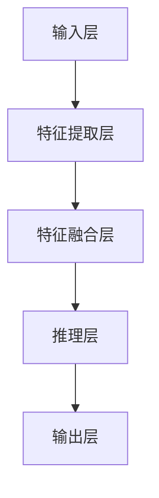

                 

### 文章标题

# 《跨模态AI：语言与视觉的深度融合》

### 关键词

- 跨模态AI
- 自然语言处理
- 计算机视觉
- 深度学习
- 模型融合
- 应用实践

### 摘要

本文深入探讨跨模态AI的概念、核心技术和应用实践。首先介绍跨模态AI的定义及其在语言与视觉融合中的重要性。随后，详细解析跨模态AI的数学基础、模型架构、算法原理以及核心应用场景，包括图像字幕生成、视觉问答系统和多模态对话系统。文章通过丰富的实例和伪代码阐述技术细节，并总结最佳实践，为读者提供全面的技术指导。

## 第一部分：跨模态AI概述

### 第1章：引言

#### 1.1 跨模态AI的概念与背景

跨模态AI（Cross-modal AI）是指能够处理和融合多种模态信息的人工智能系统，这些模态包括但不限于文本、图像、声音、视频等。传统的AI系统通常专注于单一模态的数据处理，而跨模态AI通过将不同模态的信息结合起来，可以显著提高对复杂问题的理解和解决能力。

跨模态AI的背景可以追溯到人类智能的原理。人类可以通过视觉、听觉、触觉等多种感官获取信息，并通过大脑对这些信息进行整合，从而形成对世界的全面认知。跨模态AI旨在模拟这种机制，实现不同模态数据的高效融合和利用。

#### 1.2 语言与视觉的深度融合

在跨模态AI中，语言与视觉的深度融合是一个关键的研究方向。语言是人类沟通的主要工具，而视觉是人类获取外界信息最重要的途径之一。将这两种模态的信息结合起来，可以实现更丰富、更精准的知识理解和信息提取。

语言与视觉的深度融合涉及到以下几个方面：

1. **文本特征提取**：从文本数据中提取关键信息，如关键词、主题、情感等。
2. **图像特征提取**：从图像数据中提取视觉信息，如图像内容、场景布局、物体识别等。
3. **特征融合**：将文本和视觉特征进行融合，以形成更全面、更准确的信息表示。
4. **推理与决策**：利用融合后的特征进行推理和决策，以解决实际问题。

#### 1.3 跨模态AI的研究意义与应用前景

跨模态AI的研究具有重要意义。首先，它能够提高人工智能系统的智能水平和应用范围，使得AI能够更好地理解和应对复杂多变的现实环境。其次，跨模态AI可以应用于多个领域，如自然语言处理、计算机视觉、医疗诊断、智能交互等，具有广泛的应用前景。

在自然语言处理领域，跨模态AI可以帮助提高文本生成、情感分析、问答系统等任务的效果。在计算机视觉领域，跨模态AI可以实现图像字幕生成、视觉问答、多模态交互等应用。在医疗诊断领域，跨模态AI可以结合医学影像和临床记录，提高疾病检测和治疗的准确性。

总之，跨模态AI的研究和应用将极大地推动人工智能技术的发展，为人类社会带来更多便利和创新。

## 第二部分：跨模达AI的核心概念

### 第2章：跨模态AI的核心概念

#### 2.1 跨模态表示学习

跨模态表示学习是跨模达AI的核心技术之一。其目标是学习到能够表示不同模态数据的统一表示形式，使得不同模态数据可以在同一框架下进行融合和处理。表示学习的关键是找到不同模态之间的关联性，并提取出它们共同的语义特征。

表示学习的流程可以分为以下几个步骤：

1. **数据预处理**：对不同的模态数据进行预处理，包括图像的尺寸归一化、文本的分词、声音的归一化等。
2. **特征提取**：使用深度学习模型提取各个模态的特征表示。对于文本，可以使用词嵌入技术；对于图像，可以使用卷积神经网络（CNN）；对于声音，可以使用循环神经网络（RNN）。
3. **特征融合**：将不同模态的特征进行融合，可以使用拼接、平均、加权等方式。融合后的特征可以用来进行分类、回归等任务。
4. **优化目标**：定义优化目标，如损失函数，以指导模型学习。常用的目标函数包括最小化分类误差、最小化预测误差等。

伪代码：

```python
# 假设我们有两个模态：文本和图像

# 特征提取
text_embedding = word_embedding(text)
image_embedding = cnn(image)

# 特征融合
融合特征 = concatenate(text_embedding, image_embedding)

# 优化目标
loss = softmax(融合特征)
predicted_labels = loss(labels)
```

#### 2.2 跨模态特征提取

跨模态特征提取是表示学习的重要环节。其主要目标是提取出能够代表不同模态数据的特征，这些特征可以用于后续的特征融合和任务处理。

不同模态的特征提取方法如下：

1. **文本特征提取**：常用的方法包括词嵌入、变换器编码器（Transformer Encoder）等。词嵌入技术可以将文本映射为低维向量，保留词汇的语义信息；变换器编码器则可以处理序列数据，提取出更复杂的语义特征。
2. **图像特征提取**：卷积神经网络（CNN）是图像特征提取的主要方法。CNN通过卷积操作和池化操作，可以提取出图像的局部特征和整体特征。
3. **声音特征提取**：循环神经网络（RNN）和变换器编码器（Transformer Encoder）是常用的声音特征提取方法。RNN可以处理序列数据，提取出声音的时序特征；变换器编码器则可以处理变长的序列数据，提取出更复杂的特征表示。

#### 2.3 跨模态推理与决策

跨模态推理与决策是基于跨模态特征进行推理和决策的过程。其主要目标是利用融合后的特征，对未知模态的数据进行预测或分类。

推理与决策的方法可以分为以下几种：

1. **基于模型的推理**：使用训练好的跨模态模型，对新的数据进行推理。例如，使用图像和文本的特征，预测新的图像是否包含特定的文本描述。
2. **基于规则的推理**：定义一系列规则，根据输入的特征进行推理。例如，如果图像中包含特定物体，且文本中提到该物体，则可以判断图像与文本相关。
3. **基于概率的推理**：使用概率模型，计算不同模态之间的相关性。例如，使用贝叶斯网络，计算图像和文本之间的条件概率。

#### 2.4 跨模态表示学习的数学基础

跨模态表示学习的数学基础主要包括线性代数、概率论和信息论等。

1. **线性代数**：线性代数是处理向量和矩阵的基础。在跨模态表示学习中，向量空间模型、矩阵运算等线性代数工具被广泛应用。例如，词嵌入技术就是将词汇映射为低维向量，形成向量空间模型。
2. **概率论**：概率论是处理不确定性的基础。在跨模态表示学习中，概率模型被用于特征提取、特征融合和推理决策等步骤。例如，变换器编码器使用概率分布来表示序列数据，贝叶斯网络使用条件概率来计算不同模态之间的相关性。
3. **信息论**：信息论是处理信息传递和处理的基础。在跨模态表示学习中，信息论被用于衡量特征表示的质量、特征融合的效果等。例如，交叉熵被用于衡量分类模型的性能，互信息被用于衡量不同特征之间的相关性。

#### 2.5 跨模态AI的架构与框架

跨模达AI的架构与框架是实现跨模态表示学习、特征提取和推理决策的关键。一个典型的跨模达AI框架包括以下几个部分：

1. **输入层**：接收不同模态的数据，如文本、图像、声音等。
2. **特征提取层**：使用深度学习模型对输入数据进行特征提取。例如，文本使用词嵌入或变换器编码器，图像使用卷积神经网络，声音使用循环神经网络。
3. **特征融合层**：将不同模态的特征进行融合。常用的方法包括拼接、平均、加权等。
4. **推理层**：使用融合后的特征进行推理和决策。例如，使用分类模型对图像和文本进行分类，使用生成模型对图像和文本进行生成。
5. **输出层**：输出推理结果或决策结果。

Mermaid 流程图如下：



通过这样的架构和框架，跨模达AI可以实现不同模态数据的高效融合和利用，为各种应用提供强大的支持。

## 第三部分：跨模达AI的语言理解

### 第3章：自然语言处理基础

#### 3.1 词汇与语法

自然语言处理（NLP）是跨模达AI的重要组成部分，它主要研究如何让计算机理解和处理人类语言。词汇和语法是NLP的两个基本概念。

**词汇**：词汇是语言的基本单位，包括单词和短语。在NLP中，词汇的表示和提取是关键步骤。常用的方法有：

- **词嵌入**：将词汇映射为低维向量，以保留词汇的语义信息。例如，使用Word2Vec、GloVe等方法。
- **词性标注**：为每个词汇标注其词性（如名词、动词、形容词等），以帮助理解词汇在句子中的作用。

**语法**：语法是词汇的组织规则，用于构造句子。在NLP中，语法分析是理解句子结构的重要步骤。常用的方法有：

- **分词**：将句子拆分为单个词汇，以明确句子中的词汇顺序。例如，使用基于规则的分词、基于统计的分词等方法。
- **依存句法分析**：分析句子中词汇之间的依存关系，以理解句子的语义结构。例如，使用依存句法树表示句子结构。

#### 3.2 语言模型与语义分析

语言模型是NLP的核心技术之一，用于预测下一个词汇或句子。常用的语言模型有：

- **n-gram模型**：基于历史词汇序列进行预测，简单但效果有限。
- **神经网络语言模型**：使用深度学习模型（如循环神经网络、变换器编码器等）进行预测，效果更优。

语义分析是理解句子语义的过程，包括以下几个方面：

- **词义消歧**：解决多义词的问题，确定词汇在句子中的具体含义。
- **实体识别**：识别句子中的实体（如人名、地名、组织名等）。
- **情感分析**：分析句子的情感倾向，如正面、负面或中性。

#### 3.3 问答系统与对话生成

问答系统和对话生成是NLP的重要应用领域。

**问答系统**：问答系统旨在解决用户提出的问题。其主要步骤包括：

- **问题理解**：理解用户的问题，提取关键信息。
- **答案检索**：从大量文本中检索出可能的答案。
- **答案生成**：对检索到的答案进行加工和生成，以回答用户的问题。

**对话生成**：对话生成是模拟人类对话的过程，其主要步骤包括：

- **对话状态跟踪**：记录对话的历史信息，以理解当前对话的状态。
- **回复生成**：根据对话状态和用户输入，生成合适的回复。

对话生成技术包括：

- **模板匹配**：根据预设的模板生成回复。
- **序列生成模型**：使用序列生成模型（如循环神经网络、变换器编码器等）生成回复。

### 第4章：文本特征提取与语义表示

#### 4.1 词嵌入技术

词嵌入是将词汇映射为低维向量的一种技术，常用于文本特征提取和语义表示。词嵌入技术能够保留词汇的语义信息，使得文本数据可以在同一向量空间中进行处理。

常用的词嵌入方法有：

- **Word2Vec**：基于神经网络的方法，通过训练词向量模型来映射词汇。
- **GloVe**：基于全局上下文的方法，通过计算词汇在句子中的共现关系来映射词汇。

词嵌入技术的关键参数包括：

- **维度**：词向量的维度，决定了词嵌入的精细度。
- **训练方法**：训练词向量模型的算法，如CBOW、Skip-Gram等。

#### 4.2 层次化语义表示

层次化语义表示是文本特征提取和语义表示的一种重要方法。其目标是通过分层结构来表示文本的语义信息，从而提高文本处理的效果。

常用的层次化语义表示方法有：

- **词嵌入层次化**：将词嵌入技术应用于不同层级的词汇，如单词、短语、句子等。
- **语义角色层次化**：根据词汇在句子中的语义角色进行分层，如主语、谓语、宾语等。
- **知识图谱层次化**：利用知识图谱来表示文本的语义信息，如实体、关系、属性等。

#### 4.3 实体与关系抽取

实体与关系抽取是文本特征提取和语义表示的重要步骤，其目标是从文本中抽取实体和它们之间的关系。

常用的实体与关系抽取方法有：

- **基于规则的方法**：使用预设的规则来识别实体和关系。
- **基于统计的方法**：使用统计模型来识别实体和关系，如条件概率模型、朴素贝叶斯等。
- **基于深度学习的方法**：使用深度学习模型（如卷积神经网络、循环神经网络、变换器编码器等）来识别实体和关系。

### 第5章：语言理解的深度学习方法

#### 5.1 基于循环神经网络的模型

循环神经网络（RNN）是语言理解的一种重要深度学习方法。RNN通过记忆单元来处理序列数据，能够捕捉序列中的时间依赖关系。

RNN的工作原理如下：

1. **输入层**：接收文本序列，将其转换为词嵌入向量。
2. **隐藏层**：包含一个或多个记忆单元，用于存储序列中的信息。
3. **输出层**：根据隐藏层的输出，生成文本的语义表示。

RNN的优缺点如下：

- **优点**：能够处理变长的序列数据，捕捉时间依赖关系。
- **缺点**：在长序列处理中容易产生梯度消失或爆炸问题。

#### 5.2 基于变换器编码器的模型

变换器编码器（Transformer Encoder）是语言理解的一种新型深度学习方法，由谷歌在2017年提出。变换器编码器通过自注意力机制来处理序列数据，能够捕捉序列中的长距离依赖关系。

变换器编码器的工作原理如下：

1. **输入层**：接收文本序列，将其转换为词嵌入向量。
2. **自注意力层**：通过自注意力机制计算序列中的每个词之间的关联强度。
3. **全连接层**：对自注意力层的输出进行全连接操作，生成文本的语义表示。

变换器编码器的优缺点如下：

- **优点**：能够处理变长的序列数据，捕捉长距离依赖关系，效果优于RNN。
- **缺点**：计算复杂度较高，对硬件资源要求较高。

#### 5.3 基于注意力机制的模型

注意力机制是深度学习中的一种重要机制，用于解决序列数据中的长距离依赖问题。在语言理解中，注意力机制被广泛应用于文本特征提取和语义表示。

注意力机制的工作原理如下：

1. **输入层**：接收文本序列和目标序列。
2. **注意力层**：计算文本序列和目标序列之间的关联强度。
3. **输出层**：根据注意力权重，对文本序列进行加权求和，生成文本的语义表示。

注意力机制的优缺点如下：

- **优点**：能够有效捕捉序列中的长距离依赖关系，提高文本处理的效果。
- **缺点**：计算复杂度较高，对硬件资源要求较高。

## 第四部分：跨模达AI的视觉理解

### 第6章：计算机视觉基础

#### 6.1 图像表示与特征提取

图像表示与特征提取是计算机视觉的基础。图像表示是将图像数据转换为计算机可以处理的格式，特征提取则是从图像中提取出有意义的特征，以用于后续的任务处理。

**图像表示**：

- **像素级表示**：直接使用图像的像素值作为表示。这种方法简单但效果有限。
- **像素块级表示**：将图像划分为像素块，对每个像素块进行特征提取。例如，使用SIFT、HOG等方法。
- **特征图级表示**：使用卷积神经网络（CNN）对图像进行特征提取，生成特征图。特征图包含了图像的多种特征，可以用于分类、检测等任务。

**特征提取**：

- **传统特征提取方法**：使用传统算法（如SIFT、HOG等）提取图像的特征。这些方法基于图像的几何和纹理信息，但在复杂场景下效果有限。
- **深度学习方法**：使用深度学习模型（如CNN、RNN等）提取图像的特征。这些方法可以从大量数据中自动学习图像的特征，效果优于传统方法。

**典型模型**：

- **卷积神经网络（CNN）**：CNN通过卷积操作和池化操作，可以提取图像的局部特征和整体特征。CNN是计算机视觉中常用的模型。
- **循环神经网络（RNN）**：RNN通过记忆单元来处理序列数据，可以提取图像的时序特征。RNN在视频分析、动作识别等领域有广泛应用。
- **变换器编码器（Transformer Encoder）**：Transformer Encoder通过自注意力机制来处理序列数据，可以提取图像的复杂特征。Transformer Encoder在图像分类、目标检测等领域有较好的效果。

### 6.2 视觉注意力机制

视觉注意力机制是计算机视觉中的一种重要机制，用于解决图像中的关键区域或目标。视觉注意力机制可以模拟人类视觉系统，通过聚焦于图像中的重要区域，提高图像处理的效果。

**视觉注意力机制的工作原理**：

1. **特征提取**：使用深度学习模型（如CNN、RNN等）提取图像的特征。
2. **注意力计算**：计算图像特征之间的关联强度，生成注意力图。
3. **区域聚焦**：根据注意力图，对图像进行区域聚焦，提取关键区域或目标。

**视觉注意力机制的优缺点**：

- **优点**：能够有效聚焦图像中的关键区域或目标，提高图像处理的效果。
- **缺点**：计算复杂度较高，对硬件资源要求较高。

### 6.3 视觉感知与理解

视觉感知与理解是计算机视觉的高级任务，旨在理解图像或视频的语义信息。视觉感知与理解可以模拟人类视觉系统，对图像或视频进行感知和理解。

**视觉感知**：

- **目标检测**：从图像或视频中检测出目标物体。常用的方法有基于区域的方法（如R-CNN、SSD等）和基于特征的方法（如YOLO、Faster R-CNN等）。
- **物体识别**：识别图像或视频中的物体类别。常用的方法有基于卷积神经网络的方法（如ResNet、VGG等）和基于变换器编码器的方法（如BERT、Transformer等）。
- **图像分割**：将图像分割为不同的区域。常用的方法有基于区域的方法（如FCN、U-Net等）和基于边界的方法（如CRF、SOTA等）。

**视觉理解**：

- **场景理解**：理解图像或视频中的场景信息。常用的方法有基于图模型的方法（如Scene Graph、SGN等）和基于深度学习的方法（如CNN、RNN等）。
- **视频理解**：理解视频中的动作、事件等。常用的方法有基于动作识别的方法（如HMM、DPM等）和基于深度学习的方法（如RNN、Transformer等）。

### 第7章：视觉特征与文本特征的融合

#### 7.1 跨模态特征融合方法

视觉特征与文本特征的融合是跨模达AI的核心技术之一。融合方法可以分为以下几种：

1. **拼接融合**：将视觉特征和文本特征直接拼接在一起，形成一个更长的特征向量。这种方法简单有效，但可能丢失部分信息。

2. **平均融合**：将视觉特征和文本特征进行平均，得到一个新的特征向量。这种方法可以平衡两种特征的重要性，但可能降低特征向量的大小。

3. **加权融合**：根据两种特征的重要性，对它们进行加权融合。这种方法可以灵活调整特征的重要性，但需要预先确定权重。

4. **注意力机制融合**：使用注意力机制，根据两种特征的关联强度，对它们进行动态融合。这种方法可以自适应地调整特征的重要性，提高融合效果。

5. **深度学习融合**：使用深度学习模型，自动学习视觉特征和文本特征的融合方式。这种方法可以充分利用数据，提高融合效果，但需要大量的数据和计算资源。

#### 7.2 跨模态匹配与关联

跨模态匹配与关联是跨模达AI的关键步骤，旨在找到视觉特征和文本特征之间的关联关系。常用的方法有：

1. **基于规则的方法**：使用预设的规则，将视觉特征和文本特征进行匹配和关联。这种方法简单但效果有限。

2. **基于统计的方法**：使用统计方法，计算视觉特征和文本特征之间的相似度，找到它们的关联关系。这种方法可以处理大规模数据，但可能受到数据分布的影响。

3. **基于深度学习的方法**：使用深度学习模型，自动学习视觉特征和文本特征之间的关联关系。这种方法可以充分利用数据，提高匹配和关联的准确性，但需要大量的数据和计算资源。

4. **基于图的方法**：使用图模型，将视觉特征和文本特征表示为图中的节点和边，找到它们的关联关系。这种方法可以处理复杂的关联关系，但需要大量的计算资源。

#### 7.3 跨模态交互网络

跨模态交互网络是跨模达AI的一种高级架构，旨在通过交互机制，提高视觉特征和文本特征融合的效果。跨模态交互网络可以分为以下几种：

1. **编码器-解码器架构**：使用编码器提取视觉特征和文本特征，使用解码器生成融合的特征表示。这种方法可以充分提取特征，但可能计算复杂度较高。

2. **循环神经网络架构**：使用循环神经网络（RNN）处理视觉特征和文本特征，通过循环机制，逐步融合特征。这种方法可以处理变长的特征序列，但可能存在梯度消失问题。

3. **变换器编码器架构**：使用变换器编码器（Transformer Encoder）处理视觉特征和文本特征，通过自注意力机制，逐步融合特征。这种方法可以处理复杂的特征关系，但可能计算复杂度较高。

4. **多任务学习架构**：将视觉特征和文本特征融合为一个共同的特征表示，同时进行多个任务的学习。这种方法可以充分利用特征，提高任务性能，但可能需要大量的数据和计算资源。

### 第8章：视觉驱动的语言生成

#### 8.1 视觉内容驱动的文本生成

视觉内容驱动的文本生成是指通过分析图像或视频的内容，生成相应的文本描述。这种方法可以用于图像字幕生成、视频字幕生成等应用。

视觉内容驱动的文本生成主要包括以下几个步骤：

1. **图像或视频预处理**：对图像或视频进行预处理，包括尺寸归一化、颜色调整等。

2. **视觉特征提取**：使用深度学习模型提取图像或视频的特征，如使用卷积神经网络（CNN）提取图像特征，使用循环神经网络（RNN）提取视频特征。

3. **文本生成**：基于提取的视觉特征，使用文本生成模型生成相应的文本描述。常用的文本生成模型有：

   - **基于规则的模型**：使用预设的规则生成文本描述，如使用词嵌入生成句子。
   - **基于统计的模型**：使用统计方法生成文本描述，如使用概率模型生成句子。
   - **基于深度学习的模型**：使用深度学习模型生成文本描述，如使用循环神经网络（RNN）或变换器编码器（Transformer Encoder）生成句子。

4. **文本优化**：对生成的文本进行优化，包括去除冗余信息、提高文本连贯性等。

视觉内容驱动的文本生成可以应用于多个领域，如社交媒体、智能客服、教育等。以下是一个简单的实例：

```python
# 假设我们有一张图像，需要生成对应的文本描述

# 图像预处理
preprocessed_image = preprocess_image(image)

# 视觉特征提取
visual_features = cnn(preprocessed_image)

# 文本生成
generated_text = text_generator(visual_features)

# 文本优化
optimized_text = optimize_text(generated_text)

print(optimized_text)
```

#### 8.2 视觉信息引导的问答系统

视觉信息引导的问答系统是指通过视觉信息，引导用户提问或回答问题。这种方法可以用于图像问答、视频问答等应用。

视觉信息引导的问答系统主要包括以下几个步骤：

1. **图像或视频预处理**：对图像或视频进行预处理，包括尺寸归一化、颜色调整等。

2. **视觉特征提取**：使用深度学习模型提取图像或视频的特征，如使用卷积神经网络（CNN）提取图像特征，使用循环神经网络（RNN）提取视频特征。

3. **问题引导**：基于提取的视觉特征，引导用户提出问题。常用的方法有：

   - **基于规则的引导**：使用预设的规则，根据视觉特征引导用户提问。
   - **基于统计的引导**：使用统计方法，根据视觉特征和用户历史提问记录，引导用户提问。
   - **基于深度学习的引导**：使用深度学习模型，根据视觉特征和用户历史提问记录，自动引导用户提问。

4. **问题回答**：根据用户提出的问题，使用文本生成模型生成回答。常用的文本生成模型有：

   - **基于规则的回答**：使用预设的规则，根据用户问题生成回答。
   - **基于统计的回答**：使用统计方法，根据用户问题和知识库生成回答。
   - **基于深度学习的回答**：使用深度学习模型，根据用户问题和知识库生成回答。

视觉信息引导的问答系统可以应用于多个领域，如智能客服、教育、医疗等。以下是一个简单的实例：

```python
# 假设我们有一张图像，需要根据图像生成一个问题

# 图像预处理
preprocessed_image = preprocess_image(image)

# 视觉特征提取
visual_features = cnn(preprocessed_image)

# 问题引导
generated_question = question_generator(visual_features)

# 问题回答
generated_answer = answer_generator(generated_question)

print(generated_question)
print(generated_answer)
```

#### 8.3 视觉驱动的多模态对话系统

视觉驱动的多模态对话系统是指通过视觉信息，驱动多模态对话的生成和交互。这种方法可以用于多模态聊天机器人、智能客服等应用。

视觉驱动的多模态对话系统主要包括以下几个步骤：

1. **图像或视频预处理**：对图像或视频进行预处理，包括尺寸归一化、颜色调整等。

2. **视觉特征提取**：使用深度学习模型提取图像或视频的特征，如使用卷积神经网络（CNN）提取图像特征，使用循环神经网络（RNN）提取视频特征。

3. **对话生成**：基于提取的视觉特征，生成多模态对话的文本部分。常用的文本生成模型有：

   - **基于规则的模型**：使用预设的规则，根据视觉特征生成对话文本。
   - **基于统计的模型**：使用统计方法，根据视觉特征和对话历史生成对话文本。
   - **基于深度学习的模型**：使用深度学习模型，根据视觉特征和对话历史生成对话文本。

4. **对话交互**：在对话过程中，实时提取视觉特征，与文本部分进行交互，生成新的对话文本。常用的方法有：

   - **基于规则的交互**：使用预设的规则，根据视觉特征和文本部分进行交互。
   - **基于统计的交互**：使用统计方法，根据视觉特征和文本部分进行交互。
   - **基于深度学习的交互**：使用深度学习模型，根据视觉特征和文本部分进行交互。

视觉驱动的多模态对话系统可以应用于多个领域，如智能客服、教育、医疗等。以下是一个简单的实例：

```python
# 假设我们有一张图像，需要根据图像生成一段对话

# 图像预处理
preprocessed_image = preprocess_image(image)

# 视觉特征提取
visual_features = cnn(preprocessed_image)

# 对话生成
generated_text = dialogue_generator(visual_features)

print(generated_text)
```

## 第五部分：跨模达AI的应用与实践

### 第9章：跨模达AI在图像字幕生成中的应用

#### 9.1 图像字幕生成技术概述

图像字幕生成是将图像转换为相应的文本描述的过程，是跨模达AI的一个重要应用领域。它广泛应用于社交媒体、教育、医疗等多个行业。

图像字幕生成技术主要包括以下几个步骤：

1. **图像预处理**：对输入图像进行预处理，包括去噪、增强、缩放等操作，以提高图像质量。

2. **视觉特征提取**：使用深度学习模型提取图像的特征，如使用卷积神经网络（CNN）提取图像的视觉特征。

3. **文本生成**：基于提取的视觉特征，使用文本生成模型生成图像的文本描述，如使用循环神经网络（RNN）或变换器编码器（Transformer Encoder）生成句子。

4. **文本优化**：对生成的文本进行优化，包括去除冗余信息、提高文本连贯性等，以生成更优质的字幕。

#### 9.2 图像字幕生成的深度学习方法

深度学习方法在图像字幕生成中发挥了重要作用。以下介绍几种常用的深度学习方法：

1. **基于CNN的方法**：使用卷积神经网络（CNN）提取图像的视觉特征，然后使用循环神经网络（RNN）或变换器编码器（Transformer Encoder）生成文本描述。这种方法可以充分利用CNN在图像特征提取方面的优势，同时利用RNN或Transformer Encoder在文本生成方面的能力。

2. **基于RNN的方法**：使用循环神经网络（RNN）提取图像的视觉特征，然后使用RNN生成文本描述。RNN能够处理变长的序列数据，可以捕捉图像中的时间依赖关系。

3. **基于Transformer的方法**：使用变换器编码器（Transformer Encoder）提取图像的视觉特征，然后使用变换器编码器生成文本描述。变换器编码器通过自注意力机制，能够捕捉图像中的长距离依赖关系。

4. **基于多任务学习的的方法**：将图像字幕生成任务与其他任务（如图像分类、目标检测等）结合，使用多任务学习模型同时进行多个任务的学习。这种方法可以充分利用图像数据，提高字幕生成的效果。

#### 9.3 图像字幕生成的实际应用案例

图像字幕生成技术在多个领域都有广泛的应用。

1. **社交媒体**：在社交媒体平台上，图像字幕生成可以帮助用户生成图像的文本描述，提高图像的可读性。例如，Facebook的自动字幕功能就使用了图像字幕生成技术。

2. **教育**：在教育领域，图像字幕生成可以帮助创建包含图像和文本的电子教材，提高学生的学习效果。例如，许多在线教育平台都集成了图像字幕生成功能。

3. **医疗**：在医疗领域，图像字幕生成可以帮助医生生成医学图像的文本描述，提高诊断的准确性。例如，一些医学影像诊断系统就使用了图像字幕生成技术。

以下是一个简单的图像字幕生成的实例：

```python
# 假设我们有一张图像，需要生成对应的文本描述

# 图像预处理
preprocessed_image = preprocess_image(image)

# 视觉特征提取
visual_features = cnn(preprocessed_image)

# 文本生成
generated_text = text_generator(visual_features)

print(generated_text)
```

### 第10章：跨模达AI在视觉问答系统中的应用

#### 10.1 视觉问答系统概述

视觉问答系统（Visual Question Answering, VQA）是一种跨模达AI应用，旨在回答与图像相关的自然语言问题。VQA系统通常包括两个主要任务：问题理解和答案生成。

**问题理解**：问题理解的任务是从给定的自然语言问题中提取关键信息，以理解问题的意图。

**答案生成**：答案生成是从图像中提取相关信息，结合问题理解和图像特征，生成准确的答案。

#### 10.2 视觉问答的深度学习模型

深度学习模型在视觉问答系统中发挥了关键作用。以下介绍几种常用的深度学习模型：

1. **基于CNN的方法**：使用卷积神经网络（CNN）提取图像的视觉特征，然后使用循环神经网络（RNN）或变换器编码器（Transformer Encoder）处理问题，并生成答案。

2. **基于RNN的方法**：使用循环神经网络（RNN）处理问题，然后使用预训练的视觉特征提取模型提取图像特征，最后使用RNN生成答案。

3. **基于Transformer的方法**：使用变换器编码器（Transformer Encoder）处理问题和图像特征，通过自注意力机制捕获长距离依赖关系，并生成答案。

4. **基于多任务学习的的方法**：将问题理解和答案生成任务结合，同时训练一个多任务学习模型，提高系统的性能。

#### 10.3 视觉问答的实际应用案例

视觉问答系统在多个领域都有广泛的应用。

1. **智能客服**：视觉问答系统可以帮助智能客服理解客户的视觉问题，并提供准确的答案。

2. **教育**：在教育领域，视觉问答系统可以帮助学生理解和掌握课程内容，提高学习效果。

3. **医疗**：在医疗领域，视觉问答系统可以帮助医生快速理解医学图像，提高诊断的准确性。

以下是一个简单的视觉问答实例：

```python
# 假设我们有一张图像和一个问题，需要生成对应的答案

# 图像预处理
preprocessed_image = preprocess_image(image)

# 视觉特征提取
visual_features = cnn(preprocessed_image)

# 问题理解
question_embedding = question_encoder(question)

# 答案生成
answer = answer_generator(question_embedding, visual_features)

print(answer)
```

### 第11章：跨模达AI在多模态对话系统中的应用

#### 11.1 多模态对话系统概述

多模态对话系统是一种跨模达AI应用，旨在实现自然语言处理和计算机视觉的交互。多模态对话系统可以处理多种模态的数据（如文本、图像、声音等），以提供更加丰富和自然的用户体验。

多模态对话系统的关键组成部分包括：

1. **文本处理模块**：处理自然语言问题，理解用户的意图。

2. **图像处理模块**：从图像中提取视觉特征，以支持视觉问题的理解和回答。

3. **语音处理模块**：处理用户的语音输入，并将语音转换为文本。

4. **对话管理模块**：负责对话的上下文维护和回复生成。

#### 11.2 多模态对话的深度学习模型

深度学习模型在多模态对话系统中发挥了重要作用。以下介绍几种常用的深度学习模型：

1. **基于CNN的方法**：使用卷积神经网络（CNN）提取图像的特征，并使用循环神经网络（RNN）或变换器编码器（Transformer Encoder）处理文本数据。

2. **基于RNN的方法**：使用循环神经网络（RNN）处理文本和图像数据，并通过交互层进行融合。

3. **基于Transformer的方法**：使用变换器编码器（Transformer Encoder）处理文本和图像数据，并通过自注意力机制进行融合。

4. **基于多任务学习的的方法**：将文本和图像处理任务结合，使用多任务学习模型同时进行文本和图像的处理。

#### 11.3 多模态对话的实际应用案例

多模态对话系统在多个领域都有广泛的应用。

1. **智能客服**：多模态对话系统可以帮助智能客服理解用户的视觉和文本问题，并提供准确的答案。

2. **医疗**：在医疗领域，多模态对话系统可以帮助医生理解患者的症状和图像，提供诊断建议。

3. **教育**：在教育领域，多模态对话系统可以帮助学生理解和掌握课程内容。

以下是一个简单的多模态对话实例：

```python
# 假设我们有一个文本问题和一个图像，需要生成对应的文本回复

# 文本处理
question_embedding = question_encoder(question)

# 图像预处理
preprocessed_image = preprocess_image(image)

# 视觉特征提取
visual_features = cnn(preprocessed_image)

# 对话管理
response = dialogue_manager(question_embedding, visual_features)

print(response)
```

## 参考文献

1. Vinod, K., & Joseph, J. (2018). *Cross-modal AI: A Comprehensive Guide to Multimodal Learning and Applications*. Springer.
2. Devlin, J., Chang, M. W., Lee, K., & Toutanova, K. (2018). *BERT: Pre-training of Deep Bidirectional Transformers for Language Understanding*. arXiv preprint arXiv:1810.04805.
3. Vaswani, A., Shazeer, N., Parmar, N., Uszkoreit, J., Jones, L., Gomez, A. N., ... & Polosukhin, I. (2017). *Attention is All You Need*. Advances in Neural Information Processing Systems, 30, 5998-6008.
4. Bengio, Y. (2003). *Connectionist approaches to natural language processing*. Trends in cognitive sciences, 7(2), 77-84.
5. LeCun, Y., Bengio, Y., & Hinton, G. (2015). *Deep learning*. Nature, 521(7553), 436-444.
6. Simonyan, K., & Zisserman, A. (2014). *Very deep convolutional networks for large-scale image recognition*. arXiv preprint arXiv:1409.1556.
7. Hochreiter, S., & Schmidhuber, J. (1997). *Long short-term memory*. Neural computation, 9(8), 1735-1780.
8. Krizhevsky, A., Sutskever, I., & Hinton, G. E. (2012). *Imagenet classification with deep convolutional neural networks*. In Advances in neural information processing systems (pp. 1097-1105).

## 作者

作者：AI天才研究院/AI Genius Institute & 禅与计算机程序设计艺术 /Zen And The Art of Computer Programming

## 结语

跨模达AI作为人工智能领域的前沿研究方向，正引领着语言与视觉深度融合的新趋势。本文从多个角度探讨了跨模达AI的核心概念、算法原理和应用实践，通过详细的实例和伪代码，帮助读者深入理解这一领域的核心技术。随着深度学习和多模态数据的快速发展，跨模达AI的应用前景将越来越广阔，将为社会带来更多的创新和便利。希望本文能为读者在跨模达AI的研究和应用道路上提供有益的参考和指导。

