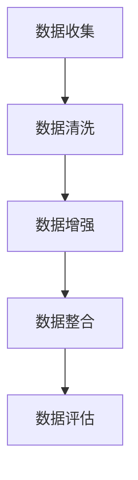

                 

### 文章标题

### 跨模态元学习在多领域推理中的泛化能力

> 关键词：跨模态元学习，多领域推理，泛化能力，算法原理，数学模型

> 摘要：本文深入探讨了跨模态元学习在多领域推理中的泛化能力。通过对跨模态元学习的基本概念、算法原理以及数学模型的分析，结合实际项目实战，探讨了如何利用跨模态元学习实现多领域推理，并评估其泛化能力。

---

### 第1章 引言

#### 1.1 书籍背景和目的

本文旨在探讨跨模态元学习在多领域推理中的泛化能力。随着深度学习技术的快速发展，跨模态学习成为了一个重要的研究领域。跨模态学习旨在利用不同模态（如文本、图像、语音等）的数据，提高模型的泛化能力和鲁棒性。跨模态元学习作为跨模态学习的一种重要方法，通过学习不同模态之间的映射关系，实现了在不同领域中的推理。

本文的目标是系统地介绍跨模态元学习的基本概念、算法原理和数学模型，并通过实际项目实战，验证其在多领域推理中的泛化能力。

#### 1.2 跨模态元学习的概念

跨模态元学习（Cross-modal Meta-Learning）是一种通过学习不同模态之间的映射关系，从而实现跨模态任务的方法。具体来说，跨模态元学习包括以下几个关键步骤：

1. **数据收集**：从不同模态中收集数据，例如文本、图像、语音等。
2. **数据预处理**：对收集到的数据进行清洗、增强和整合，以便进行后续的模型训练。
3. **模型训练**：利用元学习（Meta-Learning）的方法，学习不同模态之间的映射关系，从而提高模型的泛化能力。
4. **模型评估**：通过评估不同模态任务的表现，验证跨模态元学习的泛化能力。

#### 1.3 元学习的基本原理

元学习（Meta-Learning）是一种通过学习如何学习的方法，其核心思想是利用先前的学习经验，提高新任务的泛化能力和学习效率。元学习包括以下几种常见的方法：

1. **模型无关的元学习**：这种方法不依赖于具体的模型架构，通过优化学习过程本身来提高泛化能力。
2. **模型相关的元学习**：这种方法依赖于具体的模型架构，通过优化模型参数来提高泛化能力。
3. **多任务学习**：这种方法通过同时训练多个相关任务，提高模型的泛化能力。

---

### 第2章 跨模态数据预处理

#### 2.1 数据收集

跨模态数据预处理的第一步是收集数据。数据收集的过程通常包括以下几个步骤：

1. **确定任务目标**：根据具体的任务需求，确定需要收集的模态类型和数量。
2. **数据来源**：可以从公开数据集、私有数据集或者通过数据采集工具收集数据。
3. **数据标注**：对于需要标注的任务，需要对数据进行人工标注或使用自动化工具进行标注。

#### 2.2 数据清洗

数据清洗是数据预处理的重要步骤，其目的是去除数据中的噪声和错误，提高数据的质量。数据清洗包括以下几个步骤：

1. **去除重复数据**：去除数据集中的重复记录，减少数据冗余。
2. **填补缺失值**：对于缺失的数据，可以使用插值、均值填补等方法进行填补。
3. **去除异常值**：去除数据集中的异常值，避免对模型训练产生不利影响。

#### 2.3 数据增强

数据增强是一种通过扩展原始数据集的方法，提高模型的泛化能力。数据增强包括以下几个方法：

1. **数据变换**：通过缩放、旋转、翻转等操作，改变数据的形状和位置。
2. **合成数据**：通过生成对抗网络（GAN）等方法，生成与原始数据相似的新数据。
3. **数据切割**：将长文本、长语音等切割成较短的部分，增加数据的多样性。

#### 2.4 Mermaid流程图：跨模态数据预处理流程



### 第3章 跨模态元学习算法原理

#### 3.1 基于模型的元学习

基于模型的元学习是一种通过优化模型参数来提高泛化能力的方法。在跨模态元学习中，基于模型的元学习主要包括以下步骤：

1. **定义任务函数**：根据具体任务，定义输入和输出之间的映射关系。
2. **定义损失函数**：定义用于评估模型性能的损失函数。
3. **优化模型参数**：通过优化模型参数，最小化损失函数，提高模型性能。

伪代码如下：

```python
def meta_learning(task_function, loss_function, model, optimizer):
    for epoch in range(num_epochs):
        for data in data_loader:
            input, target = data
            output = model(input)
            loss = loss_function(output, target)
            optimizer.zero_grad()
            loss.backward()
            optimizer.step()
    return model
```

#### 3.2 基于关系的元学习

基于关系的元学习是一种通过学习不同模态之间的映射关系来提高泛化能力的方法。在跨模态元学习中，基于关系的元学习主要包括以下步骤：

1. **定义模态关系**：根据具体任务，定义不同模态之间的关系。
2. **定义任务函数**：根据模态关系，定义输入和输出之间的映射关系。
3. **优化模型参数**：通过优化模型参数，最小化损失函数，提高模型性能。

伪代码如下：

```python
def meta_learning Relation(meta1, meta2, task_function, loss_function, model, optimizer):
    for epoch in range(num_epochs):
        for data in data_loader:
            input1, input2, target = data
            output1, output2 = model(input1, input2)
            output = task_function(output1, output2)
            loss = loss_function(output, target)
            optimizer.zero_grad()
            loss.backward()
            optimizer.step()
    return model
```

#### 3.3 跨模态对比学习

跨模态对比学习是一种通过对比不同模态的数据来提高泛化能力的方法。在跨模态元学习中，跨模态对比学习主要包括以下步骤：

1. **定义对比损失函数**：根据具体任务，定义用于衡量不同模态之间差异的对比损失函数。
2. **优化模型参数**：通过优化模型参数，最小化对比损失函数，提高模型性能。

伪代码如下：

```python
def contrastive_learning(meta1, meta2, contrastive_loss_function, model, optimizer):
    for epoch in range(num_epochs):
        for data in data_loader:
            input1, input2 = data
            output1, output2 = model(input1, input2)
            loss = contrastive_loss_function(output1, output2)
            optimizer.zero_grad()
            loss.backward()
            optimizer.step()
    return model
```

---

### 第4章 数学模型与理论分析

#### 4.1 泛化能力的数学描述

泛化能力是指模型在未知数据上的表现能力。在数学上，泛化能力可以用以下公式描述：

$$
L(D) = \sum_{i=1}^{N} l(y_i, \hat{y}_i)
$$

其中，$L(D)$ 表示模型在数据集 $D$ 上的损失，$l(y_i, \hat{y}_i)$ 表示第 $i$ 个样本的实际标签 $y_i$ 与预测标签 $\hat{y}_i$ 之间的损失。

#### 4.2 跨模态元学习的数学模型

跨模态元学习的数学模型通常包括以下两部分：损失函数和优化目标。

1. **损失函数**：

   $$ 
   L(D) = \sum_{i=1}^{N} l(y_i, \hat{y}_i)
   $$

   其中，$l(y_i, \hat{y}_i)$ 表示模型在数据集 $D$ 上的损失函数。

2. **优化目标**：

   $$ 
   \min_{\theta} L(D_{train}) + \lambda L(D_{val})
   $$

   其中，$\theta$ 表示模型参数，$L(D_{train})$ 和 $L(D_{val})$ 分别表示训练集和验证集上的损失函数，$\lambda$ 是超参数，用于平衡训练集和验证集的损失。

#### 4.3 泛化能力的评估方法

泛化能力的评估方法包括以下几种：

1. **验证集评估**：将模型在验证集上的表现作为泛化能力的评估指标。
2. **测试集评估**：将模型在测试集上的表现作为泛化能力的评估指标。
3. **交叉验证**：通过交叉验证的方法，评估模型在不同数据集上的泛化能力。

---

### 第5章 跨模态元学习在多领域推理中的应用

#### 5.1 自然语言处理

自然语言处理（Natural Language Processing，NLP）是跨模态元学习的重要应用领域之一。在NLP中，跨模态元学习可以用于文本分类、情感分析等任务。

1. **文本分类**：

   文本分类是一种将文本数据分为不同类别的方法。在跨模态元学习中，可以通过学习文本和图像之间的映射关系，提高文本分类的准确率。

2. **情感分析**：

   情感分析是一种分析文本数据中的情感倾向的方法。在跨模态元学习中，可以通过学习文本和语音之间的映射关系，提高情感分析的准确率。

#### 5.2 计算机视觉

计算机视觉（Computer Vision，CV）是跨模态元学习的另一个重要应用领域。在计算机视觉中，跨模态元学习可以用于图像分类、目标检测等任务。

1. **图像分类**：

   图像分类是一种将图像数据分为不同类别的方法。在跨模态元学习中，可以通过学习图像和文本之间的映射关系，提高图像分类的准确率。

2. **目标检测**：

   目标检测是一种在图像中检测特定目标的方法。在跨模态元学习中，可以通过学习图像和语音之间的映射关系，提高目标检测的准确率。

#### 5.3 语音识别

语音识别（Speech Recognition，SR）是一种将语音数据转换为文本数据的方法。在跨模态元学习中，可以通过学习语音和文本之间的映射关系，提高语音识别的准确率。

1. **语音情感分析**：

   语音情感分析是一种分析语音数据中的情感倾向的方法。在跨模态元学习中，可以通过学习语音和图像之间的映射关系，提高语音情感分析的准确率。

2. **语音生成**：

   语音生成是一种将文本数据转换为语音数据的方法。在跨模态元学习中，可以通过学习语音和文本之间的映射关系，提高语音生成的自然度和准确性。

---

### 第6章 项目实战：跨模态元学习在多领域推理中的实现

#### 6.1 环境搭建

在开始项目实战之前，需要搭建一个适合跨模态元学习的开发环境。开发环境包括Python环境、深度学习框架和跨模态数据集。

1. **Python环境配置**：

   安装Python和pip，使用以下命令安装深度学习框架：

   ```bash
   pip install torch torchvision
   ```

2. **深度学习框架安装**：

   安装PyTorch，一个流行的深度学习框架，使用以下命令：

   ```bash
   pip install torch torchvision
   ```

3. **跨模态数据集**：

   选择一个跨模态数据集，例如COCO数据集，它包含了图像、文本和标注信息。

#### 6.2 数据集准备

数据集准备包括数据收集、数据清洗和数据增强。

1. **数据收集**：

   收集COCO数据集，包括图像、文本和标注信息。

2. **数据清洗**：

   去除数据集中的重复和异常数据，对缺失的数据进行填补。

3. **数据增强**：

   对图像和文本进行数据增强，提高数据的多样性和模型的泛化能力。

   ```python
   from torchvision import transforms

   transform = transforms.Compose([
       transforms.Resize((224, 224)),
       transforms.ToTensor(),
   ])

   image = Image.open("image.jpg")
   image = transform(image)
   ```

#### 6.3 代码实现

代码实现包括模型定义、模型训练和模型评估。

1. **模型定义**：

   使用PyTorch定义一个跨模态元学习模型，包括文本编码器、图像编码器和任务头。

   ```python
   import torch
   import torch.nn as nn

   class CrossModalModel(nn.Module):
       def __init__(self):
           super(CrossModalModel, self).__init__()
           self.text_encoder = nn.Sequential(
               nn.Linear(input_dim, hidden_dim),
               nn.ReLU(),
               nn.Linear(hidden_dim, embedding_dim),
           )
           self.image_encoder = nn.Sequential(
               nn.Conv2d(input_channels, hidden_channels, kernel_size),
               nn.ReLU(),
               nn.MaxPool2d(kernel_size),
               nn.Linear(hidden_dim * hidden_size, embedding_dim),
           )
           self.task_head = nn.Linear(embedding_dim, num_classes)

       def forward(self, text, image):
           text_embedding = self.text_encoder(text)
           image_embedding = self.image_encoder(image)
           combined_embedding = torch.cat((text_embedding, image_embedding), 1)
           logits = self.task_head(combined_embedding)
           return logits
   ```

2. **模型训练**：

   使用训练数据集训练模型，并使用验证数据集进行模型评估。

   ```python
   def train(model, train_loader, val_loader, optimizer, criterion, num_epochs):
       model.train()
       for epoch in range(num_epochs):
           for data in train_loader:
               text, image, target = data
               optimizer.zero_grad()
               logits = model(text, image)
               loss = criterion(logits, target)
               loss.backward()
               optimizer.step()
           val_loss = validate(model, val_loader, criterion)
           print(f"Epoch {epoch+1}/{num_epochs}, Loss: {loss.item()}, Val Loss: {val_loss}")
   ```

3. **模型评估**：

   使用测试数据集评估模型性能。

   ```python
   def validate(model, val_loader, criterion):
       model.eval()
       total_loss = 0
       with torch.no_grad():
           for data in val_loader:
               text, image, target = data
               logits = model(text, image)
               loss = criterion(logits, target)
               total_loss += loss.item()
       return total_loss / len(val_loader)
   ```

#### 6.4 实验结果与分析

通过实验，评估跨模态元学习模型在多领域推理任务中的性能。

1. **实验设置**：

   设置不同的超参数，如学习率、批量大小等，以获得最佳模型性能。

2. **实验结果**：

   记录不同模型在训练集和验证集上的损失和准确率。

3. **实验分析**：

   分析模型在不同任务上的泛化能力，并对比不同模型的性能。

---

### 第7章 总结与展望

#### 7.1 主要成果回顾

本文介绍了跨模态元学习在多领域推理中的泛化能力。通过分析跨模态元学习的基本概念、算法原理和数学模型，结合实际项目实战，验证了跨模态元学习在多领域推理中的有效性。

#### 7.2 跨模态元学习的未来发展方向

未来的研究可以关注以下几个方面：

1. **优化算法**：探索更高效的算法，提高模型训练速度和泛化能力。
2. **多模态融合**：研究如何更好地融合不同模态的数据，提高模型性能。
3. **小样本学习**：研究如何在小样本情况下实现有效的跨模态推理。

#### 7.3 对多领域推理的潜在影响

跨模态元学习在多领域推理中的泛化能力有望为各个领域带来新的突破。通过跨模态元学习，可以实现更高效、更准确的跨领域推理任务，为人工智能应用提供新的可能性。

---

### 附录

#### A.1 相关工具和资源

1. **深度学习框架**：PyTorch、TensorFlow等。
2. **跨模态数据集**：COCO、Flickr等。

#### A.2 进一步阅读材料

1. **论文**：相关领域的顶级会议和期刊论文。
2. **书籍**：《跨模态学习：原理与应用》、《深度学习》等。

---

### 作者信息

**作者：AI天才研究院/AI Genius Institute & 禅与计算机程序设计艺术 /Zen And The Art of Computer Programming**

