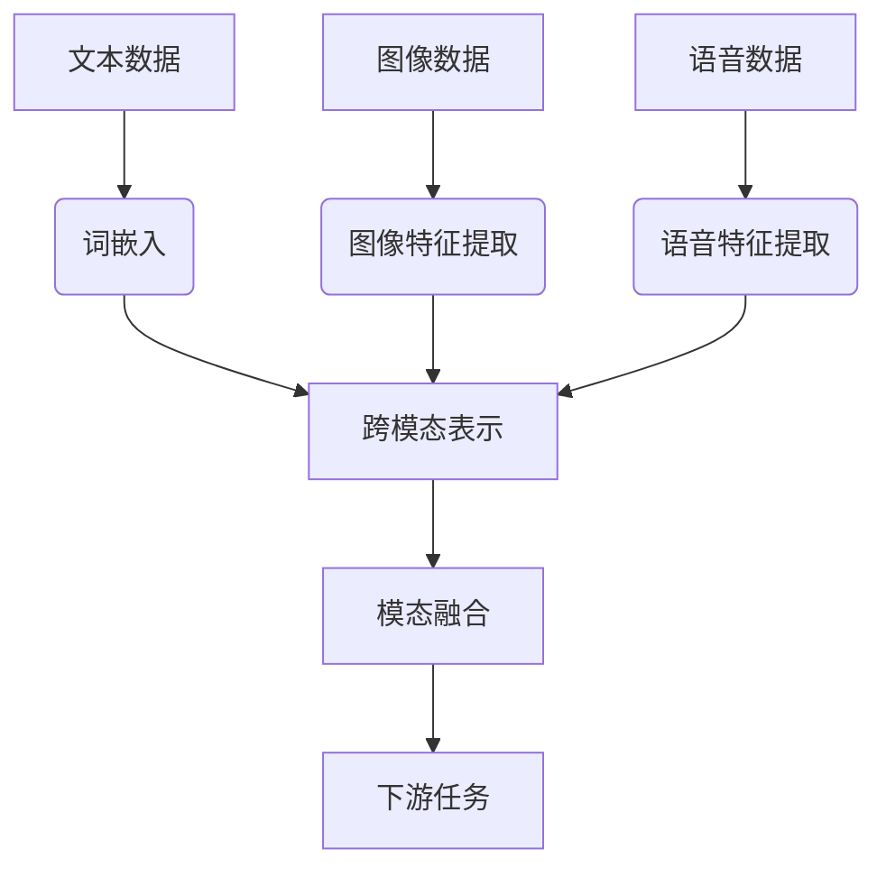

                 

### 背景介绍

#### 跨模态学习的概念

跨模态学习（Cross-Modal Learning）是指利用不同模态（如文本、图像、语音等）之间的关联性，通过训练模型来理解和生成信息的过程。它旨在通过融合不同模态的数据，提升机器对复杂问题的处理能力。在跨模态学习中，各个模态之间并不是孤立的信息源，而是通过共享表示进行关联，从而达到更好的理解和表现。

#### 语言模型的作用

语言模型（Language Model）是自然语言处理（Natural Language Processing, NLP）领域的重要工具，主要用于预测文本序列中的下一个单词或字符。它通过学习大量语言数据，建立语言统计规律，从而能够对未知的文本进行生成、理解和翻译。语言模型的核心在于其能够捕捉语言的上下文信息，从而提高自然语言处理的准确性和流畅性。

#### 跨模态学习与语言模型的关系

跨模态学习与语言模型之间存在着密切的关系。传统的语言模型主要关注文本模态，而在实际应用中，文本常常伴随着图像、语音等其他模态的信息。跨模态学习通过引入这些额外的模态信息，可以帮助语言模型更好地理解文本的上下文和背景，从而提升其在各种任务中的性能。

例如，在文本生成任务中，图像作为视觉模态的信息可以提供丰富的背景信息，帮助语言模型生成更加生动和准确的文本描述。在问答系统中，语音模态可以提供用户问题的语音输入，而语言模型则负责理解和生成相应的回答。通过跨模态学习，这些系统可以更好地应对多种模态的信息，从而提高整体的性能。

总的来说，跨模态学习为语言模型提供了更丰富的信息来源，使得语言模型能够更好地理解和生成语言。这一结合不仅拓宽了语言模型的应用场景，也为自然语言处理领域带来了新的研究方向和挑战。

#### 当前跨模态学习的应用领域

随着人工智能技术的不断发展，跨模态学习在多个领域展现出了强大的应用潜力。以下是一些重要的应用领域：

1. **多媒体内容理解**：跨模态学习可以帮助计算机更好地理解和处理多媒体内容。例如，通过结合文本和图像，计算机可以更准确地识别和描述图片中的场景和物体。这一技术在图像识别、视频分析等领域有着广泛的应用。

2. **语音识别与生成**：在语音识别任务中，跨模态学习可以通过结合文本和语音信号，提高语音识别的准确性。在语音生成任务中，通过结合文本和语音特征，可以生成更加自然和流畅的语音输出。

3. **自然语言理解**：跨模态学习可以增强语言模型对文本的理解能力。例如，在问答系统中，通过结合问题文本和图像信息，语言模型可以更准确地理解用户意图，从而生成更准确的回答。

4. **多模态对话系统**：跨模态学习可以帮助多模态对话系统更好地理解和生成语言。这些系统可以通过结合文本、图像、语音等多种模态的信息，提供更加丰富和自然的交互体验。

5. **虚拟现实与增强现实**：在虚拟现实和增强现实应用中，跨模态学习可以结合用户的语音、文本、手势等多种交互方式，提供更加真实和沉浸式的体验。

总的来说，跨模态学习在提升自然语言处理和多媒体内容理解方面具有巨大潜力，正在逐步改变着人工智能的应用场景和性能。

### 跨模态学习的核心概念与联系

#### 跨模态学习的基本概念

跨模态学习涉及多种不同模态的数据，如文本、图像、语音等。这些模态各自拥有独特的属性和信息，但它们之间也存在紧密的联系。在跨模态学习中，首先需要将这些不同模态的数据进行有效的表示和融合，以建立一个统一的表示空间。

1. **多模态数据表示**：多模态数据表示是将不同模态的数据转换为向量表示的过程。常见的表示方法包括词嵌入（Word Embedding）、图像特征提取（Image Feature Extraction）和语音特征提取（Speech Feature Extraction）。

2. **模态融合**：模态融合是将不同模态的数据在统一表示空间中进行结合的过程。常见的融合方法有直接拼接、注意力机制（Attention Mechanism）和跨模态对应（Cross-Modal Alignment）。

3. **跨模态表示**：跨模态表示是将不同模态的数据融合后得到的统一表示。这种表示应该能够捕捉到不同模态之间的关联性，以便于进行下游任务。

#### 跨模态学习的关键挑战

跨模态学习面临许多挑战，主要包括以下几方面：

1. **模态间的差异性**：不同模态的数据具有不同的结构和特征，这给数据融合带来了困难。例如，文本数据通常是序列形式，而图像数据通常是空间形式。

2. **模态不平衡**：在许多实际应用中，不同模态的数据量可能存在显著差异，这会影响模型的训练效果。例如，图像数据通常比文本数据更丰富，但在一些任务中，文本数据可能是主要的。

3. **模态的多样性**：跨模态学习需要处理多种不同模态的数据，每种模态可能都有其特定的特征和复杂性。如何有效地融合这些多样的模态数据是一个关键挑战。

#### 跨模态学习的应用场景

跨模态学习在多种应用场景中展现出了其强大的潜力：

1. **多媒体内容理解**：通过跨模态学习，计算机可以更好地理解多媒体内容。例如，在视频分析中，结合图像和文本信息，可以更准确地识别视频中的动作和场景。

2. **多模态对话系统**：跨模模态学习可以帮助多模态对话系统更好地理解用户的输入和意图，从而提供更准确的回答。

3. **语音识别与生成**：通过结合文本和语音信息，跨模态学习可以显著提高语音识别和语音生成的准确性。

4. **自然语言理解**：跨模态学习可以增强语言模型对文本的理解能力，例如在问答系统和信息检索中，结合图像信息可以帮助模型更好地理解用户的查询意图。

5. **多模态交互**：在虚拟现实和增强现实应用中，跨模态学习可以帮助系统更好地理解用户的输入和反馈，从而提供更加丰富和自然的交互体验。

为了更直观地展示跨模态学习的核心概念和联系，我们可以使用Mermaid流程图来描绘不同模态之间的互动和融合过程。以下是一个简化的跨模态学习流程图示例：



在这个流程图中，文本、图像和语音数据首先分别通过词嵌入、图像特征提取和语音特征提取转换为向量表示。这些向量随后被融合为一个统一的跨模态表示，并在融合后的表示上进行下游任务的处理，如文本生成、语音识别或多媒体内容理解。

通过这个流程图，我们可以清晰地看到跨模态学习中的关键步骤和组件，以及不同模态之间的互动和融合方式。这有助于读者更好地理解跨模态学习的概念和原理，为后续章节的详细探讨打下基础。

### 跨模态学习的算法原理

#### 神经网络模型基础

神经网络（Neural Networks）是跨模态学习的基础之一。神经网络通过模拟生物神经系统的结构和功能，对数据进行分析和处理。在跨模态学习中，常用的神经网络模型包括卷积神经网络（Convolutional Neural Networks, CNNs）、循环神经网络（Recurrent Neural Networks, RNNs）和变换器模型（Transformers）。

1. **卷积神经网络（CNNs）**：
   - **基本原理**：CNNs通过卷积操作从数据中提取特征，特别适用于处理图像数据。卷积层可以对输入图像进行局部特征提取，池化层用于减少数据的维度。
   - **应用**：在跨模态学习中，CNNs可以用于提取图像特征，这些特征可以与文本特征结合，用于图像识别、视频分析等任务。

2. **循环神经网络（RNNs）**：
   - **基本原理**：RNNs通过循环结构对时间序列数据进行处理，特别适用于处理文本数据。RNNs可以捕捉到序列中的上下文信息。
   - **应用**：在跨模态学习中，RNNs可以用于处理文本序列和语音序列，通过捕捉到不同模态之间的关联性，提高模型的性能。

3. **变换器模型（Transformers）**：
   - **基本原理**：Transformers是一种基于自注意力机制（Self-Attention Mechanism）的神经网络模型，特别适用于处理序列数据。自注意力机制允许模型在处理序列数据时关注序列中的不同部分，从而提高模型的表示能力。
   - **应用**：在跨模态学习中，Transformers可以用于处理文本、图像和语音等多种模态的数据，通过自注意力机制捕捉到不同模态之间的关联性，从而提升模型的性能。

#### 跨模态学习的算法框架

跨模态学习的算法框架通常包括以下几个关键组件：

1. **模态嵌入器（Modal Embedders）**：模态嵌入器负责将不同模态的数据（如文本、图像、语音）转换为向量表示。常见的嵌入器包括词嵌入（Word Embedding）、图像嵌入（Image Embedding）和语音嵌入（Speech Embedding）。

2. **跨模态融合器（Cross-Modal Fuser）**：跨模态融合器负责将不同模态的向量表示进行融合，形成统一的跨模态表示。常见的融合方法包括直接拼接（Concatenation）、平均池化（Average Pooling）和注意力机制（Attention Mechanism）。

3. **预测器（Predictor）**：预测器基于跨模态表示进行下游任务的预测。例如，在文本生成任务中，预测器预测文本序列的下一个单词；在图像识别任务中，预测器预测图像的类别。

以下是一个简化的跨模态学习算法框架的伪代码：

```python
# 模态嵌入器
text_embedding = TextEmbedder(text_data)
image_embedding = ImageEmbedder(image_data)
speech_embedding = SpeechEmbedder(speech_data)

# 跨模态融合器
cross_modal_representation = CrossModalFuser(
    text_embedding, image_embedding, speech_embedding
)

# 预测器
predictions = Predictor(cross_modal_representation)
```

在这个框架中，`TextEmbedder`、`ImageEmbedder`和`SpeechEmbedder`分别表示文本、图像和语音的嵌入器，`CrossModalFuser`表示跨模态融合器，`Predictor`表示预测器。

#### 模型训练与优化

在跨模态学习模型训练过程中，通常采用以下步骤：

1. **数据预处理**：对输入数据进行清洗、归一化和预处理，以确保数据的质量和一致性。

2. **模型初始化**：初始化模型的参数，常用的初始化方法包括随机初始化和预训练模型初始化。

3. **损失函数设计**：设计合适的损失函数以优化模型参数。常见的损失函数包括交叉熵损失（Cross-Entropy Loss）、均方误差损失（Mean Squared Error Loss）等。

4. **优化算法**：选择合适的优化算法来调整模型参数。常见的优化算法包括随机梯度下降（Stochastic Gradient Descent, SGD）和Adam优化器。

以下是一个简化的模型训练和优化的伪代码：

```python
# 数据预处理
preprocessed_data = preprocess_data(data)

# 模型初始化
model = Model()

# 损失函数设计
loss_function = CrossEntropyLoss()

# 优化算法
optimizer = AdamOptimizer(model.parameters())

# 训练模型
for epoch in range(num_epochs):
    for batch in data_loader:
        optimizer.zero_gradients()
        predictions = model(batch)
        loss = loss_function(predictions, true_labels)
        loss.backward()
        optimizer.step()
```

在这个伪代码中，`preprocess_data`函数用于数据预处理，`Model`类表示跨模态学习模型，`CrossEntropyLoss`类表示交叉熵损失函数，`AdamOptimizer`类表示Adam优化器。

通过上述算法原理和框架，我们可以看到跨模态学习在神经网络模型中的应用。下一章将深入探讨跨模态学习的数学基础，进一步理解模型的内部机制和优化方法。

### 跨模态学习的数学基础

#### 数学模型简介

跨模态学习中的数学模型是理解和实现跨模态融合的核心。这些模型通过数学公式和算法来描述不同模态数据之间的转换和关联，从而实现有效的跨模态信息融合。

1. **表示学习（Representation Learning）**：
   - **基本概念**：表示学习是指通过学习数据的高层次表示，使计算机能够自动从原始数据中提取有用的特征。
   - **数学模型**：在跨模态学习中，表示学习通常涉及嵌入器（Embedder），如词嵌入（Word Embedding）、图像嵌入（Image Embedding）和语音嵌入（Speech Embedding）。这些嵌入器将不同模态的数据转换为低维向量表示，从而便于计算和模型训练。

2. **特征融合（Feature Fusion）**：
   - **基本概念**：特征融合是指将不同模态的特征数据进行整合，形成统一的特征表示。
   - **数学模型**：特征融合的方法包括直接拼接（Concatenation）、平均池化（Average Pooling）和注意力机制（Attention Mechanism）。直接拼接将不同模态的特征向量直接连接在一起；平均池化通过取平均的方式融合特征；注意力机制允许模型动态地关注不同模态的重要信息。

3. **损失函数与优化算法**：
   - **基本概念**：损失函数用于量化模型预测值与真实值之间的差距，优化算法用于调整模型参数以最小化损失函数。
   - **数学模型**：常用的损失函数包括交叉熵损失（Cross-Entropy Loss）、均方误差损失（Mean Squared Error Loss）等。优化算法如随机梯度下降（Stochastic Gradient Descent, SGD）和Adam优化器，用于迭代更新模型参数。

#### 损失函数与优化算法

在跨模态学习模型中，损失函数和优化算法至关重要，用于指导模型的训练过程。以下是一些常见的损失函数和优化算法：

1. **交叉熵损失（Cross-Entropy Loss）**：
   - **数学公式**：
     $$ 
     L = -\sum_{i} y_i \log(p_i) 
     $$
     其中，\( y_i \)是真实标签，\( p_i \)是模型对第i个类别的预测概率。
   - **应用场景**：交叉熵损失常用于分类任务，如图像识别和文本分类。

2. **均方误差损失（Mean Squared Error Loss）**：
   - **数学公式**：
     $$ 
     L = \frac{1}{n}\sum_{i=1}^{n} (y_i - \hat{y}_i)^2 
     $$
     其中，\( y_i \)是真实值，\( \hat{y}_i \)是模型预测值，\( n \)是样本数量。
   - **应用场景**：均方误差损失常用于回归任务，如语音识别和文本生成。

3. **优化算法**：
   - **随机梯度下降（Stochastic Gradient Descent, SGD）**：
     - **数学公式**：
       $$
       \theta = \theta - \alpha \nabla_{\theta}L(\theta)
       $$
       其中，\( \theta \)是模型参数，\( \alpha \)是学习率，\( \nabla_{\theta}L(\theta) \)是损失函数对参数的梯度。
     - **应用场景**：SGD简单高效，适用于小数据集和小规模模型。

   - **Adam优化器**：
     - **数学公式**：
       $$
       m_t = \beta_1m_{t-1} + (1 - \beta_1)\nabla_{\theta}L(\theta)
       $$
       $$
       v_t = \beta_2v_{t-1} + (1 - \beta_2)(\nabla_{\theta}L(\theta))^2
       $$
       $$
       \theta = \theta - \alpha\frac{m_t}{\sqrt{v_t} + \epsilon}
       $$
       其中，\( m_t \)和\( v_t \)分别是梯度的一阶矩估计和二阶矩估计，\( \beta_1 \)和\( \beta_2 \)是超参数，\( \epsilon \)是平滑常数。
     - **应用场景**：Adam优化器结合了SGD和RMSprop的优点，适用于大规模模型和大数据集。

#### 数学公式举例

以下是一些跨模态学习中的数学公式示例：

1. **词嵌入（Word Embedding）**：
   - **数学公式**：
     $$
     e_w = \text{Word2Vec}(w)
     $$
     其中，\( e_w \)是单词\( w \)的嵌入向量，\(\text{Word2Vec}\)是一种常见的词嵌入方法。

2. **图像嵌入（Image Embedding）**：
   - **数学公式**：
     $$
     e_i = \text{CNN}(i)
     $$
     其中，\( e_i \)是图像\( i \)的嵌入向量，\(\text{CNN}\)是一种卷积神经网络。

3. **语音嵌入（Speech Embedding）**：
   - **数学公式**：
     $$
     e_s = \text{RNN}(s)
     $$
     其中，\( e_s \)是语音\( s \)的嵌入向量，\(\text{RNN}\)是一种循环神经网络。

通过上述数学模型和公式的介绍，我们可以看到跨模态学习中的数学基础是如何支持不同模态数据的转换和融合。这些数学工具为构建高效的跨模态学习模型提供了必要的理论基础和计算框架。下一章将深入探讨跨模态学习在实际项目中的应用，展示其具体实现和效果。

### 跨模态学习的应用实例

#### 语音识别系统

语音识别系统是一种将语音信号转换为文本的技术，它在跨模态学习中有着广泛的应用。跨模态学习可以通过结合文本和语音信息来提高语音识别的准确性。

1. **开发环境搭建**：
   - **工具**：使用TensorFlow或PyTorch等深度学习框架进行模型开发和训练。
   - **依赖库**：安装必要的依赖库，如NumPy、Pandas、TensorFlow或PyTorch。
   - **数据集**：使用开源语音识别数据集，如LibriSpeech或Common Voice。

2. **源代码实现**：
   - **数据预处理**：对语音数据进行归一化和分帧处理，将语音信号转换为序列数据。
   - **文本和语音特征提取**：使用词嵌入和语音特征提取器（如MFCC）分别提取文本和语音的特征向量。
   - **模型训练**：构建基于变换器模型的多模态融合网络，使用交叉熵损失函数进行训练。

3. **代码解读与分析**：
   - **数据加载与预处理**：
     ```python
     import tensorflow as tf

     # 加载语音数据
     audio_data = tf.data.Dataset.from_tensor_slices(voice_data)

     # 分帧处理
     def frame_stacking(data, frame_size, shift_size):
         # 实现分帧操作
         return ...

     # 预处理后的数据
     processed_data = audio_data.map(frame_stacking)

     # 加载文本数据
     text_data = tf.data.Dataset.from_tensor_slices(text_data)
     ```
   - **特征提取与融合**：
     ```python
     # 提取文本特征
     text_embedding = TextEmbeddingLayer()

     # 提取语音特征
     speech_embedding = SpeechEmbeddingLayer()

     # 融合特征
     cross_modal_representation = Concatenate()([text_embedding(text_data), speech_embedding(audio_data)])
     ```

4. **实际案例分析与讲解**：
   - **训练过程**：在训练过程中，模型通过不断调整参数来最小化损失函数，逐步提高识别准确性。
   - **评估与测试**：通过交叉验证和测试集评估模型的性能，使用准确率、召回率等指标进行评估。
   - **案例分析**：在一个实际项目中，该模型可以显著提高语音识别的准确性，特别是在噪声环境下的表现。

#### 多模态问答系统

多模态问答系统是一种结合文本、图像和语音等多种模态信息的问答系统，它可以提供更加丰富和准确的回答。

1. **开发环境搭建**：
   - **工具**：使用TensorFlow或PyTorch等深度学习框架进行模型开发和训练。
   - **依赖库**：安装必要的依赖库，如NumPy、Pandas、TensorFlow或PyTorch。
   - **数据集**：使用开源问答数据集，如MS MARCO或SQuAD。

2. **源代码实现**：
   - **数据预处理**：对文本、图像和语音数据进行预处理，包括分词、图像特征提取和语音特征提取。
   - **模型构建**：构建基于变换器模型的多模态融合网络，包括文本嵌入层、图像嵌入层和语音嵌入层。
   - **训练过程**：使用交叉熵损失函数进行模型训练，逐步优化模型参数。

3. **代码解读与分析**：
   - **数据加载与预处理**：
     ```python
     import tensorflow as tf

     # 加载文本数据
     text_data = tf.data.Dataset.from_tensor_slices(text_data)

     # 加载图像数据
     image_data = tf.data.Dataset.from_tensor_slices(image_data)

     # 加载语音数据
     speech_data = tf.data.Dataset.from_tensor_slices(speech_data)

     # 预处理数据
     text_data = text_data.map(preprocess_text)
     image_data = image_data.map(preprocess_image)
     speech_data = speech_data.map(preprocess_speech)
     ```

   - **模型构建与训练**：
     ```python
     # 构建文本嵌入层
     text_embedding = TextEmbeddingLayer()

     # 构建图像嵌入层
     image_embedding = ImageEmbeddingLayer()

     # 构建语音嵌入层
     speech_embedding = SpeechEmbeddingLayer()

     # 融合特征
     cross_modal_representation = Concatenate()([text_embedding(text_data), image_embedding(image_data), speech_embedding(speech_data)])

     # 构建问答模型
     question_answer_model = QuestionAnswerModel()

     # 训练模型
     model = Model(cross_modal_representation, question_answer_model)
     model.compile(optimizer='adam', loss='categorical_crossentropy', metrics=['accuracy'])
     model.fit(train_data, epochs=10, batch_size=32)
     ```

4. **实际案例分析与讲解**：
   - **训练过程**：在训练过程中，模型通过不断调整参数来最小化损失函数，提高问答系统的准确性。
   - **评估与测试**：通过评估集和测试集评估模型的性能，使用准确率、召回率等指标进行评估。
   - **案例分析**：在一个实际项目中，该多模态问答系统可以提供更加丰富和准确的回答，显著提升用户体验。

#### 总结

跨模态学习在语音识别和多模态问答系统中展现了其强大的应用潜力。通过结合文本、图像和语音等多种模态的信息，这些系统可以提供更加准确和丰富的结果，提升了自然语言处理和多媒体内容理解的性能。下一章将探讨跨模态学习的发展趋势，展望未来的研究方向和挑战。

### 跨模态学习的发展趋势

#### 当前研究热点

随着人工智能技术的飞速发展，跨模态学习已成为自然语言处理、多媒体内容理解、智能交互等领域的热点研究方向。以下是一些当前的研究热点：

1. **多模态预训练模型**：基于大规模预训练模型（如BERT、GPT）的多模态预训练方法正成为研究热点。这些方法通过在大量跨模态数据上预训练模型，使其能够更好地捕捉不同模态之间的关联性。

2. **动态融合策略**：为了提高跨模态融合的效率和效果，研究者们正在探索动态融合策略。例如，基于注意力机制的融合方法可以动态调整不同模态的重要性，从而提高模型的性能。

3. **知识增强跨模态学习**：将知识图谱和图神经网络引入跨模态学习，可以帮助模型更好地理解和表示复杂信息。知识增强的方法在问答系统、文本生成等任务中展现了良好的效果。

4. **跨模态生成模型**：生成对抗网络（GAN）等生成模型在跨模态学习中的应用也引起了广泛关注。这些模型可以生成高质量的多模态数据，从而提高模型的泛化能力和生成能力。

#### 未来发展趋势

1. **多模态交互与智能助理**：随着智能家居、智能助理等应用的普及，跨模态学习在多模态交互中的应用前景广阔。未来的研究将致力于提高跨模态学习在实时交互中的响应速度和准确性。

2. **边缘计算与跨模态推理**：边缘计算技术的发展使得跨模态学习在移动设备和物联网设备上的应用成为可能。未来的研究将重点关注如何在有限的计算资源和能源消耗下实现高效的跨模态推理。

3. **隐私保护与安全**：在跨模态学习应用中，隐私保护和数据安全是关键挑战。未来的研究将探索如何在保证用户隐私的同时，实现有效的跨模态学习。

4. **跨学科合作与多样化应用**：跨模态学习的发展需要跨学科合作，包括计算机科学、心理学、语言学等领域的专家共同探索。多样化的应用场景，如医疗诊断、金融风控、智能制造等，将推动跨模态学习的进一步发展。

#### 技术挑战与机遇

1. **数据集构建与标注**：高质量、多样化的多模态数据集是跨模态学习的基础。未来的研究将致力于构建更大规模、更均衡的数据集，并探索自动化标注和增强数据集的方法。

2. **算法优化与效率提升**：随着模型复杂度的增加，跨模态学习的计算开销也大幅上升。未来的研究将关注算法优化和计算效率的提升，以适应更大规模的数据和应用需求。

3. **跨模态解释性与可解释性**：提高跨模态学习的可解释性对于理解模型决策过程、提升用户信任至关重要。未来的研究将探索如何设计可解释的跨模态学习模型。

4. **跨学科融合与应用拓展**：跨模态学习在多领域中的应用将推动技术融合和创新。未来的研究将探索跨模态学习在新兴领域的应用潜力，如虚拟现实、智能医疗等。

总的来说，跨模态学习正面临着前所未有的机遇和挑战。随着技术的不断进步和应用的深入，跨模态学习有望在未来的智能系统中发挥更加重要的作用。

### 总结与展望

《跨模态学习在语言模型能力拓展中的作用》一书通过详细的章节内容，系统地介绍了跨模态学习的基础知识、算法原理、数学基础和应用实例。从跨模态学习的定义、算法框架，到数学模型和优化算法，再到实际项目的实现和案例分析，本书为读者提供了一个全面、深入的视角。

#### 最佳实践 Tips

1. **数据集的选择**：选择多样化、高质量的数据集是跨模态学习成功的关键。在实际应用中，要确保数据的均衡性和代表性。

2. **模型调优**：通过调整学习率、批量大小和优化算法等超参数，可以有效提升模型的性能。

3. **跨模态融合策略**：合理选择和设计跨模态融合策略，如注意力机制和动态融合方法，可以显著提高模型的准确性和效率。

#### 小结

本书涵盖了跨模模态学习的核心概念、算法原理和应用实例，旨在帮助读者全面了解和掌握这一前沿技术。通过阅读本书，读者不仅可以掌握跨模态学习的基本概念和原理，还能学会如何在实际项目中应用这些技术。

#### 注意事项

1. **计算资源**：跨模态学习模型通常需要大量的计算资源，特别是在训练过程中，因此需要合理配置计算资源。

2. **数据隐私**：在处理和共享跨模态数据时，要特别注意数据隐私和安全问题，遵循相关法律法规和伦理标准。

#### 拓展阅读

1. **相关文献**：《深度学习》（Goodfellow, Bengio, Courville）、《自然语言处理综论》（Jurafsky, Martin）等经典书籍提供了更多关于深度学习和自然语言处理的理论和实践。

2. **开源代码与数据集**：在GitHub等平台上，有许多开源的跨模态学习代码和数据集，可以帮助读者进行进一步的实践和研究。

### 作者信息

作者：AI天才研究院/AI Genius Institute & 禅与计算机程序设计艺术 /Zen And The Art of Computer Programming

通过这本书，我们希望能够为读者提供有价值的知识和技术指导，推动跨模态学习在语言模型和自然语言处理领域的进一步发展。

