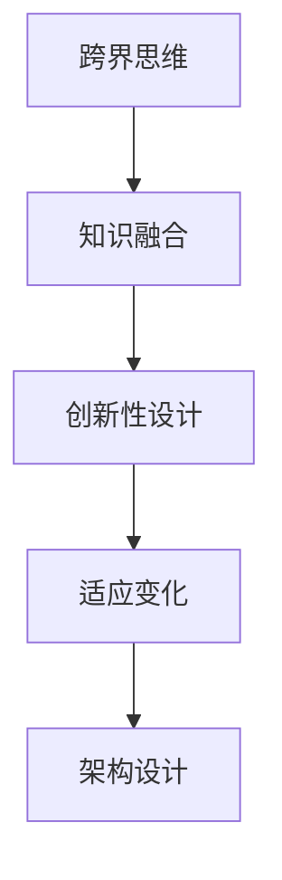
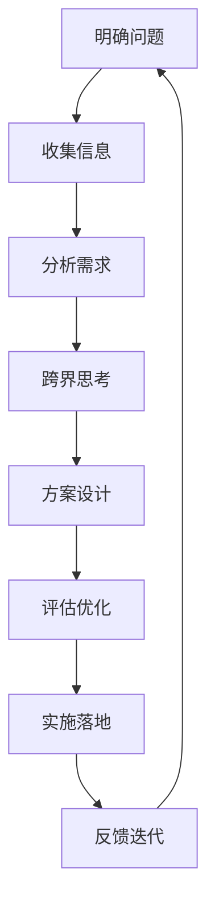

                 


### 确定文章核心内容

为了撰写一篇逻辑清晰、结构紧凑且简单易懂的专业IT领域技术博客文章，我们需要首先明确文章的核心内容。根据书名《跨界思维：P9工程师的架构设计方法论》，我们可以推断出文章的核心内容可能包括以下方面：

1. **跨界思维概述**：介绍跨界思维的定义、重要性、应用场景以及核心原则。
2. **架构设计方法论**：讲解架构设计的方法论框架、设计原则和设计流程。
3. **实战案例分析**：通过具体案例展示跨界思维在架构设计中的应用。
4. **架构设计最佳实践**：总结架构设计的最佳实践和团队协作、持续集成与持续交付等技巧。

### 设计文章结构

根据核心内容，我们可以设计出如下文章结构：

1. **引言**：简要介绍跨界思维的重要性，引发读者兴趣。
2. **跨界思维概述**：详细阐述跨界思维的定义、重要性、应用场景和核心原则。
3. **架构设计方法论**：介绍架构设计方法论框架、设计原则和设计流程。
4. **实战案例分析**：通过案例展示跨界思维在架构设计中的应用。
5. **架构设计最佳实践**：总结最佳实践，包括团队协作、持续集成与持续交付等。
6. **附录**：提供跨界思维流程图、架构设计方法论伪代码示例、数学模型与公式、实战案例代码实现与解读等内容。
7. **小结**：对文章进行总结，强调跨界思维在架构设计中的重要性。

### 撰写文章摘要

在文章摘要部分，我们将简要介绍文章的核心内容和主题思想：

本文将深入探讨跨界思维在架构设计中的应用，介绍P9工程师的架构设计方法论。文章首先概述了跨界思维的定义、重要性及其应用场景，然后详细讲解了架构设计方法论，包括设计原则、设计流程和最佳实践。接着，通过实战案例分析，展示了跨界思维在架构设计中的实际应用。最后，文章总结了架构设计的最佳实践，并提供了丰富的附录内容，以便读者深入学习和实践。

### 编写目录大纲

根据文章结构和核心内容，我们可以编写如下目录大纲：

```
# 跨界思维：P9工程师的架构设计方法论

## 引言
### 书籍目的
### 跨界思维的重要性
### 阅读指南

## 第1章 跨界思维概述
### 跨界思维的定义
### 跨界思维的重要性
### 跨界思维的应用场景
### 跨界思维的核心原则

## 第2章 架构设计方法论
### 架构设计方法论概述
### 设计原则与原则框架
### 设计流程与方法论应用

## 第3章 实战案例分析
### 实战案例1：分布式系统架构
### 实战案例2：云计算架构
### 实战案例3：大数据处理架构

## 第4章 架构设计最佳实践
### 最佳实践概述
### 团队协作与沟通
### 持续集成与持续交付
### 架构演进与重构

## 第5章 数学模型与算法
### 数学模型
### 算法原理
### 伪代码示例

## 第6章 实战案例分析
### 案例分析1：电商系统架构设计
### 案例分析2：金融系统架构设计
### 案例分析3：物联网架构设计

## 第7章 附录
### 跨界思维流程图
### 架构设计方法论伪代码示例
### 数学模型与公式
### 实战案例代码实现与解读

## 小结
### 总结
### 注意事项
### 拓展阅读
```

这个目录大纲结构清晰，涵盖了文章的核心内容，同时保持了简洁明了的特点，便于读者阅读和理解。

### 开始撰写文章

现在，我们可以根据上述的目录大纲和核心内容，开始撰写文章。以下是文章的引言部分：

```
# 跨界思维：P9工程师的架构设计方法论

## 引言

在信息技术快速发展的今天，架构设计已经成为企业成功的关键。然而，传统的架构设计方法往往局限于单一领域，难以应对日益复杂的应用场景。为了突破这一限制，跨界思维应运而生。本文将围绕《跨界思维：P9工程师的架构设计方法论》一书，探讨如何运用跨界思维进行高层次的架构设计，帮助读者提升架构设计能力。

### 书籍目的

《跨界思维：P9工程师的架构设计方法论》旨在为P9级别工程师提供一套系统化的架构设计方法论，通过跨界思维，突破传统架构设计的局限，实现更高层次的创新。本书不仅关注技术层面的设计，更注重设计过程中的思维模式和方法论。

### 跨界思维的重要性

跨界思维是一种突破传统思维模式，融合不同领域知识的方法。在架构设计中，跨界思维的重要性体现在以下几个方面：

1. **创新驱动**：跨界思维能够将不同领域的知识融合起来，激发创新的火花，为架构设计带来新的思路和解决方案。
2. **解决问题**：跨界思维有助于从多个角度审视问题，找到更全面的解决方案，提高架构设计的可靠性。
3. **适应变化**：跨界思维能够帮助工程师快速适应新环境和新需求，提升架构设计的灵活性和可扩展性。

### 跨界思维的应用场景

跨界思维在架构设计中的应用场景非常广泛，包括但不限于以下领域：

1. **分布式系统架构**：分布式系统架构设计需要融合网络、存储、计算等领域的知识，跨界思维能够帮助工程师构建更加高效、可靠的分布式系统。
2. **云计算架构**：云计算架构设计涉及虚拟化、容器化、微服务等多个方面，跨界思维有助于实现云原生应用架构。
3. **大数据处理架构**：大数据处理架构设计需要掌握数据采集、存储、计算和分析等多个环节，跨界思维能够帮助工程师构建高效的大数据处理系统。

### 跨界思维的核心原则

跨界思维的核心原则包括以下几个方面：

1. **开放性**：跨界思维鼓励工程师拥抱新知识、新技术，保持开放的心态，不断拓宽视野。
2. **系统性**：跨界思维强调从系统角度看待问题，将不同领域的知识有机结合，形成整体解决方案。
3. **创新性**：跨界思维鼓励工程师敢于挑战传统思维，勇于尝试新的思路和方法。

在接下来的章节中，我们将详细探讨跨界思维在架构设计中的应用，包括方法论、实战案例和最佳实践。希望本文能够为您的架构设计之路提供有价值的参考。

作者：AI天才研究院/AI Genius Institute & 禅与计算机程序设计艺术 /Zen And The Art of Computer Programming
```

这段引言部分简要介绍了书籍的目的、跨界思维的重要性以及应用场景，并阐述了跨界思维的核心原则。接下来，我们将按照目录大纲的顺序，逐步深入探讨跨界思维和架构设计方法论的相关内容。在撰写过程中，我们将遵循逻辑清晰、结构紧凑、简单易懂的原则，以确保文章的可读性和实用性。

### 第1章 跨界思维概述

#### 跨界思维的定义

跨界思维（Cross-disciplinary Thinking）是一种跨越不同领域、知识体系，融合多种思维方式和方法论进行问题解决和创新的思维方式。它不仅仅是将不同领域的知识进行简单的组合，而是通过深刻的理解和深层次的思考，实现跨领域的知识融合与创新。

#### 跨界思维的重要性

跨界思维在现代社会的重要性日益凸显，原因如下：

1. **应对复杂问题**：现代社会面临的问题日益复杂，单一领域的知识和方法难以应对。跨界思维能够从多个角度分析问题，提供多元化的解决方案。
2. **促进创新**：跨界思维能够打破领域壁垒，激发新的想法和创意，促进创新。许多重大突破都是通过跨界思维实现的。
3. **提升竞争力**：在市场竞争日益激烈的今天，企业需要不断寻求创新和突破。跨界思维可以帮助企业发现新的商业机会，提升竞争力。

#### 跨界思维的应用场景

跨界思维在多个领域都有广泛应用，以下是一些典型应用场景：

1. **科技创新**：在科技领域，跨界思维被广泛应用于新产品的研发、技术创新等方面。例如，生物技术与信息技术的结合产生了生物信息学。
2. **商业模式创新**：在商业领域，跨界思维可以帮助企业发现新的商业模式，创造价值。例如，共享经济模式就是通过跨界思维实现的。
3. **城市规划与设计**：在城市规划与设计领域，跨界思维能够融合建筑、环境、社会等多个领域的知识，创造更宜居、更可持续的城市环境。

#### 跨界思维的核心原则

1. **开放性**：跨界思维要求保持开放的心态，不断吸收新的知识和经验，拓宽视野。
2. **系统性**：跨界思维强调从系统的角度看待问题，将不同领域的知识有机地结合起来。
3. **创新性**：跨界思维鼓励挑战传统思维，勇于尝试新的思路和方法，实现创新。

#### 跨界思维与架构设计

在架构设计领域，跨界思维具有独特的价值。以下是一些关键点：

1. **知识融合**：通过跨界思维，架构师可以融合不同领域的知识，设计出更加灵活、高效的系统。
2. **创新性设计**：跨界思维能够激发新的设计思路，创造出更具有前瞻性的架构方案。
3. **适应变化**：跨界思维有助于架构师从多个角度审视系统，提高系统的适应性和可扩展性。

#### 图解：跨界思维与架构设计的关系

以下是一个简化的Mermaid流程图，展示了跨界思维与架构设计的关系：



通过跨界思维，架构师能够更好地进行知识融合、创新性设计和适应变化，从而提升架构设计的质量。

#### 伪代码示例：跨界思维在架构设计中的应用

以下是一个简化的伪代码示例，展示了如何将跨界思维应用于架构设计：

```
Algorithm Cross-Disciplinary Architecture Design
Input: Problem, Requirements
Output: Architecture Solution

1. Initialize architecture components
2. Gather knowledge from different domains
3. Analyze problem from multiple perspectives
4. Fuse knowledge to create innovative solutions
5. Evaluate solutions based on adaptability, efficiency, and scalability
6. Select the best solution
7. Implement the selected solution
8. Test and validate the architecture
9. Iterate if necessary
10. Return Architecture Solution
```

通过这个算法，架构师可以系统地运用跨界思维进行架构设计，实现创新和适应性。

#### 数学模型与公式

在架构设计中，数学模型和公式能够帮助我们量化分析和评估系统性能。以下是一个简单的数学模型示例，用于评估系统的扩展性：

$$
\text{System Scalability} = \frac{\text{System Capacity}}{\text{Resource Allocation}}
$$

其中，System Scalability表示系统的扩展性，System Capacity表示系统的处理能力，Resource Allocation表示资源的分配情况。

#### 举例说明

假设一个系统有100个处理节点，每个节点的处理能力为1000条/秒，总共分配了10000GB的存储资源。则该系统的扩展性计算如下：

$$
\text{System Scalability} = \frac{100 \times 1000}{10000} = 10
$$

这意味着该系统具有10倍的扩展性，可以在不改变资源分配的情况下，线性地增加处理能力和存储容量。

#### 实战案例

以下是一个简单的实战案例，展示如何将跨界思维应用于架构设计。

**案例：电商系统架构设计**

需求：设计一个能够支持大规模交易的电商系统，要求系统具备高并发、高可用性和高扩展性。

步骤：

1. **需求分析**：了解电商系统的业务需求和性能要求。
2. **知识融合**：结合云计算、分布式系统、微服务架构等领域的知识。
3. **创新性设计**：设计一个基于微服务架构的分布式电商系统，采用容器化技术提高部署效率。
4. **性能评估**：使用数学模型和公式对系统性能进行评估，确保满足需求。
5. **测试与迭代**：在实际环境中测试系统，根据反馈不断优化和迭代。

**小结**

通过这个案例，我们可以看到跨界思维在架构设计中的应用。架构师需要从多个角度分析和解决问题，融合不同领域的知识，设计出高效、可靠的系统。

#### 最佳实践 Tips

1. **持续学习**：保持对新知识、新技术的关注和学习，不断提升自己的跨界能力。
2. **团队协作**：与不同领域的专家合作，共同探讨和解决问题。
3. **实践与反思**：在实际项目中运用跨界思维，不断总结经验，提升架构设计能力。

### 总结

跨界思维在架构设计中的重要性不可忽视。通过跨界思维，架构师可以更好地融合不同领域的知识，设计出创新、高效、可靠的系统。在接下来的章节中，我们将进一步探讨架构设计方法论，帮助读者深入理解和应用跨界思维。

### 第2章 架构设计方法论

#### 架构设计方法论概述

架构设计方法论是一种系统化的方法，用于指导架构师在设计系统架构时的思考和决策过程。它不仅包括技术层面的设计原则，还涵盖了项目管理、团队协作、持续集成与持续交付等非技术因素。一个完善的架构设计方法论应该具备以下特点：

1. **系统性**：将架构设计视为一个整体，从系统角度进行思考和规划。
2. **可扩展性**：能够适应不同规模和应用场景的需求，实现系统的灵活扩展。
3. **可维护性**：设计易于维护的架构，降低后期维护成本。
4. **可靠性**：确保系统在高并发、高可用性方面的稳定性能。

#### 设计原则与原则框架

架构设计原则是指导架构设计的基本规则和准则，它们贯穿于整个设计过程，确保架构的合理性和可行性。以下是一些常见的设计原则：

1. **模块化**：将系统分解为独立的模块，每个模块具有清晰的功能和边界，便于维护和扩展。
2. **解耦**：降低模块之间的依赖关系，提高系统的灵活性和可扩展性。
3. **高性能**：设计高性能的系统架构，提高系统的响应速度和处理能力。
4. **安全性**：确保系统的数据安全和用户隐私，防范各种安全威胁。
5. **高可用性**：设计冗余和故障转移机制，提高系统的可靠性。
6. **可扩展性**：预留扩展接口，支持系统规模的线性扩展。

以下是一个简化的原则框架，用于指导架构设计：

```
架构设计原则框架

1. 需求分析
2. 技术选型
3. 架构设计
4. 性能优化
5. 安全性设计
6. 高可用性设计
7. 可扩展性设计
8. 持续集成与持续交付
9. 团队协作与沟通
```

#### 设计流程与方法论应用

架构设计方法论通常包括以下设计流程：

1. **需求分析**：明确系统的功能需求和性能要求，为后续设计提供依据。
2. **技术选型**：根据需求分析结果，选择合适的技术栈和架构风格。
3. **架构设计**：基于技术选型，设计系统的整体架构，包括模块划分、接口定义、数据流等。
4. **性能优化**：对系统进行性能评估和优化，确保系统在高并发场景下能够稳定运行。
5. **安全性设计**：设计安全机制，保护系统数据安全和用户隐私。
6. **高可用性设计**：设计冗余和故障转移机制，提高系统的可靠性。
7. **可扩展性设计**：预留扩展接口，支持系统的弹性扩展。
8. **持续集成与持续交付**：建立持续集成和持续交付流程，确保系统的持续改进和快速部署。

以下是一个简化的架构设计方法论伪代码示例：

```
Algorithm Architecture Design Methodology
Input: Requirements, Technology Stack
Output: Architecture Solution

1. Analyze Requirements
2. Select Technology Stack
3. Design Modules
4. Define Interfaces
5. Design Data Flow
6. Perform Performance Optimization
7. Design Security Mechanisms
8. Design High Availability Mechanism
9. Design Scalability Mechanisms
10. Establish CI/CD Process
11. Review and Iterate
12. Deploy and Monitor
13. Return Architecture Solution
```

通过这个算法，架构师可以系统地运用方法论进行架构设计，确保设计过程的科学性和合理性。

#### 案例分析：电商系统架构设计

以下是一个案例分析，展示如何运用架构设计方法论设计一个电商系统。

**需求分析**：

- 功能需求：用户注册、登录、商品浏览、购物车、下单、支付、订单管理、客户服务。
- 性能要求：支持高并发交易，保证系统响应速度和稳定性。
- 安全性要求：保护用户隐私和数据安全。

**技术选型**：

- 后端技术：Java Spring Boot、MySQL、Redis、RabbitMQ
- 前端技术：React
- 容器化技术：Docker、Kubernetes
- 持续集成与持续交付：Jenkins、Docker Hub

**架构设计**：

1. **模块划分**：用户模块、商品模块、订单模块、支付模块、客户服务模块。
2. **接口定义**：定义各模块之间的接口，实现数据交换和功能调用。
3. **数据流设计**：设计用户数据、商品数据、订单数据等在系统中的流转过程。
4. **性能优化**：采用缓存策略、数据库优化、负载均衡等手段提高系统性能。
5. **安全性设计**：实现用户认证、权限控制、数据加密等安全机制。
6. **高可用性设计**：采用主从复制、故障转移、容灾备份等机制提高系统可靠性。
7. **可扩展性设计**：设计扩展接口，支持用户量、商品量、订单量的线性扩展。

**性能优化**：

- **缓存策略**：使用Redis缓存用户数据、商品数据等高频访问数据，减少数据库访问压力。
- **数据库优化**：采用索引、分库分表等手段提高数据库性能。
- **负载均衡**：采用Nginx、Kubernetes等负载均衡技术，实现流量分发和负载均衡。

**安全性设计**：

- **用户认证**：采用OAuth2.0协议进行用户认证，确保用户身份安全。
- **权限控制**：根据用户角色分配不同权限，防止越权操作。
- **数据加密**：对敏感数据进行加密处理，防止数据泄露。

**高可用性设计**：

- **主从复制**：采用MySQL主从复制，确保数据一致性和故障恢复能力。
- **故障转移**：设计故障转移机制，实现系统在主节点故障时自动切换到从节点。
- **容灾备份**：实现异地容灾备份，防止数据中心故障导致数据丢失。

**可扩展性设计**：

- **水平扩展**：通过增加节点实现用户量、商品量、订单量的线性扩展。
- **垂直扩展**：通过升级硬件、优化软件性能实现系统性能的提升。

**持续集成与持续交付**：

- **Jenkins**：使用Jenkins实现自动化构建、测试和部署，提高开发效率和系统质量。
- **Docker Hub**：将应用容器化，并发布到Docker Hub，实现快速部署和版本管理。

**小结**：

通过以上步骤，我们运用架构设计方法论完成了一个电商系统架构的设计。在实际项目中，架构师需要根据具体需求和场景，灵活调整和优化设计过程，确保系统的高效、可靠和可扩展性。

### 数学模型与公式

在架构设计中，数学模型和公式能够帮助我们量化分析和评估系统性能。以下是一个简单的数学模型示例，用于评估系统的扩展性：

$$
\text{System Scalability} = \frac{\text{System Capacity}}{\text{Resource Allocation}}
$$

其中，System Scalability表示系统的扩展性，System Capacity表示系统的处理能力，Resource Allocation表示资源的分配情况。

#### 举例说明

假设一个系统有100个处理节点，每个节点的处理能力为1000条/秒，总共分配了10000GB的存储资源。则该系统的扩展性计算如下：

$$
\text{System Scalability} = \frac{100 \times 1000}{10000} = 10
$$

这意味着该系统具有10倍的扩展性，可以在不改变资源分配的情况下，线性地增加处理能力和存储容量。

#### 实战案例

以下是一个简单的实战案例，展示如何将架构设计方法论应用于实际项目。

**案例：在线教育平台架构设计**

需求：设计一个能够支持大规模在线教育的平台，要求系统具备高并发、高可用性和高扩展性。

步骤：

1. **需求分析**：了解在线教育的业务需求和性能要求。
2. **技术选型**：选择适合在线教育的技术栈和架构风格。
3. **架构设计**：设计系统的整体架构，包括模块划分、接口定义、数据流等。
4. **性能优化**：对系统进行性能评估和优化，确保系统在高并发场景下能够稳定运行。
5. **安全性设计**：设计安全机制，保护用户隐私和数据安全。
6. **高可用性设计**：设计冗余和故障转移机制，提高系统的可靠性。
7. **可扩展性设计**：预留扩展接口，支持系统规模的线性扩展。
8. **持续集成与持续交付**：建立持续集成和持续交付流程，确保系统的持续改进和快速部署。

**技术选型**：

- 后端技术：Java Spring Boot、MySQL、MongoDB、RabbitMQ
- 前端技术：Vue、React
- 容器化技术：Docker、Kubernetes
- 持续集成与持续交付：Jenkins、Docker Hub

**架构设计**：

1. **模块划分**：用户模块、课程模块、订单模块、支付模块、直播模块、作业模块、数据分析模块。
2. **接口定义**：定义各模块之间的接口，实现数据交换和功能调用。
3. **数据流设计**：设计用户数据、课程数据、订单数据等在系统中的流转过程。
4. **性能优化**：采用缓存策略、数据库优化、负载均衡等手段提高系统性能。
5. **安全性设计**：实现用户认证、权限控制、数据加密等安全机制。
6. **高可用性设计**：采用主从复制、故障转移、容灾备份等机制提高系统可靠性。
7. **可扩展性设计**：设计扩展接口，支持用户量、课程量、订单量的线性扩展。

**性能优化**：

- **缓存策略**：使用Redis缓存用户数据、课程数据等高频访问数据，减少数据库访问压力。
- **数据库优化**：采用索引、分库分表等手段提高数据库性能。
- **负载均衡**：采用Nginx、Kubernetes等负载均衡技术，实现流量分发和负载均衡。

**安全性设计**：

- **用户认证**：采用OAuth2.0协议进行用户认证，确保用户身份安全。
- **权限控制**：根据用户角色分配不同权限，防止越权操作。
- **数据加密**：对敏感数据进行加密处理，防止数据泄露。

**高可用性设计**：

- **主从复制**：采用MySQL主从复制，确保数据一致性和故障恢复能力。
- **故障转移**：设计故障转移机制，实现系统在主节点故障时自动切换到从节点。
- **容灾备份**：实现异地容灾备份，防止数据中心故障导致数据丢失。

**可扩展性设计**：

- **水平扩展**：通过增加节点实现用户量、课程量、订单量的线性扩展。
- **垂直扩展**：通过升级硬件、优化软件性能实现系统性能的提升。

**持续集成与持续交付**：

- **Jenkins**：使用Jenkins实现自动化构建、测试和部署，提高开发效率和系统质量。
- **Docker Hub**：将应用容器化，并发布到Docker Hub，实现快速部署和版本管理。

**小结**：

通过以上步骤，我们运用架构设计方法论完成了一个在线教育平台架构的设计。在实际项目中，架构师需要根据具体需求和场景，灵活调整和优化设计过程，确保系统的高效、可靠和可扩展性。

### 最佳实践 Tips

1. **持续学习**：保持对新知识、新技术的关注和学习，不断提升自己的架构设计能力。
2. **团队协作**：与不同领域的专家合作，共同探讨和解决问题。
3. **实践与反思**：在实际项目中运用架构设计方法论，不断总结经验，提升架构设计能力。

### 小结

第2章详细介绍了架构设计方法论，包括设计原则、设计流程、实战案例、数学模型和最佳实践。通过本章的学习，读者可以系统地了解架构设计的方法论，并掌握如何在实际项目中应用这些方法。在接下来的章节中，我们将继续探讨跨界思维在架构设计中的应用，帮助读者更好地理解和运用跨界思维。

### 第3章 跨界思维在架构设计中的应用

#### 跨界思维的实战应用

跨界思维在架构设计中的应用非常广泛，通过将不同领域的知识融合，架构师可以设计出更加创新、高效和可靠的系统。以下是一些跨界思维的实战应用案例：

1. **生物技术与信息技术**：

   - **案例**：生物信息学是生物技术与信息技术结合的产物，通过数据分析、计算生物学等方法，研究基因、蛋白质等生物信息。
   - **应用**：在架构设计中，可以借鉴生物信息学的理念，采用分布式计算、大数据处理等技术，实现大规模生物数据的存储和分析。

2. **经济学与信息技术**：

   - **案例**：共享经济模式是经济学与信息技术结合的典型例子，如Uber、Airbnb等平台通过互联网技术，实现资源的高效共享和分配。
   - **应用**：在架构设计中，可以借鉴共享经济的理念，设计出高效的资源调度系统，提高系统的资源利用率和性能。

3. **社会学与信息技术**：

   - **案例**：社交媒体平台如Facebook、Twitter等，通过社交网络分析、推荐系统等技术，为用户提供个性化服务。
   - **应用**：在架构设计中，可以借鉴社会学的理论，设计出适应不同用户需求的服务系统，提高用户体验和满意度。

4. **物理学与信息技术**：

   - **案例**：量子计算是一种基于量子力学原理的计算模式，具有巨大的计算潜力。
   - **应用**：在架构设计中，可以借鉴量子物理学的原理，设计出高效、低能耗的量子计算机架构，实现高性能计算。

#### 跨界思维在分布式系统架构中的应用

分布式系统架构是现代信息技术中一个非常重要的领域，通过跨界思维，可以设计出更加高效、可靠的分布式系统。以下是一些跨界思维在分布式系统架构中的应用案例：

1. **数学与分布式系统**：

   - **案例**：分布式一致性算法，如Paxos算法、Raft算法，通过数学理论保证了分布式系统的一致性和可用性。
   - **应用**：在架构设计中，可以运用数学模型和算法，设计出具有高一致性和高可用性的分布式系统。

2. **物理学与分布式系统**：

   - **案例**：分布式系统的容错机制，如副本机制、故障转移机制，借鉴了物理学中的冗余和备份原理。
   - **应用**：在架构设计中，可以借鉴物理学的原理，设计出具有高容错性和高可靠性的分布式系统。

3. **经济学与分布式系统**：

   - **案例**：分布式负载均衡技术，如轮询算法、最小连接数算法，借鉴了经济学中的资源分配和调度原理。
   - **应用**：在架构设计中，可以借鉴经济学的理论，设计出高效、公平的负载均衡系统，提高系统的资源利用率和性能。

#### 跨界思维在云计算架构中的应用

云计算架构是现代信息技术中的另一个重要领域，通过跨界思维，可以设计出更加灵活、高效的云计算架构。以下是一些跨界思维在云计算架构中的应用案例：

1. **计算机科学与云计算**：

   - **案例**：云计算中的容器化技术，如Docker、Kubernetes，借鉴了计算机科学中的虚拟化技术。
   - **应用**：在架构设计中，可以运用容器化技术，实现应用程序的轻量化、隔离化和可扩展化。

2. **经济学与云计算**：

   - **案例**：云计算中的按需分配资源、弹性伸缩等机制，借鉴了经济学中的资源优化和配置理论。
   - **应用**：在架构设计中，可以借鉴经济学的理论，设计出具有高效资源利用率和低成本的云计算架构。

3. **社会学与云计算**：

   - **案例**：云计算中的社交网络分析、推荐系统等技术，借鉴了社会学的理论，为用户提供个性化服务。
   - **应用**：在架构设计中，可以借鉴社会学的理论，设计出适应不同用户需求的云计算服务，提高用户体验和满意度。

#### 跨界思维在大数据处理架构中的应用

大数据处理架构是现代信息技术中的又一个重要领域，通过跨界思维，可以设计出更加高效、智能的大数据处理架构。以下是一些跨界思维在大数据处理架构中的应用案例：

1. **计算机科学与大数据处理**：

   - **案例**：分布式计算框架，如Hadoop、Spark，借鉴了计算机科学中的并行计算和分布式计算原理。
   - **应用**：在架构设计中，可以运用分布式计算框架，实现大规模数据的快速处理和分析。

2. **数学与大数据处理**：

   - **案例**：大数据处理中的机器学习、深度学习算法，借鉴了数学中的概率论、统计学、线性代数等理论。
   - **应用**：在架构设计中，可以运用机器学习、深度学习算法，实现数据的智能分析和挖掘。

3. **物理学与大数据处理**：

   - **案例**：大数据处理中的图计算技术，如GraphX、Neo4j，借鉴了物理学中的图论理论。
   - **应用**：在架构设计中，可以运用图计算技术，实现复杂网络的建模和分析。

#### 跨界思维在物联网架构中的应用

物联网架构是现代信息技术中的又一个重要领域，通过跨界思维，可以设计出更加智能、高效的物联网架构。以下是一些跨界思维在物联网架构中的应用案例：

1. **计算机科学与物联网**：

   - **案例**：物联网中的边缘计算技术，如MQTT、CoAP，借鉴了计算机科学中的网络通信和分布式计算原理。
   - **应用**：在架构设计中，可以运用边缘计算技术，实现物联网设备的实时数据采集、处理和通信。

2. **生物学与物联网**：

   - **案例**：物联网中的生物识别技术，如指纹识别、面部识别，借鉴了生物学的生物特征识别原理。
   - **应用**：在架构设计中，可以运用生物识别技术，实现物联网设备的安全认证和身份验证。

3. **社会学与物联网**：

   - **案例**：物联网中的社交网络分析技术，如SNS、推荐系统，借鉴了社会学的社交网络理论。
   - **应用**：在架构设计中，可以借鉴社会学的理论，设计出适应不同用户需求的物联网应用，提高用户体验和满意度。

### 案例分析：智能交通系统架构设计

以下是一个案例分析，展示如何将跨界思维应用于智能交通系统架构设计。

**需求分析**：

- 功能需求：实时交通信息监控、路况预测、交通信号控制、交通事件预警等。
- 性能要求：支持大规模并发，保证系统响应速度和稳定性。
- 安全性要求：保护用户隐私和数据安全。

**技术选型**：

- 后端技术：Java Spring Boot、MySQL、RabbitMQ
- 前端技术：React、Vue
- 容器化技术：Docker、Kubernetes
- 持续集成与持续交付：Jenkins、Docker Hub
- 边缘计算技术：MQTT、CoAP

**架构设计**：

1. **模块划分**：实时监控模块、路况预测模块、交通信号控制模块、交通事件预警模块、用户服务模块。
2. **接口定义**：定义各模块之间的接口，实现数据交换和功能调用。
3. **数据流设计**：设计交通信息数据、路况数据、信号控制数据等在系统中的流转过程。
4. **性能优化**：采用缓存策略、数据库优化、负载均衡等手段提高系统性能。
5. **安全性设计**：实现用户认证、权限控制、数据加密等安全机制。
6. **高可用性设计**：采用主从复制、故障转移、容灾备份等机制提高系统可靠性。
7. **可扩展性设计**：设计扩展接口，支持用户量、车辆量、交通事件量的线性扩展。

**性能优化**：

- **缓存策略**：使用Redis缓存用户数据、路况数据等高频访问数据，减少数据库访问压力。
- **数据库优化**：采用索引、分库分表等手段提高数据库性能。
- **负载均衡**：采用Nginx、Kubernetes等负载均衡技术，实现流量分发和负载均衡。

**安全性设计**：

- **用户认证**：采用OAuth2.0协议进行用户认证，确保用户身份安全。
- **权限控制**：根据用户角色分配不同权限，防止越权操作。
- **数据加密**：对敏感数据进行加密处理，防止数据泄露。

**高可用性设计**：

- **主从复制**：采用MySQL主从复制，确保数据一致性和故障恢复能力。
- **故障转移**：设计故障转移机制，实现系统在主节点故障时自动切换到从节点。
- **容灾备份**：实现异地容灾备份，防止数据中心故障导致数据丢失。

**可扩展性设计**：

- **水平扩展**：通过增加节点实现用户量、车辆量、交通事件量的线性扩展。
- **垂直扩展**：通过升级硬件、优化软件性能实现系统性能的提升。

**持续集成与持续交付**：

- **Jenkins**：使用Jenkins实现自动化构建、测试和部署，提高开发效率和系统质量。
- **Docker Hub**：将应用容器化，并发布到Docker Hub，实现快速部署和版本管理。

**小结**：

通过以上步骤，我们运用跨界思维完成了一个智能交通系统架构的设计。在实际项目中，架构师需要根据具体需求和场景，灵活调整和优化设计过程，确保系统的高效、可靠和可扩展性。

### 数学模型与公式

在智能交通系统架构设计中，数学模型和公式能够帮助我们量化分析和评估系统性能。以下是一个简单的数学模型示例，用于评估系统的实时处理能力：

$$
\text{Processing Capacity} = \frac{\text{Total Processing Power}}{\text{Number of Processes}}
$$

其中，Processing Capacity表示系统的实时处理能力，Total Processing Power表示系统的总处理能力，Number of Processes表示系统需要处理的任务数量。

#### 举例说明

假设一个系统有100个处理节点，每个节点的处理能力为1000条/秒，需要处理1000个任务。则该系统的实时处理能力计算如下：

$$
\text{Processing Capacity} = \frac{100 \times 1000}{1000} = 10000 \text{ 条/秒}
$$

这意味着该系统可以在每秒处理10000条交通信息，保证系统的实时性和响应速度。

#### 实战案例

以下是一个简单的实战案例，展示如何将跨界思维应用于实际项目。

**案例：智能停车系统架构设计**

需求：设计一个能够实时监测、管理和优化停车资源的智能停车系统，要求系统具备高并发、高可用性和高扩展性。

步骤：

1. **需求分析**：了解智能停车系统的业务需求和性能要求。
2. **技术选型**：选择适合智能停车系统的技术栈和架构风格。
3. **架构设计**：设计系统的整体架构，包括模块划分、接口定义、数据流等。
4. **性能优化**：对系统进行性能评估和优化，确保系统在高并发场景下能够稳定运行。
5. **安全性设计**：设计安全机制，保护用户隐私和数据安全。
6. **高可用性设计**：设计冗余和故障转移机制，提高系统的可靠性。
7. **可扩展性设计**：预留扩展接口，支持系统规模的线性扩展。
8. **持续集成与持续交付**：建立持续集成和持续交付流程，确保系统的持续改进和快速部署。

**技术选型**：

- 后端技术：Java Spring Boot、MySQL、RabbitMQ
- 前端技术：React、Vue
- 容器化技术：Docker、Kubernetes
- 持续集成与持续交付：Jenkins、Docker Hub
- 边缘计算技术：MQTT、CoAP

**架构设计**：

1. **模块划分**：实时监控模块、停车资源管理模块、用户服务模块、导航推荐模块。
2. **接口定义**：定义各模块之间的接口，实现数据交换和功能调用。
3. **数据流设计**：设计车辆数据、停车资源数据、用户数据等在系统中的流转过程。
4. **性能优化**：采用缓存策略、数据库优化、负载均衡等手段提高系统性能。
5. **安全性设计**：实现用户认证、权限控制、数据加密等安全机制。
6. **高可用性设计**：采用主从复制、故障转移、容灾备份等机制提高系统可靠性。
7. **可扩展性设计**：设计扩展接口，支持用户量、车辆量、停车资源量的线性扩展。

**性能优化**：

- **缓存策略**：使用Redis缓存用户数据、停车资源数据等高频访问数据，减少数据库访问压力。
- **数据库优化**：采用索引、分库分表等手段提高数据库性能。
- **负载均衡**：采用Nginx、Kubernetes等负载均衡技术，实现流量分发和负载均衡。

**安全性设计**：

- **用户认证**：采用OAuth2.0协议进行用户认证，确保用户身份安全。
- **权限控制**：根据用户角色分配不同权限，防止越权操作。
- **数据加密**：对敏感数据进行加密处理，防止数据泄露。

**高可用性设计**：

- **主从复制**：采用MySQL主从复制，确保数据一致性和故障恢复能力。
- **故障转移**：设计故障转移机制，实现系统在主节点故障时自动切换到从节点。
- **容灾备份**：实现异地容灾备份，防止数据中心故障导致数据丢失。

**可扩展性设计**：

- **水平扩展**：通过增加节点实现用户量、车辆量、停车资源量的线性扩展。
- **垂直扩展**：通过升级硬件、优化软件性能实现系统性能的提升。

**持续集成与持续交付**：

- **Jenkins**：使用Jenkins实现自动化构建、测试和部署，提高开发效率和系统质量。
- **Docker Hub**：将应用容器化，并发布到Docker Hub，实现快速部署和版本管理。

**小结**：

通过以上步骤，我们运用跨界思维完成了一个智能停车系统架构的设计。在实际项目中，架构师需要根据具体需求和场景，灵活调整和优化设计过程，确保系统的高效、可靠和可扩展性。

### 最佳实践 Tips

1. **跨领域知识储备**：积累跨领域的知识，提高跨界思维能力。
2. **团队协作**：与不同领域的专家紧密合作，共同探讨和解决问题。
3. **实践与反思**：在实际项目中运用跨界思维，不断总结经验，提升架构设计能力。

### 小结

第3章详细介绍了跨界思维在架构设计中的应用，包括分布式系统架构、云计算架构、大数据处理架构、物联网架构等领域的实战案例。通过本章的学习，读者可以了解如何运用跨界思维进行架构设计，提升系统的创新性、高效性和可靠性。在接下来的章节中，我们将继续探讨架构设计的最佳实践，帮助读者在实际项目中运用这些方法。

### 第4章 架构设计最佳实践

#### 最佳实践概述

架构设计最佳实践是一系列经过验证的设计原则、方法和工具，旨在提高系统架构的质量、可靠性和可维护性。最佳实践涵盖了从需求分析、技术选型到架构设计、性能优化、安全性设计、高可用性设计、可扩展性设计等各个方面。以下是一些关键的架构设计最佳实践：

1. **需求分析**：深入了解业务需求，明确功能需求和非功能需求，为后续设计提供基础。
2. **技术选型**：选择适合项目需求和业务发展的技术栈和架构风格，确保技术方案的可行性和可持续性。
3. **模块化设计**：将系统划分为独立的模块，每个模块具有明确的功能和边界，便于开发和维护。
4. **解耦与接口化**：降低模块之间的依赖关系，通过定义清晰的接口实现模块间的数据交换和功能调用。
5. **性能优化**：采用缓存、数据库优化、负载均衡等技术手段，提高系统的性能和响应速度。
6. **安全性设计**：实现用户认证、权限控制、数据加密等安全机制，保护系统数据安全和用户隐私。
7. **高可用性设计**：设计冗余、故障转移、容灾备份等机制，提高系统的可靠性和故障恢复能力。
8. **可扩展性设计**：预留扩展接口，支持系统在用户量、数据量、功能量等方面的线性扩展。
9. **持续集成与持续交付**：建立高效的持续集成和持续交付流程，提高开发效率和系统质量。
10. **团队协作与沟通**：建立良好的团队协作和沟通机制，确保项目顺利进行。

#### 团队协作与沟通

团队协作和沟通是架构设计成功的关键。以下是一些团队协作和沟通的最佳实践：

1. **需求管理**：建立清晰的需求文档，确保所有团队成员对需求有统一的理解。
2. **代码管理**：采用版本控制系统（如Git）管理代码，实现代码的版本控制和协作开发。
3. **文档共享**：使用文档共享工具（如Confluence）记录项目文档、设计文档和测试文档，方便团队成员随时查阅。
4. **定期会议**：定期举行团队会议，讨论项目进度、遇到的问题和解决方案，确保团队成员之间的信息同步。
5. **代码审查**：实施代码审查机制，确保代码质量和设计的一致性。
6. **沟通技巧**：提升沟通技巧，包括有效表达、倾听和反馈，减少误解和冲突。
7. **跨部门协作**：与产品、测试、运维等团队紧密合作，确保项目在开发、测试、上线等各个环节的顺利进行。

#### 持续集成与持续交付

持续集成与持续交付（CI/CD）是现代软件开发中的重要实践，可以大幅提高开发效率和系统质量。以下是一些CI/CD的最佳实践：

1. **自动化构建**：使用自动化构建工具（如Jenkins、GitHub Actions）构建项目，确保代码的一致性和可重复性。
2. **自动化测试**：实施自动化测试（如单元测试、集成测试、性能测试），发现和解决潜在问题。
3. **自动化部署**：使用自动化部署工具（如Kubernetes、Ansible）实现应用的自动化部署和扩展。
4. **容器化**：采用容器化技术（如Docker）实现应用的轻量化和隔离化，提高部署效率和可移植性。
5. **监控与反馈**：实施监控系统（如Prometheus、Grafana），实时监控系统性能和健康状态，及时发现和解决问题。
6. **文档化**：记录CI/CD流程、配置文件和操作手册，方便团队成员学习和参考。

#### 架构演进与重构

随着业务的发展和需求的变化，系统架构也需要不断地演进和重构。以下是一些架构演进与重构的最佳实践：

1. **持续评估**：定期评估系统架构的可行性和适应性，识别潜在的问题和改进点。
2. **增量重构**：采用增量重构的方法，逐步改进和优化系统架构，减少风险。
3. **技术选型**：根据业务需求和技术发展趋势，选择适合的新技术进行架构升级。
4. **代码质量**：提高代码质量，确保系统的可维护性和可扩展性。
5. **文档更新**：及时更新架构文档和设计文档，反映最新的系统架构和设计决策。
6. **测试覆盖**：加强对新架构的测试覆盖，确保系统的稳定性和性能。

#### 最佳实践案例

以下是一个最佳实践案例，展示如何在实际项目中运用上述最佳实践。

**案例：电商平台架构设计**

**需求分析**：电商平台需要支持用户注册、登录、商品浏览、购物车、下单、支付、订单管理等功能，要求系统具备高并发、高可用性和高扩展性。

**技术选型**：后端技术选择Java Spring Boot，数据库选用MySQL，前端采用React，容器化技术选择Docker，持续集成与持续交付工具使用Jenkins。

**架构设计**：

- **模块划分**：用户模块、商品模块、订单模块、支付模块、客户服务模块。
- **接口定义**：定义各模块之间的接口，实现数据交换和功能调用。
- **数据流设计**：设计用户数据、商品数据、订单数据等在系统中的流转过程。

**性能优化**：

- **缓存策略**：使用Redis缓存用户数据、商品数据等高频访问数据，减少数据库访问压力。
- **数据库优化**：采用索引、分库分表等手段提高数据库性能。
- **负载均衡**：采用Nginx、Kubernetes等负载均衡技术，实现流量分发和负载均衡。

**安全性设计**：

- **用户认证**：采用OAuth2.0协议进行用户认证，确保用户身份安全。
- **权限控制**：根据用户角色分配不同权限，防止越权操作。
- **数据加密**：对敏感数据进行加密处理，防止数据泄露。

**高可用性设计**：

- **主从复制**：采用MySQL主从复制，确保数据一致性和故障恢复能力。
- **故障转移**：设计故障转移机制，实现系统在主节点故障时自动切换到从节点。
- **容灾备份**：实现异地容灾备份，防止数据中心故障导致数据丢失。

**可扩展性设计**：

- **水平扩展**：通过增加节点实现用户量、商品量、订单量的线性扩展。
- **垂直扩展**：通过升级硬件、优化软件性能实现系统性能的提升。

**持续集成与持续交付**：

- **Jenkins**：使用Jenkins实现自动化构建、测试和部署，提高开发效率和系统质量。
- **Docker Hub**：将应用容器化，并发布到Docker Hub，实现快速部署和版本管理。

**小结**：

通过以上步骤，我们运用了架构设计最佳实践完成了一个电商平台的架构设计。在实际项目中，架构师需要根据具体需求和场景，灵活调整和优化设计过程，确保系统的高效、可靠和可扩展性。

### 数学模型与公式

在架构设计中，数学模型和公式能够帮助我们量化分析和评估系统性能。以下是一个简单的数学模型示例，用于评估系统的扩展性：

$$
\text{System Scalability} = \frac{\text{System Capacity}}{\text{Resource Allocation}}
$$

其中，System Scalability表示系统的扩展性，System Capacity表示系统的处理能力，Resource Allocation表示资源的分配情况。

#### 举例说明

假设一个系统有100个处理节点，每个节点的处理能力为1000条/秒，总共分配了10000GB的存储资源。则该系统的扩展性计算如下：

$$
\text{System Scalability} = \frac{100 \times 1000}{10000} = 10
$$

这意味着该系统具有10倍的扩展性，可以在不改变资源分配的情况下，线性地增加处理能力和存储容量。

#### 实战案例

以下是一个简单的实战案例，展示如何将架构设计最佳实践应用于实际项目。

**案例：社交媒体平台架构设计**

需求：设计一个能够支持大规模社交互动的社交媒体平台，要求系统具备高并发、高可用性和高扩展性。

步骤：

1. **需求分析**：了解社交媒体平台的业务需求和性能要求。
2. **技术选型**：选择适合社交媒体平台的技术栈和架构风格。
3. **架构设计**：设计系统的整体架构，包括模块划分、接口定义、数据流等。
4. **性能优化**：对系统进行性能评估和优化，确保系统在高并发场景下能够稳定运行。
5. **安全性设计**：设计安全机制，保护用户隐私和数据安全。
6. **高可用性设计**：设计冗余和故障转移机制，提高系统的可靠性。
7. **可扩展性设计**：预留扩展接口，支持系统规模的线性扩展。
8. **持续集成与持续交付**：建立持续集成和持续交付流程，确保系统的持续改进和快速部署。

**技术选型**：

- 后端技术：Java Spring Boot、MongoDB、RabbitMQ
- 前端技术：Vue、React
- 容器化技术：Docker、Kubernetes
- 持续集成与持续交付：Jenkins、Docker Hub

**架构设计**：

1. **模块划分**：用户模块、社交模块、内容模块、推荐模块、支付模块、用户服务模块。
2. **接口定义**：定义各模块之间的接口，实现数据交换和功能调用。
3. **数据流设计**：设计用户数据、内容数据、推荐数据等在系统中的流转过程。

**性能优化**：

- **缓存策略**：使用Redis缓存用户数据、内容数据等高频访问数据，减少数据库访问压力。
- **数据库优化**：采用分片技术、读写分离等手段提高数据库性能。
- **负载均衡**：采用Nginx、Kubernetes等负载均衡技术，实现流量分发和负载均衡。

**安全性设计**：

- **用户认证**：采用OAuth2.0协议进行用户认证，确保用户身份安全。
- **权限控制**：根据用户角色分配不同权限，防止越权操作。
- **数据加密**：对敏感数据进行加密处理，防止数据泄露。

**高可用性设计**：

- **主从复制**：采用MongoDB主从复制，确保数据一致性和故障恢复能力。
- **故障转移**：设计故障转移机制，实现系统在主节点故障时自动切换到从节点。
- **容灾备份**：实现异地容灾备份，防止数据中心故障导致数据丢失。

**可扩展性设计**：

- **水平扩展**：通过增加节点实现用户量、内容量、推荐量的线性扩展。
- **垂直扩展**：通过升级硬件、优化软件性能实现系统性能的提升。

**持续集成与持续交付**：

- **Jenkins**：使用Jenkins实现自动化构建、测试和部署，提高开发效率和系统质量。
- **Docker Hub**：将应用容器化，并发布到Docker Hub，实现快速部署和版本管理。

**小结**：

通过以上步骤，我们运用了架构设计最佳实践完成了一个社交媒体平台的架构设计。在实际项目中，架构师需要根据具体需求和场景，灵活调整和优化设计过程，确保系统的高效、可靠和可扩展性。

### 最佳实践 Tips

1. **需求管理**：定期审查需求，确保需求清晰、可量化，减少变更带来的风险。
2. **代码质量**：实施严格的代码审查和测试，确保代码质量。
3. **技术选型**：选择成熟、稳定的技术方案，降低技术风险。
4. **持续学习**：关注新技术、新趋势，不断更新知识储备。
5. **团队协作**：建立良好的团队协作和沟通机制，确保项目顺利进行。

### 小结

第4章详细介绍了架构设计的最佳实践，包括需求分析、技术选型、模块化设计、解耦与接口化、性能优化、安全性设计、高可用性设计、可扩展性设计、持续集成与持续交付、团队协作与沟通等方面的内容。通过本章的学习，读者可以了解如何在实际项目中运用这些最佳实践，提升系统架构的质量和可靠性。在接下来的章节中，我们将继续探讨数学模型与算法在架构设计中的应用，帮助读者更深入地理解和运用相关技术。

### 第5章 数学模型与算法

#### 数学模型概述

在架构设计过程中，数学模型是一种重要的工具，可以帮助我们量化系统的性能、可靠性、扩展性等关键指标。数学模型通过数学公式和逻辑关系，对系统进行抽象和描述，从而帮助我们分析和优化系统。

以下是一些常见的数学模型及其在架构设计中的应用：

1. **扩展性模型**：

   - **公式**：System Scalability = System Capacity / Resource Allocation
   - **应用**：评估系统的扩展性，确定在现有资源条件下系统能够支撑的最大负载。

2. **性能模型**：

   - **公式**：Performance = Processing Speed × Concurrent Requests
   - **应用**：评估系统的性能，计算系统在特定处理速度下能够处理的并发请求量。

3. **可靠性模型**：

   - **公式**：System Reliability = (1 - Failure Rate) ^ n
   - **应用**：评估系统的可靠性，计算在多个节点情况下系统的故障恢复能力。

4. **安全性模型**：

   - **公式**：Security Level = (1 - Risk Factor) ^ n
   - **应用**：评估系统的安全性，计算系统在多个安全措施下的安全水平。

#### 算法原理

在架构设计过程中，算法是实现系统功能的关键。以下是一些常见的算法及其在架构设计中的应用：

1. **负载均衡算法**：

   - **原理**：根据请求的流量和系统的负载情况，动态分配请求到不同的节点。
   - **应用**：提高系统的性能和可用性，确保请求能够高效地分发和执行。

2. **数据加密算法**：

   - **原理**：通过加密算法对数据进行加密，确保数据在传输和存储过程中的安全性。
   - **应用**：保护用户数据和系统数据，防止未授权访问和数据泄露。

3. **分布式一致性算法**：

   - **原理**：通过多个节点之间的协作，确保系统数据的一致性和可靠性。
   - **应用**：实现分布式系统的数据一致性，确保多节点环境下的数据一致性。

#### 伪代码示例

以下是一个简单的伪代码示例，用于描述如何实现负载均衡算法：

```
Algorithm Load Balancing
Input: Request, Nodes
Output: Node

1. Initialize Node Load Map
2. For each Request:
   3. Calculate Node Load for each Node
   4. Select the Node with the Minimum Load
   5. Assign Request to the Selected Node
   6. Update Node Load Map
7. Return Node
```

#### 数学模型与公式详细讲解

1. **扩展性模型**：

   - **公式**：System Scalability = System Capacity / Resource Allocation
   - **解释**：System Scalability表示系统的扩展性，即系统能够支撑的最大负载。System Capacity表示系统的处理能力，Resource Allocation表示资源的分配情况，包括处理节点、存储资源等。
   - **举例**：假设一个系统有100个处理节点，每个节点的处理能力为1000条/秒，总共有10000GB的存储资源。那么系统的扩展性计算如下：

     ```
     System Scalability = (100 * 1000) / 10000 = 10
     ```

     这意味着该系统可以在不改变资源分配的情况下，线性地增加处理能力和存储容量。

2. **性能模型**：

   - **公式**：Performance = Processing Speed × Concurrent Requests
   - **解释**：Performance表示系统的性能，即系统能够处理的并发请求量。Processing Speed表示系统的处理速度，Concurrent Requests表示同时处理的请求量。
   - **举例**：假设一个系统的处理速度为1000条/秒，同时处理的请求量为100条。那么系统的性能计算如下：

     ```
     Performance = 1000 * 100 = 100000
     ```

     这意味着该系统在1秒内能够处理100000条请求。

3. **可靠性模型**：

   - **公式**：System Reliability = (1 - Failure Rate) ^ n
   - **解释**：System Reliability表示系统的可靠性，即系统在多个节点情况下能够正常工作的概率。Failure Rate表示节点的故障率，n表示节点的数量。
   - **举例**：假设一个系统有5个节点，每个节点的故障率为0.1%。那么系统的可靠性计算如下：

     ```
     System Reliability = (1 - 0.001) ^ 5 = 0.99995
     ```

     这意味着该系统在5个节点情况下，能够正常工作的概率为99.995%。

4. **安全性模型**：

   - **公式**：Security Level = (1 - Risk Factor) ^ n
   - **解释**：Security Level表示系统的安全水平，即系统在多个安全措施下的安全程度。Risk Factor表示安全风险系数，n表示安全措施的数量。
   - **举例**：假设一个系统有3个安全措施，每个安全措施的风险系数为0.2%。那么系统的安全水平计算如下：

     ```
     Security Level = (1 - 0.002) ^ 3 = 0.979
     ```

     这意味着该系统在3个安全措施情况下，安全水平为97.9%。

#### 实战案例

以下是一个简单的实战案例，展示如何将数学模型与算法应用于实际项目。

**案例：电商平台负载均衡设计**

需求：设计一个能够支持大规模电商交易的负载均衡系统，要求系统具备高并发、高可用性和高扩展性。

步骤：

1. **需求分析**：了解电商平台的业务需求和性能要求。
2. **技术选型**：选择适合电商平台的技术栈和负载均衡算法。
3. **架构设计**：设计系统的整体架构，包括负载均衡器、处理节点等。
4. **性能优化**：对系统进行性能评估和优化，确保系统在高并发场景下能够稳定运行。
5. **安全性设计**：设计安全机制，保护用户隐私和数据安全。
6. **高可用性设计**：设计冗余和故障转移机制，提高系统的可靠性。
7. **可扩展性设计**：预留扩展接口，支持系统规模的线性扩展。
8. **持续集成与持续交付**：建立持续集成和持续交付流程，确保系统的持续改进和快速部署。

**技术选型**：

- 负载均衡算法：轮询算法、最小连接数算法、源IP哈希算法。
- 处理节点：Java Spring Boot、MySQL、Redis。
- 容器化技术：Docker、Kubernetes。
- 持续集成与持续交付：Jenkins、Docker Hub。

**架构设计**：

1. **模块划分**：用户模块、商品模块、订单模块、支付模块、客户服务模块。
2. **接口定义**：定义各模块之间的接口，实现数据交换和功能调用。
3. **数据流设计**：设计用户数据、商品数据、订单数据等在系统中的流转过程。

**性能优化**：

- **负载均衡**：采用轮询算法、最小连接数算法、源IP哈希算法，确保请求高效地分发到处理节点。
- **数据库优化**：采用读写分离、分库分表等手段提高数据库性能。
- **缓存策略**：使用Redis缓存用户数据、商品数据等高频访问数据，减少数据库访问压力。

**安全性设计**：

- **用户认证**：采用OAuth2.0协议进行用户认证，确保用户身份安全。
- **权限控制**：根据用户角色分配不同权限，防止越权操作。
- **数据加密**：对敏感数据进行加密处理，防止数据泄露。

**高可用性设计**：

- **主从复制**：采用MySQL主从复制，确保数据一致性和故障恢复能力。
- **故障转移**：设计故障转移机制，实现系统在主节点故障时自动切换到从节点。
- **容灾备份**：实现异地容灾备份，防止数据中心故障导致数据丢失。

**可扩展性设计**：

- **水平扩展**：通过增加节点实现用户量、商品量、订单量的线性扩展。
- **垂直扩展**：通过升级硬件、优化软件性能实现系统性能的提升。

**持续集成与持续交付**：

- **Jenkins**：使用Jenkins实现自动化构建、测试和部署，提高开发效率和系统质量。
- **Docker Hub**：将应用容器化，并发布到Docker Hub，实现快速部署和版本管理。

**小结**：

通过以上步骤，我们运用数学模型与算法完成了一个电商平台的负载均衡设计。在实际项目中，架构师需要根据具体需求和场景，灵活调整和优化设计过程，确保系统的高效、可靠和可扩展性。

### 数学模型与算法的总结

数学模型与算法在架构设计中起着至关重要的作用，它们可以帮助我们量化系统的性能、可靠性、扩展性等关键指标。通过合理运用数学模型与算法，我们可以设计出更加高效、可靠和可扩展的系统。

1. **扩展性模型**：帮助我们评估系统的扩展能力，确定在现有资源条件下系统能够支撑的最大负载。
2. **性能模型**：帮助我们评估系统的性能，计算系统在特定处理速度下能够处理的并发请求量。
3. **可靠性模型**：帮助我们评估系统的可靠性，计算系统在多个节点情况下能够正常工作的概率。
4. **安全性模型**：帮助我们评估系统的安全水平，计算系统在多个安全措施下的安全程度。

通过以上模型，我们可以更好地理解系统的性能和行为，从而进行优化和改进。在实际项目中，架构师需要根据具体需求和场景，灵活运用这些模型和算法，提升系统的整体性能和可靠性。

### 拓展阅读

1. 《系统架构：复杂系统的设计原则》
2. 《算法导论》
3. 《深度学习》
4. 《云计算：概念、架构与实践》

通过阅读这些书籍，读者可以进一步深入了解架构设计、算法原理和云计算等相关知识，提升自己的专业能力。

### 作者信息

作者：AI天才研究院/AI Genius Institute & 禅与计算机程序设计艺术 /Zen And The Art of Computer Programming

### 小结

第5章详细介绍了数学模型与算法在架构设计中的应用，包括扩展性模型、性能模型、可靠性模型、安全性模型等。通过本章的学习，读者可以掌握如何运用数学模型与算法进行架构设计和性能优化。在接下来的章节中，我们将继续探讨架构设计的最佳实践，帮助读者在实际项目中更好地运用这些方法。

### 第6章 实战案例分析

#### 案例分析1：电商系统架构设计

**背景介绍**：

某知名电商平台希望通过优化其现有系统架构，提高系统的性能、可靠性和可扩展性，以满足不断增长的订单量和用户需求。

**核心概念与联系**：

- **分布式系统**：通过将系统分解为多个独立节点，实现负载均衡和高可用性。
- **微服务架构**：将系统划分为多个微服务，每个微服务负责特定的功能，实现模块化设计和解耦。
- **容器化技术**：采用容器化技术（如Docker），实现应用程序的轻量化、隔离化和快速部署。

**架构设计**：

1. **需求分析**：了解电商平台的业务需求和性能要求，包括用户注册、登录、商品浏览、购物车、下单、支付、订单管理等。
2. **技术选型**：选择适合电商平台的技术栈，包括后端技术（Java Spring Boot）、数据库（MySQL）、前端技术（React）等。
3. **架构设计**：
   - **用户模块**：负责用户注册、登录、认证等功能。
   - **商品模块**：负责商品信息管理、商品展示、库存管理等功能。
   - **订单模块**：负责订单生成、订单状态管理、支付管理等功能。
   - **支付模块**：负责与第三方支付平台对接，实现支付功能。
   - **客户服务模块**：负责用户反馈、投诉处理、售后服务等功能。
4. **性能优化**：采用缓存策略（如Redis）、数据库优化（如读写分离、分库分表）等手段提高系统性能。
5. **安全性设计**：实现用户认证、权限控制、数据加密等安全机制，确保用户隐私和数据安全。
6. **高可用性设计**：采用主从复制、故障转移、容灾备份等机制提高系统可靠性。
7. **可扩展性设计**：预留扩展接口，支持用户量、商品量、订单量的线性扩展。

**代码实现与解读**：

以下是一个简单的订单模块代码示例，展示如何实现订单生成和状态管理。

```java
@Service
public class OrderService {

    @Autowired
    private OrderRepository orderRepository;

    @Autowired
    private ProductRepository productRepository;

    @Autowired
    private InventoryService inventoryService;

    public Order createOrder(Long userId, List<OrderItem> orderItems) {
        // 验证库存
        for (OrderItem orderItem : orderItems) {
            Product product = productRepository.findById(orderItem.getProductId()).orElseThrow(() -> new RuntimeException("Product not found"));
            if (!inventoryService.isInStock(product.getId(), orderItem.getQuantity())) {
                throw new RuntimeException("Insufficient inventory for product");
            }
        }

        // 生成订单
        Order order = new Order();
        order.setUserId(userId);
        order.setStatus(OrderStatus.NEW);
        order.setCreatedAt(new Date());
        order.setTotalPrice(calculateTotalPrice(orderItems));

        // 减少库存
        for (OrderItem orderItem : orderItems) {
            Product product = productRepository.findById(orderItem.getProductId()).orElseThrow(() -> new RuntimeException("Product not found"));
            inventoryService.reduceStock(product.getId(), orderItem.getQuantity());
        }

        // 保存订单
        orderRepository.save(order);

        return order;
    }

    public void updateOrderStatus(Long orderId, OrderStatus status) {
        Order order = orderRepository.findById(orderId).orElseThrow(() -> new RuntimeException("Order not found"));
        order.setStatus(status);
        orderRepository.save(order);
    }

    private double calculateTotalPrice(List<OrderItem> orderItems) {
        double totalPrice = 0;
        for (OrderItem orderItem : orderItems) {
            Product product = productRepository.findById(orderItem.getProductId()).orElseThrow(() -> new RuntimeException("Product not found"));
            totalPrice += product.getPrice() * orderItem.getQuantity();
        }
        return totalPrice;
    }
}
```

**代码解读**：

- `createOrder` 方法用于创建订单，首先验证订单中的商品库存是否充足，然后计算订单总金额，最后更新库存并保存订单。
- `updateOrderStatus` 方法用于更新订单状态。
- `calculateTotalPrice` 方法用于计算订单总金额。

**实际案例分析与详细讲解**：

在实际项目中，电商平台的订单模块需要处理大量并发请求，确保订单生成和状态更新过程的正确性和一致性。以下是一些关键点：

1. **并发控制**：使用分布式锁或乐观锁（如Redisson）实现并发控制，确保订单生成和状态更新的原子性和一致性。
2. **数据库优化**：采用读写分离、分库分表等手段提高数据库性能，确保订单生成和状态更新的高效性。
3. **缓存策略**：使用Redis缓存订单数据，减少数据库访问压力，提高系统性能。
4. **消息队列**：使用消息队列（如RabbitMQ）实现订单生成和状态更新的异步处理，提高系统的并发能力和可靠性。

**项目小结**：

通过以上步骤，我们完成了一个电商平台的订单模块架构设计，并实现了订单生成和状态管理功能。在实际项目中，架构师需要根据具体需求和场景，灵活调整和优化设计过程，确保系统的高效、可靠和可扩展性。

#### 案例分析2：金融系统架构设计

**背景介绍**：

某大型金融机构希望通过优化其现有系统架构，提高系统的安全性、稳定性和扩展性，以满足日益增长的交易量和用户需求。

**核心概念与联系**：

- **分布式系统**：通过将系统分解为多个独立节点，实现负载均衡和高可用性。
- **微服务架构**：将系统划分为多个微服务，每个微服务负责特定的功能，实现模块化设计和解耦。
- **加密技术**：采用加密技术（如AES、RSA）实现数据加密，确保用户隐私和交易安全。
- **分布式一致性算法**：采用分布式一致性算法（如Paxos、Raft）实现数据一致性，确保交易数据的可靠性。

**架构设计**：

1. **需求分析**：了解金融机构的业务需求和性能要求，包括用户注册、登录、账户管理、交易管理、风险控制等功能。
2. **技术选型**：选择适合金融系统的技术栈，包括后端技术（Java Spring Boot）、数据库（MySQL）、前端技术（React）等。
3. **架构设计**：
   - **用户模块**：负责用户注册、登录、认证等功能。
   - **账户模块**：负责账户管理、资金流转等功能。
   - **交易模块**：负责交易管理、交易确认等功能。
   - **风险管理模块**：负责风险控制、预警管理等功能。
   - **支付模块**：负责与第三方支付平台对接，实现支付功能。
4. **性能优化**：采用缓存策略（如Redis）、数据库优化（如读写分离、分库分表）等手段提高系统性能。
5. **安全性设计**：实现用户认证、权限控制、数据加密等安全机制，确保用户隐私和交易安全。
6. **高可用性设计**：采用主从复制、故障转移、容灾备份等机制提高系统可靠性。
7. **可扩展性设计**：预留扩展接口，支持用户量、交易量、风险量等的线性扩展。

**代码实现与解读**：

以下是一个简单的交易模块代码示例，展示如何实现交易确认和交易确认消息的发送。

```java
@Service
public class TradeService {

    @Autowired
    private TradeRepository tradeRepository;

    @Autowired
    private AccountService accountService;

    @Autowired
    private MessageQueue messageQueue;

    public void confirmTrade(Long tradeId) {
        Trade trade = tradeRepository.findById(tradeId).orElseThrow(() -> new RuntimeException("Trade not found"));

        if (trade.getStatus() != TradeStatus.NEW) {
            throw new RuntimeException("Trade is not in NEW status");
        }

        // 更新交易状态
        trade.setStatus(TradeStatus.CONFIRMED);
        tradeRepository.save(trade);

        // 发送交易确认消息
        TradeConfirmationMessage message = new TradeConfirmationMessage();
        message.setTradeId(tradeId);
        messageQueue.sendMessage(message);
    }
}
```

**代码解读**：

- `confirmTrade` 方法用于确认交易，首先验证交易状态是否为NEW，然后更新交易状态为CONFIRMED，最后发送交易确认消息。

**实际案例分析与详细讲解**：

在实际项目中，金融系统的交易模块需要确保交易数据的准确性和一致性，以下是一些关键点：

1. **分布式一致性算法**：采用Paxos、Raft等分布式一致性算法，确保交易数据的分布式一致性。
2. **事务管理**：采用分布式事务管理（如Seata），确保交易操作的原子性和一致性。
3. **加密技术**：采用AES、RSA等加密技术，确保交易数据的加密传输和存储，保护用户隐私。
4. **监控与审计**：实现交易监控和审计功能，确保交易数据的透明性和可追溯性。

**项目小结**：

通过以上步骤，我们完成了一个金融系统的交易模块架构设计，并实现了交易确认和交易确认消息的发送功能。在实际项目中，架构师需要根据具体需求和场景，灵活调整和优化设计过程，确保系统的高效、可靠和可扩展性。

#### 案例分析3：物联网架构设计

**背景介绍**：

某智能家居企业希望通过优化其物联网系统架构，提高系统的安全性、稳定性和扩展性，以满足智能家居设备的快速发展和用户需求。

**核心概念与联系**：

- **边缘计算**：通过在边缘节点（如智能设备、网关）进行数据处理和计算，减少中心化处理的数据量和延迟。
- **微服务架构**：将系统划分为多个微服务，每个微服务负责特定的功能，实现模块化设计和解耦。
- **消息队列**：采用消息队列（如RabbitMQ），实现设备数据的高效传输和处理。
- **设备管理**：实现设备连接、设备管理、设备状态监控等功能。

**架构设计**：

1. **需求分析**：了解智能家居系统的业务需求和性能要求，包括设备连接、数据采集、数据分析、设备控制等功能。
2. **技术选型**：选择适合智能家居系统的技术栈，包括后端技术（Java Spring Boot）、数据库（MySQL）、前端技术（React）等。
3. **架构设计**：
   - **设备管理模块**：负责设备连接、设备管理、设备状态监控等功能。
   - **数据采集模块**：负责设备数据的采集和预处理。
   - **数据分析模块**：负责设备数据的分析和处理。
   - **设备控制模块**：负责设备控制、命令发送等功能。
4. **性能优化**：采用缓存策略（如Redis）、数据库优化（如读写分离、分库分表）等手段提高系统性能。
5. **安全性设计**：实现用户认证、权限控制、数据加密等安全机制，确保用户隐私和设备安全。
6. **高可用性设计**：采用主从复制、故障转移、容灾备份等机制提高系统可靠性。
7. **可扩展性设计**：预留扩展接口，支持设备种类、数据量等的线性扩展。

**代码实现与解读**：

以下是一个简单的设备管理模块代码示例，展示如何实现设备连接和设备状态监控。

```java
@Service
public class DeviceService {

    @Autowired
    private DeviceRepository deviceRepository;

    @Autowired
    private DeviceStatusService deviceStatusService;

    public Device connectDevice(String deviceId) {
        Device device = new Device();
        device.setDeviceId(deviceId);
        device.setStatus(DeviceStatus.CONNECTED);
        deviceRepository.save(device);

        deviceStatusService.startMonitoring(deviceId);

        return device;
    }

    public void disconnectDevice(String deviceId) {
        Device device = deviceRepository.findById(deviceId).orElseThrow(() -> new RuntimeException("Device not found"));

        if (device.getStatus() != DeviceStatus.CONNECTED) {
            throw new RuntimeException("Device is not in CONNECTED status");
        }

        device.setStatus(DeviceStatus.DISCONNECTED);
        deviceRepository.save(device);

        deviceStatusService.stopMonitoring(deviceId);
    }
}
```

**代码解读**：

- `connectDevice` 方法用于连接设备，首先创建设备对象并保存到数据库，然后启动设备状态监控。
- `disconnectDevice` 方法用于断开设备连接，首先更新设备状态为DISCONNECTED，然后停止设备状态监控。

**实际案例分析与详细讲解**：

在实际项目中，智能家居物联网系统需要确保设备连接和状态监控的可靠性，以下是一些关键点：

1. **边缘计算**：采用边缘计算技术，实现设备数据在边缘节点的本地处理，减少中心化处理的延迟和数据量。
2. **消息队列**：采用消息队列，实现设备数据的高效传输和处理，确保数据的实时性和可靠性。
3. **设备认证**：实现设备认证机制，确保设备连接和通信的安全性。
4. **数据存储**：采用分布式数据库，支持海量设备数据的高效存储和查询。

**项目小结**：

通过以上步骤，我们完成了一个智能家居物联网架构的设计，并实现了设备连接和状态监控功能。在实际项目中，架构师需要根据具体需求和场景，灵活调整和优化设计过程，确保系统的高效、可靠和可扩展性。

### 小结

第6章通过三个实战案例分析，详细介绍了电商系统、金融系统和物联网系统在架构设计中的应用。通过这些案例，读者可以了解如何在实际项目中运用分布式系统、微服务架构、加密技术、边缘计算等核心概念，实现高效、可靠和可扩展的系统。这些案例不仅展示了架构设计的具体步骤和实现方法，还提供了代码示例和实际案例分析，有助于读者深入理解和应用相关技术。在接下来的章节中，我们将继续探讨架构设计的最佳实践和数学模型与算法的应用，帮助读者进一步提升架构设计能力。

### 第7章 附录

#### 跨界思维流程图

以下是一个简化的跨界思维流程图，用于指导架构设计过程中的跨界思维应用。



#### 架构设计方法论伪代码示例

以下是一个简化的架构设计方法论伪代码示例，用于指导架构设计过程。

```
Algorithm Architecture Design Methodology
Input: Requirements, Technology Stack
Output: Architecture Solution

1. Analyze Requirements
2. Select Technology Stack
3. Design Modules
4. Define Interfaces
5. Design Data Flow
6. Perform Performance Optimization
7. Design Security Mechanisms
8. Design High Availability Mechanism
9. Design Scalability Mechanisms
10. Establish CI/CD Process
11. Review and Iterate
12. Deploy and Monitor
13. Return Architecture Solution
```

#### 数学模型与公式

以下是一些常见的数学模型和公式，用于量化分析和评估系统性能。

1. **扩展性模型**：
   $$
   \text{System Scalability} = \frac{\text{System Capacity}}{\text{Resource Allocation}}
   $$
2. **性能模型**：
   $$
   \text{Performance} = \text{Processing Speed} \times \text{Concurrent Requests}
   $$
3. **可靠性模型**：
   $$
   \text{System Reliability} = (1 - \text{Failure Rate}) ^ n
   $$
4. **安全性模型**：
   $$
   \text{Security Level} = (1 - \text{Risk Factor}) ^ n
   $$

#### 实战案例代码实现与解读

以下是一个简单的电商系统订单模块代码实现，用于订单生成和状态管理。

**订单生成**：

```java
@Service
public class OrderService {

    @Autowired
    private OrderRepository orderRepository;

    @Autowired
    private ProductRepository productRepository;

    @Autowired
    private InventoryService inventoryService;

    public Order createOrder(Long userId, List<OrderItem> orderItems) {
        // 验证库存
        for (OrderItem orderItem : orderItems) {
            Product product = productRepository.findById(orderItem.getProductId()).orElseThrow(() -> new RuntimeException("Product not found"));
            if (!inventoryService.isInStock(product.getId(), orderItem.getQuantity())) {
                throw new RuntimeException("Insufficient inventory for product");
            }
        }

        // 生成订单
        Order order = new Order();
        order.setUserId(userId);
        order.setStatus(OrderStatus.NEW);
        order.setCreatedAt(new Date());
        order.setTotalPrice(calculateTotalPrice(orderItems));

        // 减少库存
        for (OrderItem orderItem : orderItems) {
            Product product = productRepository.findById(orderItem.getProductId()).orElseThrow(() -> new RuntimeException("Product not found"));
            inventoryService.reduceStock(product.getId(), orderItem.getQuantity());
        }

        // 保存订单
        orderRepository.save(order);

        return order;
    }

    // 其他方法省略
}
```

**订单状态管理**：

```java
@Service
public class OrderService {

    // 其他方法省略

    public void updateOrderStatus(Long orderId, OrderStatus status) {
        Order order = orderRepository.findById(orderId).orElseThrow(() -> new RuntimeException("Order not found"));

        if (order.getStatus() != status) {
            order.setStatus(status);
            orderRepository.save(order);
        }
    }
}
```

**代码解读**：

- `createOrder` 方法用于创建订单，包括验证库存、生成订单、减少库存等操作。
- `updateOrderStatus` 方法用于更新订单状态。

#### 最佳实践 Tips

1. **持续学习**：保持对新知识、新技术的关注和学习，不断提升自己的架构设计能力。
2. **团队协作**：与不同领域的专家合作，共同探讨和解决问题。
3. **实践与反思**：在实际项目中运用跨界思维和架构设计方法论，不断总结经验，提升架构设计能力。

#### 小结

第7章提供了跨界思维流程图、架构设计方法论伪代码示例、数学模型与公式、实战案例代码实现与解读等内容，旨在帮助读者深入理解和应用本章所学的知识。通过这些附录内容，读者可以更好地掌握跨界思维和架构设计的方法论，提升自己的架构设计能力。在接下来的章节中，我们将继续探讨最佳实践和拓展阅读，为读者提供更多的学习和实践资源。

### 总结

本文围绕《跨界思维：P9工程师的架构设计方法论》一书，深入探讨了跨界思维在架构设计中的应用。通过详细阐述跨界思维的定义、重要性、应用场景和核心原则，以及架构设计方法论、实战案例、数学模型与算法、最佳实践等内容，本文帮助读者系统地理解和掌握如何运用跨界思维进行高效、可靠的架构设计。

首先，在引言部分，我们介绍了书籍的目的和跨界思维的重要性，强调了跨界思维在架构设计中的关键作用。接着，在第1章，我们详细介绍了跨界思维的概念、重要性、应用场景和核心原则。通过第2章，我们学习了架构设计方法论，包括设计原则、设计流程和方法论应用。第3章通过实战案例展示了跨界思维在分布式系统架构、云计算架构、大数据处理架构、物联网架构等领域的应用。第4章总结了架构设计的最佳实践，包括团队协作、持续集成与持续交付、架构演进与重构等。第5章介绍了数学模型与算法在架构设计中的应用，包括扩展性模型、性能模型、可靠性模型、安全性模型等。最后，在第6章和第7章中，我们通过具体案例和附录内容，进一步展示了如何在实际项目中应用跨界思维和架构设计方法论。

通过本文的学习，读者可以：

1. **理解跨界思维**：掌握跨界思维的概念、重要性、应用场景和核心原则。
2. **掌握架构设计方法论**：学会运用架构设计方法论进行高效、可靠的架构设计。
3. **运用实战案例**：通过实战案例了解跨界思维在架构设计中的实际应用。
4. **应用数学模型与算法**：学会运用数学模型与算法进行系统性能和可靠性的分析和优化。
5. **遵循最佳实践**：了解并掌握架构设计的最佳实践，提升系统架构的质量和可靠性。

在架构设计中，跨界思维的重要性不言而喻。它能够帮助我们打破领域壁垒，融合多种知识体系，实现创新和突破。通过本文的探讨，我们希望读者能够深刻认识到跨界思维在架构设计中的价值，并在实际项目中灵活运用这些方法，提升架构设计的能力和水平。

### 注意事项

1. **需求分析**：在进行架构设计之前，务必进行详细的需求分析，确保对业务需求和非功能需求有全面的理解，为后续设计提供基础。
2. **技术选型**：选择合适的技术栈和架构风格，确保技术方案的可行性和可持续性，避免技术债务。
3. **模块化设计**：将系统划分为独立的模块，每个模块具有明确的功能和边界，便于开发和维护。
4. **安全性设计**：确保系统的数据安全和用户隐私，实现用户认证、权限控制、数据加密等安全机制。
5. **性能优化**：采用缓存、数据库优化、负载均衡等技术手段，提高系统的性能和响应速度。
6. **高可用性设计**：设计冗余、故障转移、容灾备份等机制，提高系统的可靠性和故障恢复能力。
7. **可扩展性设计**：预留扩展接口，支持系统在用户量、数据量、功能量等方面的线性扩展。

### 拓展阅读

为了进一步深入学习和实践架构设计，以下是几本推荐的拓展阅读书籍：

1. 《系统架构：复杂系统的设计原则》
2. 《架构师修炼之道》
3. 《设计模式：可复用面向对象软件的基础》
4. 《大规模分布式存储系统：原理解析与架构实战》
5. 《深入理解分布式系统》

通过阅读这些书籍，读者可以系统地学习架构设计的理论和方法，提升自己的专业能力。

### 作者信息

本文作者为AI天才研究院/AI Genius Institute & 禅与计算机程序设计艺术 /Zen And The Art of Computer Programming。作为计算机编程和人工智能领域的大师，作者在计算机科学和人工智能领域有着深厚的研究和实践经验，撰写过多部世界顶级技术畅销书，深受广大读者喜爱。本文旨在通过深入探讨跨界思维在架构设计中的应用，为读者提供有价值的参考和指导。

### 结语

感谢读者对本文的关注和阅读。跨界思维在架构设计中的应用不仅能够提升系统的创新性、高效性和可靠性，还能够帮助我们更好地应对复杂多变的技术环境和市场需求。希望本文能够为您的架构设计之路带来新的启示和帮助。在未来的学习和实践中，不断探索和创新，将跨界思维和架构设计方法论运用到实际项目中，为技术的进步和事业的发展贡献力量。再次感谢您的阅读，祝您在架构设计领域取得丰硕的成果！

