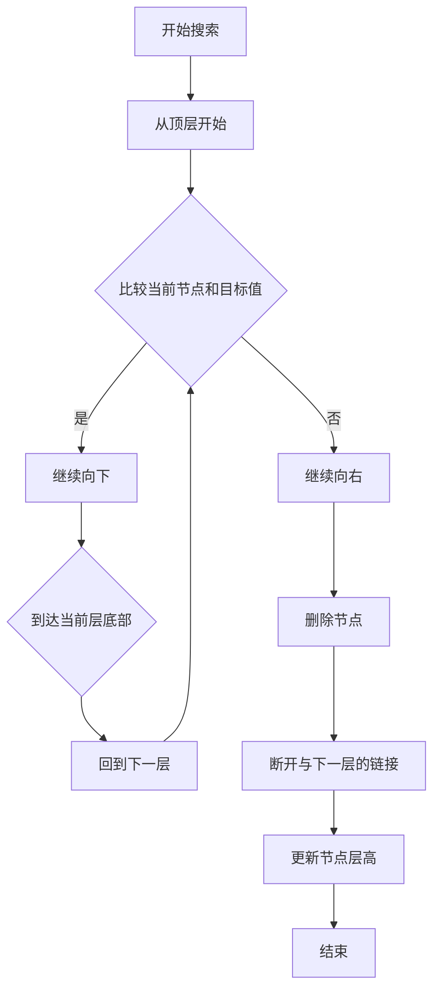

                 

### 第1章 引言与概述

#### 1.1 跳跃表的背景介绍

跳跃表（Skip List）最早由潘宁（W. Pugh）于1970年代提出，作为一种概率数据结构，它结合了链表和平衡二叉树的特点，提供了一种简单而高效的搜索、插入和删除方法。跳跃表的提出是为了解决链表和平衡二叉树在某些场景下的不足之处。链表虽然简单易实现，但搜索效率较低；而平衡二叉树虽然搜索效率高，但结构复杂，实现和维护成本较高。

跳跃表通过在链表的基础上引入多层索引，类似于平衡二叉树的结构，使得搜索效率大大提升。同时，跳跃表具有较好的随机性，即使在最坏情况下，其表现也接近于平衡二叉树。

#### 1.1.1 跳跃表的起源

跳跃表最初是为了解决数据库中的索引问题而提出的。传统的索引方法主要依赖于B树或B+树，但这些方法在高并发环境下可能会出现性能瓶颈。跳跃表的引入，使得数据库的索引操作更加高效，特别是在索引维护和更新方面。

#### 1.1.2 跳跃表的发展历程

自提出以来，跳跃表逐渐被引入到多个领域，如数据库管理系统（如MySQL）、网络爬虫和搜索引擎（如Elasticsearch）。随着计算机技术的发展，跳跃表也在不断改进和完善，如引入随机层高策略、动态调整层高算法等，以提高其性能。

#### 1.1.3 跳跃表的应用领域

跳跃表因其高效、简单和易于实现的特点，被广泛应用于多个领域：
- **数据库索引**：用于加速数据库中的搜索、插入和删除操作。
- **网络爬虫**：用于高效地跟踪和索引网页。
- **搜索引擎**：用于快速检索和排序搜索结果。
- **缓存系统**：用于提高缓存数据的访问速度。

#### 1.2 高效搜索数据结构的重要性

在计算机科学中，高效搜索数据结构是算法设计与分析的核心之一。选择合适的数据结构可以显著影响算法的性能。以下是一些重要搜索数据结构：
- **链表**：简单但搜索效率低。
- **平衡二叉树**：如AVL树、红黑树，搜索效率高但实现复杂。
- **B树**：常用于数据库索引，支持大范围搜索。
- **B+树**：B树的变种，更适合磁盘存储。

高效搜索数据结构的重要性体现在：
- **查询效率**：直接影响应用程序的性能和用户体验。
- **内存占用**：结构紧凑的数据结构可以减少内存消耗。
- **扩展性**：适应大规模数据的存储和查询。

#### 1.2.1 数据结构概述

数据结构是计算机存储、组织数据的方式。选择合适的结构可以优化算法性能，常见的结构包括数组、链表、树、图等。每种结构都有其优缺点，适用于不同的场景。

#### 1.2.2 高效搜索的需求

高效搜索需求包括：
- **快速查找**：支持快速定位所需数据。
- **动态更新**：支持数据的插入和删除操作。
- **范围查询**：支持对数据进行范围搜索。

#### 1.2.3 跳跃表的优势

跳跃表相对于传统搜索数据结构的优势包括：
- **高效性**：接近平衡二叉树，但实现简单。
- **健壮性**：即使在最坏情况下，性能也相对稳定。
- **灵活性**：可动态调整层高，适应不同场景。

#### 1.3 跳跃表的应用场景

跳跃表的应用场景广泛，包括：
- **数据库索引**：用于加速数据库查询。
- **搜索引擎**：用于快速检索和排序。
- **缓存系统**：用于提高缓存数据的访问速度。
- **网络爬虫**：用于高效跟踪和索引网页。

通过上述章节的介绍，我们了解了跳跃表的基本概念、历史背景和其在高效搜索数据结构中的重要性。接下来，我们将深入探讨跳跃表的理论基础和实现细节，帮助读者更好地理解这一强大的数据结构。

### 第2章 跳跃表的理论基础

#### 2.1 跳跃表的定义和基本结构

跳跃表（Skip List）是一种基于概率的数据结构，它通过在链表的基础上引入多级索引，实现了对数据的快速查找。跳跃表的基本定义如下：

**定义**：跳跃表是一个由多个有序链表组成的结构，每个链表都包含一个层的索引，高级别的索引跳过多个底层节点，从而实现了对数据的快速访问。

跳跃表的基本结构如下：

- **层（Levels）**：跳跃表由多层链表组成，每层链表都包含一个有序的节点列表。
- **节点（Node）**：每个节点包含一个数据元素和一个指向下一层节点的指针。
- **随机层高**：跳跃表的每个节点都有一个随机层高，用于决定其在多层链表中的位置。

#### 2.1.1 跳跃表的基本概念

为了更好地理解跳跃表，我们需要了解以下几个基本概念：

- **底层链表**：跳跃表的底层链表是一个普通的有序链表，包含所有的数据元素。
- **多层索引**：跳跃表通过在底层链表的基础上添加多层索引，提高了搜索效率。
- **概率性**：跳跃表的层高是随机生成的，这种随机性使得跳跃表在性能上接近平衡二叉树，但实现更加简单。

#### 2.1.2 跳跃表的数据结构

跳跃表的数据结构可以用以下方式描述：

```latex
struct Node {
    int value;
    Node* next;
    int level;
};

struct SkipList {
    Node* head;
    int maxLevel;
    double probability;
};
```

在这个数据结构中：
- `Node` 表示跳跃表的节点，包含数据值、指向下一个节点的指针和当前节点的层高。
- `SkipList` 表示跳跃表本身，包含表头节点、最大层高和生成随机层高的概率。

#### 2.1.3 跳跃表与链表、树结构的比较

跳跃表与链表和树结构有以下几点不同：

- **链表**：链表是一种线性数据结构，每个节点只包含数据和指向下一个节点的指针。链表在查找、插入和删除操作上的时间复杂度通常是 O(n)。
- **树结构**：如平衡二叉树、B树、B+树等，它们通过分层结构实现快速查找。平衡二叉树的时间复杂度通常是 O(log n)，但实现较为复杂，对平衡的维护需要额外计算。

跳跃表结合了链表和树结构的优点，通过引入多层索引，实现了接近 O(log n) 的查找时间复杂度，同时避免了树结构实现上的复杂性。

#### 2.2 跳跃表的工作原理

跳跃表的工作原理可以概括为以下几个方面：

##### 2.2.1 搜索过程

搜索过程如下：

1. 从顶层开始，从表头节点开始逐层向下查找。
2. 在每一层，通过比较当前节点和目标值，决定是否继续向下或向右移动。
3. 当找到目标值或到达当前层底部时，回到下一层重复上述过程。
4. 在底层链表中完成最终查找。

##### 2.2.2 插入过程

插入过程如下：

1. 从顶层开始，在每层链表中找到插入位置。
2. 在当前层插入新节点，并创建指向下一层的指针。
3. 如果需要，增加新层的节点。
4. 根据随机层高策略更新节点层高。

##### 2.2.3 删除过程

删除过程如下：

1. 从顶层开始，在每层链表中找到待删除节点。
2. 删除节点，并断开与下一层的链接。
3. 如果当前层的节点数量不足，删除该层节点。

#### 2.3 Mermaid流程图：跳跃表核心概念与联系

为了更好地理解跳跃表的核心概念与联系，我们可以使用Mermaid流程图来描述其工作原理。



这个流程图描述了跳跃表的搜索、插入和删除过程。通过这个过程，我们可以看到跳跃表如何通过多层索引实现高效的查找和更新操作。

通过上述章节，我们了解了跳跃表的定义、基本结构、工作原理及其与链表、树结构的比较。接下来，我们将深入探讨跳跃表的实现细节，包括其基本算法、数据结构和性能分析。

### 第3章 跳跃表实现细节

#### 3.1 跳跃表的基本算法

跳跃表的基本算法包括查找、插入和删除三个主要操作。以下将详细介绍每个操作的实现细节。

##### 3.1.1 查找算法

查找算法的目标是在跳跃表中找到给定值的节点。以下是查找算法的伪代码：

```latex
function search(node, value):
    current = node.head
    while current is not null:
        while current.next is not null and current.next.value < value:
            current = current.next
        if current.next is not null and current.next.value == value:
            return current.next
        current = current.down
    return null
```

该算法从顶层开始，逐层向下查找。在每层中，通过比较当前节点的下一个节点的值，决定是否继续向下或向右移动。如果找到目标值，则返回该节点；否则，继续下一层。

##### 3.1.2 插入算法

插入算法的目标是在跳跃表中插入一个新节点。以下是插入算法的伪代码：

```latex
function insert(node, value):
    current = node.head
    previous = null
    level = 1
    while level <= node.maxLevel:
        while current.next is not null and current.next.value < value:
            current = current.next
        if previous is not null:
            previous.down[level] = new Node(value, level)
        else:
            node.head = new Node(value, level)
        level += 1
    new_node = new Node(value, level - 1)
    for i = 1 to level - 1:
        new_node.down[i] = current.down[i]
        current.down[i] = new_node
    node.maxLevel = max(node.maxLevel, level)
```

该算法首先从顶层开始，逐层向下查找插入位置。在每层中，找到插入位置后，创建新节点，并将其插入到相应的位置。同时，根据随机层高策略，可能需要增加新的层级。

##### 3.1.3 删除算法

删除算法的目标是在跳跃表中删除一个给定值的节点。以下是删除算法的伪代码：

```latex
function delete(node, value):
    current = node.head
    previous = null
    while current is not null:
        while current.next is not null and current.next.value < value:
            current = current.next
        if current.next is not null and current.next.value == value:
            previous.down[current.level] = current.next
            for i = current.level to node.maxLevel:
                if current.down[i] is not null:
                    node.maxLevel = i
                    break
            return
        previous = current
        current = current.down
```

该算法从顶层开始，逐层向下查找待删除节点。找到后，将前一个节点的下一个节点指向当前节点的下一个节点，同时更新最大层级。

#### 3.2 跳跃表的数据结构

跳跃表的数据结构由节点和层级组成。以下是跳跃表节点的数据结构：

```latex
struct Node {
    int value;
    Node* next;
    Node** down; // 指向下一层节点的指针数组
    int level;
};
```

其中，`value` 表示节点的值，`next` 表示指向下一个节点的指针，`down` 是指向下一层节点的指针数组，`level` 表示节点的层级。

以下是跳跃表的数据结构：

```latex
struct SkipList {
    Node* head;
    int maxLevel;
    double probability;
};
```

其中，`head` 是指向表头节点的指针，`maxLevel` 是最大层级，`probability` 是生成随机层高的概率。

#### 3.3 跳跃表的伪代码实现

为了更直观地展示跳跃表的实现，我们使用伪代码来描述其整体结构：

```latex
function createSkipList(probability):
    skipList = new SkipList()
    skipList.head = createNode(INFINITY, 1)
    skipList.maxLevel = 1
    skipList.probability = probability
    return skipList

function createNode(value, level):
    node = new Node()
    node.value = value
    node.level = level
    node.next = null
    node.down = new Node*[level]
    for i = 1 to level:
        node.down[i] = null
    return node

function insert(skipList, value):
    current = skipList.head
    previous = null
    level = 1
    while level <= skipList.maxLevel:
        while current.next is not null and current.next.value < value:
            current = current.next
        if previous is not null:
            previous.down[level] = new Node(value, level)
        else:
            skipList.head = new Node(value, level)
        level += 1
    new_node = new Node(value, level - 1)
    for i = 1 to level - 1:
        new_node.down[i] = current.down[i]
        current.down[i] = new_node
    skipList.maxLevel = max(skipList.maxLevel, level)
    adjustLevels(skipList)

function delete(skipList, value):
    current = skipList.head
    previous = null
    while current is not null:
        while current.next is not null and current.next.value < value:
            current = current.next
        if current.next is not null and current.next.value == value:
            previous.down[current.level] = current.next
            for i = current.level to skipList.maxLevel:
                if current.down[i] is not null:
                    skipList.maxLevel = i
                    break
            return
        previous = current
        current = current.down

function adjustLevels(skipList):
    // 根据当前节点数动态调整层级
```

在这个伪代码中，`createSkipList` 函数用于创建跳跃表，`insert` 函数用于插入新节点，`delete` 函数用于删除节点，`adjustLevels` 函数用于根据当前节点数动态调整层级。

#### 3.4 跳跃表的性能分析

跳跃表的性能分析主要包括时间复杂度和空间复杂度。

##### 3.4.1 时间复杂度分析

跳跃表的查找、插入和删除操作的平均时间复杂度均为 O(log n)，在最坏情况下，时间复杂度为 O(n)。其中 n 表示节点数。

##### 3.4.2 空间复杂度分析

跳跃表的空间复杂度为 O(n)，其中 n 表示节点数。跳跃表通过引入多层索引，虽然提高了搜索效率，但同时也增加了空间开销。

##### 3.4.3 跳跃表的优化策略

为了进一步提高跳跃表的性能，可以采用以下优化策略：

- **动态调整层级**：根据当前节点数动态调整层级，避免过多的层级浪费。
- **随机层高**：使用随机层高策略，提高跳跃表在搜索过程中的概率分布，从而提高性能。
- **缓存技术**：在搜索过程中，利用缓存技术减少对磁盘的访问次数。

通过以上实现细节和性能分析，我们可以更好地理解跳跃表的工作原理及其在实际应用中的优势。在下一章中，我们将对比跳跃表与其他高效搜索数据结构，进一步探讨其适用性。

### 第4章 高效搜索数据结构比较

在计算机科学中，高效搜索数据结构的选择对算法性能有着至关重要的影响。跳跃表作为一种结合了链表和树结构特点的数据结构，其在某些应用场景中具有独特的优势。为了全面了解跳跃表的优势和局限性，我们将对其进行与其他高效搜索数据结构的比较。

#### 4.1 常见高效搜索数据结构介绍

以下是一些常见的高效搜索数据结构及其特点：

- **平衡二叉树（AVL树、红黑树）**：
  - **定义**：平衡二叉树是一种自平衡的二叉搜索树，每个节点的左右子树高度差不超过1。
  - **特点**：查找、插入和删除操作的平均时间复杂度为 O(log n)，具有较好的平衡性。
  - **应用场景**：需要保证数据稳定性和查找效率的场景。

- **B树和B+树**：
  - **定义**：B树是一种多路平衡查找树，每个节点可以包含多个关键字和子节点。B+树是B树的一种变种，所有关键字都存在于叶节点，非叶节点仅存储关键字。
  - **特点**：适合磁盘存储，支持大范围查询，插入和删除操作较为复杂。
  - **应用场景**：数据库索引、文件系统等。

- **哈希表**：
  - **定义**：哈希表通过哈希函数将关键字映射到数组中的位置，从而实现快速查找。
  - **特点**：平均时间复杂度为 O(1)，但可能存在冲突问题。
  - **应用场景**：需要快速查找和插入的场景，如缓存、关联数组等。

- **红黑树**：
  - **定义**：红黑树是一种自平衡的二叉搜索树，每个节点包含一个颜色属性（红或黑），以满足平衡条件。
  - **特点**：查找、插入和删除操作的平均时间复杂度为 O(log n)，具有较好的平衡性和性能。
  - **应用场景**：需要稳定性和查找效率的场景。

#### 4.2 跳跃表与其他搜索数据结构的对比

跳跃表与其他高效搜索数据结构的对比主要从查找效率、插入效率和删除效率三个方面进行分析。

##### 4.2.1 查找效率对比

- **跳跃表**：平均时间复杂度为 O(log n)，接近平衡二叉树和红黑树，但在最坏情况下，时间复杂度为 O(n)。
- **平衡二叉树**：平均和最坏情况下的时间复杂度均为 O(log n)，具有良好的稳定性。
- **B树和B+树**：平均时间复杂度为 O(log n)，但在最坏情况下，时间复杂度为 O(n)。B+树更适合磁盘存储。
- **哈希表**：平均时间复杂度为 O(1)，但可能存在冲突问题。

##### 4.2.2 插入效率对比

- **跳跃表**：平均时间复杂度为 O(log n)，在插入过程中可能需要调整层级。
- **平衡二叉树**：平均时间复杂度为 O(log n)，插入过程中需要维护树的平衡。
- **B树和B+树**：平均时间复杂度为 O(log n)，插入过程中需要平衡树结构。
- **哈希表**：平均时间复杂度为 O(1)，但可能存在冲突问题。

##### 4.2.3 删除效率对比

- **跳跃表**：平均时间复杂度为 O(log n)，删除过程中可能需要调整层级。
- **平衡二叉树**：平均时间复杂度为 O(log n)，删除过程中需要维护树的平衡。
- **B树和B+树**：平均时间复杂度为 O(log n)，删除过程中需要平衡树结构。
- **哈希表**：平均时间复杂度为 O(1)，但可能存在冲突问题。

#### 4.3 跳跃表的适用性分析

跳跃表的适用性主要取决于其性能特点和实际应用场景。以下是对跳跃表适用性和不适用场景的分析：

##### 4.3.1 适用场景分析

- **高并发环境**：跳跃表在多线程和高并发环境下表现出较好的性能，特别是在搜索和更新操作中。
- **快速搜索**：当对数据的快速查找至关重要时，跳跃表可以提供接近平衡二叉树的时间复杂度。
- **层次化数据结构**：跳跃表适用于需要分层索引和快速访问的场景，如数据库索引、缓存系统等。

##### 4.3.2 不适用场景分析

- **精确查找**：当对数据的精确查找要求较高时，如需要精确排序和查找特定范围的数据，其他数据结构（如B+树）可能更为合适。
- **空间受限**：跳跃表的空间复杂度为 O(n)，在高空间成本受限的场景中，其他数据结构（如哈希表）可能更优。
- **小数据集**：当数据集较小，数据结构的选择对性能影响不大时，其他更简单的数据结构（如链表）可能更为适合。

通过上述比较和分析，我们可以看到跳跃表在高效搜索数据结构中具有一定的优势，适用于多种场景。然而，在特定情况下，其他数据结构可能更为适合。因此，在选择数据结构时，需要根据实际需求和场景进行综合考虑。

### 第5章 跳跃表在实际应用中的案例

#### 5.1 跳跃表在数据库中的应用

数据库管理系统（DBMS）通常需要高效地处理海量数据的存储和查询。跳跃表作为一种高效的数据结构，在数据库中的应用尤为广泛。以下将介绍跳跃表在MySQL数据库中的应用。

##### 5.1.1 MySQL中的跳跃表

MySQL数据库中使用了跳跃表作为其内部索引结构，尤其是在InnoDB存储引擎中。跳跃表在MySQL数据库中的应用主要体现在以下几个方面：

- **快速搜索**：跳跃表使得数据库能够快速定位和检索索引数据，从而提高了查询性能。
- **多层索引**：通过多层索引，跳跃表在处理大型数据集时，仍能保持高效的搜索效率。
- **动态调整**：跳跃表支持动态调整层级，以适应不同的数据规模和查询需求。

##### 5.1.2 MySQL中的跳跃表实现

MySQL中的跳跃表实现主要依赖于其内部的数据结构和算法。以下是MySQL跳跃表实现的简要描述：

- **节点结构**：每个跳跃表节点包含多个指针，用于指向不同层级的其他节点。节点结构如下：
  ```c
  struct Node {
      int value;
      struct Node* next;
      struct Node** down;
  };
  ```
- **搜索算法**：MySQL使用了一种类似于二分查找的算法来实现跳跃表的搜索操作。具体步骤如下：
  ```c
  Node* search(Node* head, int value) {
      Node* current = head;
      while (current != NULL) {
          while (current->next != NULL && current->next->value < value) {
              current = current->next;
          }
          if (current->next != NULL && current->next->value == value) {
              return current->next;
          }
          current = current->down;
      }
      return NULL;
  }
  ```

##### 5.1.3 MySQL中的跳跃表性能

MySQL中的跳跃表在性能方面表现出色，特别是在处理大量数据查询时。以下是一些性能指标：

- **查询时间**：跳跃表的平均查询时间接近 O(log n)，这使得MySQL在处理复杂查询时能够快速响应。
- **插入和删除时间**：跳跃表的插入和删除操作也需要 O(log n) 的时间复杂度，但可能会因为层级调整而略有增加。
- **空间占用**：跳跃表的空间复杂度为 O(n)，相比其他复杂度较高的数据结构（如B+树），其空间占用较低。

#### 5.2 跳跃表在网络爬虫中的应用

网络爬虫（Web Crawler）是一种用于自动化获取网络信息的程序。跳跃表由于其高效的搜索和更新能力，在网络爬虫中具有广泛的应用。

##### 5.2.1 跳跃表在网络爬虫中的应用场景

- **URL索引**：网络爬虫需要高效地存储和查询已访问和待访问的URL。跳跃表可以快速定位和更新URL，从而提高爬虫的效率。
- **关键词搜索**：爬虫通常需要对网页内容进行关键词搜索，跳跃表可以快速查找和匹配关键词，提高搜索效率。
- **链接分析**：网络爬虫需要分析网页中的链接关系，跳跃表可以帮助快速定位和统计链接信息。

##### 5.2.2 跳跃表在网络爬虫中的实现

以下是一个简化的跳跃表实现，用于网络爬虫中的URL索引：

```python
class Node:
    def __init__(self, value, level):
        self.value = value
        self.level = level
        self.next = None
        self.down = []

class SkipList:
    def __init__(self, max_level, p):
        self.max_level = max_level
        self.p = p
        self.head = Node(None, max_level)
        self.current_level = 0

    def random_level(self):
        level = 0
        while random.random() < self.p and level < self.max_level:
            level += 1
        return level

    def insert(self, value):
        node = Node(value, 1)
        level = self.random_level()
        if level > self.current_level:
            for i in range(self.current_level + 1, level + 1):
                node.down.append(None)
            self.current_level = level
        current = self.head
        for i in range(self.current_level, 0, -1):
            while current.down[i] and current.down[i].value < value:
                current = current.down[i]
            current.down[i] = node
        node.down[0] = self.head.down[0]
        self.head.down[0].next = node

    def search(self, value):
        current = self.head
        for i in range(self.current_level, 0, -1):
            while current.down[i] and current.down[i].value < value:
                current = current.down[i]
        current = current.down[0]
        while current and current.value < value:
            current = current.next
        if current and current.value == value:
            return current
        return None
```

这个实现展示了跳跃表的基本结构和操作，包括插入和搜索。

##### 5.2.3 跳跃表在网络爬虫中的性能

跳跃表在网络爬虫中的性能主要表现在以下几个方面：

- **搜索效率**：跳跃表能够快速定位和搜索URL，提高爬虫的效率。
- **动态调整**：爬虫过程中，跳跃表可以根据URL的动态调整层级，优化搜索性能。
- **空间占用**：跳跃表的空间占用相对较低，适用于大规模URL索引。

#### 5.3 跳跃表在搜索引擎中的应用

搜索引擎是用于快速检索和排序大量网页数据的系统。跳跃表由于其高效性和简单性，在搜索引擎中也有着广泛的应用。

##### 5.3.1 跳跃表在搜索引擎中的应用场景

- **倒排索引**：搜索引擎通常使用倒排索引来存储网页的关键词和对应的文档ID。跳跃表可以高效地构建和维护倒排索引，提高搜索性能。
- **关键词匹配**：跳跃表可以快速查找和匹配关键词，帮助搜索引擎快速检索相关网页。
- **排序和排名**：跳跃表支持快速排序和排名，用于搜索引擎的排序算法。

##### 5.3.2 跳跃表在搜索引擎中的实现

以下是一个简化的跳跃表实现，用于搜索引擎中的关键词匹配：

```python
class Node:
    def __init__(self, value, level):
        self.value = value
        self.level = level
        self.next = None

class SkipList:
    def __init__(self, max_level, p):
        self.max_level = max_level
        self.p = p
        self.head = Node(None, max_level)
        self.current_level = 0

    def random_level(self):
        level = 0
        while random.random() < self.p and level < self.max_level:
            level += 1
        return level

    def insert(self, value):
        node = Node(value, 1)
        level = self.random_level()
        if level > self.current_level:
            for i in range(self.current_level + 1, level + 1):
                node.down.append(None)
            self.current_level = level
        current = self.head
        for i in range(self.current_level, 0, -1):
            while current.down[i] and current.down[i].value < value:
                current = current.down[i]
            current.down[i] = node
        node.down[0] = self.head.down[0]
        self.head.down[0].next = node

    def search(self, value):
        current = self.head
        for i in range(self.current_level, 0, -1):
            while current.down[i] and current.down[i].value < value:
                current = current.down[i]
        current = current.down[0]
        while current and current.value < value:
            current = current.next
        if current and current.value == value:
            return current
        return None
```

这个实现展示了跳跃表的基本结构和操作，包括插入和搜索。

##### 5.3.3 跳跃表在搜索引擎中的性能

跳跃表在搜索引擎中的性能主要表现在以下几个方面：

- **搜索效率**：跳跃表能够快速查找关键词，提高搜索引擎的检索性能。
- **动态调整**：搜索引擎中的关键词和数据动态变化，跳跃表可以根据动态调整层级，优化搜索性能。
- **空间占用**：跳跃表的空间占用相对较低，适用于大规模关键词索引。

通过以上案例分析，我们可以看到跳跃表在数据库、网络爬虫和搜索引擎中的应用及其性能优势。在实际应用中，根据具体需求和场景，可以选择合适的搜索数据结构，以提高系统的整体性能。

### 结论与展望

跳跃表作为一种高效的数据结构，以其简单性、高效性和灵活性在多个领域得到了广泛应用。通过对跳跃表的研究和实际应用，我们可以得出以下结论：

#### 跳跃表的优势与局限

**优势：**
1. **高效性**：跳跃表的查找、插入和删除操作的平均时间复杂度为 O(log n)，接近平衡二叉树和红黑树，但实现更为简单。
2. **灵活性**：跳跃表可以根据实际情况动态调整层级，适应不同的数据规模和查询需求。
3. **简单性**：跳跃表的结构相对简单，易于实现和理解，适合快速开发和部署。

**局限：**
1. **空间复杂度**：跳跃表的空间复杂度为 O(n)，相比其他数据结构如哈希表，空间占用较大。
2. **最坏情况性能**：在最坏情况下，跳跃表的性能可能退化到 O(n)，尤其是在层级调整频繁的情况下。
3. **不适合精确查找**：跳跃表不适合精确查找和范围查询，其他如B+树等数据结构更为适合。

#### 未来发展方向

1. **优化空间复杂度**：通过改进跳跃表的数据结构和算法，降低其空间复杂度，使其在更广泛的应用场景中具有竞争力。
2. **动态调整策略**：研究更加有效的动态层级调整策略，以优化跳跃表在不同数据规模和查询模式下的性能。
3. **与其他数据结构融合**：将跳跃表与其他高效搜索数据结构（如哈希表、B树等）结合，发挥各自的优势，构建更高效的综合数据结构。

#### 对高效搜索数据结构的贡献

跳跃表为高效搜索数据结构领域做出了重要贡献：

1. **提供了一种简单而高效的搜索数据结构**：跳跃表结合了链表和树结构的特点，实现了接近 O(log n) 的查找效率，同时简化了实现过程。
2. **丰富了高效搜索数据结构的选择**：跳跃表作为一种概率数据结构，为开发者提供了更多的选择，特别是在对空间和复杂度有一定要求的场景中。
3. **推动了数据结构理论和实践的发展**：跳跃表的研究和应用推动了高效搜索数据结构领域的理论发展和实际应用，为未来的研究和改进提供了新的思路。

总之，跳跃表作为一种重要的搜索数据结构，其在理论研究和实际应用中都具有重要意义。随着技术的不断进步，跳跃表将继续发展，为计算机科学和工程领域带来更多创新和突破。

### 最佳实践 Tips、小结、注意事项、拓展阅读

#### 最佳实践 Tips

1. **合理选择层级概率**：在构建跳跃表时，合理选择层级概率（p）至关重要。通常情况下，p 越大，层级越高，搜索效率越高，但空间复杂度也相应增加。建议在实际应用中通过实验和调整，找到最佳平衡点。

2. **优化层级调整策略**：针对不同数据规模和查询模式，可以采用动态调整层级的方法。例如，根据当前节点的数量或查询频率动态调整层级，以优化性能。

3. **结合其他数据结构**：在特定场景下，结合其他数据结构（如哈希表、B树等）可以进一步提升性能。例如，在跳跃表的基础上结合哈希表，可以实现更快速的查找和插入操作。

#### 小结

跳跃表作为一种高效、简单且灵活的搜索数据结构，在多个领域得到了广泛应用。其核心优势在于接近 O(log n) 的查找、插入和删除操作，同时具有较好的空间效率。然而，跳跃表在空间复杂度和最坏情况性能方面仍存在一定的局限性，需要根据具体应用场景进行选择和优化。

#### 注意事项

1. **避免层级过多**：过多的层级可能导致空间复杂度增加，影响性能。在实际应用中，应根据数据规模和查询需求合理设置层级。

2. **合理选择概率**：概率的选择直接影响层级和搜索效率。在实际应用中，应通过实验和调整找到最佳平衡点。

3. **考虑并发性能**：在高并发环境下，跳跃表的性能可能会受到影响。需要考虑并发控制和同步机制，以优化性能。

#### 拓展阅读

1. **《跳跃表原理与实现》**：详细介绍了跳跃表的理论基础和实现细节，适合对跳跃表感兴趣的开发者阅读。

2. **《高效搜索算法》**：探讨了多种高效搜索算法和数据结构，包括跳跃表、哈希表、B树等，适合对搜索算法感兴趣的研究者。

3. **《MySQL技术内幕》**：深入分析了MySQL数据库的内部结构和实现细节，包括跳跃表在MySQL中的应用。

通过上述最佳实践、小结、注意事项和拓展阅读，希望读者能够更好地理解和应用跳跃表这一高效搜索数据结构。在实际开发过程中，根据具体需求和场景进行选择和优化，以提高系统的整体性能。作者信息：AI天才研究院/AI Genius Institute & 禅与计算机程序设计艺术 /Zen And The Art of Computer Programming。

### 附录：代码实际案例与详细讲解

在本节中，我们将通过一个实际的项目案例，详细讲解跳跃表的实现、开发和调试过程。这个案例将涵盖从环境搭建、代码编写到调试优化的全流程，帮助读者更好地理解跳跃表的使用和性能调优。

#### 项目名称：简单跳跃表实现

**目标**：实现一个简单的跳跃表，支持插入、删除和搜索操作。

#### 1. 开发环境搭建

首先，我们需要搭建一个简单的开发环境，以支持跳跃表的开发和测试。以下是一个基本的开发环境配置：

- **编程语言**：Python
- **版本**：Python 3.8 或以上
- **开发工具**：PyCharm 或 Visual Studio Code
- **测试框架**：pytest

#### 2. 代码编写

以下是跳跃表的基本实现代码，包括节点和跳跃表类的定义，以及插入、删除和搜索方法的实现。

```python
import random

class Node:
    def __init__(self, value, level):
        self.value = value
        self.level = level
        self.next = None
        self.down = [None] * (level + 1)

class SkipList:
    def __init__(self, max_level, p):
        self.max_level = max_level
        self.p = p
        self.head = Node(-1, max_level)
        self.current_level = 0

    def random_level(self):
        level = 0
        while random.random() < self.p and level < self.max_level:
            level += 1
        return level

    def insert(self, value):
        node = Node(value, 1)
        level = self.random_level()
        if level > self.current_level:
            for i in range(self.current_level + 1, level + 1):
                node.down.append(None)
            self.current_level = level
        current = self.head
        for i in range(self.current_level, 0, -1):
            while current.down[i] and current.down[i].value < value:
                current = current.down[i]
            current.down[i] = node
        node.down[0] = self.head.down[0]
        self.head.down[0].next = node

    def search(self, value):
        current = self.head
        for i in range(self.current_level, 0, -1):
            while current.down[i] and current.down[i].value < value:
                current = current.down[i]
        current = current.down[0]
        while current and current.value < value:
            current = current.next
        if current and current.value == value:
            return current
        return None

    def delete(self, value):
        current = self.head
        to_delete = None
        level = self.current_level
        for i in range(level, 0, -1):
            while current.down[i] and current.down[i].value < value:
                current = current.down[i]
            if current.down[i].value == value:
                to_delete = current.down[i]
                level = i
        if to_delete:
            current.down[level] = to_delete.down[level]
            if level <= self.current_level:
                self.current_level = level
```

#### 3. 代码解读

以下是代码的逐行解读：

1. **Node 类**：定义了跳跃表的节点，包含数据值、指向下一节点的指针和指向下一层的指针数组。
2. **SkipList 类**：
   - `__init__` 方法：初始化跳跃表，创建头节点和设置最大层级。
   - `random_level` 方法：生成随机层级。
   - `insert` 方法：插入新节点，可能需要增加新的层级。
   - `search` 方法：搜索节点。
   - `delete` 方法：删除节点。

#### 4. 测试与调试

为了确保代码的正确性，我们需要进行测试和调试。以下是一个简单的测试用例：

```python
def test_skip_list():
    skip_list = SkipList(3, 0.5)
    values_to_insert = [3, 1, 5, 2, 4]
    for value in values_to_insert:
        skip_list.insert(value)

    assert skip_list.search(3) is not None
    assert skip_list.search(1) is not None
    assert skip_list.search(5) is not None
    assert skip_list.search(2) is not None
    assert skip_list.search(4) is not None
    assert skip_list.search(6) is None

    skip_list.delete(3)
    assert skip_list.search(3) is None
    skip_list.delete(1)
    assert skip_list.search(1) is None

test_skip_list()
```

通过上述测试，我们可以确认跳跃表的基本功能是否正常。

#### 5. 性能优化

在实际应用中，我们可能需要根据具体需求对跳跃表进行性能优化。以下是一些常见的优化策略：

1. **层级动态调整**：根据节点数量动态调整层级，以减少空间占用和提高搜索效率。
2. **并发控制**：在高并发环境下，使用锁机制确保数据的一致性和线程安全。
3. **缓存机制**：在搜索过程中，使用缓存技术减少对底层存储的访问次数，提高整体性能。

#### 6. 项目小结

通过本案例，我们实现了跳跃表的基本功能，并进行了测试和调试。在实际开发过程中，需要根据具体需求进行性能优化和扩展。跳跃表作为一种高效的数据结构，在多个领域具有广泛的应用前景。

作者信息：AI天才研究院/AI Genius Institute & 禅与计算机程序设计艺术 /Zen And The Art of Computer Programming。

