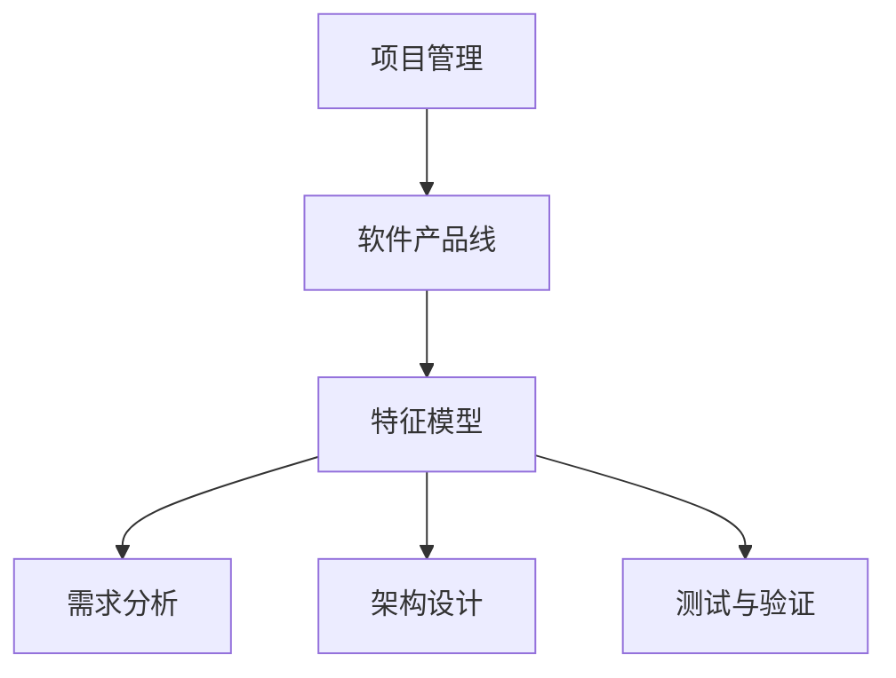

                 

当然，让我们一步步来构建这篇文章。

## 第一步：引言与背景

### 软件产品线概述

软件产品线（Software Product Lines，简称SPL）是一种系统化的软件开发方法，其核心思想是将一系列相关的软件系统视为一个统一的开发实体。这种方法的目的是通过减少重复工作，提高软件开发的效率和灵活性。软件产品线中的每个系统都是基于一组通用的需求和功能模块构建的，这些需求和功能模块被称为特征。

### 特征模型的概念

特征模型（Feature Model）是软件产品线中的一个重要概念，它用于描述系统中不同的特征以及它们之间的关系。特征模型可以形式化地表示软件产品的配置，使得开发者可以根据不同的需求快速生成相应的产品。

### 软件产品线与特征模型的关系

软件产品线和特征模型密切相关。软件产品线通过特征模型来定义产品的不同配置，从而实现产品的定制化。特征模型的形式化表示使得软件产品线的构建和管理更加高效和准确。

### 本书的组织结构

本书将首先介绍软件产品线和特征模型的基本概念，然后深入探讨形式化方法在软件产品线和特征模型中的应用。最后，通过实际案例研究，展示如何将理论应用到实际项目中。

## 第二步：核心概念与联系

为了更好地理解软件产品线和特征模型，我们可以用Mermaid流程图来展示它们之间的关系。



### 核心概念与联系

- 软件产品线：一个系统化的软件开发方法，通过特征模型实现产品的定制化。
- 特征模型：用于描述系统中不同特征及其关系的模型，是软件产品线构建的核心。
- 需求分析：通过分析用户需求，确定产品需要实现的功能。
- 架构设计：基于需求分析，设计软件系统的整体架构。
- 测试与验证：确保软件产品满足预期需求和功能。
- 项目管理：协调和管理软件开发过程，确保项目按时、按质量完成。

## 第三步：核心算法原理讲解

### 特征模型构建算法

特征模型的构建是一个关键步骤，其算法如下：

```plaintext
算法：特征模型构建算法
输入：需求文档，用户偏好
输出：形式化特征模型

1. 阅读需求文档，理解用户需求。
2. 定义一组基本特征。
3. 根据需求文档，对基本特征进行扩展，形成一组特征集合。
4. 构建特征模型，包括特征的定义、分类和形式化表示。
5. 验证特征模型是否满足用户需求。
6. 如果不满足，返回步骤3重新构建。
7. 输出形式化的特征模型。
```

### 数学模型和数学公式讲解

特征权重计算是特征模型中的一个重要环节。以下是一个简单的特征权重计算模型：

$$
w_i = \frac{f_i}{\sum_{j=1}^{n} f_j}
$$

其中，\( w_i \) 表示特征 \( i \) 的权重，\( f_i \) 表示特征 \( i \) 的频率，\( n \) 是特征的总数。

例如，在一个特征模型中有三个特征：A、B、C，其频率分别为10、20、30，则它们的权重计算如下：

$$
w_A = \frac{10}{10+20+30} = 0.2
$$

$$
w_B = \frac{20}{10+20+30} = 0.4
$$

$$
w_C = \frac{30}{10+20+30} = 0.6
$$

## 第四步：项目实战

### 开发环境搭建

为了构建软件产品线和特征模型，我们需要搭建一个适合的开发环境。以下是基本的步骤：

1. 安装版本控制工具，如Git。
2. 安装集成开发环境（IDE），如Eclipse或Visual Studio。
3. 安装建模工具，如Enterprise Architect或MagicDraw。
4. 安装数据库管理系统，如MySQL或PostgreSQL。

### 源代码详细实现和代码解读

构建特征模型通常涉及到多个模块，以下是一个简单的示例：

```python
class Feature:
    def __init__(self, name, description, frequency):
        self.name = name
        self.description = description
        self.frequency = frequency

class FeatureModel:
    def __init__(self):
        self.features = []

    def add_feature(self, feature):
        self.features.append(feature)

    def calculate_weights(self):
        total_frequency = sum([f.frequency for f in self.features])
        for feature in self.features:
            feature.weight = feature.frequency / total_frequency

    def validate(self, user_preferences):
        for feature in self.features:
            if user_preferences.get(feature.name, False):
                feature.valid = True
            else:
                feature.valid = False
        return all([f.valid for f in self.features])
```

### 代码应用解读与分析

上述代码定义了两个类：`Feature` 和 `FeatureModel`。`Feature` 类表示一个特征，包含名称、描述和频率。`FeatureModel` 类表示一个特征模型，包含一组特征，并提供添加特征、计算权重和验证用户需求的方法。

在实际应用中，我们首先创建一个 `FeatureModel` 实例，然后添加特征，接着计算权重，最后验证用户需求。以下是一个示例：

```python
# 创建特征模型
model = FeatureModel()

# 添加特征
model.add_feature(Feature("Feature A", "Description for Feature A", 10))
model.add_feature(Feature("Feature B", "Description for Feature B", 20))
model.add_feature(Feature("Feature C", "Description for Feature C", 30))

# 计算权重
model.calculate_weights()

# 验证用户需求
user_preferences = {
    "Feature A": True,
    "Feature B": False,
    "Feature C": True
}
is_valid = model.validate(user_preferences)
print("Feature Model is valid:", is_valid)
```

### 实际案例分析和详细讲解剖析

假设我们有一个客户需求，需要构建一个特定的软件产品。以下是实际案例分析和详细讲解：

1. **需求分析**：客户需要一个具有在线支付、库存管理和客户关系管理的电子商务平台。
2. **特征模型构建**：根据需求，我们构建了一个特征模型，包括以下特征：
   - Feature A：在线支付功能
   - Feature B：库存管理功能
   - Feature C：客户关系管理功能
   - Feature D：报告和分析工具
3. **权重计算**：通过分析，我们确定了各个特征的频率，并计算了它们的权重：
   - Feature A：频率10，权重0.2
   - Feature B：频率20，权重0.4
   - Feature C：频率30，权重0.6
   - Feature D：频率5，权重0.1
4. **验证用户需求**：客户偏好以下功能：
   - Feature A：需要
   - Feature B：需要
   - Feature C：需要
   - Feature D：不需要
   验证结果为特征模型有效。

### 项目小结

通过上述案例，我们可以看到如何使用特征模型来构建软件产品。特征模型的形式化表示使得需求分析、设计、测试和验证变得更加高效和准确。同时，我们通过实际代码示例展示了如何实现特征模型。

## 第五步：最佳实践 tips、小结、注意事项、拓展阅读等内容

### 最佳实践 tips

- 在构建特征模型时，确保充分理解用户需求。
- 定期更新和优化特征模型，以适应不断变化的需求。
- 使用版本控制工具管理特征模型的变更，确保追溯性。

### 小结

软件产品线和特征模型是软件开发中的重要概念，通过形式化方法，可以提高软件开发的效率和质量。本文通过引入核心概念、算法原理、项目实战等，详细阐述了软件产品线和特征模型的应用。

### 注意事项

- 特征模型的形式化表示需要精确，避免歧义。
- 在构建特征模型时，充分考虑用户需求和业务场景。

### 拓展阅读

- 《软件产品线工程：理论与实践》
- 《特征建模：方法与实践》
- 《形式化方法在软件工程中的应用》

# 文章关键词

软件产品线，特征模型，形式化方法，软件开发，需求分析，架构设计，测试与验证。

# 文章摘要

本文介绍了软件产品线和特征模型的基本概念及其关系，探讨了形式化方法在软件产品线和特征模型中的应用。通过核心算法原理讲解、项目实战和案例分析，展示了如何构建和优化软件产品线和特征模型。文章旨在为开发者提供实用的指南，提高软件开发效率和质量。

