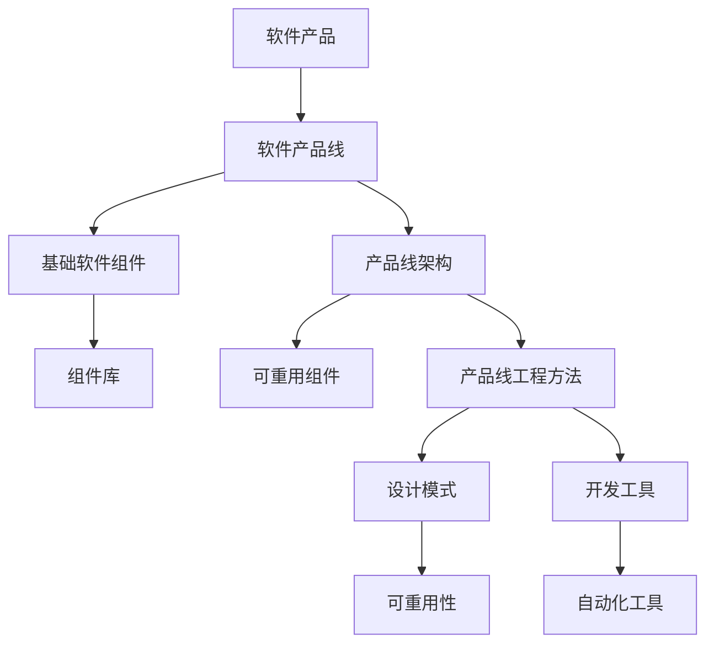
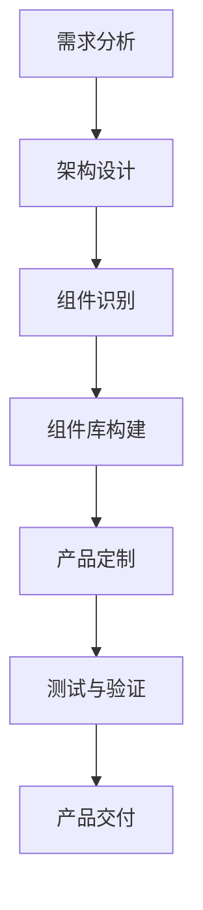
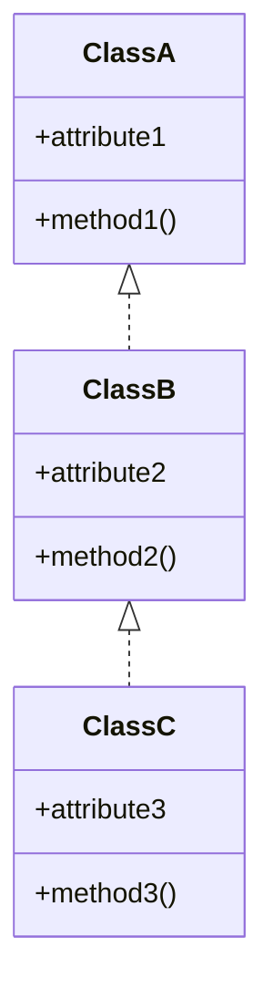

                 


## 引言

### 软件产品线的基本概念

软件产品线（Software Product Line，简称SPL）是一种系统化的软件工程方法，通过将一组相关的软件系统归纳为产品线，并基于共同的特性构建和定制这些软件系统。这种方法旨在提高软件开发的效率和产品质量，降低成本和缩短开发周期。软件产品线的核心思想在于复用性，通过定义一组基础软件组件，将这些组件组合成不同的软件产品。

**核心概念联系**

为了更好地理解软件产品线的概念，我们可以用Mermaid流程图来展示其核心概念及其相互关系。



在图中，A代表具体的软件产品，B代表软件产品线，C代表基础软件组件，D代表组件库，E代表产品线架构，F代表可重用组件，G代表产品线工程方法，H代表设计模式，I代表开发工具，J代表可重用性，K代表自动化工具。这些概念相互关联，共同构成了软件产品线的体系。

**定义与历史**

软件产品线的概念起源于20世纪90年代，最初由德国学者Peter Liggesmeyer等人提出。他们基于软件复用的思想，提出了一种通过共享基础架构来开发多个软件系统的方法。随着软件工程领域对复用性的不断追求，软件产品线逐渐成为一种重要的软件工程方法。

**软件产品线的重要性**

软件产品线在软件工程中具有重要的应用价值。首先，它能够显著提高软件开发的效率。通过复用基础软件组件，可以减少重复性的开发工作，缩短开发周期。其次，软件产品线有助于提高软件的质量。通过对一组相关软件系统进行统一的设计和测试，可以减少错误和缺陷。最后，软件产品线能够降低软件开发的成本。通过减少重复开发和维护工作，可以降低开发成本和运营成本。

### 大规模定制化与软件工程

#### 大规模定制化的背景

大规模定制化（Mass Customization）是一种基于顾客需求进行个性化定制的生产方式。它起源于制造业，并在20世纪末逐渐扩展到服务业。随着信息技术的快速发展，大规模定制化在软件工程领域也得到了广泛应用。

#### 软件工程与大规模定制化

软件工程在应对大规模定制化时面临着一系列挑战。首先，大规模定制化要求软件系统能够灵活地适应不同的需求。这意味着软件系统需要具备高度的灵活性和可扩展性。其次，大规模定制化要求软件系统能够快速响应市场需求。这要求软件开发过程具备高效的迭代和交付能力。

软件产品线作为一种系统化的软件工程方法，为应对大规模定制化提供了有效的解决方案。通过定义一组基础软件组件，软件产品线能够快速构建和定制不同的软件系统，满足多样化的市场需求。

### 总结

本文介绍了软件产品线的基本概念、定义与历史，以及软件产品线在软件工程中的应用价值。通过Mermaid流程图展示了软件产品线的核心概念及其相互关系，并阐述了大规模定制化与软件工程的关系。下一部分将深入探讨软件产品线的构建方法，包括软件产品线架构、核心算法和建模方法等。

## 软件产品线的构建方法

### 软件产品线架构

软件产品线架构是构建软件产品线的基础，它定义了软件组件如何组织、交互和复用。软件产品线架构通常包括以下几个方面：

1. **产品线架构风格**：选择合适的架构风格，如分层架构、组件架构等，以支持软件组件的复用和定制。
2. **组件库**：构建和维护一个组件库，其中包含可重用的软件组件，这些组件是产品线的基础。
3. **可重用组件**：识别和定义可重用的软件组件，这些组件可以在不同的软件产品中复用。
4. **产品线工程方法**：定义一套系统化的工程方法，包括设计、开发、测试和维护等各个环节。

下面是一个简单的Mermaid流程图，展示软件产品线架构的设计流程：



**需求分析**：分析用户需求，确定需要构建的软件产品的功能和要求。

**架构设计**：根据需求分析的结果，设计软件产品的总体架构，选择合适的架构风格。

**组件识别**：识别并定义可重用的软件组件，这些组件将构成产品线的基础。

**组件库构建**：构建和维护组件库，确保组件的可重用性和一致性。

**产品定制**：基于组件库，定制具体的软件产品，以满足不同的需求。

**测试与验证**：对定制后的软件产品进行测试和验证，确保其质量和稳定性。

**产品交付**：将定制后的软件产品交付给用户。

### 软件产品线架构风格

软件产品线架构风格是软件架构的一个重要方面，它决定了软件组件的组织方式、交互模式和复用策略。常见的架构风格包括：

1. **分层架构**：将软件系统划分为多个层次，每个层次负责不同的功能。这种架构风格有利于组件的复用和系统的扩展。
2. **组件架构**：将软件系统划分为多个组件，每个组件实现特定的功能。组件之间通过接口进行通信。这种架构风格提高了组件的可复用性。
3. **事件驱动架构**：基于事件驱动的架构风格，通过事件流来实现系统的功能。这种架构风格适合处理复杂的事件和并发处理。
4. **微服务架构**：将软件系统划分为多个微服务，每个微服务负责特定的功能。微服务之间通过API进行通信。这种架构风格提高了系统的灵活性和可扩展性。

每种架构风格都有其适用的场景和优缺点。在选择架构风格时，需要综合考虑软件产品的需求、开发团队的技能和经验等因素。

### 软件产品线核心算法

软件产品线的核心算法是实现软件组件复用和定制的关键。以下是几个重要的核心算法：

#### 可重用组件识别算法

可重用组件识别算法用于识别和定义可重用的软件组件。以下是该算法的伪代码：

```python
def identify_reusable_components(components):
    reusable_components = []
    for component in components:
        if meets_reusability_criteria(component):
            reusable_components.append(component)
    return reusable_components

def meets_reusability_criteria(component):
    # 这里定义可重用性的判断标准，例如：
    return component.has_common_interfaces() and component.is_stable
```

在上述伪代码中，`identify_reusable_components`函数接收一组软件组件作为输入，并返回一个包含可重用组件的列表。`meets_reusability_criteria`函数用于判断一个组件是否满足可重用性的标准，例如是否具有公共接口和稳定性。

#### 组件组装算法

组件组装算法用于将可重用组件组合成具体的软件产品。以下是该算法的伪代码：

```python
def assemble_components(product, components):
    product_components = []
    for component in components:
        if is_compatible(component, product):
            product_components.append(component)
    return product_components

def is_compatible(component, product):
    # 这里定义组件兼容性的判断标准，例如：
    return component.meets_product_requirements(product)
```

在上述伪代码中，`assemble_components`函数接收一个软件产品和一组可重用组件作为输入，并返回一个包含兼容组件的列表。`is_compatible`函数用于判断一个组件是否与产品兼容，例如是否满足产品的功能需求。

#### 质量保证算法

质量保证算法用于确保软件产品的质量和稳定性。以下是该算法的伪代码：

```python
def ensure_quality(product_components):
    for component in product_components:
        if not is_component_valid(component):
            raise Exception("Invalid component found")
    # 这里可以添加其他质量保证措施，例如：
    run_tests_on_product(product_components)

def is_component_valid(component):
    # 这里定义组件有效性的判断标准，例如：
    return component.passes_all_tests()
```

在上述伪代码中，`ensure_quality`函数用于检查产品组件的有效性。如果发现无效组件，则抛出异常。`is_component_valid`函数用于判断一个组件是否有效，例如是否通过所有测试。

### 软件产品线建模方法

软件产品线建模是构建软件产品线的重要环节，它定义了软件产品的结构和行为。以下介绍两种常见的建模方法：

#### 面向对象建模

面向对象建模是一种常用的软件产品线建模方法，它使用面向对象的原理来定义软件产品的结构和行为。以下是面向对象建模的过程：

1. **识别类和对象**：识别软件产品中的类和对象，类表示抽象的概念，对象表示具体的实例。
2. **定义类层次**：定义类的层次结构，通过继承关系来复用和扩展类。
3. **定义属性和方法**：为类定义属性和方法，属性表示类的状态，方法表示类的行为。
4. **定义接口和实现**：定义类的接口和实现，接口定义类的方法，实现提供具体的方法实现。

以下是一个简单的UML类图，展示面向对象建模的过程：



在上述类图中，`ClassA`、`ClassB`和`ClassC`是三个类，`<|..>`表示继承关系。`+attribute1`、`+method1()`、`+attribute2`、`+method2()`、`+attribute3`和`+method3()`分别表示类的属性和方法。

#### 模型驱动的工程方法

模型驱动的工程方法（Model-Driven Engineering，简称MDE）是一种基于模型的软件开发方法，它通过创建模型来定义软件产品的结构和行为。MDE的主要特点包括：

1. **抽象建模**：使用抽象模型来表示软件产品的结构和行为，降低具体实现的复杂性。
2. **自动化生成代码**：基于模型生成代码，提高开发效率和代码质量。
3. **模型版本控制**：通过模型版本控制来管理软件产品的变更和演化。

以下是一个简单的MDE过程：

1. **需求分析**：分析用户需求，定义软件产品的功能和要求。
2. **模型定义**：使用建模工具定义软件产品的模型，包括类、对象、接口等。
3. **模型验证**：验证模型的正确性和一致性，确保模型符合需求。
4. **代码生成**：基于模型生成代码，包括类、接口、配置文件等。
5. **代码实现**：实现模型生成的代码，进行具体的开发工作。
6. **模型演化**：根据需求变更和项目进度，对模型进行更新和演化。

MDE的优势在于它提供了清晰的抽象层次，使得软件开发过程更加模块化和可管理。同时，MDE也支持模型的复用和迭代，提高了软件开发的效率和质量。

### 总结

本文介绍了软件产品线的基本概念、核心算法和建模方法。软件产品线架构是构建软件产品线的基础，它定义了软件组件的组织方式、交互模式和复用策略。软件产品线核心算法包括可重用组件识别算法、组件组装算法和质量保证算法，用于实现软件组件的复用和定制。软件产品线建模方法包括面向对象建模和模型驱动的工程方法，用于定义软件产品的结构和行为。在下一部分中，我们将探讨软件产品线的实施与实践，包括项目管理、实施案例和评估与优化策略。

## 软件产品线的实施与实践

### 软件产品线项目管理

软件产品线的实施涉及多个项目团队和复杂的任务分配，因此项目管理至关重要。以下是软件产品线项目管理的一些关键点：

1. **项目组织与管理**：
   - **项目团队结构**：软件产品线项目通常需要一个跨职能的项目团队，包括架构师、设计师、开发人员、测试人员、产品经理等。
   - **角色与职责**：明确每个团队成员的角色和职责，确保团队成员了解其在项目中的具体任务。
   - **任务分配**：合理分配任务，确保每个任务都有明确的负责人。

2. **风险管理**：
   - **风险识别**：识别项目过程中可能出现的风险，如技术风险、进度风险、资源风险等。
   - **风险控制**：制定风险应对策略，如风险规避、风险转移、风险缓解等。
   - **监控与调整**：持续监控项目风险，根据实际情况进行调整。

### 软件产品线实施案例

以下是一些软件产品线实施的实际案例，通过这些案例我们可以看到软件产品线在现实中的应用效果。

#### 案例1：电子商务产品线

**背景**：某电子商务公司需要开发多个电子商务平台，以满足不同市场和用户群体的需求。

**实施过程**：
   - **需求分析**：分析不同市场的用户需求，确定基础功能和可选功能。
   - **架构设计**：设计一个通用的电子商务平台架构，支持基础功能和可选功能的定制。
   - **组件库构建**：构建一个包含常见组件（如购物车、订单处理、支付接口等）的组件库。
   - **产品定制**：根据不同市场的需求，定制具体的电子商务平台。

**效果**：通过软件产品线，该公司能够快速开发不同的电子商务平台，降低开发成本和周期。

#### 案例2：医疗信息系统产品线

**背景**：某医疗信息化公司需要为不同规模的医疗机构提供定制化的医疗信息系统。

**实施过程**：
   - **需求分析**：分析不同规模医疗机构的业务需求，确定基础功能和可选功能。
   - **架构设计**：设计一个通用的医疗信息系统架构，支持基础功能和可选功能的定制。
   - **组件库构建**：构建一个包含常见组件（如电子病历、预约系统、收费系统等）的组件库。
   - **产品定制**：根据不同医疗机构的规模和需求，定制具体的医疗信息系统。

**效果**：通过软件产品线，该公司能够提供灵活、定制化的医疗信息系统，满足不同规模医疗机构的需要。

#### 案例3：智能交通系统产品线

**背景**：某智能交通公司需要为不同城市提供定制化的智能交通解决方案。

**实施过程**：
   - **需求分析**：分析不同城市的交通需求，确定基础功能和可选功能。
   - **架构设计**：设计一个通用的智能交通系统架构，支持基础功能和可选功能的定制。
   - **组件库构建**：构建一个包含常见组件（如交通监控、信号控制、数据分析等）的组件库。
   - **产品定制**：根据不同城市的交通需求，定制具体的智能交通系统。

**效果**：通过软件产品线，该公司能够快速响应不同城市的交通需求，提供高效的智能交通解决方案。

### 软件产品线评估与优化

软件产品线的评估与优化是确保其质量和性能的关键环节。以下是评估与优化的一些关键点：

1. **评估指标体系**：
   - **功能完整性**：确保软件产品实现所有所需功能。
   - **性能指标**：评估软件产品的运行速度、响应时间等性能指标。
   - **可靠性**：评估软件产品的稳定性、错误率等可靠性指标。
   - **可维护性**：评估软件产品的可维护性，如代码的可读性、可扩展性等。

2. **持续优化策略**：
   - **反馈机制**：建立用户反馈机制，收集用户的使用体验和需求。
   - **性能测试**：定期进行性能测试，识别和解决性能瓶颈。
   - **代码审查**：定期进行代码审查，确保代码质量。
   - **迭代更新**：根据评估结果，对软件产品进行持续迭代和优化。

### 总结

软件产品线的实施需要系统的项目管理、详细的实施案例和科学的评估与优化策略。通过实际案例，我们可以看到软件产品线在电子商务、医疗信息系统和智能交通等领域的成功应用。在评估与优化环节，需要建立完善的指标体系和持续优化的策略，以确保软件产品线的质量和性能。下一部分将探讨软件产品线的未来趋势，包括与敏捷开发、云计算和人工智能的融合。

## 软件产品线的未来趋势

### 软件产品线与敏捷开发

敏捷开发（Agile Development）是一种以迭代和增量为特点的软件开发方法。它与软件产品线的结合，旨在实现快速响应市场变化和持续优化产品。以下是软件产品线与敏捷开发融合的一些关键点：

1. **敏捷产品线的优势**：
   - **快速迭代**：通过软件产品线，可以在较短的时间内开发出多个软件产品版本，实现快速迭代。
   - **灵活定制**：敏捷产品线支持根据用户需求快速调整产品功能，提高产品的灵活性和适应性。

2. **敏捷产品线的实践方法**：
   - **增量开发**：采用增量开发方法，逐步完善产品功能，确保产品线的高质量和稳定性。
   - **持续集成**：采用持续集成（Continuous Integration）方法，确保产品线的每个组件都能顺利集成和运行。

### 软件产品线与云计算

云计算（Cloud Computing）的兴起为软件产品线的构建和部署提供了新的机会。以下是软件产品线与云计算融合的一些关键点：

1. **云计算对软件产品线的影响**：
   - **基础设施即服务（IaaS）**：通过IaaS，软件产品线可以在云上快速部署和扩展，降低硬件成本和运营成本。
   - **平台即服务（PaaS）**：通过PaaS，软件产品线可以借助云平台提供的服务（如数据库、存储、中间件等），提高开发效率和产品性能。

2. **软件产品线在云计算环境中的构建**：
   - **云原生架构**：采用云原生架构，确保软件产品线能够充分利用云计算的优势，实现高效、可靠的服务。
   - **容器化**：利用容器技术（如Docker），实现软件产品线的轻量级、可移植性和高并发性。

### 软件产品线与人工智能

人工智能（Artificial Intelligence，AI）的发展为软件产品线的自动化和智能化提供了新的可能。以下是软件产品线与人工智能融合的一些关键点：

1. **人工智能在产品线工程中的应用**：
   - **自动化组件识别**：使用机器学习算法，自动化识别和分类软件产品中的可重用组件，提高组件识别的准确性和效率。
   - **智能优化**：使用人工智能算法，对软件产品线的架构和组件进行优化，提高系统的性能和可靠性。

2. **人工智能驱动的软件产品线开发**：
   - **自动化测试**：利用AI技术进行自动化测试，提高测试覆盖率和测试效率。
   - **智能代码生成**：通过自然语言处理（NLP）和代码生成模型，实现代码的自动生成和优化。

### 总结

软件产品线的未来趋势体现在与敏捷开发、云计算和人工智能的深度融合。敏捷开发提供了快速响应市场变化的能力，云计算为软件产品线的部署和扩展提供了便利，人工智能则为软件产品线的自动化和智能化带来了新的可能性。通过这些融合，软件产品线将能够更好地满足不断变化的市场需求，实现高效的软件开发和交付。

## 附录

### 软件产品线相关工具和资源

1. **工具推荐**：
   - **Git**：版本控制系统，用于管理软件组件和产品线的版本。
   - **Maven**：构建自动化工具，用于构建和管理组件库。
   - **GitLab**：代码托管平台，用于存储和管理组件库。
   - **Jenkins**：持续集成和持续部署（CI/CD）工具，用于自动化构建和部署产品线。

2. **资源链接**：
   - **相关论文**：《软件产品线的构建方法》等。
   - **书籍推荐**：《软件产品线：概念与应用》等。
   - **在线课程**：Coursera、edX等平台上的软件工程课程。

### 软件产品线实践指南

1. **构建流程**：
   - **需求分析**：明确产品线的目标和用户需求。
   - **架构设计**：设计产品线的总体架构和组件库。
   - **组件开发**：开发可重用的软件组件。
   - **组件集成**：将组件集成到产品线中。
   - **测试与验证**：对产品线进行测试和验证。
   - **产品交付**：交付定制化的软件产品。

2. **最佳实践 Tips**：
   - **组件抽象**：确保组件具有高内聚和低耦合的特点。
   - **文档化**：详细记录组件的功能、接口和用法。
   - **自动化测试**：编写自动化测试脚本，确保组件和产品线的高质量。

3. **注意事项**：
   - **版本管理**：合理管理组件和产品的版本，避免冲突和兼容性问题。
   - **团队协作**：建立有效的沟通和协作机制，确保项目进度和质量。

4. **拓展阅读**：
   - **论文阅读**：《软件产品线的理论与实践》等。
   - **技术博客**：关注行业专家和公司的技术博客，了解最新的软件产品线技术和实践。

### 总结

附录部分提供了软件产品线相关工具和资源的推荐，以及详细的实践指南和最佳实践Tips。通过使用这些工具和资源，读者可以更好地理解和应用软件产品线工程，提升软件开发效率和产品质量。注意事项和拓展阅读部分则为读者提供了进一步的指导和学习资源。

