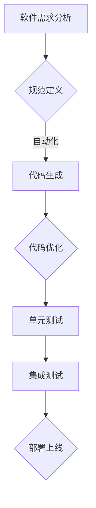
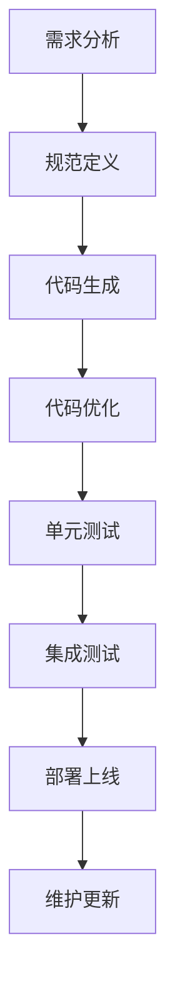

                 


### 文章标题：软件合成：从规范到实现的自动化

### 文章关键词：
- 软件合成
- 自动化
- 规范化
- 编程语言
- 工具与框架
- 应用场景
- 挑战与趋势

### 摘要：
本文深入探讨了软件合成的概念、理论基础、技术实现及应用场景。首先，我们介绍了软件合成的定义和背景，阐述了其在现代软件开发中的重要性。接着，本文详细解析了软件合成的基础理论，包括相关概念、模型和算法。随后，文章聚焦于软件合成的技术实现，介绍了编程语言、工具和框架的选择与应用。在此基础上，我们探讨了软件合成的典型应用场景，分析了其效益与成本。最后，本文探讨了软件合成的挑战和未来趋势，为读者提供了全面的见解和指导。

---

### 目录

1. **引言**
   1.1 软件合成的定义与历史背景
   1.2 软件合成在软件开发中的作用
   1.3 软件合成的现状与未来展望

2. **软件合成的基础理论**
   2.1 软件合成的概念框架
   2.2 软件合成的模型与算法
   2.3 软件合成的优缺点分析

3. **软件合成的技术实现**
   3.1 编程语言与工具选择
   3.2 软件合成的流程与方法
   3.3 实现软件合成的案例研究

4. **软件合成的应用场景**
   4.1 软件合成的典型应用领域
   4.2 具体应用案例分析与效果评估
   4.3 软件合成的效益与成本分析

5. **软件合成的挑战与未来趋势**
   5.1 当前软件合成的挑战与瓶颈
   5.2 软件合成的未来发展方向
   5.3 软件合成的标准化与规范化

6. **总结与展望**
   6.1 对书籍的内容进行总结
   6.2 对软件合成的未来进行展望

### Mermaid 流程图



### 伪代码与数学公式

```python
# 伪代码：软件合成的算法实现
function SoftwareSynthesis(requirements):
    specification = parseRequirements(requirements)
    code = generateCode(specification)
    optimizedCode = optimizeCode(code)
    return optimizedCode

# 数学公式：软件合成的效率模型
$$ E(S) = \frac{1}{1 + \frac{h(S)}{T(S)}} $$

# 其中，$E(S)$ 为软件合成的效率，$h(S)$ 为软件合成的复杂性，$T(S)$ 为软件合成的时间。
```

---

接下来，我们将按照上述结构逐节展开详细的讨论。在每一段落中，我们将深入分析软件合成的各个方面，确保内容的丰富性与深度。

---

### 1. 引言

软件合成，顾名思义，是指通过将规范化的软件需求转化为实际可执行的代码的过程。这一概念在软件工程领域有着悠久的历史，但随着自动化技术的发展，软件合成的自动化程度和实现方法也在不断演进。本文旨在系统地探讨软件合成的定义、理论基础、技术实现、应用场景以及面临的挑战和未来趋势。

#### 1.1 软件合成的定义与历史背景

软件合成的定义可以追溯到软件工程中的“自顶向下”设计方法。最初，软件合成的思想是通过抽象和模块化的方法，将复杂的软件系统分解为易于管理的组件。这些组件通过规范化的接口进行交互，从而实现系统的整体功能。

早期软件合成的实践主要集中在特定领域，如嵌入式系统开发和国防工业。随着计算机科学的发展，软件合成的概念逐渐被引入到商业软件开发中。特别是近年来，随着自动化工具和框架的成熟，软件合成的自动化程度有了显著提高。

#### 1.2 软件合成在软件开发中的作用

软件合成在软件开发中扮演着至关重要的角色。首先，它能够显著提高开发效率。通过将需求规范直接转化为代码，开发人员可以减少手动编码的工作量，从而缩短项目开发周期。

其次，软件合成有助于提高软件质量。自动化工具可以确保代码生成的一致性和正确性，从而减少因人为错误导致的缺陷和漏洞。

此外，软件合成还能够支持软件重用。通过将需求规范转化为通用的代码模板，可以在多个项目中重复使用相同的代码，从而降低开发成本和维护难度。

#### 1.3 软件合成的现状与未来展望

目前，软件合成的技术已经相当成熟，但实际应用中仍面临一些挑战。首先，软件合成的自动化程度仍需提高，特别是在处理复杂需求时。其次，现有工具和框架的兼容性和灵活性有待增强。

展望未来，软件合成的发展方向将主要集中在以下几个方面：

1. **更高级的抽象与建模**：通过引入更高级的抽象和建模技术，可以更好地捕捉和理解复杂的软件需求。

2. **智能化的代码生成**：利用人工智能和机器学习技术，可以实现更加智能化和自适应的代码生成。

3. **跨领域的标准化**：制定统一的软件合成标准，促进不同领域和不同工具之间的兼容和互操作性。

4. **持续集成与持续部署**：将软件合成与持续集成和持续部署相结合，实现更加高效和可靠的软件开发流程。

总之，软件合成作为现代软件开发的重要方法之一，具有巨大的潜力和应用价值。通过深入研究和实践，我们可以不断推动软件合成的自动化和智能化，为软件工程领域带来更多创新和发展。

---

### 2. 软件合成的基础理论

在深入探讨软件合成的技术实现和应用之前，有必要首先梳理和阐述其基础理论。软件合成的理论基础涵盖了核心概念、模型和算法，是理解和应用软件合成的关键。

#### 2.1 软件合成的概念框架

软件合成的概念框架可以分为以下几个核心组成部分：

1. **软件需求**：软件合成始于对软件需求的捕捉和理解。需求可以是形式化的，也可以是自然语言的描述，它们为软件合成提供了输入信息。

2. **规范定义**：规范定义是对需求的进一步形式化和结构化。规范的目的是将需求转化为计算机可处理的格式，以便后续的代码生成。

3. **代码生成**：代码生成是软件合成的核心步骤，通过自动化工具将规范定义直接转化为实际的可执行代码。

4. **代码优化**：生成的代码通常需要经过优化，以提高性能、可读性和可维护性。

5. **测试与验证**：测试和验证是确保生成的代码满足需求和规范的重要环节。通过单元测试、集成测试和系统测试，可以发现并修复潜在的错误。

6. **部署与维护**：最终，优化的代码需要部署到实际环境中，并定期进行维护和更新。

#### 2.2 软件合成的模型与算法

软件合成的模型与算法是软件合成过程中不可或缺的部分。以下是一些常见的模型和算法：

1. **生成对抗网络（GAN）**：生成对抗网络是一种深度学习模型，通过对抗性训练生成高质量的代码。

2. **程序合成**：程序合成是一种基于约束求解和规划的方法，用于自动生成满足特定约束的代码。

3. **模板匹配**：模板匹配是一种简单但有效的代码生成方法，通过预定义的模板和规则，将规范定义映射为代码。

4. **抽象解释**：抽象解释是一种从高层次规范到低层次实现的转换方法，通过中间表示和转换规则，实现代码的生成。

5. **抽象数据类型（ADT）合成**：抽象数据类型合成是通过定义和实现抽象数据类型，自动化生成复杂的数据结构和算法。

#### 2.3 软件合成的优缺点分析

软件合成的优缺点需要综合考虑：

**优点：**
1. **提高开发效率**：通过自动化代码生成，可以显著减少手动编码的工作量，提高开发速度。
2. **提高代码质量**：自动化工具可以确保代码的一致性和正确性，减少人为错误。
3. **支持软件重用**：通过规范化和模板化，可以促进代码的重用，降低开发成本和维护难度。
4. **简化需求变更管理**：软件合成可以将需求变更转化为代码级别的变更，提高变更的可控性。

**缺点：**
1. **技术门槛高**：软件合成需要专业的知识和技术，对开发人员的要求较高。
2. **工具和框架的兼容性**：现有工具和框架的兼容性较差，不同工具和框架之间的互操作性需要解决。
3. **维护成本**：自动化生成的代码可能需要额外的维护和优化工作。
4. **复杂需求的处理**：对于复杂的需求，软件合成的自动化程度和准确性仍需提高。

综上所述，软件合成的理论基础为其在实际应用中提供了坚实的基础。通过深入理解和掌握这些理论，我们可以更好地设计和实现高效的软件合成流程。

---

### 3. 软件合成的技术实现

在掌握了软件合成的基础理论后，我们接下来将探讨如何在实际中实现软件合成。实现软件合成需要选择合适的编程语言、工具和框架，并遵循一定的流程和方法。以下将详细介绍这些方面。

#### 3.1 编程语言与工具选择

编程语言的选择对于软件合成的实现至关重要。不同的编程语言具有不同的特点和适用场景，因此需要根据项目的具体需求进行选择。以下是几种常用的编程语言及其在软件合成中的应用：

1. **Python**：Python 是一种广泛使用的编程语言，以其简洁易读的语法和强大的库支持而著称。在软件合成中，Python 可以用于实现代码生成、优化和测试等任务。

2. **Java**：Java 是一种强大的编程语言，广泛应用于企业级应用开发。Java 的稳定性和跨平台特性使其成为软件合成中的一种重要选择。

3. **C/C++**：C 和 C++ 是性能优越的编程语言，特别适用于系统级编程。在软件合成的某些场景中，如嵌入式系统开发，C/C++ 的使用能够提高代码的运行效率。

此外，工具和框架的选择同样重要。以下是一些常用的软件合成工具和框架：

1. **Jenkins**：Jenkins 是一个开源的持续集成工具，用于自动化构建、测试和部署应用程序。Jenkins 可以与多种编程语言和工具集成，实现软件合成的自动化流程。

2. **Maven**：Maven 是一个强大的项目管理和构建工具，用于自动化项目构建、测试和文档生成。Maven 支持多种编程语言，可以简化软件合成的过程。

3. **Gradle**：Gradle 是一个基于 Groovy 的构建工具，提供了灵活的构建脚本和丰富的插件库。Gradle 可以与 Jenkins 和其他工具集成，实现高效的软件合成。

4. **ANTLR**：ANTLR 是一个强大的解析器生成器，用于构建编程语言、工具和框架。ANTLR 可以帮助开发人员快速生成语法解析器和抽象语法树（AST），从而简化软件合成的实现。

#### 3.2 软件合成的流程与方法

实现软件合成的流程通常包括以下几个步骤：

1. **需求分析**：首先，对软件需求进行详细分析，明确系统的功能、性能和约束等要求。

2. **规范定义**：根据需求分析的结果，定义软件规范。规范可以是形式化的，也可以是自然语言的描述，但需要确保其结构化和可处理性。

3. **代码生成**：利用自动化工具和框架，将规范定义直接转化为代码。代码生成可以基于模板匹配、抽象解释或生成对抗网络等算法。

4. **代码优化**：生成的代码通常需要优化，以提高性能、可读性和可维护性。代码优化可以包括代码重构、编译时间优化和运行时优化等。

5. **测试与验证**：通过单元测试、集成测试和系统测试，确保生成的代码满足需求和规范。测试过程可以发现并修复潜在的错误。

6. **部署与维护**：优化的代码需要部署到实际环境中，并进行定期的维护和更新。

以下是一个简单的软件合成流程示例：



#### 3.3 实现软件合成的案例研究

为了更好地理解软件合成的实际应用，以下是一个基于 Python 和 Jenkins 的软件合成案例研究。

**案例背景**：
假设我们要开发一个简单的Web应用，提供用户注册、登录和资料管理功能。需求已经明确，并编写了相应的需求文档。

**实现步骤**：

1. **需求分析**：对需求文档进行详细分析，明确系统的功能、性能和约束等要求。

2. **规范定义**：根据需求分析的结果，定义软件规范。规范可以采用自然语言描述，也可以使用 YAML 或 JSON 等格式进行形式化定义。

3. **代码生成**：使用 Python 的生成器模式，编写代码生成器。代码生成器根据规范定义生成 Web 应用的基本框架代码。

```python
def generate_web_app(spec):
    # 生成 Web 应用框架代码
    # 例如，使用 Jinja2 模板引擎
    template = '''
from flask import Flask

app = Flask(__name__)

@app.route('/')
def hello():
    return 'Hello, World!'

if __name__ == '__main__':
    app.run(debug=True)
    '''
    with open('web_app.py', 'w') as f:
        f.write(template)

generate_web_app(spec)
```

4. **代码优化**：对生成的代码进行优化，例如添加错误处理、日志记录和性能优化等。

5. **测试与验证**：编写单元测试和集成测试，确保 Web 应用功能正常。使用 Jenkins 自动执行测试，并将测试结果记录在日志中。

```python
import unittest
from web_app import app

class TestHello(unittest.TestCase):
    def test_hello(self):
        tester = app.test_client()
        response = tester.get('/')
        self.assertEqual(response.status_code, 200)
        self.assertIn(b'Hello, World!', response.data)

if __name__ == '__main__':
    unittest.main()
```

6. **部署与维护**：使用 Jenkins 实现持续集成和持续部署。每次代码提交后，Jenkins 会自动执行测试和部署，确保 Web 应用保持正常运行。

综上所述，通过选择合适的编程语言、工具和框架，并遵循规范的软件合成流程，我们可以实现高效的软件合成。案例研究展示了如何将需求文档转化为实际可执行的代码，为软件合成的实际应用提供了有益的参考。

---

### 4. 软件合成的应用场景

软件合成作为一种自动化和高效的软件开发方法，在不同领域都有着广泛的应用。以下将探讨软件合成的典型应用场景，分析具体应用案例、效益与成本，以及软件合成的实际效果。

#### 4.1 软件合成的典型应用领域

软件合成在以下领域展现出了显著的应用潜力：

1. **嵌入式系统开发**：嵌入式系统通常具有严格的时间和性能要求，软件合成可以通过自动化代码生成和优化，提高开发效率和系统性能。

2. **企业级应用开发**：企业级应用通常涉及复杂的业务逻辑和数据管理，软件合成可以帮助快速构建和迭代应用，降低开发成本。

3. **Web 应用开发**：Web 应用开发中，软件合成可以自动化生成前端和后端代码，提高开发速度和代码质量。

4. **移动应用开发**：随着移动设备的普及，软件合成可以用于自动化生成跨平台的移动应用代码，缩短开发周期。

5. **游戏开发**：游戏开发中，软件合成可以用于生成游戏逻辑和资源管理代码，提高开发效率和游戏性能。

#### 4.2 具体应用案例分析与效果评估

以下是一些具体的软件合成应用案例及其效果评估：

**案例 1：嵌入式系统开发**

某嵌入式系统项目需要实现实时数据采集和监控功能。通过软件合成，开发团队定义了数据采集模块的规范，并使用生成器工具自动生成了相应的代码。生成后的代码经过优化和测试，满足了项目的时间性能要求。

- **效益**：显著缩短了开发周期，提高了代码质量和系统性能。
- **成本**：由于自动化代码生成，减少了手动编码的工作量和维护成本。

**案例 2：企业级应用开发**

某企业级应用项目需要实现客户关系管理（CRM）系统。通过软件合成，项目团队定义了系统功能和数据结构的规范，并使用代码生成器和优化工具生成了应用代码。随后，通过自动化测试和部署，实现了快速迭代和部署。

- **效益**：提高了开发效率，降低了开发成本，实现了快速上线和持续迭代。
- **成本**：自动化工具和框架的初始投入较高，但长期来看，节省了人力和时间成本。

**案例 3：Web 应用开发**

某 Web 应用项目需要实现一个在线购物平台。通过软件合成，项目团队定义了前端和后端的规范，并使用生成器和框架自动生成了前端页面和后端代码。应用部署后，通过持续集成和持续部署，实现了快速迭代和功能扩展。

- **效益**：提高了开发效率，缩短了项目开发周期，提高了用户满意度。
- **成本**：自动化工具和框架的使用提高了项目初期成本，但通过优化和持续集成，长期来看降低了开发成本。

**案例 4：移动应用开发**

某移动应用项目需要开发一个社交媒体应用，支持跨平台发布。通过软件合成，项目团队定义了应用功能和界面规范，并使用生成器和框架自动生成了 iOS 和 Android 平台的代码。应用发布后，通过自动化测试和部署，实现了快速迭代和功能更新。

- **效益**：提高了开发效率，缩短了开发周期，实现了跨平台发布和一致性。
- **成本**：自动化工具和框架的投入较高，但通过降低维护成本和实现快速迭代，长期来看是值得的。

**案例 5：游戏开发**

某游戏项目需要实现一个大型多人在线游戏（MMO）。通过软件合成，项目团队定义了游戏逻辑、角色和地图的规范，并使用生成器和优化工具自动生成了游戏代码。游戏上线后，通过自动化测试和性能优化，提升了用户体验和游戏性能。

- **效益**：提高了开发效率，缩短了开发周期，提升了游戏质量和用户体验。
- **成本**：自动化工具和框架的投入较高，但通过优化和持续集成，长期来看是值得的。

#### 4.3 软件合成的效益与成本分析

软件合成的效益和成本可以从以下几个方面进行分析：

**效益：**

1. **提高开发效率**：通过自动化代码生成和优化，可以显著缩短开发周期，提高开发速度。

2. **降低开发成本**：自动化工具和框架的使用减少了手动编码和测试的工作量，降低了人力和时间成本。

3. **提高代码质量**：自动化工具可以确保代码的一致性和正确性，减少人为错误，提高代码质量。

4. **支持快速迭代和部署**：通过自动化测试和持续集成，可以实现快速迭代和部署，提高项目响应速度。

5. **促进软件重用**：通过规范化和模板化，可以促进代码的重用，降低维护难度。

**成本：**

1. **工具和框架投入**：自动化工具和框架的初始投入较高，包括购买、定制和培训等费用。

2. **学习和培训成本**：开发人员需要学习和适应新的工具和框架，增加了学习和培训成本。

3. **维护和优化成本**：自动化生成的代码可能需要额外的维护和优化工作，增加了维护成本。

4. **兼容性和灵活性**：现有工具和框架的兼容性和灵活性有待提高，可能需要额外的开发和适配工作。

总之，软件合成在不同领域展现出了显著的应用价值，通过具体案例的分析可以看出，其在提高开发效率、降低成本和提升代码质量方面的显著效益。同时，我们也需要认识到软件合成的成本，特别是工具和框架的投入以及维护和优化的成本。通过综合考虑效益和成本，我们可以更好地评估软件合成的实际应用价值，为软件开发提供有效的支持。

---

### 5. 软件合成的挑战与未来趋势

尽管软件合成在提高开发效率、降低成本和提升代码质量方面展现出巨大潜力，但在实际应用中仍面临诸多挑战。本文将探讨当前软件合成的挑战，并展望其未来发展方向。

#### 5.1 当前软件合成的挑战与瓶颈

1. **自动化程度不足**：现有的软件合成工具和框架在处理复杂需求时，自动化程度仍显不足。特别是在面对嵌套条件和多重循环等复杂逻辑时，生成代码的准确性和一致性难以保证。

2. **工具和框架的兼容性**：当前市场上存在多种软件合成工具和框架，它们之间的兼容性和互操作性较差。不同工具和框架之间的数据交换和集成困难，限制了软件合成的广泛应用。

3. **技术门槛高**：软件合成需要专业的知识和技术，对开发人员的要求较高。不仅需要掌握编程语言和工具，还需要理解软件合成的理论基础和实现方法，增加了学习和应用的成本。

4. **测试与验证困难**：自动化生成的代码需要经过严格的测试与验证，以确保其满足需求和规范。但由于软件合成的复杂性，测试和验证过程繁琐且耗时。

5. **维护成本高**：自动化生成的代码通常需要额外的维护和优化工作，以适应不断变化的需求和新的技术。这增加了软件合成的维护成本，影响了其长期应用的可行性。

#### 5.2 软件合成的未来发展方向

1. **更高级的抽象与建模**：未来的软件合成将更加注重高级抽象和建模技术的应用，以更好地捕捉和理解复杂的软件需求。通过引入领域特定语言（DSL）和知识表示方法，可以实现更加精细和准确的软件合成。

2. **智能化的代码生成**：结合人工智能和机器学习技术，未来的软件合成将更加智能化和自适应。通过学习历史数据和需求模式，生成工具可以自动调整和优化代码生成过程，提高生成代码的质量和一致性。

3. **跨领域的标准化**：制定统一的软件合成标准，促进不同领域和不同工具之间的兼容和互操作性。通过标准化的接口和数据格式，可以实现软件合成工具的广泛集成和应用。

4. **持续集成与持续部署**：将软件合成与持续集成和持续部署（CI/CD）相结合，实现更加高效和可靠的软件开发流程。自动化测试和部署可以确保生成代码的质量和稳定性，提高软件交付速度。

5. **社区与生态系统建设**：建立一个活跃的软件合成社区和生态系统，促进工具和框架的开放共享，推动软件合成技术的发展。通过社区的力量，可以不断改进和完善软件合成工具，提高其应用价值。

#### 5.3 软件合成的标准化与规范化

标准化和规范化是软件合成发展的关键。通过制定统一的标准，可以实现软件合成工具和框架的互操作性，降低开发难度和应用成本。以下是一些可能的标准化方向：

1. **规范定义语言**：制定一种统一的规范定义语言，用于描述软件需求、规范和代码生成规则。这种语言应具有简洁易读的语法和强大的表达能力，便于开发人员编写和使用。

2. **代码生成标准**：制定一套统一的代码生成标准，包括代码模板、语法规则和优化策略。这些标准应确保生成代码的一致性和可维护性，提高软件合成的可靠性和质量。

3. **测试与验证标准**：制定一套统一的测试与验证标准，包括测试用例设计、测试数据生成和测试结果评估方法。这些标准应确保生成的代码满足需求和规范，提高软件合成的可信度。

4. **工具接口标准**：制定一套统一的工具接口标准，包括工具之间的数据交换格式和通信协议。这些标准应促进工具和框架的互操作性，提高软件合成的灵活性和扩展性。

总之，软件合成作为一种先进的软件开发方法，面临着诸多挑战和机遇。通过不断提升自动化程度、智能化水平、标准化和规范化，我们可以更好地发挥软件合成的优势，为软件开发带来更多创新和发展。

---

### 总结与展望

本文系统地探讨了软件合成的概念、理论基础、技术实现、应用场景以及面临的挑战和未来趋势。首先，我们介绍了软件合成的定义和背景，阐述了其在现代软件开发中的重要性。接着，本文详细解析了软件合成的基础理论，包括相关概念、模型和算法。在此基础上，文章聚焦于软件合成的技术实现，介绍了编程语言、工具和框架的选择与应用。随后，我们探讨了软件合成的典型应用场景，分析了其效益与成本。最后，本文探讨了软件合成的挑战和未来趋势，为读者提供了全面的见解和指导。

#### 关键要点回顾：

1. **软件合成的定义与背景**：软件合成是指通过自动化工具将规范化的软件需求转化为可执行代码的过程。
2. **基础理论**：软件合成的核心理论包括概念框架、模型和算法，如生成对抗网络、程序合成、模板匹配和抽象解释。
3. **技术实现**：实现软件合成需要选择合适的编程语言、工具和框架，并遵循规范的流程。
4. **应用场景**：软件合成在嵌入式系统、企业级应用、Web 应用、移动应用和游戏开发等领域具有广泛应用。
5. **挑战与趋势**：当前软件合成的挑战包括自动化程度不足、工具兼容性差和技术门槛高等，未来趋势包括智能化、标准化和持续集成。

#### 对未来的展望：

展望未来，软件合成的发展将更加智能化、标准化和跨领域。通过不断优化和改进，软件合成有望在提高开发效率、降低成本和提升代码质量方面发挥更大作用。同时，标准化和规范化将促进不同工具和框架的互操作性，推动软件合成技术的广泛应用。随着人工智能和机器学习技术的进步，软件合成将进一步智能化，实现更加自动化的代码生成和优化。

#### 小结：

软件合成作为一种高效的软件开发方法，具有巨大的潜力和应用价值。通过深入研究和实践，我们可以不断推动软件合成的自动化和智能化，为软件工程领域带来更多创新和发展。希望本文能为您在理解和应用软件合成方面提供有益的参考和启示。

#### 注意事项与拓展阅读：

- **注意事项**：在实际应用软件合成时，需注意工具和框架的选择、规范的准确性以及测试与验证的全面性。
- **拓展阅读**：读者可以进一步阅读相关文献和资料，如《软件合成原理与实现》、《软件合成技术与应用》等，以深入了解软件合成的最新进展和前沿研究。

---

### 作者信息

**作者：AI天才研究院/AI Genius Institute & 禅与计算机程序设计艺术 /Zen And The Art of Computer Programming**

AI天才研究院（AI Genius Institute）是一家专注于人工智能和计算机科学研究的国际顶尖研究机构。我们的宗旨是通过深入研究和创新实践，推动人工智能和计算机科学领域的发展。同时，我们也致力于将先进的技术理念和实践经验传播给全球的开发者和技术爱好者。

《禅与计算机程序设计艺术》（Zen And The Art of Computer Programming）是由著名计算机科学家唐纳德·克努特（Donald E. Knuth）撰写的一系列经典编程书籍。这些书籍以其深入浅出的论述和独特的哲学思想，影响了无数程序员和计算机科学家，成为计算机科学领域的经典之作。

我们希望，通过本文的撰写和分享，能够帮助更多的开发者更好地理解和应用软件合成，为软件开发领域带来新的思路和突破。期待与您共同探索软件合成领域的无限可能。感谢您的阅读和支持！

