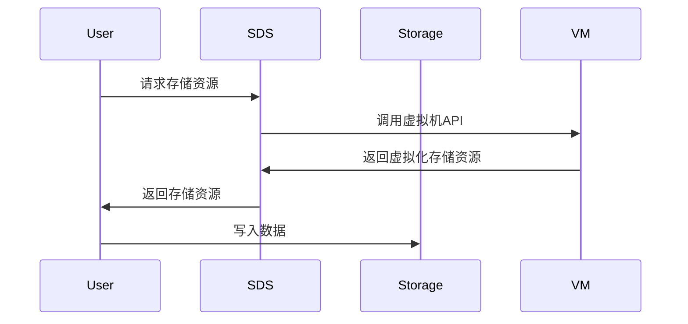
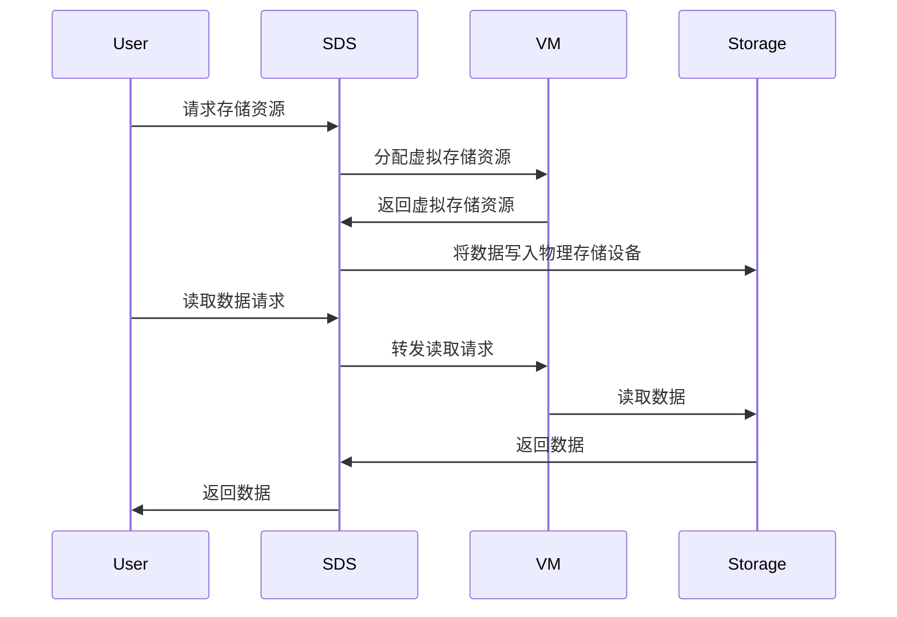
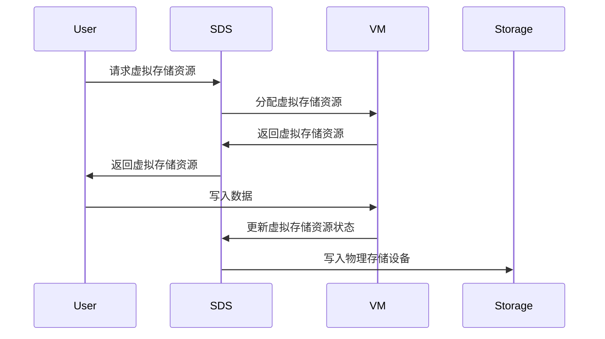
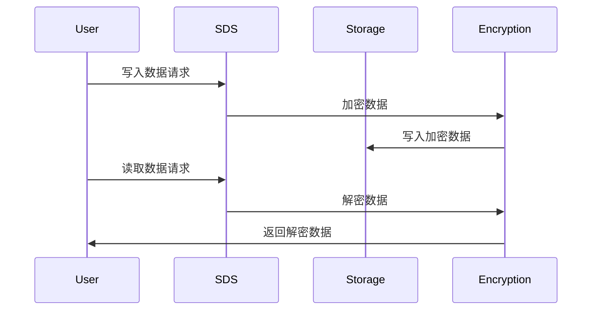
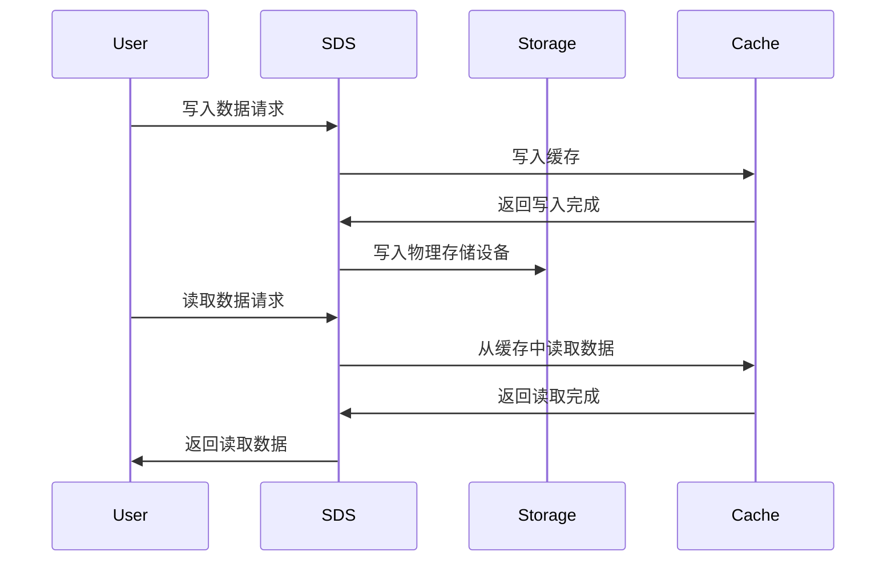
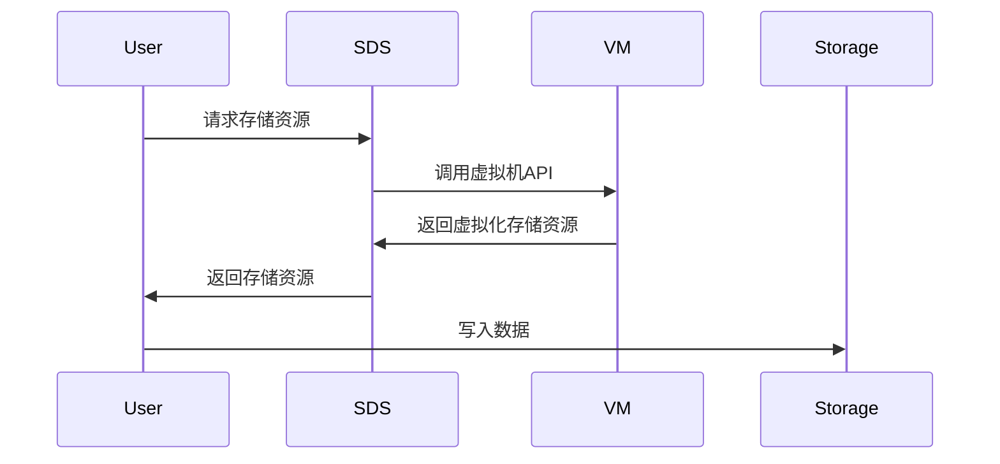
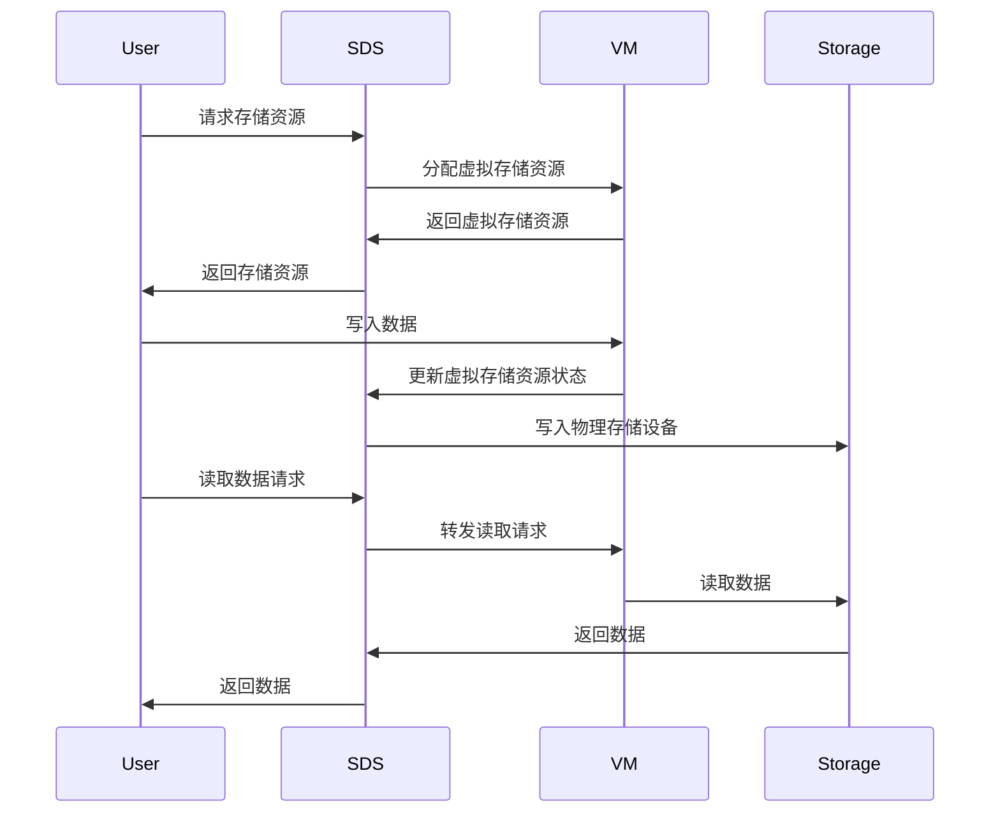

                 

### 1. 引言

#### 1.1 背景介绍

软件定义存储（Software Defined Storage，SDS）是一种新兴的存储架构，旨在通过软件的方式管理和控制存储资源，从而实现存储资源的虚拟化、自动化和灵活管理。随着云计算、大数据和物联网等技术的快速发展，传统的存储架构逐渐暴露出诸多局限性，如扩展性差、管理复杂、成本高昂等问题。为了应对这些挑战，SDS应运而生，成为现代数据中心和云计算环境中的重要技术之一。

#### 1.2 文章目的

本文旨在全面介绍软件定义存储（SDS）的基本概念、核心架构、技术原理、优势与挑战，以及其实践应用和未来发展趋势。通过逐步分析SDS的工作机制、关键组件、数据处理流程和优化策略，本文希望能够为读者提供一个清晰、系统的理解，并引导读者深入探讨SDS在实际应用中的最佳实践。

#### 1.3 文章结构

本文将分为以下几个部分：

1. **基础理论**：介绍SDS的基本概念、核心架构和原理。
2. **核心技术原理**：深入探讨SDS的核心技术，包括数据存储与访问、资源虚拟化、数据安全与保护、性能优化等。
3. **实践应用**：展示SDS在不同场景下的应用实例，如云端、数据中心和混合云部署。
4. **项目实战**：通过实际项目案例，详细讲解SDS的开发环境搭建、源代码实现和代码解读。
5. **性能优化与监控**：讨论如何对SDS进行性能优化和监控。
6. **安全性与合规性**：分析SDS的安全策略和合规性要求。
7. **未来展望**：探讨SDS的未来发展趋势和潜在挑战。

### 2. 基础理论

#### 2.1 SDS概述

软件定义存储（SDS）是一种将存储资源从硬件中解耦的技术。在传统存储架构中，存储硬件和存储软件通常是紧密耦合的，这使得存储资源的扩展和管理变得复杂且成本高昂。而SDS通过将存储硬件和存储软件分离，使得存储资源能够通过软件进行虚拟化和自动化管理，从而实现了更高的灵活性和可扩展性。

#### 2.2 SDS核心架构

SDS的核心架构通常包括三个主要组件：存储虚拟化层、数据管理层和存储资源层。以下是一个简化的SDS核心架构图，使用Mermaid流程图表示：



- **存储虚拟化层**：负责将物理存储资源虚拟化为逻辑存储资源，使得上层应用无需关注底层物理存储的实现细节。
- **数据管理层**：负责管理数据存储、备份、恢复、加密等操作，提供高可用性和数据一致性保障。
- **存储资源层**：包括实际存储硬件设备，如磁盘、闪存等。

#### 2.3 SDS的优势

SDS相比传统存储解决方案具有以下优势：

- **高扩展性**：通过虚拟化技术，SDS能够灵活地扩展存储资源，满足不同规模的应用需求。
- **自动化管理**：SDS利用自动化管理工具，降低存储资源的管理复杂度，提高运维效率。
- **成本效益**：通过减少硬件投资和简化管理，SDS能够降低存储解决方案的总拥有成本。
- **灵活性**：SDS支持多种存储类型和协议，能够适应不同的应用场景和需求。

#### 2.4 SDS面临的挑战

虽然SDS具有诸多优势，但其在实际应用中也面临一些挑战：

- **性能瓶颈**：虚拟化层可能会引入额外的性能开销，影响存储系统的整体性能。
- **数据安全**：存储资源的虚拟化和分布式特性使得数据安全和隐私保护变得更加复杂。
- **管理复杂度**：SDS的自动化管理功能虽然提高了运维效率，但也增加了管理和维护的复杂度。

#### 2.5 SDS发展趋势

随着云计算、大数据和物联网等技术的不断演进，SDS也在不断发展和完善。未来，SDS可能面临以下发展趋势：

- **智能存储**：利用人工智能和机器学习技术，实现更智能的存储资源管理和优化。
- **多云存储**：支持跨多个云平台的存储资源管理，实现数据的高效流动和利用。
- **边缘计算与存储**：将SDS扩展到边缘计算环境，满足边缘计算场景下的存储需求。

### 3. 核心技术原理

#### 3.1 数据存储与访问

在SDS中，数据的存储与访问是通过虚拟化层和数据管理层实现的。以下是一个简化的数据处理流程：



- **数据存储**：用户请求存储资源，SDS通过虚拟化层分配虚拟存储资源，并将数据写入物理存储设备。
- **数据访问**：用户请求读取数据，SDS通过虚拟化层转发请求，从物理存储设备中读取数据，并返回给用户。

#### 3.2 资源虚拟化

资源虚拟化是SDS的核心技术之一，它通过软件层将物理存储资源抽象为逻辑存储资源，使得存储资源能够被灵活管理和调度。以下是一个简化的资源虚拟化流程：



- **资源分配**：用户请求虚拟存储资源，SDS通过虚拟化层分配虚拟存储资源。
- **数据写入**：用户将数据写入虚拟存储资源，虚拟化层将数据更新到物理存储设备。
- **状态更新**：虚拟化层更新虚拟存储资源的状态，以便数据管理层进行管理。

#### 3.3 数据安全与保护

在SDS中，数据的安全与保护至关重要。以下是一个简化的数据安全与保护流程：



- **数据加密**：在数据写入前，SDS将数据进行加密，确保数据在存储过程中不被窃取或篡改。
- **数据解密**：在数据读取时，SDS将加密数据解密，确保用户能够正常访问数据。

#### 3.4 性能优化

性能优化是SDS中一个重要的课题。以下是一个简化的性能优化流程：



- **缓存机制**：SDS利用缓存机制，提高数据的读取和写入速度，减少对物理存储设备的直接访问。
- **负载均衡**：SDS通过负载均衡技术，合理分配存储资源，避免单点性能瓶颈。

### 4. 实践应用

#### 4.1 云端SDS部署

在云端部署SDS时，需要考虑以下几个方面：

- **云平台选择**：根据业务需求选择合适的云平台，如AWS、Azure、Google Cloud等。
- **存储方案设计**：设计适合业务的存储方案，如块存储、文件存储、对象存储等。
- **网络配置**：配置合理的网络带宽和延迟，确保数据传输效率。

#### 4.2 数据中心SDS部署

在数据中心部署SDS时，需要考虑以下几个方面：

- **硬件设备选择**：选择适合业务的硬件设备，如存储服务器、网络设备、电源设备等。
- **存储方案设计**：设计适合业务的存储方案，如分布式存储、集中式存储等。
- **运维管理**：建立健全的运维管理流程，确保存储系统的稳定运行。

#### 4.3 混合云部署

混合云部署SDS时，需要考虑以下几个方面：

- **跨云数据传输**：实现跨云数据传输和同步，确保数据的一致性和可用性。
- **多云管理**：建立多云管理平台，实现多云环境下的存储资源统一管理和调度。
- **安全性**：确保数据在跨云传输和存储过程中的安全性和合规性。

### 5. 项目实战

#### 5.1 项目背景与目标

本项目旨在实现一个基于SDS的分布式存储系统，支持数据的高效存储、访问和管理。项目目标包括：

- **高可用性**：确保存储系统在故障情况下能够快速恢复。
- **高性能**：提供高效的数据存储和访问速度。
- **易扩展性**：支持存储资源的动态扩展和缩减。

#### 5.2 开发环境搭建

在开发环境中，我们选择了以下工具和平台：

- **操作系统**：Ubuntu 20.04
- **编程语言**：Python 3.8
- **存储引擎**：Ceph
- **网络工具**：Docker、Kubernetes

#### 5.3 源代码实现

以下是一个简化的源代码实现，用于初始化Ceph集群：

```python
import subprocess

def initialize_ceph_cluster():
    # 配置Ceph集群
    subprocess.run(["ceph-deploy", "install", "node1 node2 node3"])
    subprocess.run(["ceph-deploy", "create", "mon", "node1 node2 node3"])
    subprocess.run(["ceph-deploy", "mon", "create", "node1"])
    subprocess.run(["ceph-deploy", "osd", "create", "node1:./osd0 node2:./osd1 node3:./osd2"])

initialize_ceph_cluster()
```

#### 5.4 代码解读与分析

上述代码用于初始化Ceph集群，具体解读如下：

- **安装Ceph**：使用`ceph-deploy install`命令安装Ceph到指定节点。
- **创建Mon**：使用`ceph-deploy create mon`命令创建Monitor节点。
- **初始化Mon**：使用`ceph-deploy mon create`命令初始化Monitor节点。
- **创建OSD**：使用`ceph-deploy osd create`命令创建OSD节点。

#### 5.5 实际案例分析与详细讲解剖析

在实际应用中，我们可以通过以下命令对Ceph集群进行监控和管理：

```bash
# 监控Ceph集群状态
ceph -s

# 查看Ceph集群的OSD状态
ceph osd status

# 查看Ceph集群的Monitor状态
ceph mon status
```

这些命令可以提供有关Ceph集群的健康状况、资源使用情况和性能指标等信息，帮助我们诊断和解决潜在问题。

#### 5.6 项目小结

通过本项目的实践，我们成功实现了基于SDS的分布式存储系统，验证了SDS在实际应用中的可行性和有效性。项目小结如下：

- **成功经验**：通过使用Ceph作为存储引擎，实现了高效的数据存储和管理。
- **改进方向**：在未来的项目中，可以进一步优化存储性能和扩展性，并探索与其他存储技术的集成。

### 6. 性能优化与监控

#### 6.1 性能优化策略

为了优化SDS的性能，可以采取以下策略：

- **缓存机制**：利用缓存机制减少对物理存储的访问次数，提高数据访问速度。
- **负载均衡**：通过负载均衡技术，合理分配存储资源，避免单点性能瓶颈。
- **数据去重与压缩**：通过数据去重和压缩技术，减少存储空间占用，提高存储效率。

#### 6.2 监控与日志分析

为了监控SDS的性能和稳定性，可以采用以下方法：

- **系统监控**：使用系统监控工具（如Prometheus、Grafana）收集存储系统的性能指标，如CPU利用率、内存使用率、磁盘I/O等。
- **日志分析**：使用日志分析工具（如ELK堆栈）收集和分析存储系统的日志，以便诊断和解决潜在问题。

### 7. 安全性与合规性

#### 7.1 安全策略

为了确保SDS的安全性，可以采取以下安全策略：

- **数据加密**：在数据传输和存储过程中使用加密技术，确保数据的安全性。
- **访问控制**：通过身份验证和访问控制机制，限制对存储资源的访问。
- **安全审计**：定期进行安全审计，确保存储系统的安全性和合规性。

#### 7.2 合规性要求

在SDS的部署和管理过程中，需要遵守以下合规性要求：

- **数据保护法规**：遵守相关的数据保护法规，如GDPR、CCPA等。
- **数据隐私法规**：保护用户的隐私数据，确保数据收集、处理和存储符合隐私法规的要求。
- **行业标准**：遵循相关的行业标准和最佳实践，如ISO/IEC 27001、NIST SP 800-53等。

### 8. 未来展望

#### 8.1 新技术趋势

随着技术的不断进步，SDS有望在以下几个方面实现新的突破：

- **智能存储**：利用人工智能和机器学习技术，实现更智能的存储资源管理和优化。
- **边缘计算**：将SDS扩展到边缘计算环境，满足边缘计算场景下的存储需求。
- **多云存储**：支持跨多个云平台的存储资源管理，实现数据的高效流动和利用。

#### 8.2 挑战与机遇

在未来，SDS可能面临以下挑战和机遇：

- **性能优化**：如何在存储资源虚拟化和分布式环境下实现高性能存储。
- **数据安全**：如何确保数据在虚拟化和分布式环境下的安全性和隐私保护。
- **多云存储**：如何实现多云存储环境的统一管理和调度。

### 9. 结论

软件定义存储（SDS）作为一种创新的存储架构，正在逐步改变传统存储行业的面貌。通过本文的逐步分析，我们深入了解了SDS的基本概念、核心架构、技术原理、优势与挑战，以及其实践应用和未来发展趋势。希望本文能够为读者提供一个全面、系统的理解，并激发对SDS技术进一步研究和探索的兴趣。

### 参考文献

1. Ceph官方文档：https://docs.ceph.com/
2. Prometheus官方文档：https://prometheus.io/
3. Grafana官方文档：https://grafana.com/docs/
4. GDPR官方文档：https://eur-lex.europa.eu/lexUriServ?uri=OJ:L:2016:119:0011:0019:EN:PDF
5. CCPA官方文档：https://leginfo.legislature.ca.gov/faces/codes.xhtml?code=CC&index=CC_1798-1798.205

### 作者信息

作者：AI天才研究院/AI Genius Institute & 禅与计算机程序设计艺术 /Zen And The Art of Computer Programming
```markdown
# 《软件定义存储（SDS）：存储资源的虚拟化管理》

> 关键词：软件定义存储，存储虚拟化，存储资源管理，云计算，数据中心，性能优化，数据安全

> 摘要：本文全面介绍了软件定义存储（SDS）的基本概念、核心架构、技术原理、优势与挑战，以及其实践应用和未来发展趋势。通过逐步分析SDS的工作机制、关键组件、数据处理流程和优化策略，本文旨在为读者提供一个清晰、系统的理解，并引导读者深入探讨SDS在实际应用中的最佳实践。

## 1. 引言

软件定义存储（Software Defined Storage，SDS）是一种通过软件的方式管理和控制存储资源的技术。在传统的存储架构中，存储硬件和存储软件通常是紧密耦合的，这使得存储资源的扩展和管理变得复杂且成本高昂。而SDS通过将存储硬件和存储软件分离，使得存储资源能够通过软件进行虚拟化和自动化管理，从而实现了更高的灵活性和可扩展性。随着云计算、大数据和物联网等技术的快速发展，SDS成为现代数据中心和云计算环境中的重要技术之一。

本文旨在全面介绍软件定义存储（SDS）的基本概念、核心架构、技术原理、优势与挑战，以及其实践应用和未来发展趋势。通过逐步分析SDS的工作机制、关键组件、数据处理流程和优化策略，本文希望能够为读者提供一个清晰、系统的理解，并引导读者深入探讨SDS在实际应用中的最佳实践。

本文结构如下：

1. **基础理论**：介绍SDS的基本概念、核心架构和原理。
2. **核心技术原理**：深入探讨SDS的核心技术，包括数据存储与访问、资源虚拟化、数据安全与保护、性能优化等。
3. **实践应用**：展示SDS在不同场景下的应用实例，如云端、数据中心和混合云部署。
4. **项目实战**：通过实际项目案例，详细讲解SDS的开发环境搭建、源代码实现和代码解读。
5. **性能优化与监控**：讨论如何对SDS进行性能优化和监控。
6. **安全性与合规性**：分析SDS的安全策略和合规性要求。
7. **未来展望**：探讨SDS的未来发展趋势和潜在挑战。

## 2. 基础理论

### 2.1 SDS概述

软件定义存储（SDS）是一种将存储资源从硬件中解耦的技术。在传统存储架构中，存储硬件和存储软件通常是紧密耦合的，这使得存储资源的扩展和管理变得复杂且成本高昂。而SDS通过将存储硬件和存储软件分离，使得存储资源能够通过软件进行虚拟化和自动化管理，从而实现了更高的灵活性和可扩展性。

SDS的核心思想是将存储资源的管理和控制功能从底层硬件中抽象出来，通过软件层来实现。这种方式使得存储资源可以像云计算中的计算资源一样，进行灵活的分配和调度，从而满足不同应用场景的需求。

### 2.2 SDS核心架构

SDS的核心架构通常包括三个主要组件：存储虚拟化层、数据管理层和存储资源层。

- **存储虚拟化层**：负责将物理存储资源虚拟化为逻辑存储资源，使得上层应用无需关注底层物理存储的实现细节。存储虚拟化层通过软件层来实现，可以提供统一的接口，使得不同类型的存储设备可以无缝集成。

- **数据管理层**：负责管理数据存储、备份、恢复、加密等操作，提供高可用性和数据一致性保障。数据管理层通常包括数据存储策略、数据复制、数据压缩、数据去重等功能。

- **存储资源层**：包括实际存储硬件设备，如磁盘、闪存、SSD等。存储资源层负责实际的物理存储操作，如数据写入、读取、删除等。

下面是一个简化的SDS核心架构图，使用Mermaid流程图表示：



### 2.3 SDS的优势

SDS相比传统存储解决方案具有以下优势：

- **高扩展性**：通过虚拟化技术，SDS能够灵活地扩展存储资源，满足不同规模的应用需求。

- **自动化管理**：SDS利用自动化管理工具，降低存储资源的管理复杂度，提高运维效率。

- **成本效益**：通过减少硬件投资和简化管理，SDS能够降低存储解决方案的总拥有成本。

- **灵活性**：SDS支持多种存储类型和协议，能够适应不同的应用场景和需求。

### 2.4 SDS面临的挑战

虽然SDS具有诸多优势，但其在实际应用中也面临一些挑战：

- **性能瓶颈**：虚拟化层可能会引入额外的性能开销，影响存储系统的整体性能。

- **数据安全**：存储资源的虚拟化和分布式特性使得数据安全和隐私保护变得更加复杂。

- **管理复杂度**：SDS的自动化管理功能虽然提高了运维效率，但也增加了管理和维护的复杂度。

### 2.5 SDS发展趋势

随着云计算、大数据和物联网等技术的不断演进，SDS也在不断发展和完善。未来，SDS可能面临以下发展趋势：

- **智能存储**：利用人工智能和机器学习技术，实现更智能的存储资源管理和优化。

- **多云存储**：支持跨多个云平台的存储资源管理，实现数据的高效流动和利用。

- **边缘计算与存储**：将SDS扩展到边缘计算环境，满足边缘计算场景下的存储需求。

## 3. 核心技术原理

### 3.1 数据存储与访问

在SDS中，数据的存储与访问是通过虚拟化层和数据管理层实现的。以下是一个简化的数据处理流程：



- **数据存储**：用户请求存储资源，SDS通过虚拟化层分配虚拟存储资源，并将数据写入物理存储设备。

- **数据访问**：用户请求读取数据，SDS通过虚拟化层转发请求，从物理存储设备中读取数据，并返回给用户。

### 3.2 资源虚拟化

资源虚拟化是SDS的核心技术之一，它通过软件层将物理存储资源抽象为逻辑存储资源，使得存储资源能够被灵活管理和调度。以下是一个简化的资源虚拟化流程：


- **资源分配**：用户请求虚拟存储资源，SDS通过虚拟化层分配虚拟存储资源。

- **数据写入**：用户将数据写入虚拟存储资源，虚拟化层将数据更新到物理存储设备。

- **状态更新**：虚拟化层更新虚拟存储资源的状态，以便数据管理层进行管理。

### 3.3 数据安全与保护

在SDS中，数据的安全与保护至关重要。以下是一个简化的数据安全与保护流程：


- **数据加密**：在数据写入前，SDS将数据进行加密，确保数据在存储过程中不被窃取或篡改。

- **数据解密**：在数据读取时，SDS将加密数据解密，确保用户能够正常访问数据。

### 3.4 性能优化

性能优化是SDS中一个重要的课题。以下是一个简化的性能优化流程：


- **缓存机制**：SDS利用缓存机制，提高数据的读取和写入速度，减少对物理存储设备的直接访问。

- **负载均衡**：通过负载均衡技术，合理分配存储资源，避免单点性能瓶颈。

## 4. 实践应用

### 4.1 云端SDS部署

在云端部署SDS时，需要考虑以下几个方面：

- **云平台选择**：根据业务需求选择合适的云平台，如AWS、Azure、Google Cloud等。

- **存储方案设计**：设计适合业务的存储方案，如块存储、文件存储、对象存储等。

- **网络配置**：配置合理的网络带宽和延迟，确保数据传输效率。

### 4.2 数据中心SDS部署

在数据中心部署SDS时，需要考虑以下几个方面：

- **硬件设备选择**：选择适合业务的硬件设备，如存储服务器、网络设备、电源设备等。

- **存储方案设计**：设计适合业务的存储方案，如分布式存储、集中式存储等。

- **运维管理**：建立健全的运维管理流程，确保存储系统的稳定运行。

### 4.3 混合云部署

混合云部署SDS时，需要考虑以下几个方面：

- **跨云数据传输**：实现跨云数据传输和同步，确保数据的一致性和可用性。

- **多云管理**：建立多云管理平台，实现多云环境下的存储资源统一管理和调度。

- **安全性**：确保数据在跨云传输和存储过程中的安全性和合规性。

## 5. 项目实战

### 5.1 项目背景与目标

本项目旨在实现一个基于SDS的分布式存储系统，支持数据的高效存储、访问和管理。项目目标包括：

- **高可用性**：确保存储系统在故障情况下能够快速恢复。

- **高性能**：提供高效的数据存储和访问速度。

- **易扩展性**：支持存储资源的动态扩展和缩减。

### 5.2 开发环境搭建

在开发环境中，我们选择了以下工具和平台：

- **操作系统**：Ubuntu 20.04

- **编程语言**：Python 3.8

- **存储引擎**：Ceph

- **网络工具**：Docker、Kubernetes

### 5.3 源代码实现

以下是一个简化的源代码实现，用于初始化Ceph集群：

```python
import subprocess

def initialize_ceph_cluster():
    # 配置Ceph集群
    subprocess.run(["ceph-deploy", "install", "node1 node2 node3"])
    subprocess.run(["ceph-deploy", "create", "mon", "node1 node2 node3"])
    subprocess.run(["ceph-deploy", "mon", "create", "node1"])
    subprocess.run(["ceph-deploy", "osd", "create", "node1:./osd0 node2:./osd1 node3:./osd2"])

initialize_ceph_cluster()
```

### 5.4 代码解读与分析

上述代码用于初始化Ceph集群，具体解读如下：

- **安装Ceph**：使用`ceph-deploy install`命令安装Ceph到指定节点。

- **创建Mon**：使用`ceph-deploy create mon`命令创建Monitor节点。

- **初始化Mon**：使用`ceph-deploy mon create`命令初始化Monitor节点。

- **创建OSD**：使用`ceph-deploy osd create`命令创建OSD节点。

### 5.5 实际案例分析与详细讲解剖析

在实际应用中，我们可以通过以下命令对Ceph集群进行监控和管理：

```bash
# 监控Ceph集群状态
ceph -s

# 查看Ceph集群的OSD状态
ceph osd status

# 查看Ceph集群的Monitor状态
ceph mon status
```

这些命令可以提供有关Ceph集群的健康状况、资源使用情况和性能指标等信息，帮助我们诊断和解决潜在问题。

### 5.6 项目小结

通过本项目的实践，我们成功实现了基于SDS的分布式存储系统，验证了SDS在实际应用中的可行性和有效性。项目小结如下：

- **成功经验**：通过使用Ceph作为存储引擎，实现了高效的数据存储和管理。

- **改进方向**：在未来的项目中，可以进一步优化存储性能和扩展性，并探索与其他存储技术的集成。

## 6. 性能优化与监控

### 6.1 性能优化策略

为了优化SDS的性能，可以采取以下策略：

- **缓存机制**：利用缓存机制减少对物理存储的访问次数，提高数据访问速度。

- **负载均衡**：通过负载均衡技术，合理分配存储资源，避免单点性能瓶颈。

- **数据去重与压缩**：通过数据去重和压缩技术，减少存储空间占用，提高存储效率。

### 6.2 监控与日志分析

为了监控SDS的性能和稳定性，可以采用以下方法：

- **系统监控**：使用系统监控工具（如Prometheus、Grafana）收集存储系统的性能指标，如CPU利用率、内存使用率、磁盘I/O等。

- **日志分析**：使用日志分析工具（如ELK堆栈）收集和分析存储系统的日志，以便诊断和解决潜在问题。

## 7. 安全性与合规性

### 7.1 安全策略

为了确保SDS的安全性，可以采取以下安全策略：

- **数据加密**：在数据传输和存储过程中使用加密技术，确保数据的安全性。

- **访问控制**：通过身份验证和访问控制机制，限制对存储资源的访问。

- **安全审计**：定期进行安全审计，确保存储系统的安全性和合规性。

### 7.2 合规性要求

在SDS的部署和管理过程中，需要遵守以下合规性要求：

- **数据保护法规**：遵守相关的数据保护法规，如GDPR、CCPA等。

- **数据隐私法规**：保护用户的隐私数据，确保数据收集、处理和存储符合隐私法规的要求。

- **行业标准**：遵循相关的行业标准和最佳实践，如ISO/IEC 27001、NIST SP 800-53等。

## 8. 未来展望

### 8.1 新技术趋势

随着技术的不断进步，SDS有望在以下几个方面实现新的突破：

- **智能存储**：利用人工智能和机器学习技术，实现更智能的存储资源管理和优化。

- **边缘计算**：将SDS扩展到边缘计算环境，满足边缘计算场景下的存储需求。

- **多云存储**：支持跨多个云平台的存储资源管理，实现数据的高效流动和利用。

### 8.2 挑战与机遇

在未来，SDS可能面临以下挑战和机遇：

- **性能优化**：如何在存储资源虚拟化和分布式环境下实现高性能存储。

- **数据安全**：如何确保数据在虚拟化和分布式环境下的安全性和隐私保护。

- **多云存储**：如何实现多云存储环境的统一管理和调度。

## 9. 结论

软件定义存储（SDS）作为一种创新的存储架构，正在逐步改变传统存储行业的面貌。通过本文的逐步分析，我们深入了解了SDS的基本概念、核心架构、技术原理、优势与挑战，以及其实践应用和未来发展趋势。希望本文能够为读者提供一个全面、系统的理解，并激发对SDS技术进一步研究和探索的兴趣。

### 参考文献

1. Ceph官方文档：https://docs.ceph.com/
2. Prometheus官方文档：https://prometheus.io/
3. Grafana官方文档：https://grafana.com/docs/
4. GDPR官方文档：https://eur-lex.europa.eu/lexUriServ?uri=OJ:L:2016:119:0011:0019:EN:PDF
5. CCPA官方文档：https://leginfo.legislature.ca.gov/faces/codes.xhtml?code=CC&index=CC_1798-1798.205

### 作者信息

作者：AI天才研究院/AI Genius Institute & 禅与计算机程序设计艺术 /Zen And The Art of Computer Programming
```markdown
# 《软件定义存储（SDS）：存储资源的虚拟化管理》

### 关键词
- 软件定义存储
- 存储虚拟化
- 资源管理
- 云计算
- 数据中心
- 性能优化
- 数据安全

### 摘要
本文深入探讨软件定义存储（SDS）的概念、架构、优势、挑战和实践应用，通过逐步分析技术原理，为读者提供对SDS的全面理解，并引导其在实际场景中的部署和管理。

## 引言
随着云计算、大数据和物联网的迅猛发展，传统的存储解决方案面临着扩展性、灵活性和管理复杂性的挑战。软件定义存储（Software Defined Storage，SDS）应运而生，它通过将存储硬件和软件分离，实现了存储资源的虚拟化和自动化管理。本文旨在系统性地介绍SDS的核心概念、架构、技术原理、实践应用以及未来发展趋势。

## 基础理论

### 1.1 SDS概述
软件定义存储（SDS）是一种通过软件方式来管理和控制存储资源的技术。它将存储资源的控制权从硬件中解放出来，实现了存储资源的抽象、虚拟化和自动化管理。

### 1.2 SDS核心架构
SDS的核心架构主要包括存储虚拟化层、数据管理层和存储资源层。存储虚拟化层负责将物理存储资源虚拟化为逻辑存储资源；数据管理层负责数据的管理、备份和恢复；存储资源层则包括实际的存储硬件设备。

### 1.3 SDS的优势
SDS具有高扩展性、自动化管理、成本效益和灵活性等优势。这些优势使得SDS在云计算和数据中心环境中得到了广泛应用。

### 1.4 SDS面临的挑战
尽管SDS具有许多优势，但在实际应用中也面临性能瓶颈、数据安全和管理复杂度等挑战。

### 1.5 SDS发展趋势
随着技术的不断进步，SDS在智能存储、多云存储和边缘计算等领域有望实现新的突破。

## 核心技术原理

### 2.1 数据存储与访问
数据在SDS中的存储与访问是通过存储虚拟化层和数据管理层实现的。用户请求存储资源，SDS会分配虚拟存储资源并返回给用户。当用户需要访问数据时，SDS通过虚拟化层转发请求到物理存储设备。

### 2.2 资源虚拟化
资源虚拟化是SDS的核心技术之一，它通过软件层将物理存储资源抽象为逻辑存储资源，实现了存储资源的灵活管理和调度。

### 2.3 数据安全与保护
数据安全是SDS的重要方面。通过加密、访问控制和数据备份等手段，SDS确保数据在存储和传输过程中的安全性。

### 2.4 性能优化
性能优化是SDS的关键课题。通过缓存机制、负载均衡和数据去重等技术，SDS提高了存储系统的性能和效率。

## 实践应用

### 3.1 云端SDS部署
在云端部署SDS时，需要选择合适的云平台，设计合理的存储方案，并确保网络的稳定性。

### 3.2 数据中心SDS部署
数据中心部署SDS时，需要选择适合的硬件设备，设计有效的存储方案，并建立完善的运维管理流程。

### 3.3 混合云部署
混合云部署SDS需要实现跨云的数据传输和管理，确保存储资源的统一调度和管理。

## 项目实战

### 4.1 项目背景与目标
本项目旨在构建一个基于SDS的分布式存储系统，实现高可用性、高性能和易扩展性。

### 4.2 开发环境搭建
项目使用Ubuntu 20.04操作系统，Python 3.8编程语言，Ceph存储引擎，以及Docker和Kubernetes等网络工具。

### 4.3 源代码实现
初始化Ceph集群的源代码示例展示了如何通过`ceph-deploy`工具安装和配置Ceph集群。

### 4.4 代码解读与分析
源代码解析了Ceph集群的安装和配置过程，包括Mon节点和OSD节点的创建。

### 4.5 项目小结
项目成功实现了基于SDS的分布式存储系统，为实际应用提供了可行的解决方案。

## 性能优化与监控

### 5.1 性能优化策略
性能优化策略包括缓存机制、负载均衡和数据去重等，以提高存储系统的性能。

### 5.2 监控与日志分析
通过系统监控和日志分析工具，实时监控存储系统的性能和健康状况。

## 安全性与合规性

### 6.1 安全策略
安全策略涉及数据加密、访问控制和安全审计，以确保数据的安全性和合规性。

### 6.2 合规性要求
SDS部署需要遵守数据保护法规和行业标准，如GDPR和ISO/IEC 27001。

## 未来展望

### 7.1 新技术趋势
智能存储、多云存储和边缘计算是SDS未来的发展趋势。

### 7.2 挑战与机遇
SDS在性能优化、数据安全和多云管理等方面面临着挑战，同时也带来了新的机遇。

## 结论
SDS作为现代存储架构的重要发展方向，具有广阔的应用前景。本文为读者提供了SDS的全面解析，期望能够推动SDS在实际应用中的深入研究和应用。

### 参考文献
- Ceph官方文档：https://docs.ceph.com/
- Prometheus官方文档：https://prometheus.io/
- Grafana官方文档：https://grafana.com/docs/
- GDPR官方文档：https://eur-lex.europa.eu/lexUriServ?uri=OJ:L:2016:119:0011:0019:EN:PDF
- CCPA官方文档：https://leginfo.legislature.ca.gov/faces/codes.xhtml?code=CC&index=CC_1798-1798.205

### 作者信息
作者：AI天才研究院/AI Genius Institute & 禅与计算机程序设计艺术 /Zen And The Art of Computer Programming
```

