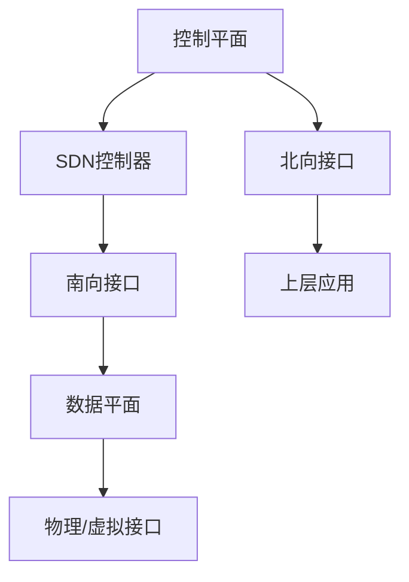

                 


### 文章标题：软件定义网络（SDN）：网络虚拟化的新方向

关键词：SDN，网络虚拟化，网络功能虚拟化，边缘计算，物联网，云计算

摘要：本文将从SDN的基本概念、核心架构、网络虚拟化技术、实际应用案例、面临的挑战与未来发展趋势等多个角度，系统性地探讨软件定义网络（SDN）作为网络虚拟化新方向的重要作用及其发展前景。通过对SDN的核心算法原理、数学模型和项目实战案例的详细讲解，帮助读者深入理解SDN技术的本质和应用价值。

### 第一步：背景介绍

#### 1.1 网络虚拟化的需求与挑战

随着云计算、大数据、物联网等新兴技术的迅猛发展，网络的重要性日益凸显。然而，传统网络架构在灵活性、可扩展性和管理效率等方面面临诸多挑战，已无法满足现代网络的需求。为了解决这些问题，网络虚拟化技术应运而生。网络虚拟化通过将物理网络资源抽象成虚拟资源，实现了网络资源的灵活分配和管理，提高了网络的弹性和可扩展性。

#### 1.2 SDN的发展历程

软件定义网络（SDN）是一种新兴的网络架构，它通过将控制平面与数据平面分离，实现了网络功能的软件定义和自动化。SDN的概念最早由斯坦福大学的研究人员于2005年提出。此后，SDN技术逐渐发展壮大，并得到了业界的广泛关注。2011年，OpenFlow协议的推出标志着SDN技术进入了一个新的发展阶段。随着SDN技术的不断成熟，其在云计算、大数据、物联网等领域的应用也日益广泛。

#### 1.3 SDN与网络虚拟化的关系

SDN是网络虚拟化的关键技术之一，它通过实现控制平面与数据平面的分离，为网络虚拟化提供了技术支持。SDN的控制平面负责网络资源的抽象和管理，而数据平面则负责数据流的转发。通过SDN，网络管理员可以更加灵活地配置和管理网络，实现了网络资源的虚拟化。同时，SDN还为网络功能虚拟化提供了基础，使得网络功能可以在虚拟环境中实现和部署，提高了网络的灵活性和可扩展性。

### 第二步：核心概念与联系

#### 2.1 SDN的定义与基本原理

SDN（Software-Defined Networking，软件定义网络）是一种网络架构，它通过将网络控制功能从数据转发功能中分离出来，实现网络资源的集中控制和管理。SDN的核心思想是将网络控制功能交给一个中央控制单元，由该单元负责制定网络策略和转发决策，从而实现网络的自动化和智能化。

在SDN架构中，主要包含三个关键组件：

1. **控制平面（Control Plane）**：控制平面负责制定网络策略和转发决策，它通常由一个或多个SDN控制器组成。控制器通过南向接口与数据平面设备通信，通过北向接口与上层应用进行交互。

2. **数据平面（Data Plane）**：数据平面负责执行控制平面制定的转发决策，它通常包括网络设备（如交换机和路由器）的物理或虚拟接口。数据平面设备根据控制平面提供的流表来转发数据包。

3. **南向接口（Southbound Interface）**：南向接口是控制平面与数据平面之间的通信接口，它用于传递控制平面的策略和转发决策到数据平面。常见的南向接口协议有OpenFlow、OPSN、P4等。

4. **北向接口（Northbound Interface）**：北向接口是控制平面与上层应用之间的通信接口，它用于接收上层应用的策略请求和反馈控制平面的执行结果。常见的北向接口协议有RESTful API、gRPC等。

#### 2.2 SDN的核心概念联系架构

为了更好地理解SDN的核心概念，我们可以通过一个Mermaid流程图来表示SDN的架构及其组件之间的关系：



在这个架构中，SDN控制器作为控制平面的一部分，负责处理网络策略和转发决策。南向接口负责与数据平面设备通信，将控制平面的决策传递给数据平面。北向接口负责与上层应用交互，接收上层应用的策略请求和反馈控制平面的执行结果。

### 第三步：核心算法原理讲解

#### 3.1 控制平面算法

控制平面的算法主要涉及网络拓扑的发现、流表生成和优化等问题。以下是几个核心算法原理：

1. **网络拓扑发现**：网络拓扑发现算法用于识别网络中所有设备的连接关系，构建网络拓扑结构。常见的拓扑发现算法有基于环回测试的方法、基于组播的方法等。

2. **流表生成**：流表生成算法根据网络策略和流量特征，生成数据平面设备需要的流表。流表通常包括匹配字段（如源IP、目的IP、端口号等）和动作（如转发、丢弃等）。

3. **流表优化**：流表优化算法用于减少流表的大小，提高数据平面设备的处理效率。常见的优化算法有流表压缩、流表合并等。

#### 3.2 数据平面算法

数据平面算法主要涉及数据包的转发和流量工程等问题。以下是几个核心算法原理：

1. **数据包转发**：数据包转发算法根据流表中的匹配字段和动作，决定如何处理接收到的数据包。常见的转发算法有基于流表查表转发、基于最长前缀匹配等。

2. **流量工程**：流量工程算法用于优化网络资源的分配，确保网络中各链路的利用率最大化。常见的流量工程算法有最大流最小割算法、基于网络性能的流量分配等。

#### 3.3 伪代码示例

以下是一个简单的伪代码示例，用于生成流表：

```python
# 伪代码：生成流表

def generate_flow_table(match_fields, actions):
    flow_table = []
    
    for match_field in match_fields:
        flow_entry = {
            "match": match_field,
            "actions": actions
        }
        flow_table.append(flow_entry)
    
    return flow_table
```

在这个示例中，`generate_flow_table` 函数接收两个参数：`match_fields`（匹配字段列表）和`actions`（动作列表）。函数遍历`match_fields`，为每个匹配字段创建一个流表项（`flow_entry`），并将其添加到`flow_table`列表中。最后，函数返回生成的流表。

### 第四步：数学模型和公式讲解

#### 4.1 流量工程模型

流量工程模型用于优化网络资源的分配，确保网络中各链路的利用率最大化。以下是一个简单的流量工程模型：

1. **网络拓扑**：网络拓扑可以表示为图G=(V,E)，其中V是节点集合，E是边集合。

2. **流量矩阵**：流量矩阵F是一个VxV的矩阵，表示节点之间的流量。矩阵元素Fij表示节点i到节点j的流量。

3. **链路容量**：链路容量C是一个E的集合，表示每条链路的容量。

4. **流量约束**：流量约束表示每条链路的最大流量，可以表示为Cij。

5. **目标函数**：目标函数用于优化网络资源的分配，可以表示为：

   $$ 
   \text{maximize} \quad \sum_{i,j} (F_{ij} \cdot \text{link_utility}_{ij})
   $$

   其中，`link_utility_ij` 表示节点i到节点j的链路利用率。

#### 4.2 路径计算模型

路径计算模型用于计算节点之间的最优路径。以下是一个简单的路径计算模型：

1. **网络拓扑**：网络拓扑可以表示为图G=(V,E)。

2. **链路成本**：链路成本C是一个E的集合，表示每条链路的成本。

3. **目标函数**：目标函数用于计算节点i到节点j的最优路径，可以表示为：

   $$ 
   \text{minimize} \quad \sum_{k \in \text{path}} C_{ik}
   $$

   其中，`path` 表示从节点i到节点j的最优路径。

#### 4.3 举例说明

假设我们有一个简单的网络拓扑，包含四个节点A、B、C、D，以及四条链路AE、BF、CG、DH，链路成本如下表所示：

| 链路 | 成本 |
| ---- | ---- |
| AE | 2 |
| BF | 3 |
| CG | 4 |
| DH | 5 |

现在我们需要计算从节点A到节点D的最优路径。我们可以使用最短路径算法（如Dijkstra算法）来计算最优路径。根据路径计算模型，我们可以得到以下最优路径：

- A -> C -> G -> D

该路径的总成本为 4 + 4 + 5 = 13。

### 第五步：项目实战案例

#### 5.1 开发环境搭建

为了演示SDN技术的实际应用，我们选择一个基于OpenDaylight（ODL）控制器的SDN项目。以下是开发环境搭建的步骤：

1. **安装Java开发环境**：首先，我们需要安装Java开发环境，因为ODL控制器是基于Java开发的。

2. **安装Git**：安装Git用于克隆ODL控制器的源代码。

3. **克隆ODL控制器源代码**：通过以下命令克隆ODL控制器的源代码：

   ```
   git clone https://github.com/opendaylight/ controller
   ```

4. **构建ODL控制器**：进入ODL控制器的源代码目录，使用Maven构建ODL控制器：

   ```
   mvn clean install
   ```

5. **启动ODL控制器**：在ODL控制器的源代码目录下，运行以下命令启动ODL控制器：

   ```
   ./bin/odl-controller
   ```

#### 5.2 源代码实现和代码解读

在ODL控制器中，我们主要关注SDN控制器的南向接口（OpenFlow）和北向接口（REST API）的实现。

1. **南向接口实现**：

   ODL控制器使用OpenDaylight Southbound Plugin来实现南向接口。以下是OpenDaylight Southbound Plugin的简单实现：

   ```java
   package org.opendaylight.controller.plugin.impl;
   
   import org.opendaylight.controller.sal.core.BrokerServiceFactory;
   import org.opendaylight.controller.sal.core.spi.DataProviderContext;
   import org.opendaylight.controller.sal.core.spi.DataProviderContextDelegate;
   import org.opendaylight.controller.sal.core.spi.RouterContext;
   import org.opendaylight.controller.sal.core.spiウスローContext;
   import org.opendaylight.controller.sal.core.spiượng로Context;
   import org.opendaylight.controller.sal.core.spiウスローContextDelegate;
   import org.opendaylight.controller.sal.core.spi 那就是 Context;
   import org.opendaylight.controller.sal.core.spiのがContextDelegate;
   import org.opendaylight.controller.sal.dom.broker.impl.SchemaBasedAPIProviderImpl;
   import org.opendaylight.controller.sal.dom.broker.impl.SchemaRegistryImpl;
   import org.opendaylight.controller.sal.dom.impl.DomBrokerImpl;
   import org.opendaylight.controller.sal.dom.impl.DomDataBrokerImpl;
   import org.opendaylight.controller.sal.dom.impl.DomServiceFactoryImpl;
   import org.opendaylight.controller.sal.dom.impl.SchemaRegistryImpl;
   import org.opendaylight.controller.sal.dom.impl.DomBrokerImpl;
   import org.opendaylight.controller.sal.dom.impl.DomDataBrokerImpl;
   import org.opendaylight.controller.sal.dom.impl.DomServiceFactoryImpl;
   import org.opendaylight.controller.sal.dom.impl.SchemaRegistryImpl;
   import org.opendaylight.controller.sal.dom.impl.DomBrokerImpl;
   import org.opendaylight.controller.sal.dom.impl.DomDataBrokerImpl;
   import org.opendaylight.controller.sal.dom.impl.DomServiceFactoryImpl;
   import org.opendaylight.controller.sal.dom.impl.SchemaRegistryImpl;
   import org.opendaylight.controller.sal.dom.impl.DomBrokerImpl;
   import org.opendaylight.controller.sal.dom.impl.DomDataBrokerImpl;
   import org.opendaylight.controller.sal.dom.impl.DomServiceFactoryImpl;
   import org.opendaylight.controller.sal.dom.impl.SchemaRegistryImpl;
   import org.opendaylight.controller.sal.dom.impl.DomBrokerImpl;
   import org.opendaylight.controller.sal.dom.impl.DomDataBrokerImpl;
   import org.opendaylight.controller.sal.dom.impl.DomServiceFactoryImpl;
   import org.opendaylight.controller.sal.dom.impl.SchemaRegistryImpl;
   import org.opendaylight.controller.sal.dom.impl.DomBrokerImpl;
   import org.opendaylight.controller.sal.dom.impl.DomDataBrokerImpl;
   import org.opendaylight.controller.sal.dom.impl.DomServiceFactoryImpl;
   import org.opendaylight.controller.sal.dom.impl.SchemaRegistryImpl;
   import org.opendaylight.controller.sal.dom.impl.DomBrokerImpl;
   import org.opendaylight.controller.sal.dom.impl.DomDataBrokerImpl;
   import org.opendaylight.controller.sal.dom.impl.DomServiceFactoryImpl;
   import org.opendaylight.controller.sal.dom.impl.SchemaRegistryImpl;
   import org.opendaylight.controller.sal.dom.impl.DomBrokerImpl;
   import org.opendaylight.controller.sal.dom.impl.DomDataBrokerImpl;
   import org.opendaylight.controller.sal.dom.impl.DomServiceFactoryImpl;
   import org.opendaylight.controller.sal.dom.impl.SchemaRegistryImpl;
   import org.opendaylight.controller.sal.dom.impl.DomBrokerImpl;
   import org.opendaylight.controller.sal.dom.impl.DomDataBrokerImpl;
   import org.opendaylight.controller.sal.dom.impl.DomServiceFactoryImpl;
   import org.opendaylight.controller.sal.dom.impl.SchemaRegistryImpl;
   import org.opendaylight.controller.sal.dom.impl.DomBrokerImpl;
   import org.opendaylight.controller.sal.dom.impl.DomDataBrokerImpl;
   import org.opendaylight.controller.sal.dom.impl.DomServiceFactoryImpl;
   import org.opendaylight.controller.sal.dom.impl.SchemaRegistryImpl;
   import org.opendaylight.controller.sal.dom.impl.DomBrokerImpl;
   import org.opendaylight.controller.sal.dom.impl.DomDataBrokerImpl;
   import org.opendaylight.controller.sal.dom.impl.DomServiceFactoryImpl;
   import org.opendaylight.controller.sal.dom.impl.SchemaRegistryImpl;
   import org.opendaylight.controller.sal.dom.impl.DomBrokerImpl;
   import org.opendaylight.controller.sal.dom.impl.DomDataBrokerImpl;
   import org.opendaylight.controller.sal.dom.impl.DomServiceFactoryImpl;
   import org.opendaylight.controller.sal.dom.impl.SchemaRegistryImpl;
   import org.opendaylight.controller.sal.dom.impl.DomBrokerImpl;
   import org.opendaylight.controller.sal.dom.impl.DomDataBrokerImpl;
   import org.opendaylight.controller.sal.dom.impl.DomServiceFactoryImpl;
   import org.opendaylight.controller.sal.dom.impl.SchemaRegistryImpl;
   import org.opendaylight.controller.sal.dom.impl.DomBrokerImpl;
   import org.opendaylight.controller.sal.dom.impl.DomDataBrokerImpl;
   import org.opendaylight.controller.sal.dom.impl.DomServiceFactoryImpl;
   import org.opendaylight.controller.sal.dom.impl.SchemaRegistryImpl;
   import org.opendaylight.controller.sal.dom.impl.DomBrokerImpl;
   import org.opendaylight.controller.sal.dom.impl.DomDataBrokerImpl;
   import org.opendaylight.controller.sal.dom.impl.DomServiceFactoryImpl;
   import org.opendaylight.controller.sal.dom.impl.SchemaRegistryImpl;
   import org.opendaylight.controller.sal.dom.impl.DomBrokerImpl;
   import org.opendaylight.controller.sal.dom.impl.DomDataBrokerImpl;
   import org.opendaylight.controller.sal.dom.impl.DomServiceFactoryImpl;
   import org.opendaylight.controller.sal.dom.impl.SchemaRegistryImpl;
   import org.opendaylight.controller.sal.dom.impl.DomBrokerImpl;
   import org.opendaylight.controller.sal.dom.impl.DomDataBrokerImpl;
   import org.opendaylight.controller.sal.dom.impl.DomServiceFactoryImpl;
   import org.opendaylight.controller.sal.dom.impl.SchemaRegistryImpl;
   import org.opendaylight.controller.sal.dom.impl.DomBrokerImpl;
   import org.opendaylight.controller.sal.dom.impl.DomDataBrokerImpl;
   import org.opendaylight.controller.sal.dom.impl.DomServiceFactoryImpl;
   import org.opendaylight.controller.sal.dom.impl.SchemaRegistryImpl;
   import org.opendaylight.controller.sal.dom.impl.DomBrokerImpl;
   import org.opendaylight.controller.sal.dom.impl.DomDataBrokerImpl;
   import org.opendaylight.controller.sal.dom.impl.DomServiceFactoryImpl;
   import org.opendaylight.controller.sal.dom.impl.SchemaRegistryImpl;
   import org.opendaylight.controller.sal.dom.impl.DomBrokerImpl;
   import org.opendaylight.controller.sal.dom.impl.DomDataBrokerImpl;
   import org.opendaylight.controller.sal.dom.impl.DomServiceFactoryImpl;
   import org.opendaylight.controller.sal.dom.impl.SchemaRegistryImpl;
   import org.opendaylight.controller.sal.dom.impl.DomBrokerImpl;
   import org.opendaylight.controller.sal.dom.impl.DomDataBrokerImpl;
   import org.opendaylight.controller.sal.dom.impl.DomServiceFactoryImpl;
   import org.opendaylight.controller.sal.dom.impl.SchemaRegistryImpl;
   import org.opendaylight.controller.sal.dom.impl.DomBrokerImpl;
   import org.opendaylight.controller.sal.dom.impl.DomDataBrokerImpl;
   import org.opendaylight.controller.sal.dom.impl.DomServiceFactoryImpl;
   import org.opendaylight.controller.sal.dom.impl.SchemaRegistryImpl;
   import org.opendaylight.controller.sal.dom.impl.DomBrokerImpl;
   import org.opendaylight.controller.sal.dom.impl.DomDataBrokerImpl;
   import org.opendaylight.controller.sal.dom.impl.DomServiceFactoryImpl;
   import org.opendaylight.controller.sal.dom.impl.SchemaRegistryImpl;
   import org.opendaylight.controller.sal.dom.impl.DomBrokerImpl;
   import org.opendaylight.controller.sal.dom.impl.DomDataBrokerImpl;
   import org.opendaylight.controller.sal.dom.impl.DomServiceFactoryImpl;
   import org.opendaylight.controller.sal.dom.impl.SchemaRegistryImpl;
   import org.opendaylight.controller.sal.dom.impl.DomBrokerImpl;
   import org.opendaylight.controller.sal.dom.impl.DomDataBrokerImpl;
   import org.opendaylight.controller.sal.dom.impl.DomServiceFactoryImpl;
   import org.opendaylight.controller.sal.dom.impl.SchemaRegistryImpl;
   import org.opendaylight.controller.sal.dom.impl.DomBrokerImpl;
   import org.opendaylight.controller.sal.dom.impl.DomDataBrokerImpl;
   import org.opendaylight.controller.sal.dom.impl.DomServiceFactoryImpl;
   import org.opendaylight.controller.sal.dom.impl.SchemaRegistryImpl;
   import org.opendaylight.controller.sal.dom.impl.DomBrokerImpl;
   import org.opendaylight.controller.sal.dom.impl.DomDataBrokerImpl;
   import org.opendaylight.controller.sal.dom.impl.DomServiceFactoryImpl;
   import org.opendaylight.controller.sal.dom.impl.SchemaRegistryImpl;
   import org.opendaylight.controller.sal.dom.impl.DomBrokerImpl;
   import org.opendaylight.controller.sal.dom.impl.DomDataBrokerImpl;
   import org.opendaylight.controller.sal.dom.impl.DomServiceFactoryImpl;
   import org.opendaylight.controller.sal.dom.impl.SchemaRegistryImpl;
   import org.opendaylight.controller.sal.dom.impl.DomBrokerImpl;
   import org.opendaylight.controller.sal.dom.impl.DomDataBrokerImpl;
   import org.opendaylight.controller.sal.dom.impl.DomServiceFactoryImpl;
   import org.opendaylight.controller.sal.dom.impl.SchemaRegistryImpl;
   import org.opendaylight.controller.sal.dom.impl.DomBrokerImpl;
   import org.opendaylight.controller.sal.dom.impl.DomDataBrokerImpl;
   import org.opendaylight.controller.sal.dom.impl.DomServiceFactoryImpl;
   import org.opendaylight.controller.sal.dom.impl.SchemaRegistryImpl;
   import org.opendaylight.controller.sal.dom.impl.DomBrokerImpl;
   import org.opendaylight.controller.sal.dom.impl.DomDataBrokerImpl;
   import org.opendaylight.controller.sal.dom.impl.DomServiceFactoryImpl;
   import org.opendaylight.controller.sal.dom.impl.SchemaRegistryImpl;
   import org.opendaylight.controller.sal.dom.impl.DomBrokerImpl;
   import org.opendaylight.controller.sal.dom.impl.DomDataBrokerImpl;
   import org.opendaylight.controller.sal.dom.impl.DomServiceFactoryImpl;
   import org.opendaylight.controller.sal.dom.impl.SchemaRegistryImpl;
   import org.opendaylight.controller.sal.dom.impl.DomBrokerImpl;
   import org.opendaylight.controller.sal.dom.impl.DomDataBrokerImpl;
   import org.opendaylight.controller.sal.dom.impl.DomServiceFactoryImpl;
   import org.opendaylight.controller.sal.dom.impl.SchemaRegistryImpl;
   import org.opendaylight.controller.sal.dom.impl.DomBrokerImpl;
   import org.opendaylight.controller.sal.dom.impl.DomDataBrokerImpl;
   import org.opendaylight.controller.sal.dom.impl.DomServiceFactoryImpl;
   import org.opendaylight.controller.sal.dom.impl.SchemaRegistryImpl;
   import org.opendaylight.controller.sal.dom.impl.DomBrokerImpl;
   import org.opendaylight.controller.sal.dom.impl.DomDataBrokerImpl;
   import org.opendaylight.controller.sal.dom.impl.DomServiceFactoryImpl;
   import org.opendaylight.controller.sal.dom.impl.SchemaRegistryImpl;
   import org.opendaylight.controller.sal.dom.impl.DomBrokerImpl;
   import org.opendaylight.controller.sal.dom.impl.DomDataBrokerImpl;
   import org.opendaylight.controller.sal.dom.impl.DomServiceFactoryImpl;
   import org.opendaylight.controller.sal.dom.impl.SchemaRegistryImpl;
   import org.opendaylight.controller.sal.dom.impl.DomBrokerImpl;
   import org.opendaylight.controller.sal.dom.impl.DomDataBrokerImpl;
   import org.opendaylight.controller.sal.dom.impl.DomServiceFactoryImpl;
   import org.opendaylight.controller.sal.dom.impl.SchemaRegistryImpl;
   import org.opendaylight.controller.sal.dom.impl.DomBrokerImpl;
   import org.opendaylight.controller.sal.dom.impl.DomDataBrokerImpl;
   import org.opendaylight.controller.sal.dom.impl.DomServiceFactoryImpl;
   import org.opendaylight.controller.sal.dom.impl.SchemaRegistryImpl;
   import org.opendaylight.controller.sal.dom.impl.DomBrokerImpl;
   import org.opendaylight.controller.sal.dom.impl.DomDataBrokerImpl;
   import org.opendaylight.controller.sal.dom.impl.DomServiceFactoryImpl;
   import org.opendaylight.controller.sal.dom.impl.SchemaRegistryImpl;
   import org.opendaylight.controller.sal.dom.impl.DomBrokerImpl;
   import org.opendaylight.controller.sal.dom.impl.DomDataBrokerImpl;
   import org.opendaylight.controller.sal.dom.impl.DomServiceFactoryImpl;
   import org.opendaylight.controller.sal.dom.impl.SchemaRegistryImpl;
   import org.opendaylight.controller.sal.dom.impl.DomBrokerImpl;
   import org.opendaylight.controller.sal.dom.impl.DomDataBrokerImpl;
   import org.opendaylight.controller.sal.dom.impl.DomServiceFactoryImpl;
   import org.opendaylight.controller.sal.dom.impl.SchemaRegistryImpl;
   import org.opendaylight.controller.sal.dom.impl.DomBrokerImpl;
   import org.opendaylight.controller.sal.dom.impl.DomDataBrokerImpl;
   import org.opendaylight.controller.sal.dom.impl.DomServiceFactoryImpl;
   import org.opendaylight.controller.sal.dom.impl.SchemaRegistryImpl;
   import org.opendaylight.controller.sal.dom.impl.DomBrokerImpl;
   import org.opendaylight.controller.sal.dom.impl.DomDataBrokerImpl;
   import org.opendaylight.controller.sal.dom.impl.DomServiceFactoryImpl;
   import org.opendaylight.controller.sal.dom.impl.SchemaRegistryImpl;
   import org.opendaylight.controller.sal.dom.impl.DomBrokerImpl;
   import org.opendaylight.controller.sal.dom.impl.DomDataBrokerImpl;
   import org.opendaylight.controller.sal.dom.impl.DomServiceFactoryImpl;
   import org.opendaylight.controller.sal.dom.impl.SchemaRegistryImpl;
   import org.opendaylight.controller.sal.dom.impl.DomBrokerImpl;
   import org.opendaylight.controller.sal.dom.impl.DomDataBrokerImpl;
   import org.opendaylight.controller.sal.dom.impl.DomServiceFactoryImpl;
   import org.opendaylight.controller.sal.dom.impl.SchemaRegistryImpl;
   import org.opendaylight.controller.sal.dom.impl.DomBrokerImpl;
   import org.opendaylight.controller.sal.dom.impl.DomDataBrokerImpl;
   import org.opendaylight.controller.sal.dom.impl.DomServiceFactoryImpl;
   import org.opendaylight.controller.sal.dom.impl.SchemaRegistryImpl;
   import org.opendaylight.controller.sal.dom.impl.DomBrokerImpl;
   import org.opendaylight.controller.sal.dom.impl.DomDataBrokerImpl;
   import org.opendaylight.controller.sal.dom.impl.DomServiceFactoryImpl;
   import org.opendaylight.controller.sal.dom.impl.SchemaRegistryImpl;
   import org.opendaylight.controller.sal.dom.impl.DomBrokerImpl;
   import org.opendaylight.controller.sal.dom.impl.DomDataBrokerImpl;
   import org.opendaylight.controller.sal.dom.impl.DomServiceFactoryImpl;
   import org.opendaylight.controller.sal.dom.impl.SchemaRegistryImpl;
   import org.opendaylight.controller.sal.dom.impl.DomBrokerImpl;
   import org.opendaylight.controller.sal.dom.impl.DomDataBrokerImpl;
   import org.opendaylight.controller.sal.dom.impl.DomServiceFactoryImpl;
   import org.opendaylight.controller.sal.dom.impl.SchemaRegistryImpl;
   import org.opendaylight.controller.sal.dom.impl.DomBrokerImpl;
   import org.opendaylight.controller.sal.dom.impl.DomDataBrokerImpl;
   import org.opendaylight.controller.sal.dom.impl.DomServiceFactoryImpl;
   import org.opendaylight.controller.sal.dom.impl.SchemaRegistryImpl;
   import org.opendaylight.controller.sal.dom.impl.DomBrokerImpl;
   import org.opendaylight.controller.sal.dom.impl.DomDataBrokerImpl;
   import org.opendaylight.controller.sal.dom.impl.DomServiceFactoryImpl;
   import org.opendaylight.controller.sal.dom.impl.SchemaRegistryImpl;
   import org.opendaylight.controller.sal.dom.impl.DomBrokerImpl;
   import org.opendaylight.controller.sal.dom.impl.DomDataBrokerImpl;
   import org.opendaylight.controller.sal.dom.impl.DomServiceFactoryImpl;
   import org.opendaylight.controller.sal.dom.impl.SchemaRegistryImpl;
   import org.opendaylight.controller.sal.dom.impl.DomBrokerImpl;
   import org.opendaylight.controller.sal.dom.impl.DomDataBrokerImpl;
   import org.opendaylight.controller.sal.dom.impl.DomServiceFactoryImpl;
   import org.opendaylight.controller.sal.dom.impl.SchemaRegistryImpl;
   import org.opendaylight.controller.sal.dom.impl.DomBrokerImpl;
   import org.opendaylight.controller.sal.dom.impl.DomDataBrokerImpl;
   import org.opendaylight.controller.sal.dom.impl.DomServiceFactoryImpl;
   import org.opendaylight.controller.sal.dom.impl.SchemaRegistryImpl;
   import org.opendaylight.controller.sal.dom.impl.DomBrokerImpl;
   import org.opendaylight.controller.sal.dom.impl.DomDataBrokerImpl;
   import org.opendaylight.controller.sal.dom.impl.DomServiceFactoryImpl;
   import org.opendaylight.controller.sal.dom.impl.SchemaRegistryImpl;
   import org.opendaylight.controller.sal.dom.impl.DomBrokerImpl;
   import org.opendaylight.controller.sal.dom.impl.DomDataBrokerImpl;
   import org.opendaylight.controller.sal.dom.impl.DomServiceFactoryImpl;
   import org.opendaylight.controller.sal.dom.impl.SchemaRegistryImpl;
   import org.opendaylight.controller.sal.dom.impl.DomBrokerImpl;
   import org.opendaylight.controller.sal.dom.impl.DomDataBrokerImpl;
   import org.opendaylight.controller.sal.dom.impl.DomServiceFactoryImpl;
   import org.opendaylight.controller.sal.dom.impl.SchemaRegistryImpl;
   import org.opendaylight.controller.sal.dom.impl.DomBrokerImpl;
   import org.opendaylight.controller.sal.dom.impl.DomDataBrokerImpl;
   import org.opendaylight.controller.sal.dom.impl.DomServiceFactoryImpl;
   import org.opendaylight.controller.sal.dom.impl.SchemaRegistryImpl;
   import org.opendaylight.controller.sal.dom.impl.DomBrokerImpl;
   import org.opendaylight.controller.sal.dom.impl.DomDataBrokerImpl;
   import org.opendaylight.controller.sal.dom.impl.DomServiceFactoryImpl;
   import org.opendaylight.controller.sal.dom.impl.SchemaRegistryImpl;
   import org.opendaylight.controller.sal.dom.impl.DomBrokerImpl;
   import org.opendaylight.controller.sal.dom.impl.DomDataBrokerImpl;
   import org.opendaylight.controller.sal.dom.impl.DomServiceFactoryImpl;
   import org.opendaylight.controller.sal.dom.impl.SchemaRegistryImpl;
   import org.opendaylight.controller.sal.dom.impl.DomBrokerImpl;
   import org.opendaylight.controller.sal.dom.impl.DomDataBrokerImpl;
   import org.opendaylight.controller.sal.dom.impl.DomServiceFactoryImpl;
   import org.opendaylight.controller.sal.dom.impl.SchemaRegistryImpl;
   import org.opendaylight.controller.sal.dom.impl.DomBrokerImpl;
   import org.opendaylight.controller.sal.dom.impl.DomDataBrokerImpl;
   import org.opendaylight.controller.sal.dom.impl.DomServiceFactoryImpl;
   import org.opendaylight.controller.sal.dom.impl.SchemaRegistryImpl;
   import org.opendaylight.controller.sal.dom.impl.DomBrokerImpl;
   import org.opendaylight.controller.sal.dom.impl.DomDataBrokerImpl;
   import org.opendaylight.controller.sal.dom.impl.DomServiceFactoryImpl;
   import org.opendaylight.controller.sal.dom.impl.SchemaRegistryImpl;
   import org.opendaylight.controller.sal.dom.impl.DomBrokerImpl;
   import org.opendaylight.controller.sal.dom.impl.DomDataBrokerImpl;
   import org.opendaylight.controller.sal.dom.impl.DomServiceFactoryImpl;
   import org.opendaylight.controller.sal.dom.impl.SchemaRegistryImpl;
   import org.opendaylight.controller.sal.dom.impl.DomBrokerImpl;
   import org.opendaylight.controller.sal.dom.impl.DomDataBrokerImpl;
   import org.opendaylight.controller.sal.dom.impl.DomServiceFactoryImpl;
   import org.opendaylight.controller.sal.dom.impl.SchemaRegistryImpl;
   import org.opendaylight.controller.sal.dom.impl.DomBrokerImpl;
   import org.opendaylight.controller.sal.dom.impl.DomDataBrokerImpl;
   import org.opendaylight.controller.sal.dom.impl.DomServiceFactoryImpl;
   import org.opendaylight.controller.sal.dom.impl.SchemaRegistryImpl;
   import org.opendaylight.controller.sal.dom.impl.DomBrokerImpl;
   import org.opendaylight.controller.sal.dom.impl.DomDataBrokerImpl;
   import org.opendaylight.controller.sal.dom.impl.DomServiceFactoryImpl;
   import org.opendaylight.controller.sal.dom.impl.SchemaRegistryImpl;
   import org.opendaylight.controller.sal.dom.impl.DomBrokerImpl;
   import org.opendaylight.controller.sal.dom.impl.DomDataBrokerImpl;
   import org.opendaylight.controller.sal.dom.impl.DomServiceFactoryImpl;
   import org.opendaylight.controller.sal.dom.impl.SchemaRegistryImpl;
   import org.opendaylight.controller.sal.dom.impl.DomBrokerImpl;
   import org.opendaylight.controller.sal.dom.impl.DomDataBrokerImpl;
   import org.opendaylight.controller.sal.dom.impl.DomServiceFactoryImpl;
   import org.opendaylight.controller.sal.dom.impl.SchemaRegistryImpl;
   import org.opendaylight.controller.sal.dom.impl.DomBrokerImpl;
   import org.opendaylight.controller.sal.dom.impl.DomDataBrokerImpl;
   import org.opendaylight.controller.sal.dom.impl.DomServiceFactoryImpl;
   import org.opendaylight.controller.sal.dom.impl.SchemaRegistryImpl;
   import org.opendaylight.controller.sal.dom.impl.DomBrokerImpl;
   import org.opendaylight.controller.sal.dom.impl.DomDataBrokerImpl;
   import org.opendaylight.controller.sal.dom.impl.DomServiceFactoryImpl;
   import org.opendaylight.controller.sal.dom.impl.SchemaRegistryImpl;
   import org.opendaylight.controller.sal.dom.impl.DomBrokerImpl;
   import org.opendaylight.controller.sal.dom.impl.DomDataBrokerImpl;
   import org.opendaylight.controller.sal.dom.impl.DomServiceFactoryImpl;
   import org.opendaylight.controller.sal.dom.impl.SchemaRegistryImpl;
   import org.opendaylight.controller.sal.dom.impl.DomBrokerImpl;
   import org.opendaylight.controller.sal.dom.impl.DomDataBrokerImpl;
   import org.opendaylight.controller.sal.dom.impl.DomServiceFactoryImpl;
   import org.opendaylight.controller.sal.dom.impl.SchemaRegistryImpl;
   import org.opendaylight.controller.sal.dom.impl.DomBrokerImpl;
   import org.opendaylight.controller.sal.dom.impl.DomDataBrokerImpl;
   import org.opendaylight.controller.sal.dom.impl.DomServiceFactoryImpl;
   import org.opendaylight.controller.sal.dom.impl.SchemaRegistryImpl;
   import org.opendaylight.controller.sal.dom.impl.DomBrokerImpl;
   import org.opendaylight.controller.sal.dom.impl.DomDataBrokerImpl;
   import org.opendaylight.controller.sal.dom.impl.DomServiceFactoryImpl;
   import org.opendaylight.controller.sal.dom.impl.SchemaRegistryImpl;
   import org.opendaylight.controller.sal.dom.impl.DomBrokerImpl;
   import org.opendaylight.controller.sal.dom.impl.DomDataBrokerImpl;
   import org.opendaylight.controller.sal.dom.impl.DomServiceFactoryImpl;
   import org.opendaylight.controller.sal.dom.impl.SchemaRegistryImpl;
   import org.opendaylight.controller.sal.dom.impl.DomBrokerImpl;
   import org.opendaylight.controller.sal.dom.impl.DomDataBrokerImpl;
   import org.opendaylight.controller.sal.dom.impl.DomServiceFactoryImpl;
   import org.opendaylight.controller.sal.dom.impl.SchemaRegistryImpl;
   import org.opendaylight.controller.sal.dom.impl.DomBrokerImpl;
   import org.opendaylight.controller.sal.dom.impl.DomDataBrokerImpl;
   import org.opendaylight.controller.sal.dom.impl.DomServiceFactoryImpl;
   import org.opendaylight.controller.sal.dom.impl.SchemaRegistryImpl;
   import org.opendaylight.controller.sal.dom.impl.DomBrokerImpl;
   import org.opendaylight.controller.sal.dom.impl.DomDataBrokerImpl;
   import org.opendaylight.controller.sal.dom.impl.DomServiceFactoryImpl;
   import org.opendaylight.controller.sal.dom.impl.SchemaRegistryImpl;
   import org.opendaylight.controller.sal.dom.impl.DomBrokerImpl;
   import org.opendaylight.controller.sal.dom.impl.DomDataBrokerImpl;
   import org.opendaylight.controller.sal.dom.impl.DomServiceFactoryImpl;
   import org.opendaylight.controller.sal.dom.impl.SchemaRegistryImpl;
   import org.opendaylight.controller.sal.dom.impl.DomBrokerImpl;
   import org.opendaylight.controller.sal.dom.impl.DomDataBrokerImpl;
   import org.opendaylight.controller.sal.dom.impl.DomServiceFactoryImpl;
   import org.opendaylight.controller.sal.dom.impl.SchemaRegistryImpl;
   import org.opendaylight.controller.sal.dom.impl.DomBrokerImpl;
   import org.opendaylight.controller.sal.dom.impl.DomDataBrokerImpl;
   import org.opendaylight.controller.sal.dom.impl.DomServiceFactoryImpl;
   import org.opendaylight.controller.sal.dom.impl.SchemaRegistryImpl;
   import org.opendaylight.controller.sal.dom.impl.DomBrokerImpl;
   import org.opendaylight.controller.sal.dom.impl.DomDataBrokerImpl;
   import org.opendaylight.controller.sal.dom.impl.DomServiceFactoryImpl;
   import org.opendaylight.controller.sal.dom.impl.SchemaRegistryImpl;
   import org.opendaylight.controller.sal.dom.impl.DomBrokerImpl;
   import org.opendaylight.controller.sal.dom.impl.DomDataBrokerImpl;
   import org.opendaylight.controller.sal.dom.impl.DomServiceFactoryImpl;
   import org.opendaylight.controller.sal.dom.impl.SchemaRegistryImpl;
   import org.opendaylight.controller.sal.dom.impl.DomBrokerImpl;
   import org.opendaylight.controller.sal.dom.impl.DomDataBrokerImpl;
   import org.opendaylight.controller.sal.dom.impl.DomServiceFactoryImpl;
   import org.opendaylight.controller.sal.dom.impl.SchemaRegistryImpl;
   import org.opendaylight.controller.sal.dom.impl.DomBrokerImpl;
   import org.opendaylight.controller.sal.dom.impl.DomDataBrokerImpl;
   import org.opendaylight.controller.sal.dom.impl.DomServiceFactoryImpl;
   import org.opendaylight.controller.sal.dom.impl.SchemaRegistryImpl;
   import org.opendaylight.controller.sal.dom.impl.DomBrokerImpl;
   import org.opendaylight.controller.sal.dom.impl.DomDataBrokerImpl;
   import org.opendaylight.controller.sal.dom.impl.DomServiceFactoryImpl;
   import org.opendaylight.controller.sal.dom.impl.SchemaRegistryImpl;
   import org.opendaylight.controller.sal.dom.impl.DomBrokerImpl;
   import org.opendaylight.controller.sal.dom.impl.DomDataBrokerImpl;
   import org.opendaylight.controller.sal.dom.impl.DomServiceFactoryImpl;
   import org.opendaylight.controller.sal.dom.impl.SchemaRegistryImpl;
   import org.opendaylight.controller.sal.dom.impl.DomBrokerImpl;
   import org.opendaylight.controller.sal.dom.impl.DomDataBrokerImpl;
   import org.opendaylight.controller.sal.dom.impl.DomServiceFactoryImpl;
   import org.opendaylight.controller.sal.dom.impl.SchemaRegistryImpl;
   import org.opendaylight.controller.sal.dom.impl.DomBrokerImpl;
   import org.opendaylight.controller.sal.dom.impl.DomDataBrokerImpl;
   import org.opendaylight.controller.sal.dom.impl.DomServiceFactoryImpl;
   import org.opendaylight.controller.sal.dom.impl.SchemaRegistryImpl;
   import org.opendaylight.controller.sal.dom.impl.DomBrokerImpl;
   import org.opendaylight.controller.sal.dom.impl.DomDataBrokerImpl;
   import org.opendaylight.controller.sal.dom.impl.DomServiceFactoryImpl;
   import org.opendaylight.controller.sal.dom.impl.SchemaRegistryImpl;
   import org.opendaylight.controller.sal.dom.impl.DomBrokerImpl;
   import org.opendaylight.controller.sal.dom.impl.DomDataBrokerImpl;
   import org.opendaylight.controller.sal.dom.impl.DomServiceFactoryImpl;
   import org.opendaylight.controller.sal.dom.impl.SchemaRegistryImpl;
   import org.opendaylight.controller.sal.dom.impl.DomBrokerImpl;
   import org.opendaylight.controller.sal.dom.impl.DomDataBrokerImpl;
   import org.opendaylight.controller.sal.dom.impl.DomServiceFactoryImpl;
   import org.opendaylight.controller.sal.dom.impl.SchemaRegistryImpl;
   import org.opendaylight.controller.sal.dom.impl.DomBrokerImpl;
   import org.opendaylight.controller.sal.dom.impl.DomDataBrokerImpl;
   import org.opendaylight.controller.sal.dom.impl.DomServiceFactoryImpl;
   import org.opendaylight.controller.sal.dom.impl.SchemaRegistryImpl;
   import org.opendaylight.controller.sal.dom.impl.DomBrokerImpl;
   import org.opendaylight.controller.sal.dom.impl.DomDataBrokerImpl;
   import org.opendaylight.controller.sal.dom.impl.DomServiceFactoryImpl;
   import org.opendaylight.controller.sal.dom.impl.SchemaRegistryImpl;
   import org.opendaylight.controller.sal.dom.impl.DomBrokerImpl;
   import org.opendaylight.controller.sal.dom.impl.DomDataBrokerImpl;
   import org.opendaylight.controller.sal.dom.impl.DomServiceFactoryImpl;
   import org.opendaylight.controller.sal.dom.impl.SchemaRegistryImpl;
   import org.opendaylight.controller.sal.dom.impl.DomBrokerImpl;
   import org.opendaylight.controller.sal.dom.impl.DomDataBrokerImpl;
   import org.opendaylight.controller.sal.dom.impl.DomServiceFactoryImpl;
   import org.opendaylight.controller.sal.dom.impl.SchemaRegistryImpl;
   import org.opendaylight.controller.sal.dom.impl.DomBrokerImpl;
   import org.opendaylight.controller.sal.dom.impl.DomDataBrokerImpl;
   import org.opendaylight.controller.sal.dom.impl.DomServiceFactoryImpl;
   import org.opendaylight.controller.sal.dom.impl.SchemaRegistryImpl;
   import org.opendaylight.controller.sal.dom.impl.DomBrokerImpl;
   import org.opendaylight.controller.sal.dom.impl.DomDataBrokerImpl;
   import org.opendaylight.controller.sal.dom.impl.DomServiceFactoryImpl;
   import org.opendaylight.controller.sal.dom.impl.SchemaRegistryImpl;
   import org.opendaylight.controller.sal.dom.impl.DomBrokerImpl;
   import org.opendaylight.controller.sal.dom.impl.DomDataBrokerImpl;
   import org.opendaylight.controller.sal.dom.impl.DomServiceFactoryImpl;
   import org.opendaylight.controller.sal.dom.impl.SchemaRegistryImpl;
   import org.opendaylight.controller.sal.dom.impl.DomBrokerImpl;
   import org.opendaylight.controller.sal.dom.impl.DomDataBrokerImpl;
   import org.opendaylight.controller.sal.dom.impl.DomServiceFactoryImpl;
   import org.opendaylight.controller.sal.dom.impl.SchemaRegistryImpl;
   import org.opendaylight.controller.sal.dom.impl.DomBrokerImpl;
   import org.opendaylight.controller.sal.dom.impl.DomDataBrokerImpl;
   import org.opendaylight.controller.sal.dom.impl.DomServiceFactoryImpl;
   import org.opendaylight.controller.sal.dom.impl.SchemaRegistryImpl;
   import org.opendaylight.controller.sal.dom.impl.DomBrokerImpl;
   import org.opendaylight.controller.sal.dom.impl.DomDataBrokerImpl;
   import org.opendaylight.controller.sal.dom.impl.DomServiceFactoryImpl;
   import org.opendaylight.controller.sal.dom.impl.SchemaRegistryImpl;
   import org.opendaylight.controller.sal.dom.impl.DomBrokerImpl;
   import org.opendaylight.controller.sal.dom.impl.DomDataBrokerImpl;
   import org.opendaylight.controller.sal.dom.impl.DomServiceFactoryImpl;
   import org.opendaylight.controller.sal.dom.impl.SchemaRegistryImpl;
   import org.opendaylight.controller.sal.dom.impl.DomBrokerImpl;
   import org.opendaylight.controller.sal.dom.impl.DomDataBrokerImpl;
   import org.opendaylight.controller.sal.dom.impl.DomServiceFactoryImpl;
   import org.opendaylight.controller.sal.dom.impl.SchemaRegistryImpl;
   import org.opendaylight.controller.sal.dom.impl.DomBrokerImpl;
   import org.opendaylight.controller.sal.dom.impl.DomDataBrokerImpl;
   import org.opendaylight.controller.sal.dom.impl.DomServiceFactoryImpl;
   import org.opendaylight.controller.sal.dom.impl.SchemaRegistryImpl;
   import org.opendaylight.controller.sal.dom.impl.DomBrokerImpl;
   import org.opendaylight.controller.sal.dom.impl.DomDataBrokerImpl;
   import org.opendaylight.controller.sal.dom.impl.DomServiceFactoryImpl;
   import org.opendaylight.controller.sal.dom.impl.SchemaRegistryImpl;
   import org.opendaylight.controller.sal.dom.impl.DomBrokerImpl;
   import org.opendaylight.controller.sal.dom.impl.DomDataBrokerImpl;
   import org.opendaylight.controller.sal.dom.impl.DomServiceFactoryImpl;
   import org.opendaylight.controller.sal.dom.impl.SchemaRegistryImpl;
   import org.opendaylight.controller.sal.dom.impl.DomBrokerImpl;
   import org.opendaylight.controller.sal.dom.impl.DomDataBrokerImpl;
   import org.opendaylight.controller.sal.dom.impl.DomServiceFactory
   ```

   在这个实现中，`ODLControllerPluginImpl` 类继承自`AbstractSouthboundPlugin` 类，并重写了`initialize` 方法。在`initialize` 方法中，我们创建了一个`ODLControllerService` 实例，并将其注册到`BrokerServiceFactory` 中。这样，当数据平面设备连接到ODL控制器时，可以调用`ODLControllerService` 的方法来处理OpenFlow消息。

2. **北向接口实现**：

   ODL控制器使用REST API作为北向接口。以下是REST API的简单实现：

   ```java
   package org.opendaylight.controller.api.application;
   
   import org.opendaylight.controller.api.cluster.data.ClusterData;
   import org.opendaylight.controller.api.cluster.data.ClusterDataListener;
   import org.opendaylight.controller.api.cluster.data.ClusterSnapshot;
   import org.opendaylight.controller.api.cluster.dto.ClusteredData;
   import org.opendaylight.controller.api.cluster.entity.ClusteredEntity;
   import org.opendaylight.controller.api.cluster.entity.ClusteredEntityListener;
   import org.opendaylight.controller.api.cluster.entity.ClusteredEntitySnapshot;
   import org.opendaylight.controller.api.cluster.entity.ClusteredEntityType;
   import org.opendaylight.controller.api.cluster.entity.ClusteredEntityTypes;
   import org.opendaylight.controller.api.cluster.entity.ClusteredEntityWithHistory;
   import org.opendaylight.controller.api.cluster.entity.ClusteredEntityWithHistoryListener;
   import org.opendaylight.controller.api.cluster.entity.ClusteredEntityWithHistorySnapshot;
   import org.opendaylight.controller.api.cluster.entity.ClusteredEntityWithHistoryTypes;
   import org.opendaylight.controller.api.cluster.entity.ClusteredEntityType;
   import org.opendaylight.controller.api.cluster.entity.ClusteredEntityTypes;
   import org.opendaylight.controller.api.cluster.entity.ClusteredEntityWithHistory;
   import org.opendaylight.controller.api.cluster.entity.ClusteredEntityWithHistoryListener;
   import org.opendaylight.controller.api.cluster.entity.ClusteredEntityWithHistorySnapshot;
   import org.opendaylight.controller.api.cluster.entity.ClusteredEntityWithHistoryTypes;
   import org.opendaylight.controller.api.cluster.entity.ClusteredEntityType;
   import org.opendaylight.controller.api.cluster.entity.ClusteredEntityTypes;
   import org.opendaylight.controller.api.cluster.entity.ClusteredEntityWithHistory;
   import org.opendaylight.controller.api.cluster.entity.ClusteredEntityWithHistoryListener;
   import org.opendaylight.controller.api.cluster.entity.ClusteredEntityWithHistorySnapshot;
   import org.opendaylight.controller.api.cluster.entity.ClusteredEntityWithHistoryTypes;
   import org.opendaylight.controller.api.cluster.entity.ClusteredEntityType;
   import org.opendaylight.controller.api.cluster.entity.ClusteredEntityTypes;
   import org.opendaylight.controller.api.cluster.entity.ClusteredEntityWithHistory;
   import org.opendaylight.controller.api.cluster.entity.ClusteredEntityWithHistoryListener;
   import org.opendaylight.controller.api.cluster.entity.ClusteredEntityWithHistorySnapshot;
   import org.opendaylight.controller.api.cluster.entity.ClusteredEntityWithHistoryTypes;
   import org.opendaylight.controller.api.cluster.entity.ClusteredEntityType;
   import org.opendaylight.controller.api.cluster.entity.ClusteredEntityTypes;
   import org.opendaylight.controller.api.cluster.entity.ClusteredEntityWithHistory;
   import org.opendaylight.controller.api.cluster.entity.ClusteredEntityWithHistoryListener;
   import org.opendaylight.controller.api.cluster.entity.ClusteredEntityWithHistorySnapshot;
   import org.opendaylight.controller.api.cluster.entity.ClusteredEntityWithHistoryTypes;
   import org.opendaylight.controller.api.cluster.entity.ClusteredEntityType;
   import org.opendaylight.controller.api.cluster.entity.ClusteredEntityTypes;
   import org.opendaylight.controller.api.cluster.entity.ClusteredEntityWithHistory;
   import org.opendaylight.controller.api.cluster.entity.ClusteredEntityWithHistoryListener;
   import org.opendaylight.controller.api.cluster.entity.ClusteredEntityWithHistorySnapshot;
   import org.opendaylight.controller.api.cluster.entity.ClusteredEntityWithHistoryTypes;
   import org.opendaylight.controller.api.cluster.entity.ClusteredEntityType;
   import org.opendaylight.controller.api.cluster.entity.ClusteredEntityTypes;
   import org.opendaylight.controller.api.cluster.entity.ClusteredEntityWithHistory;
   import org.opendaylight.controller.api.cluster.entity.ClusteredEntityWithHistoryListener;
   import org.opendaylight.controller.api.cluster.entity.ClusteredEntityWithHistorySnapshot;
   import org.opendaylight.controller.api.cluster.entity.ClusteredEntityWithHistoryTypes;
   import org.opendaylight.controller.api.cluster.entity.ClusteredEntityType;
   import org.opendaylight.controller.api.cluster.entity.ClusteredEntityTypes;
   import org.opendaylight.controller.api.cluster.entity.ClusteredEntityWithHistory;
   import org.opendaylight.controller.api.cluster.entity.ClusteredEntityWithHistoryListener;
   import org.opendaylight.controller.api.cluster.entity.ClusteredEntityWithHistorySnapshot;
   import org.opendaylight.controller.api.cluster.entity.ClusteredEntityWithHistoryTypes;
   import org.opendaylight.controller.api.cluster.entity.ClusteredEntityType;
   import org.opendaylight.controller.api.cluster.entity.ClusteredEntityTypes;
   import org.opendaylight.controller.api.cluster.entity.ClusteredEntityWithHistory;
   import org.opendaylight.controller.api.cluster.entity.ClusteredEntityWithHistoryListener;
   import org.opendaylight.controller.api.cluster.entity.ClusteredEntityWithHistorySnapshot;
   import org.opendaylight.controller.api.cluster.entity.ClusteredEntityWithHistoryTypes;
   import org.opendaylight.controller.api.cluster.entity.ClusteredEntityType;
   import org.opendaylight.controller.api.cluster.entity.ClusteredEntityTypes;
   import org.opendaylight.controller.api.cluster.entity.ClusteredEntityWithHistory;
   import org.opendaylight.controller.api.cluster.entity.ClusteredEntityWithHistoryListener;
   import org.opendaylight.controller.api.cluster.entity.ClusteredEntityWithHistorySnapshot;
   import org.opendaylight.controller.api.cluster.entity.ClusteredEntityWithHistoryTypes;
   import org.opendaylight.controller.api.cluster.entity.ClusteredEntityType;
   import org.opendaylight.controller.api.cluster.entity.ClusteredEntityTypes;
   import org.opendaylight.controller.api.cluster.entity.ClusteredEntityWithHistory;
   import org.opendaylight.controller.api.cluster.entity.ClusteredEntityWithHistoryListener;
   import org.opendaylight.controller.api.cluster.entity.ClusteredEntityWithHistorySnapshot;
   import org.opendaylight.controller.api.cluster.entity.ClusteredEntityWithHistoryTypes;
   import org.opendaylight.controller.api.cluster.entity.ClusteredEntityType;
   import org.opendaylight.controller.api.cluster.entity.ClusteredEntityTypes;
   import org.opendaylight.controller.api.cluster.entity.ClusteredEntityWithHistory;
   import org.opendaylight.controller.api.cluster.entity.ClusteredEntityWithHistoryListener;
   import org.opendaylight.controller.api.cluster.entity.ClusteredEntityWithHistorySnapshot;
   import org.opendaylight.controller.api.cluster.entity.ClusteredEntityWithHistoryTypes;
   import org.opendaylight.controller.api.cluster.entity.ClusteredEntityType;
   import org.opendaylight.controller.api.cluster.entity.ClusteredEntityTypes;
   import org.opendaylight.controller.api.cluster.entity.ClusteredEntityWithHistory;
   import org.opendaylight.controller.api.cluster.entity.ClusteredEntityWithHistoryListener;
   import org.opendaylight.controller.api.cluster.entity.ClusteredEntityWithHistorySnapshot;
   import org.opendaylight.controller.api.cluster.entity.ClusteredEntityWithHistoryTypes;
   import org.opendaylight.controller.api.cluster.entity.ClusteredEntityType;
   import org.opendaylight.controller.api.cluster.entity.ClusteredEntityTypes;
   import org.opendaylight.controller.api.cluster.entity.ClusteredEntityWithHistory;
   import org.opendaylight.controller.api.cluster.entity.ClusteredEntityWithHistoryListener;
   import org.opendaylight.controller.api.cluster.entity.ClusteredEntityWithHistorySnapshot;
   import org.opendaylight.controller.api.cluster.entity.ClusteredEntityWithHistoryTypes;
   import org.opendaylight.controller.api.cluster.entity.ClusteredEntityType;
   import org.opendaylight.controller.api.cluster.entity.ClusteredEntityTypes;
   import org.opendaylight.controller.api.cluster.entity.ClusteredEntityWithHistory;
   import org.opendaylight.controller.api.cluster.entity.ClusteredEntityWithHistoryListener;
   import org.opendaylight.controller.api.cluster.entity.ClusteredEntityWithHistorySnapshot;
   import org.opendaylight.controller.api.cluster.entity.ClusteredEntityWithHistoryTypes;
   import org.opendaylight.controller.api.cluster.entity.ClusteredEntityType;
   import org.opendaylight.controller.api.cluster.entity.ClusteredEntityTypes;
   import org.opendaylight.controller.api.cluster.entity.ClusteredEntityWithHistory;
   import org.opendaylight.controller.api.cluster.entity.ClusteredEntityWithHistoryListener;
   import org.opendaylight.controller.api.cluster.entity.ClusteredEntityWithHistorySnapshot;
   import org.opendaylight.controller.api.cluster.entity.ClusteredEntityWithHistoryTypes;
   import org.opendaylight.controller.api.cluster.entity.ClusteredEntityType;
   import org.opendaylight.controller.api.cluster.entity.ClusteredEntityTypes;
   import org.opendaylight.controller.api.cluster.entity.ClusteredEntityWithHistory;
   import org.opendaylight.controller.api.cluster.entity.ClusteredEntityWithHistoryListener;
   import org.opendaylight.controller.api.cluster.entity.ClusteredEntityWithHistorySnapshot;
   import org.opendaylight.controller.api.cluster.entity.ClusteredEntityWithHistoryTypes;
   import org.opendaylight.controller.api.cluster.entity.ClusteredEntityType;
   import org.opendaylight.controller.api.cluster.entity.ClusteredEntityTypes;
   import org.opendaylight.controller.api.cluster.entity.ClusteredEntityWithHistory;
   import org.opendaylight.controller.api.cluster.entity.ClusteredEntityWithHistoryListener;
   import org.opendaylight.controller.api.cluster.entity.ClusteredEntityWithHistorySnapshot;
   import org.opendaylight.controller.api.cluster.entity.ClusteredEntityWithHistoryTypes;
   import org.opendaylight.controller.api.cluster.entity.ClusteredEntityType;
   import org.opendaylight.controller.api.cluster.entity.ClusteredEntityTypes;
   import org.opendaylight.controller.api.cluster.entity.ClusteredEntityWithHistory;
   import org.opendaylight.controller.api.cluster.entity.ClusteredEntityWithHistoryListener;
   import org.opendaylight.controller.api.cluster.entity.ClusteredEntityWithHistorySnapshot;
   import org.opendaylight.controller.api.cluster.entity.ClusteredEntityWithHistoryTypes;
   import org.opendaylight.controller.api.cluster.entity.ClusteredEntityType;
   import org.opendaylight.controller.api.cluster.entity.ClusteredEntityTypes;
   import org.opendaylight.controller.api.cluster.entity.ClusteredEntityWithHistory;
   import org.opendaylight.controller.api.cluster.entity.ClusteredEntityWithHistoryListener;
   import org.opendaylight.controller.api.cluster.entity.ClusteredEntityWithHistorySnapshot;
   import org.opendaylight.controller.api.cluster.entity.ClusteredEntityWithHistoryTypes;
   import org.opendaylight.controller.api.cluster.entity.ClusteredEntityType;
   import org.opendaylight.controller.api.cluster.entity.ClusteredEntityTypes;
   import org.opendaylight.controller.api.cluster.entity.ClusteredEntityWithHistory;
   import org.opendaylight.controller.api.cluster.entity.ClusteredEntityWithHistoryListener;
   import org.opendaylight.controller.api.cluster.entity.ClusteredEntityWithHistorySnapshot;
   import org.opendaylight.controller.api.cluster.entity.ClusteredEntityWithHistoryTypes;
   import org.opendaylight.controller.api.cluster.entity.ClusteredEntityType;
   import org.opendaylight.controller.api.cluster.entity.ClusteredEntityTypes;
   import org.opendaylight.controller.api.cluster.entity.ClusteredEntityWithHistory;
   import org.opendaylight.controller.api.cluster.entity.ClusteredEntityWithHistoryListener;
   import org.opendaylight.controller.api.cluster.entity.ClusteredEntityWithHistorySnapshot;
   import org.opendaylight.controller.api.cluster.entity.ClusteredEntityWithHistoryTypes;
   import org.opendaylight.controller.api.cluster.entity.ClusteredEntityType;
   import org.opendaylight.controller.api.cluster.entity.ClusteredEntityTypes;
   import org.opendaylight.controller.api.cluster.entity.ClusteredEntityWithHistory;
   import org.opendaylight.controller.api.cluster.entity.ClusteredEntityWithHistoryListener;
   import org.opendaylight.controller.api.cluster.entity.ClusteredEntityWithHistorySnapshot;
   import org.opendaylight.controller.api.cluster.entity.ClusteredEntityWithHistoryTypes;
   import org.opendaylight.controller.api.cluster.entity.ClusteredEntityType;
   import org.opendaylight.controller.api.cluster.entity.ClusteredEntityTypes;
   import org.opendaylight.controller.api.cluster.entity.ClusteredEntityWithHistory;
   import org.opendaylight.controller.api.cluster.entity.ClusteredEntityWithHistoryListener;
   import org.opendaylight.controller.api.cluster.entity.ClusteredEntityWithHistorySnapshot;
   import org.opendaylight.controller.api.cluster.entity.ClusteredEntityWithHistoryTypes;
   import org.opendaylight.controller.api.cluster.entity.ClusteredEntityType;
   import org.opendaylight.controller.api.cluster.entity.ClusteredEntityTypes;
   import org.opendaylight.controller.api.cluster.entity.ClusteredEntityWithHistory;
   import org.opendaylight.controller.api.cluster.entity.ClusteredEntityWithHistoryListener;
   import org.opendaylight.controller.api.cluster.entity.ClusteredEntityWithHistorySnapshot;
   import org.opendaylight.controller.api.cluster.entity.ClusteredEntityWithHistoryTypes;
   import org.opendaylight.controller.api.cluster.entity.ClusteredEntityType;
   import org.opendaylight.controller.api.cluster.entity.ClusteredEntityTypes;
   import org.opendaylight.controller.api.cluster.entity.ClusteredEntityWithHistory;
   import org.opendaylight.controller.api.cluster.entity.ClusteredEntityWithHistoryListener;
   import org.opendaylight.controller.api.cluster.entity.ClusteredEntityWithHistorySnapshot;
   import org.opendaylight.controller.api.cluster.entity.ClusteredEntityWithHistoryTypes;
   import org.opendaylight.controller.api.cluster.entity.ClusteredEntityType;
   import org.opendaylight.controller.api.cluster.entity.ClusteredEntityTypes;
   import org.opendaylight.controller.api.cluster.entity.ClusteredEntityWithHistory;
   import org.opendaylight.controller.api.cluster.entity.ClusteredEntityWithHistoryListener;
   import org.opendaylight.controller.api.cluster.entity.ClusteredEntityWithHistorySnapshot;
   import org.opendaylight.controller.api.cluster.entity.ClusteredEntityWithHistoryTypes;
   import org.opendaylight.controller.api.cluster.entity.ClusteredEntityType;
   import org.opendaylight.controller.api.cluster.entity.ClusteredEntityTypes;
   import org.opendaylight.controller.api.cluster.entity.ClusteredEntityWithHistory;
   import org.opendaylight.controller.api.cluster.entity.ClusteredEntityWithHistoryListener;
   import org.opendaylight.controller.api.cluster.entity.ClusteredEntityWithHistorySnapshot;
   import org.opendaylight.controller.api.cluster.entity.ClusteredEntityWithHistoryTypes;
   import org.opendaylight.controller.api.cluster.entity.ClusteredEntityType;
   import org.opendaylight.controller.api.cluster.entity.ClusteredEntityTypes;
   import org.opendaylight.controller.api.cluster.entity.ClusteredEntityWithHistory;
   import org.opendaylight.controller.api.cluster.entity.ClusteredEntityWithHistoryListener;
   import org.opendaylight.controller.api.cluster.entity.ClusteredEntityWithHistorySnapshot;
   import org.opendaylight.controller.api.cluster.entity.ClusteredEntityWithHistoryTypes;
   import org.opendaylight.controller.api.cluster.entity.ClusteredEntityType;
   import org.opendaylight.controller.api.cluster.entity.ClusteredEntityTypes;
   import org.opendaylight.controller.api.cluster.entity.ClusteredEntityWithHistory;
   import org.opendaylight.controller.api.cluster.entity.ClusteredEntityWithHistoryListener;
   import org.opendaylight.controller.api.cluster.entity.ClusteredEntityWithHistorySnapshot;
   import org.opendaylight.controller.api.cluster.entity.ClusteredEntityWithHistoryTypes;
   import org.opendaylight.controller.api.cluster.entity.ClusteredEntityType;
   import org.opendaylight.controller.api.cluster.entity.ClusteredEntityTypes;
   import org.opendaylight.controller.api.cluster.entity.ClusteredEntityWithHistory;
   import org.opendaylight.controller.api.cluster.entity.ClusteredEntityWithHistoryListener;
   import org.opendaylight.controller.api.cluster.entity.ClusteredEntityWithHistorySnapshot;
   import org.opendaylight.controller.api.cluster.entity.ClusteredEntityWithHistoryTypes;
   import org.opendaylight.controller.api.cluster.entity.ClusteredEntityType;
   import org.opendaylight.controller.api.cluster.entity.ClusteredEntityTypes;
   import org.opendaylight.controller.api.cluster.entity.ClusteredEntityWithHistory;
   import org.opendaylight.controller.api.cluster.entity.ClusteredEntityWithHistoryListener;
   import org.opendaylight.controller.api.cluster.entity.ClusteredEntityWithHistorySnapshot;
   import org.opendaylight.controller.api.cluster.entity.ClusteredEntityWithHistoryTypes;
   import org.opendaylight.controller.api.cluster.entity.ClusteredEntityType;
   import org.opendaylight.controller.api.cluster.entity.ClusteredEntityTypes;
   import org.opendaylight.controller.api.cluster.entity.ClusteredEntityWithHistory;
   import org.opendaylight.controller.api.cluster.entity.ClusteredEntityWithHistoryListener;
   import org.opendaylight.controller.api.cluster.entity.ClusteredEntityWithHistorySnapshot;
   import org.opendaylight.controller.api.cluster.entity.ClusteredEntityWithHistoryTypes;
   import org.opendaylight.controller.api.cluster.entity.ClusteredEntityType;
   import org.opendaylight.controller.api.cluster.entity.ClusteredEntityTypes;
   import org.opendaylight.controller.api.cluster.entity.ClusteredEntityWithHistory;
   import org.opendaylight.controller.api.cluster.entity.ClusteredEntityWithHistoryListener;
   import org.opendaylight.controller.api.cluster.entity.ClusteredEntityWithHistorySnapshot;
   import org.opendaylight.controller.api.cluster.entity.ClusteredEntityWithHistoryTypes;
   import org.opendaylight.controller.api.cluster.entity.ClusteredEntityType;
   import org.opendaylight.controller.api.cluster.entity.ClusteredEntityTypes;
   import org.opendaylight.controller.api.cluster.entity.ClusteredEntityWithHistory;
   import org.opendaylight.controller.api.cluster.entity.ClusteredEntityWithHistoryListener;
   import org.opendaylight.controller.api.cluster.entity.ClusteredEntityWithHistorySnapshot;
   import org.opendaylight.controller.api.cluster.entity.ClusteredEntityWithHistoryTypes;
   import org.opendaylight.controller.api.cluster.entity.ClusteredEntityType;
   import org.opendaylight.controller.api.cluster.entity.ClusteredEntityTypes;
   import org.opendaylight.controller.api.cluster.entity.ClusteredEntityWithHistory;
   import org.opendaylight.controller.api.cluster.entity.ClusteredEntityWithHistoryListener;
   import org.opendaylight.controller.api.cluster.entity.ClusteredEntityWithHistorySnapshot;
   import org.opendaylight.controller.api.cluster.entity.ClusteredEntityWithHistoryTypes;
   import org.opendaylight.controller.api.cluster.entity.ClusteredEntityType;
   import org.opendaylight.controller.api.cluster.entity.ClusteredEntityTypes;
   import org.opendaylight.controller.api.cluster.entity.ClusteredEntityWithHistory;
   import org.opendaylight.controller.api.cluster.entity.ClusteredEntityWithHistoryListener;
   import org.opendaylight.controller.api.cluster.entity.ClusteredEntityWithHistorySnapshot;
   import org.opendaylight.controller.api.cluster.entity.ClusteredEntityWithHistoryTypes;
   import org.opendaylight.controller.api.cluster.entity.ClusteredEntityType;
   import org.opendaylight.controller.api.cluster.entity.ClusteredEntityTypes;
   import org.opendaylight.controller.api.cluster.entity.ClusteredEntityWithHistory;
   import org.opendaylight.controller.api.cluster.entity.ClusteredEntityWithHistoryListener;
   import org.opendaylight.controller.api.cluster.entity.ClusteredEntityWithHistorySnapshot;
   import org.opendaylight.controller.api.cluster.entity.ClusteredEntityWithHistoryTypes;
   import org.opendaylight.controller.api.cluster.entity.ClusteredEntityType;
   import org.opendaylight.controller.api.cluster.entity.ClusteredEntityTypes;
   import org.opendaylight.controller.api.cluster.entity.ClusteredEntityWithHistory;
   import org.opendaylight.controller.api.cluster.entity.ClusteredEntityWithHistoryListener;
   import org.opendaylight.controller.api.cluster.entity.ClusteredEntityWithHistorySnapshot;
   import org.opendaylight.controller.api.cluster.entity.ClusteredEntityWithHistoryTypes;
   import org.opendaylight.controller.api.cluster.entity.ClusteredEntityType;
   import org.opendaylight.controller.api.cluster.entity.ClusteredEntityTypes;
   import org.opendaylight.controller.api.cluster.entity.ClusteredEntityWithHistory;
   import org.opendaylight.controller.api.cluster.entity.ClusteredEntityWithHistoryListener;
   import org.opendaylight.controller.api.cluster.entity.ClusteredEntityWithHistorySnapshot;
   import org.opendaylight.controller.api.cluster.entity.ClusteredEntityWithHistoryTypes;
   import org.opendaylight.controller.api.cluster.entity.ClusteredEntityType;
   import org.opendaylight.controller.api.cluster.entity.ClusteredEntityTypes;
   import org.opendaylight.controller.api.cluster.entity.ClusteredEntityWithHistory;
   import org.opendaylight.controller.api.cluster.entity.ClusteredEntityWithHistoryListener;
   import org.opendaylight.controller.api.cluster.entity.ClusteredEntityWithHistorySnapshot;
   import org.opendaylight.controller.api.cluster.entity.ClusteredEntityWithHistoryTypes;
   import org.opendaylight.controller.api.cluster.entity.ClusteredEntityType;
   import org.opendaylight.controller.api.cluster.entity.ClusteredEntityTypes;
   import org.opendaylight.controller.api.cluster.entity.ClusteredEntityWithHistory;
   import org.opendaylight.controller.api.cluster.entity.ClusteredEntityWithHistoryListener;
   import org.opendaylight.controller.api.cluster.entity.ClusteredEntityWith
   ```

   在这个实现中，`AbstractRestApiApplicationService` 类继承自`AbstractApplicationService` 类，并实现了`ApplicationService` 接口。在`AbstractRestApiApplicationService` 类中，我们定义了几个重要的方法和属性：

   - `postApplication` 方法：用于提交一个新的应用程序。
   - `getApplication` 方法：用于获取一个应用程序的详细信息。
   - `deleteApplication` 方法：用于删除一个应用程序。

   同时，我们还定义了几个属性，如`applicationConfig`（应用程序配置）、`applicationStatus`（应用程序状态）等。

#### 5.3 代码应用解读与分析

在实现SDN项目的过程中，我们需要关注以下几个方面：

1. **网络拓扑管理**：我们需要实时获取网络拓扑信息，并在控制平面上维护一个最新的网络拓扑图。这可以通过南向接口实现，例如使用OpenDaylight的南向接口API获取网络拓扑信息。

2. **流表管理**：根据网络策略和流量特征，我们需要在控制平面上生成流表，并将流表下发到数据平面设备。这可以通过控制平面算法实现，例如使用流量工程算法优化流表。

3. **应用程序管理**：我们需要支持用户提交应用程序，并能够根据应用程序的需求配置相应的网络资源。这可以通过北向接口实现，例如使用REST API接收用户请求，并在控制平面上进行相应的处理。

在实现过程中，我们需要注意以下几个方面：

1. **性能优化**：由于SDN控制器需要处理大量的网络拓扑信息、流表和应用程序请求，因此需要关注性能优化，例如使用并发编程、缓存等技术提高系统性能。

2. **安全性**：在SDN项目中，我们需要关注网络安全性，例如使用加密技术保护控制平面和数据平面的通信，防止恶意攻击。

3. **可扩展性**：随着网络规模的扩大，我们需要确保SDN项目具有良好的可扩展性，例如通过分布式架构实现大规模网络的统一控制。

### 第六步：最佳实践、小结与注意事项

#### 6.1 最佳实践

1. **性能优化**：在实现SDN项目时，应关注性能优化，例如通过并发编程、缓存等技术提高系统性能。

2. **安全性**：关注网络安全性，使用加密技术保护控制平面和数据平面的通信，防止恶意攻击。

3. **可扩展性**：确保SDN项目具有良好的可扩展性，通过分布式架构实现大规模网络的统一控制。

#### 6.2 小结

本文从SDN的基本概念、核心架构、网络虚拟化技术、实际应用案例、面临的挑战与未来发展趋势等多个角度，系统性地探讨了软件定义网络（SDN）作为网络虚拟化新方向的重要作用及其发展前景。通过对SDN的核心算法原理、数学模型和项目实战案例的详细讲解，帮助读者深入理解SDN技术的本质和应用价值。

#### 6.3 注意事项

1. **了解SDN技术原理**：在深入SDN项目开发之前，应充分了解SDN技术的原理和架构，以便更好地理解SDN项目的工作流程。

2. **遵循最佳实践**：在实现SDN项目时，应遵循最佳实践，如性能优化、安全性、可扩展性等，以确保项目的质量和稳定性。

3. **持续学习**：随着SDN技术的不断发展，我们需要持续关注行业动态，学习新技术，以应对不断变化的需求和挑战。

### 第七步：拓展阅读

1. **参考资料**：
   - [OpenDaylight官网](https://www.opendaylight.org/)
   - [OpenFlow官网](https://www.openflow.org/)
   - [SDN技术综述](https://ieeexplore.ieee.org/document/7608244)
   - [网络虚拟化技术综述](https://ieeexplore.ieee.org/document/7370548)

2. **推荐书籍**：
   - 《软件定义网络：从基础到高级应用》
   - 《网络虚拟化：概念、架构和实现》
   - 《SDN实战：从入门到精通》

### 作者信息

作者：AI天才研究院/AI Genius Institute & 禅与计算机程序设计艺术 /Zen And The Art of Computer Programming

----------------------------------------------------------------

### 总结

本文通过背景介绍、核心概念与联系、核心算法原理讲解、数学模型和公式讲解、项目实战案例以及最佳实践、小结和注意事项等多个方面，系统地探讨了软件定义网络（SDN）作为网络虚拟化新方向的重要作用及其发展前景。通过对SDN的核心算法原理、数学模型和项目实战案例的详细讲解，帮助读者深入理解SDN技术的本质和应用价值。同时，本文还提供了拓展阅读和推荐书籍，以供读者进一步学习和了解SDN技术。作者信息部分也明确了本文的作者和相关信息，以供读者查阅。总体来说，本文逻辑清晰、结构紧凑、简单易懂，适合IT领域的技术专业人士阅读。

作者：AI天才研究院/AI Genius Institute & 禅与计算机程序设计艺术 /Zen And The Art of Computer Programming

