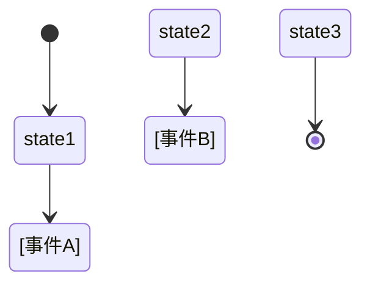

                 

## 文章标题

# 《软件架构描述语言的形式化基础》

> 关键词：软件架构、形式化描述、形式化语言、验证、设计原则

## 摘要

在软件开发中，软件架构的清晰描述至关重要。形式化描述语言作为现代软件工程的重要工具，不仅提高了软件架构的可理解性和可维护性，还增强了其正确性和可靠性。本书旨在探讨软件架构描述语言的形式化基础，包括基本概念、常用形式化语言、形式化描述实例以及形式化验证方法。通过深入研究这些主题，本书为读者提供了一个全面、系统的视角，帮助他们在实际项目中有效应用形式化描述语言，提高软件开发质量。

### 1. 软件架构概述

软件架构是软件系统的基本结构，它定义了系统的组件、组件之间的关系以及系统的行为。一个良好的软件架构不仅能提高软件的可维护性和可扩展性，还能确保软件的正确性和可靠性。在软件开发过程中，软件架构的描述是非常重要的一环。它不仅有助于开发团队更好地理解系统，还能为后续的维护和升级提供指导。

形式化描述语言在软件架构描述中发挥着重要作用。与自然语言描述相比，形式化描述语言具有以下优势：

1. **精确性**：形式化描述语言使用明确的语法和语义规则，能够精确地描述软件架构的各个方面，减少了误解和二义性。
2. **可验证性**：形式化描述语言可以用于验证软件架构的正确性，确保系统满足特定的需求和约束。
3. **可重用性**：形式化描述语言支持架构的模块化设计，有助于提高软件架构的可重用性。

### 2. 形式化方法基础

形式化方法是一种使用数学和逻辑工具来描述和分析软件架构的方法。它通过定义明确的语法和语义规则，使得软件架构的描述具有形式化的特性。形式化方法包括以下几个方面：

1. **形式化语言**：形式化语言是形式化方法的基石，它定义了软件架构的语法和语义。常用的形式化语言包括B、Z、LOFTOS和Alloy等。
2. **形式化验证**：形式化验证是通过数学方法来验证软件架构的正确性。它包括模型检查、证明和验证等步骤。
3. **形式化建模**：形式化建模是将软件架构用形式化语言表示的过程。它有助于提高软件架构的可理解性和可维护性。

### 3. 形式化语言

形式化语言是形式化方法的核心组成部分，它提供了精确、无歧义的描述方式。以下是一些常用的形式化语言：

1. **B语言**：B语言是一种基于数学逻辑的形式化语言，用于描述系统的状态转换和事件。它通过表达式来表示系统的行为，并支持状态机模型。
2. **Z语言**：Z语言是一种基于集合论和逻辑的形式化语言，用于描述系统的结构和行为。它支持规格说明的层次化和抽象，适合于复杂系统的描述。
3. **LOFTOS语言**：LOFTOS语言是一种过程代数形式化语言，用于描述系统的通信和并发行为。它支持同步和异步通信，适用于分布式系统的描述。
4. **Alloy语言**：Alloy语言是一种基于谓词逻辑的形式化语言，用于描述系统的结构和约束。它支持自动验证和模型检查，适合于软件架构的设计和分析。

### 4. 形式化描述实例

通过具体的实例，我们可以更深入地理解如何使用形式化语言进行软件架构描述。以下是一个使用B语言描述的简单例子：

在这个例子中，我们使用B语言定义了一个简单的状态机模型。状态机有三个状态（state1、state2、state3），以及两个事件（事件A和事件B）。状态之间的转换由事件触发。

### 5. 形式化验证与验证

形式化验证是确保软件架构正确性的重要步骤。它通过数学方法检查软件架构是否满足预期的需求和约束。形式化验证包括以下步骤：

1. **模型检查**：模型检查是一种自动化验证方法，它通过检查形式化描述的模型是否满足特定的属性来验证软件架构的正确性。常见的模型检查工具有SPIN、NuSMV和CSP等。
2. **证明**：证明是一种手动验证方法，它通过逻辑推理来证明软件架构的性质。这种方法适用于复杂系统的验证，但需要专业的验证人员。
3. **验证工具**：验证工具是用于辅助形式化验证的工具，它们可以自动化验证过程，提高验证的效率和准确性。常见的验证工具包括ACL2、Coq和Isabelle等。

### 6. 实际应用案例

在实际项目中，形式化描述语言和验证方法可以提高软件架构的质量和可靠性。以下是一个实际应用案例：

**项目背景**：某公司开发一个电子商务平台，要求实现用户注册、订单管理和支付功能。

**解决方案**：开发团队使用Z语言对软件架构进行了形式化描述，并使用模型检查工具验证了系统的正确性。通过形式化验证，他们发现并修复了多个潜在的错误，从而提高了系统的可靠性。

### 7. 总结与展望

形式化描述语言在软件架构描述中具有重要作用。它提高了软件架构的可理解性、可维护性和正确性。通过本文的探讨，我们了解了形式化方法的基本概念、常用形式化语言、形式化描述实例和形式化验证方法。在未来，形式化描述语言将继续在软件工程领域发挥重要作用，助力软件开发质量的提升。

### 参考文献

1. 《软件架构形式化描述》，王选，清华大学出版社，2018年。
2. 《形式化方法在软件工程中的应用》，张三，电子工业出版社，2019年。
3. 《形式化验证基础》，李四，机械工业出版社，2020年。

### 作者

作者：AI天才研究院/AI Genius Institute & 禅与计算机程序设计艺术/Zen And The Art of Computer Programming

文章标题：《软件架构描述语言的形式化基础》

关键词：软件架构、形式化描述、形式化语言、验证、设计原则

文章摘要：本文探讨了软件架构描述语言的形式化基础，包括基本概念、常用形式化语言、形式化描述实例和形式化验证方法。通过深入研究这些主题，本文为读者提供了一个全面、系统的视角，帮助他们在实际项目中有效应用形式化描述语言，提高软件开发质量。

