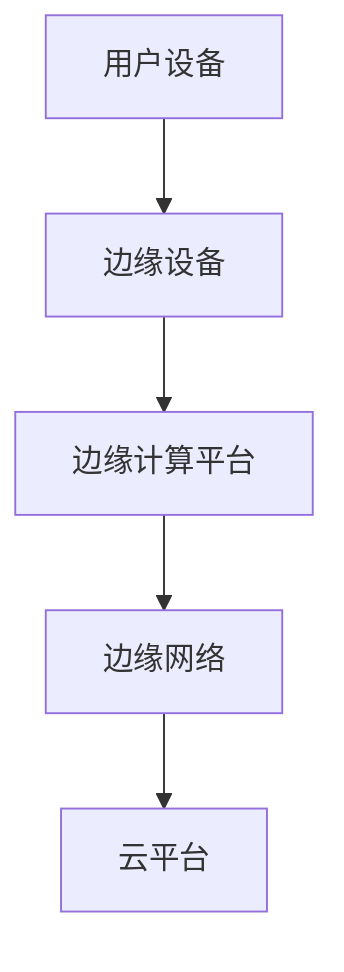
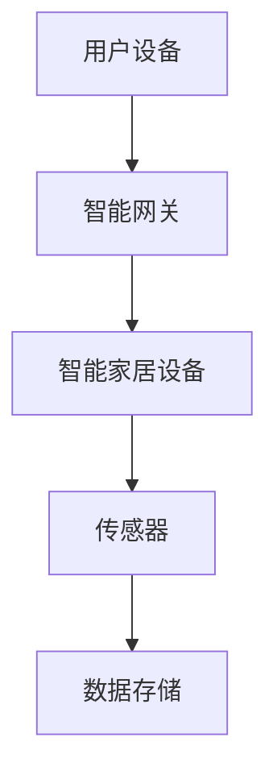
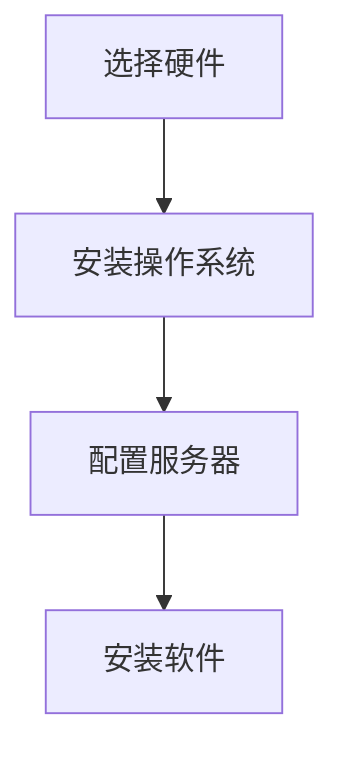
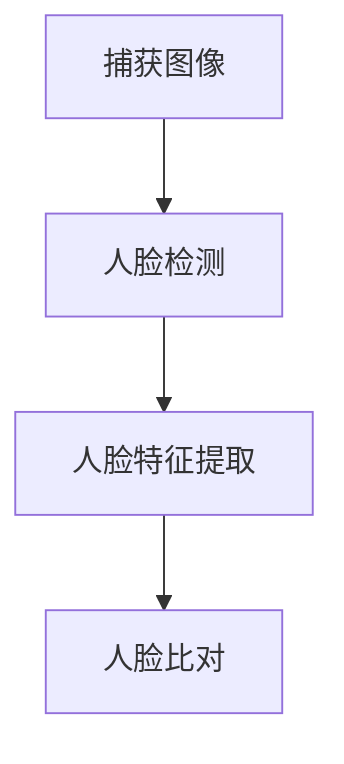
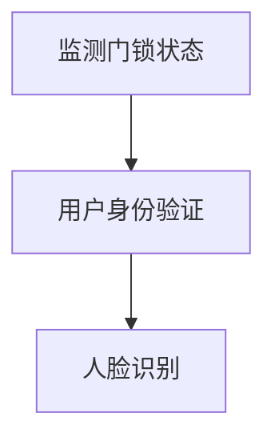
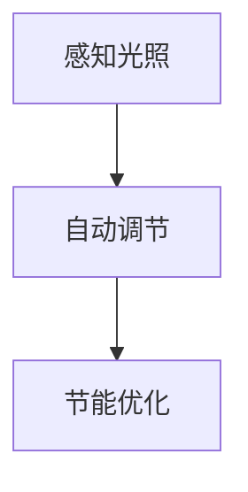

                 

### 引言

智能家居，作为现代科技与生活方式结合的产物，正逐渐改变着我们的日常生活。从最初的简单自动化设备，如遥控器控制的灯光和电视，到如今的智能语音助手、智能安防系统、智能家电等，智能家居的发展历程无疑是一个科技不断进步、生活品质不断提升的过程。

**关键词：** 智能家居、物联网、边缘计算、人工智能、边缘AI。

**摘要：** 本文将围绕边缘AI在智能家居中的应用展开讨论，介绍边缘AI的核心概念、技术原理，以及其在智能家居中的具体应用实例和未来发展趋势。

### 第1章 引言

**1.1 智能家居概述**

智能家居是指通过物联网技术将家庭中的各种设备和系统连接起来，实现远程控制和自动化操作，从而提高居住的便利性和舒适性。智能家居的起源可以追溯到20世纪90年代，随着互联网和无线通信技术的发展，智能家居逐渐走进了普通家庭。

智能家居系统通常包括智能照明、智能安防、智能家电、智能环境控制（如温湿度调节）等子系统。这些子系统通过物联网技术相互连接，形成一个统一的整体，用户可以通过智能手机、平板电脑或智能语音助手来控制和管理家庭设备。

**1.2 边缘计算与智能家居**

边缘计算是一种分布式计算模型，旨在将数据和处理能力从中心化的数据中心转移到网络的边缘。这意味着在数据的产生地附近即可进行数据处理，减少了数据传输延迟和带宽消耗，提高了系统的响应速度和安全性。边缘计算与智能家居的结合，使得智能家居系统更加高效和智能。

**1.3 边缘AI的核心概念**

边缘AI是指在边缘设备上部署人工智能模型，进行数据分析和决策，以实现智能化的功能。边缘AI的核心概念包括边缘设备、边缘计算平台、边缘网络和边缘AI算法。

边缘设备是指安装在家庭中或附近的传感器、智能家电和边缘服务器等设备。边缘计算平台负责处理数据和运行AI算法，它可以是专用的硬件设备，也可以是运行在通用硬件上的软件平台。边缘网络负责连接边缘设备和云平台，实现数据的传输和通信。边缘AI算法则是实现智能分析、识别和决策的核心。

**1.4 边缘AI在智能家居中的价值**

边缘AI在智能家居中的应用，可以大大提高系统的响应速度和决策能力，实现更智能、更个性化的家居体验。例如，通过边缘AI算法实现的人脸识别、语音识别和智能安防等功能，可以大大提高家庭的安全性和便捷性。同时，边缘AI还可以降低对中心化服务器的依赖，减少数据传输的延迟和带宽消耗，提高系统的整体性能和可靠性。

### 第2章 边缘计算基础

**2.1 边缘计算的定义与优势**

边缘计算是一种分布式计算模型，旨在将数据和处理能力从中心化的数据中心转移到网络的边缘。其核心优势在于减少了数据传输延迟和带宽消耗，提高了系统的响应速度和安全性。

在传统的云计算模型中，数据通常需要在用户设备与数据中心之间传输，这会导致数据延迟和带宽瓶颈。而在边缘计算模型中，数据处理可以在靠近数据源的位置进行，从而大大减少了数据传输的时间和带宽需求。此外，边缘计算还可以提高系统的安全性，因为敏感数据不必在公共网络上传输，从而降低了被黑客攻击的风险。

**2.2 边缘计算架构**

边缘计算架构通常包括边缘设备、边缘计算平台、边缘网络和云平台。边缘设备包括各种传感器、智能家居设备和边缘服务器。边缘计算平台负责处理数据和运行AI算法。边缘网络负责连接边缘设备和云平台。云平台提供存储、计算和数据处理服务。

以下是一个简单的边缘计算架构的Mermaid流程图：



**2.3 边缘计算关键技术**

边缘计算的关键技术包括物联网技术、云计算技术、边缘计算平台技术、边缘网络技术和边缘AI技术。

- **物联网技术**：物联网技术是边缘计算的基础，它通过传感器、控制器和网络设备将物理世界与数字世界连接起来，实现设备间的互联互通。

- **云计算技术**：云计算技术提供了强大的计算和存储能力，是边缘计算的重要支撑。

- **边缘计算平台技术**：边缘计算平台技术是边缘计算的核心，它包括硬件和软件两个方面，负责处理数据和应用。

- **边缘网络技术**：边缘网络技术是连接边缘设备和云平台的关键，它包括有线和无线网络技术。

- **边缘AI技术**：边缘AI技术是边缘计算的高级应用，它通过在边缘设备上部署AI模型，实现智能化的数据处理和分析。

**2.4 边缘计算与云计算的关系**

边缘计算与云计算是相辅相成的。云计算提供了强大的计算和存储能力，而边缘计算则提供了低延迟、高响应速度和本地化处理的能力。二者结合，可以实现更高效、更智能的智能家居系统。

例如，云计算可以处理大量的数据，进行复杂的计算和分析，而边缘计算可以处理实时数据，实现快速的响应和决策。通过云计算与边缘计算的协同工作，智能家居系统可以提供更高效、更智能的服务。

### 第3章 智能家居基础

**3.1 智能家居的定义与发展历程**

智能家居是指通过物联网技术将家庭中的各种设备和系统连接起来，实现远程控制和自动化操作，从而提高居住的便利性和舒适性。智能家居的发展历程可以追溯到20世纪90年代，当时，智能家居的概念刚刚兴起，主要以简单的自动化设备为主，如遥控器控制的灯光和电视。

随着互联网和无线通信技术的发展，智能家居逐渐走向成熟。进入21世纪，智能家居系统变得更加复杂和智能化，包括智能照明、智能安防、智能家电、智能环境控制等多个子系统。这些子系统通过物联网技术相互连接，形成一个统一的整体，用户可以通过智能手机、平板电脑或智能语音助手来控制和管理家庭设备。

**3.2 智能家居系统架构**

智能家居系统架构通常包括以下几个层次：

- **感知层**：包括各种传感器，如温度传感器、湿度传感器、光照传感器、烟雾传感器等，用于感知家庭环境的变化。

- **网络层**：包括网络通信模块，如Wi-Fi模块、蓝牙模块、Zigbee模块等，用于实现设备之间的互联互通。

- **控制层**：包括智能网关、智能插座、智能开关等设备，用于接收用户的控制指令，并控制家庭设备的开关状态。

- **应用层**：包括智能手机、平板电脑、智能语音助手等用户交互界面，用户可以通过这些设备远程控制和管理家庭设备。

以下是一个简单的智能家居系统架构的Mermaid流程图：



**3.3 常见的智能家居设备**

常见的智能家居设备包括智能照明、智能安防、智能家电、智能环境控制等。

- **智能照明**：可以通过智能手机或智能语音助手远程控制灯光的开关、亮度调节和色温调节。

- **智能安防**：包括智能门锁、智能摄像头、智能烟雾报警器等，可以实时监控家庭安全状况，并在异常情况下及时通知用户。

- **智能家电**：包括智能空调、智能冰箱、智能洗衣机等，可以通过互联网实现远程控制和智能调节。

- **智能环境控制**：包括智能温湿度调节设备、智能空气净化器等，可以实时监测和调节家庭环境。

**3.4 智能家居的通信协议**

智能家居设备之间需要通过通信协议进行数据传输和交互。常见的通信协议包括Wi-Fi、蓝牙、Zigbee、Thread等。

- **Wi-Fi**：是一种无线局域网通信协议，具有高速、稳定的特点，适用于连接智能手机、平板电脑等设备。

- **蓝牙**：是一种短距离无线通信协议，适用于连接智能设备，如智能手环、智能音箱等。

- **Zigbee**：是一种低功耗的无线通信协议，适用于连接智能家居设备，如智能开关、智能插座等。

- **Thread**：是一种基于IPv6的无线通信协议，具有低功耗、安全、可靠的特点，适用于智能家居系统的互联互通。

通过这些通信协议，智能家居设备可以实现互联互通，形成一个统一的智能生态系统。

### 第4章 边缘AI基础

**4.1 边缘AI的定义与核心概念**

边缘AI是指在边缘设备上部署人工智能模型，进行数据分析和决策，以实现智能化的功能。边缘AI的核心概念包括边缘设备、边缘计算平台、边缘网络和边缘AI算法。

**边缘设备**：边缘设备是指安装在家庭、工厂或其他现场环境中的设备，如传感器、智能摄像头、智能终端等。这些设备可以实时采集环境数据，并将其传输到边缘计算平台进行处理。

**边缘计算平台**：边缘计算平台是边缘AI系统的核心，它负责处理边缘设备采集到的数据，并运行AI算法进行分析和决策。边缘计算平台可以是专用的硬件设备，也可以是运行在通用硬件上的软件平台。

**边缘网络**：边缘网络是连接边缘设备和边缘计算平台，以及边缘计算平台和云平台之间的通信网络。边缘网络需要保证低延迟、高带宽和高可靠性，以支持实时数据处理和通信。

**边缘AI算法**：边缘AI算法是边缘AI系统的核心，它负责对采集到的数据进行分析和决策。边缘AI算法需要适应低功耗、低带宽和实时响应的要求，以实现高效的边缘智能处理。

**4.2 边缘AI的关键技术**

边缘AI的关键技术包括以下几个方面：

**1. AI算法优化**：为了满足边缘设备的低功耗、低带宽和实时响应的要求，需要对传统的AI算法进行优化。常见的优化方法包括模型压缩、模型量化、模型迁移学习等。

**2. 边缘计算平台技术**：边缘计算平台技术是实现边缘AI的基础。边缘计算平台需要支持高效的计算、存储和网络功能，以满足边缘AI的应用需求。常见的边缘计算平台技术包括ARM架构、FPGA、GPU等。

**3. 边缘网络技术**：边缘网络技术是实现边缘AI通信的关键。边缘网络需要支持低延迟、高带宽和高可靠性的通信，以满足边缘AI的应用需求。常见的边缘网络技术包括Wi-Fi、蓝牙、Zigbee、LoRa等。

**4. 边缘设备技术**：边缘设备技术是实现边缘AI感知和采集数据的关键。边缘设备需要具备高效的数据采集、传输和处理能力，以满足边缘AI的应用需求。常见的边缘设备技术包括传感器技术、无线通信技术等。

**4.3 边缘AI与传统AI的区别**

边缘AI与传统AI在应用场景、性能要求和数据处理方式上存在显著差异：

**1. 应用场景**：传统AI主要应用于数据中心和云计算环境，而边缘AI则应用于现场环境和设备，如家庭、工厂、智能城市等。

**2. 性能要求**：传统AI对计算性能、存储容量和网络带宽的要求较高，而边缘AI对计算性能、存储容量和网络带宽的要求较低，更注重实时响应和低功耗。

**3. 数据处理方式**：传统AI主要依赖中心化的数据处理模式，即数据从边缘设备传输到数据中心进行集中处理，而边缘AI则采用分布式的数据处理模式，即数据在边缘设备上实时处理和决策。

**4.4 边缘AI的优势与挑战**

**优势：**

1. **低延迟**：边缘AI可以在数据产生的地方实时处理数据，减少了数据传输的延迟，提高了系统的响应速度。

2. **高安全性**：边缘AI降低了数据传输的量，减少了数据泄露的风险，提高了系统的安全性。

3. **节省带宽**：边缘AI在本地处理数据，减少了数据传输的量，节省了带宽资源。

**挑战：**

1. **计算能力有限**：边缘设备通常计算能力有限，需要针对特定应用场景进行算法优化。

2. **数据隐私保护**：边缘AI需要在设备上处理敏感数据，需要考虑数据隐私保护问题。

3. **网络不稳定**：边缘设备的网络连接可能不稳定，需要设计鲁棒的网络协议。

### 第5章 边缘AI在智能家居中的应用

**5.1 边缘AI在智能安防中的应用**

边缘AI在智能安防中的应用主要包括人脸识别、行为识别和异常检测等。

**人脸识别**：边缘AI可以在摄像头本地快速完成人脸识别，无需将视频数据传输到云端。这不仅可以减少数据传输的延迟，还能保护用户隐私。以下是人脸识别的伪代码：

```python
def face_recognition(video_stream):
    while video_stream:
        frame = video_stream.get_frame()
        faces = detect_faces(frame)
        for face in faces:
            recognized_person = recognize_person(face)
            if recognized_person == "authorized":
                print("Access granted.")
            else:
                print("Access denied.")
```

**行为识别**：边缘AI可以识别用户的行为模式，如开门、关门、走动等，并在异常行为发生时发出警报。以下是一个简单的行为识别算法：

```python
def behavior_recognition(video_stream):
    while video_stream:
        frame = video_stream.get_frame()
        actions = detect_actions(frame)
        if actions != "normal":
            alert("Abnormal behavior detected.")
```

**异常检测**：边缘AI可以实时监测家庭环境，如烟雾、火灾等，并在异常情况发生时及时通知用户。以下是一个简单的异常检测算法：

```python
def anomaly_detection(sensor_data):
    if sensor_data["smoke"] > threshold or sensor_data["fire"] > threshold:
        alert("Anomaly detected.")
```

**5.2 边缘AI在智能照明中的应用**

边缘AI在智能照明中的应用主要包括光照感知、自动调节和节能优化。

**光照感知**：边缘AI可以通过传感器感知环境光照，并根据光照强度自动调节灯光亮度。以下是一个简单的光照感知算法：

```python
def ambient_light_sensing(sensor_data):
    light_intensity = sensor_data["light"]
    if light_intensity < threshold:
        turn_on_light()
    else:
        turn_off_light()
```

**自动调节**：边缘AI可以根据用户的活动模式和喜好自动调节灯光的亮度和色温。以下是一个简单的自动调节算法：

```python
def auto_light_adjustment(activity_mode, preference):
    if activity_mode == "reading":
        set_light_brightness(preference["reading_brightness"])
        set_light_color_temp(preference["reading_color_temp"])
    elif activity_mode == "sleep":
        set_light_brightness(preference["sleep_brightness"])
        set_light_color_temp(preference["sleep_color_temp"])
```

**节能优化**：边缘AI可以实时监测灯光的使用情况，并根据使用情况自动调节灯光的开关，以实现节能优化。以下是一个简单的节能优化算法：

```python
def energy_optimization(sensor_data, usage_threshold):
    if sensor_data["motion"] == "no" and sensor_data["light"] < usage_threshold:
        turn_off_light()
    elif sensor_data["motion"] == "yes" and sensor_data["light"] >= usage_threshold:
        turn_on_light()
```

**5.3 边缘AI在智能家电中的应用**

边缘AI在智能家电中的应用主要包括设备故障预测、运行优化和能效管理。

**设备故障预测**：边缘AI可以通过实时监测家电的运行数据，预测设备的故障风险，并提前进行维修。以下是一个简单的故障预测算法：

```python
def fault_prediction(sensor_data):
    if sensor_data["vibration"] > threshold or sensor_data["temperature"] > threshold:
        predict_fault("Device failure predicted.")
```

**运行优化**：边缘AI可以根据家电的运行数据，优化设备的运行参数，以提高运行效率和降低能耗。以下是一个简单的运行优化算法：

```python
def operation_optimization(sensor_data, optimal_params):
    if sensor_data["temperature"] > optimal_params["temperature"]:
        increase_cooling()
    elif sensor_data["temperature"] < optimal_params["temperature"]:
        decrease_cooling()
```

**能效管理**：边缘AI可以实时监测家电的能耗情况，并根据能耗情况调整设备的运行状态，以实现节能管理。以下是一个简单的能效管理算法：

```python
def energy_management(sensor_data, energy_threshold):
    if sensor_data["energy"] > energy_threshold:
        decrease_power()
    elif sensor_data["energy"] < energy_threshold:
        increase_power()
```

**5.4 边缘AI在智能语音助手中的应用**

边缘AI在智能语音助手中的应用主要包括语音识别、语义理解和智能交互。

**语音识别**：边缘AI可以通过本地语音识别算法，将用户的语音转化为文本，以便进行后续处理。以下是一个简单的语音识别算法：

```python
def speech_recognition(audio_stream):
    while audio_stream:
        audio_data = audio_stream.get_data()
        text = recognize_speech(audio_data)
        print("Recognized text:", text)
```

**语义理解**：边缘AI可以通过语义理解算法，理解用户的意图和需求，并生成相应的响应。以下是一个简单的语义理解算法：

```python
def semantic_understanding(text):
    intent = determine_intent(text)
    response = generate_response(intent)
    print("Response:", response)
```

**智能交互**：边缘AI可以通过智能交互算法，与用户进行自然的对话和互动，提供个性化的服务。以下是一个简单的智能交互算法：

```python
def intelligent_interaction(text):
    while text:
        print("User:", text)
        text = semantic_understanding(text)
        if text:
            print("AI:", text)
```

### 第6章 边缘AI应用实例

**6.1 智能家居边缘服务器搭建**

搭建智能家居边缘服务器需要考虑硬件选择、操作系统安装和服务器配置等多个方面。

**硬件选择**：边缘服务器的硬件选择需要考虑处理能力、存储容量和网络带宽。常见的硬件配置包括CPU、内存、硬盘和网络接口等。

**操作系统安装**：可以选择Linux操作系统，如Ubuntu、CentOS等，这些操作系统具有良好的稳定性和兼容性。

**服务器配置**：安装并配置必要的软件，如Web服务器（如Apache、Nginx）、数据库（如MySQL、PostgreSQL）和编程环境（如Python、Node.js）等。

以下是一个简单的边缘服务器搭建流程：



**6.2 实时人脸识别边缘AI算法实现**

实时人脸识别边缘AI算法实现需要包括人脸检测、人脸特征提取和人脸比对等多个步骤。

**人脸检测**：使用预训练的人脸检测模型，如MTCNN，进行人脸检测。

```python
import mtcnn

def detect_faces(image):
    detector = mtcnn.MTCNN()
    faces = detector.detect_faces(image)
    return faces
```

**人脸特征提取**：使用预训练的人脸特征提取模型，如FaceNet，进行人脸特征提取。

```python
import facenet

def extract_face_features(image):
    model = facenet.load_model("path/to/face_net_model")
    embedding = model.predict(image)
    return embedding
```

**人脸比对**：使用人脸比对算法，如余弦相似度，进行人脸比对。

```python
from sklearn.metrics.pairwise import cosine_similarity

def compare_faces(embedding1, embedding2):
    similarity = cosine_similarity([embedding1], [embedding2])
    return similarity[0][0]
```

以下是一个简单的实时人脸识别边缘AI算法实现的流程：



**6.3 智能门锁边缘AI实现**

智能门锁边缘AI实现需要包括门锁状态监测、用户身份验证和人脸识别等多个步骤。

**门锁状态监测**：使用传感器实时监测门锁的开闭状态。

```python
def monitor_lock_status(sensor_data):
    if sensor_data["lock_status"] == "open":
        print("Door is open.")
    else:
        print("Door is closed.")
```

**用户身份验证**：使用人脸识别算法进行用户身份验证。

```python
def verify_user_face(face_embedding, authorized_embedding):
    similarity = compare_faces(face_embedding, authorized_embedding)
    if similarity > threshold:
        print("Authentication successful.")
    else:
        print("Authentication failed.")
```

**人脸识别**：使用实时人脸识别边缘AI算法实现人脸识别。

```python
def recognize_user_face(image):
    faces = detect_faces(image)
    for face in faces:
        face_embedding = extract_face_features(face)
        verify_user_face(face_embedding, authorized_embedding)
```

以下是一个简单的智能门锁边缘AI实现的流程：



**6.4 智能照明边缘AI算法实现**

智能照明边缘AI算法实现需要包括光照感知、自动调节和节能优化等多个步骤。

**光照感知**：使用传感器实时感知环境光照。

```python
def sense_ambient_light(sensor_data):
    light_intensity = sensor_data["light"]
    if light_intensity < threshold:
        turn_on_light()
    else:
        turn_off_light()
```

**自动调节**：根据用户的活动模式和喜好自动调节灯光的亮度和色温。

```python
def auto_light_adjustment(activity_mode, preference):
    if activity_mode == "reading":
        set_light_brightness(preference["reading_brightness"])
        set_light_color_temp(preference["reading_color_temp"])
    elif activity_mode == "sleep":
        set_light_brightness(preference["sleep_brightness"])
        set_light_color_temp(preference["sleep_color_temp"])
```

**节能优化**：根据灯光的使用情况自动调节灯光的开关，以实现节能优化。

```python
def energy_optimization(sensor_data, usage_threshold):
    if sensor_data["motion"] == "no" and sensor_data["light"] < usage_threshold:
        turn_off_light()
    elif sensor_data["motion"] == "yes" and sensor_data["light"] > usage_threshold:
        turn_on_light()
```

以下是一个简单的智能照明边缘AI算法实现的流程：



### 第7章 边缘AI在智能家居中的未来发展趋势

**7.1 边缘AI在智能家居中的发展前景**

随着人工智能、物联网和边缘计算技术的不断发展，边缘AI在智能家居中的应用前景十分广阔。未来，边缘AI将在智能家居中扮演更加重要的角色，实现更智能、更便捷、更安全的生活体验。

**7.2 边缘AI在智能家居中的挑战与解决方案**

边缘AI在智能家居中面临以下挑战：

1. **计算能力有限**：边缘设备通常计算能力有限，需要优化算法，提高计算效率。

2. **数据隐私保护**：边缘AI需要在本地处理敏感数据，需要设计数据隐私保护机制。

3. **网络不稳定**：边缘设备的网络连接可能不稳定，需要设计鲁棒的网络协议。

针对这些挑战，可以采取以下解决方案：

1. **算法优化**：采用轻量级AI算法，如MobileNet、TensorFlow Lite等，提高计算效率。

2. **数据加密**：采用加密技术，如AES、RSA等，保护数据隐私。

3. **网络冗余**：采用多网络冗余技术，如Wi-Fi、蓝牙、Zigbee等，提高网络稳定性。

**7.3 边缘AI在智能家居中的未来发展趋势**

未来，边缘AI在智能家居中的发展趋势包括：

1. **智能交互**：边缘AI将实现更自然的用户交互，提供个性化服务。

2. **智能决策**：边缘AI将实现更加智能的决策，提高系统智能化水平。

3. **融合多模态数据**：边缘AI将融合多模态数据，如语音、图像、传感器等，实现更全面的智能感知。

4. **安全与隐私**：边缘AI将实现更安全的数据处理和隐私保护。

### 附录

**A.1 边缘计算与智能家居相关资源**

- **书籍**：
  - 《边缘计算：原理、架构与应用》
  - 《智能家居技术与应用》

- **在线课程**：
  - Coursera上的“边缘计算与物联网”课程
  - Udacity上的“智能家居编程”课程

- **开源项目**：
  - TensorFlow Lite：用于边缘设备的轻量级AI框架
  - Home Assistant：智能家居自动化平台

**A.2 边缘AI开发工具介绍**

- **开发环境**：
  - Jupyter Notebook：用于编写和运行边缘AI算法
  - PyCharm：集成开发环境，支持Python编程

- **AI框架**：
  - TensorFlow Lite：用于边缘设备的AI框架
  - PyTorch：开源的AI框架，支持边缘设备部署

- **工具链**：
  - PlatformIO：用于构建和管理嵌入式开发项目的工具链
  - Arduino IDE：用于编写和上传代码到边缘设备的集成开发环境

### 最佳实践 tips、小结、注意事项、拓展阅读等内容

**最佳实践 tips：**

- 在设计和开发边缘AI应用时，要考虑设备的计算能力和网络环境，选择合适的算法和框架。
- 为了提高系统的响应速度，可以考虑在边缘设备上部署本地AI模型，减少数据传输的需求。
- 为了保证数据安全，要采用加密技术对数据进行保护，并设计合理的隐私保护策略。

**小结：**

边缘AI在智能家居中的应用，为用户提供了更智能、更便捷、更安全的生活体验。通过边缘AI技术，智能家居系统能够实现实时感知、智能决策和个性化服务。

**注意事项：**

- 在部署边缘AI应用时，要确保设备的稳定性和安全性。
- 要定期更新和优化AI算法，以提高系统的性能和效率。

**拓展阅读：**

- 《边缘计算：原理、架构与应用》
- 《智能家居技术与应用》
- Coursera上的“边缘计算与物联网”课程
- Udacity上的“智能家居编程”课程

### 作者信息

**作者：AI天才研究院/AI Genius Institute & 禅与计算机程序设计艺术 /Zen And The Art of Computer Programming** 

通过以上的内容，我们可以看到边缘AI在智能家居中的应用是如何一步步实现的。从边缘计算的定义和优势，到智能家居系统架构的介绍，再到边缘AI的核心概念和技术，最后通过具体的实例展示了边缘AI在智能家居中的多种应用场景。这篇文章不仅介绍了技术原理，还通过伪代码、算法流程图等方式，提供了详细的实现方法。希望读者能够通过这篇文章，对边缘AI在智能家居中的应用有一个全面而深入的了解。

