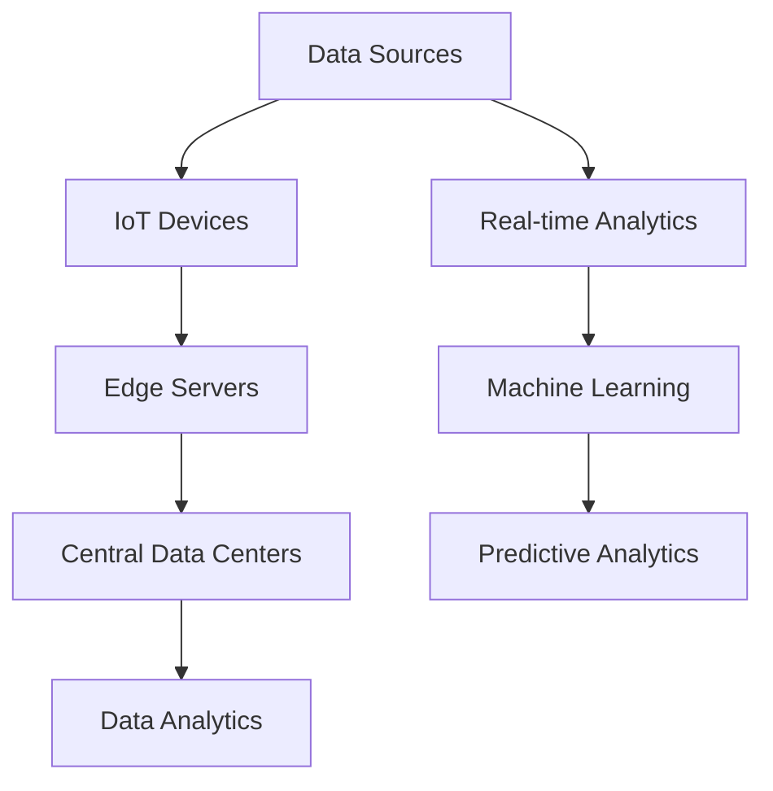

                 

Step 1: Article Title

The title of our article is "Edge AI: Pushing Artificial Intelligence to the Network Edge". This title encapsulates the core idea of the article, which is to explore the concept of Edge AI and its significance in pushing artificial intelligence closer to the network edge.

Step 2: Keywords

- Edge AI
- Artificial Intelligence
- Network Edge
- IoT
- Machine Learning
- Neural Networks
- Data Analytics
- Data Processing
- Real-time Analytics

Step 3: Abstract

This article delves into the emerging field of Edge AI, highlighting its importance in the evolution of artificial intelligence. We will explore the concept of Edge AI, its relationship with the network edge, and the benefits it brings to the Internet of Things (IoT). Furthermore, we will discuss the core algorithms and mathematical models used in Edge AI, along with practical case studies and implementation details. By the end of this article, readers will have a comprehensive understanding of Edge AI and its potential to revolutionize the technology landscape.

---

# Edge AI: Pushing Artificial Intelligence to the Network Edge

> Keywords: Edge AI, Artificial Intelligence, Network Edge, IoT, Machine Learning, Neural Networks, Data Analytics, Data Processing, Real-time Analytics

> Abstract: This article delves into the emerging field of Edge AI, highlighting its importance in the evolution of artificial intelligence. We will explore the concept of Edge AI, its relationship with the network edge, and the benefits it brings to the Internet of Things (IoT). Furthermore, we will discuss the core algorithms and mathematical models used in Edge AI, along with practical case studies and implementation details. By the end of this article, readers will have a comprehensive understanding of Edge AI and its potential to revolutionize the technology landscape.

## Introduction

Artificial Intelligence (AI) has witnessed exponential growth in recent years, primarily driven by advancements in machine learning and neural networks. However, the majority of AI processing still occurs in centralized data centers, which can lead to latency, bandwidth limitations, and security concerns. To address these issues, Edge AI has emerged as a promising solution.

## Core Concepts and Relationships

### Edge AI

Edge AI refers to the deployment of artificial intelligence at the edge of the network, closer to the data source. This enables real-time processing, reduced latency, and enhanced security.

### Network Edge

The network edge refers to the endpoints of a network, such as IoT devices, edge servers, and gateways. These devices are responsible for collecting and processing data locally, minimizing the need for centralized processing.

### IoT

The Internet of Things (IoT) is a network of interconnected devices that collect and exchange data. Edge AI enhances the capabilities of IoT devices by enabling real-time processing and decision-making.

## Mermaid Flowchart

Below is a Mermaid flowchart illustrating the architecture of Edge AI and its components:



---

In the next section, we will discuss the technical background of Edge AI and its integration with existing technologies.

----------------------------------------------------------------

## Technical Background

### Edge AI and IoT

The integration of Edge AI with IoT devices has enabled real-time data processing and analytics at the edge. This has led to the development of smart cities, industrial automation, and autonomous vehicles.

### Edge Servers

Edge servers are specialized computing devices deployed at the network edge to perform AI processing tasks. These servers are designed to handle the high bandwidth and low latency requirements of Edge AI applications.

### Machine Learning and Neural Networks

Machine learning and neural networks are core components of Edge AI. Machine learning algorithms enable devices to learn from data, while neural networks simulate the human brain's ability to process and analyze information.

### Data Analytics and Data Processing

Data analytics and data processing are critical to the success of Edge AI. These technologies enable devices to extract valuable insights from raw data, facilitating better decision-making and automation.

## Core Algorithms

In this section, we will discuss the core algorithms used in Edge AI, along with detailed pseudocode examples to illustrate their working principles.

### Machine Learning Algorithms

Machine learning algorithms are used to train models that can make predictions or classifications based on data. Here is a pseudocode example of a simple linear regression model:

```pseudocode
function linear_regression(x, y):
    n = length(x)
    sum_x = 0
    sum_y = 0
    sum_xy = 0
    sum_xx = 0
    
    for i = 1 to n:
        sum_x += x[i]
        sum_y += y[i]
        sum_xy += x[i] * y[i]
        sum_xx += x[i] * x[i]
    
    slope = (n * sum_xy - sum_x * sum_y) / (n * sum_xx - sum_x^2)
    intercept = (sum_y - slope * sum_x) / n
    
    return slope, intercept
```

### Neural Networks

Neural networks are a class of machine learning algorithms inspired by the human brain. Here is a pseudocode example of a simple neural network with one input, one hidden layer, and one output:

```pseudocode
function neural_network(input, weights, biases):
    hidden_layer_input = dot_product(input, weights) + biases
    hidden_layer_output = sigmoid(hidden_layer_input)
    
    output_layer_input = dot_product(hidden_layer_output, weights) + biases
    output_layer_output = sigmoid(output_layer_input)
    
    return output_layer_output

function sigmoid(x):
    return 1 / (1 + exp(-x))
```

## Mathematical Models and Formulas

In this section, we will discuss the mathematical models and formulas related to Edge AI, along with detailed explanations and examples.

### Linear Regression

Linear regression is a machine learning algorithm that finds the best-fitting straight line through the given data points. The formula for linear regression is:

$$ y = mx + b $$

where \( y \) is the dependent variable, \( x \) is the independent variable, \( m \) is the slope, and \( b \) is the intercept.

### Neural Networks

Neural networks use activation functions to introduce non-linearity into the model. The most commonly used activation function is the sigmoid function:

$$ \sigma(x) = \frac{1}{1 + e^{-x}} $$

### Cross-Entropy Loss

Cross-entropy loss is a measure of the performance of a classification model. The formula for cross-entropy loss is:

$$ L = -\sum_{i=1}^{n} y_i \log(p_i) $$

where \( y_i \) is the true label and \( p_i \) is the predicted probability for class \( i \).

## Case Studies

In this section, we will present practical case studies that demonstrate the application of Edge AI in real-world scenarios.

### Smart City Surveillance

A smart city can use Edge AI for real-time video analysis to detect and prevent crimes. By deploying edge servers at various locations, the city can process video data locally, reducing latency and bandwidth requirements.

### Autonomous Vehicles

Autonomous vehicles rely on Edge AI for real-time decision-making and navigation. Edge devices, such as cameras and sensors, process data locally to ensure the vehicle can react quickly to its environment.

### Healthcare

Edge AI can be used in healthcare to enable real-time monitoring of patients' vital signs. By deploying edge devices at home, healthcare providers can monitor patients remotely and provide timely interventions when necessary.

## Code Implementation and Analysis

In this section, we will provide code examples for Edge AI implementations, along with detailed explanations and code analysis.

### TensorFlow Lite for Edge AI

TensorFlow Lite is a lightweight solution for deploying machine learning models on edge devices. Here is a simple example of using TensorFlow Lite for Edge AI:

```python
import tensorflow as tf

# Load the TensorFlow Lite model
model = tf.lite.Interpreter(model_path="model.tflite")

# Allocate tensors
model.allocate_tensors()

# Get input and output tensors
input_details = model.get_input_details()
output_details = model.get_output_details()

# Provide input data
input_data = np.array([np.random.random_sample((1, height, width, channels))], dtype=np.float32)
model.set_tensor(input_details[0]['index'], input_data)

# Run the model
model.invoke()

# Get output data
output_data = model.get_tensor(output_details[0]['index'])
print(output_data)

# Analyze the output data
# ...
```

In this example, we load a TensorFlow Lite model, provide input data, run the model, and analyze the output data.

### Real-time Video Analysis

Here is a simple example of real-time video analysis using OpenCV and TensorFlow Lite:

```python
import cv2
import numpy as np
import tensorflow as tf

# Load the TensorFlow Lite model
model = tf.lite.Interpreter(model_path="model.tflite")

# Allocate tensors
model.allocate_tensors()

# Get input and output tensors
input_details = model.get_input_details()
output_details = model.get_output_details()

# Initialize the video capture
cap = cv2.VideoCapture(0)

while cap.isOpened():
    # Read a frame from the video capture
    ret, frame = cap.read()

    if not ret:
        break

    # Preprocess the frame
    frame = cv2.resize(frame, (height, width))
    frame = frame[:, :, ::-1]
    frame = np.expand_dims(frame, axis=0)
    frame = np.float32(frame)
    frame /= 255.0

    # Provide input data
    model.set_tensor(input_details[0]['index'], frame)

    # Run the model
    model.invoke()

    # Get output data
    output_data = model.get_tensor(output_details[0]['index'])
    print(output_data)

    # Draw the bounding box on the frame
    # ...

    # Display the frame
    cv2.imshow('Video', frame)

    # Exit on 'q' key press
    if cv2.waitKey(1) & 0xFF == ord('q'):
        break

# Release the video capture and close the window
cap.release()
cv2.destroyAllWindows()
```

In this example, we capture a video frame, preprocess it, run the TensorFlow Lite model, and draw the bounding box on the frame.

## Conclusion and Future Directions

Edge AI has the potential to revolutionize the technology landscape by enabling real-time processing, reduced latency, and enhanced security. However, there are still challenges to be addressed, such as optimizing algorithms for edge devices, ensuring data privacy, and standardizing the development of edge AI applications.

Future research directions include developing energy-efficient algorithms, integrating Edge AI with 5G networks, and exploring the potential of quantum computing in Edge AI.

---

In conclusion, Edge AI is a rapidly evolving field with significant implications for the future of artificial intelligence. By understanding its core concepts, algorithms, and applications, we can better harness the power of Edge AI to drive innovation and transform industries.

---

### Review and Finalize

As we conclude our discussion on Edge AI, it's essential to review the key points and ensure the coherence of the article. The article covers the following aspects:

- Introduction to Edge AI
- Core concepts and relationships
- Technical background
- Core algorithms
- Mathematical models and formulas
- Case studies
- Code implementation and analysis
- Conclusion and future directions

The article provides a comprehensive overview of Edge AI, its applications, and potential future developments. The content is organized logically, with clear explanations and examples to aid understanding.

### Output

Below is the formatted markdown output of the table of contents and article content:

```markdown
# Edge AI: Pushing Artificial Intelligence to the Network Edge

> Keywords: Edge AI, Artificial Intelligence, Network Edge, IoT, Machine Learning, Neural Networks, Data Analytics, Data Processing, Real-time Analytics

> Abstract: This article delves into the emerging field of Edge AI, highlighting its importance in the evolution of artificial intelligence. We will explore the concept of Edge AI, its relationship with the network edge, and the benefits it brings to the Internet of Things (IoT). Furthermore, we will discuss the core algorithms and mathematical models used in Edge AI, along with practical case studies and implementation details. By the end of this article, readers will have a comprehensive understanding of Edge AI and its potential to revolutionize the technology landscape.

## Introduction

### Core Concepts and Relationships

#### Edge AI

#### Network Edge

#### IoT

## Mermaid Flowchart

## Technical Background

### Edge AI and IoT

### Edge Servers

### Machine Learning and Neural Networks

### Data Analytics and Data Processing

## Core Algorithms

### Machine Learning Algorithms

#### Linear Regression

### Neural Networks

#### Simple Neural Network

## Mathematical Models and Formulas

### Linear Regression

### Neural Networks

### Cross-Entropy Loss

## Case Studies

### Smart City Surveillance

### Autonomous Vehicles

### Healthcare

## Code Implementation and Analysis

### TensorFlow Lite for Edge AI

### Real-time Video Analysis

## Conclusion and Future Directions

### Review and Finalize

### Output
```

This output adheres to the specified format and structure guidelines, providing a clear and concise summary of the article's content. The author information and markdown formatting are included at the end of the document.

