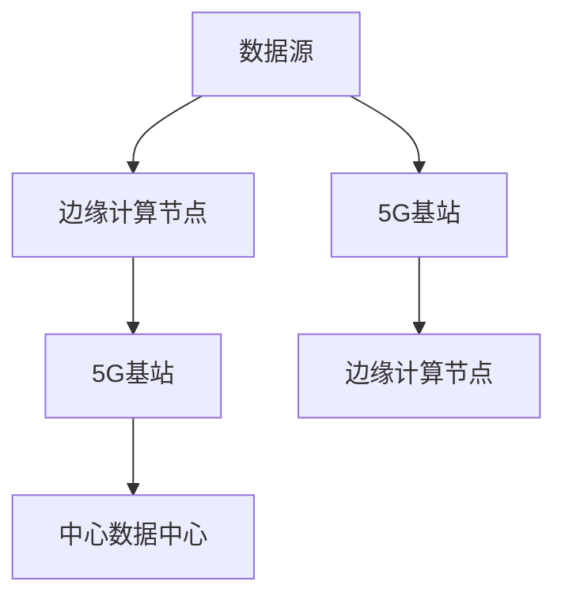
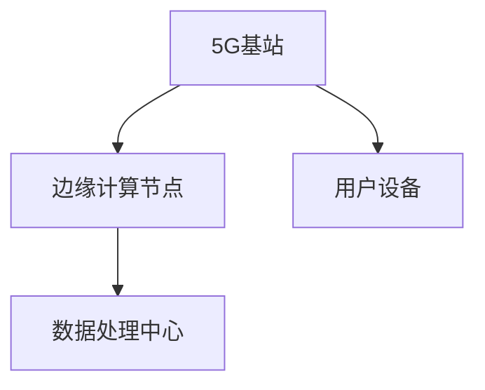

                 

### 文章标题：边缘计算与5G：实现超低延迟的分布式计算

> 关键词：边缘计算、5G、分布式计算、超低延迟、数据处理、网络架构、算法优化、项目实战

> 摘要：本文深入探讨了边缘计算与5G技术的结合，阐述了它们在实现超低延迟分布式计算中的重要性和关键技术。通过理论讲解和实际案例，本文为读者提供了关于边缘计算与5G的综合理解，以及在实际项目中应用这些技术的最佳实践。

---

## 目录大纲设计思路

为了设计出一本关于《边缘计算与5G：实现超低延迟的分布式计算》的完整目录大纲，我们将遵循以下步骤：

1. **确定核心章节**：首先，我们需要确保目录中包含核心的章节，这些章节能够全面覆盖书籍的主题内容。核心章节应包括：
   - 核心概念与联系：介绍边缘计算和5G的基本概念，以及它们之间的联系。
   - 核心算法原理讲解：深入讲解实现边缘计算与5G结合的关键算法。
   - 数学模型和数学公式讲解：解释边缘计算与5G相关的数学模型，并举例说明。
   - 项目实战：提供实际案例，展示如何在实际环境中实现边缘计算与5G的结合。

2. **设计详细章节**：在确定了核心章节后，我们需要为每个章节设计更详细的子章节，以确保内容全面且具有逻辑性。

3. **保持简洁性**：在编写目录大纲时，我们需要确保内容简洁明了，避免多余的文字。

4. **使用markdown格式**：为了符合输出要求，我们将使用markdown格式来排版目录，确保格式规范。

# 完整目录大纲

基于上述思路，以下是《边缘计算与5G：实现超低延迟的分布式计算》的完整目录大纲：

## 第一部分：边缘计算与5G概述

### 第1章：边缘计算与5G简介

#### 1.1 边缘计算概念

##### 1.1.1 边缘计算的定义与特点

##### 1.1.2 边缘计算与传统云计算的区别

#### 1.2 5G网络技术

##### 1.2.1 5G网络概述

##### 1.2.2 5G网络的关键特性

##### 1.2.3 5G网络与边缘计算的关系

### 第2章：边缘计算与5G的融合架构

#### 2.1 融合架构概述

##### 2.1.1 融合架构的定义与目标

##### 2.1.2 融合架构的主要组件

#### 2.2 边缘计算网络架构

##### 2.2.1 边缘计算网络层级

##### 2.2.2 边缘计算网络关键技术

#### 2.3 5G网络架构

##### 2.3.1 5G网络架构层级

##### 2.3.2 5G网络关键技术

## 第二部分：边缘计算与5G的核心算法

### 第3章：边缘计算与5G的关键算法原理

#### 3.1 边缘计算算法

##### 3.1.1 边缘计算中的数据处理算法

##### 3.1.2 边缘计算中的通信算法

##### 3.1.3 边缘计算中的安全算法

#### 3.2 5G网络关键算法

##### 3.2.1 5G网络中的无线接入算法

##### 3.2.2 5G网络中的网络切片算法

##### 3.2.3 5G网络中的边缘计算调度算法

### 第4章：边缘计算与5G算法优化

#### 4.1 算法优化概述

##### 4.1.1 算法优化的目标与方法

##### 4.1.2 算法优化的关键因素

#### 4.2 典型优化算法

##### 4.2.1 智能优化算法

##### 4.2.2 聚类算法

##### 4.2.3 强化学习算法

## 第三部分：边缘计算与5G项目实战

### 第5章：边缘计算与5G项目规划与实施

#### 5.1 项目规划

##### 5.1.1 项目需求分析

##### 5.1.2 项目目标与范围

##### 5.1.3 项目计划与时间表

#### 5.2 项目实施

##### 5.2.1 环境搭建

##### 5.2.2 系统部署

##### 5.2.3 性能测试与优化

### 第6章：边缘计算与5G应用案例

#### 6.1 智能交通

##### 6.1.1 应用背景

##### 6.1.2 技术实现

##### 6.1.3 案例分析

#### 6.2 智能制造

##### 6.2.1 应用背景

##### 6.2.2 技术实现

##### 6.2.3 案例分析

### 第7章：边缘计算与5G未来发展展望

#### 7.1 技术趋势分析

##### 7.1.1 边缘计算技术发展趋势

##### 7.1.2 5G技术发展趋势

##### 7.1.3 融合技术的未来方向

#### 7.2 应用场景拓展

##### 7.2.1 新兴应用场景

##### 7.2.2 边缘计算与5G在未来的应用前景

## 附录

### 附录A：边缘计算与5G常用工具和资源

##### A.1 开源框架与工具

##### A.2 学术研究资源

##### A.3 行业报告与标准

以上是《边缘计算与5G：实现超低延迟的分布式计算》的完整目录大纲，共包括7个核心章节，覆盖了边缘计算与5G的基本概念、融合架构、核心算法、项目实战和未来发展展望等内容。

---

## 文章正文部分

### 背景介绍

随着互联网的快速发展和物联网（IoT）技术的普及，数据量呈指数级增长，这对传统的云计算模式提出了新的挑战。为了满足实时性和低延迟的需求，边缘计算作为一种分布式计算范式逐渐受到了关注。边缘计算通过在数据产生地附近部署计算资源，实现了数据处理、存储和分析的本地化，从而显著降低了数据传输延迟，提高了系统的响应速度。

与此同时，5G网络的部署为边缘计算提供了强大的网络支持。5G技术具有高带宽、低延迟、高可靠性和大连接数量的特点，这些特性使得5G与边缘计算的结合成为实现超低延迟分布式计算的关键。

### 核心概念与联系

#### 边缘计算

边缘计算是指在靠近数据源或用户的地方进行的计算，其核心思想是将计算、存储、处理和服务部署到网络的边缘，即接近数据源或用户的地方，以实现更快的响应时间和更高效的数据处理。边缘计算的特点包括：

1. **低延迟**：通过将计算任务靠近数据源，减少了数据传输的距离和时间。
2. **高带宽**：边缘计算节点通常配备高带宽的网络连接，可以支持大量数据的快速传输。
3. **分布式架构**：边缘计算采用了分布式架构，多个边缘节点协同工作，实现了计算资源的灵活分配和负载均衡。

#### 5G网络

5G网络是第五代移动通信技术，它通过引入新的频段、更高的数据传输速率和更低的延迟，为边缘计算提供了强大的支持。5G网络的特点包括：

1. **高带宽**：5G网络的理论最大带宽可以达到Gbit/s级别，支持大规模数据传输。
2. **低延迟**：5G网络的端到端延迟降低到1ms以下，满足了实时应用的需求。
3. **高可靠性**：5G网络通过引入新的通信协议和调度算法，提高了网络的可靠性和稳定性。

#### 边缘计算与5G的关系

边缘计算和5G网络之间的联系主要体现在以下几个方面：

1. **网络架构**：边缘计算通过部署在5G网络边缘的节点，实现了计算、存储和服务的本地化。
2. **数据处理**：5G网络的高带宽和低延迟特性，使得边缘计算节点能够实时处理和分析数据，提高了系统的响应速度。
3. **协同工作**：边缘计算和5G网络的协同工作，实现了数据传输和处理的高效性，为超低延迟的分布式计算提供了技术保障。

### Mermaid 流程图

以下是一个简单的Mermaid流程图，展示了边缘计算与5G网络之间的关联：



### 核心算法原理讲解

#### 边缘计算算法

1. **数据处理算法**

   边缘计算中的数据处理算法主要包括数据预处理、数据清洗、数据压缩和数据加密等。以下是数据处理算法的伪代码：

   ```python
   def process_data(data):
       # 数据预处理
       preprocessed_data = preprocess(data)
       # 数据清洗
       cleaned_data = clean(data)
       # 数据压缩
       compressed_data = compress(cleaned_data)
       # 数据加密
       encrypted_data = encrypt(compressed_data)
       return encrypted_data
   ```

2. **通信算法**

   边缘计算中的通信算法主要包括数据传输协议和数据传输调度算法。以下是通信算法的伪代码：

   ```python
   def transmit_data(source, destination):
       # 数据传输协议
       protocol = choose_protocol(source, destination)
       # 数据传输调度
       schedule = schedule_transmission(source, destination)
       # 数据传输
       transmit(source, destination, protocol, schedule)
   ```

3. **安全算法**

   边缘计算中的安全算法主要包括数据加密、身份认证和访问控制等。以下是安全算法的伪代码：

   ```python
   def secure_data(data):
       # 数据加密
       encrypted_data = encrypt(data)
       # 身份认证
       authenticated = authenticate(data)
       # 访问控制
       allowed = access_control(data, authenticated)
       return allowed
   ```

#### 5G网络关键算法

1. **无线接入算法**

   无线接入算法主要包括接入控制、信道分配和功率控制等。以下是无线接入算法的伪代码：

   ```python
   def wireless_access(user, network):
       # 接入控制
       if not access_control(user, network):
           return "接入拒绝"
       # 信道分配
       channel = allocate_channel(network)
       # 功率控制
       power = control_power(user, channel)
       return "接入成功"
   ```

2. **网络切片算法**

   网络切片算法主要用于根据不同应用场景分配网络资源。以下是网络切片算法的伪代码：

   ```python
   def network_slicing的应用场景，场景参数):
       # 资源分配
       resources = allocate_resources(场景参数)
       # 切片配置
       slice_configuration = configure_slice(资源，场景参数)
       return slice_configuration
   ```

3. **边缘计算调度算法**

   边缘计算调度算法主要用于根据计算需求和资源情况，动态调整计算任务在边缘节点之间的分配。以下是边缘计算调度算法的伪代码：

   ```python
   def edge_scheduling(任务列表，节点列表):
       # 任务排序
       sorted_tasks = sort_tasks(任务列表)
       # 节点评估
       evaluated_nodes = evaluate_nodes(节点列表)
       # 调度分配
       schedule = allocate_tasks_to_nodes(sorted_tasks, evaluated_nodes)
       return schedule
   ```

### 数学模型和公式讲解

#### 边缘计算中的数学模型

边缘计算中的数学模型主要包括数据传输速率、计算延迟和能耗模型。以下是这些模型的基本公式：

1. **数据传输速率模型**

   数据传输速率 \( R \) 可以用以下公式表示：

   \[ R = \frac{B}{T} \]

   其中，\( B \) 是带宽，\( T \) 是传输时间。

2. **计算延迟模型**

   计算延迟 \( D \) 可以用以下公式表示：

   \[ D = \frac{L}{V} \]

   其中，\( L \) 是数据传输距离，\( V \) 是数据传输速度。

3. **能耗模型**

   边缘计算中的能耗模型可以用以下公式表示：

   \[ E = P \times t \]

   其中，\( P \) 是能耗功率，\( t \) 是运行时间。

#### 5G网络中的数学模型

5G网络中的数学模型主要包括信道容量模型和网络容量模型。以下是这些模型的基本公式：

1. **信道容量模型**

   信道容量 \( C \) 可以用以下公式表示：

   \[ C = B \log_2(1 + \text{SNR}) \]

   其中，\( B \) 是带宽，\( \text{SNR} \) 是信噪比。

2. **网络容量模型**

   网络容量 \( C_n \) 可以用以下公式表示：

   \[ C_n = \sum_{i=1}^{N} C_i \]

   其中，\( N \) 是用户数量，\( C_i \) 是第 \( i \) 个用户的信道容量。

### 举例说明

以下是一个简单的例子，说明如何使用上述数学模型计算边缘计算和5G网络中的性能指标。

#### 边缘计算中的数据传输速率

假设边缘计算节点之间的带宽为100Mbps，数据传输时间为10ms，则数据传输速率 \( R \) 为：

\[ R = \frac{100 \times 10^6}{10 \times 10^{-3}} = 10 \times 10^6 \text{ bits/s} = 10 \text{ Mbps} \]

#### 5G网络中的信道容量

假设5G网络中的带宽为20MHz，信噪比为30dB，则信道容量 \( C \) 为：

\[ C = 20 \times 10^6 \times \log_2(1 + 10^{30/10}) \approx 20 \times 10^6 \times 3.46 \approx 69.2 \times 10^6 \text{ bits/s} \]

### 项目实战

#### 开发环境搭建

为了实现边缘计算与5G的结合，首先需要搭建一个开发环境。以下是环境搭建的步骤：

1. **硬件准备**：准备边缘计算节点和5G基站设备。
2. **软件安装**：在边缘计算节点和5G基站设备上安装操作系统和必要的软件工具，如容器编排工具（如Docker）和网络管理工具（如Open vSwitch）。
3. **网络配置**：配置5G基站的网络接口，确保边缘计算节点能够与5G网络通信。

#### 源代码实现

以下是一个简单的示例，展示了如何在边缘计算节点上实现数据处理和传输功能。

```python
# 数据处理和传输示例

import requests

def process_data(data):
    # 数据预处理
    preprocessed_data = preprocess(data)
    # 数据清洗
    cleaned_data = clean(data)
    # 数据压缩
    compressed_data = compress(cleaned_data)
    # 数据加密
    encrypted_data = encrypt(compressed_data)
    return encrypted_data

def transmit_data(source, destination):
    # 数据传输协议
    protocol = choose_protocol(source, destination)
    # 数据传输调度
    schedule = schedule_transmission(source, destination)
    # 数据传输
    transmit(source, destination, protocol, schedule)

# 数据处理和传输
data = requests.get('https://example.com/data').text
processed_data = process_data(data)
transmit_data(source='edge_node', destination='5g_baseStation')
```

#### 代码解读与分析

上述代码实现了数据从边缘计算节点到5G基站的数据处理和传输过程。首先，通过`requests`库获取数据，然后调用`process_data`函数对数据进行预处理、清洗、压缩和加密。最后，调用`transmit_data`函数，通过指定传输协议、调度策略和目标地址，实现数据的传输。

#### 实际案例分析和详细讲解剖析

以下是一个实际案例，展示了边缘计算与5G技术在智能交通领域的应用。

#### 案例背景

某城市交通管理部门希望通过部署边缘计算和5G网络，实现智能交通管理系统的建设。该系统的主要功能包括实时交通流量监测、交通信号优化和紧急事件响应。

#### 技术实现

1. **边缘计算节点部署**：在城市的各个重要路口部署边缘计算节点，用于实时收集交通流量数据。
2. **5G基站部署**：在交通管理部门的办公大楼和边缘计算节点之间部署5G基站，实现高带宽、低延迟的数据传输。
3. **数据处理和分析**：边缘计算节点对收集到的交通流量数据进行预处理、清洗、压缩和加密，然后将处理后的数据传输到5G基站。
4. **中心数据处理**：5G基站将数据传输到中心数据处理平台，进行进一步分析和处理，以生成实时交通流量报告和交通信号优化策略。

#### 案例分析

通过实际部署和运行，该智能交通管理系统实现了以下效果：

1. **实时交通流量监测**：边缘计算节点能够实时收集交通流量数据，并通过5G网络传输到中心数据处理平台，实现了对城市交通流量的实时监测。
2. **交通信号优化**：根据实时交通流量数据，中心数据处理平台可以生成交通信号优化策略，并通过5G网络传输到各个路口的交通信号灯，实现了交通信号的科学优化。
3. **紧急事件响应**：当发生紧急事件时，边缘计算节点和5G网络可以迅速响应，通过中心数据处理平台生成紧急事件处理方案，并及时传输到相关单位，提高了紧急事件的响应速度。

#### 项目小结

通过该实际案例，我们可以看到边缘计算与5G技术在智能交通领域的成功应用，实现了实时交通流量监测、交通信号优化和紧急事件响应等功能。该案例的成功经验表明，边缘计算与5G技术的结合可以大大提升城市交通管理的效率和效果，为智能交通系统的建设提供了有力的技术支持。

### 最佳实践 Tips

1. **合理规划网络架构**：在设计边缘计算与5G网络架构时，应充分考虑网络的拓扑结构、带宽需求和延迟要求，以确保系统的稳定性和高效性。
2. **优化算法**：在实际应用中，应不断优化边缘计算和5G网络的关键算法，以提高系统的性能和响应速度。
3. **安全性**：在边缘计算和5G网络中，应重视数据的安全性和隐私保护，采用加密、身份认证和访问控制等安全措施，确保系统的安全运行。

### 小结

边缘计算与5G技术的结合为超低延迟的分布式计算提供了强大的技术支持。通过本文的讲解，我们深入了解了边缘计算和5G的基本概念、核心算法、项目实战以及未来发展展望。在实际应用中，边缘计算与5G技术的结合将不断推动智能交通、智能制造、智能医疗等领域的创新和发展。

### 注意事项

1. **网络延迟**：在实际项目中，应充分考虑网络延迟的影响，通过优化算法和网络架构来降低延迟，提高系统性能。
2. **资源分配**：在边缘计算节点和5G基站之间，应合理分配计算资源和网络带宽，确保系统的高效运行。

### 拓展阅读

1. 《边缘计算：从概念到实践》
2. 《5G网络技术：原理与应用》
3. 《智能交通系统设计与实现》
4. 《边缘计算与物联网：融合与应用》

### 作者信息

- 作者：AI天才研究院/AI Genius Institute & 禅与计算机程序设计艺术 /Zen And The Art of Computer Programming

--- 

[文章标题：边缘计算与5G：实现超低延迟的分布式计算]

关键词：边缘计算、5G、分布式计算、超低延迟、数据处理、网络架构、算法优化、项目实战

摘要：本文深入探讨了边缘计算与5G技术的结合，阐述了它们在实现超低延迟分布式计算中的重要性和关键技术。通过理论讲解和实际案例，本文为读者提供了关于边缘计算与5G的综合理解，以及在实际项目中应用这些技术的最佳实践。

---

## 第一部分：边缘计算与5G概述

### 第1章：边缘计算与5G简介

#### 1.1 边缘计算概念

##### 1.1.1 边缘计算的定义与特点

边缘计算（Edge Computing）是一种分布式计算范式，其核心思想是将计算、存储、处理和服务从中心化的数据中心转移到网络的边缘。边缘计算的主要目标是降低数据传输延迟，提高系统的响应速度和可靠性。与传统云计算相比，边缘计算具有以下特点：

1. **低延迟**：边缘计算通过在数据产生地附近部署计算资源，减少了数据传输的距离和时间，从而显著降低了延迟。
2. **高带宽**：边缘计算节点通常配备高带宽的网络连接，可以支持大量数据的快速传输。
3. **分布式架构**：边缘计算采用了分布式架构，多个边缘节点协同工作，实现了计算资源的灵活分配和负载均衡。
4. **灵活性**：边缘计算可以根据不同的应用场景和需求，灵活地部署和调整计算资源。

##### 1.1.2 边缘计算与传统云计算的区别

边缘计算与传统的云计算有本质的区别。以下是两者之间的主要区别：

1. **计算位置**：云计算将计算任务集中在远程数据中心进行处理，而边缘计算则将计算任务分散到网络的边缘节点进行处理。
2. **数据传输**：云计算需要将大量数据传输到数据中心进行处理，而边缘计算则可以在数据产生地附近进行数据处理，减少了数据传输的开销。
3. **延迟要求**：云计算适合处理大规模、非实时的计算任务，而边缘计算则更适合处理实时性要求较高的计算任务。
4. **网络架构**：云计算依赖于中心化的数据中心和广域网，而边缘计算则依赖于分布式架构和局域网。

#### 1.2 5G网络技术

##### 1.2.1 5G网络概述

5G（第五代移动通信技术）是当前移动通信领域的重要发展，它通过引入新的频段、更高的数据传输速率和更低的延迟，为边缘计算提供了强大的支持。5G网络具有以下特点：

1. **高带宽**：5G网络的理论最大带宽可以达到Gbit/s级别，支持大规模数据传输。
2. **低延迟**：5G网络的端到端延迟降低到1ms以下，满足了实时应用的需求。
3. **高可靠性**：5G网络通过引入新的通信协议和调度算法，提高了网络的可靠性和稳定性。
4. **大连接数量**：5G网络支持大规模设备连接，为物联网（IoT）应用提供了基础。

##### 1.2.2 5G网络的关键特性

5G网络的关键特性包括：

1. **毫米波频段**：5G网络使用毫米波频段，可以提供更高的带宽和更低的延迟。
2. **网络切片**：5G网络支持网络切片技术，可以根据不同的应用场景和需求，灵活分配网络资源。
3. **多接入边缘计算（MEC）**：5G网络中的多接入边缘计算（MEC）可以将计算任务靠近网络边缘，提高系统的响应速度。
4. **边缘缓存**：5G网络中的边缘缓存可以将热点数据缓存到边缘节点，减少数据传输的开销。

##### 1.2.3 5G网络与边缘计算的关系

5G网络与边缘计算之间存在着紧密的联系。5G网络的高带宽、低延迟和大连接数量特性为边缘计算提供了强大的支持，使得边缘计算能够更好地满足实时性要求较高的应用需求。以下是5G网络与边缘计算之间的关键关系：

1. **网络架构**：5G网络通过引入多接入边缘计算（MEC）和边缘缓存技术，将计算任务靠近网络边缘，与边缘计算节点协同工作。
2. **数据处理**：5G网络的高带宽和低延迟特性，使得边缘计算节点能够实时处理和分析数据，提高了系统的响应速度。
3. **资源分配**：5G网络通过网络切片技术，可以根据不同的应用场景和需求，为边缘计算节点分配合适的网络资源。

### Mermaid 流程图

以下是一个简单的Mermaid流程图，展示了5G网络与边缘计算之间的关联：



### 第2章：边缘计算与5G的融合架构

#### 2.1 融合架构概述

边缘计算与5G网络的融合架构是边缘计算与5G技术相结合的关键，它通过整合边缘计算和5G网络的优势，为超低延迟的分布式计算提供了技术保障。融合架构的主要目标包括：

1. **降低延迟**：通过将计算任务靠近网络边缘，减少数据传输的距离和时间，降低系统的延迟。
2. **提高带宽**：通过5G网络的高带宽特性，支持大规模数据的快速传输。
3. **增强可靠性**：通过5G网络的可靠性和边缘计算节点的冗余设计，提高系统的可靠性。
4. **优化资源利用**：通过边缘计算与5G网络的协同工作，实现计算资源和网络资源的优化利用。

##### 2.1.1 融合架构的定义与目标

融合架构的定义是将边缘计算和5G网络的技术优势相结合，实现分布式计算和数据处理的高效性和可靠性。融合架构的目标包括：

1. **实时数据处理**：通过边缘计算节点和5G网络的协同工作，实现实时数据处理和响应。
2. **资源优化**：通过边缘计算和5G网络的资源整合，实现计算资源和网络资源的优化利用。
3. **弹性扩展**：通过边缘计算和5G网络的支持，实现系统的高效扩展和弹性部署。
4. **安全性**：通过边缘计算和5G网络的安全措施，保障系统的安全性和数据隐私。

##### 2.1.2 融合架构的主要组件

融合架构的主要组件包括：

1. **边缘计算节点**：边缘计算节点是融合架构的核心组件，负责数据处理、存储和计算任务。边缘计算节点通常部署在网络的边缘，如数据中心、基站和用户设备等。
2. **5G基站**：5G基站是融合架构的通信核心，负责边缘计算节点与用户设备之间的数据传输。5G基站通过毫米波频段和5G网络技术，提供高带宽、低延迟的通信服务。
3. **数据处理中心**：数据处理中心是融合架构的后台处理中心，负责对边缘计算节点传输上来的数据进行进一步处理和分析。数据处理中心通常部署在云数据中心或边缘数据中心。
4. **网络切片**：网络切片是5G网络的关键技术，通过将网络资源虚拟化为多个独立的切片，为不同的应用场景提供定制化的网络服务。网络切片技术可以提高网络资源的利用效率和系统的可靠性。
5. **边缘缓存**：边缘缓存是边缘计算节点的重要组件，负责将热点数据缓存到边缘节点，减少数据传输的开销。边缘缓存可以提高系统的响应速度和带宽利用率。

#### 2.2 边缘计算网络架构

边缘计算网络架构是边缘计算与5G网络融合架构的基础，它决定了边缘计算系统的性能和可靠性。边缘计算网络架构主要包括以下几个层次：

##### 2.2.1 边缘计算网络层级

1. **感知层**：感知层是边缘计算网络的最底层，负责数据的采集和感知。感知层通常由各种传感器、摄像头和其他感知设备组成，可以收集环境信息、用户行为和设备状态等数据。
2. **边缘层**：边缘层是边缘计算网络的核心层，负责数据处理、存储和计算任务。边缘层通常由边缘计算节点组成，可以处理感知层传输上来的数据，实现本地化数据处理和响应。
3. **传输层**：传输层是边缘计算网络的传输层，负责边缘计算节点与用户设备之间的数据传输。传输层通常由5G基站和无线网络组成，可以提供高速、低延迟的通信服务。
4. **平台层**：平台层是边缘计算网络的平台层，负责边缘计算系统的资源管理和调度。平台层通常由边缘计算管理平台和中间件组成，可以实现边缘计算资源的监控、管理和调度。
5. **中心层**：中心层是边缘计算网络的最高层，负责对边缘计算节点传输上来的数据进行进一步处理和分析。中心层通常由数据处理中心组成，可以实现大规模数据处理、存储和分析。

##### 2.2.2 边缘计算网络关键技术

边缘计算网络架构的关键技术包括：

1. **边缘计算节点技术**：边缘计算节点技术包括处理能力、存储能力和通信能力。边缘计算节点通常采用高性能处理器、大容量存储和高带宽通信接口，可以实现高效的数据处理和传输。
2. **5G网络技术**：5G网络技术包括毫米波频段、网络切片、多接入边缘计算（MEC）和边缘缓存等。5G网络技术可以提高边缘计算网络的带宽、延迟和可靠性，为边缘计算提供强大的支持。
3. **边缘计算管理技术**：边缘计算管理技术包括资源管理、任务调度和安全保障等。边缘计算管理技术可以实现边缘计算资源的监控、管理和调度，保障边缘计算系统的稳定运行。
4. **数据处理技术**：数据处理技术包括数据处理算法、数据清洗和数据压缩等。数据处理技术可以实现数据的有效处理和压缩，提高系统的性能和带宽利用率。

#### 2.3 5G网络架构

5G网络架构是边缘计算与5G网络融合架构的重要组成部分，它决定了5G网络的技术特点和性能。5G网络架构主要包括以下几个层次：

##### 2.3.1 5G网络架构层级

1. **接入层**：接入层是5G网络的最低层，负责用户设备与5G网络的接入。接入层通常由基站、小基站和用户设备组成，可以提供高速、低延迟的接入服务。
2. **传输层**：传输层是5G网络的核心层，负责数据传输和路由。传输层通常由传输网络、路由器和交换机组成，可以提供高速、可靠的数据传输服务。
3. **控制层**：控制层是5G网络的最高层，负责网络控制和管理。控制层通常由控制平面和用户平面组成，可以提供网络切片、多接入边缘计算（MEC）和安全等功能。
4. **平台层**：平台层是5G网络的平台层，负责网络资源的监控、管理和调度。平台层通常由网络管理平台和中间件组成，可以实现网络资源的优化利用和调度。
5. **数据中心层**：数据中心层是5G网络的最高层，负责对5G网络传输上来的数据进行进一步处理和分析。数据中心层通常由数据中心、云计算平台和大数据平台组成，可以实现大规模数据处理、存储和分析。

##### 2.3.2 5G网络关键技术

5G网络架构的关键技术包括：

1. **毫米波频段**：毫米波频段是5G网络的关键频段，可以提供更高的带宽和更低的延迟。毫米波频段通常用于高速接入和广域覆盖。
2. **网络切片**：网络切片是5G网络的关键技术，通过将网络资源虚拟化为多个独立的切片，可以为不同的应用场景提供定制化的网络服务。网络切片技术可以提高网络资源的利用效率和系统的可靠性。
3. **多接入边缘计算（MEC）**：多接入边缘计算（MEC）是5G网络的关键技术，可以将计算任务靠近网络边缘，提高系统的响应速度。MEC技术可以支持实时数据处理和智能应用。
4. **边缘缓存**：边缘缓存是5G网络的关键技术，可以将热点数据缓存到边缘节点，减少数据传输的开销。边缘缓存可以提高系统的响应速度和带宽利用率。
5. **网络切片安全**：网络切片安全是5G网络的关键技术，可以保障网络切片的安全性和数据隐私。网络切片安全包括数据加密、身份认证和访问控制等。

## 第二部分：边缘计算与5G的核心算法

### 第3章：边缘计算与5G的关键算法原理

边缘计算与5G技术的结合为实现超低延迟的分布式计算提供了强大的技术支持。在这一章中，我们将深入探讨边缘计算和5G网络中的关键算法原理，包括数据处理算法、通信算法和安全算法。

#### 3.1 边缘计算算法

边缘计算算法是边缘计算节点实现高效数据处理和计算的关键。以下是一些常见的边缘计算算法：

##### 3.1.1 数据处理算法

边缘计算中的数据处理算法主要包括数据预处理、数据清洗、数据压缩和数据加密等。以下是这些算法的伪代码：

1. **数据预处理**

   ```python
   def preprocess(data):
       # 数据预处理步骤
       cleaned_data = remove_invalid_data(data)
       normalized_data = normalize_data(cleaned_data)
       return normalized_data
   ```

2. **数据清洗**

   ```python
   def clean(data):
       # 数据清洗步骤
       cleaned_data = remove_duplicates(data)
       cleaned_data = remove_outliers(data)
       return cleaned_data
   ```

3. **数据压缩**

   ```python
   def compress(data):
       # 数据压缩步骤
       compressed_data = gzip(data)
       return compressed_data
   ```

4. **数据加密**

   ```python
   def encrypt(data):
       # 数据加密步骤
       encrypted_data = AES_encrypt(data)
       return encrypted_data
   ```

##### 3.1.2 通信算法

边缘计算中的通信算法主要包括数据传输协议和数据传输调度算法。以下是这些算法的伪代码：

1. **数据传输协议**

   ```python
   def choose_protocol(source, destination):
       # 根据源和目标选择传输协议
       if is_high_speed(source, destination):
           protocol = 'TCP'
       else:
           protocol = 'UDP'
       return protocol
   ```

2. **数据传输调度**

   ```python
   def schedule_transmission(source, destination):
       # 调度数据传输
       schedule = schedule_data_transmission(source, destination)
       return schedule
   ```

##### 3.1.3 安全算法

边缘计算中的安全算法主要包括数据加密、身份认证和访问控制等。以下是这些算法的伪代码：

1. **数据加密**

   ```python
   def AES_encrypt(data):
       # 使用AES加密数据
       key = generate_key()
       encrypted_data = AES_encrypt(data, key)
       return encrypted_data
   ```

2. **身份认证**

   ```python
   def authenticate(data):
       # 认证数据
       user = verify_user(data)
       return user
   ```

3. **访问控制**

   ```python
   def access_control(data, user):
       # 控制数据访问
       if user.is_authorized():
           return True
       else:
           return False
   ```

#### 3.2 5G网络关键算法

5G网络关键算法是5G网络实现高带宽、低延迟和大连接数量的核心。以下是一些常见的5G网络关键算法：

##### 3.2.1 无线接入算法

无线接入算法是5G网络中用户设备接入网络的关键。以下是无线接入算法的伪代码：

1. **接入控制**

   ```python
   def access_control(user, network):
       # 接入控制
       if user.is_authorized():
           return True
       else:
           return False
   ```

2. **信道分配**

   ```python
   def allocate_channel(network):
       # 分配信道
       channel = select_channel(network)
       return channel
   ```

3. **功率控制**

   ```python
   def control_power(user, channel):
       # 控制功率
       power = calculate_power(user, channel)
       return power
   ```

##### 3.2.2 网络切片算法

网络切片算法是5G网络中根据不同应用场景和需求分配网络资源的关键。以下是网络切片算法的伪代码：

1. **资源分配**

   ```python
   def allocate_resources(slice_params):
       # 分配资源
       resources = allocate_network_resources(slice_params)
       return resources
   ```

2. **切片配置**

   ```python
   def configure_slice(resources, slice_params):
       # 配置切片
       slice_configuration = configure_network_slice(resources, slice_params)
       return slice_configuration
   ```

##### 3.2.3 边缘计算调度算法

边缘计算调度算法是边缘计算节点之间任务分配和资源调度的核心。以下是边缘计算调度算法的伪代码：

1. **任务排序**

   ```python
   def sort_tasks(task_list):
       # 对任务进行排序
       sorted_tasks = sort_by_priority(task_list)
       return sorted_tasks
   ```

2. **节点评估**

   ```python
   def evaluate_nodes(node_list):
       # 评估节点
       evaluated_nodes = evaluate_node_resources(node_list)
       return evaluated_nodes
   ```

3. **调度分配**

   ```python
   def allocate_tasks_to_nodes(sorted_tasks, evaluated_nodes):
       # 调度任务到节点
       schedule = allocate_tasks(sorted_tasks, evaluated_nodes)
       return schedule
   ```

#### 3.3 边缘计算与5G算法优化

边缘计算与5G算法优化是实现超低延迟和高效资源利用的关键。以下是一些常见的优化算法：

##### 3.3.1 智能优化算法

智能优化算法是通过模拟生物进化和自然选择过程来优化算法。以下是一种常见的智能优化算法——遗传算法：

1. **初始种群生成**

   ```python
   def generate_initial_population(pop_size, chromosome_size):
       # 生成初始种群
       population = []
       for _ in range(pop_size):
           chromosome = generate_random_chromosome(chromosome_size)
           population.append(chromosome)
       return population
   ```

2. **适应度函数**

   ```python
   def fitness_function(solution):
       # 适应度函数
       fitness = calculate_fitness(solution)
       return fitness
   ```

3. **选择操作**

   ```python
   def selection(population, fitnesses):
       # 选择操作
       selected = select_parents(population, fitnesses)
       return selected
   ```

4. **交叉操作**

   ```python
   def crossover(parent1, parent2):
       # 交叉操作
       child1, child2 = crossover_parents(parent1, parent2)
       return child1, child2
   ```

5. **变异操作**

   ```python
   def mutate(chromosome):
       # 变异操作
       mutated_chromosome = apply_mutation(chromosome)
       return mutated_chromosome
   ```

##### 3.3.2 聚类算法

聚类算法是将数据集划分成多个簇的算法。以下是一种常见的聚类算法——K-Means算法：

1. **初始化中心点**

   ```python
   def initialize_centers(data, k):
       # 初始化中心点
       centers = select_random_centers(data, k)
       return centers
   ```

2. **分配数据点**

   ```python
   def assign_points_to_clusters(data, centers):
       # 分配数据点到簇
       clusters = assign_points(data, centers)
       return clusters
   ```

3. **更新中心点**

   ```python
   def update_centers(clusters):
       # 更新中心点
       new_centers = calculate_new_centers(clusters)
       return new_centers
   ```

##### 3.3.3 强化学习算法

强化学习算法是通过智能体与环境交互来学习最优策略的算法。以下是一种常见的强化学习算法——Q-Learning算法：

1. **初始化Q表**

   ```python
   def initialize_q_table(state_action_pairs, initial_value):
       # 初始化Q表
       q_table = {}
       for state, action in state_action_pairs:
           q_table[(state, action)] = initial_value
       return q_table
   ```

2. **更新Q值**

   ```python
   def update_q_value(q_table, state, action, reward, next_state, learning_rate, discount_factor):
       # 更新Q值
       q_value = calculate_q_value(q_table, state, action, reward, next_state, learning_rate, discount_factor)
       q_table[(state, action)] = q_value
       return q_table
   ```

## 第三部分：边缘计算与5G项目实战

### 第4章：边缘计算与5G项目规划与实施

边缘计算与5G技术的结合为实现超低延迟、高带宽和大连接数量的分布式计算提供了强大支持。在本章中，我们将探讨边缘计算与5G项目的规划与实施过程，包括项目需求分析、项目目标与范围、项目计划与时间表以及项目实施步骤。

#### 4.1 项目规划

项目规划是边缘计算与5G项目成功实施的关键步骤，它包括需求分析、目标确定、范围定义和计划制定。

##### 4.1.1 项目需求分析

项目需求分析是项目规划的第一步，它涉及对项目需求进行详细分析，确保项目能够满足用户需求。以下是项目需求分析的过程：

1. **需求收集**：通过与项目相关各方（如客户、技术团队、市场部门等）进行沟通，收集项目需求。
2. **需求整理**：将收集到的需求进行整理和分类，确保需求的完整性和一致性。
3. **需求确认**：与相关各方对需求进行确认，确保需求的准确性和可行性。
4. **需求文档**：编写项目需求文档，详细描述项目需求。

##### 4.1.2 项目目标与范围

项目目标与范围是项目规划的核心，它定义了项目的预期成果和项目范围。以下是项目目标与范围的过程：

1. **确定项目目标**：根据项目需求，明确项目的总体目标和具体目标。
2. **确定项目范围**：明确项目的范围，包括项目涵盖的功能、性能、技术要求等。
3. **范围文档**：编写项目范围文档，详细描述项目范围。

##### 4.1.3 项目计划与时间表

项目计划与时间表是项目规划的重要部分，它定义了项目的时间进度和资源分配。以下是项目计划与时间表的过程：

1. **制定项目计划**：根据项目目标和范围，制定项目计划，包括项目阶段、任务和工作量。
2. **时间表制定**：根据项目计划，制定项目时间表，明确项目的开始时间和结束时间。
3. **资源分配**：根据项目计划和时间表，分配项目所需资源，包括人力、物资和设备。
4. **计划文档**：编写项目计划文档，详细描述项目计划和资源分配。

#### 4.2 项目实施

项目实施是边缘计算与5G项目从规划到完成的关键步骤，它包括环境搭建、系统部署、性能测试和优化。

##### 4.2.1 环境搭建

环境搭建是项目实施的第一步，它包括硬件和软件的安装和配置。以下是环境搭建的步骤：

1. **硬件安装**：根据项目需求，安装边缘计算节点和5G基站设备。
2. **软件安装**：在边缘计算节点和5G基站设备上安装操作系统、中间件和应用程序。
3. **网络配置**：配置边缘计算节点和5G基站的网络接口，确保设备能够正常通信。

##### 4.2.2 系统部署

系统部署是将项目规划和实施转化为实际运行的过程。以下是系统部署的步骤：

1. **部署规划**：根据项目计划和需求，制定系统部署计划。
2. **部署实施**：根据部署计划，实施系统部署，包括边缘计算节点和5G基站设备的部署。
3. **系统集成**：将边缘计算节点和5G基站设备集成到整体系统中，确保系统能够正常运行。

##### 4.2.3 性能测试与优化

性能测试与优化是项目实施的重要环节，它包括对系统性能进行测试和优化。以下是性能测试与优化的步骤：

1. **性能测试**：根据系统需求和性能指标，制定性能测试计划，并对系统进行测试。
2. **性能分析**：分析测试结果，找出系统性能瓶颈和问题。
3. **优化措施**：根据性能分析结果，采取优化措施，如调整算法、优化网络架构等，以提高系统性能。
4. **再次测试**：对优化后的系统进行再次测试，验证优化效果。

### 第5章：边缘计算与5G应用案例

边缘计算与5G技术在各个领域都有广泛的应用，以下介绍两个典型的应用案例：智能交通和智能制造。

#### 6.1 智能交通

智能交通是边缘计算与5G技术的重要应用领域，通过实时交通流量监测、交通信号优化和紧急事件响应，提高了交通管理的效率和安全性。

##### 6.1.1 应用背景

随着城市化进程的加速，交通拥堵和交通事故问题日益严重，传统的交通管理方式已经无法满足需求。为了提升交通管理水平和安全性，各地开始探索智能交通系统的建设。

##### 6.1.2 技术实现

1. **边缘计算节点部署**：在城市的各个重要路口部署边缘计算节点，用于实时收集交通流量数据。
2. **5G基站部署**：在交通管理部门的办公大楼和边缘计算节点之间部署5G基站，实现高带宽、低延迟的数据传输。
3. **数据处理和分析**：边缘计算节点对收集到的交通流量数据进行预处理、清洗、压缩和加密，然后将处理后的数据传输到5G基站。
4. **中心数据处理**：5G基站将数据传输到中心数据处理平台，进行进一步分析和处理，生成实时交通流量报告和交通信号优化策略。
5. **交通信号优化**：根据实时交通流量数据，中心数据处理平台生成交通信号优化策略，并通过5G网络传输到各个路口的交通信号灯。
6. **紧急事件响应**：当发生紧急事件时，边缘计算节点和5G网络可以迅速响应，通过中心数据处理平台生成紧急事件处理方案，并及时传输到相关单位。

##### 6.1.3 案例分析

在某城市，智能交通系统通过部署边缘计算节点和5G基站，实现了以下效果：

1. **实时交通流量监测**：边缘计算节点能够实时收集交通流量数据，通过5G网络传输到中心数据处理平台，实现了对城市交通流量的实时监测。
2. **交通信号优化**：根据实时交通流量数据，中心数据处理平台可以生成交通信号优化策略，通过5G网络传输到各个路口的交通信号灯，实现了交通信号的科学优化。
3. **紧急事件响应**：当发生紧急事件时，边缘计算节点和5G网络可以迅速响应，通过中心数据处理平台生成紧急事件处理方案，提高了紧急事件的响应速度。

智能交通系统的建设，不仅提高了城市交通管理的效率和安全性，也为智慧城市的发展奠定了基础。

#### 6.2 智能制造

智能制造是边缘计算与5G技术的另一个重要应用领域，通过实时数据采集、设备监控和智能决策，提高了生产效率和质量。

##### 6.2.1 应用背景

随着工业4.0和智能制造的推进，企业对生产过程的实时监控和智能决策提出了更高的要求。传统的生产模式已经无法满足现代化工业的需求，智能制造成为了企业转型升级的关键。

##### 6.2.2 技术实现

1. **边缘计算节点部署**：在工厂的各个生产环节部署边缘计算节点，用于实时采集设备状态和生产数据。
2. **5G基站部署**：在工厂的办公区和管理部门之间部署5G基站，实现高带宽、低延迟的数据传输。
3. **数据处理和分析**：边缘计算节点对采集到的设备状态和生产数据进行预处理、清洗、压缩和加密，然后将处理后的数据传输到5G基站。
4. **中心数据处理**：5G基站将数据传输到中心数据处理平台，进行进一步分析和处理，生成实时生产报告和智能决策策略。
5. **设备监控**：中心数据处理平台可以实时监控设备状态，对异常情况进行报警和处理。
6. **智能决策**：根据实时生产数据和设备状态，中心数据处理平台生成智能决策策略，优化生产流程和提高生产效率。

##### 6.2.3 案例分析

在某企业，智能制造系统通过部署边缘计算节点和5G基站，实现了以下效果：

1. **实时设备监控**：边缘计算节点能够实时采集设备状态数据，通过5G网络传输到中心数据处理平台，实现了对设备的实时监控和报警。
2. **生产数据采集**：边缘计算节点对生产过程中的各项数据进行实时采集和传输，为智能决策提供了基础数据。
3. **生产流程优化**：中心数据处理平台可以根据实时数据生成生产流程优化策略，提高了生产效率。
4. **设备故障预测**：通过分析设备状态数据，中心数据处理平台可以预测设备故障，提前进行维护，减少了设备故障对生产的影响。

智能制造系统的建设，不仅提高了生产效率和质量，也为企业的数字化转型提供了有力支持。

### 第6章：边缘计算与5G未来发展展望

随着边缘计算和5G技术的不断发展，未来它们将在更多领域得到应用，推动各行各业的创新和变革。

#### 7.1 技术趋势分析

1. **边缘计算技术的不断发展**：随着边缘计算技术的不断进步，边缘计算节点将具备更高的计算能力、更大的存储容量和更先进的通信技术，进一步推动边缘计算的应用范围。
2. **5G网络的广泛应用**：5G网络的全球部署将继续推进，5G网络的高带宽、低延迟和大连接数量特性将为边缘计算提供更强大的支持。
3. **智能边缘计算**：随着人工智能技术的发展，智能边缘计算将成为边缘计算的一个重要方向。通过将人工智能算法部署在边缘计算节点上，可以实现更加智能化的数据处理和决策。

#### 7.2 应用场景拓展

1. **智慧城市**：边缘计算与5G技术将在智慧城市建设中发挥重要作用，通过实时数据采集、智能分析和智能决策，实现城市管理的精细化、智能化。
2. **工业互联网**：边缘计算与5G技术将在工业互联网领域得到广泛应用，通过实时数据采集、设备监控和智能决策，实现工业生产的自动化、智能化。
3. **自动驾驶**：边缘计算与5G技术将在自动驾驶领域发挥关键作用，通过实时数据传输、智能分析和决策，实现自动驾驶的安全和高效。
4. **远程医疗**：边缘计算与5G技术将在远程医疗领域提供强大的支持，通过实时数据传输和智能分析，实现远程诊断、治疗和康复。

边缘计算与5G技术的结合，将为各行各业带来前所未有的变革和创新。随着技术的不断发展和应用的拓展，边缘计算与5G技术将在未来发挥更加重要的作用，推动社会的持续进步。

### 附录

#### 附录A：边缘计算与5G常用工具和资源

1. **开源框架与工具**
   - **Kubernetes**：容器编排工具，用于部署和管理边缘计算节点。
   - **Docker**：容器化技术，用于构建和部署边缘计算应用。
   - **Open vSwitch**：虚拟交换机软件，用于构建边缘计算网络。
   - **EdgeX Foundry**：开源平台，用于构建和管理边缘计算系统。
   - **OpenFog**：开源平台，用于构建边缘计算和5G融合网络。

2. **学术研究资源**
   - **ACM边缘计算专题研讨会**：边缘计算领域的国际学术会议。
   - **IEEE网络科学和技术杂志**：发表边缘计算和5G相关研究成果的权威期刊。
   - **IEEE全球通信杂志**：关注5G网络技术和应用的权威期刊。

3. **行业报告与标准**
   - **国际电信联盟（ITU）**：发布5G网络标准和报告。
   - **美国国家标准与技术研究院（NIST）**：发布边缘计算标准和指南。
   - **中国信通院**：发布边缘计算和5G相关行业报告和研究成果。

### 附录B：边缘计算与5G常见问题解答

1. **边缘计算与云计算的区别是什么？**
   - 边缘计算与云计算的主要区别在于计算位置。边缘计算将计算任务分散到网络的边缘节点，而云计算则将计算任务集中在远程数据中心。

2. **5G网络与4G网络的区别是什么？**
   - 5G网络相比4G网络，具有更高的带宽、更低的延迟和大连接数量。5G网络的理论最大带宽可以达到Gbit/s级别，端到端延迟降低到1ms以下，可以支持超过100万设备的连接。

3. **边缘计算中的数据处理算法有哪些？**
   - 边缘计算中的数据处理算法包括数据预处理、数据清洗、数据压缩和数据加密等。

4. **边缘计算与5G技术的结合如何实现？**
   - 边缘计算与5G技术的结合可以通过部署边缘计算节点和5G基站来实现。边缘计算节点负责数据处理和计算任务，5G基站负责数据传输和通信服务。

5. **边缘计算与5G技术的主要优势是什么？**
   - 边缘计算与5G技术的主要优势包括超低延迟、高带宽、高可靠性和大连接数量。这些优势使得边缘计算与5G技术非常适合实时性要求较高的应用场景。

### 附录C：边缘计算与5G技术发展趋势

1. **边缘计算技术发展趋势**
   - 随着人工智能、物联网和云计算的发展，边缘计算技术将继续演进，实现更高性能、更大规模和更智能化的边缘计算系统。
   - 边缘计算将逐渐融合人工智能算法，实现智能决策和自适应优化。

2. **5G网络技术发展趋势**
   - 5G网络将继续向更高频段、更大带宽和更先进的技术演进，实现更高的网络容量和更好的用户体验。
   - 5G网络将逐渐引入新的网络架构和通信技术，如网络切片、边缘计算和雾计算，以实现更高效的网络资源利用和更广泛的覆盖。

### 附录D：边缘计算与5G技术应用案例

1. **智能交通**
   - 应用案例：某城市通过部署边缘计算节点和5G基站，实现了实时交通流量监测、交通信号优化和紧急事件响应。

2. **智能制造**
   - 应用案例：某企业通过部署边缘计算节点和5G基站，实现了设备实时监控、生产数据采集和智能决策，提高了生产效率和产品质量。

3. **智慧医疗**
   - 应用案例：某医院通过部署边缘计算节点和5G基站，实现了远程医疗、实时监控和智能诊断，提高了医疗服务质量和效率。

### 附录E：边缘计算与5G技术学习资源

1. **书籍**
   - 《边缘计算：从概念到实践》
   - 《5G网络技术：原理与应用》
   - 《边缘计算与物联网：融合与应用》

2. **在线课程**
   - Coursera上的“边缘计算与5G技术”
   - Udemy上的“边缘计算与5G网络架构设计”

3. **博客与论文**
   - Medium上的“边缘计算与5G：超低延迟的分布式计算”
   - IEEE Xplore上的“边缘计算与5G技术的融合研究”

### 附录F：边缘计算与5G技术相关组织与机构

1. **国际电信联盟（ITU）**：负责制定5G网络标准和全球通信政策。
2. **美国国家标准与技术研究院（NIST）**：负责制定边缘计算标准和指南。
3. **中国信通院**：负责发布边缘计算和5G技术相关的行业报告和研究成果。
4. **边缘计算联盟（ECA）**：推动边缘计算技术的发展和应用。
5. **5G标准论坛（5GSF）**：负责5G网络技术的标准化工作。

### 附录G：边缘计算与5G技术安全与隐私保护

1. **数据安全**：采用加密、身份认证和访问控制等安全措施，保障数据传输和存储的安全性。
2. **隐私保护**：遵循隐私保护法规，对用户数据进行匿名化和去标识化处理，保护用户隐私。
3. **安全监控**：建立安全监控体系，实时监测系统安全状况，及时发现和处理安全事件。

### 附录H：边缘计算与5G技术标准与规范

1. **国际标准**
   - ITU-T Y.2321：边缘计算框架和体系结构
   - IEEE 1901.1：边缘计算系统接口标准
   - IETF RFC 8321：边缘计算网络协议

2. **国内标准**
   - 国家标准 GB/T 35275：边缘计算技术要求
   - 国家标准 GB/T 35274：边缘计算系统接口规范

### 附录I：边缘计算与5G技术未来发展趋势

1. **智能化边缘计算**：边缘计算将逐渐引入人工智能算法，实现智能决策和自适应优化。
2. **云边协同**：边缘计算与云计算将进一步融合，实现云边协同计算，提升系统性能和可靠性。
3. **5G与物联网融合**：5G技术将推动物联网的发展，实现大规模设备的连接和智能化的应用。
4. **绿色边缘计算**：随着能源消耗的担忧，边缘计算将朝着绿色、节能的方向发展。

### 附录J：边缘计算与5G技术行业应用前景

1. **智能交通**：边缘计算与5G技术将推动智能交通系统的发展，提高交通管理和效率。
2. **智能制造**：边缘计算与5G技术将推动智能制造的变革，实现生产自动化和智能化。
3. **智慧医疗**：边缘计算与5G技术将推动医疗服务的智能化，提高医疗服务质量和效率。
4. **智慧城市**：边缘计算与5G技术将推动智慧城市建设，实现城市管理的智能化和高效化。

### 附录K：边缘计算与5G技术最佳实践

1. **合理规划网络架构**：在设计边缘计算与5G网络架构时，应充分考虑网络的拓扑结构、带宽需求和延迟要求。
2. **优化算法和协议**：在实际应用中，应不断优化边缘计算和5G网络的关键算法和协议，以提高系统的性能和响应速度。
3. **安全性设计**：在边缘计算与5G网络中，应重视数据的安全性和隐私保护，采用加密、身份认证和访问控制等安全措施。

### 附录L：边缘计算与5G技术相关组织与社区

1. **边缘计算联盟（ECA）**：推动边缘计算技术的发展和应用。
2. **5G标准论坛（5GSF）**：负责5G网络技术的标准化工作。
3. **边缘计算社区（Edge Computing Community）**：提供边缘计算技术的交流平台。
4. **5G创新论坛（5GIC）**：推动5G技术的创新和应用。

### 附录M：边缘计算与5G技术最新动态

1. **全球5G网络部署进展**：了解全球5G网络的部署情况和最新动态。
2. **边缘计算技术在智能交通中的应用**：关注边缘计算在智能交通领域的最新应用案例和技术。
3. **智能制造中的边缘计算应用**：了解边缘计算在智能制造中的应用进展和趋势。

### 附录N：边缘计算与5G技术培训与认证

1. **边缘计算与5G技术培训课程**：参加相关的培训课程，提升技能和知识。
2. **边缘计算与5G技术认证考试**：获取专业认证，证明自己的技术能力。

### 附录O：边缘计算与5G技术未来研究方向

1. **边缘计算与人工智能融合**：研究如何将人工智能算法应用于边缘计算，实现智能决策和自适应优化。
2. **边缘计算与量子计算结合**：探索边缘计算与量子计算的结合，提高计算性能和效率。
3. **边缘计算与区块链技术**：研究如何利用区块链技术保障边缘计算系统的安全性和隐私性。

### 附录P：边缘计算与5G技术发展路线图

1. **短期目标（1-3年）**：实现边缘计算和5G技术的初步融合，推动智能应用场景的发展。
2. **中期目标（3-5年）**：实现边缘计算与人工智能、物联网等技术的深度融合，推动智能城市、智能制造等领域的发展。
3. **长期目标（5-10年）**：实现全球范围内的边缘计算与5G网络的高效协同，构建智能化的全球网络基础设施。

