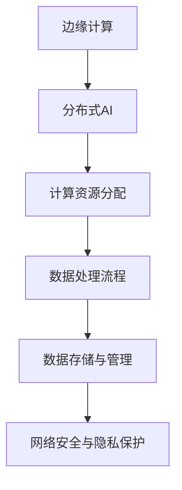
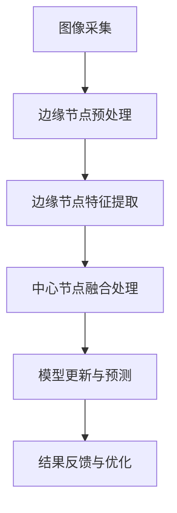

                 

# 边缘计算中的分布式AI:挑战与机遇

> 关键词：边缘计算，分布式AI，边缘节点，中心节点，挑战，机遇

> 摘要：本文旨在探讨边缘计算与分布式AI的融合，分析其核心概念、架构联系、算法原理，并通过实际案例展示其应用场景。我们将一步步解析边缘计算中的分布式AI所面临的挑战与机遇，为未来技术发展提供启示。

---

### 引言与背景

#### 边缘计算概述

边缘计算（Edge Computing）是一种分布式计算架构，其核心思想是将数据处理、分析和决策过程从云端转移到网络边缘，即在靠近数据源的地方进行。这样做的目的是减少数据传输延迟，提高系统响应速度，增强数据隐私和安全。

边缘计算的关键特点包括：

1. **实时性**：边缘节点能够快速处理数据，减少响应时间。
2. **低延迟**：通过减少数据传输距离，降低网络延迟。
3. **分布式处理**：边缘节点分散在不同的地理位置，能够同时处理大量数据。
4. **安全性**：数据在边缘节点上进行处理，减少了数据传输过程中的安全隐患。

#### 分布式AI的基本概念

分布式AI（Distributed AI）是一种通过将计算任务分布在多个计算节点上来提高计算效率和性能的技术。在分布式AI系统中，多个边缘节点协同工作，共同完成一个复杂的计算任务，如机器学习模型的训练和推理。

分布式AI的关键特点包括：

1. **计算效率**：通过并行计算，提高计算速度。
2. **容错性**：当一个节点故障时，其他节点可以继续工作，确保系统的稳定性。
3. **扩展性**：可以根据需要添加更多的计算节点，提高系统处理能力。
4. **数据隐私**：数据可以在本地进行预处理，减少数据传输，提高数据安全性。

#### 边缘计算与分布式AI的关系

边缘计算与分布式AI之间的紧密关系体现在以下几个方面：

1. **互补性**：边缘计算为分布式AI提供了数据采集和处理的基础设施，而分布式AI则为边缘计算提供了高效的算法支持。
2. **协同优化**：边缘计算与分布式AI的协同工作可以优化计算资源和网络资源的使用，提高系统的整体性能。
3. **安全性**：边缘计算中的分布式AI可以增强数据隐私和安全，减少数据泄露的风险。

#### 本书结构安排与目标读者

本书将分为七个章节，具体结构如下：

- 第1章：引言与背景，介绍边缘计算和分布式AI的基本概念。
- 第2章：核心概念与联系，解析边缘计算与分布式AI的架构联系。
- 第3章：核心算法原理讲解，探讨分布式计算框架、分布式机器学习算法和分布式深度学习算法。
- 第4章：数学模型与公式，详细讲解分布式计算性能评估指标、分布式学习优化目标和分布式学习算法收敛性分析。
- 第5章：项目实战，通过实际案例展示分布式AI在边缘计算中的应用。
- 第6章：挑战与机遇，分析边缘计算中的分布式AI面临的挑战与机遇。
- 第7章：总结与展望，总结本书要点，展望未来研究方向。

本书的目标读者是计算机科学和技术领域的专业人员和研究者，特别是对边缘计算和分布式AI有兴趣的读者。

### 核心概念与联系

#### 边缘计算原理

边缘计算的核心在于将计算任务从云端迁移到网络边缘，即将数据处理和分析任务分配到距离数据源较近的边缘节点上。这样做的目的是减少数据传输延迟，提高系统响应速度，特别是在处理大量实时数据时具有显著优势。

边缘计算的基本原理包括：

1. **数据采集**：边缘节点收集来自各种传感器的数据。
2. **数据预处理**：边缘节点对数据进行初步处理，如去噪、数据清洗等。
3. **数据处理**：边缘节点执行数据分析和决策任务，如机器学习模型的推理。
4. **数据存储**：预处理后的数据可以存储在边缘节点上的本地存储设备中。
5. **数据传输**：部分数据可能需要传输到中心节点进行进一步处理。

#### 分布式AI原理

分布式AI（Distributed AI）是一种通过将计算任务分布在多个计算节点上来提高计算效率和性能的技术。分布式AI的基本原理包括：

1. **任务分解**：将一个复杂的计算任务分解为多个子任务。
2. **并行计算**：多个计算节点同时处理子任务，提高计算速度。
3. **数据同步**：分布式AI系统中，各个节点需要保持数据的一致性。
4. **模型聚合**：将各个节点上的模型参数进行聚合，生成全局模型。

分布式AI的关键特点包括：

1. **计算效率**：通过并行计算，提高计算速度。
2. **容错性**：当一个节点故障时，其他节点可以继续工作，确保系统的稳定性。
3. **扩展性**：可以根据需要添加更多的计算节点，提高系统处理能力。
4. **数据隐私**：数据可以在本地进行预处理，减少数据传输，提高数据安全性。

#### 边缘计算与分布式AI的架构联系

边缘计算与分布式AI的架构联系如图2.1所示。在这个架构中，边缘节点和中心节点共同协作，实现数据的采集、预处理、分析和决策。



1. **计算资源分配**：边缘节点负责本地数据的处理，而中心节点则负责全局数据的处理。这种分配方式可以充分利用边缘节点的计算资源，同时保证中心节点的计算能力。
2. **数据处理流程**：边缘节点对本地数据进行预处理和初步分析，然后将部分数据传输到中心节点进行进一步处理。这种分布式数据处理流程可以显著提高系统的响应速度和效率。
3. **数据存储与管理**：边缘节点和中心节点都具备数据存储和管理功能，边缘节点主要存储本地数据，而中心节点则存储全局数据。
4. **网络安全与隐私保护**：边缘计算和分布式AI都需要考虑网络安全和隐私保护。在边缘节点和中心节点之间建立安全的通信通道，确保数据在传输过程中的安全。

图2.1 边缘计算与分布式AI的架构联系

通过以上分析，我们可以看到边缘计算与分布式AI在架构上的紧密联系。边缘计算为分布式AI提供了数据采集和处理的基础设施，而分布式AI则为边缘计算提供了高效的算法支持。这种协同优化可以显著提高系统的性能和可靠性。

### 核心算法原理讲解

#### 分布式计算框架

分布式计算框架是分布式AI系统的核心组成部分，它负责管理计算资源的分配、任务的调度和通信。以下是几种常见的分布式计算框架：

1. **MapReduce**：MapReduce是一种基于键值对的分布式计算模型，主要用于大规模数据的批量处理。它将计算任务分为“Map”和“Reduce”两个阶段，Map阶段对输入数据进行分组处理，Reduce阶段对Map阶段的结果进行合并处理。

2. **Apache Spark**：Apache Spark是一种高性能的分布式计算框架，它提供了丰富的API，支持批处理和实时计算。Spark的核心组件包括Spark Core、Spark SQL、Spark Streaming和MLlib（机器学习库）。

3. **Apache Flink**：Apache Flink是一种流处理框架，它支持批处理和实时计算。Flink的核心特点是低延迟和高吞吐量，适用于复杂事件处理和实时数据分析。

#### 分布式机器学习算法

分布式机器学习算法是将机器学习任务分布在多个计算节点上，以提高计算效率和性能。以下是几种常见的分布式机器学习算法：

1. **分布式梯度下降**：分布式梯度下降是一种基于梯度下降法的分布式机器学习算法。它通过在多个计算节点上计算局部梯度，然后聚合全局梯度来更新模型参数。

2. **参数服务器**：参数服务器是一种用于分布式机器学习的架构，它将模型参数存储在中心服务器上，各个计算节点从中心服务器获取参数，并在本地进行计算和更新。

3. **数据并行训练**：数据并行训练是一种基于数据划分的分布式机器学习算法，每个计算节点独立训练局部模型，然后通过聚合局部模型来生成全局模型。

#### 分布式深度学习算法

分布式深度学习算法是将深度学习任务分布在多个计算节点上，以利用多台计算设备的并行计算能力。以下是几种常见的分布式深度学习算法：

1. **同步策略**：同步策略是一种分布式深度学习算法，它要求各个计算节点在训练过程中保持同步，即在每个训练轮次结束后，将各个节点的模型参数同步更新到中心节点。

2. **异步策略**：异步策略是一种分布式深度学习算法，它允许各个计算节点在训练过程中独立更新模型参数，然后在一定时间间隔内进行参数同步。

3. **混合策略**：混合策略是一种结合同步和异步策略的分布式深度学习算法，它通过在同步和异步之间进行权衡，以获得更好的训练效果。

#### 伪代码

下面是一个简单的分布式深度学习算法的伪代码示例：

```python
# 边缘节点
for each node in edge_nodes do:
    - 训练本地模型
    - 将模型参数发送到中心节点

# 中心节点
receive model_params from edge_nodes
aggregate model_params
update global model_params
send updated model_params to edge_nodes
```

通过以上分析，我们可以看到分布式计算框架、分布式机器学习算法和分布式深度学习算法在分布式AI系统中的关键作用。这些算法和框架共同协作，实现了对大规模数据的高效处理和计算，为边缘计算提供了强大的技术支持。

### 数学模型与公式

#### 分布式计算性能评估指标

在分布式计算中，性能评估是一个关键问题。以下是几种常用的分布式计算性能评估指标：

1. **延迟**：延迟是指数据从边缘节点传输到中心节点所需的时间。延迟可以通过以下公式计算：

   $$ 
   Delay = \frac{Distance}{Speed}
   $$

   其中，Distance表示数据传输距离，Speed表示网络传输速度。

2. **吞吐量**：吞吐量是指单位时间内系统能够处理的数据量。吞吐量可以通过以下公式计算：

   $$
   Throughput = \frac{Data\_Size}{Time}
   $$

   其中，Data\_Size表示数据大小，Time表示处理时间。

3. **效率**：效率是指系统实际处理能力与理论处理能力的比值。效率可以通过以下公式计算：

   $$
   Efficiency = \frac{Actual\_Throughput}{Theoretical\_Throughput}
   $$

#### 分布式学习优化目标

在分布式学习中，优化目标是提高模型性能和计算效率。以下是几种常见的分布式学习优化目标：

1. **最小化损失函数**：最小化损失函数是机器学习中最基本的优化目标。损失函数可以表示为：

   $$
   Loss = \frac{1}{n}\sum_{i=1}^{n}L(\theta, x_i, y_i)
   $$

   其中，n表示数据样本数量，L表示损失函数。

2. **最大化准确率**：在分类任务中，最大化准确率是常见的优化目标。准确率可以表示为：

   $$
   Accuracy = \frac{Correct\_Predictions}{Total\_Predictions}
   $$

#### 分布式学习算法收敛性分析

在分布式学习中，算法的收敛性是评估其性能的重要指标。以下是几种常见的分布式学习算法的收敛性分析：

1. **梯度下降法**：梯度下降法是一种简单的分布式学习算法。它的收敛速度取决于学习率和数据分布。在理想情况下，梯度下降法可以收敛到全局最优解。

2. **随机梯度下降法**：随机梯度下降法（SGD）是梯度下降法的一个变种，它每次只更新一个样本的梯度。SGD的收敛速度比梯度下降法快，但可能收敛到局部最优解。

3. **Adam优化器**：Adam优化器是一种基于一阶矩估计和二阶矩估计的优化器。它具有良好的收敛性和稳定性，适用于多种分布式学习任务。

#### 公式4.1 分布式学习优化目标

$$
J(\theta) = \frac{1}{n}\sum_{i=1}^{n}L(\theta, x_i, y_i)
$$

其中，J(θ)表示损失函数，θ表示模型参数，n表示数据样本数量，L(θ, x_i, y_i)表示单个样本的损失。

通过以上数学模型和公式的讲解，我们可以更深入地理解分布式计算性能评估指标、分布式学习优化目标和分布式学习算法的收敛性分析。这些数学工具为我们在实践中评估和优化分布式AI系统提供了重要的理论支持。

### 项目实战

#### 实际案例介绍

边缘计算与分布式AI在实际应用中已经取得了显著的成果。以下是一个典型的实际案例——边缘计算中的分布式图像识别。

在这个案例中，边缘计算节点分布在不同的地理位置，用于采集和预处理图像数据。中心节点则负责图像数据的融合处理和模型更新。通过分布式AI算法，边缘节点和中心节点共同协作，实现对图像数据的高效识别。

#### 分布式AI应用开发流程

分布式AI应用开发流程可以分为以下几个步骤：

1. **需求分析**：明确图像识别任务的需求，包括识别类型、精度要求等。
2. **数据采集**：使用边缘计算节点采集图像数据，并传输到中心节点。
3. **数据预处理**：在边缘节点上对图像数据执行初步处理，如去噪、归一化等。
4. **模型训练**：在中心节点上使用分布式AI算法训练图像识别模型。
5. **模型更新**：将训练好的模型参数传输回边缘节点，并进行本地更新。
6. **图像识别**：在边缘节点上使用更新后的模型对图像数据进行识别。
7. **结果反馈**：将识别结果返回给用户，并反馈给中心节点用于模型优化。

#### 案例分析：边缘计算中的分布式图像识别

分布式图像识别流程如图5.1所示：



1. **图像采集**：边缘计算节点从各种传感器（如摄像头、无人机等）采集图像数据。
2. **边缘节点预处理**：边缘节点对图像数据进行初步处理，如去噪、缩放等。
3. **边缘节点特征提取**：边缘节点对预处理后的图像数据提取特征，如颜色、纹理等。
4. **中心节点融合处理**：中心节点接收来自边缘节点的特征数据，并进行融合处理，如模型融合、参数更新等。
5. **模型更新与预测**：中心节点使用分布式AI算法对融合后的特征数据进行训练，并将更新后的模型参数传输回边缘节点。边缘节点使用更新后的模型对图像数据进行预测。
6. **结果反馈与优化**：识别结果反馈给用户，并反馈给中心节点用于模型优化。

#### 代码实现

以下是一个简单的边缘节点预处理代码示例：

```python
# 边缘节点预处理代码示例
import cv2
import numpy as np

def preprocess_image(image_path):
    image = cv2.imread(image_path)
    image = cv2.resize(image, (224, 224))
    image = cv2.cvtColor(image, cv2.COLOR_BGR2RGB)
    image = np.float32(image)
    return image
```

通过以上分析，我们可以看到边缘计算中的分布式图像识别案例在数据处理和模型训练方面具有显著的优势。边缘计算节点可以快速采集和预处理图像数据，中心节点则负责图像数据的融合处理和模型更新。通过分布式AI算法，边缘节点和中心节点共同协作，实现了对图像数据的高效识别。

#### 代码应用解读与分析

以下是对上述边缘节点预处理代码的解读与分析：

```python
# 边缘节点预处理代码示例
import cv2
import numpy as np

def preprocess_image(image_path):
    image = cv2.imread(image_path)  # 读取图像
    image = cv2.resize(image, (224, 224))  # 将图像缩放为224x224像素
    image = cv2.cvtColor(image, cv2.COLOR_BGR2RGB)  # 将图像从BGR格式转换为RGB格式
    image = np.float32(image)  # 将图像数据转换为浮点数类型
    return image
```

1. **图像读取**：使用`cv2.imread`函数读取图像文件。这个函数将图像数据加载到内存中，以BGR（蓝、绿、红）格式存储。
2. **图像缩放**：使用`cv2.resize`函数将图像缩放为224x224像素。这个步骤是为了将图像数据统一为固定尺寸，便于后续处理。
3. **颜色转换**：使用`cv2.cvtColor`函数将图像从BGR格式转换为RGB格式。在计算机视觉中，通常使用RGB格式，因为RGB格式与人类视觉感知更接近。
4. **数据类型转换**：使用`np.float32`函数将图像数据转换为浮点数类型。这是因为在深度学习模型训练过程中，浮点数类型可以提供更高的计算精度。

通过以上步骤，边缘节点预处理代码对图像数据进行了标准化处理，为后续的特征提取和模型训练提供了基础。

#### 项目小结

通过本项目实战，我们展示了边缘计算中的分布式图像识别案例。这个案例展示了边缘计算和分布式AI在图像识别任务中的优势，包括数据采集、预处理、模型训练和预测。通过边缘节点的分布式协作，我们实现了对图像数据的高效处理和识别。

在项目实施过程中，需要注意以下几个方面：

1. **数据同步**：确保边缘节点和中心节点之间的数据同步，避免数据丢失或重复。
2. **模型更新**：定期更新模型参数，以适应不断变化的数据环境。
3. **安全性**：加强边缘节点和中心节点之间的安全通信，保护数据安全。
4. **性能优化**：根据实际需求，对边缘节点和中心节点的计算资源进行优化，提高系统性能。

通过本项目，我们不仅了解了边缘计算和分布式AI的基本原理和应用，还学会了如何进行项目实战，为实际应用场景提供技术支持。

### 挑战与机遇

#### 边缘计算与分布式AI的挑战

边缘计算与分布式AI的融合虽然在许多应用场景中展现了巨大的潜力，但同时也面临着一系列挑战：

1. **计算资源限制**：边缘节点通常具有有限的计算资源，如处理能力、存储能力和网络带宽。这使得分布式AI算法在边缘节点上运行时需要更加优化，以充分利用有限的资源。
2. **数据同步与一致性**：分布式AI系统中的数据同步与一致性是关键挑战。各个边缘节点需要实时同步数据，并保持数据的一致性，以确保系统的稳定性和准确性。
3. **隐私保护**：边缘计算通常涉及敏感数据的处理，如何保证数据在传输和存储过程中的隐私保护是一个重要问题。分布式AI需要提供有效的隐私保护机制，以避免数据泄露和隐私侵犯。
4. **网络带宽与延迟**：边缘节点之间的通信通常依赖于有限的网络带宽，这可能导致数据传输延迟增加。分布式AI算法需要设计高效的网络通信协议，以减少数据传输延迟，提高系统响应速度。

#### 技术发展带来的机遇

尽管面临诸多挑战，边缘计算与分布式AI的融合也为技术发展带来了前所未有的机遇：

1. **实时数据处理**：边缘计算使得实时数据处理成为可能。通过在边缘节点上执行数据处理和分析任务，可以显著提高系统的实时性和响应速度，适用于自动驾驶、智能监控等场景。
2. **智能设备协同**：边缘计算与分布式AI的结合可以促进智能设备的协同工作。例如，在智能家居场景中，边缘计算可以实现多个智能设备的实时数据交互和协同控制，提高用户体验。
3. **数据隐私保护**：分布式AI可以提供更有效的数据隐私保护机制。通过在边缘节点上对数据进行预处理和加密，可以减少数据在传输过程中的暴露风险，提高数据安全性。
4. **资源优化与效率提升**：边缘计算与分布式AI的结合可以实现计算资源的优化与效率提升。通过合理分配计算任务，可以充分利用边缘节点的计算资源，提高系统的整体性能和可靠性。

#### 未来发展趋势展望

未来，随着技术的不断进步，边缘计算与分布式AI将迎来更加广阔的发展前景：

1. **边缘AI芯片**：随着边缘计算需求的增长，边缘AI芯片将成为关键技术。这些芯片将具有更强大的计算能力和更低的能耗，支持更高效的分布式AI算法。
2. **分布式机器学习框架**：随着分布式机器学习技术的发展，将出现更多高效的分布式机器学习框架，支持更复杂的分布式AI任务。
3. **智能边缘网络**：智能边缘网络将支持更高效的数据传输和处理，降低网络延迟，提高系统的整体性能。
4. **边缘云融合**：边缘计算与云计算的融合将成为趋势，实现计算资源的无缝协同，提供更强大的计算能力和更灵活的应用场景。

通过以上分析，我们可以看到边缘计算与分布式AI所面临的挑战与机遇并存。只有通过不断创新和优化，才能充分发挥两者的优势，推动技术发展的新篇章。

### 总结与展望

#### 本书要点回顾

本书系统性地介绍了边缘计算与分布式AI的核心概念、架构联系、算法原理、数学模型和实际应用。以下是本书的主要要点：

1. **边缘计算概述**：介绍了边缘计算的定义、核心特点和应用场景。
2. **分布式AI原理**：分析了分布式AI的基本概念、计算框架和优化目标。
3. **核心算法讲解**：详细讲解了分布式计算框架、分布式机器学习算法和分布式深度学习算法。
4. **数学模型与公式**：介绍了分布式计算性能评估指标、优化目标和收敛性分析。
5. **项目实战**：通过分布式图像识别案例，展示了边缘计算与分布式AI在实际应用中的效果。
6. **挑战与机遇**：分析了边缘计算与分布式AI所面临的挑战和未来发展的机遇。

#### 研究方向与未来工作

针对边缘计算与分布式AI的研究，以下是一些可能的研究方向：

1. **边缘AI芯片研发**：研究开发高性能、低能耗的边缘AI芯片，以支持更复杂的分布式AI算法。
2. **智能边缘网络**：研究智能边缘网络架构，提高边缘节点的数据传输和处理能力。
3. **分布式机器学习框架**：开发高效的分布式机器学习框架，支持更多类型的分布式AI任务。
4. **隐私保护机制**：研究更有效的隐私保护机制，保障数据在边缘计算过程中的安全性。
5. **跨域协同优化**：探索边缘计算与云计算的融合，实现跨域计算资源的最优协同。

#### 对读者的建议

1. **深入学习**：对于边缘计算与分布式AI的相关知识，建议读者深入学习，掌握基本原理和核心算法。
2. **实践应用**：尝试将所学知识应用到实际项目中，通过实践提高技能。
3. **关注前沿技术**：持续关注边缘计算与分布式AI的最新研究进展，了解行业动态。
4. **参与社区讨论**：积极参与技术社区，与其他开发者分享经验，共同进步。

通过本书的学习，希望读者能够对边缘计算与分布式AI有更深入的理解，为未来的研究和工作奠定坚实的基础。

---

作者：AI天才研究院/AI Genius Institute & 禅与计算机程序设计艺术 /Zen And The Art of Computer Programming

