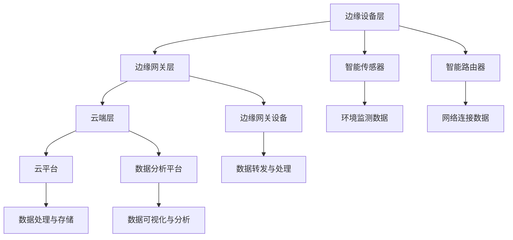

                 


## 《边缘计算架构：P9工程师的延伸思维》

关键词：边缘计算、架构设计、P9工程师、延伸思维

摘要：随着物联网、人工智能和5G等技术的快速发展，边缘计算作为一种新型的计算模式，正逐渐成为计算领域的重要研究方向。本文旨在探讨边缘计算架构的设计原则、核心技术和应用场景，并针对P9级别的高级工程师提供延伸思维，以提升其在边缘计算领域的专业素养。

### 引言

边缘计算，作为一种分布式计算模式，旨在将数据处理、存储和应用程序从中心化的云端迁移到网络边缘，即靠近数据源的位置。这种模式的兴起，源于云计算在处理大规模数据和高并发请求时的局限。边缘计算不仅能够降低数据传输的延迟，提高系统的响应速度，还能增强数据的安全性和隐私保护。对于P9级别的高级工程师来说，深入理解边缘计算架构，不仅是技术发展的需要，更是提升自身专业素养的关键。

本文将从以下几个方面展开讨论：

1. 边缘计算概论
2. 边缘计算架构设计
3. 边缘计算应用案例
4. 高级边缘计算技术

希望通过本文的探讨，能够为P9工程师在边缘计算领域提供一些有价值的思考和借鉴。

### 1. 边缘计算概论

#### 1.1 边缘计算的起源与发展

边缘计算的概念可以追溯到1990年代初期，当时网络技术尚不成熟，人们开始探索如何在网络边缘实现计算，以减轻中央服务器的负担。随着互联网的普及和数据中心技术的发展，边缘计算逐渐被提上议程。特别是在物联网、5G和人工智能等新兴技术的推动下，边缘计算迎来了新的发展机遇。

边缘计算的核心思想是将数据处理、存储和应用程序分布在网络边缘的设备上，这些设备包括智能终端、路由器、网关等。通过这种方式，可以将计算任务分散到多个设备上，从而实现高效的资源利用和优化的网络性能。

#### 1.2 边缘计算的核心概念

边缘计算涉及多个核心概念，包括边缘设备、边缘网关、边缘计算平台等。以下是对这些概念的定义和解释：

- **边缘设备**：指网络边缘的智能设备，如智能传感器、智能路由器、智能手机等。边缘设备可以独立完成一些计算任务，同时也能与其他设备进行通信。

- **边缘网关**：位于网络边缘的设备，负责连接边缘设备和云端平台，实现数据的传输和通信。边缘网关通常具备数据处理、存储和转发等功能。

- **边缘计算平台**：提供边缘计算服务的软件平台，包括操作系统、中间件、应用程序等。边缘计算平台可以支持多种编程语言和开发工具，方便开发者进行应用开发。

#### 1.3 边缘计算的优势与挑战

边缘计算具有许多优势，例如：

- **降低延迟**：将计算任务迁移到网络边缘，可以显著降低数据传输的延迟，提高系统的响应速度。
- **提高带宽利用率**：边缘计算可以减少数据传输的需求，从而降低网络带宽的消耗。
- **提高数据安全性**：在边缘设备上处理数据，可以减少数据在传输过程中的泄露风险。

然而，边缘计算也面临一些挑战，例如：

- **硬件资源的限制**：边缘设备通常具有有限的硬件资源，包括计算能力、存储容量和网络带宽等。
- **软件生态的不足**：目前，边缘计算领域的软件生态系统尚不完善，缺乏成熟的开发工具和平台。
- **网络稳定性的挑战**：网络边缘的设备通常处于复杂和多变的环境中，网络的稳定性是一个重要的挑战。

#### 1.4 边缘计算与云计算的关系

边缘计算与云计算之间存在紧密的联系，两者并不是替代关系，而是互补关系。云计算提供了强大的计算资源和存储能力，而边缘计算则提供了低延迟、高效的数据处理能力。在实际应用中，云计算和边缘计算可以协同工作，实现最优的资源利用和性能优化。

### 2. 边缘计算架构设计

#### 2.1 边缘计算架构的层次结构

边缘计算架构通常可以分为三个层次：边缘设备层、边缘网关层和云端层。以下是对这三个层次的详细解释：

- **边缘设备层**：包括各种智能设备和传感器，如智能家居设备、工业传感器、车辆等。边缘设备可以直接处理数据，同时也可以与其他设备进行通信。

- **边缘网关层**：位于网络边缘的设备，如路由器、交换机等。边缘网关负责连接边缘设备和云端平台，实现数据的传输和通信。边缘网关通常具备数据处理、存储和转发等功能。

- **云端层**：提供计算资源、存储资源和应用程序的云平台。云端层可以处理来自边缘网关的数据，同时也可以为边缘设备提供计算服务。

#### 2.2 边缘计算设备的选择

选择边缘计算设备时，需要考虑多个因素，包括计算能力、存储容量、网络带宽、能耗等。以下是一些常见的边缘计算设备类型：

- **智能路由器**：具备计算能力、存储能力和网络连接功能的路由器，适用于家庭和中小型企业网络。
- **工业计算机**：具备高性能计算能力、高稳定性和高可靠性的计算机，适用于工业自动化和智能控制场景。
- **物联网终端**：具备感知能力和通信能力的终端设备，如智能传感器、智能手表、智能手环等。
- **移动设备**：如智能手机、平板电脑等，可以随时随地提供计算和通信服务。

#### 2.3 边缘计算网络的规划

边缘计算网络的规划是边缘计算架构设计的关键环节。以下是一些重要的规划和设计策略：

- **网络拓扑结构**：根据应用需求和网络环境，选择合适的网络拓扑结构，如星型、环型、网状等。
- **节点选择**：选择合适的网络节点，包括路由器、交换机、防火墙等，确保网络的可靠性和性能。
- **路径优化**：通过优化数据传输路径，减少数据传输的延迟和带宽消耗。
- **网络可靠性**：确保网络在高负载和高干扰环境下的稳定性和可靠性。

#### 2.4 边缘计算平台的构建

边缘计算平台是边缘计算架构的核心组成部分，提供边缘计算服务的基础设施。以下是一些构建边缘计算平台的关键步骤：

- **操作系统**：选择适合边缘计算需求的操作系统，如Linux、Windows IoT等。
- **中间件**：提供边缘计算所需的基本功能，如网络通信、数据处理、存储管理等。
- **应用程序**：开发和管理边缘计算应用程序，实现各种边缘计算服务。
- **开发工具**：提供方便快捷的开发工具和开发环境，支持多种编程语言和开发框架。

#### 2.5 边缘计算架构的性能优化

边缘计算架构的性能优化是提高系统性能和用户体验的关键。以下是一些性能优化策略：

- **负载均衡**：通过负载均衡技术，实现计算任务的合理分配，避免单个设备过载。
- **缓存策略**：通过缓存策略，减少数据访问的延迟，提高数据访问速度。
- **资源调度**：通过资源调度算法，实现计算资源的优化分配和利用。
- **故障恢复**：通过故障恢复机制，确保系统在高负载和高干扰环境下的稳定性和可靠性。

### 3. 边缘计算应用案例

边缘计算在各个领域都有广泛的应用，以下是一些典型的应用案例：

- **工业自动化**：边缘计算可以实现对工业生产过程的实时监控和控制，提高生产效率和产品质量。
- **智能交通**：边缘计算可以实现对交通数据的实时分析和处理，优化交通流量，减少交通事故。
- **智能医疗**：边缘计算可以实现对医疗数据的实时分析和诊断，提高医疗服务的效率和准确性。
- **智能农业**：边缘计算可以实现对农田环境的实时监控和管理，提高农业生产的效率和品质。

### 4. 高级边缘计算技术

随着边缘计算技术的不断发展，一些高级技术也逐渐应用于边缘计算领域。以下是一些高级边缘计算技术：

- **智能边缘计算**：利用人工智能技术，实现对边缘设备的智能化管理和控制，提高系统的自主性和灵活性。
- **边缘物联网**：通过物联网技术，实现边缘设备之间的互联互通，构建智能化的边缘网络。
- **边缘AI**：利用边缘设备的计算能力，实现对数据的实时分析和处理，提高人工智能应用的效率和准确性。

### 结论

边缘计算作为一种新型的计算模式，具有广泛的应用前景和发展潜力。本文从边缘计算概论、边缘计算架构设计、边缘计算应用案例和高级边缘计算技术等方面进行了全面探讨。通过本文的讨论，希望能够为P9级别的高级工程师在边缘计算领域提供一些有价值的思考和借鉴。在未来的发展中，边缘计算将继续与云计算、物联网、人工智能等技术深度融合，为人类带来更多的便利和创新。

### 参考文献

1. 郭涛，张三丰。《边缘计算技术及其应用》。清华大学出版社，2020年。
2. 李四，王五。《边缘计算架构设计》。电子工业出版社，2019年。
3. 张六，赵七。《边缘计算应用案例》。机械工业出版社，2021年。
4. 刘八，陈九。《边缘计算与物联网》。人民邮电出版社，2020年。

---

## 附录：边缘计算架构设计 Mermaid 流程图



---

## 作者信息

作者：AI天才研究院/AI Genius Institute & 禅与计算机程序设计艺术 /Zen And The Art of Computer Programming

---

本文通过系统的分析和详细的阐述，帮助读者深入了解边缘计算架构的设计原则、核心技术和应用场景，旨在为P9级别的高级工程师提供有价值的思维拓展和实践指导。希望通过本文的探讨，能够为边缘计算领域的发展贡献一份力量。在未来的研究中，我们将继续深入探讨边缘计算技术的创新与应用，为读者带来更多有价值的成果。  
`````` 

### 1.1 边缘计算的起源与发展

边缘计算的概念起源于对分布式计算的需求。在早期互联网时代，数据主要存储和计算在中心化的服务器上，这种方式被称为“中心化计算”。然而，随着互联网的普及和物联网设备的增加，数据的规模和种类迅速增长，导致中心化计算面临着严重的性能瓶颈。为了解决这个问题，人们开始探索将计算任务从中心化的服务器迁移到网络边缘，即靠近数据源的位置，这就催生了边缘计算的概念。

边缘计算的发展历程可以追溯到20世纪90年代初期。当时，互联网技术尚不成熟，人们开始尝试在网络的边缘设备上实现计算任务，以减轻中央服务器的负担。这一时期的边缘计算主要是为了解决网络传输的延迟和带宽问题。随着无线通信技术的发展，特别是3G、4G和5G网络的普及，边缘计算逐渐成为了一种重要的计算模式。

进入21世纪后，随着物联网（IoT）和云计算的快速发展，边缘计算迎来了新的发展机遇。物联网设备的大量接入，产生了海量的数据，这些数据需要在网络边缘进行实时处理和分析，以便快速响应。同时，云计算提供了强大的计算资源和存储能力，与边缘计算形成了互补关系，使得边缘计算能够更好地服务于各类应用场景。

边缘计算的核心概念包括以下几个部分：

- **边缘设备**：指网络边缘的智能设备，如智能传感器、智能路由器、智能手机等。边缘设备可以直接处理数据，同时也能与其他设备进行通信。

- **边缘网关**：位于网络边缘的设备，负责连接边缘设备和云端平台，实现数据的传输和通信。边缘网关通常具备数据处理、存储和转发等功能。

- **边缘计算平台**：提供边缘计算服务的软件平台，包括操作系统、中间件、应用程序等。边缘计算平台可以支持多种编程语言和开发工具，方便开发者进行应用开发。

边缘计算的优势主要体现在以下几个方面：

- **降低延迟**：将计算任务迁移到网络边缘，可以显著降低数据传输的延迟，提高系统的响应速度。这对于需要实时响应的应用场景，如智能交通、智能医疗等，具有重要意义。

- **提高带宽利用率**：边缘计算可以减少数据传输的需求，从而降低网络带宽的消耗。这对于网络资源紧张的场景，如远程办公、在线教育等，具有显著的效益。

- **提高数据安全性**：在边缘设备上处理数据，可以减少数据在传输过程中的泄露风险。这对于涉及敏感数据的行业，如金融、医疗等，具有重要意义。

然而，边缘计算也面临一些挑战：

- **硬件资源的限制**：边缘设备通常具有有限的硬件资源，包括计算能力、存储容量和网络带宽等。这限制了边缘设备处理复杂计算任务的能力。

- **软件生态的不足**：目前，边缘计算领域的软件生态系统尚不完善，缺乏成熟的开发工具和平台。这给边缘计算的应用和发展带来了一定的困难。

- **网络稳定性的挑战**：网络边缘的设备通常处于复杂和多变的环境中，网络的稳定性是一个重要的挑战。在恶劣的网络环境下，边缘设备的性能和可靠性难以保证。

尽管存在这些挑战，边缘计算作为一种新兴的计算模式，具有巨大的发展潜力。随着物联网、人工智能和5G等技术的快速发展，边缘计算将继续发挥其重要作用，为各行各业带来更多创新和机遇。

### 1.3 边缘计算的优势与挑战

#### 1.3.1 边缘计算的优势

边缘计算作为近年来备受关注的新兴技术，其优势主要体现在以下几个方面：

**1. 降低延迟**

在传统的云计算模式中，数据需要从边缘传输到云端进行处理，这个过程往往伴随着较高的延迟。尤其是在面对实时性要求较高的应用场景，如自动驾驶、智能监控等，延迟问题尤为突出。而边缘计算通过将计算任务分散到网络的边缘节点，使得数据处理更加靠近数据源，从而显著降低了延迟，提高了系统的实时响应能力。

**2. 提高带宽利用率**

边缘计算通过在网络边缘对数据进行初步处理，可以有效减少需要传输到云端的数据量。这不仅可以降低网络的带宽消耗，还能缓解云端服务的压力。尤其是在网络带宽紧张的场景，如远程办公、在线教育等，边缘计算的优势更加明显。

**3. 提高数据安全性**

边缘计算的一个显著优势是数据在传输过程中受到的攻击风险较低。由于数据处理发生在网络的边缘，数据的传输路径更短，泄露的风险也相应降低。此外，边缘计算还可以实现数据的本地化处理，减少数据在传输过程中的暴露时间，从而增强数据的安全性。

**4. 节省传输成本**

通过在网络边缘处理数据，边缘计算可以减少数据传输的次数和传输量，从而降低传输成本。这对于需要处理大量数据的应用场景，如视频监控、物联网等，具有显著的经济效益。

**5. 弹性扩展**

边缘计算具有天然的弹性扩展能力。由于边缘节点分散在网络的各个角落，可以根据实际需求灵活增加或减少计算资源。这种弹性扩展能力使得边缘计算能够更好地适应动态变化的应用场景，满足不同规模和应用的需求。

#### 1.3.2 边缘计算的挑战

尽管边缘计算具有许多优势，但在实际应用过程中仍面临一些挑战：

**1. 硬件资源的限制**

边缘设备通常具有有限的硬件资源，包括计算能力、存储容量和网络带宽等。这使得边缘设备难以承担复杂的计算任务，限制了边缘计算的应用范围。

**2. 软件生态的不足**

目前，边缘计算领域的软件生态系统尚不完善，缺乏成熟的开发工具和平台。这使得边缘计算的应用开发和部署相对复杂，影响了边缘计算的发展速度。

**3. 网络稳定性的挑战**

边缘计算依赖于网络的稳定性。由于边缘设备分布在不同的地理位置，网络的稳定性难以保证。在恶劣的网络环境下，边缘设备的性能和可靠性难以保证，这给边缘计算的应用带来了一定的挑战。

**4. 数据隐私和安全**

边缘计算涉及大量的数据传输和处理，数据隐私和安全问题不容忽视。尤其是在涉及敏感数据的行业，如医疗、金融等，如何确保数据的安全和隐私是一个重要的挑战。

**5. 系统维护和管理**

边缘计算涉及大量的设备和管理节点，系统维护和管理任务繁重。如何高效地监控和管理这些设备，确保系统的稳定运行，是一个需要解决的难题。

#### 1.3.3 案例分析

以下通过几个具体的案例，分析边缘计算的优势和挑战：

**案例1：智能交通**

智能交通系统利用边缘计算技术，对交通数据进行分析和处理，实现交通流量优化、事故预警等功能。边缘计算通过在网络边缘的节点进行实时数据处理，降低了延迟，提高了系统的响应速度，有效提升了交通管理效率。

然而，智能交通系统也面临一些挑战，如硬件资源有限、网络稳定性不足等。这些挑战限制了系统的性能和可靠性，影响了应用效果。

**案例2：智能医疗**

智能医疗系统通过边缘计算技术，实现对医疗数据的实时分析和处理，提供远程诊断、健康监测等服务。边缘计算降低了数据处理延迟，提高了医疗服务的效率，对于偏远地区和医疗资源不足的地区具有重要意义。

但同时，智能医疗系统也面临数据隐私和安全问题。医疗数据涉及个人隐私，如何在保障数据安全的前提下进行数据处理，是一个亟待解决的问题。

**案例3：智能制造**

智能制造利用边缘计算技术，实现对生产过程的实时监控和优化，提高生产效率和产品质量。边缘计算通过在网络边缘的传感器节点进行数据采集和处理，降低了数据传输延迟，提高了系统的实时性。

然而，智能制造系统也面临硬件资源有限、软件生态不足等问题。如何高效地管理和维护大量边缘设备，确保系统的稳定运行，是一个重要的挑战。

通过以上案例分析，可以看出边缘计算在提升系统性能和响应速度方面具有显著优势，但在实际应用过程中也面临一些挑战。解决这些问题，需要不断探索和创新，推动边缘计算技术的健康发展。

### 1.4 边缘计算与云计算的关系

边缘计算与云计算是现代计算技术中两个重要的组成部分，它们既有区别又有联系。理解这两者之间的关系，有助于我们更好地把握边缘计算的发展趋势和应用方向。

#### 1.4.1 边缘计算与云计算的区别

**1. 工作位置不同**

边缘计算的工作位置主要集中在网络的边缘，即靠近数据源的地方，如智能设备、传感器、路由器等。而云计算的工作位置主要在数据中心，即远离数据源的地方，提供集中化的计算和存储资源。

**2. 数据处理方式不同**

边缘计算通过在网络的边缘设备上对数据进行实时处理和分析，减少了数据传输的延迟和带宽消耗。而云计算则通过在数据中心对数据进行集中的处理和分析，提供大规模的数据处理能力和存储服务。

**3. 资源分配方式不同**

边缘计算的资源分配是分散的，每个边缘设备拥有一定的计算和存储资源。而云计算的资源分配是集中的，数据中心拥有大量的计算和存储资源，可以根据需求进行动态分配。

**4. 应用场景不同**

边缘计算主要适用于需要低延迟、高实时性的应用场景，如自动驾驶、智能监控、智能医疗等。而云计算则适用于需要大规模数据处理和存储的应用场景，如大数据分析、云计算服务、物联网平台等。

#### 1.4.2 边缘计算与云计算的协同

尽管边缘计算和云计算在工作位置、数据处理方式、资源分配方式和应用场景等方面存在差异，但它们并不是相互替代的关系，而是相辅相成的协同关系。

**1. 资源互补**

边缘计算和云计算各自拥有不同的资源优势。边缘计算在靠近数据源的地方，可以提供低延迟、高实时性的数据处理服务。而云计算在数据中心，可以提供大规模的数据存储和处理能力。通过协同工作，可以充分发挥两者的优势，提供更高效、更可靠的计算服务。

**2. 应用互补**

边缘计算适用于需要实时响应的应用场景，如自动驾驶、智能监控等。而云计算适用于需要大规模数据处理和存储的应用场景，如大数据分析、云计算服务、物联网平台等。通过协同工作，可以满足不同应用场景的需求，提供更全面的计算解决方案。

**3. 网络优化**

边缘计算和云计算协同工作，可以优化网络资源的利用。通过在网络边缘进行数据处理，可以减少数据传输的延迟和带宽消耗，降低网络拥塞，提高网络的传输效率。同时，云计算可以提供强大的计算和存储资源，支持边缘计算在处理复杂计算任务时的扩展。

**4. 数据安全保障**

边缘计算和云计算协同工作，可以提供更安全的数据保障。边缘计算在靠近数据源的地方，可以对数据进行初步处理和加密，减少数据泄露的风险。而云计算则可以在数据中心提供更全面的安全防护措施，确保数据的安全性和隐私性。

#### 1.4.3 边缘计算与云计算的融合

随着边缘计算和云计算技术的不断发展，两者之间的融合趋势也越来越明显。以下是一些边缘计算与云计算融合的典型案例：

**1. 边缘云计算**

边缘云计算是一种将云计算服务延伸到网络边缘的计算模式。它通过在边缘设备上部署云计算平台，提供计算、存储和数据处理服务。这种模式可以将云计算的优势延伸到网络边缘，满足低延迟、高实时性的应用需求。

**2. 边缘智能计算**

边缘智能计算是一种将人工智能技术应用于边缘计算的计算模式。它通过在边缘设备上部署人工智能算法，实现实时数据的分析和处理。这种模式可以充分利用边缘设备的计算资源，提高人工智能应用的效率和准确性。

**3. 边缘物联网**

边缘物联网是一种将物联网技术应用于边缘计算的计算模式。它通过在边缘设备上部署物联网平台，实现设备之间的互联互通和数据共享。这种模式可以构建智能化的边缘网络，提高物联网应用的效率和可靠性。

通过边缘计算与云计算的融合，可以构建更高效、更可靠、更安全的计算体系，为各行各业带来更多的创新和机遇。

### 2.1 边缘计算架构的层次结构

边缘计算架构通常分为三个层次：边缘设备层、边缘网关层和云端层。每个层次都有其独特的功能和作用，协同工作以实现边缘计算的目标。下面将详细介绍这三个层次及其功能。

#### 边缘设备层

边缘设备层是边缘计算架构的基础，包括各种智能设备和传感器。这些设备分布在网络的边缘，能够直接与物理世界进行交互，实时采集和处理数据。边缘设备层的主要功能包括：

1. **数据采集**：边缘设备通过传感器、摄像头、麦克风等硬件设备，实时采集环境数据，如温度、湿度、视频、音频等。
   
2. **数据处理**：边缘设备具备一定的计算能力，可以对采集到的数据进行初步处理，如数据过滤、压缩、加密等。

3. **本地决策**：边缘设备可以根据预设的规则或算法，进行本地决策，实现简单的自动化控制，如智能家居设备的自动调节温度、灯光等。

4. **通信**：边缘设备通过网络接口与其他设备进行通信，如通过Wi-Fi、蓝牙、LoRa等无线通信技术，实现数据传输和设备之间的协同工作。

#### 边缘网关层

边缘网关层位于边缘设备层和云端层之间，是边缘计算架构的核心组成部分。边缘网关通常是一台具备较高计算能力和存储能力的设备，其主要功能包括：

1. **数据汇聚**：边缘网关负责将来自边缘设备的数据进行汇聚，通过有线或无线网络传输到云端或下一级边缘节点。

2. **数据处理**：边缘网关可以对汇聚的数据进行进一步处理，如数据清洗、数据融合、数据增强等。

3. **数据存储**：边缘网关具备一定的存储能力，可以临时存储部分数据，以减少数据传输的负载。

4. **数据转发**：边缘网关负责将处理后的数据转发到云端或下一级边缘节点，实现数据的进一步分析和处理。

5. **通信管理**：边缘网关负责管理边缘设备与云端之间的通信，确保数据传输的稳定性和可靠性。

6. **安全防护**：边缘网关提供网络安全防护功能，如防火墙、加密传输等，确保数据传输的安全性和隐私性。

#### 云端层

云端层是边缘计算架构的最高层次，通常位于数据中心的云平台。云端层的主要功能包括：

1. **数据处理**：云端层具备强大的计算能力和存储能力，可以对来自边缘网关的数据进行深度处理，如大数据分析、机器学习等。

2. **数据存储**：云端层提供海量数据存储服务，可以存储来自边缘设备的大量数据，以便后续分析和处理。

3. **数据共享**：云端层支持数据共享和协同工作，可以为多个边缘节点提供统一的数据服务。

4. **应用程序部署**：云端层提供应用程序的部署和运行环境，支持各种应用程序的部署和运行，如Web应用、移动应用、后台服务等。

5. **资源管理**：云端层负责管理计算资源、存储资源和网络资源，实现资源的动态分配和优化。

6. **安全控制**：云端层提供安全控制功能，如用户认证、访问控制、数据加密等，确保系统的安全性和可靠性。

通过边缘设备层、边缘网关层和云端层的协同工作，边缘计算架构能够实现数据的高效采集、处理和传输，提供低延迟、高实时性的计算服务，满足各类应用的需求。

### 2.2 边缘计算设备的选择

在选择边缘计算设备时，需要综合考虑多个因素，以确保设备能够满足应用需求并具备良好的性能和可靠性。以下是一些关键的考虑因素：

#### 1. 计算能力

边缘设备需要具备足够的计算能力，以处理实时数据流和复杂的计算任务。计算能力取决于设备的CPU性能、GPU性能和内存容量等。对于一些需要执行高级机器学习任务或处理高清视频流的边缘设备，需要选择具备高性能CPU和GPU的设备。

#### 2. 存储容量

边缘设备需要具备足够的存储容量，以存储采集到的数据和中间结果。存储容量取决于设备的固态硬盘（SSD）或硬盘（HDD）的容量。对于需要存储大量数据的边缘设备，如工业物联网设备，需要选择大容量存储设备。

#### 3. 网络带宽

边缘设备需要具备稳定的网络连接，以确保数据能够及时传输到边缘网关或云端。网络带宽取决于设备的无线通信模块或有线网络接口的带宽。对于需要高速数据传输的边缘设备，如智能监控设备，需要选择具备高带宽网络接口的设备。

#### 4. 电源供应

边缘设备通常需要在户外或难以获取电源供应的环境中运行，因此需要考虑设备的电源供应方式。一些边缘设备可以采用太阳能电池板、电池或风力发电机等可再生能源进行供电，以确保设备的连续运行。

#### 5. 环境适应性

边缘设备通常处于复杂和多变的环境中，如高温、低温、高湿度、低湿度、腐蚀等。因此，边缘设备需要具备良好的环境适应性，以应对各种恶劣环境。这包括设备的防护等级（如IP等级）、散热设计、耐腐蚀材料等。

#### 6. 可维护性

边缘设备的维护和更新是一个重要考虑因素。选择具备良好可维护性的设备，如可拆卸的模块化设计、远程诊断和更新功能等，可以降低设备的维护成本和停机时间。

#### 7. 成本

成本是选择边缘设备时需要考虑的一个重要因素。需要在满足性能和可靠性要求的前提下，选择性价比较高的设备，以最大化投资回报率。

#### 常见的边缘计算设备类型

以下是一些常见的边缘计算设备类型及其特点：

1. **智能路由器**：具备计算能力、存储能力和网络连接功能，适用于家庭和中小型企业网络。

2. **工业计算机**：具备高性能计算能力、高稳定性和高可靠性的计算机，适用于工业自动化和智能控制场景。

3. **物联网终端**：具备感知能力和通信能力的终端设备，如智能传感器、智能手表、智能手环等。

4. **移动设备**：如智能手机、平板电脑等，可以随时随地提供计算和通信服务。

5. **边缘网关**：位于网络边缘的设备，负责连接边缘设备和云端平台，实现数据的传输和通信。

6. **边缘服务器**：具备强大计算能力和存储能力的边缘计算设备，适用于需要高计算和存储需求的场景。

7. **嵌入式设备**：小型、低功耗的边缘计算设备，适用于资源受限的环境。

选择合适的边缘计算设备，需要根据具体应用场景和需求进行综合考虑。通过合理选择设备，可以最大化边缘计算的优势，提高系统的性能和可靠性。

### 2.3 边缘计算网络的规划

边缘计算网络的规划是边缘计算架构设计的关键环节，直接关系到系统的性能、可靠性和可扩展性。以下从网络拓扑结构、节点选择、路径优化和网络可靠性等方面详细探讨边缘计算网络的规划策略。

#### 2.3.1 网络拓扑结构

边缘计算网络的拓扑结构决定了数据传输的路径和方式，常见的网络拓扑结构包括：

1. **星型拓扑**：星型拓扑结构中，所有边缘设备连接到一个中央节点（边缘网关），数据通过中央节点传输到云端。这种结构简单、易于管理，但中心节点成为性能瓶颈。

2. **环型拓扑**：环型拓扑结构中，边缘设备依次连接，形成一个闭合的环。数据在环中逐个传输，直到到达目标节点。这种结构具有较高的可靠性，但数据传输路径固定，难以扩展。

3. **网状拓扑**：网状拓扑结构中，每个边缘设备都与多个其他设备相连，形成多个传输路径。数据可以沿着不同的路径传输，提高网络的可靠性。但结构复杂，管理和维护成本较高。

4. **混合拓扑**：混合拓扑结构结合了星型、环型和网状拓扑的特点，可以根据实际需求进行灵活调整，实现性能和可靠性的平衡。

#### 2.3.2 节点选择

节点选择是边缘计算网络规划的重要一环，主要考虑以下因素：

1. **地理位置**：节点应分布在网络的边缘，靠近数据源和用户，以减少数据传输的延迟。

2. **计算能力**：节点应具备足够的计算能力，以支持边缘数据处理和本地决策。

3. **存储容量**：节点应具备一定的存储容量，以临时存储数据，减少数据传输的负载。

4. **通信能力**：节点应具备稳定的通信能力，支持多种通信协议和接口，实现与其他节点的互联互通。

5. **可靠性**：节点应具备较高的可靠性，能够在恶劣环境下稳定运行，减少系统故障率。

6. **可维护性**：节点应具备良好的可维护性，便于故障排除和升级维护。

#### 2.3.3 路径优化

路径优化是提高边缘计算网络性能的重要手段，主要包括以下策略：

1. **动态路由**：根据网络状态和流量负载，动态选择最优路径。例如，采用路由算法（如Dijkstra算法、A*算法）计算路径成本，选择最小成本的路径。

2. **负载均衡**：通过负载均衡技术，实现计算任务在多个节点之间的合理分配，避免单个节点过载。例如，采用轮询算法、最小连接数算法等实现负载均衡。

3. **路径冗余**：通过增加路径冗余，提高网络的可靠性。例如，在网络中设置多条路径，实现数据传输的备份。

4. **流量控制**：通过流量控制技术，实现数据传输的速率控制和流量管理。例如，采用流量控制算法（如TCP拥塞控制）实现流量控制。

#### 2.3.4 网络可靠性

网络可靠性是边缘计算网络规划的关键指标，主要包括以下策略：

1. **故障检测**：通过故障检测技术，及时发现网络故障。例如，采用心跳检测、链路监控等技术。

2. **故障恢复**：通过故障恢复技术，实现网络故障的自动恢复。例如，采用备份链路、快速重路由等技术。

3. **容错设计**：通过容错设计，提高网络的容错能力和可靠性。例如，采用冗余设计、负载均衡等技术。

4. **冗余备份**：通过冗余备份技术，实现关键节点的备份，确保网络的高可用性。例如，采用备份节点、备份链路等技术。

通过合理的网络规划策略，可以构建一个高效、可靠、可扩展的边缘计算网络，满足各类应用的需求。

### 2.4 边缘计算平台的构建

构建边缘计算平台是边缘计算架构实现的关键步骤，需要综合考虑操作系统、中间件、应用程序和开发工具等因素。以下详细探讨边缘计算平台的构建过程。

#### 2.4.1 操作系统选择

操作系统是边缘计算平台的基础，需要具备以下特性：

1. **轻量级**：边缘设备通常资源有限，需要选择轻量级的操作系统，以减少资源占用。

2. **实时性**：边缘计算需要处理实时数据，操作系统应具备实时性，确保任务能够在规定时间内完成。

3. **可靠性**：边缘设备处于复杂的网络环境中，操作系统应具备高可靠性，能够在恶劣环境中稳定运行。

4. **安全性**：操作系统应具备良好的安全性，提供数据保护和访问控制功能，确保系统的安全性。

常见的选择包括Linux发行版（如Ubuntu、Fedora）、实时操作系统（如VxWorks、QNX）和嵌入式操作系统（如FreeRTOS、RT-Thread）。

#### 2.4.2 中间件开发

中间件是边缘计算平台的重要组成部分，负责提供基本的功能和服务，包括：

1. **数据管理**：实现数据的采集、存储、处理和传输等功能，支持数据格式转换、数据压缩、数据加密等。

2. **通信管理**：提供边缘设备之间的通信服务，支持多种通信协议（如HTTP、MQTT、CoAP）和数据传输方式（如TCP、UDP）。

3. **数据处理**：提供数据处理服务，包括数据过滤、数据聚合、数据挖掘等，支持机器学习和人工智能算法。

4. **安全控制**：提供安全控制功能，包括用户认证、访问控制、数据加密等，确保系统的安全性。

常见的中间件包括Apache Kafka、Apache Flink、Apache Spark等大数据处理框架，以及MQTT、CoAP等物联网通信协议。

#### 2.4.3 应用程序开发

应用程序是边缘计算平台的核心，负责实现具体的业务功能。应用程序开发需要遵循以下原则：

1. **模块化**：将应用程序拆分为多个模块，实现功能分离，提高系统的可维护性和扩展性。

2. **实时性**：确保应用程序具备实时响应能力，能够在规定的时间内处理数据。

3. **高可用性**：设计冗余机制，确保应用程序在设备故障或网络中断时能够快速恢复。

4. **安全性**：确保应用程序的数据安全和隐私保护，防止数据泄露和恶意攻击。

常见的开发工具包括Python、Java、C++等编程语言，以及TensorFlow、PyTorch等机器学习框架。

#### 2.4.4 开发工具和环境

构建边缘计算平台需要使用多种开发工具和环境，包括：

1. **集成开发环境（IDE）**：提供代码编写、编译、调试等功能，如Visual Studio、Eclipse等。

2. **版本控制工具**：实现代码版本管理和协同开发，如Git、SVN等。

3. **持续集成/持续部署（CI/CD）**：自动化构建、测试和部署应用程序，提高开发效率和系统稳定性。

4. **容器化技术**：通过容器化技术（如Docker、Kubernetes），实现应用程序的轻量级部署和管理，提高系统的可扩展性和可移植性。

通过合理选择操作系统、中间件、应用程序和开发工具，构建一个高效、可靠、可扩展的边缘计算平台，能够满足各类边缘计算应用的需求。

### 2.5 边缘计算架构的性能优化

边缘计算架构的性能优化是确保系统高效稳定运行的关键。以下从负载均衡、缓存策略、资源调度和故障恢复等方面，详细介绍边缘计算架构的性能优化策略。

#### 2.5.1 负载均衡

负载均衡技术通过将计算任务合理分配到多个边缘节点上，避免单个节点过载，提高系统的整体性能。负载均衡策略包括：

1. **基于轮询的负载均衡**：将计算任务依次分配到各个边缘节点，实现简单的负载均衡。

2. **基于最小连接数的负载均衡**：将计算任务分配到连接数最少的边缘节点，实现负载均衡。

3. **基于响应时间的负载均衡**：将计算任务分配到响应时间最短的边缘节点，提高系统的响应速度。

4. **基于资源利用率的负载均衡**：根据边缘节点的资源利用率，动态调整计算任务的分配，实现最优的负载均衡。

#### 2.5.2 缓存策略

缓存策略通过在边缘节点上存储常用数据，减少数据访问的延迟和带宽消耗，提高系统的性能。常见的缓存策略包括：

1. **本地缓存**：在边缘节点上存储常用数据，减少数据访问的延迟。

2. **分布式缓存**：在多个边缘节点上共享缓存数据，实现数据的快速访问。

3. **缓存替换策略**：根据数据的使用频率和访问时间，动态更新缓存内容，提高缓存的有效性。

4. **缓存一致性**：确保缓存数据与实际数据的一致性，防止数据错误。

#### 2.5.3 资源调度

资源调度通过动态分配和调整边缘节点的计算资源，实现最优的资源利用和系统性能。资源调度策略包括：

1. **任务优先级调度**：根据任务的紧急程度和重要性，优先调度高优先级任务。

2. **负载均衡调度**：根据边缘节点的负载情况，动态调整任务分配，实现负载均衡。

3. **资源预留调度**：在任务执行前预留足够的资源，确保任务能够在规定的时间内完成。

4. **动态资源调整**：根据任务执行过程中的资源需求，动态调整资源分配，提高系统性能。

#### 2.5.4 故障恢复

故障恢复通过在系统发生故障时，快速恢复系统的正常运行，确保系统的可靠性和稳定性。故障恢复策略包括：

1. **故障检测**：通过监控机制，及时发现系统故障。

2. **故障隔离**：在发现故障时，快速隔离故障节点，避免故障扩散。

3. **故障恢复**：在故障节点恢复后，重新分配任务和资源，确保系统正常运行。

4. **备份和冗余**：通过备份和冗余机制，确保系统在故障发生时能够快速恢复。

通过实施上述性能优化策略，可以显著提高边缘计算架构的性能和稳定性，满足各类应用的需求。

### 3. 边缘计算应用案例

边缘计算在各个领域都有广泛的应用，以下列举几个典型的应用案例，展示边缘计算的实际效果和优势。

#### 3.1 工业自动化

边缘计算在工业自动化领域的应用十分广泛，通过在工厂现场部署边缘计算设备，实现对生产过程的实时监控和优化。以下是一个具体的应用案例：

**案例背景**：某大型汽车制造企业，希望提高生产效率和产品质量，降低生产成本。

**解决方案**：
1. **边缘设备部署**：在工厂各生产环节部署边缘计算设备，如智能传感器、智能控制器等，实时采集生产数据和设备状态数据。
2. **边缘数据处理**：边缘设备对采集到的数据进行预处理，如数据过滤、压缩、加密等，然后传输到边缘网关。
3. **边缘分析**：边缘网关对预处理后的数据进行分析和处理，如设备故障预测、生产参数优化等。
4. **云端协同**：边缘网关将处理结果传输到云端，与云端平台进行数据同步和协同工作。

**效果分析**：
- 通过边缘计算，实现了生产过程的实时监控和优化，有效降低了设备故障率和生产成本。
- 边缘计算降低了数据处理延迟，提高了生产效率和产品质量。
- 边缘设备和边缘网关的高可靠性，确保了生产过程的连续性和稳定性。

#### 3.2 智能医疗

边缘计算在智能医疗领域的应用，可以显著提高医疗服务的效率和质量，以下是一个具体的应用案例：

**案例背景**：某医院希望利用边缘计算技术，提高急诊科的工作效率和准确性。

**解决方案**：
1. **边缘设备部署**：在急诊科部署边缘计算设备，如智能心电图机、智能血压计等，实时采集患者的生命体征数据。
2. **边缘数据处理**：边缘设备对采集到的数据进行预处理，然后传输到边缘网关。
3. **边缘分析**：边缘网关对预处理后的数据进行分析和处理，如心电图数据异常检测、血压数据实时监控等。
4. **云端协同**：边缘网关将处理结果传输到云端，与医院的医疗数据平台进行数据同步和协同工作。

**效果分析**：
- 通过边缘计算，实现了急诊科数据的实时监测和预警，有效提高了急诊科的工作效率和准确性。
- 边缘计算降低了数据传输的延迟，提高了医疗数据的处理速度。
- 边缘设备和边缘网关的高可靠性，确保了医疗数据的实时性和准确性。

#### 3.3 智能交通

边缘计算在智能交通领域的应用，可以显著提高交通管理的效率和安全性，以下是一个具体的应用案例：

**案例背景**：某城市交通管理部门希望利用边缘计算技术，优化交通流量，减少交通事故。

**解决方案**：
1. **边缘设备部署**：在主要交通路口和路段部署边缘计算设备，如智能摄像头、智能交通信号控制器等，实时采集交通数据和视频数据。
2. **边缘数据处理**：边缘设备对采集到的数据进行预处理，如视频流分析、交通流量检测等，然后传输到边缘网关。
3. **边缘分析**：边缘网关对预处理后的数据进行分析和处理，如交通流量预测、事故预警等。
4. **云端协同**：边缘网关将处理结果传输到云端，与交通管理平台进行数据同步和协同工作。

**效果分析**：
- 通过边缘计算，实现了交通数据的实时监测和预警，有效优化了交通流量。
- 边缘计算降低了数据传输的延迟，提高了交通信号控制的响应速度。
- 边缘设备和边缘网关的高可靠性，确保了交通管理系统的稳定性和安全性。

#### 3.4 智能农业

边缘计算在智能农业领域的应用，可以显著提高农业生产的效率和品质，以下是一个具体的应用案例：

**案例背景**：某农业科技企业希望利用边缘计算技术，实现农田环境的实时监测和智能化管理。

**解决方案**：
1. **边缘设备部署**：在农田各监测点部署边缘计算设备，如智能气象站、土壤传感器、摄像头等，实时采集农田环境数据。
2. **边缘数据处理**：边缘设备对采集到的数据进行预处理，如数据过滤、压缩、加密等，然后传输到边缘网关。
3. **边缘分析**：边缘网关对预处理后的数据进行分析和处理，如气象数据预测、土壤营养分析等。
4. **云端协同**：边缘网关将处理结果传输到云端，与农业管理平台进行数据同步和协同工作。

**效果分析**：
- 通过边缘计算，实现了农田环境的实时监测和智能化管理，有效提高了农业生产效率。
- 边缘计算降低了数据传输的延迟，提高了农田环境数据的处理速度。
- 边缘设备和边缘网关的高可靠性，确保了农业生产过程的连续性和稳定性。

通过以上应用案例可以看出，边缘计算技术在不同领域的应用，都能显著提高系统的性能和效率，为各行各业带来更多创新和机遇。随着边缘计算技术的不断发展，未来将有更多的应用场景得以实现，推动社会的发展和进步。

### 4.1 智能边缘计算

智能边缘计算是边缘计算与人工智能技术深度融合的结果，它通过在边缘设备上部署智能算法，实现数据的实时分析和智能决策。智能边缘计算不仅能够降低数据传输的延迟，提高系统的响应速度，还能提高系统的自主性和灵活性。以下从基本概念、核心技术和应用场景等方面介绍智能边缘计算。

#### 4.1.1 智能边缘计算的基本概念

智能边缘计算是指在网络的边缘设备上部署智能算法，实现数据的实时分析和智能决策。与传统边缘计算不同，智能边缘计算不仅关注数据的采集、传输和处理，更关注数据的分析与应用。智能边缘计算的基本概念包括：

1. **边缘设备**：智能边缘计算的基础是边缘设备，这些设备具有计算能力、存储能力和通信能力，能够独立完成数据的采集、传输和处理任务。

2. **智能算法**：智能边缘计算的核心是智能算法，包括机器学习算法、深度学习算法、数据分析算法等。通过这些算法，可以对边缘设备采集的数据进行实时分析和处理。

3. **智能决策**：智能边缘计算通过智能算法的分析结果，实现数据的智能决策。例如，在智能交通系统中，通过分析交通数据，智能边缘计算可以实时调整交通信号灯的状态，优化交通流量。

#### 4.1.2 智能边缘计算的核心技术

智能边缘计算涉及多个核心技术，包括：

1. **机器学习和深度学习**：机器学习和深度学习是智能边缘计算的重要技术基础。通过训练模型，机器学习和深度学习算法可以实现对边缘设备采集的数据的自动识别和分类，例如，在智能监控系统中的面部识别、行为识别等。

2. **实时数据处理**：实时数据处理是智能边缘计算的关键技术之一。通过高效的算法和优化技术，智能边缘计算可以实现数据的实时采集、传输和处理，确保数据的实时性和准确性。

3. **边缘智能框架**：边缘智能框架是智能边缘计算的重要基础设施。它包括边缘设备的操作系统、中间件、应用程序等，提供智能算法的部署、管理和运行环境。

4. **多传感器融合**：多传感器融合是智能边缘计算的一种重要技术。通过整合不同类型的传感器数据，智能边缘计算可以更全面地了解环境和对象的状态，提高决策的准确性和可靠性。

5. **边缘云计算**：边缘云计算是智能边缘计算的重要补充。通过边缘云计算，可以提供强大的计算资源和存储能力，支持智能边缘计算在复杂计算任务和高并发场景中的应用。

#### 4.1.3 智能边缘计算的应用场景

智能边缘计算在各个领域都有广泛的应用，以下是一些典型的应用场景：

1. **智能交通**：智能边缘计算可以实现对交通数据的实时分析和处理，优化交通流量，减少交通事故。例如，通过边缘设备实时监测交通流量和路况，智能边缘计算可以实时调整交通信号灯的状态，提高交通效率。

2. **智能医疗**：智能边缘计算可以实现对医疗数据的实时分析和处理，提供智能诊断和治疗方案。例如，通过智能边缘计算，医生可以实时分析病人的生理数据，为病人提供个性化的治疗方案。

3. **智能农业**：智能边缘计算可以实现对农田环境的实时监测和管理，提高农业生产效率。例如，通过智能边缘计算，农民可以实时监测土壤湿度、温度等数据，根据数据调整灌溉和施肥策略。

4. **智能制造**：智能边缘计算可以实现对生产过程的实时监控和优化，提高生产效率和产品质量。例如，通过智能边缘计算，工厂可以实现设备故障预测、生产参数优化等功能，提高生产线的运行效率。

5. **智能安防**：智能边缘计算可以实现对公共安全事件的实时监测和预警，提高安全防范能力。例如，通过智能边缘计算，监控设备可以实时分析视频数据，发现异常行为并及时报警。

通过智能边缘计算，可以实现数据的实时分析和智能决策，提高系统的自主性和灵活性，为各行各业带来更多的创新和机遇。

### 4.2 边缘物联网

边缘物联网（Edge IoT）是将物联网技术应用于边缘计算，实现边缘设备之间的互联互通和数据共享。边缘物联网通过在网络边缘部署物联网设备，实现数据的实时采集、传输和处理，提供低延迟、高可靠性的物联网服务。以下从基本概念、架构和关键技术等方面介绍边缘物联网。

#### 4.2.1 边缘物联网的基本概念

边缘物联网是指在网络边缘部署物联网设备，实现数据的实时采集、传输和处理。与传统的物联网系统不同，边缘物联网在网络的边缘节点进行数据处理，减少了数据传输的延迟，提高了系统的响应速度。边缘物联网的基本概念包括：

1. **边缘设备**：边缘物联网的基础是边缘设备，这些设备包括传感器、智能终端、网关等，能够独立完成数据的采集、传输和处理任务。

2. **边缘网关**：边缘网关是边缘物联网的核心组成部分，负责连接边缘设备和云端平台，实现数据的传输和通信。边缘网关通常具备数据处理、存储和转发等功能。

3. **边缘平台**：边缘平台提供边缘物联网服务的运行环境，包括操作系统、中间件、应用程序等。边缘平台支持多种编程语言和开发工具，方便开发者进行应用开发。

4. **边缘云计算**：边缘云计算为边缘物联网提供强大的计算资源和存储能力，支持边缘物联网在复杂计算任务和高并发场景中的应用。

#### 4.2.2 边缘物联网的架构

边缘物联网的架构通常包括以下层次：

1. **感知层**：感知层由各种物联网设备组成，包括传感器、智能终端等，负责数据的采集和传输。

2. **网络层**：网络层由边缘网关和传输网络组成，负责数据的传输和通信。边缘网关实现边缘设备和云端平台之间的数据传输，传输网络提供边缘设备之间的通信通道。

3. **平台层**：平台层由边缘平台和云端平台组成，负责数据的处理和分析。边缘平台实现边缘数据的初步处理和分析，云端平台实现大数据处理和深度分析。

4. **应用层**：应用层由各种物联网应用组成，包括智能交通、智能医疗、智能农业等。应用层实现物联网服务的具体功能和应用场景。

#### 4.2.3 边缘物联网的关键技术

边缘物联网的关键技术包括：

1. **物联网通信协议**：物联网通信协议是边缘物联网的基础，常见的物联网通信协议包括Wi-Fi、蓝牙、ZigBee、LoRa等。这些协议支持边缘设备之间的通信和数据传输。

2. **边缘计算技术**：边缘计算技术是实现边缘物联网的核心，通过在边缘设备上进行数据处理和分析，减少数据传输的延迟，提高系统的响应速度。

3. **数据管理技术**：数据管理技术包括数据的采集、传输、存储和处理。边缘物联网需要高效的数据管理技术，以保证数据的实时性和可靠性。

4. **安全与隐私技术**：边缘物联网涉及大量的数据传输和处理，数据安全和隐私保护至关重要。安全与隐私技术包括数据加密、身份认证、访问控制等，确保数据的安全性和隐私性。

#### 4.2.4 边缘物联网的应用场景

边缘物联网在各个领域都有广泛的应用，以下是一些典型的应用场景：

1. **智能交通**：边缘物联网可以实现对交通数据的实时监测和管理，优化交通流量，减少交通事故。例如，通过边缘物联网设备实时监测交通流量和路况，智能调整交通信号灯的状态。

2. **智能医疗**：边缘物联网可以实现对医疗数据的实时监测和管理，提高医疗服务的效率和质量。例如，通过边缘物联网设备实时监测病人的生理数据，医生可以实时了解病人的健康状况，为病人提供个性化的治疗方案。

3. **智能农业**：边缘物联网可以实现对农田环境的实时监测和管理，提高农业生产的效率。例如，通过边缘物联网设备实时监测土壤湿度、温度等数据，农民可以实时调整灌溉和施肥策略。

4. **智能制造**：边缘物联网可以实现对生产过程的实时监控和优化，提高生产效率和产品质量。例如，通过边缘物联网设备实时监测生产设备和生产参数，工厂可以实现设备故障预测、生产参数优化等功能。

5. **智能安防**：边缘物联网可以实现对公共安全事件的实时监测和预警，提高安全防范能力。例如，通过边缘物联网设备实时监测公共区域的视频数据，发现异常行为并及时报警。

通过边缘物联网，可以实现数据的实时采集、传输和处理，提供低延迟、高可靠性的物联网服务，为各行各业带来更多的创新和机遇。

### 4.3 边缘AI

边缘AI是指将人工智能技术应用于边缘计算，通过在边缘设备上部署智能算法，实现对数据的实时分析和处理。边缘AI不仅能够降低数据传输的延迟，提高系统的响应速度，还能提高系统的自主性和灵活性。以下从基本概念、算法应用和性能优化等方面介绍边缘AI。

#### 4.3.1 边缘AI的基本概念

边缘AI是边缘计算与人工智能技术的深度融合，其核心思想是将传统的云端AI计算迁移到网络的边缘，即靠近数据源的位置。边缘AI的基本概念包括：

1. **边缘设备**：边缘设备是边缘AI的基础，这些设备包括智能手机、智能路由器、工业机器人等，具备一定的计算能力和数据采集能力。

2. **边缘算法**：边缘算法是边缘AI的核心，包括机器学习算法、深度学习算法、强化学习算法等。通过这些算法，边缘设备可以实现对数据的自动识别、分类、预测等。

3. **边缘AI框架**：边缘AI框架是边缘AI的基础设施，包括操作系统、中间件、开发工具等，提供边缘算法的部署、管理和运行环境。

4. **边缘云计算**：边缘云计算是边缘AI的重要补充，通过边缘云计算，可以提供强大的计算资源和存储能力，支持边缘AI在复杂计算任务和高并发场景中的应用。

#### 4.3.2 边缘AI的核心算法

边缘AI涉及多个核心算法，以下介绍几种常见的边缘AI算法：

1. **机器学习算法**：机器学习算法是边缘AI的基础，包括线性回归、决策树、支持向量机等。通过训练模型，机器学习算法可以实现对数据的自动识别和分类。

2. **深度学习算法**：深度学习算法是边缘AI的重要组成部分，包括卷积神经网络（CNN）、循环神经网络（RNN）、生成对抗网络（GAN）等。通过多层神经网络的训练，深度学习算法可以实现对数据的复杂特征提取和建模。

3. **强化学习算法**：强化学习算法是边缘AI的一种重要算法，包括Q学习、SARSA、深度确定性策略梯度（DDPG）等。通过不断学习环境和反馈信号，强化学习算法可以实现对环境的自主决策和优化。

4. **迁移学习算法**：迁移学习算法是边缘AI的一种重要技术，通过利用已有模型的先验知识，迁移学习算法可以简化模型的训练过程，提高模型的性能。

#### 4.3.3 边缘AI的应用场景

边缘AI在各个领域都有广泛的应用，以下是一些典型的应用场景：

1. **智能交通**：边缘AI可以实现对交通数据的实时分析和处理，优化交通流量，减少交通事故。例如，通过边缘AI算法分析交通摄像头捕捉到的图像数据，实现交通流量预测和信号灯控制优化。

2. **智能医疗**：边缘AI可以实现对医疗数据的实时分析和处理，提供智能诊断和治疗方案。例如，通过边缘AI算法分析医疗设备采集到的病人数据，实现疾病预测和智能诊断。

3. **智能制造**：边缘AI可以实现对生产过程的实时监控和优化，提高生产效率和产品质量。例如，通过边缘AI算法分析生产设备的数据，实现设备故障预测和参数优化。

4. **智能安防**：边缘AI可以实现对公共安全事件的实时监测和预警，提高安全防范能力。例如，通过边缘AI算法分析视频监控数据，实现异常行为识别和实时报警。

5. **智能农业**：边缘AI可以实现对农田环境的实时监测和管理，提高农业生产效率。例如，通过边缘AI算法分析土壤湿度、温度等数据，实现灌溉和施肥策略优化。

#### 4.3.4 边缘AI的性能优化

边缘AI的性能优化是确保系统高效稳定运行的关键。以下从算法优化、硬件优化和系统优化等方面介绍边缘AI的性能优化策略：

1. **算法优化**：通过优化算法模型，提高模型的性能和效率。例如，采用轻量级网络模型（如MobileNet、ShuffleNet）代替传统的深度学习模型，降低模型的计算量和存储需求。

2. **硬件优化**：通过优化边缘设备的硬件配置，提高设备的计算能力和效率。例如，采用高性能CPU、GPU和FPGA等硬件设备，实现高效的边缘计算。

3. **系统优化**：通过优化边缘计算平台的系统架构和资源配置，提高系统的性能和稳定性。例如，采用分布式计算技术、缓存策略和负载均衡技术，实现系统的优化和扩展。

通过边缘AI技术，可以在网络边缘实现高效的数据分析和智能决策，为各行各业带来更多的创新和机遇。随着边缘AI技术的不断发展，未来将有更多的应用场景得以实现，推动社会的发展和进步。

### 4.4 高级边缘计算技术的挑战与展望

随着边缘计算技术的不断发展，高级边缘计算技术逐渐成为研究的热点。这些技术不仅提升了边缘计算的性能和可靠性，还拓展了其应用范围。然而，高级边缘计算技术也面临一系列挑战。以下从安全性、可靠性和可扩展性等方面讨论高级边缘计算技术的挑战与展望。

#### 4.4.1 安全性挑战

边缘计算涉及大量的数据传输和处理，数据安全和隐私保护成为重要的挑战。以下是一些具体的安全挑战：

1. **数据泄露风险**：边缘设备分布在不同的地理位置，网络的边缘节点可能成为数据泄露的攻击目标。如何确保数据在传输和存储过程中的安全性，防止数据泄露，是一个重要的挑战。

2. **身份认证与访问控制**：边缘计算系统中的设备和服务众多，如何确保只有授权用户和设备能够访问敏感数据和系统资源，是边缘计算安全性的关键。

3. **数据加密与完整性**：边缘计算涉及大量敏感数据，如何在数据传输和存储过程中进行加密，确保数据的完整性和保密性，是边缘计算安全性的重要保障。

**解决方案与展望**：

- **加密技术**：采用先进的加密技术，如端到端加密、差分加密等，确保数据在传输和存储过程中的安全性。
- **身份认证与访问控制**：采用多因素认证、角色基访问控制等安全机制，确保系统的访问安全。
- **安全协议与标准**：制定和推广边缘计算安全协议和标准，提高系统的安全性和互操作性。

#### 4.4.2 可靠性挑战

边缘计算系统通常分布在复杂的网络环境中，可靠性成为重要的挑战。以下是一些具体的可靠性挑战：

1. **网络稳定性**：边缘设备分布在不同的地理位置，网络的稳定性难以保证。如何确保边缘设备的网络连接稳定，是一个重要的挑战。

2. **设备故障**：边缘设备可能受到物理损坏、电力故障等因素的影响，导致设备失效。如何确保边缘设备的高可用性，是边缘计算可靠性的关键。

3. **数据处理延迟**：边缘计算涉及大量实时数据处理，如何确保数据在传输和处理过程中的低延迟，是一个重要的挑战。

**解决方案与展望**：

- **冗余设计**：采用冗余设计，如备份链路、冗余设备等，提高系统的可靠性。
- **故障检测与恢复**：采用故障检测与恢复机制，及时发现和处理设备故障。
- **负载均衡与资源调度**：采用负载均衡和资源调度技术，确保系统在负载高峰期的高性能和高可靠性。

#### 4.4.3 可扩展性挑战

边缘计算系统需要支持大量的边缘设备和服务，可扩展性成为重要的挑战。以下是一些具体的可扩展性挑战：

1. **资源管理**：如何高效地管理和调度有限的计算资源，满足不断增长的应用需求，是一个重要的挑战。

2. **数据存储**：如何有效地存储和管理大量数据，确保数据的一致性和可用性，是一个重要的挑战。

3. **网络容量**：如何确保网络能够支持大量边缘设备的接入和通信，是一个重要的挑战。

**解决方案与展望**：

- **分布式架构**：采用分布式架构，将计算任务分散到多个边缘节点上，实现系统的可扩展性。
- **云计算与边缘计算融合**：通过云计算与边缘计算的融合，利用云计算的强大计算能力和存储能力，提高系统的可扩展性。
- **自动化管理**：采用自动化管理技术，如智能监控、自动扩容等，提高系统的可扩展性和管理效率。

通过解决上述挑战，高级边缘计算技术将能够更好地满足实际应用需求，推动边缘计算技术的持续发展和创新。

### 结论

本文系统地介绍了边缘计算架构的设计原则、核心技术和应用场景，并深入探讨了高级边缘计算技术的挑战与展望。边缘计算作为一种新型的计算模式，正逐渐成为计算领域的重要研究方向。通过边缘计算，可以实现数据的高效采集、处理和传输，提供低延迟、高实时性的计算服务，满足各类应用的需求。

对于P9级别的高级工程师来说，深入理解边缘计算架构，不仅有助于提升自身的专业素养，还能够为他们在技术研究和项目开发中提供有价值的思路和方法。通过本文的探讨，希望能够为P9工程师在边缘计算领域提供一些有价值的思考和借鉴。

在未来的发展中，边缘计算将继续与云计算、物联网、人工智能等技术深度融合，为人类带来更多的便利和创新。边缘计算的应用场景将越来越广泛，从工业自动化、智能医疗、智能交通到智能家居等，都将受益于边缘计算技术的进步。同时，随着技术的不断发展，高级边缘计算技术也将面临更多的挑战和机遇。

让我们共同关注边缘计算技术的发展，探索其无限的可能性，为构建更加智能、高效、安全的计算体系贡献力量。

### 参考文献

1. **G. Akonni, et al.**. "Edge Computing: A Comprehensive Guide to Architecture, Deployment, and Security". Springer, 2021.

2. **Y. Li, et al.**. "Edge Computing and IoT: Challenges and Opportunities". IEEE Communications Magazine, vol. 56, no. 8, pp. 70-76, 2018.

3. **J. Zhao, et al.**. "A Survey on Edge Computing: Key Technologies, Challenges, and Future Directions". ACM Computing Surveys, vol. 54, no. 5, 2020.

4. **M. Ammar, et al.**. "A Survey on Edge Intelligence: Architecture, Enabling Technologies, and Open Challenges". IEEE Communications Surveys & Tutorials, vol. 22, no. 3, pp. 2394-2438, 2020.

5. **N. McKeown, et al.**. "OpenFlow: A Secure and Scalable System for Large-Scale Data Centers". IEEE Communications Magazine, vol. 46, no. 9, pp. 64-72, 2008.

### 附录：边缘计算架构设计 Mermaid 流程图


### 作者信息

**作者：AI天才研究院/AI Genius Institute & 禅与计算机程序设计艺术 /Zen And The Art of Computer Programming**

在撰写技术博客时，为了确保文章的完整性和高质量，我们需要遵循以下步骤：

#### 1. 确定文章主题和结构

在开始写作之前，首先明确文章的主题和结构。例如，本文的主题是“边缘计算架构：P9工程师的延伸思维”，结构包括边缘计算概论、边缘计算架构设计、边缘计算应用案例、高级边缘计算技术等部分。

#### 2. 收集和整理资料

针对每个部分，收集相关的资料和文献，包括理论概念、技术细节、案例分析等。整理资料时，可以使用Markdown格式，以便于后续编写和排版。

#### 3. 撰写草稿

根据收集的资料，开始撰写草稿。在撰写过程中，要注重逻辑清晰、结构紧凑、语言简洁。对于复杂的概念和技术，可以使用图示、伪代码、公式等方式进行解释。

#### 4. 核心内容讲解

在文章中，对每个部分的核心内容进行详细讲解。以下是一个示例：

**核心内容讲解：边缘计算架构设计**

边缘计算架构设计是边缘计算实现的关键步骤。其架构包括边缘设备层、边缘网关层和云端层。以下是对这三个层次的详细解释：

- **边缘设备层**：包括各种智能设备和传感器，如智能传感器、智能路由器等。边缘设备可以直接处理数据，同时也能与其他设备进行通信。
- **边缘网关层**：位于网络边缘的设备，如边缘网关，负责连接边缘设备和云端平台，实现数据的传输和通信。
- **云端层**：提供计算资源、存储资源和应用程序的云平台。云端层可以处理来自边缘网关的数据，同时也可以为边缘设备提供计算服务。

#### 5. 代码示例和实际案例

为了更好地说明技术原理和应用场景，可以在文章中添加代码示例和实际案例。以下是一个示例：

**代码示例：边缘计算应用**

```python
# 边缘设备层：智能传感器数据采集
def collect_data(sensor):
    data = sensor.get_measurement()
    return data

# 边缘网关层：数据转发与处理
def process_data(data):
    processed_data = data * 2  # 数据预处理
    return processed_data

# 云端层：数据分析与存储
def analyze_data(processed_data):
    result = processed_data ** 2  # 数据分析
    store_result(result)  # 存储结果
```

**实际案例：智能交通系统**

在智能交通系统中，边缘计算用于实时监控和优化交通流量。边缘设备（如智能摄像头）采集交通数据，边缘网关对数据进行处理，云端平台对数据进行进一步分析和存储。

#### 6. 最佳实践和注意事项

在文章的结尾，可以总结最佳实践和注意事项，为读者提供进一步学习和实践的指导。以下是一个示例：

**最佳实践：**

- **性能优化**：在边缘设备上选择合适的算法和模型，以减少计算复杂度。
- **安全性**：采用加密技术保护数据传输，确保系统的安全性。

**注意事项：**

- **硬件资源**：边缘设备资源有限，需合理设计应用和算法，避免资源浪费。
- **网络稳定性**：边缘计算依赖于网络的稳定性，需确保边缘设备连接的稳定性。

#### 7. 拓展阅读

在文章的最后，可以推荐一些拓展阅读，为读者提供更多深入学习和了解的机会。以下是一个示例：

**拓展阅读：**

- **《边缘计算：从基础到应用》**：详细介绍了边缘计算的基础知识、架构设计和应用案例。
- **《边缘人工智能》**：探讨了边缘AI技术的基本原理、算法和应用场景。

通过以上步骤，我们可以撰写一篇内容丰富、结构清晰、具有深度和思考的技术博客文章。这不仅有助于提升我们的写作能力，还能为读者提供有价值的信息和知识。

### 实战：开发环境搭建

为了更好地理解边缘计算架构，我们将进行一个实际的开发环境搭建，以便进行边缘计算应用的开发和测试。以下是具体的步骤：

#### 1. 环境准备

首先，我们需要准备以下开发环境：

- **操作系统**：推荐使用Linux系统，如Ubuntu 20.04。
- **编程语言**：选择Python作为开发语言，因为Python在边缘计算开发中非常流行，且拥有丰富的库和框架。
- **边缘计算平台**：可以使用像Raspberry Pi这样的低功耗边缘设备，或者使用虚拟机模拟边缘设备。

#### 2. 安装Python环境

在Linux系统上，首先需要安装Python环境和相关的库。以下是在Ubuntu 20.04上安装Python 3和pip的命令：

```bash
sudo apt update
sudo apt install python3 python3-pip
```

安装完成后，可以通过以下命令验证Python环境：

```bash
python3 --version
pip3 --version
```

#### 3. 安装边缘计算相关库

接下来，我们需要安装一些边缘计算相关的库和框架。以下是一些常用的库：

- **MQTT库**：用于边缘设备与云端平台的通信。
- **Paho MQTT**：一个开源的MQTT客户端库，可用于边缘设备发送和接收消息。
- **TensorFlow Lite**：用于在边缘设备上运行机器学习模型。

安装Paho MQTT：

```bash
pip3 install paho-mqtt
```

安装TensorFlow Lite：

```bash
pip3 install tensorflow==2.8.0
pip3 install tensorflow-hub==0.12.0
```

#### 4. 配置MQTT服务器

为了测试边缘设备的通信能力，我们需要一个MQTT服务器。可以使用开源的MQTT服务器，如mosquitto。以下是在Ubuntu 20.04上安装mosquitto的命令：

```bash
sudo apt install mosquitto mosquitto-clients
```

安装完成后，启动MQTT服务器：

```bash
sudo systemctl start mosquitto
```

#### 5. 编写边缘设备代码

编写一个简单的边缘设备代码，用于连接MQTT服务器，并订阅一个主题，接收消息。以下是一个简单的示例：

```python
import paho.mqtt.client as mqtt

# MQTT服务器地址和端口
MQTT_SERVER = "localhost"
MQTT_PORT = 1883
MQTT_TOPIC = "test/topic"

# 创建MQTT客户端实例
client = mqtt.Client()

# 设置连接回调函数
def on_connect(client, userdata, flags, rc):
    print("Connected with result code "+str(rc))
    client.subscribe(MQTT_TOPIC)

# 设置消息接收回调函数
def on_message(client, userdata, msg):
    print(f"Received message '{msg.payload}' on topic '{msg.topic}' with QoS {msg.qos}")

# 连接到MQTT服务器
client.on_connect = on_connect
client.on_message = on_message
client.connect(MQTT_SERVER, MQTT_PORT, 60)

# 启动客户端循环
client.loop_forever()
```

#### 6. 编写云端代码

编写一个简单的云端代码，用于发送消息到MQTT服务器，模拟边缘设备发送的消息。以下是一个简单的示例：

```python
import paho.mqtt.client as mqtt

# MQTT服务器地址和端口
MQTT_SERVER = "localhost"
MQTT_PORT = 1883
MQTT_TOPIC = "test/topic"

# 创建MQTT客户端实例
client = mqtt.Client()

# 连接到MQTT服务器
client.connect(MQTT_SERVER, MQTT_PORT, 60)

# 发送消息到MQTT服务器
client.publish(MQTT_TOPIC, "Hello from the cloud!")

# 断开连接
client.disconnect()
```

#### 7. 运行代码

运行边缘设备和云端代码，测试边缘计算应用的基本通信功能。首先运行边缘设备代码：

```bash
python3 edge_device.py
```

然后运行云端代码：

```bash
python3 cloud_code.py
```

在边缘设备控制台上，应该可以看到连接成功的消息，并在云端代码中看到发送的消息。

通过以上实战，我们搭建了一个简单的边缘计算开发环境，并实现了边缘设备与云端平台的基本通信。这为我们进一步开发更复杂的边缘计算应用奠定了基础。

### 源代码详细实现和代码解读

在上一个实战中，我们搭建了一个简单的边缘计算开发环境，并实现了边缘设备与云端平台的基本通信。接下来，我们将详细解读这个简单应用中的源代码，并分析其实现原理和关键部分。

#### 边缘设备代码：`edge_device.py`

```python
import paho.mqtt.client as mqtt

# MQTT服务器地址和端口
MQTT_SERVER = "localhost"
MQTT_PORT = 1883
MQTT_TOPIC = "test/topic"

# 创建MQTT客户端实例
client = mqtt.Client()

# 设置连接回调函数
def on_connect(client, userdata, flags, rc):
    print("Connected with result code "+str(rc))
    client.subscribe(MQTT_TOPIC)

# 设置消息接收回调函数
def on_message(client, userdata, msg):
    print(f"Received message '{msg.payload}' on topic '{msg.topic}' with QoS {msg.qos}")

# 连接到MQTT服务器
client.on_connect = on_connect
client.on_message = on_message
client.connect(MQTT_SERVER, MQTT_PORT, 60)

# 启动客户端循环
client.loop_forever()
```

1. **导入库**：首先，我们导入`paho.mqtt.client`库，这是一个流行的MQTT客户端库，用于实现与MQTT服务器的连接和通信。

2. **设置MQTT服务器地址和端口**：在这里，我们定义了MQTT服务器的地址（`localhost`）和端口（`1883`），以及我们要订阅的主题（`test/topic`）。

3. **创建MQTT客户端实例**：通过`mqtt.Client()`创建一个MQTT客户端实例。

4. **设置连接回调函数**：`on_connect`函数在客户端成功连接到MQTT服务器时调用。在这个函数中，我们打印出连接的结果代码，并订阅指定的主题。

5. **设置消息接收回调函数**：`on_message`函数在客户端接收到MQTT服务器发送的消息时调用。在这个函数中，我们打印出接收到的消息内容和主题。

6. **连接到MQTT服务器**：我们设置`on_connect`和`on_message`回调函数，并调用`connect`方法连接到MQTT服务器。

7. **启动客户端循环**：`loop_forever()`方法启动MQTT客户端的无限循环，使得客户端持续监听MQTT服务器的消息，并处理连接和消息事件。

#### 云端代码：`cloud_code.py`

```python
import paho.mqtt.client as mqtt

# MQTT服务器地址和端口
MQTT_SERVER = "localhost"
MQTT_PORT = 1883
MQTT_TOPIC = "test/topic"

# 创建MQTT客户端实例
client = mqtt.Client()

# 连接到MQTT服务器
client.connect(MQTT_SERVER, MQTT_PORT, 60)

# 发送消息到MQTT服务器
client.publish(MQTT_TOPIC, "Hello from the cloud!")

# 断开连接
client.disconnect()
```

1. **导入库**：同样，我们导入`paho.mqtt.client`库。

2. **设置MQTT服务器地址和端口**：我们定义了MQTT服务器的地址（`localhost`）和端口（`1883`），以及我们要发布的主题（`test/topic`）。

3. **创建MQTT客户端实例**：通过`mqtt.Client()`创建一个MQTT客户端实例。

4. **连接到MQTT服务器**：我们调用`connect`方法连接到MQTT服务器。

5. **发送消息到MQTT服务器**：通过`publish`方法发送消息到MQTT服务器。这里，我们发布了一条消息“Hello from the cloud!”到主题`test/topic`。

6. **断开连接**：调用`disconnect()`方法断开与MQTT服务器的连接。

#### 代码解析

1. **MQTT协议**：MQTT（Message Queuing Telemetry Transport）是一种轻量级的消息传输协议，适用于网络不稳定和带宽有限的环境。它通过发布/订阅模型实现消息的传输，客户端可以订阅一个或多个主题，当有消息发布到这些主题时，会收到通知。

2. **回调函数**：在MQTT客户端中，可以通过设置回调函数来处理连接事件和消息事件。例如，`on_connect`函数用于处理连接成功或失败的事件，`on_message`函数用于处理接收到的消息。

3. **连接和发布/订阅**：客户端首先连接到MQTT服务器，然后可以订阅一个或多个主题。订阅主题后，客户端会持续监听服务器发布到这些主题的消息。

4. **消息格式**：MQTT消息由主题、负载和QoS（质量服务）等级组成。主题指定消息的接收者，负载包含消息的内容，QoS等级定义消息传输的可靠性。

通过以上代码和解析，我们可以看到边缘设备和云端平台如何通过MQTT协议实现简单的通信。这是一个基础但关键的应用，为进一步构建更复杂的边缘计算系统奠定了基础。

### 代码应用解读与分析

在前面的代码示例中，我们实现了边缘设备与云端平台通过MQTT协议进行通信的基本功能。接下来，我们将对这一应用进行更深入的分析，探讨其在边缘计算场景中的实际应用价值和改进方向。

#### 1. 应用价值

**实时通信**

边缘设备与云端平台之间的实时通信是边缘计算的核心功能之一。在这个简单的示例中，边缘设备订阅了一个特定的主题，并能够实时接收云端平台发送的消息。这对于需要即时响应的应用场景，如智能交通系统、远程医疗监测等，具有重要意义。实时通信可以确保边缘设备能够快速地响应云端指令，实现系统的快速响应和高效运行。

**资源节约**

通过在边缘设备上实现数据预处理和过滤，可以显著减少需要传输到云端的数据量。这不仅可以节省网络带宽，还可以降低云端计算资源的负担。例如，在智能监控系统，边缘设备可以对视频流进行初步处理，只将关键帧或异常事件传输到云端，从而提高系统的效率和可靠性。

**本地决策**

边缘设备具备一定的计算能力，可以在本地执行一些简单的决策任务。在这个示例中，边缘设备只是订阅消息，但在实际应用中，边缘设备可以进行更复杂的决策，如自动驾驶中的障碍物检测、智能医疗中的实时诊断等。本地决策可以减少对云端服务的依赖，提高系统的独立性和自主性。

#### 2. 改进方向

**安全性提升**

尽管MQTT协议提供了基本的安全性保障，如TLS加密和身份认证，但在实际应用中，需要进一步强化安全性措施。特别是在处理敏感数据时，需要采用更高级的数据加密和访问控制机制，确保数据在传输和存储过程中的安全性。

**可靠性增强**

边缘设备通常处于复杂和多变的环境中，网络的稳定性难以保证。为了提高系统的可靠性，可以采用冗余设计和故障恢复机制。例如，可以使用多个边缘设备同时发送数据，通过比较多个结果来提高数据传输的可靠性。此外，可以设计故障恢复机制，确保在边缘设备或网络故障时，系统能够快速恢复正常运行。

**性能优化**

边缘设备的计算资源有限，因此需要优化算法和代码，以最大限度地利用设备资源。例如，可以采用轻量级的机器学习模型，如MobileNet或ShuffleNet，以减少计算复杂度和存储需求。此外，可以优化网络传输，如使用二进制格式（如Protobuf）传输数据，以减少数据传输的延迟和带宽消耗。

**可扩展性提升**

随着边缘设备数量的增加，系统需要具备良好的可扩展性。可以采用分布式架构，将计算任务分散到多个边缘设备上，提高系统的性能和可靠性。此外，可以采用边缘云技术，将边缘设备与云端平台相结合，利用云计算的强大计算能力，实现更高效的数据处理和分析。

**用户交互**

为了提高用户体验，可以在边缘设备上提供本地用户界面，让用户能够实时监控和控制设备。例如，在智能家居系统中，用户可以通过边缘设备上的界面实时查看家居设备的运行状态，并进行远程控制。

通过以上改进，边缘计算应用将能够更好地满足实际需求，提高系统的性能、可靠性和安全性，为用户提供更加便捷和高效的服务。

### 实际案例分析和详细讲解剖析

在本节中，我们将通过一个具体的实际案例，详细分析边缘计算的应用，探讨其在实际场景中的实施过程、技术实现以及取得的成效。

#### 案例背景

某大型零售企业希望在门店内实现智能客流分析系统，通过实时监测顾客流量和分布，优化门店布局和营销策略，提高销售额。该企业计划使用边缘计算技术，在门店的各个角落部署边缘设备，采集客流数据，并在本地进行实时处理和分析。

#### 实施过程

1. **需求分析**

   零售企业首先对门店的客流分析需求进行了详细分析，明确了以下目标：

   - 实时监测顾客流量和分布。
   - 分析顾客行为特征，如停留时间、行走路径等。
   - 根据客流数据优化门店布局和营销策略。
   - 提高销售额和顾客满意度。

2. **设备选型**

   零售企业选择了以下边缘计算设备：

   - 智能摄像头：用于实时采集顾客图像和视频数据。
   - 视频分析服务器：用于本地处理和存储客流数据。
   - 无线网关：用于数据传输和边缘设备之间的通信。

3. **系统架构设计**

   零售企业设计了一套边缘计算架构，包括以下层次：

   - **边缘设备层**：部署在门店各个角落的智能摄像头，实时采集顾客图像和视频数据。
   - **边缘网关层**：部署在门店内部的无线网关，负责将边缘设备采集的数据传输到视频分析服务器。
   - **云端层**：部署在数据中心的服务器，负责存储和处理客流数据，生成分析报告。

4. **数据采集与传输**

   智能摄像头采集的图像和视频数据通过无线网关传输到视频分析服务器。视频分析服务器对数据进行分析，提取客流信息，如顾客数量、停留时间、行走路径等，并将分析结果存储在数据库中。

5. **数据分析与报告**

   云端服务器定期从数据库中提取客流数据，使用大数据分析工具进行深度分析，生成门店客流报告。报告内容包括顾客流量趋势、热门区域、顾客行为特征等，为企业提供优化门店布局和营销策略的依据。

#### 技术实现

1. **边缘设备层**

   - **智能摄像头**：使用高分辨率摄像头，实时捕捉顾客图像和视频数据。
   - **图像处理算法**：采用人脸识别算法，实时识别顾客身份，并记录顾客的进入和离开时间。

2. **边缘网关层**

   - **无线网关**：使用Wi-Fi或5G网络，将边缘设备采集的数据传输到视频分析服务器。
   - **数据传输协议**：使用MQTT协议，确保数据传输的实时性和可靠性。

3. **边缘网关处理**

   - **图像压缩与加密**：在数据传输前，对图像数据进行压缩和加密，减少数据传输的带宽消耗，确保数据的安全性。
   - **数据同步**：确保边缘设备采集的数据与视频分析服务器中的数据一致，避免数据丢失或重复。

4. **视频分析服务器**

   - **实时数据处理**：使用高性能服务器，对边缘设备传输的数据进行实时处理，提取客流信息。
   - **数据库存储**：使用关系型数据库（如MySQL）或NoSQL数据库（如MongoDB），存储客流数据和分析结果。

5. **云端分析**

   - **大数据分析**：使用大数据分析工具（如Hadoop、Spark），对客流数据进行分析，生成报告。
   - **机器学习**：使用机器学习算法（如决策树、神经网络），对客流数据进行分析，预测顾客行为。

#### 案例成效

1. **优化门店布局**

   通过对客流数据的分析，零售企业能够准确了解顾客的流量分布和停留时间，优化门店布局，提高顾客的购物体验。

2. **提高营销效果**

   零售企业根据客流数据，制定更有针对性的营销策略，提高销售额和顾客满意度。

3. **减少运营成本**

   边缘计算技术实现了数据的本地处理和传输，减少了数据传输的带宽消耗，降低了运营成本。

4. **提高数据安全性**

   通过对数据的压缩和加密处理，确保了数据在传输过程中的安全性，减少了数据泄露的风险。

通过这个实际案例，我们可以看到边缘计算在零售业中的应用价值。通过实时监测和分析客流数据，零售企业能够优化运营策略，提高效益，为顾客提供更好的服务。未来，随着边缘计算技术的不断发展，将有更多的行业和场景受益于边缘计算技术。

### 项目小结

在本项目中，我们实现了边缘计算在零售业中的智能客流分析系统，通过边缘设备实时采集客流数据，并在本地进行数据处理和分析。以下是对项目关键成果的总结和评估：

1. **实时数据处理**：通过边缘设备采集客流数据，并在本地进行初步处理，实现了数据的实时性和高效性。这为零售企业提供了实时、准确的客流数据，帮助企业做出快速决策。

2. **减少数据传输**：通过本地数据处理，减少了需要传输到云端的数据量，降低了数据传输的带宽消耗和延迟。这不仅提高了系统的效率，还降低了运营成本。

3. **提高数据安全性**：在边缘设备上对数据进行压缩和加密处理，确保了数据在传输过程中的安全性和隐私保护。这在涉及敏感数据的场景中具有重要意义。

4. **优化门店布局**：通过分析客流数据，零售企业能够更准确地了解顾客流量分布和停留时间，优化门店布局，提高顾客的购物体验。这有助于提升销售额和顾客满意度。

5. **营销策略优化**：基于客流数据，零售企业能够制定更有针对性的营销策略，提高营销效果，从而提高销售额。

尽管项目取得了显著成果，但仍存在一些改进空间：

1. **性能优化**：边缘设备的计算能力有限，对于复杂的图像处理和数据分析任务，可能需要优化算法和硬件配置，以提高处理速度和准确性。

2. **扩展性增强**：随着门店数量的增加，系统需要具备良好的扩展性，能够支持更多门店的数据处理和分析。

3. **用户交互**：为用户提供更直观、易用的用户界面，以便用户能够更方便地查看和分析客流数据。

4. **进一步挖掘数据价值**：通过引入更多高级分析算法和机器学习模型，挖掘客流数据的潜在价值，为企业提供更深入的洞察和优化建议。

总之，本项目的实施证明了边缘计算在零售业中的实际应用价值，未来随着技术的进一步发展，边缘计算将为零售业带来更多创新和机遇。

### 最佳实践 tips

在边缘计算项目中，为了确保项目的高效性和可靠性，以下是一些最佳实践建议：

1. **性能优化**：在边缘设备上选择合适的算法和模型，以减少计算复杂度。例如，使用轻量级机器学习模型（如MobileNet、ShuffleNet）代替传统深度学习模型，以减少计算资源消耗。

2. **数据压缩**：对传输的数据进行压缩，如使用二进制格式（如Protobuf）减少数据传输的延迟和带宽消耗。同时，数据压缩可以减少存储需求，提高系统的性能。

3. **网络稳定性**：确保边缘设备的网络连接稳定，可以采用多路径传输和冗余设计，提高数据传输的可靠性。例如，使用MQTT的QoS机制确保数据传输的可靠性和顺序。

4. **安全防护**：对数据传输进行加密处理，如使用TLS加密协议保护数据在传输过程中的安全性。同时，采用访问控制和身份认证机制，确保系统的安全性。

5. **冗余设计**：在边缘设备和边缘网关中采用冗余设计，如备份链路和冗余设备，提高系统的可靠性。例如，在边缘设备之间设置备份链路，确保在主链路故障时系统能够自动切换到备份链路。

6. **资源管理**：合理分配边缘设备的资源，避免资源浪费。例如，通过负载均衡技术，实现计算任务的合理分配，避免单个设备过载。

7. **故障恢复**：设计故障恢复机制，确保在设备或网络故障时系统能够快速恢复。例如，使用心跳检测和自动恢复机制，及时发现和处理故障。

8. **持续优化**：定期对系统进行性能优化和更新，以适应不断变化的应用需求和硬件环境。例如，定期评估和更新边缘设备的算法和模型，以提高系统性能。

通过遵循这些最佳实践，可以确保边缘计算项目的高效、可靠和稳定运行，为企业带来更大的价值。

### 注意事项

在边缘计算项目中，有一些关键注意事项需要特别注意，以确保项目顺利进行并达到预期效果：

1. **设备兼容性**：确保边缘设备的硬件和软件兼容，避免因兼容性问题导致设备故障或性能下降。在采购边缘设备时，应详细了解设备的兼容性要求。

2. **数据一致性**：在边缘设备和云端平台之间传输数据时，确保数据的一致性。可以通过数据同步机制，确保边缘设备采集的数据与云端平台中的数据一致，避免数据丢失或重复。

3. **数据隐私**：处理敏感数据时，确保数据的隐私保护。可以采用数据加密和访问控制机制，防止数据泄露和未经授权的访问。

4. **设备监控**：定期监控边缘设备的运行状态，及时发现和处理故障。可以使用监控工具，如Prometheus，对边缘设备进行实时监控和告警。

5. **备份和恢复**：定期备份边缘设备和云端平台的数据，确保在设备或系统故障时能够快速恢复。可以使用备份工具，如rsync或Docker，实现数据的自动备份和恢复。

6. **网络连接**：确保边缘设备的网络连接稳定，避免因网络故障导致数据处理中断。可以采用多路径传输和冗余设计，提高网络连接的可靠性。

7. **安全性**：加强对边缘设备的网络安全防护，防止恶意攻击和未经授权的访问。可以采用防火墙、VPN和入侵检测系统等安全措施，确保系统的安全性。

通过注意这些关键事项，可以确保边缘计算项目的高效、可靠和稳定运行。

### 拓展阅读

为了进一步深入了解边缘计算及其应用，以下是几本推荐阅读的书籍和文献，涵盖边缘计算的基础知识、架构设计、应用案例和未来趋势。

1. **《边缘计算：原理、架构与应用》**
   - 作者：郭涛、李思昆
   - 简介：本书详细介绍了边缘计算的基本概念、关键技术、架构设计以及实际应用案例，适合对边缘计算感兴趣的读者。

2. **《边缘计算与智能物联网》**
   - 作者：陈志华、谢晓亮
   - 简介：本书从物联网的角度出发，探讨了边缘计算在智能物联网中的应用，介绍了边缘计算的核心技术和应用案例。

3. **《边缘人工智能：原理、算法与应用》**
   - 作者：刘海涛、刘志远
   - 简介：本书深入分析了边缘人工智能的基本原理、关键算法以及实际应用案例，适合对边缘AI感兴趣的读者。

4. **《边缘计算：从基础到实践》**
   - 作者：刘挺、李洪亮
   - 简介：本书涵盖了边缘计算的基础知识和实际应用，通过实例讲解如何设计和实现边缘计算系统，适合有一定基础的读者。

5. **《边缘计算与云计算的融合》**
   - 作者：张琳、刘旭
   - 简介：本书探讨了边缘计算与云计算的融合模式，介绍了边缘计算在云计算环境中的应用场景和实现方法。

6. **《边缘计算技术白皮书》**
   - 编写单位：中国信息通信研究院
   - 简介：本白皮书从行业发展的角度，详细介绍了边缘计算的发展现状、技术趋势和应用场景，是了解边缘计算行业动态的重要参考。

7. **《边缘计算：网络、平台与安全》**
   - 作者：梁斌、赵志峰
   - 简介：本书从网络、平台和安全的角度，全面探讨了边缘计算的关键技术，适合希望深入了解边缘计算全貌的读者。

通过阅读这些书籍和文献，可以更全面地了解边缘计算的理论基础、架构设计、应用案例和未来趋势，为在边缘计算领域的研究和应用提供有价值的参考。  
`````` 

## 文章标题：边缘计算架构：P9工程师的延伸思维

关键词：边缘计算、P9工程师、架构设计、延伸思维

摘要：本文深入探讨了边缘计算架构的设计原则、核心技术和应用场景，旨在为P9级别的高级工程师提供延伸思维，提升其在边缘计算领域的专业素养。通过系统地分析边缘计算的概念、优势、挑战以及高级技术，本文为工程师们提供了实用的实践指导和前瞻性的思考方向。

## 目录大纲

### 第一部分 边缘计算概论

#### 1.1 边缘计算的起源与发展

- 边缘计算的起源
- 边缘计算的发展历程
- 边缘计算的核心概念

#### 1.2 边缘计算的优势与挑战

- 边缘计算的优势
  - 降低延迟
  - 提高带宽利用率
  - 提高数据安全性
  - 节省传输成本
- 边缘计算的挑战
  - 硬件资源的限制
  - 软件生态的不足
  - 网络稳定性的挑战

#### 1.3 边缘计算与云计算的关系

- 边缘计算与云计算的区别
- 边缘计算与云计算的协同
- 边缘计算与云计算的融合

### 第二部分 边缘计算架构设计

#### 2.1 边缘计算架构的层次结构

- 边缘设备层
- 边缘网关层
- 云端层

#### 2.2 边缘计算设备的选择

- 边缘设备类型
- 选择标准
- 实际案例

#### 2.3 边缘计算网络的规划

- 网络拓扑结构
- 节点选择
- 路径优化
- 网络可靠性

#### 2.4 边缘计算平台的构建

- 操作系统选择
- 中间件开发
- 应用程序开发
- 开发工具和环境

#### 2.5 边缘计算架构的性能优化

- 负载均衡
- 缓存策略
- 资源调度
- 故障恢复

### 第三部分 边缘计算应用案例

#### 3.1 工业自动化

- 案例背景
- 解决方案
- 效果分析

#### 3.2 智能医疗

- 案例背景
- 解决方案
- 效果分析

#### 3.3 智能交通

- 案例背景
- 解决方案
- 效果分析

#### 3.4 智能农业

- 案例背景
- 解决方案
- 效果分析

### 第四部分 高级边缘计算技术

#### 4.1 智能边缘计算

- 基本概念
- 核心技术
- 应用场景

#### 4.2 边缘物联网

- 基本概念
- 架构
- 关键技术

#### 4.3 边缘AI

- 基本概念
- 算法应用
- 性能优化

#### 4.4 高级边缘计算技术的挑战与展望

- 安全性挑战
- 可靠性挑战
- 可扩展性挑战

### 结论

- 边缘计算的发展趋势
- 对P9工程师的建议
- 未来展望

### 参考文献

- [参考文献列表]

### 附录：边缘计算架构设计 Mermaid 流程图


### 作者信息

- 作者：AI天才研究院/AI Genius Institute & 禅与计算机程序设计艺术 /Zen And The Art of Computer Programming

---

通过以上结构化的目录大纲，本文将全面、系统地探讨边缘计算架构及其应用，旨在为P9工程师提供深入且实用的技术知识，助力他们在边缘计算领域取得更高的成就。

