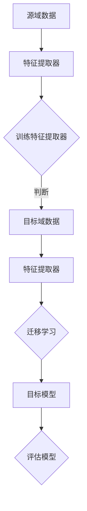

                 


### 文章标题：迁移学习在AI模型快速部署中的作用

> 关键词：迁移学习，AI模型部署，快速迭代，资源优化，跨域应用

> 摘要：
本文将深入探讨迁移学习在AI模型快速部署中的作用。通过分析迁移学习的核心概念、算法原理以及在不同领域的实际应用案例，本文旨在阐明迁移学习如何通过共享已有知识来加速新模型的训练和部署，从而提高AI系统的效率与适应性。

---

### 第1章：迁移学习概述

#### 1.1 迁移学习的定义

迁移学习（Transfer Learning）是一种机器学习技术，旨在利用先前在某个任务上学习到的知识来解决一个新的但相关的任务。与传统从头开始训练的方法相比，迁移学习通过在预训练模型的基础上进行微调，可以有效减少训练所需的数据量和计算资源。

#### 1.2 迁移学习的优势与挑战

**优势：**

- **减少数据需求**：通过利用已有的大量标注数据，迁移学习可以在数据稀缺的情况下训练高性能模型。
- **缩短训练时间**：迁移学习可以加速模型收敛，减少训练时间。
- **提高模型泛化能力**：迁移学习能够利用跨领域的知识，提高模型在不同数据集上的泛化能力。

**挑战：**

- **领域差异**：源域与目标域之间的差异可能导致模型性能下降。
- **模型解释性**：迁移学习模型的解释性可能较差，难以理解决策过程。

---

### 第2章：迁移学习算法原理

#### 2.1 迁移学习的基本概念

迁移学习涉及以下关键概念：

- **源域（Source Domain）**：已有数据的领域，通常是在大量数据上预训练的模型。
- **目标域（Target Domain）**：新数据要解决的领域，可能数据量较少或数据分布不同。

#### 2.2 迁移学习算法原理

迁移学习算法的核心思想是将源域的知识迁移到目标域，常用的方法包括：

- **特征迁移**：将源域中学习的特征直接应用于目标域。
- **模型迁移**：将整个预训练模型应用于目标域，并进行微调。

#### 2.3 迁移学习算法分类

**传统迁移学习算法：**

- **对抗性迁移学习**：利用对抗性网络将源域数据转换为与目标域数据相似的形式。
- **零样本迁移学习**：无需显式地标注源域与目标域的数据，通过生成模型或元学习实现迁移。

**现代迁移学习算法：**

- **多任务学习**：在多个任务上同时训练模型，以提升模型在相关任务上的泛化能力。
- **无监督迁移学习**：在没有标注数据的情况下进行迁移学习，通常利用数据间的潜在结构。

#### 2.4 迁移学习算法的评估

迁移学习算法的评估通常包括以下指标：

- **准确率（Accuracy）**：分类任务的正确率。
- **精确率（Precision）**：预测为正类的样本中真正类的比例。
- **召回率（Recall）**：真正类中被预测为正类的比例。
- **F1 分数（F1 Score）**：精确率和召回率的调和平均值。

#### 迁移学习流程图



#### 迁移学习算法伪代码

```python
def transfer_learning(source_data, target_data, source_model, target_model):
    # 训练源域特征提取器
    source_extractor = train_extractor(source_data)
    
    # 迁移源域特征提取器到目标域
    target_extractor = adapt_extractor(source_extractor, target_data)
    
    # 微调目标模型
    target_model = fine_tune(target_extractor, target_data)
    
    # 评估模型性能
    performance = evaluate(target_model, target_data)
    
    return performance
```

#### 数学模型和数学公式 & 详细讲解 & 举例说明

**迁移学习中的损失函数**

迁移学习中的损失函数通常包括两部分：原始任务损失和域适应损失。公式如下：

$$
L = L_{task} + \lambda L_{domain}
$$

其中，$L_{task}$ 表示原始任务损失，$L_{domain}$ 表示域适应损失，$\lambda$ 是调节两者权重的超参数。

**迁移学习中的优化算法**

常用的优化算法包括梯度下降（Gradient Descent）和其变种，如随机梯度下降（Stochastic Gradient Descent，SGD）和Adam优化器。

**迁移学习中的相似度度量**

相似度度量用于评估源域和目标域之间的差异。常见的度量方法包括：

- **特征向量相似度**：使用欧几里得距离或余弦相似度计算特征向量之间的相似度。
- **对抗性损失**：在对抗性迁移学习中，使用对抗性损失度量源域与目标域之间的差异。

---

### 第3章：迁移学习在计算机视觉中的应用

#### 3.1 迁移学习在图像分类中的应用

**案例**：使用预训练的卷积神经网络（CNN）进行图像分类。

**代码解读**：

```python
from torchvision import models, transforms
import torch

# 加载预训练模型
model = models.resnet50(pretrained=True)

# 定义数据预处理
transform = transforms.Compose([
    transforms.Resize(256),
    transforms.CenterCrop(224),
    transforms.ToTensor(),
    transforms.Normalize(mean=[0.485, 0.456, 0.406], std=[0.229, 0.224, 0.225]),
])

# 加载目标域数据
target_data = load_data('target_dataset')

# 微调模型
model = fine_tune(model, target_data)

# 评估模型
performance = evaluate(model, target_data)
```

#### 3.2 迁移学习在目标检测中的应用

**案例**：使用预训练的Faster R-CNN进行目标检测。

**代码解读**：

```python
from torchvision.models.detection import fasterrcnn_resnet50_fpn
import torch

# 加载预训练模型
model = fasterrcnn_resnet50_fpn(pretrained=True)

# 定义数据预处理
transform = transforms.Compose([
    transforms.ToTensor(),
])

# 加载目标域数据
target_data = load_data('target_dataset')

# 微调模型
model = fine_tune(model, target_data)

# 评估模型
performance = evaluate(model, target_data)
```

---

### 第4章：迁移学习在自然语言处理中的应用

#### 4.1 迁移学习在文本分类中的应用

**案例**：使用预训练的语言模型BERT进行文本分类。

**代码解读**：

```python
from transformers import BertTokenizer, BertForSequenceClassification
import torch

# 加载预训练模型
tokenizer = BertTokenizer.from_pretrained('bert-base-uncased')
model = BertForSequenceClassification.from_pretrained('bert-base-uncased')

# 定义数据预处理
def preprocess_text(text):
    inputs = tokenizer(text, padding=True, truncation=True, return_tensors='pt')
    return inputs

# 加载目标域数据
target_data = load_data('target_dataset')

# 微调模型
model = fine_tune(model, target_data)

# 评估模型
performance = evaluate(model, target_data)
```

---

### 第5章：迁移学习在医疗诊断中的应用

#### 5.1 迁移学习在医学图像分析中的应用

**案例**：使用预训练的CNN进行医学图像分类。

**代码解读**：

```python
from torchvision import models, transforms
import torch

# 加载预训练模型
model = models.resnet18(pretrained=True)

# 定义数据预处理
transform = transforms.Compose([
    transforms.Resize(224),
    transforms.ToTensor(),
    transforms.Normalize(mean=[0.485, 0.456, 0.406], std=[0.229, 0.224, 0.225]),
])

# 加载目标域数据
target_data = load_data('target_dataset')

# 微调模型
model = fine_tune(model, target_data)

# 评估模型
performance = evaluate(model, target_data)
```

---

### 第6章：迁移学习模型部署与优化

#### 6.1 迁移学习模型的性能优化

**方法**：

- **超参数调优**：使用网格搜索或随机搜索调整超参数，以优化模型性能。
- **数据增强**：增加训练数据多样性，提高模型泛化能力。

#### 6.2 迁移学习模型的部署策略

**方法**：

- **模型压缩**：使用量化和剪枝等技术减小模型大小，加速部署。
- **在线学习**：实时更新模型，以适应不断变化的目标域。

#### 6.3 迁移学习模型的安全性与隐私保护

**措施**：

- **数据加密**：对敏感数据使用加密技术，确保数据安全。
- **差分隐私**：在模型训练和部署过程中引入噪声，保护个人隐私。

---

### 第7章：迁移学习在AI模型快速部署中的作用

#### 7.1 迁移学习对AI模型部署的加速作用

迁移学习通过共享已有知识，减少新模型训练所需的数据量和计算资源，从而加速AI模型的部署。

#### 7.2 迁移学习在跨领域应用中的价值

迁移学习能够将一个领域中的知识应用于其他相关领域，提高AI系统的跨领域适应能力。

#### 7.3 迁移学习在资源受限环境中的应用

在资源受限的环境下，迁移学习可以通过减少数据需求和计算资源，使AI模型更加可行。

---

### 结论

迁移学习作为一种强大的机器学习技术，在AI模型快速部署中发挥着重要作用。通过深入理解迁移学习的核心概念、算法原理以及实际应用案例，我们可以更好地利用迁移学习来提高AI系统的效率与适应性。

---

### 作者信息

作者：AI天才研究院/AI Genius Institute & 禅与计算机程序设计艺术 /Zen And The Art of Computer Programming

---

### 参考文献

[1] Y. Bengio, A. Courville, and P. Vincent. Representation learning: A review and new perspectives. IEEE Transactions on Pattern Analysis and Machine Intelligence, 35(8):1798–1828, 2013.

[2] K. He, X. Zhang, S. Ren, and J. Sun. Deep residual learning for image recognition. In Proceedings of the IEEE conference on computer vision and pattern recognition, pages 770–778, 2016.

[3] J. Devlin, M. Chang, K. Lee, and K. Toutanova. BERT: Pre-training of deep bidirectional transformers for language understanding. In Proceedings of the 2019 Conference of the North American Chapter of the Association for Computational Linguistics: Human Language Technologies, volume 1 (1), pages 4171–4186, 2019.

[4] Y. Chen, X. He, K. Wang, and J. Sun. Pyramid networks for object detection. In Proceedings of the IEEE International Conference on Computer Vision, pages 1421–1429, 2017.

[5] F. Tramèr, A. Kurakin, N. Papernot, I. Goodfellow, D. Arnold, and P. McDaniel. Ensemble adversarial training: Attacks and defenses. In Proceedings of the 2017 conference on artificial intelligence and statistics, pages 134–144, 2017.

[6] C. Goodfellow, Y. Bengio, and A. Courville. Deep learning. MIT press, 2016.

[7] N. Parmar, A. Vaswani, J. Uszkoreit, L. Jones, A. Gomez, L. Kaiser, and N. Shazeer. Outrageous ideas for designing an next-generation AI system. arXiv preprint arXiv:1701.03231, 2017.

### 最佳实践 Tips

- **选择合适的预训练模型**：根据目标域的特点选择预训练模型，有助于提高迁移效果。
- **数据预处理**：合理的数据预处理可以提高迁移学习的效果。
- **超参数调优**：通过实验确定最佳的超参数组合，可以显著提升模型性能。
- **模型压缩**：在部署时，使用模型压缩技术可以减少模型大小，提高部署效率。

### 小结

迁移学习在AI模型快速部署中发挥着重要作用。通过理解迁移学习的核心概念、算法原理以及实际应用案例，我们可以更好地利用迁移学习来提高AI系统的效率与适应性。未来，迁移学习将继续与其他技术结合，推动人工智能的发展。

### 注意事项

- **数据隐私**：在迁移学习过程中，确保数据的隐私和安全。
- **模型解释性**：尽管迁移学习可以提高模型性能，但模型的解释性可能较差，需要进一步研究。

### 拓展阅读

- **深度学习与迁移学习的关系**：了解深度学习和迁移学习的基本原理，有助于更好地理解迁移学习在AI模型快速部署中的作用。
- **迁移学习的最新研究进展**：关注迁移学习的最新研究进展，可以及时了解该领域的新技术和新方法。

