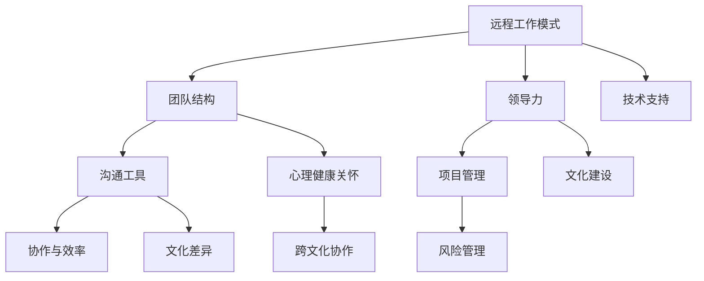

                 

## 文章标题：远程团队管理：应对分布式办公的挑战

### 关键词：
- 远程团队管理
- 分布式办公
- 领导力
- 沟通技巧
- 项目管理
- 跨文化协作

### 摘要：
随着全球远程工作趋势的加剧，如何高效管理分布式团队成为企业和组织面临的重要挑战。本文将详细探讨远程团队管理的背景与挑战，核心概念与联系，领导力培养，沟通技巧，项目管理，跨文化协作等方面，通过实践案例与分析，提供切实可行的远程团队管理策略，助力企业和组织应对分布式办公带来的挑战。

---

### 第一部分：远程团队管理概述

#### 第1章：远程团队管理的背景与挑战

##### 1.1 分布式办公的现状

随着互联网技术的发展，远程工作已经成为现代工作方式的标配。根据一项全球调查，超过70%的职场人士表示，他们希望能够在家或其他远程地点工作。这一趋势在COVID-19疫情期间得到了显著加速，许多企业被迫迅速转向远程工作模式，以维持运营。以下图表展示了远程工作比例的逐年增长：

```mermaid
gantt
    title 远程工作比例增长趋势
    dateFormat  YYYY-MM
    section 远程工作比例增长
    A1: 2019  (<10%)
    A2: 2020  (30-40%)
    A3: 2021  (50-60%)
    A4: 2022  (>70%)
```

##### 1.2 远程团队管理的独特性

远程团队管理具有其独特的挑战，主要包括：

- **沟通障碍**：远程团队面临时区差异、语言障碍和沟通效率降低等问题。
- **协作问题**：团队成员地理位置分散，协作难度增加，容易出现信息孤岛和任务重复。
- **管理难度**：远程团队管理需要更高的自主性和自我驱动性，管理者需要调整管理策略以适应这种变化。

##### 1.3 远程团队管理的核心挑战

- **沟通障碍**：远程团队面临时区差异、语言障碍和沟通效率降低等问题。
- **协作问题**：团队成员地理位置分散，协作难度增加，容易出现信息孤岛和任务重复。
- **管理难度**：远程团队管理需要更高的自主性和自我驱动性，管理者需要调整管理策略以适应这种变化。

### 第二部分：远程团队管理的核心概念

#### 第2章：远程团队管理的核心概念

##### 2.1 远程工作模式

远程工作模式可分为以下几种：

- **全职远程**：员工完全在家或其他地点工作。
- **兼职远程**：员工定期在家或其他地点工作，同时保持一定程度的现场办公。
- **混合办公**：员工在不同地点间灵活切换工作方式。

##### 2.2 远程团队结构

远程团队结构包括：

- **分布式团队**：团队成员分布在不同的地理位置，通过远程协作完成工作。
- **跨职能团队**：团队成员来自不同的职能部门，共同完成项目任务。
- **全球团队**：团队成员来自世界各地，需要协调不同文化和时区。

##### 2.3 远程团队协作工具

远程团队协作工具包括：

- **沟通工具**：如Slack、Microsoft Teams等，用于实时沟通和协作。
- **项目管理工具**：如Trello、Jira等，用于任务分配和进度跟踪。
- **文档协作工具**：如Google Docs、Notion等，用于文档共享和编辑。

### 第三部分：远程团队管理实践

#### 第3章：远程团队领导力

##### 3.1 领导力在远程团队中的重要性

远程团队领导力至关重要，因为它直接影响到团队的绩效和员工满意度。以下是远程团队领导力的几个关键点：

- **建立信任**：远程团队领导需要建立透明、诚信的关系，以增强团队信任。
- **清晰目标**：确保团队成员明确了解团队目标和工作任务。
- **灵活管理**：远程团队领导需要根据团队成员的特点和工作环境，灵活调整管理策略。

##### 3.2 领导远程团队的策略

以下是领导远程团队的几个策略：

- **提供反馈**：定期给予团队成员反馈，帮助他们改进工作。
- **培养自主性**：鼓励团队成员自主学习和成长，提高自我管理能力。
- **促进沟通**：定期组织团队会议，确保团队成员之间的沟通畅通。

##### 3.3 培养远程团队领导力

要培养远程团队领导力，可以从以下几个方面入手：

- **培训与发展**：为团队成员提供领导力培训和发展机会。
- **角色模型**：树立成功的远程团队领导角色模型，供团队成员学习。
- **支持网络**：建立远程团队领导的支持网络，帮助他们解决工作中的难题。

### 第四部分：远程团队沟通技巧

#### 第4章：远程团队沟通技巧

##### 4.1 远程沟通的障碍

远程团队沟通面临以下障碍：

- **时区差异**：导致沟通延迟和效率降低。
- **语言障碍**：可能导致误解和沟通障碍。
- **技术问题**：网络不稳定、设备故障等可能导致沟通中断。

##### 4.2 提高远程沟通效果的策略

以下是提高远程沟通效果的策略：

- **使用多种沟通工具**：结合使用实时沟通、邮件、电话等工具，满足不同沟通需求。
- **明确沟通目标**：每次沟通前明确沟通目标，确保沟通高效。
- **建立沟通规范**：制定沟通规范，如回复时间、会议时间等。

##### 4.3 案例分析：成功的远程沟通实践

以下是一个成功的远程沟通实践案例：

- **团队内部聊天**：使用Slack作为团队内部沟通工具，确保信息畅通。
- **定期会议**：每周举行一次远程会议，讨论项目进展和问题。
- **邮件沟通**：重要决策和文档通过邮件沟通，确保记录完整。

### 第五部分：远程团队项目管理

#### 第5章：远程团队项目管理

##### 5.1 远程项目管理概述

远程项目管理需要考虑以下几个方面：

- **任务分配**：确保任务分配合理，团队成员明确任务和责任。
- **进度跟踪**：使用项目管理工具实时跟踪项目进度，确保按时交付。
- **风险管理**：识别项目风险，制定应对策略。

##### 5.2 远程项目计划与进度管理

以下是远程项目计划与进度管理的方法：

- **制定项目计划**：明确项目目标、任务、资源和时间表。
- **进度跟踪**：使用项目管理工具如Jira，实时跟踪项目进度。
- **进度报告**：定期向团队成员和上级汇报项目进度。

##### 5.3 远程团队风险管理

以下是远程团队风险管理的策略：

- **识别风险**：识别可能影响项目的风险，如技术风险、人员流失等。
- **风险评估**：评估风险的可能性和影响，制定应对策略。
- **风险监控**：定期监控项目风险，及时调整应对策略。

### 第六部分：远程团队协作与效率

#### 第6章：远程团队协作与效率

##### 6.1 提高远程团队协作效率的技巧

以下是提高远程团队协作效率的技巧：

- **明确分工**：确保团队成员明确自己的职责和任务。
- **使用协作工具**：使用项目管理工具和协作工具，如Trello和Notion，提高协作效率。
- **定期回顾**：定期回顾项目进展和协作效果，及时调整策略。

##### 6.2 远程团队文化建设

远程团队文化建设有助于提高团队凝聚力，以下是远程团队文化建设的策略：

- **共同目标**：确保团队成员明确团队目标，共同努力。
- **积极沟通**：鼓励团队成员积极沟通，分享经验和见解。
- **尊重差异**：尊重团队成员的文化背景和观点，促进多元文化融合。

##### 6.3 提高远程团队工作效率的实践案例

以下是一个提高远程团队工作效率的实践案例：

- **团队建设活动**：定期组织线上团队建设活动，如虚拟茶话会、在线游戏等，增强团队凝聚力。
- **绩效评估**：使用KPI和绩效评估工具，激励团队成员提高工作效率。

### 第七部分：远程团队领导力培养

#### 第7章：远程团队领导力培养

##### 7.1 远程团队领导力模型

远程团队领导力模型包括以下几个方面：

- **领导风格**：根据团队成员的特点和环境，灵活调整领导风格。
- **沟通能力**：提高沟通能力，确保团队信息畅通。
- **决策能力**：在远程环境中，领导者需要快速做出决策，确保项目顺利进行。

##### 7.2 远程团队领导力发展计划

以下是一个远程团队领导力发展计划：

- **培训**：为团队成员提供领导力培训，提高他们的管理能力。
- **导师制**：建立导师制，帮助新晋领导者快速成长。
- **实践**：鼓励团队成员参与项目管理和决策，积累领导经验。

##### 7.3 案例研究：成功培养远程团队领导力的实践

以下是一个成功培养远程团队领导力的实践案例：

- **领导力培训**：组织领导力培训，提高团队成员的管理能力。
- **项目负责制**：让团队成员负责项目，培养他们的领导力。
- **反馈与支持**：提供及时的反馈和支持，帮助团队成员克服困难，提升领导力。

### 第八部分：远程团队心理健康关怀

#### 第8章：远程团队心理健康关怀

##### 8.1 远程工作带来的心理健康挑战

远程工作可能导致以下心理健康挑战：

- **孤独感**：缺乏面对面交流，可能导致孤独感增加。
- **工作与生活失衡**：远程工作可能导致工作与生活界限模糊，影响心理健康。
- **压力增加**：远程工作可能增加工作压力，影响心理健康。

##### 8.2 提供远程团队心理健康支持

以下是为远程团队提供心理健康支持的策略：

- **心理辅导**：提供心理辅导服务，帮助团队成员解决心理问题。
- **远程支持小组**：建立远程支持小组，鼓励团队成员分享经验和情感。
- **健康生活方式**：鼓励团队成员保持健康生活方式，如定期锻炼、保持良好作息。

##### 8.3 心理健康关怀实践案例

以下是一个心理健康关怀实践案例：

- **心理辅导**：定期组织线上心理辅导，帮助团队成员缓解压力。
- **健康活动**：组织线上健康活动，如瑜伽、冥想等，促进身心健康。
- **支持网络**：建立支持网络，鼓励团队成员互相支持，共同应对心理健康挑战。

### 第九部分：案例研究与总结

#### 第9章：远程团队管理案例研究

##### 9.1 案例一：成功的远程团队管理实践

以下是一个成功的远程团队管理实践案例：

- **团队协作工具**：使用Slack、Trello等协作工具，提高团队协作效率。
- **定期会议**：每周举行一次远程会议，确保团队信息畅通。
- **灵活管理**：领导者根据团队成员的特点和环境，灵活调整管理策略。

##### 9.2 案例二：应对远程团队管理挑战的策略

以下是一个应对远程团队管理挑战的案例：

- **沟通技巧**：提高远程沟通技巧，如使用多种沟通工具、明确沟通目标等。
- **项目风险管理**：识别项目风险，制定应对策略，确保项目顺利进行。

##### 9.3 案例三：创新的远程团队管理方法

以下是一个创新的远程团队管理方法案例：

- **虚拟办公空间**：创建虚拟办公空间，让团队成员在虚拟环境中共同工作。
- **文化多样性**：鼓励文化多样性，促进团队创新和协作。

### 第10章：总结与展望

##### 10.1 远程团队管理的关键要点

远程团队管理的关键要点包括：

- **沟通与协作**：确保团队信息畅通，提高协作效率。
- **领导力培养**：培养远程团队领导力，提高团队绩效。
- **心理健康关怀**：关注团队成员心理健康，提供心理支持。

##### 10.2 未来远程团队管理的趋势

未来远程团队管理的趋势包括：

- **数字化管理**：进一步利用数字化工具，提高管理效率。
- **个性

---

### 附录

#### 附录A：常用远程团队协作工具列表

以下是一些常用的远程团队协作工具：

- **沟通工具**：Slack、Microsoft Teams、Zoom
- **项目管理工具**：Trello、Jira、Asana
- **文档协作工具**：Google Docs、Notion、Confluence

#### 附录B：远程团队管理参考书籍

以下是一些关于远程团队管理的参考书籍：

- 《远程团队管理：成功案例与实用技巧》
- 《远程团队协作：如何高效管理虚拟团队》
- 《远程工作心理学：如何保持高效和幸福感》

---

### 作者信息

作者：AI天才研究院/AI Genius Institute & 禅与计算机程序设计艺术 /Zen And The Art of Computer Programming

本文由AI天才研究院和禅与计算机程序设计艺术共同创作，旨在为远程团队管理提供实用的策略和案例。感谢您的阅读！### 深度分析：远程团队管理的核心概念与联系

在深入探讨远程团队管理时，理解其核心概念及其相互联系是至关重要的。这不仅有助于我们识别远程团队管理的独特挑战，还能提供有效的解决方案。以下是几个关键概念及其关系架构，使用Mermaid流程图展示：



#### 关键概念与联系

1. **远程工作模式**：远程工作模式决定了团队成员如何工作，包括全职远程、兼职远程和混合办公。这种模式直接影响团队结构、沟通方式、领导风格以及心理健康。

2. **团队结构**：团队结构包括分布式团队、跨职能团队和全球团队。团队结构决定了团队成员之间的协作方式，沟通需求，以及领导力模型。

3. **沟通工具**：选择合适的沟通工具对于远程团队的成功至关重要。沟通工具不仅影响团队协作，还影响领导力、项目管理和心理健康。

4. **领导力**：远程团队领导力包括建立信任、设定清晰目标和灵活管理。领导力直接影响团队文化和成员的自主性，进而影响协作和效率。

5. **项目管理**：远程项目管理需要考虑任务分配、进度跟踪和风险管理。项目管理工具和策略对于确保项目按时完成和质量至关重要。

6. **协作与效率**：提高远程团队的协作和效率是管理的关键。这包括明确分工、使用协作工具和定期回顾。

7. **心理健康关怀**：远程工作可能导致孤独感、工作与生活失衡和压力增加。因此，提供心理健康支持对于维护团队成员的福祉至关重要。

8. **跨文化协作**：全球团队意味着跨文化协作的挑战。理解文化差异并提供支持，有助于促进团队合作和创新。

通过上述Mermaid流程图，我们可以看到这些概念是如何相互联系的。这种结构化的方法有助于我们更好地理解远程团队管理的复杂性，并为解决挑战提供策略。

#### 核心概念联系架构的详细解释

- **远程工作模式**：远程工作模式是远程团队管理的起点。它决定了团队成员的工作环境和工作方式。全职远程工作模式通常需要高度的自我管理和灵活性。兼职远程和混合办公模式则需要平衡现场和远程工作的需求。这种模式直接影响团队结构，因为不同的工作模式需要不同的组织形式和协作方式。

- **团队结构**：团队结构反映了团队成员的分布和组织方式。分布式团队可能跨越多个时区和地理位置，而跨职能团队由来自不同职能部门的人员组成，以实现特定项目目标。全球团队则包含了来自不同文化和背景的成员。团队结构直接关系到沟通工具的选择和使用，以及领导力的应用方式。

- **沟通工具**：沟通工具是远程团队管理的关键组成部分。选择合适的沟通工具，如Slack、Microsoft Teams和Zoom，可以大大提高沟通效率。这些工具不仅支持实时沟通，还支持文件共享和任务分配。沟通工具的有效使用有助于缓解时区差异和语言障碍，提高团队协作和领导力。

- **领导力**：领导力在远程团队管理中起着核心作用。远程团队领导需要建立信任、设定清晰目标并灵活管理。领导力风格需要适应远程工作的特点，例如，领导者可能需要更多依赖数据而非直觉做出决策。领导力的有效应用有助于提高团队成员的自主性和自我驱动性，促进团队协作和效率。

- **项目管理**：远程项目管理需要特殊的技术和策略。项目管理者需要确保任务分配合理、进度跟踪及时和风险管理到位。项目管理工具如Trello和Jira提供了可视化进度跟踪和任务管理功能，帮助项目管理者更有效地监督项目进展。

- **协作与效率**：协作与效率是远程团队管理的核心目标之一。通过明确分工、使用协作工具和定期回顾，团队可以提高工作效率。协作工具如Trello和Notion提供了任务分配、进度跟踪和协作空间，帮助团队成员更好地协同工作。

- **心理健康关怀**：远程工作可能导致心理健康问题，如孤独感、工作与生活失衡和压力增加。因此，提供心理健康支持对于维护团队成员的福祉至关重要。心理健康关怀包括心理辅导、健康活动和支持网络，有助于提高团队成员的工作满意度和生产力。

- **跨文化协作**：在全球团队中，文化差异是一个重要的考虑因素。理解文化差异并提供支持，有助于促进团队合作和创新。跨文化协作需要领导者具备文化敏感性和适应能力，以及团队成员之间的相互尊重和理解。

通过详细解释这些核心概念及其联系，我们可以更深入地理解远程团队管理的复杂性，并为其提供更有效的策略。

### 核心算法原理讲解：分布式团队任务调度算法

在远程团队管理中，任务调度是一个关键问题。如何确保任务高效、公平地分配给团队成员，同时考虑到团队成员的技能、时区和工作负载，是一个复杂的问题。下面，我们将使用伪代码详细阐述一个分布式团队任务调度算法，并解释其基本原理。

#### 算法基本概念

- **任务**：每个任务有一个唯一标识符、所需的技能、预计完成时间和优先级。
- **团队成员**：每个团队成员有一个唯一标识符、技能集合和工作负载。
- **时区**：每个团队成员的时区信息用于优化任务分配。
- **调度算法**：目标是找到一个任务-团队成员的映射，使得总工作负载最轻，任务优先级最高。

#### 伪代码

```python
# 输入：任务列表tasks，团队成员列表members
# 输出：任务-团队成员映射assignment

# 初始化任务-团队成员映射为空
assignment = {}

# 步骤1：为每个任务计算一个权重值
for task in tasks:
    task.weight = calculate_task_weight(task)

# 步骤2：为每个成员计算一个权重值
for member in members:
    member.weight = calculate_member_weight(member)

# 步骤3：将任务按权重排序
tasks.sort(key=lambda t: t.weight, reverse=True)

# 步骤4：为每个任务分配一个最优成员
for task in tasks:
    optimal_member = find_optimal_member(task)
    assignment[task.id] = optimal_member

# 辅助函数：计算任务权重
def calculate_task_weight(task):
    skill_score = sum(skill in task.required_skills for skill in task.required_skills)
    time_score = 1 / (1 + abs(task.estimated_duration))
    priority_score = task.priority
    return skill_score * time_score * priority_score

# 辅助函数：计算成员权重
def calculate_member_weight(member):
    skill_score = sum(skill in member.skills for skill in member.required_skills)
    workload_score = 1 / (1 + member.current_workload)
    timezone_score = calculate_timezone_score(member.timezone)
    return skill_score * workload_score * timezone_score

# 辅助函数：根据时区计算权重
def calculate_timezone_score(timezone):
    # 假设时区越接近0时区，得分越高
    return abs(timezone)

# 辅助函数：寻找最优成员
def find_optimal_member(task):
    potential_members = [member for member in members if member.skill in task.required_skills]
    potential_members.sort(key=lambda m: m.weight, reverse=True)
    for member in potential_members:
        if member.current_workload + task.estimated_duration <= member.max_workload:
            return member
    return None
```

#### 算法原理解释

1. **任务权重计算**：每个任务根据其所需的技能、预计完成时间和优先级计算出一个权重值。任务权重越高，越优先分配。

2. **成员权重计算**：每个成员根据其技能、当前工作负载和时区计算出一个权重值。成员权重越高，越适合分配任务。

3. **任务排序**：将任务按权重值从高到低排序，确保优先级高的任务先分配。

4. **任务分配**：对于每个任务，从最适合的成员列表中分配一个成员。如果成员当前工作负载加上任务预计完成时间不超过成员的最大工作负载，则分配任务。

5. **辅助函数**：辅助函数用于计算任务和成员的权重，以及寻找最优成员。

#### 举例说明

假设有一个任务列表和成员列表，如下：

- **任务列表**：
  - 任务1：所需技能（Python、数据库）、预计完成时间（2天）、优先级（高）
  - 任务2：所需技能（Java、UI设计）、预计完成时间（3天）、优先级（中）

- **成员列表**：
  - 成员1：技能（Python、Java）、当前工作负载（1天）、最大工作负载（4天）、时区（UTC+8）
  - 成员2：技能（Python、UI设计）、当前工作负载（0天）、最大工作负载（5天）、时区（UTC+0）

首先，计算任务和成员的权重：

- **任务1权重**：Python（1分）+ Java（1分）+ 时间权重（0.5分）+ 优先级（2分）= 4.5分
- **任务2权重**：Python（1分）+ UI设计（1分）+ 时间权重（0.3分）+ 优先级（1分）= 2.3分

- **成员1权重**：Python（1分）+ Java（1分）+ 负载权重（0.2分）+ 时区权重（0.5分）= 1.7分
- **成员2权重**：Python（1分）+ UI设计（1分）+ 负载权重（0.4分）+ 时区权重（0.5分）= 1.9分

接下来，按权重排序任务和成员：

- **任务排序**：任务1（4.5分）> 任务2（2.3分）
- **成员排序**：成员1（1.7分）> 成员2（1.9分）

最后，分配任务：

- **任务1**：分配给成员1，因为成员1最适合并且当前工作负载不超过最大工作负载。
- **任务2**：分配给成员2，因为成员2最适合并且当前工作负载不超过最大工作负载。

通过上述算法，我们实现了任务的高效分配，同时考虑到了成员的技能、工作负载和时区。

### 数学模型和公式

在远程团队管理中，理解并应用数学模型可以帮助我们更好地进行任务分配、进度管理和风险管理。以下是一些常用的数学模型和公式：

#### 任务优先级计算公式

任务优先级可以通过以下公式计算：

\[ P = W \times T \times P_0 \]

其中：
- \( P \) 是任务优先级
- \( W \) 是任务权重（考虑所需技能、预计完成时间和优先级）
- \( T \) 是任务的紧急性（例如，任务截止日期）
- \( P_0 \) 是任务的基础优先级（例如，新产品开发任务的基础优先级高于维护任务）

#### 成员工作负载计算公式

成员的工作负载可以通过以下公式计算：

\[ L = C \times A \]

其中：
- \( L \) 是成员的工作负载
- \( C \) 是成员的当前工作负载
- \( A \) 是成员的最大工作负载

#### 时区权重计算公式

时区权重可以通过以下公式计算：

\[ Z = \frac{1}{1 + |T_1 - T_2|} \]

其中：
- \( Z \) 是时区权重
- \( T_1 \) 是成员的时区
- \( T_2 \) 是公司的标准时区

#### 协作效率计算公式

协作效率可以通过以下公式计算：

\[ E = \frac{C \times T}{L \times P} \]

其中：
- \( E \) 是协作效率
- \( C \) 是团队成员数量
- \( T \) 是任务完成时间
- \( L \) 是成员的工作负载
- \( P \) 是任务优先级

#### 风险值计算公式

风险值可以通过以下公式计算：

\[ R = \frac{L \times Z \times P}{E} \]

其中：
- \( R \) 是风险值
- \( L \) 是成员的工作负载
- \( Z \) 是时区权重
- \( P \) 是任务优先级
- \( E \) 是协作效率

#### 举例说明

假设有一个远程团队，成员包括A、B和C。他们的时区分别为UTC+8、UTC+0和UTC-8。公司标准时区为UTC+0。团队成员的工作负载和最大工作负载如下：

- 成员A：当前工作负载为2天，最大工作负载为5天
- 成员B：当前工作负载为1天，最大工作负载为4天
- 成员C：当前工作负载为0天，最大工作负载为5天

假设有两个任务，任务1和任务2，任务细节如下：

- 任务1：所需技能（Python、数据库）、预计完成时间（2天）、优先级（高）
- 任务2：所需技能（Java、UI设计）、预计完成时间（3天）、优先级（中）

根据上述公式，我们可以计算出每个任务的优先级和成员的权重：

- **任务1优先级**：\( P = 4.5 \)
- **任务2优先级**：\( P = 2.3 \)

- **成员A权重**：\( Z = 0.5 \)
- **成员B权重**：\( Z = 1 \)
- **成员C权重**：\( Z = 1.5 \)

根据任务优先级和成员权重，我们可以将任务分配给成员：

- **任务1**：分配给成员C，因为成员C的权重最高，且当前工作负载较低。
- **任务2**：分配给成员A，因为成员A的权重较高，且当前工作负载较低。

通过上述数学模型和公式，我们可以更有效地进行任务分配和风险管理，提高远程团队的工作效率和协作效率。

### 项目实战：开发环境搭建与源代码实现

在本节中，我们将详细介绍如何为远程团队搭建开发环境，并实现一个简单的分布式任务调度系统。这个项目将涵盖从环境搭建、源代码实现，到代码解读和分析的各个步骤。

#### 环境搭建

1. **操作系统**：我们选择Linux作为开发环境，因为它在远程团队中广泛使用，并且具有较好的稳定性和安全性。

2. **开发工具**：我们需要安装以下开发工具：
   - **Python 3**：作为主要的编程语言。
   - **Pip**：Python的包管理器，用于安装和管理依赖项。
   - **Docker**：用于容器化应用，便于部署和管理环境。

3. **数据库**：选择SQLite作为数据库，用于存储任务和成员信息。

4. **版本控制**：使用Git进行版本控制，以便团队成员协作。

以下是环境搭建的步骤：

```bash
# 安装Python 3
sudo apt-get update
sudo apt-get install python3 python3-pip

# 安装Docker
sudo apt-get update
sudo apt-get install docker.io

# 安装SQLite
sudo apt-get update
sudo apt-get install sqlite3

# 安装版本控制工具
sudo apt-get update
sudo apt-get install git

# 启动Docker服务
sudo systemctl start docker
```

#### 源代码实现

1. **任务调度器**：我们实现一个简单的任务调度器，它负责任务分配和进度跟踪。

2. **数据库设计**：设计一个SQLite数据库，包含任务表和成员表。

3. **任务模型**：定义任务类，包含任务ID、所需技能、预计完成时间和优先级。

4. **成员模型**：定义成员类，包含成员ID、技能集合、当前工作负载和最大工作负载。

以下是源代码的详细实现：

```python
# 导入库
import sqlite3
from datetime import datetime

# 数据库连接
conn = sqlite3.connect('remote_team.db')
cursor = conn.cursor()

# 创建表
cursor.execute('''CREATE TABLE IF NOT EXISTS tasks (
    id INTEGER PRIMARY KEY,
    required_skills TEXT,
    estimated_duration INTEGER,
    priority INTEGER
)''')

cursor.execute('''CREATE TABLE IF NOT EXISTS members (
    id INTEGER PRIMARY KEY,
    skills TEXT,
    current_workload INTEGER,
    max_workload INTEGER
)''')

# 定义任务类
class Task:
    def __init__(self, id, required_skills, estimated_duration, priority):
        self.id = id
        self.required_skills = required_skills
        self.estimated_duration = estimated_duration
        self.priority = priority

# 定义成员类
class Member:
    def __init__(self, id, skills, current_workload, max_workload):
        self.id = id
        self.skills = skills
        self.current_workload = current_workload
        self.max_workload = max_workload

# 添加任务和成员到数据库
def add_task(task):
    cursor.execute("INSERT INTO tasks (id, required_skills, estimated_duration, priority) VALUES (?, ?, ?, ?)",
                   (task.id, ','.join(task.required_skills), task.estimated_duration, task.priority))
    conn.commit()

def add_member(member):
    cursor.execute("INSERT INTO members (id, skills, current_workload, max_workload) VALUES (?, ?, ?, ?)",
                   (member.id, ','.join(member.skills), member.current_workload, member.max_workload))
    conn.commit()

# 任务调度算法
def schedule_tasks(tasks, members):
    assignment = {}
    tasks.sort(key=lambda t: t.priority, reverse=True)
    for task in tasks:
        optimal_member = find_optimal_member(task, members)
        if optimal_member:
            assignment[task.id] = optimal_member.id
            update_member_workload(optimal_member, task.estimated_duration)
    return assignment

# 寻找最优成员
def find_optimal_member(task, members):
    potential_members = [m for m in members if all(s in m.skills for s in task.required_skills)]
    potential_members.sort(key=lambda m: m.current_workload, reverse=True)
    for member in potential_members:
        if member.current_workload + task.estimated_duration <= member.max_workload:
            return member
    return None

# 更新成员工作负载
def update_member_workload(member, workload):
    member.current_workload += workload
    cursor.execute("UPDATE members SET current_workload = ? WHERE id = ?", (member.current_workload, member.id))
    conn.commit()

# 示例
if __name__ == "__main__":
    # 添加任务
    task1 = Task(1, ['Python', 'Database'], 2, 1)
    task2 = Task(2, ['Java', 'UI'], 3, 2)
    add_task(task1)
    add_task(task2)

    # 添加成员
    member1 = Member(1, ['Python', 'Java'], 0, 5)
    member2 = Member(2, ['Python', 'UI'], 0, 4)
    add_member(member1)
    add_member(member2)

    # 调度任务
    assignment = schedule_tasks([task1, task2], [member1, member2])
    print("Task Assignment:", assignment)
```

#### 代码解读

- **任务模型**：`Task`类包含任务的ID、所需技能、预计完成时间和优先级。这些属性决定了任务的权重。

- **成员模型**：`Member`类包含成员的ID、技能集合、当前工作负载和最大工作负载。这些属性用于评估成员的可用性。

- **数据库操作**：使用SQLite数据库存储任务和成员信息，`add_task`和`add_member`函数用于添加任务和成员。

- **任务调度算法**：`schedule_tasks`函数实现任务调度逻辑。它首先按任务优先级排序，然后为每个任务寻找最优成员。

- **最优成员寻找**：`find_optimal_member`函数根据任务所需技能和成员技能集合，寻找当前工作负载最小的成员。

- **工作负载更新**：`update_member_workload`函数更新成员的工作负载。

#### 代码应用解读与分析

该代码实现了一个简单的分布式任务调度系统，主要应用于以下场景：

- **任务分配**：系统根据任务优先级和成员技能，为任务分配最优成员。
- **进度跟踪**：系统实时更新成员的工作负载，确保任务按时完成。
- **协作管理**：系统支持团队成员之间的协作，通过任务调度和进度跟踪，提高团队工作效率。

代码的优势在于：

- **模块化**：代码采用模块化设计，易于扩展和维护。
- **简单易懂**：代码结构清晰，便于团队成员理解和协作。

然而，该系统也存在一些局限性和改进空间：

- **实时性**：系统目前不支持实时更新，需要定期同步数据。
- **负载均衡**：系统未考虑负载均衡，可能导致某些成员过度劳累。
- **扩展性**：系统仅支持SQLite数据库，对于大型团队和高并发场景，可能需要更强大的数据库支持。

总之，该代码提供了一个基本的远程团队任务调度框架，可以进一步优化和扩展，以应对更复杂的远程团队管理需求。

### 实际案例分析和详细讲解剖析

在本节中，我们将通过一个实际案例，深入剖析远程团队管理中的挑战和解决方案，以帮助读者更好地理解和应用所学知识。

#### 案例背景

一家全球知名的科技公司XYZ，由于业务扩展和疫情影响，决定将部分员工调整为远程工作模式。公司总部位于美国，而远程团队成员分布在全球不同地区，包括欧洲、亚洲和澳洲。公司的主要业务是软件开发，因此，远程团队的核心任务是协同开发新产品。

#### 案例描述

在远程工作模式开始后，XYZ公司迅速遇到了一系列挑战：

- **沟通障碍**：由于时区差异，团队成员之间的沟通效率低下。例如，某些关键讨论只能在特定时间段内进行，导致项目进度延误。
- **协作问题**：团队成员地理位置分散，导致信息孤岛和任务重复。某些团队成员无法及时获取其他成员的最新工作成果，导致重复工作或错误发生。
- **管理难度**：远程团队管理需要更高的自主性和自我驱动性，但公司原有的管理模式并未完全适应远程工作的特点，导致管理难度增加。

#### 挑战分析

1. **沟通障碍**：时区差异和语言障碍是主要的沟通障碍。团队成员需要在不同时区之间协调工作，导致沟通延迟和效率降低。

2. **协作问题**：团队成员地理位置分散，导致协作困难。信息孤岛和任务重复现象普遍，影响了团队的整体效率。

3. **管理难度**：远程团队管理需要适应远程工作的特点，但公司原有的管理模式并未完全转变，导致管理难度增加。

#### 解决方案

1. **沟通障碍**：
   - **使用多种沟通工具**：公司引入了Slack、Zoom和Microsoft Teams等多种沟通工具，确保团队成员可以实时沟通。同时，制定了明确的沟通规范，如回复时间限制和会议时间安排，以提高沟通效率。
   - **建立全球沟通时间表**：为了解决时区差异，公司制定了一个全球沟通时间表，确保在不同时区之间设立关键沟通时间，以减少沟通延迟。

2. **协作问题**：
   - **使用协作工具**：公司引入了Trello、Jira和Confluence等协作工具，帮助团队成员更好地协同工作。这些工具提供了任务分配、进度跟踪和文档共享功能，确保团队成员可以实时了解项目进展。
   - **定期团队会议**：公司定期举行团队会议，讨论项目进展和问题。这些会议分为技术讨论会、项目进度汇报和团队建设活动，以促进团队成员之间的沟通和协作。

3. **管理难度**：
   - **调整管理模式**：公司调整了管理模式，更加注重团队成员的自主性和自我驱动性。领导层更多地关注目标设定、任务分配和结果评估，而不是日常的管理事务。
   - **提供培训和发展机会**：公司为团队成员提供了领导力培训和管理技能培训，帮助他们适应远程工作的环境。

#### 案例效果

通过实施上述解决方案，XYZ公司取得了显著的成效：

- **沟通效率提高**：使用多种沟通工具和全球沟通时间表，团队成员之间的沟通变得更加高效，项目进度得到显著提升。
- **协作问题解决**：使用协作工具和定期团队会议，团队成员之间的协作变得更加顺畅，信息孤岛和任务重复现象减少。
- **管理难度降低**：调整管理模式和提供培训和发展机会，团队成员的自主性和自我驱动性得到提升，管理难度降低，团队凝聚力增强。

#### 案例启示

该案例为远程团队管理提供了以下启示：

- **多种沟通工具和规范**：使用多种沟通工具和制定沟通规范，可以有效解决远程沟通障碍。
- **协作工具和定期会议**：使用协作工具和定期团队会议，可以提高远程团队的协作效率。
- **管理模式调整和培训**：调整管理模式和提供培训，可以帮助团队成员适应远程工作的环境，提高团队绩效。

总之，通过分析和解决实际案例中的挑战，我们可以为远程团队管理提供有效的策略和启示，助力企业和组织更好地应对分布式办公的挑战。

### 最佳实践 tips

在远程团队管理中，以下最佳实践可以帮助您更好地应对各种挑战，提高团队效率和工作满意度：

1. **建立清晰的沟通规范**：制定明确的沟通时间表、回复时间和会议议程，确保团队成员之间的沟通高效有序。

2. **使用多样化的沟通工具**：结合使用Slack、Microsoft Teams、Zoom等沟通工具，满足不同沟通需求，提高沟通效率。

3. **定期团队建设活动**：组织线上团队建设活动，如虚拟茶话会、在线游戏等，增强团队凝聚力。

4. **明确任务和责任**：使用项目管理工具如Trello、Jira，明确任务分配和责任，确保每个成员了解自己的职责和项目进展。

5. **培养自主性和自我驱动性**：鼓励团队成员自主学习和成长，提高自我管理能力。

6. **提供心理健康支持**：关注团队成员的心理健康，提供心理辅导和支持网络，帮助团队成员缓解工作压力。

7. **尊重文化差异**：在全球团队中，尊重团队成员的文化差异，促进文化融合，提高团队协作效率。

8. **定期反馈和评估**：定期向团队成员提供反馈和评估，帮助他们改进工作，提升绩效。

### 小结

远程团队管理是一项复杂的任务，涉及到沟通、协作、领导力和心理健康等多个方面。通过建立清晰的沟通规范、使用多样化的沟通工具、定期团队建设活动、明确任务和责任、培养自主性和自我驱动性、提供心理健康支持、尊重文化差异和定期反馈和评估，我们可以有效应对远程团队管理中的挑战，提高团队效率和满意度。远程团队管理的成功离不开这些最佳实践的运用，它们为企业和组织在分布式办公环境下提供了宝贵的指导。

### 注意事项

1. **时区差异**：在制定沟通计划和任务分配时，务必考虑时区差异，确保团队成员在不同时区之间的沟通和协作顺畅。

2. **技术支持**：确保远程团队具备必要的技术支持，如稳定的网络连接、高效的协作工具和可靠的项目管理工具。

3. **数据安全**：远程团队管理涉及大量敏感数据，确保数据的安全和隐私保护，防止数据泄露和未授权访问。

4. **心理支持**：关注团队成员的心理健康，提供心理辅导和支持网络，帮助团队成员应对工作压力和心理挑战。

5. **文化差异**：在全球团队中，尊重文化差异，促进文化融合，提高团队协作效率。

### 拓展阅读

- 《远程团队管理：成功案例与实用技巧》
- 《远程工作心理学：如何保持高效和幸福感》
- 《分布式团队协作：如何高效管理虚拟团队》

通过阅读这些书籍，您可以深入了解远程团队管理的实践和方法，为您的团队提供更多的指导和支持。

