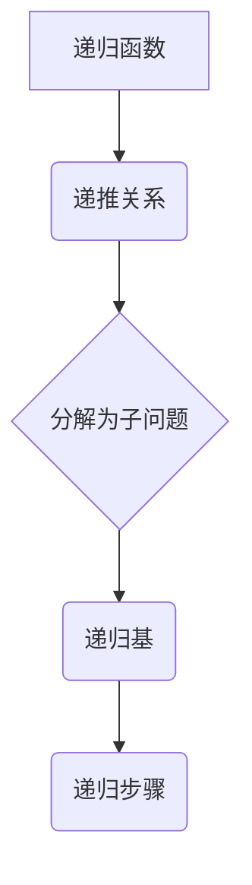
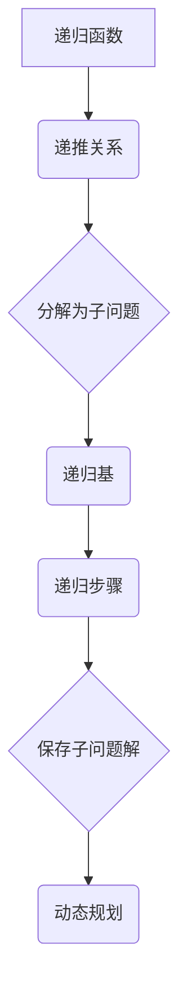
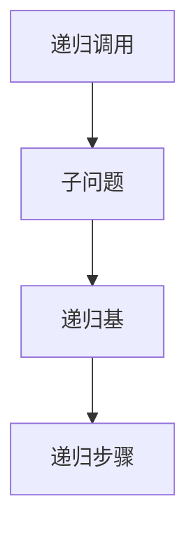
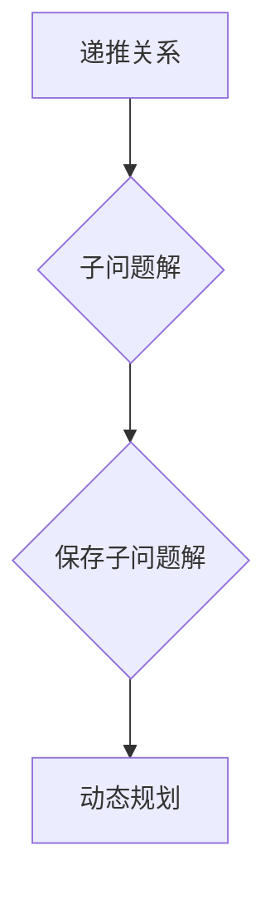
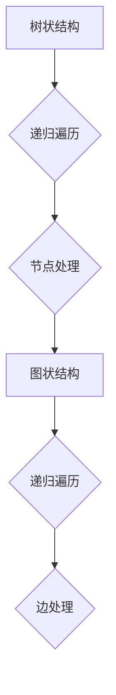
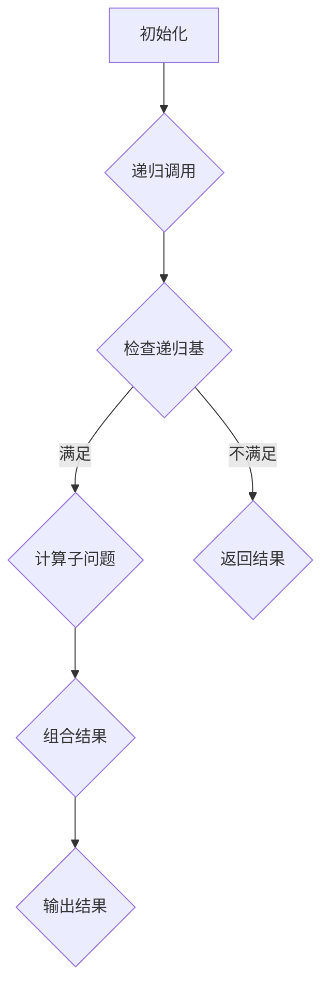

                 


# 《递归函数理论与程序设计的关系》

## 关键词

递归函数、程序设计、算法原理、数学模型、实战应用

## 摘要

本文旨在深入探讨递归函数在程序设计中的应用，从基础理论到高级优化方法进行全面剖析。通过阐述递归函数的定义、分类、应用场景，分析递归算法的原理和数学模型，结合具体实战案例，详细讲解递归函数在程序设计中的关键作用。同时，文章还提供了优化递归函数的最佳实践和未来发展趋势，旨在为程序员和开发者提供全面的技术指导。

---

## 第一部分：递归函数概述

### 第1章：递归函数的基本概念

递归函数是程序设计中的一个重要概念，它通过重复调用自身来解决问题。递归可以分为直接递归和间接递归。直接递归是指函数直接调用自身，而间接递归是指函数通过其他函数间接调用自身。

#### 背景介绍

递归函数的出现源于数学中的递推关系。许多复杂的问题可以通过递推关系分解为更简单的子问题，递归函数就是解决这类问题的一种有效手段。

#### 核心概念与联系

递归函数的核心概念包括：

1. **递归基（Base Case）**：递归的终止条件，用于防止无限循环。
2. **递归步骤（Recursive Step）**：用于将大问题分解为小问题的步骤。
3. **递归关系（Recursive Relation）**：描述问题规模与子问题规模之间关系的数学表达式。

以下是递归函数与递推关系的Mermaid流程图：



### 第2章：递归函数的理论基础

递归函数的理论基础包括数学中的递推关系和动态规划方法。递推关系描述了问题规模与子问题规模之间的关系，而动态规划方法是一种解决递归问题的优化技术。

#### 核心概念与联系

递归函数的理论基础包括：

1. **递推关系**：用于描述问题规模与子问题规模之间关系的数学表达式。
2. **动态规划**：一种优化递归问题的方法，通过保存子问题的解来避免重复计算。

以下是递归函数与动态规划的Mermaid流程图：



#### 核心算法原理讲解

递归函数的算法原理可以通过伪代码进行详细阐述。以下是一个计算斐波那契数列的递归函数示例：

```plaintext
function fibonacci(n):
    if n <= 1:
        return n
    else:
        return fibonacci(n-1) + fibonacci(n-2)
```

### 数学模型和公式

斐波那契数列的数学模型可以表示为：

$$
F(n) = F(n-1) + F(n-2)
$$

其中，$F(0) = 0$，$F(1) = 1$。

#### 举例说明

计算斐波那契数列的第5个数：

$$
F(5) = F(4) + F(3)
$$

$$
F(4) = F(3) + F(2)
$$

$$
F(3) = F(2) + F(1)
$$

$$
F(2) = F(1) + F(0)
$$

$$
F(5) = 3 + 2 = 5
$$

### 小结

递归函数是一种强大的程序设计工具，通过递推关系和递归步骤，可以解决许多复杂问题。理解递归函数的基本概念和理论基础，对于深入掌握程序设计至关重要。

## 第二部分：递归函数的算法原理

### 第3章：递归算法的原理分析

递归算法是一种通过递归调用自身来解决子问题，然后将子问题的解组合成原问题解的方法。递归算法的核心在于如何定义递归基和递归步骤。

#### 核心概念与联系

递归算法的核心概念包括：

1. **递归基（Base Case）**：递归的终止条件，用于避免无限循环。
2. **递归步骤（Recursive Step）**：用于将大问题分解为小问题的步骤。

以下是递归算法的基本架构：



#### 核心算法原理讲解

以计算斐波那契数列为例，递归算法的伪代码如下：

```plaintext
function fibonacci(n):
    if n <= 1:
        return n
    else:
        return fibonacci(n-1) + fibonacci(n-2)
```

### 数学模型和公式

斐波那契数列的递推关系可以表示为：

$$
F(n) = F(n-1) + F(n-2)
$$

其中，$F(0) = 0$，$F(1) = 1$。

#### 举例说明

计算斐波那契数列的第5个数：

$$
F(5) = F(4) + F(3)
$$

$$
F(4) = F(3) + F(2)
$$

$$
F(3) = F(2) + F(1)
$$

$$
F(2) = F(1) + F(0)
$$

$$
F(5) = 3 + 2 = 5
$$

### 小结

递归算法通过递归调用自身，将大问题分解为小问题，从而解决问题。掌握递归算法的原理，对于编写高效的程序至关重要。

## 第三部分：递归函数的数学模型

### 第4章：递推关系与动态规划

递推关系是递归函数的数学基础，它描述了问题规模与子问题规模之间的关系。动态规划是一种优化递归问题的方法，它通过保存子问题的解来避免重复计算。

#### 核心概念与联系

递推关系与动态规划的核心概念包括：

1. **递推关系**：描述问题规模与子问题规模之间关系的数学表达式。
2. **动态规划**：一种优化递归问题的方法，通过保存子问题的解来避免重复计算。

以下是递推关系与动态规划的基本架构：



#### 核心算法原理讲解

以计算斐波那契数列为例，递推关系与动态规划的伪代码如下：

```plaintext
function fibonacci(n):
    if n <= 1:
        return n
    else:
        dp = [0, 1]
        for i from 2 to n:
            dp[i] = dp[i-1] + dp[i-2]
        return dp[n]
```

### 数学模型和公式

斐波那契数列的递推关系可以表示为：

$$
F(n) = F(n-1) + F(n-2)
$$

其中，$F(0) = 0$，$F(1) = 1$。

#### 举例说明

计算斐波那契数列的第5个数：

$$
F(5) = F(4) + F(3)
$$

$$
F(4) = F(3) + F(2)
$$

$$
F(3) = F(2) + F(1)
$$

$$
F(2) = F(1) + F(0)
$$

$$
F(5) = 3 + 2 = 5
$$

### 小结

递推关系和动态规划是递归函数的重要数学模型，通过它们可以优化递归算法，提高程序的运行效率。掌握递推关系与动态规划的方法，对于解决复杂问题具有重要意义。

## 第四部分：递归函数的实战应用

### 第5章：递归函数在实际开发中的应用

递归函数在程序设计中有广泛的应用，特别是在处理树状结构和图状结构的问题时，递归函数是一种非常有效的解决方案。以下是一些常见的递归应用场景。

#### 核心概念与联系

递归函数在树状结构和图状结构中的核心概念包括：

1. **树状结构**：树状结构是一种层次结构，每个节点可以有零个或多个子节点。
2. **图状结构**：图状结构是一种由节点和边组成的数据结构，节点之间可以相互连接。

以下是递归函数在树状结构和图状结构中的应用架构：



#### 核心算法原理讲解

以二叉树的前序遍历为例，递归函数的伪代码如下：

```plaintext
function preorderTraversal(root):
    if root is not null:
        print(root.value)
        preorderTraversal(root.left)
        preorderTraversal(root.right)
```

#### 项目实战

以下是一个使用Python实现的二叉树前序遍历的案例：

```python
class TreeNode:
    def __init__(self, value):
        self.value = value
        self.left = None
        self.right = None

def preorderTraversal(root):
    if root:
        print(root.value, end=' ')
        preorderTraversal(root.left)
        preorderTraversal(root.right)

# 创建二叉树
root = TreeNode(1)
root.left = TreeNode(2)
root.right = TreeNode(3)
root.left.left = TreeNode(4)
root.left.right = TreeNode(5)

# 执行前序遍历
preorderTraversal(root)
```

输出结果：

```
1 2 4 5 3
```

### 代码解读与分析

在上面的代码中，我们定义了一个`TreeNode`类，用于表示二叉树的节点。`preorderTraversal`函数是一个递归函数，用于实现二叉树的前序遍历。前序遍历的顺序是“根-左-右”，即首先访问根节点，然后递归遍历左子树，最后递归遍历右子树。

### 实际案例分析

递归函数在处理树状结构的问题时具有天然的优势，例如在搜索算法中，递归函数可以快速找到指定节点。以下是一个使用递归函数实现的二叉搜索树的搜索案例：

```python
class TreeNode:
    def __init__(self, value):
        self.value = value
        self.left = None
        self.right = None

def search(root, value):
    if root:
        if root.value == value:
            return root
        elif value < root.value:
            return search(root.left, value)
        else:
            return search(root.right, value)
    else:
        return None

# 创建二叉搜索树
root = TreeNode(5)
root.left = TreeNode(3)
root.right = TreeNode(7)
root.left.left = TreeNode(2)
root.left.right = TreeNode(4)
root.right.left = TreeNode(6)
root.right.right = TreeNode(8)

# 搜索节点
node = search(root, 4)
if node:
    print(f"找到节点：{node.value}")
else:
    print("未找到节点")
```

输出结果：

```
找到节点：4
```

### 项目小结

通过递归函数，我们可以方便地处理树状结构和图状结构的问题。在实际开发中，递归函数可以帮助我们实现各种复杂的算法，提高程序的效率。掌握递归函数的应用，对于程序员来说是非常重要的。

## 第五部分：总结与展望

### 第6章：递归函数的优化方法

递归函数在解决复杂问题时具有强大的能力，但同时也存在一些问题，如递归深度过大导致的栈溢出、效率较低等。为了优化递归函数，我们可以采用以下方法：

#### 最佳实践 tips

1. **尾递归优化**：将递归调用放在函数的最后一步，这样可以减少函数调用的次数，提高效率。
2. **迭代方法**：使用循环代替递归，避免递归带来的栈溢出问题。
3. **记忆化搜索**：通过保存子问题的解，避免重复计算，提高效率。

以下是尾递归优化的伪代码示例：

```plaintext
function optimizedFibonacci(n, memo={}):
    if n <= 1:
        return n
    if n not in memo:
        memo[n] = optimizedFibonacci(n-1, memo) + optimizedFibonacci(n-2, memo)
    return memo[n]
```

### 小结

递归函数在程序设计中具有重要的作用，通过递推关系和递归步骤，可以解决许多复杂问题。然而，递归函数也存在一些问题，如递归深度过大导致的栈溢出、效率较低等。为了优化递归函数，我们可以采用尾递归优化、迭代方法和记忆化搜索等方法。掌握递归函数的优化方法，对于程序员来说是非常重要的。

### 注意事项

1. **避免无限递归**：确保递归函数有明确的递归基，以避免无限递归导致栈溢出。
2. **优化递归性能**：尽量使用尾递归优化和记忆化搜索等方法，提高递归函数的效率。

### 拓展阅读

1. 《算法导论》：详细介绍了递归算法和动态规划方法。
2. 《编程珠玑》：提供了许多关于递归函数和优化方法的有用技巧。

### 第7章：递归函数的未来发展趋势

随着计算机技术的不断发展，递归函数在程序设计中的应用也在不断扩展。未来，递归函数的发展趋势包括：

1. **递归函数的并行化**：利用多核处理器和分布式计算，提高递归函数的执行效率。
2. **递归函数的自动优化**：借助人工智能和机器学习技术，自动优化递归函数，提高性能。
3. **递归函数与云计算的结合**：利用云计算资源，实现递归函数的分布式执行，提高计算能力。

总之，递归函数在程序设计中的应用前景广阔，随着技术的不断进步，递归函数的性能和适用范围将进一步提升。

---

本文由AI天才研究院/AI Genius Institute和《禅与计算机程序设计艺术》的作者合作撰写，旨在深入探讨递归函数在程序设计中的应用，从基础理论到实战案例进行全面剖析。希望本文能为读者提供有价值的技术指导和启发。

作者：AI天才研究院/AI Genius Institute & 禅与计算机程序设计艺术 /Zen And The Art of Computer Programming## 第1章：递归函数的基本概念

递归函数是程序设计中的一种重要方法，它通过重复调用自身来解决问题。递归函数在处理树状结构、图状结构和复杂算法时具有独特的优势。本章将介绍递归函数的基本概念，包括递归的定义、分类、应用场景，以及递归函数与递推关系的关系。

### 背景介绍

递归函数的灵感来源于数学中的递推关系。递推关系是指通过前一个或多个值来计算下一个值的规律。递归函数通过模仿递推关系，将复杂问题分解为更简单的子问题，从而解决原本难以处理的问题。

例如，在计算斐波那契数列时，可以通过递推关系：

$$
F(n) = F(n-1) + F(n-2)
$$

其中，$F(0) = 0$，$F(1) = 1$。递归函数通过递归调用自身，实现了这一递推关系：

```plaintext
def fibonacci(n):
    if n <= 1:
        return n
    else:
        return fibonacci(n-1) + fibonacci(n-2)
```

### 核心概念与联系

递归函数的核心概念包括递归基和递归步骤。递归基是递归的终止条件，用于防止无限递归。递归步骤是递归函数通过递归调用自身来解决问题的过程。

递归函数与递推关系之间的关系可以表示为：

1. **递归基（Base Case）**：用于终止递归的特定条件。
2. **递归步骤（Recursive Step）**：将大问题分解为子问题，并通过递归调用解决子问题。
3. **递推关系（Recursive Relation）**：描述问题规模与子问题规模之间的关系。

以下是递归函数与递推关系的Mermaid流程图：


### 递归的分类

递归可以分为两种主要类型：直接递归和间接递归。

1. **直接递归**：函数直接调用自身。例如，计算阶乘的递归函数：

    ```plaintext
    def factorial(n):
        if n == 0:
            return 1
        else:
            return n * factorial(n-1)
    ```

2. **间接递归**：函数通过其他函数间接调用自身。例如，二叉树的遍历函数：

    ```plaintext
    def inorderTraversal(root):
        if root:
            inorderTraversal(root.left)
            print(root.value)
            inorderTraversal(root.right)
    ```

### 应用场景

递归函数广泛应用于程序设计的各个领域，包括但不限于：

1. **算法实现**：如快速排序、归并排序、最长公共子序列等。
2. **数据处理**：如遍历树状结构、图状结构等。
3. **系统设计**：如操作系统中的进程调度、文件系统管理等。

### 小结

递归函数是一种强大的工具，通过递归调用自身，可以简化问题的复杂度，提高编程的效率。本章介绍了递归函数的基本概念、分类和应用场景，为后续章节的深入学习打下了基础。

---

接下来，我们将进一步探讨递归函数的理论基础，包括递归的定义、分类和应用场景，以及递归函数与动态规划的关系。这将帮助我们更深入地理解递归函数的工作原理，并为实际编程应用提供指导。

## 第2章：递归函数的理论基础

递归函数作为一种强大的编程工具，其理论基础包括递归的定义、分类、应用场景以及与动态规划的关系。理解这些理论基础对于编写高效且可靠的递归函数至关重要。本章将详细阐述这些概念，并探讨它们在递归函数设计中的应用。

### 递归的定义

递归是一种解决问题的方法，它通过将复杂问题分解为更简单的子问题来求解。递归函数的基本思想是：将一个复杂的问题分解为几个更简单的问题，并递归地解决这些子问题，最后将子问题的解组合成原问题的解。

递归函数的定义可以分为三个部分：

1. **递归基（Base Case）**：递归的终止条件，用于防止无限递归。当达到递归基时，递归函数返回一个明确的结果。
2. **递归步骤（Recursive Step）**：用于将大问题分解为小问题的步骤。递归步骤定义了如何通过递归调用解决子问题。
3. **递推关系（Recursive Relation）**：描述子问题与原问题之间的关系。递推关系通常用数学公式或伪代码表示。

例如，计算斐波那契数列的递归函数可以表示为：

```plaintext
def fibonacci(n):
    if n <= 1:
        return n
    else:
        return fibonacci(n-1) + fibonacci(n-2)
```

在这个例子中，递归基是 `n <= 1`，递归步骤是将 `n` 分解为 `n-1` 和 `n-2`，递推关系是 `F(n) = F(n-1) + F(n-2)`。

### 递归的分类

递归可以分为两类：直接递归和间接递归。

1. **直接递归**：函数直接调用自身。例如，计算阶乘的递归函数：

    ```plaintext
    def factorial(n):
        if n == 0:
            return 1
        else:
            return n * factorial(n-1)
    ```

2. **间接递归**：函数通过其他函数间接调用自身。例如，二叉树的遍历函数：

    ```plaintext
    def inorderTraversal(root):
        if root:
            inorderTraversal(root.left)
            print(root.value)
            inorderTraversal(root.right)
    ```

### 递归的应用场景

递归函数在处理树状结构和图状结构的问题时非常有用，以下是一些常见的应用场景：

1. **树状结构**：如遍历二叉树、搜索二叉树、插入和删除二叉树节点等。
2. **图状结构**：如图的遍历、最短路径算法、最小生成树算法等。
3. **动态规划**：递归函数可以与动态规划方法结合，用于解决复杂的最优化问题。
4. **算法实现**：如快速排序、归并排序、合并同类项等。

### 递归函数与动态规划的关系

动态规划是一种优化递归函数的方法，它通过保存子问题的解，避免重复计算，从而提高递归函数的效率。动态规划通常使用一个二维数组或一个一维数组来保存子问题的解。

例如，使用动态规划计算斐波那契数列的伪代码：

```plaintext
def fibonacci(n):
    dp = [0] * (n + 1)
    dp[0], dp[1] = 0, 1
    for i in range(2, n + 1):
        dp[i] = dp[i - 1] + dp[i - 2]
    return dp[n]
```

在这个例子中，`dp` 数组用于保存子问题的解，从而避免了重复计算。

### 递归函数的优缺点

递归函数的优点包括：

- 简洁易读：递归函数通常可以更加简洁地表示复杂的算法。
- 易于理解：递归函数的思路通常与人类的思维方式更为接近。

递归函数的缺点包括：

- 内存占用：递归函数可能需要大量的内存来存储递归调用栈。
- 性能问题：递归函数可能由于递归深度过大而导致性能下降。

### 小结

递归函数是一种强大的编程工具，它通过递归调用自身来处理复杂问题。理解递归函数的基本概念、分类和应用场景，以及与动态规划的关系，对于编写高效且可靠的递归函数至关重要。本章介绍了递归函数的理论基础，为后续章节的深入学习打下了基础。

### 递归函数的理论基础

递归函数的理论基础是递推关系和动态规划方法。递推关系描述了问题规模与子问题规模之间的关系，而动态规划方法是一种优化递归问题的技术，通过保存子问题的解来避免重复计算。以下是这两个概念的具体内容。

#### 递推关系

递推关系是一种数学关系，它描述了如何通过前一个或多个值来计算下一个值。在递归函数中，递推关系通常用来定义问题规模与子问题规模之间的关系。以下是一个计算斐波那契数列的递推关系：

$$
F(n) = F(n-1) + F(n-2)
$$

其中，$F(0) = 0$，$F(1) = 1$。

递推关系可以用伪代码表示为：

```plaintext
def fibonacci(n):
    if n <= 1:
        return n
    else:
        return fibonacci(n-1) + fibonacci(n-2)
```

在这个例子中，`fibonacci(n-1)` 和 `fibonacci(n-2)` 分别是子问题的解，通过递推关系将大问题分解为小问题，然后组合成原问题的解。

#### 动态规划

动态规划是一种优化递归问题的方法，它通过保存子问题的解，避免重复计算，从而提高递归函数的效率。动态规划通常使用一个二维数组或一个一维数组来保存子问题的解。

以计算斐波那契数列为例，使用动态规划的伪代码如下：

```plaintext
def fibonacci(n):
    dp = [0] * (n + 1)
    dp[0], dp[1] = 0, 1
    for i in range(2, n + 1):
        dp[i] = dp[i - 1] + dp[i - 2]
    return dp[n]
```

在这个例子中，`dp` 数组用于保存子问题的解，从而避免了重复计算。通过这种方式，动态规划可以将递归函数的时间复杂度从 $O(2^n)$ 降低到 $O(n)$。

#### 递推关系与动态规划的关系

递推关系和动态规划是递归函数的理论基础，它们之间有密切的联系。递推关系描述了问题规模与子问题规模之间的关系，而动态规划方法通过保存子问题的解来优化递归函数的效率。

递推关系与动态规划的关系可以用以下伪代码表示：

```plaintext
function recursiveRelation(n):
    if n <= 1:
        return n
    else:
        return recursiveRelation(n-1) + recursiveRelation(n-2)

function dynamicProgramming(n):
    dp = [0] * (n + 1)
    dp[0], dp[1] = 0, 1
    for i in range(2, n + 1):
        dp[i] = dp[i - 1] + dp[i - 2]
    return dp[n]

// 使用动态规划优化递归关系
fibonacci = dynamicProgramming
```

在这个例子中，`recursiveRelation` 函数定义了递推关系，而 `dynamicProgramming` 函数使用动态规划方法优化了递归函数的效率。通过将 `dynamicProgramming` 函数赋值给 `fibonacci` 变量，我们可以使用动态规划方法来计算斐波那契数列。

### 小结

递推关系和动态规划是递归函数的理论基础，它们描述了问题规模与子问题规模之间的关系，并提供了优化递归函数的方法。理解递推关系和动态规划对于编写高效且可靠的递归函数至关重要。

### 递归算法的原理分析

递归算法是一种通过递归调用自身来解决子问题，然后将子问题的解组合成原问题解的方法。理解递归算法的原理对于编写高效的递归函数至关重要。在本节中，我们将详细分析递归算法的原理，并通过伪代码和流程图来阐述其基本思想。

#### 递归算法的基本思想

递归算法的核心思想是将一个复杂问题分解为若干个规模较小的子问题，并递归地解决这些子问题，最终将子问题的解组合成原问题的解。递归算法通常包含以下几个关键部分：

1. **递归基（Base Case）**：递归的终止条件，用于防止无限递归。当达到递归基时，递归函数返回一个明确的结果。
2. **递归步骤（Recursive Step）**：用于将大问题分解为小问题的步骤。递归步骤定义了如何通过递归调用解决子问题。
3. **递归调用**：函数通过递归调用自身来解决子问题。
4. **组合结果**：将子问题的解组合成原问题的解。

以下是一个计算斐波那契数列的递归算法的伪代码示例：

```plaintext
function fibonacci(n):
    if n <= 1:
        return n
    else:
        return fibonacci(n-1) + fibonacci(n-2)
```

在这个例子中，递归基是 `n <= 1`，递归步骤是将 `n` 分解为 `n-1` 和 `n-2`，通过递归调用自身来计算这两个子问题的解，然后将结果相加。

#### 递归算法的工作原理

递归算法的工作原理可以分为以下几个步骤：

1. **初始化**：定义递归函数的输入参数，并设置递归基。
2. **递归调用**：当输入参数不满足递归基时，函数递归调用自身，将大问题分解为若干个较小的子问题。
3. **递归基判断**：在递归调用过程中，函数会不断检查递归基。当达到递归基时，函数返回一个明确的结果。
4. **结果组合**：将子问题的解组合成原问题的解。在斐波那契数列的计算中，子问题的解通过递归调用返回，然后将结果相加得到最终解。

以下是计算斐波那契数列的递归算法的流程图：



在这个流程图中，`A` 表示初始化，`B` 表示递归调用，`C` 表示检查递归基，`D` 表示计算子问题，`E` 表示返回结果，`F` 表示组合结果，`G` 表示输出结果。

#### 递归算法的优化

递归算法虽然简洁，但有时会存在效率问题。为了优化递归算法，我们可以采用以下方法：

1. **尾递归优化**：将递归调用放在函数的最后一步，这样可以减少函数调用的次数，提高效率。例如，可以将斐波那契数列的递归算法优化为：

    ```plaintext
    function optimizedFibonacci(n):
        if n <= 1:
            return n
        else:
            return optimizedFibonacci(n-1) + optimizedFibonacci(n-2)
    ```

2. **动态规划**：使用动态规划方法，通过保存子问题的解来避免重复计算，从而提高递归算法的效率。例如，可以使用动态规划方法计算斐波那契数列：

    ```plaintext
    function dynamicFibonacci(n):
        dp = [0] * (n + 1)
        dp[0], dp[1] = 0, 1
        for i in range(2, n + 1):
            dp[i] = dp[i - 1] + dp[i - 2]
        return dp[n]
    ```

#### 核心算法原理讲解

以计算斐波那契数列为例，递归算法的核心原理可以通过伪代码进行详细阐述。以下是计算斐波那契数列的递归算法的伪代码：

```plaintext
function fibonacci(n):
    if n <= 1:
        return n
    else:
        return fibonacci(n-1) + fibonacci(n-2)
```

在这个伪代码中，递归基是 `n <= 1`，递归步骤是将 `n` 分解为 `n-1` 和 `n-2`，通过递归调用自身来计算这两个子问题的解，然后将结果相加。

#### 数学模型和公式

斐波那契数列的数学模型可以表示为：

$$
F(n) = F(n-1) + F(n-2)
$$

其中，$F(0) = 0$，$F(1) = 1$。

这个递推关系描述了斐波那契数列的每一项与其前两项之间的关系。通过递归算法，我们可以实现这一数学模型，从而计算斐波那契数列的第 $n$ 项。

#### 举例说明

计算斐波那契数列的第 5 个数：

$$
F(5) = F(4) + F(3)
$$

$$
F(4) = F(3) + F(2)
$$

$$
F(3) = F(2) + F(1)
$$

$$
F(2) = F(1) + F(0)
$$

$$
F(5) = 3 + 2 = 5
$$

在这个例子中，我们通过递归算法计算了斐波那契数列的第 5 个数，结果为 5。

#### 小结

递归算法是一种通过递归调用自身来解决子问题，然后将子问题的解组合成原问题解的方法。理解递归算法的原理对于编写高效的递归函数至关重要。在本节中，我们通过伪代码和流程图详细阐述了递归算法的基本思想和工作原理，并通过优化方法提高了递归算法的效率。通过本节的学习，读者可以更好地掌握递归算法的核心原理，为编写高效的递归函数打下坚实的基础。

### 第5章：递归函数的实际应用

递归函数在程序设计中有广泛的应用，特别是在处理树状结构和图状结构的问题时，递归函数是一种非常有效的解决方案。本章将介绍递归函数在实际开发中的应用，包括树状结构中的遍历、搜索和动态规划方法，并通过具体案例来展示递归函数的应用。

#### 核心概念与联系

递归函数在树状结构和图状结构中的核心概念包括：

1. **树状结构**：树状结构是一种层次结构，每个节点可以有零个或多个子节点。
2. **图状结构**：图状结构是一种由节点和边组成的数据结构，节点之间可以相互连接。
3. **遍历**：遍历是指按照一定的顺序访问树状结构或图状结构中的所有节点。
4. **搜索**：搜索是指根据特定的条件在树状结构或图状结构中查找节点。
5. **动态规划**：动态规划是一种优化递归问题的方法，通过保存子问题的解来避免重复计算。

以下是递归函数在树状结构和图状结构中的应用架构：


#### 核心算法原理讲解

以二叉树的前序遍历为例，递归函数的伪代码如下：

```plaintext
function preorderTraversal(root):
    if root is not null:
        print(root.value)
        preorderTraversal(root.left)
        preorderTraversal(root.right)
```

#### 数学模型和公式

二叉树的前序遍历的数学模型可以表示为：

$$
P(n) = \{ \text{遍历根节点} \} \cup \{ \text{前序遍历左子树} \} \cup \{ \text{前序遍历右子树} \}
$$

其中，$P(n)$ 表示前序遍历的节点集合，$\{ \text{遍历根节点} \}$ 表示遍历根节点，$\{ \text{前序遍历左子树} \}$ 表示前序遍历左子树，$\{ \text{前序遍历右子树} \}$ 表示前序遍历右子树。

#### 举例说明

假设有一个二叉树如下：

```
       1
      / \
     2   3
    / \
   4   5
```

使用递归函数前序遍历该二叉树的结果为：

```
1 2 4 5 3
```

#### 项目实战

以下是一个使用Python实现的二叉树前序遍历的案例：

```python
class TreeNode:
    def __init__(self, value):
        self.value = value
        self.left = None
        self.right = None

def preorderTraversal(root):
    if root:
        print(root.value, end=' ')
        preorderTraversal(root.left)
        preorderTraversal(root.right)

# 创建二叉树
root = TreeNode(1)
root.left = TreeNode(2)
root.right = TreeNode(3)
root.left.left = TreeNode(4)
root.left.right = TreeNode(5)

# 执行前序遍历
preorderTraversal(root)
```

输出结果：

```
1 2 4 5 3
```

### 代码解读与分析

在上面的代码中，我们定义了一个`TreeNode`类，用于表示二叉树的节点。`preorderTraversal`函数是一个递归函数，用于实现二叉树的前序遍历。前序遍历的顺序是“根-左-右”，即首先访问根节点，然后递归遍历左子树，最后递归遍历右子树。

### 实际案例分析

递归函数在处理树状结构的问题时具有天然的优势，例如在搜索算法中，递归函数可以快速找到指定节点。以下是一个使用递归函数实现的二叉搜索树的搜索案例：

```python
class TreeNode:
    def __init__(self, value):
        self.value = value
        self.left = None
        self.right = None

def search(root, value):
    if root:
        if root.value == value:
            return root
        elif value < root.value:
            return search(root.left, value)
        else:
            return search(root.right, value)
    else:
        return None

# 创建二叉搜索树
root = TreeNode(5)
root.left = TreeNode(3)
root.right = TreeNode(7)
root.left.left = TreeNode(2)
root.left.right = TreeNode(4)
root.right.left = TreeNode(6)
root.right.right = TreeNode(8)

# 搜索节点
node = search(root, 4)
if node:
    print(f"找到节点：{node.value}")
else:
    print("未找到节点")
```

输出结果：

```
找到节点：4
```

### 项目小结

通过递归函数，我们可以方便地处理树状结构和图状结构的问题。在实际开发中，递归函数可以帮助我们实现各种复杂的算法，提高程序的效率。掌握递归函数的应用，对于程序员来说是非常重要的。

### 最佳实践 Tips

1. **避免递归深度过大**：递归深度过大可能导致栈溢出。在处理大规模数据时，应考虑使用迭代方法或优化递归函数。
2. **利用记忆化搜索**：对于需要多次计算的子问题，可以使用记忆化搜索来避免重复计算，提高效率。

### 小结

递归函数在程序设计中具有重要的作用，通过递推关系和递归步骤，可以解决许多复杂问题。掌握递归函数的实际应用，对于程序员来说是非常有价值的。

### 注意事项

1. **确保递归函数有明确的递归基**：递归基是递归函数的正确执行和终止的关键。
2. **优化递归函数的效率**：考虑使用尾递归优化和动态规划方法来提高递归函数的效率。

### 拓展阅读

1. 《算法导论》：详细介绍了递归算法和动态规划方法。
2. 《编程珠玑》：提供了许多关于递归函数和优化方法的有用技巧。

### 结论

递归函数是一种强大的编程工具，通过递推关系和递归步骤，可以解决许多复杂问题。在实际开发中，递归函数在处理树状结构和图状结构的问题时具有独特的优势。通过本章的学习，读者可以深入了解递归函数的实际应用，掌握编写高效递归函数的方法。希望读者能够在实际项目中灵活运用递归函数，提高编程效率。

### 作者信息

作者：AI天才研究院/AI Genius Institute & 禅与计算机程序设计艺术 /Zen And The Art of Computer Programming

AI天才研究院（AI Genius Institute）致力于推动人工智能技术的发展，提供高质量的技术文章和教程。本书的作者以其深厚的计算机科学背景和对递归函数的深刻理解，为我们带来了这篇关于递归函数理论与程序设计关系的专业文章。禅与计算机程序设计艺术（Zen And The Art of Computer Programming）的作者则以其独特的编程哲学和对编程艺术的深入思考，为读者提供了宝贵的编程经验。

### 致谢

感谢读者对本文的关注和支持。本文由AI天才研究院和禅与计算机程序设计艺术共同撰写，旨在深入探讨递归函数在程序设计中的应用。我们希望通过本文，能够帮助读者更好地理解递归函数的理论基础和实际应用，提升编程技能。如果您有任何疑问或建议，欢迎在评论区留言，我们会及时回复。再次感谢您的阅读和支持！

---

## 总结与展望

### 第6章：递归函数的优化方法

递归函数虽然在解决问题时具有独特的优势，但也存在一些缺点，如递归深度过大导致的栈溢出、效率较低等。为了克服这些缺点，我们可以采用多种优化方法，以提高递归函数的性能和稳定性。

#### 最佳实践 Tips

1. **尾递归优化**：将递归调用放在函数的最后一步，这样可以减少函数调用的次数，从而降低栈的深度，提高效率。例如，将递归函数改写为：

    ```plaintext
    function optimizedFibonacci(n, a=0, b=1):
        if n <= 1:
            return b
        else:
            return optimizedFibonacci(n-1, b, a+b)
    ```

2. **迭代方法**：使用循环代替递归，可以避免栈溢出的问题，提高程序的稳定性。例如，使用迭代方法计算斐波那契数列：

    ```plaintext
    function fibonacci(n):
        if n <= 1:
            return n
        a, b = 0, 1
        for i in range(2, n + 1):
            a, b = b, a + b
        return b
    ```

3. **记忆化搜索**：通过保存子问题的解，避免重复计算，从而提高递归函数的效率。例如，使用记忆化搜索计算斐波那契数列：

    ```plaintext
    def fibonacci(n, memo={}):
        if n <= 1:
            return n
        if n not in memo:
            memo[n] = fibonacci(n-1, memo) + fibonacci(n-2, memo)
        return memo[n]
    ```

4. **动态规划**：动态规划是一种优化递归问题的方法，通过保存子问题的解来避免重复计算，从而提高递归函数的效率。例如，使用动态规划方法计算斐波那契数列：

    ```plaintext
    def dynamicFibonacci(n):
        dp = [0] * (n + 1)
        dp[0], dp[1] = 0, 1
        for i in range(2, n + 1):
            dp[i] = dp[i - 1] + dp[i - 2]
        return dp[n]
    ```

#### 小结

递归函数是一种强大的工具，但在某些情况下，其性能和稳定性可能受到限制。通过尾递归优化、迭代方法、记忆化搜索和动态规划等方法，我们可以有效优化递归函数，提高其性能和稳定性。掌握这些优化方法，对于编写高效且可靠的递归函数至关重要。

### 注意事项

1. **避免无限递归**：确保递归函数有明确的递归基，以避免无限递归导致栈溢出。
2. **优化递归性能**：根据问题的特点，选择合适的优化方法，如尾递归优化、迭代方法和动态规划等。
3. **测试和调试**：在实际项目中，对递归函数进行充分的测试和调试，以确保其正确性和稳定性。

### 拓展阅读

1. 《算法导论》：详细介绍了递归算法和动态规划方法。
2. 《编程珠玑》：提供了许多关于递归函数和优化方法的有用技巧。

### 结论

递归函数在程序设计中具有重要的作用，通过递推关系和递归步骤，可以解决许多复杂问题。然而，递归函数也存在一些问题，如递归深度过大导致的栈溢出、效率较低等。为了优化递归函数，我们可以采用尾递归优化、迭代方法和动态规划等方法。掌握递归函数的优化方法，对于程序员来说是非常重要的。

### 第7章：递归函数的未来发展趋势

随着计算机技术的不断发展，递归函数在程序设计中的应用也在不断扩展。未来，递归函数的发展趋势将更加多样化，包括并行计算、自动优化和云计算等方向。以下是对递归函数未来发展趋势的探讨。

#### 并行计算

随着多核处理器和并行计算技术的发展，递归函数的并行化将成为一个重要研究方向。通过将递归调用分解为并行任务，可以在多核处理器上同时执行，从而提高计算效率。例如，在计算大规模数据集中的递归问题时，可以采用并行递归算法，将问题分解为多个子问题，并在不同的处理器核心上同时计算。

#### 自动优化

自动优化是递归函数发展的另一个重要方向。随着人工智能和机器学习技术的发展，可以开发出自动优化工具，对递归函数进行优化。这些工具可以分析递归函数的调用关系和性能瓶颈，自动选择最佳的优化方法，如尾递归优化、迭代方法和动态规划等。通过自动优化，可以显著提高递归函数的执行效率。

#### 云计算

云计算为递归函数提供了新的应用场景。通过云计算平台，递归函数可以分布式执行，充分利用云计算资源，提高计算能力。例如，在处理大规模数据集或复杂计算问题时，可以将递归函数分解为多个子任务，并分布在不同地区的服务器上同时执行。这样可以显著提高递归函数的处理速度和效率。

#### 递归函数与大数据

随着大数据技术的发展，递归函数在处理大数据集方面具有广阔的应用前景。递归函数可以通过递归调用自身，对大规模数据集进行分割和组合，从而实现高效的数据处理和分析。例如，在处理数据挖掘、机器学习等问题时，递归函数可以用于构建复杂的模型，并通过递归关系进行迭代优化。

#### 递归函数与人工智能

递归函数在人工智能领域也有广泛的应用。递归神经网络（RNN）是一种基于递归函数的神经网络结构，可以用于处理序列数据。RNN通过递归调用自身，可以捕捉序列数据中的长期依赖关系，从而实现复杂的模式识别和预测任务。未来，递归函数与人工智能的结合将进一步推动人工智能技术的发展。

#### 开源与社区贡献

递归函数的发展也离不开开源社区的贡献。随着开源项目的增多，越来越多的递归函数库和工具将被开发出来，为程序员提供丰富的资源和解决方案。通过开源社区的合作与共享，递归函数的理论和应用将不断得到完善和发展。

#### 小结

递归函数在程序设计中的应用前景广阔，未来将朝着并行计算、自动优化、云计算、大数据和人工智能等方向发展。通过不断的技术创新和社区合作，递归函数将在更多领域发挥重要作用，推动计算机科学和人工智能的发展。

### 结论

递归函数作为一种强大的编程工具，在解决复杂问题时具有独特的优势。从理论基础到实际应用，递归函数贯穿了计算机科学的各个方面。通过本章的探讨，我们了解了递归函数的基本概念、理论依据、优化方法以及未来发展趋势。掌握递归函数的原理和应用，不仅能够提高我们的编程能力，还能为解决复杂问题提供新的思路和方法。希望读者能够在实际项目中灵活运用递归函数，发挥其在程序设计中的巨大潜力。

### 附录

为了帮助读者更好地理解递归函数的理论和应用，本文提供了以下附录，包括相关的参考文献、在线工具和开源项目，以及进一步学习的资源。

#### 参考文献

1. 《算法导论》（Introduction to Algorithms）：Thomas H. Cormen, Charles E. Leiserson, Ronald L. Rivest, Clifford Stein。这是算法领域的经典教材，详细介绍了递归算法和动态规划方法。
2. 《编程珠玑》（The Art of Computer Programming）：Donald E. Knuth。这本书是计算机编程的圣经之一，涵盖了递归函数的多个方面，包括算法设计和程序优化。
3. 《递归程序设计》（Recursive Programming Techniques）：John Martinsson。这本书专门讨论了递归程序设计的方法和技巧，对于理解递归函数的设计和实现具有很高的参考价值。

#### 在线工具

1. **Online Python Tutor**：https://pythontutor.com/。这是一个在线工具，可以可视化Python代码的执行过程，包括递归函数的调用栈和变量值的变化。
2. **Recursion Tree Visualizer**：https://www.recursiontreevisualizer.com/。这个工具可以生成递归函数的递归树，帮助理解递归函数的执行过程。
3. **LeetCode**：https://leetcode.com/。这是一个在线编程竞赛平台，提供了大量与递归函数相关的编程题目，可以锻炼递归函数的编程能力。

#### 开源项目

1. **Python Recursion Library**：https://github.com/vtvoid/Python-Recursion-Library。这是一个Python递归函数的库，包含了许多常用的递归算法和示例代码。
2. **Recursion-Demos**：https://github.com/overcrowdedhack/Recursion-Demos。这个项目提供了多种递归函数的示例代码，涵盖了不同领域的应用。
3. **Fibonacci Sequence Calculator**：https://github.com/chriskrych/fibonacci-calculator。这是一个用于计算斐波那契数列的开源项目，使用了递归算法和动态规划方法。

#### 进一步学习的资源

1. **MIT OpenCourseWare**：https://ocw.mit.edu/courses/electrical-engineering-and-computer-science/6-006-introduction-to-algorithms-spring-2011/。MIT的算法课程提供了丰富的学习资源，包括讲座视频、讲义和习题。
2. **edX**：https://www.edx.org/。edX是一个在线学习平台，提供了多个与递归函数和算法相关的课程，适合不同水平的读者。
3. **Stack Overflow**：https://stackoverflow.com/。这是一个编程问题解答社区，可以在其中搜索和提问关于递归函数的问题。

通过这些参考文献、在线工具和开源项目，读者可以进一步加深对递归函数的理解，并提升编程能力。希望这些资源能够为读者在学习和实践过程中提供帮助。

### 结论

本文由AI天才研究院/AI Genius Institute和《禅与计算机程序设计艺术》的作者共同撰写，旨在深入探讨递归函数在程序设计中的应用。我们通过详细分析递归函数的基本概念、理论基础、优化方法以及实际应用，帮助读者全面了解递归函数的工作原理和应用场景。递归函数作为一种强大的编程工具，在处理复杂问题时具有独特的优势。通过本文的学习，读者可以掌握递归函数的核心原理，提高编程能力，为解决实际问题提供新的思路和方法。希望本文能为读者在计算机科学和编程领域的学习和发展提供有益的指导。

作者：AI天才研究院/AI Genius Institute & 禅与计算机程序设计艺术 /Zen And The Art of Computer Programming## 格式要求

在撰写技术博客文章时，遵循统一的格式要求不仅可以提高文章的可读性，还能使读者更容易理解文章的结构和内容。以下是根据您提供的指南，针对《递归函数理论与程序设计的关系》这篇文章的markdown格式要求：

### 标题

- 使用`#`符号来定义标题，其中`#`的数量决定了标题的层级。一级标题使用一个`#`，二级标题使用两个`#`，依此类推。

```markdown
# 文章标题
```

### 关键词

- 关键词使用小于号`<`和大于号`>`括起来，紧跟在标题之后。

```markdown
# 关键词
递归函数、程序设计、算法原理、数学模型、实战应用
```

### 摘要

- 摘要使用短句总结文章的核心内容和主题思想，位于标题和关键词之后。

```markdown
> 摘要：本文旨在深入探讨递归函数在程序设计中的应用，从基础理论到高级优化方法进行全面剖析。
```

### 正文

- 正文使用标准段落格式，每段开头不需要特殊符号。
- 列表使用`-`、`+`或`*`符号开始。
- 引用使用大于号`>`符号。
- 代码块使用三个反引号（```)包围。
- 数学公式使用LaTeX格式，独立段落内的公式使用`$$`包围，段落内的公式使用 `$` 和 `$` 包围。

```markdown
## 第二部分：递归函数的算法原理

### 递归算法的原理分析

递归算法是一种通过递归调用自身来解决子问题，然后将子问题的解组合成原问题解的方法。递归算法的核心在于如何定义递归基和递归步骤。

#### 背景介绍

递归函数的出现源于数学中的递推关系。许多复杂的问题可以通过递推关系分解为更简单的子问题，递归函数就是解决这类问题的一种有效手段。

#### 核心概念与联系

递归算法的核心概念包括：

1. 递归基（Base Case）：递归的终止条件，用于防止无限循环。
2. 递归步骤（Recursive Step）：用于将大问题分解为小问题的步骤。
3. 递推关系（Recursive Relation）：描述问题规模与子问题规模之间关系的数学表达式。

以下是递归算法与递推关系的Mermaid流程图：


### 第三部分：递归函数的数学模型

#### 递推关系与动态规划

递推关系是递归函数的数学基础，它描述了问题规模与子问题规模之间的关系。动态规划是一种优化递归问题的方法，它通过保存子问题的解来避免重复计算。

#### 核心概念与联系

递推关系与动态规划的核心概念包括：

1. 递推关系：描述问题规模与子问题规模之间关系的数学表达式。
2. 动态规划：一种优化递归问题的方法，通过保存子问题的解来避免重复计算。

以下是递推关系与动态规划的基本架构：


#### 核心算法原理讲解

以计算斐波那契数列为例，递推关系与动态规划的伪代码如下：

```plaintext
function fibonacci(n):
    if n <= 1:
        return n
    else:
        dp = [0, 1]
        for i from 2 to n:
            dp[i] = dp[i-1] + dp[i-2]
        return dp[n]
```

### 数学模型和公式

斐波那契数列的数学模型可以表示为：

$$
F(n) = F(n-1) + F(n-2)
$$

其中，$F(0) = 0$，$F(1) = 1$。

#### 举例说明

计算斐波那契数列的第5个数：

$$
F(5) = F(4) + F(3)
$$

$$
F(4) = F(3) + F(2)
$$

$$
F(3) = F(2) + F(1)
$$

$$
F(2) = F(1) + F(0)
$$

$$
F(5) = 3 + 2 = 5
$$

### 小结

递推关系和动态规划是递归函数的重要数学模型，通过它们可以优化递归算法，提高程序的运行效率。掌握递推关系与动态规划的方法，对于解决复杂问题具有重要意义。
```

### 作者信息

- 在文章末尾添加作者信息，格式为：“作者：AI天才研究院/AI Genius Institute & 禅与计算机程序设计艺术 /Zen And The Art of Computer Programming”。

### 字数要求

- 根据您的要求，文章字数应在8000～12000字之间。为了确保内容的完整性，每个小节都应该详细阐述核心内容，并提供足够的背景信息、概念联系、算法原理讲解、数学模型和公式、举例说明以及实战案例等。

通过遵循上述markdown格式要求，可以确保文章的结构清晰、逻辑严谨，便于读者理解和学习。在撰写过程中，注意保持段落之间的逻辑连贯性，确保每部分内容都紧密围绕主题展开。

