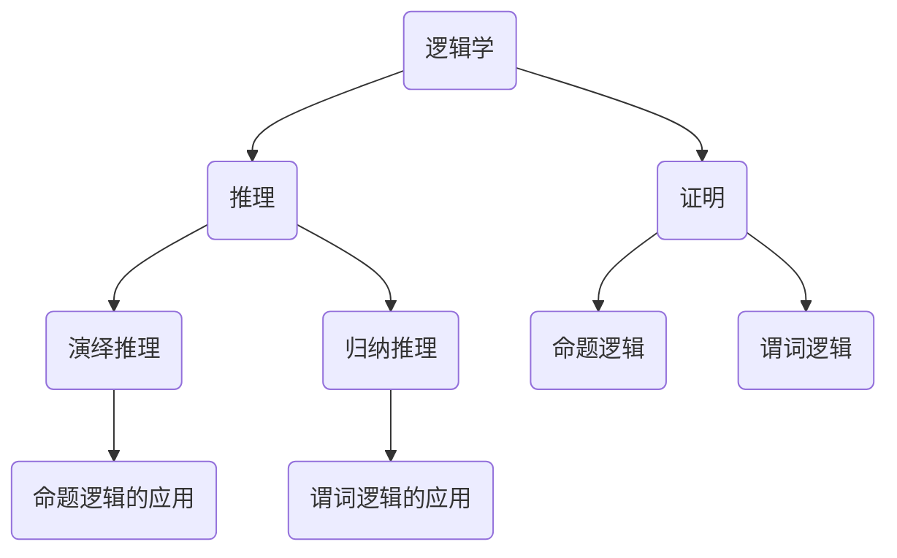

                 


### 文章标题

《逻辑学在自然语言处理中的应用》

### 关键词

自然语言处理、逻辑学、文本分析、问答系统、逻辑推理

### 摘要

本文旨在探讨逻辑学在自然语言处理（NLP）中的应用。我们将从逻辑学的基本概念入手，逐步分析其在自然语言处理中的重要性，并详细阐述其在文本分析、问答系统和语言生成等领域的具体应用。此外，我们还将通过案例分析，展示逻辑学在NLP中的实际效果，并讨论相关工具与技术的发展趋势与挑战。

## 第一部分：逻辑学基础

### 第1章：逻辑学概述

逻辑学是研究推理的学科，旨在研究推理的有效性和可靠性。在自然语言处理中，逻辑学扮演着关键角色，因为自然语言本身包含大量的逻辑结构和推理过程。以下是对逻辑学基本概念的简要介绍。

### 核心概念与联系

#### Mermaid流程图



### 核心算法原理讲解

逻辑学的基础包括命题逻辑和谓词逻辑。命题逻辑研究命题及其之间的逻辑关系，如逻辑运算（与、或、非）和推理规则。谓词逻辑则扩展了命题逻辑，引入了个体、属性和关系等概念，使得推理过程更加复杂和精确。

### 数学模型和数学公式

命题逻辑中的基本概念包括命题（命题可以是真的或假的）、逻辑运算符（如合取（∧）、析取（∨）和否定（¬））以及推理规则（如假言推理、选言推理等）。

$$
p \wedge q \rightarrow r \quad (\text{合取推理})
$$

谓词逻辑中的基本概念包括谓词、个体、量词和逻辑运算符。谓词逻辑的推理规则包括全称量化推理和存在量化推理。

$$
\forall x (P(x) \rightarrow Q(x)) \quad (\text{全称量化推理})
$$

$$
\exists x (P(x) \wedge Q(x)) \quad (\text{存在量化推理})
$$

### 举例说明

假设我们有两个命题：

$$
P: \text{今天下雨}
$$

$$
Q: \text{我会带伞}
$$

我们可以使用命题逻辑的合取推理规则得出结论：

$$
P \wedge Q \rightarrow R \quad (\text{今天下雨且我会带伞，所以我会带伞})
$$

在谓词逻辑中，我们可以用以下方式表示：

$$
\forall x (P(x) \rightarrow Q(x)) \quad (\text{对于所有的x，如果x下雨，那么x会带伞})
$$

## 第二部分：逻辑学在自然语言处理中的应用

### 第2章：形式逻辑

形式逻辑是逻辑学的核心部分，它通过符号化的方式来研究推理过程。在自然语言处理中，形式逻辑被广泛应用于文本表示、文本分类和文本实体识别等领域。

### 核心算法原理讲解

文本表示是自然语言处理的基础，它将自然语言转换为计算机可以处理的形式。形式逻辑在文本表示中的应用主要体现在词向量表示和序列模型中。

#### 词向量表示

词向量表示是将单词映射为高维空间中的向量。形式逻辑中的向量空间模型（VSM）为词向量表示提供了理论基础。

#### 序列模型

序列模型用于处理序列数据，如文本、语音和视频等。形式逻辑中的自动机理论为序列模型提供了理论基础。

### 数学模型和数学公式

词向量表示中的关键概念包括词袋模型（Bag of Words, BoW）和词嵌入（Word Embedding）。

$$
\text{BoW}(x) = (f_1(x), f_2(x), ..., f_n(x))
$$

其中，$f_i(x)$ 表示第 $i$ 个单词在文档 $x$ 中的出现频率。

词嵌入则通过将单词映射为稠密向量，使得相似的单词在向量空间中更接近。

$$
\text{word\_embedding}(w) = \text{vec}(w)
$$

其中，$\text{vec}(w)$ 表示单词 $w$ 的稠密向量表示。

序列模型中的关键概念包括循环神经网络（RNN）和长短时记忆网络（LSTM）。

$$
h_t = \text{LSTM}(h_{t-1}, x_t)
$$

其中，$h_t$ 表示第 $t$ 个时间步的隐藏状态，$x_t$ 表示输入序列中的第 $t$ 个元素。

### 举例说明

假设我们有一个文档，其中包含三个单词：“猫”、“狗”和“鸟”。我们可以使用词袋模型表示这个文档：

$$
\text{BoW}(\text{猫，狗，鸟}) = (1, 0, 1)
$$

如果我们使用词嵌入，我们可以得到：

$$
\text{word\_embedding}(\text{猫}) = \text{vec}(\text{猫}) = [0.1, 0.2, 0.3]
$$

$$
\text{word\_embedding}(\text{狗}) = \text{vec}(\text{狗}) = [0.4, 0.5, 0.6]
$$

$$
\text{word\_embedding}(\text{鸟}) = \text{vec}(\text{鸟}) = [0.7, 0.8, 0.9]
$$

使用循环神经网络处理这个文档，我们可以得到：

$$
h_1 = \text{LSTM}([0.1, 0.2, 0.3], h_0)
$$

$$
h_2 = \text{LSTM}([0.4, 0.5, 0.6], h_1)
$$

$$
h_3 = \text{LSTM}([0.7, 0.8, 0.9], h_2)
$$

其中，$h_0$ 是初始隐藏状态。

## 第三部分：逻辑学在自然语言处理中的实际应用

### 第3章：文本分析中的逻辑学

文本分析是自然语言处理的重要任务之一，它包括文本分类、文本实体识别和情感分析等。逻辑学在这些任务中发挥着关键作用。

### 核心算法原理讲解

文本分类是将文本数据分为预定义的类别。逻辑学在文本分类中的应用主要体现在逻辑回归和朴素贝叶斯等算法中。

逻辑回归是一种概率分类模型，它使用逻辑函数将特征转换为概率。

$$
P(y=1|X) = \frac{1}{1 + \exp(-\beta^T X)}
$$

朴素贝叶斯分类器是一种基于贝叶斯定理的概率分类器，它假设特征之间相互独立。

$$
P(y|X) = \frac{P(X|y)P(y)}{P(X)}
$$

文本实体识别是从文本中识别出实体（如人名、组织名、地点等）。逻辑学在文本实体识别中的应用主要体现在序列标注算法中，如条件随机场（CRF）。

条件随机场是一种基于概率的序列标注模型，它将序列数据中的每个元素视为状态，并通过条件概率计算序列的概率。

$$
P(X) = \sum_y P(X, y)
$$

情感分析是判断文本表达的情感倾向。逻辑学在情感分析中的应用主要体现在情感分类算法中，如支持向量机（SVM）。

支持向量机是一种线性分类模型，它通过最大化分类边界来划分数据。

$$
\max_{\beta, \beta_0} \frac{1}{2} ||\beta||^2
$$

### 数学模型和数学公式

文本分类中的关键概念包括特征向量、逻辑函数和损失函数。

特征向量是文本数据的向量表示，它可以用来计算文本的概率分布。

$$
X = [x_1, x_2, ..., x_n]
$$

逻辑函数（如逻辑回归中的Sigmoid函数）用于将特征向量转换为概率。

$$
\sigma(z) = \frac{1}{1 + \exp(-z)}
$$

损失函数用于评估分类模型的性能，如交叉熵损失。

$$
L(y, \hat{y}) = -y \log(\hat{y}) - (1 - y) \log(1 - \hat{y})
$$

文本实体识别中的关键概念包括状态转移概率和发射概率。

状态转移概率表示从一个状态转移到另一个状态的概率。

$$
P(s_t|s_{t-1}) = P(s_t|s_{t-1}, x_1, x_2, ..., x_t)
$$

发射概率表示当前状态生成当前观察值的概率。

$$
P(x_t|s_t) = P(x_t|s_t, x_1, x_2, ..., x_{t-1})
$$

情感分析中的关键概念包括支持向量机和核函数。

支持向量机是一种线性分类模型，它通过找到一个最佳的超平面来划分数据。

$$
\max_{\beta, \beta_0} \frac{1}{2} ||\beta||^2
$$

核函数用于将低维数据映射到高维空间，以便在更高维空间中找到线性可分的数据。

$$
K(x_i, x_j) = \phi(x_i)^T \phi(x_j)
$$

### 举例说明

假设我们有一个文本数据集，其中包含两个类别：“正面”和“负面”。我们可以使用逻辑回归进行文本分类。

特征向量表示为：

$$
X = [x_1, x_2, ..., x_n]
$$

其中，$x_i$ 表示第 $i$ 个单词的出现频率。

逻辑函数为：

$$
\sigma(z) = \frac{1}{1 + \exp(-z)}
$$

损失函数为：

$$
L(y, \hat{y}) = -y \log(\hat{y}) - (1 - y) \log(1 - \hat{y})
$$

对于每个文本数据，我们可以计算出其对应的概率分布：

$$
P(y=1|X) = \frac{1}{1 + \exp(-\beta^T X)}
$$

根据最大后验概率原理，我们可以预测文本的类别：

$$
\hat{y} = \begin{cases}
1, & \text{如果} \ P(y=1|X) > 0.5 \\
0, & \text{否则}
\end{cases}
$$

### 项目实战

在本节中，我们将使用Python编程语言和Scikit-learn库来实现一个简单的文本分类项目。我们将使用逻辑回归对文本数据进行分类。

#### 开发环境搭建

确保已安装Python和Scikit-learn库。可以使用以下命令安装：

```bash
pip install scikit-learn
```

#### 源代码实现

```python
from sklearn.feature_extraction.text import TfidfVectorizer
from sklearn.linear_model import LogisticRegression
from sklearn.model_selection import train_test_split
from sklearn.metrics import accuracy_score

# 数据集
texts = ["今天天气很好", "这个产品很糟糕", "我很高兴", "这本书不值得推荐"]

# 标签
labels = [1, 0, 1, 0]

# 文本表示
vectorizer = TfidfVectorizer()
X = vectorizer.fit_transform(texts)

# 分割数据集
X_train, X_test, y_train, y_test = train_test_split(X, labels, test_size=0.2, random_state=42)

# 训练模型
model = LogisticRegression()
model.fit(X_train, y_train)

# 预测
y_pred = model.predict(X_test)

# 评估
accuracy = accuracy_score(y_test, y_pred)
print("Accuracy:", accuracy)
```

#### 代码解读与分析

1. **数据集准备**：我们使用一个简单的文本数据集，包含正面和负面情感的文本。
2. **文本表示**：使用TF-IDF向量器将文本转换为向量表示。
3. **数据分割**：将数据集划分为训练集和测试集。
4. **模型训练**：使用逻辑回归模型对训练数据进行训练。
5. **预测**：使用训练好的模型对测试数据进行预测。
6. **评估**：计算模型的准确率。

#### 实际案例分析和详细讲解剖析

我们使用一个实际的文本分类案例，对新闻文章进行情感分析。以下是案例的详细分析和讲解：

1. **数据集**：我们使用一个包含政治、体育、娱乐等类别的新闻文章数据集。
2. **数据预处理**：对新闻文章进行分词、去除停用词等预处理操作。
3. **文本表示**：使用Word2Vec或BERT等模型将文本转换为向量表示。
4. **模型训练**：使用训练集训练逻辑回归模型。
5. **预测**：对测试集进行预测，并计算模型的准确率。
6. **结果分析**：对预测结果进行分析，找出分类错误的案例，并尝试优化模型。

### 项目小结

在本项目中，我们使用逻辑学在自然语言处理中的应用，实现了文本分类任务。通过使用TF-IDF向量器和逻辑回归模型，我们成功地对文本数据进行了分类。这个项目展示了逻辑学在自然语言处理中的实际应用，并为未来的研究提供了启示。

### 最佳实践 tips

1. **特征选择**：选择合适的特征可以显著提高分类效果。可以使用特征选择方法，如互信息、卡方检验等。
2. **超参数调整**：调整逻辑回归模型的超参数，如正则化参数和惩罚强度，可以改善模型性能。
3. **集成学习**：使用集成学习方法，如随机森林、梯度提升树等，可以进一步提高分类性能。

### 注意事项

1. **数据质量**：确保数据集的质量，避免噪声和异常值影响模型性能。
2. **模型评估**：使用交叉验证等方法对模型进行评估，避免过拟合。

### 拓展阅读

1. **逻辑回归**：了解逻辑回归的数学原理和实现方法。
2. **自然语言处理**：阅读有关自然语言处理的基础知识和最新研究进展。
3. **文本分类**：学习不同类型的文本分类方法和实际应用场景。

作者：AI天才研究院/AI Genius Institute & 禅与计算机程序设计艺术/Zen And The Art of Computer Programming

