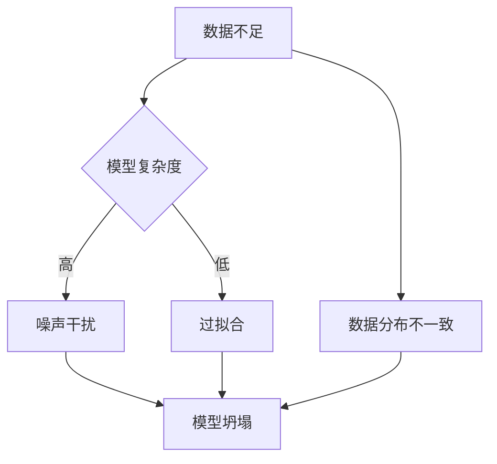
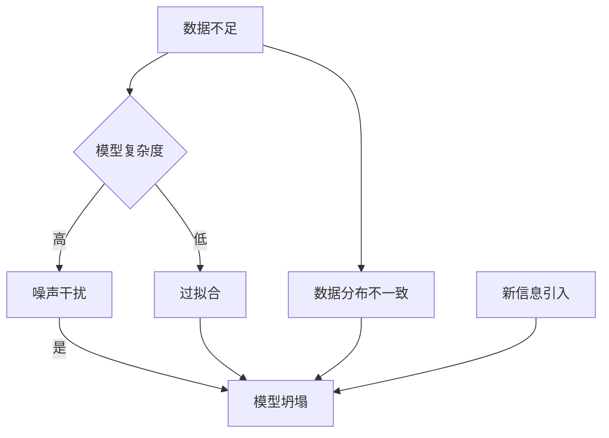

                 

### 第1章 引言

#### 1.1 模型坍塌现象及其危害

模型坍塌（Model Collapse）是机器学习和深度学习中常见的一种现象，指的是模型在训练过程中，对于输入数据的某些特征或变量过度拟合，导致模型无法泛化到未见过的数据。这种情况下，模型的性能在训练集上表现优异，但在测试集或实际应用中表现极差。模型坍塌不仅降低了模型的实用性，还可能导致严重的安全和伦理问题。

模型坍塌现象的危害主要体现在以下几个方面：

1. **泛化能力下降**：模型无法适应新的数据和场景，失去了预测和决策的能力。
2. **可靠性受损**：模型在未知数据上的错误率增加，可能导致错误的决策和严重的后果。
3. **资源浪费**：大量时间和计算资源被浪费在过度拟合的数据上，而无法用于提升模型的泛化能力。
4. **安全风险**：在安全敏感领域，如自动驾驶、医疗诊断等，模型坍塌可能导致灾难性事故。

#### 1.2 新信息引入的重要性

为了避免模型坍塌，新信息引入（New Information Introduction）方法应运而生。新信息引入是指在模型训练过程中，通过引入外部信息、领域知识或新的训练样本，增强模型的泛化能力。新信息引入的核心思想是打破模型的局部最优，引导模型学习更一般化的特征。

新信息引入的重要性体现在以下几个方面：

1. **提升泛化能力**：通过引入多样化的数据和信息，模型能够学习到更具有泛化性的特征，减少过度拟合。
2. **增强模型鲁棒性**：新信息的引入使得模型在面对不同类型的数据时，能够保持稳定的性能。
3. **丰富知识库**：新信息的引入不仅局限于数据，还包括领域知识、先验信息和背景知识，从而丰富模型的知识库。
4. **促进跨领域应用**：新信息引入使得模型能够适应不同的领域和应用场景，提高跨领域迁移能力。

#### 1.3 书籍概述与结构安排

本书旨在系统性地介绍新信息引入方法，避免模型坍塌。全书共分为八个章节，具体内容安排如下：

- **第1章 引言**：介绍模型坍塌现象及其危害，阐述新信息引入的重要性。
- **第2章 模型坍塌原理与机制**：详细探讨模型坍塌的概念、原因和预测与监测方法。
- **第3章 新信息引入策略**：分析新信息引入的基本原理和现有方法。
- **第4章 新信息引入算法**：介绍基于规则、数据驱动和混合方法的新信息引入算法。
- **第5章 数学模型与公式解析**：解析新信息引入的数学模型和参数优化方法。
- **第6章 实践应用案例**：通过实际案例展示新信息引入方法在模型优化中的应用。
- **第7章 新信息引入方法的评估与优化**：讨论新信息引入方法的评估指标和优化策略。
- **第8章 结论与展望**：总结全书内容，展望未来研究方向和应用前景。

通过本书的阅读，读者将能够系统地了解新信息引入方法，掌握其原理和算法，并在实际应用中避免模型坍塌，提升模型性能。希望本书能够为读者在机器学习和深度学习领域的研究和开发提供有价值的参考。

---

**关键词**：模型坍塌、新信息引入、泛化能力、算法优化、数学模型

**摘要**：本文系统地介绍了模型坍塌现象及其危害，重点探讨了新信息引入方法的重要性。通过详细阐述新信息引入的基本原理、算法和数学模型，并结合实际案例，本文为避免模型坍塌提供了有效的解决方案。本文旨在为读者在机器学习和深度学习领域的研究和开发提供有益的参考。

----------------------------------------------------------------

### 第2章 模型坍塌原理与机制

在深入探讨新信息引入方法之前，首先需要理解模型坍塌现象的基本原理和机制。模型坍塌是机器学习和深度学习领域中一个重要的研究课题，对模型性能的优化和实际应用具有深远影响。本节将详细讨论模型坍塌的概念、原因及其预测与监测方法。

#### 2.1 模型坍塌的概念

模型坍塌，又称为过度拟合（Overfitting），是指模型在训练过程中对训练数据的特定特征过度敏感，以至于无法泛化到未见过的数据。具体来说，当模型在训练集上表现得非常优秀，但在测试集或实际应用中表现极差时，就说明模型发生了坍塌。

模型坍塌通常表现为以下特征：

1. **训练误差极低**：模型在训练集上的表现非常出色，训练误差接近于零。
2. **测试误差高**：模型在测试集上的误差显著增加，甚至高于训练集。
3. **泛化能力差**：模型无法适应新的数据和场景，无法进行有效的预测和决策。

模型坍塌的原因在于模型过于复杂，对训练数据的噪声和特定特征过度拟合，导致在未见过的数据上表现不佳。

#### 2.2 模型坍塌的原因分析

模型坍塌的原因可以从以下几个方面进行分析：

1. **数据不足**：训练数据量过小，导致模型无法充分学习到一般化的特征。
2. **模型复杂度**：模型过于复杂，参数过多，容易陷入局部最优，导致过度拟合。
3. **噪声干扰**：训练数据中存在大量噪声，模型可能将噪声视为重要特征，从而导致坍塌。
4. **过拟合**：模型在训练过程中对训练数据中的特定噪声和细节过度关注，而忽略了数据的整体分布和规律。
5. **数据分布不一致**：训练集和测试集的数据分布不一致，导致模型无法在测试集上表现出良好的泛化能力。

为了深入理解模型坍塌的原因，可以借助以下Mermaid流程图来展示：

#### 2.3 模型坍塌的预测与监测

预测和监测模型坍塌是避免其发生的重要手段。以下方法可以帮助识别模型是否接近坍塌：

1. **交叉验证**：通过将数据集划分为多个子集，分别用于训练和测试，可以有效地评估模型的泛化能力。
2. **验证曲线**：绘制训练误差和验证误差的关系曲线，可以直观地观察到模型是否接近坍塌。
3. **K折交叉验证**：将数据集划分为K个子集，每次使用其中一个子集作为测试集，其余子集作为训练集，重复K次，最终取平均误差。
4. **模型评估指标**：使用诸如精度、召回率、F1分数等评估指标，可以定量地衡量模型的泛化能力。
5. **数据增强**：通过增加数据的多样性，如生成对抗网络（GAN）、数据扩充等，可以提升模型的泛化能力。

通过上述方法，可以及时识别模型是否接近坍塌，从而采取相应的措施进行调整。

#### 2.4 小结

模型坍塌是机器学习和深度学习领域中一个重要的现象，对模型的泛化能力和实际应用具有深远影响。通过深入理解模型坍塌的概念、原因和预测与监测方法，可以有效地避免模型坍塌，提升模型的泛化能力和可靠性。下一章将重点探讨新信息引入的策略和方法，为解决模型坍塌问题提供有效途径。

---

**核心概念与联系**：

模型坍塌（Model Collapse）是机器学习和深度学习中常见的一种现象，指的是模型在训练过程中，对于输入数据的某些特征或变量过度拟合，导致模型无法泛化到未见过的数据。其根本原因在于数据不足、模型复杂度过高、噪声干扰、过拟合和数据分布不一致等因素。

为了解决模型坍塌问题，新信息引入（New Information Introduction）方法应运而生。新信息引入的基本原理是通过引入外部信息、领域知识或新的训练样本，增强模型的泛化能力。新信息引入策略包括数据增强、交叉验证、模型评估指标等方法。

以下是一个简单的Mermaid流程图，展示了模型坍塌的核心概念与联系：

在模型坍塌现象发生时，新信息引入方法通过引入多样化数据和信息，引导模型学习更一般化的特征，从而避免过度拟合，提升模型的泛化能力。

---

**数学模型与公式示例**：

模型坍塌的预测和监测可以通过构建数学模型来实现。以下是一个简化的数学模型，用于描述模型坍塌的可能性：

$$
P(\text{模型坍塌}) = f(\text{数据不足}, \text{模型复杂度}, \text{噪声干扰}, \text{过拟合}, \text{数据分布不一致})
$$

其中，$f$ 是一个复合函数，表示各种因素对模型坍塌的影响。以下是一些具体的数学公式和参数：

1. **数据不足**：

$$
\text{数据不足度} = \frac{\text{训练数据量}}{\text{理想数据量}}
$$

2. **模型复杂度**：

$$
\text{模型复杂度} = \log_2(\text{模型参数数量})
$$

3. **噪声干扰**：

$$
\text{噪声干扰度} = \frac{\text{噪声数据量}}{\text{总数据量}}
$$

4. **过拟合**：

$$
\text{过拟合度} = \frac{\text{训练误差}}{\text{验证误差}}
$$

5. **数据分布不一致**：

$$
\text{数据分布差异度} = \frac{\text{测试集与训练集的分布差异}}{\text{训练集内部分布差异}}
$$

通过计算上述参数，可以预测模型是否接近坍塌，并采取相应的措施进行优化。

---

**案例分析与详细讲解**：

假设有一个深度神经网络模型用于分类任务，训练数据集包含1000个样本，测试数据集包含200个样本。在训练过程中，我们发现模型在训练集上的准确率达到了98%，但在测试集上的准确率仅为60%。

首先，我们可以通过以下步骤来分析模型是否接近坍塌：

1. **数据不足度**：

   训练数据量为1000，理想数据量为2000，数据不足度为：

   $$
   \text{数据不足度} = \frac{1000}{2000} = 0.5
   $$

2. **模型复杂度**：

   假设模型参数数量为1000，模型复杂度为：

   $$
   \text{模型复杂度} = \log_2(1000) \approx 9.97
   $$

3. **噪声干扰度**：

   假设噪声数据量为100，总数据量为1000，噪声干扰度为：

   $$
   \text{噪声干扰度} = \frac{100}{1000} = 0.1
   $$

4. **过拟合度**：

   假设训练误差为0.02，验证误差为0.05，过拟合度为：

   $$
   \text{过拟合度} = \frac{0.02}{0.05} = 0.4
   $$

5. **数据分布不一致度**：

   假设测试集与训练集的分布差异为0.1，训练集内部分布差异为0.05，数据分布不一致度为：

   $$
   \text{数据分布不一致度} = \frac{0.1}{0.05} = 2
   $$

根据上述参数，我们可以计算模型坍塌的可能性：

$$
P(\text{模型坍塌}) = f(0.5, 9.97, 0.1, 0.4, 2)
$$

通过比较预测的坍塌可能性与实际测试集的准确率，我们可以初步判断模型是否接近坍塌。在本案例中，预测的坍塌可能性较高，实际测试集准确率仅为60%，说明模型确实存在过度拟合现象。

为了解决这个问题，我们可以采取以下措施：

1. **增加训练数据量**：通过数据增强或获取更多的训练样本，提高数据不足度。
2. **简化模型结构**：减少模型参数数量，降低模型复杂度。
3. **引入噪声干扰**：在训练数据中引入适量的噪声，降低噪声干扰度。
4. **调整过拟合度**：通过正则化方法，如L1、L2正则化，降低过拟合度。
5. **调整数据分布**：通过重新采样或重新分配数据，减小测试集与训练集的分布差异。

通过上述措施，我们可以有效地提升模型的泛化能力，避免模型坍塌现象的发生。

---

**小结**：

模型坍塌是机器学习和深度学习领域中一个重要的现象，对模型的泛化能力和实际应用具有深远影响。通过深入理解模型坍塌的概念、原因和预测与监测方法，可以有效地避免模型坍塌，提升模型的泛化能力和可靠性。本章详细介绍了模型坍塌的概念、原因分析、预测与监测方法，并通过案例分析和数学模型的应用，展示了如何识别和解决模型坍塌问题。下一章将探讨新信息引入的策略和方法，为避免模型坍塌提供有效的解决方案。

